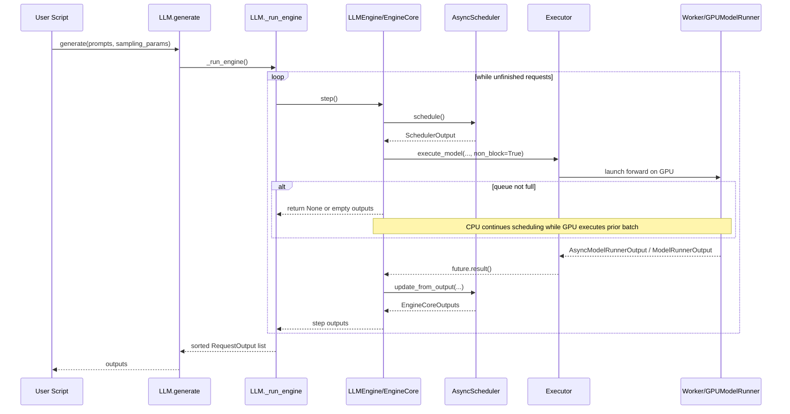
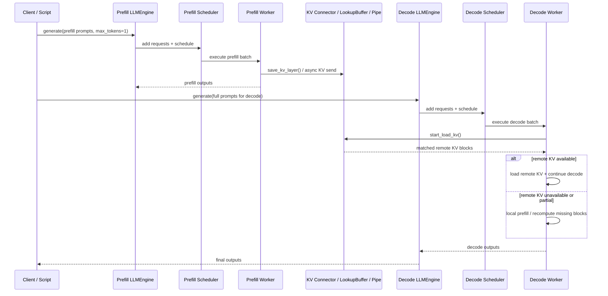

# vLLM 异步调度与 PD 分离实现分析报告

## 1. 报告目标

本文基于当前仓库代码，对 `examples/offline_inference/basic/basic.py` 中启用
`async_scheduling=True` 的推理流程进行详细分析，并回答以下问题：

1. vLLM 当前架构下异步调度的完整实现路径是什么。
2. 在 PD 分离（Prefill / Decode Disaggregation）场景下，异步调度如何落地。
3. 如果自研硬件做到了 CUDA 兼容，还需要具备哪些软件栈基础，才能真正支撑 vLLM 的异步调度与 PD 分离。
4. 实际适配时需要重点注意哪些问题。

本文只基于当前代码仓和文档，不推测仓库外实现。

---

## 2. 入口样例分析

样例文件 `examples/offline_inference/basic/basic.py` 中：

```python
llm = LLM(
    model="/data/chengjie/models/Qwen/Qwen3-4B",
    enforce_eager=True,
    gpu_memory_utilization=0.8,
    tensor_parallel_size=2,
    async_scheduling=True,
)
```

这里最关键的是 `async_scheduling=True`。它并不是简单打开一个“线程池开关”，而是影响了以下几层：

1. 前端配置层：将该参数写入 `SchedulerConfig.async_scheduling`。
2. EngineCore 层：根据该开关选择 `AsyncScheduler`，并决定是否启用 batch queue。
3. Executor 层：决定 `max_concurrent_batches` 是否提升到 2，从而允许“调度下一批”和“执行上一批”重叠。
4. Worker / ModelRunner 层：启用异步输出复制、placeholder token bookkeeping，以及和 spec decode / PP / KV connector 的兼容逻辑。

对应代码位置：

- 入口样例：`examples/offline_inference/basic/basic.py`
- 参数注册：`vllm/engine/arg_utils.py:1206`
- 调度配置：`vllm/config/scheduler.py:138`
- 总配置校验与自动启停：`vllm/config/vllm.py:681`

---

## 3. 从 `LLM.generate()` 到异步调度生效的主链路

### 3.1 前端调用链

离线推理入口是 `vllm/entrypoints/llm.py` 中的 `LLM.generate()`：

1. `LLM.generate()` 调用 `_run_completion()`。
2. `_run_completion()` 最终将请求送入 `LLMEngine`。
3. `LLM._run_engine()` 循环执行 `self.llm_engine.step()`，直到所有请求完成。

关键代码：

- `vllm/entrypoints/llm.py:437` `generate()`
- `vllm/entrypoints/llm.py:1957` `_run_engine()`

`_run_engine()` 的本质很直接：

```python
while self.llm_engine.has_unfinished_requests():
    step_outputs = self.llm_engine.step()
```

说明离线 `LLM.generate()` 并没有自己实现调度，而是不断驱动底层 `LLMEngine.step()`。

### 3.2 `LLMEngine` 与 `EngineCoreClient`

`LLMEngine` 在初始化时创建 `EngineCoreClient`：

- `vllm/v1/engine/llm_engine.py:111`

`EngineCoreClient.make_client()` 决定使用：

- `InprocClient`：进程内 EngineCore
- `SyncMPClient`：多进程同步客户端
- `AsyncMPClient`：多进程异步客户端（主要服务 AsyncLLM）

离线 `LLM` 在默认情况下常走 `InprocClient` 或同步多进程客户端，但不管哪一种，核心调度逻辑都在 `EngineCore` 内部。

### 3.3 配置如何决定异步调度

`SchedulerConfig` 中：

- `vllm/config/scheduler.py:138` 定义 `async_scheduling`
- `vllm/config/scheduler.py:160` 的 `get_scheduler_cls()` 中，如果该值为真，则返回 `AsyncScheduler`

也就是说，异步调度首先体现在“调度器实现类切换”。

### 3.4 配置兼容性检查

`vllm/config/vllm.py:681` 对 `async_scheduling` 做了实际约束：

1. 只支持部分 executor backend：`mp`、`uni`、`external_launcher`。
2. 与 speculative decoding 并非全部兼容，目前只支持 EAGLE / MTP / Draft Model 这一路。
3. 如果配置了不兼容能力，则会自动关闭或直接报错。
4. 若启用 async scheduling，则默认禁用 DP 的 NCCL 同步路径：`disable_nccl_for_dp_synchronization=True`。

因此，`async_scheduling=True` 不是“尽量开启”，而是“满足边界条件才真正启用”。

---

## 4. vLLM 异步调度的核心思想

### 4.1 不只是“异步输出”，而是“调度与执行重叠”

真正的异步调度核心不是 Python future 本身，而是：

> 当 GPU 正在执行第 N 步时，CPU 侧 scheduler / worker 可以开始准备第 N+1 步。

这在设计文档 `docs/design/model_runner_v2.md:43` 中写得很明确：

- scheduler 和 worker 在 GPU 执行 step N 时，准备 step N+1
- 目标是减少 GPU utilization gap
- 关键要求是“核心执行循环像 CUDA stream 一样，没有 CPU 同步点”

### 4.2 `EngineCore` 中的 batch queue 是关键机制

`vllm/v1/engine/core.py` 在初始化时：

- `batch_queue_size = self.model_executor.max_concurrent_batches`
- 如果 `batch_queue_size > 1`，就启用 `batch_queue`
- `self.step_fn = self.step_with_batch_queue`

也就是说，异步调度最终是否真正生效，取决于 executor 能否支持多个并发 batch。

### 4.3 executor 如何配合

#### 单进程 executor

`vllm/v1/executor/uniproc_executor.py:60`

```python
return 2 if self.scheduler_config.async_scheduling else 1
```

#### 多进程 executor

`vllm/v1/executor/multiproc_executor.py:449`

```python
return 2 if pp_size <= 1 and self.scheduler_config.async_scheduling else pp_size
```

这说明：

1. 普通 async scheduling 至少要让 executor 支持双 batch 并发。
2. 如果是 pipeline parallel，则并发批次数由 PP 大小主导。
3. `async_scheduling` 本质上通过提高 `max_concurrent_batches`，让 `EngineCore.step_with_batch_queue()` 得以工作。

---

## 5. `AsyncScheduler` 做了什么

`vllm/v1/core/sched/async_scheduler.py` 中 `AsyncScheduler` 继承自 `Scheduler`，并没有推翻原有调度器，而是在几个关键点上加了 async bookkeeping。

### 5.1 placeholder token 机制

在 `_update_after_schedule()` 中：

1. 对每个 decode request，提前增加 `num_output_placeholders`。
2. speculative decode 场景中，为未来会生成但此时还未回到 CPU 的 token 预留 placeholder。
3. `request.spec_token_ids` 先放占位符，后续由 worker 更新成真实 token id。

对应字段定义在：

- `vllm/v1/request.py:130` `num_output_placeholders`
- `vllm/v1/request.py:132` `discard_latest_async_tokens`

### 5.2 输出回填逻辑

`AsyncScheduler._update_request_with_output()` 中：

1. 根据模型实际返回的 token 数减少 `num_output_placeholders`
2. 对运行中请求，把已确认的 token 写回 KV cache manager
3. 在 prefix cache reset 强制抢占时，通过 `discard_latest_async_tokens` 丢掉最后一个异步 token，避免重复输出

这说明 AsyncScheduler 并不是“另起一套排队算法”，而是在原 Scheduler 之上，增加了**异步结果尚未完全 materialize 时的状态一致性处理**。

---

## 6. `EngineCore.step_with_batch_queue()` 的详细流程

核心函数是：

- `vllm/v1/engine/core.py:420` `step_with_batch_queue()`

它的逻辑可以概括为三阶段。

### 6.1 阶段 A：尽量先把下一批送上 GPU

如果 scheduler 还有请求：

1. `scheduler.schedule()` 产生一个 `SchedulerOutput`
2. `model_executor.execute_model(scheduler_output, non_block=True)` 异步提交模型执行
3. 如果这一步不需要等待结构化输出 token，则立刻发起 `sample_tokens(..., non_block=True)`
4. 把 future 和对应的 `scheduler_output` 一起压入 batch queue

这意味着：

- step N 的计算一旦发出去，CPU 不会马上阻塞等待结果
- 如果队列未满，它会优先继续喂下一批

### 6.2 阶段 B：只有在必须时才等待结果

当队列满了，或者没有新请求可调度时：

1. 从 batch queue 取出最旧的一批
2. 调用 `future.result()` 阻塞拿到输出
3. 再调用 `scheduler.update_from_output()` 更新请求状态

这就是“GPU 执行上一批时，CPU 继续调度下一批”的重叠窗口。

### 6.3 阶段 C：处理 deferred sampling

对于 structured output + speculative decode 等情况：

1. 某些 grammar bitmask 必须等待前一步结果回来才能算
2. `step_with_batch_queue()` 会先拿到 prior step 的真实输出
3. 再补做 `update_draft_token_ids_in_output()` 和 `sample_tokens()`

这也是为什么 async scheduling 对状态管理要求高：有些信息不是 schedule 时就完整可得，而是执行后才能补齐。

---

## 7. Worker / ModelRunner 侧如何配合异步调度

### 7.1 异步输出回传

在 `vllm/v1/executor/multiproc_executor.py` 中：

- 如果开启 `async_scheduling`，WorkerProc 会创建 `async_output_queue`
- 再起一个 `async_output_copy_thread`
- `handle_output()` 不直接把结果塞进 response MQ，而是先放进异步队列

这说明 worker 主执行循环与“结果整理 / 结果回传”被拆开，避免输出处理成为主路径阻塞点。

### 7.2 GPU 侧专门的异步复制流

`vllm/v1/worker/gpu_model_runner.py:589` 开始的代码明确说明：

1. 开启 async scheduling 时，会创建 `async_output_copy_stream`
2. 同时创建 `prepare_inputs_event`
3. 用于同步复用 CPU tensor 与 GPU 异步 copy 的时序

这意味着真正需要的不是“CUDA 能跑 kernel”这么简单，而是：

- 有可工作的独立 stream
- 有 event 语义
- 支持 pinned memory / async copy
- 不会因为隐式同步把整个 pipeline 退化成同步执行

### 7.3 异步调度为什么对 CPU / GPU 共享状态敏感

`docs/design/model_runner_v2.md:51` 之后明确指出：

- 不能有显式同步，例如 `torch.cuda.synchronize`
- 也不能有隐式同步，例如未 pinned 的 `.to("cuda")`
- async execution 会带来 CPU/GPU 并发读写同一块内存的 race condition

因此，vLLM 的 async scheduling 本质上是一个**流式、无 barrier、避免隐式同步**的执行模型。

---

## 8. 异步调度的完整时序流程

下面给出一个基于当前 V1 实现的简化时序。

### 8.1 普通离线推理时序（启用 async_scheduling）



### 8.2 这个时序里谁负责什么

- `LLM / LLMEngine`：前端请求收集、循环驱动、输出整理。
- `AsyncScheduler`：决定这一轮哪些请求、多少 token、哪些 KV block、哪些 placeholder 被调度。
- `Executor`：把调度结果变成异步 worker 调用。
- `GPUModelRunner`：真正执行前向、采样、异步输出复制。

一句话概括：

> Scheduler 决定“做什么”，Executor/Worker 决定“怎么异步地做出来”。

---

## 9. PD 分离场景下异步调度如何实现

## 9.1 PD 分离不是一个 engine 内部的二段调度

根据 `docs/features/disagg_prefill.md:53`：

> PD 分离是运行两个 vLLM 实例：一个 prefill instance，一个 decode instance，然后通过 connector 传输 KV cache 和结果。

所以 PD 分离的本质是：

- Prefill 节点：负责 prompt 的大段 prefill
- Decode 节点：负责持续 decode
- 两边各自保留自己的 scheduler / executor / worker
- 两边之间通过 KV connector 传输中间状态

这点非常重要：

> async scheduling 在 PD 场景下不是“跨实例共享一个异步 scheduler”，而是“每个实例内部各自异步调度，再通过 connector 在实例间交换 KV 状态”。

## 9.2 PD 分离代码与配置入口

关键入口：

- `docs/features/disagg_prefill.md`
- `examples/offline_inference/disaggregated_prefill.py`
- `examples/offline_inference/disaggregated-prefill-v1/prefill_example.py`
- `examples/offline_inference/disaggregated-prefill-v1/decode_example.py`
- `vllm/config/kv_transfer.py`

`KVTransferConfig` 中最重要的字段：

- `kv_connector`
- `kv_role`：`kv_producer` / `kv_consumer` / `kv_both`
- `kv_rank`
- `kv_parallel_size`
- `kv_buffer_device`
- `kv_connector_extra_config`

当前代码明确写了：

- `kv_rank` 典型值：0 代表 prefill，1 代表 decode
- 目前只支持 `1P1D`

见 `vllm/config/kv_transfer.py:39-43`。

## 9.3 Connector 在 scheduler 侧和 worker 侧的双重角色

`docs/features/disagg_prefill.md:76-79` 写得很清楚：

- Scheduler connector：位于 scheduler 进程，负责调度 KV 传输操作
- Worker connector：位于 worker 进程，负责真正执行 KV 收发

`vllm/distributed/kv_transfer/kv_connector/v1/base.py` 对这个分工做了代码化：

- scheduler-side API：
  - `get_num_new_matched_tokens()`
  - `update_state_after_alloc()`
  - `update_connector_output()`
  - `request_finished()`
- worker-side API：
  - `start_load_kv()`
  - `wait_for_layer_load()`
  - `save_kv_layer()`
  - `wait_for_save()`
  - `get_finished()`

这意味着 PD 分离中的异步并不是只发生在 compute 上，还发生在 KV 传输上。

## 9.4 Worker 内部如何把 KV 传输嵌入 forward 路径

`vllm/v1/worker/kv_connector_model_runner_mixin.py` 显示：

1. scheduler 在每一轮 `SchedulerOutput` 中带上 `kv_connector_metadata`
2. worker 侧先 `bind_connector_metadata()`
3. 在 forward context 中调用 `start_load_kv()`
4. forward 完成后调用 `wait_for_save()`、`get_finished()`、`get_block_ids_with_load_errors()` 等接口

这说明 PD 分离在 worker 侧的实现方式是：

> 把 KV load / save 直接嵌入 execute_model 的生命周期，让 KV 传输和前向过程尽可能重叠。

## 9.5 `LookupBuffer` 为什么重要

`vllm/distributed/kv_transfer/README.md:15` 解释了一个很关键的问题：

- Prefill 侧处理请求顺序可能是 A -> B -> C
- Decode 侧真正需要的顺序可能是 C -> A -> B

如果只有 FIFO pipe，顺序一乱就很难对齐。因此增加：

- Pipe：做张量传输
- LookupBuffer：根据 token / request key 做匹配
- Connector：把 vLLM runtime 与上述能力接起来

这也是 PD 分离能和异步调度共存的核心前提：

> 调度顺序与传输顺序可以不同，但 decode 侧仍能按需取到对应 KV。

---

## 10. PD 分离场景的时序流程

### 10.1 Prefill 与 Decode 分离时序



### 10.2 在 PD 下 async scheduling 的真实含义

PD 分离场景下要分两层理解“异步”：

1. **实例内异步调度**：prefill instance 和 decode instance 各自内部仍可使用 async scheduling，重叠 scheduler 与 GPU 执行。
2. **实例间异步传输**：connector 的 load / save 也是异步的，且可能与前向执行重叠。

所以 PD 场景实际上是双层异步：

- 计算层异步
- KV 传输层异步

---

## 11. 如果硬件做到 CUDA 兼容，还需要哪些软件栈基础

这是最关键的落地问题。当前代码已经说明：

> “CUDA 兼容”只意味着有机会复用 vLLM 的大部分 GPU 路径，但远不足以自动支持 async scheduling 与 PD 分离。

下面按照必须具备的能力分层说明。

### 11.1 PyTorch 设备后端必须足够完整

至少要支持：

1. 设备张量分配、stream、event、异步 H2D / D2H copy。
2. `non_blocking=True` 路径真正异步，而不是表面兼容、实际同步。
3. pinned memory 语义可用。
4. `torch.distributed` 基础能力可用，至少能支撑 TP / PP / KV connector 需要的通信模型。

为什么这是硬要求：

- `gpu_model_runner.py` 明确依赖 `torch.cuda.Stream()` 与 `torch.Event()`。
- `model_runner_v2.md` 明确要求避免隐式同步。
- 如果 `.to(device, non_blocking=True)` 退化成同步，async scheduling 的收益会明显消失。

### 11.2 CUDA 图 / graph capture 相关能力

vLLM 整体并不只依赖 eager 路径。尽管示例里设置了 `enforce_eager=True`，但仓库大量路径仍默认面向 CUDA graph 优化。

至少要明确两件事：

1. 如果你们硬件暂时不具备稳定 graph capture，可以通过 eager 模式先跑通。
2. 但若要获得主线性能，最终仍要具备稳定的 graph capture / replay 能力。

证据：

- `docs/features/README.md:68` 把 CUDA graph 单列为硬件能力项。
- `docs/design/model_runner_v2.md:188` 把显式 CUDA graph 管理作为核心设计。

### 11.3 Triton / 自定义 kernel 生态

vLLM 的高性能路径大量依赖 Triton 或 Triton 风格 kernel、定制采样、attention backend、自定义输入准备等。

需要具备：

1. 至少一种稳定可维护的 kernel 实现方案：
   - Triton 兼容
   - 或者自研 kernel + PyTorch extension
2. attention backend 的可用实现
3. sampler / logits 处理相关 kernel 支持

原因：

- `model_runner_v2.md` 中明确强调 GPU-native input metadata preparation、Triton-native sampler。
- 如果只是“算子 API 名字兼容”，但 Triton / kernel 生态不兼容，则很难达到 vLLM 的 async-first 设计目标。

### 11.4 UVA / host-device 访问语义

设计文档 `model_runner_v2.md:141` 提到 MRV2 某些路径依赖 UVA，让 GPU 能直接访问 CPU 侧大张量。

即使当前 V1 代码不是所有路径都强依赖 UVA，你们也至少需要确认：

1. host memory 与 device memory 的地址空间协作机制
2. pinned host buffer 的性能与一致性
3. 异步 copy 与 host 端写入不会产生不可控 race

如果这部分做不好，最常见的结果不是“功能不可用”，而是：

- 性能退化
- 隐式同步增多
- 偶发错误或数据竞争

### 11.5 通信栈与分布式栈

如果只想跑单机单卡，也许只要单设备 PyTorch backend 即可。但要支撑 vLLM 主流能力，至少还要考虑：

1. `torch.distributed` 兼容层
2. 点对点和 collective 通信
3. KV transfer connector 所依赖的设备间 / 主机间数据传输能力
4. 若要做 PD 分离，至少要有一条稳定的 KV 传输数据面

从仓库看，PD 支持的 connector 包括：

- ExampleConnector
- NixlConnector
- P2pNcclConnector
- MooncakeConnector
- LMCacheConnectorV1
- MultiConnector
- OffloadingConnector

这说明 PD 分离并不依赖唯一一种通信方案，但一定依赖“某种可异步传输 KV 的数据面”。

### 11.6 运行时与驱动能力

还需要至少具备：

1. 稳定的 runtime / driver
2. 设备内存管理能力
3. 页面粒度 KV cache 所需的访存和 block copy 语义
4. Host/Device 间异步传输 API
5. 故障可观测性：event、stream、OOM、copy failure 能被上报到 PyTorch / connector 上层

否则会在以下位置出问题：

- KV load failure
- async output copy thread 无法稳定收敛
- graph capture 或 stream overlap 退化

---

## 12. 建议的软件栈分层

如果你们公司要把“CUDA 兼容硬件 + vLLM async scheduling + PD 分离”真正跑起来，建议的软件栈最少要分为五层：

### 第 1 层：设备与驱动层

- 设备驱动
- 内存管理
- stream / event / async memcpy
- graph capture 基础能力

### 第 2 层：PyTorch 设备后端层

- 张量创建/拷贝/同步语义
- autograd 不是重点，但 runtime 兼容必须稳定
- `torch.distributed` 或等价分布式接口

### 第 3 层：Kernel 与编译层

- attention kernel
- sampler kernel
- Triton 兼容或替代方案
- 可能的 torch.compile / graph path 支撑

### 第 4 层：通信与 KV 传输层

- TP/PP/DP 通信
- KV cache transfer 数据面
- 至少一个可用 connector
- 支持异步 load/save 和错误回报

### 第 5 层：vLLM 适配层

- platform 检测
- capability 检测
- feature gate
- 回退策略（eager / no-graph / no-async / no-PD）

---

## 13. 需要特别注意的问题

### 13.1 “CUDA 兼容”不等于“异步兼容”

最常见误区是：

> 只要大部分 CUDA kernel 能跑，vLLM async scheduling 就自然可用。

实际上不是。异步调度更依赖：

- stream 语义是否真实异步
- H2D / D2H copy 是否支持 non-blocking
- pinned memory 是否有效
- 是否存在隐式同步

### 13.2 先跑通 eager，再谈 graph 与 full async

示例 `basic.py` 就显式设置了 `enforce_eager=True`。这非常有代表性：

建议适配顺序是：

1. 先跑通 eager + 单卡
2. 再跑通 async scheduling
3. 再跑通 TP/PP
4. 再跑通 PD 分离
5. 最后再打开 graph / 更激进优化

### 13.3 PD 分离需要额外的时序一致性与错误恢复

PD 场景比普通 async scheduling 多一层复杂性：

- 请求可能在两个实例间错位
- KV 可能部分命中、部分缺失
- connector 可能异步发送中
- decode 侧可能需要本地补 prefill 或失败重算

这也是为什么 `KVTransferConfig` 里有 `kv_load_failure_policy`，以及 scheduler 会处理 `invalid_block_ids`。

### 13.4 CPU 后端本身就是一个反例

`vllm/platforms/cpu.py:198` 明确把：

```python
scheduler_config.async_scheduling = False
```

这说明在 vLLM 当前设计里，async scheduling 并不是“所有后端都值得启用”的通用能力，而是和设备特性强相关。

对自研 CUDA 兼容后端来说，这条经验非常重要：

> 如果后端缺少真正的异步执行与复制能力，宁可关闭 async scheduling，也不要勉强打开。

### 13.5 功能矩阵要逐项验证，不要一次全开

`docs/features/README.md` 给了 Feature x Hardware 矩阵。即便你的硬件能跑基础生成，也不代表以下能力都已经可用：

- async output
- CUDA graph
- chunked prefill
- speculative decoding
- encoder-decoder
- multimodal

建议把兼容性拆成特性矩阵逐项验收。

---

## 14. 结论

### 14.1 对异步调度本身的结论

当前 vLLM 中的 async scheduling 不是一个单点优化，而是一个跨层协同机制：

- 前端通过 `async_scheduling=True` 写入配置
- `SchedulerConfig` 选择 `AsyncScheduler`
- `EngineCore` 通过 `step_with_batch_queue()` 建立“调度下一批 / 等待上一批结果”的重叠执行模型
- executor 提供多并发 batch 能力
- worker / model runner 提供异步输出复制和状态一致性维护

因此它的本质是：

> 通过 batch queue、future、异步输出复制、placeholder bookkeeping，把 CPU 调度和 GPU 执行尽可能重叠，从而减少 GPU 空泡。

### 14.2 对 PD 分离的结论

PD 分离下并不是单个 async scheduler 横跨 prefill 和 decode，而是：

- 两个独立 vLLM 实例
- 各自内部可以使用 async scheduling
- 通过 KV connector 在实例间异步搬运 KV / hidden states

所以 PD 场景可以理解为：

> “实例内异步调度 + 实例间异步 KV 传输”的双层异步系统。

### 14.3 对自研 CUDA 兼容硬件的结论

如果硬件只做到“CUDA API / kernel 基本兼容”，还不足以高质量支持 vLLM 的 async scheduling。至少还需要：

1. 完整的 PyTorch 设备后端语义
2. 真实可用的 stream / event / async memcpy / pinned memory
3. Kernel / Triton 或等价高性能算子生态
4. 分布式通信与 KV 传输数据面
5. Graph capture、UVA、错误上报与回退策略

如果这些基础不完整，最现实的落地策略应当是：

- 先支持 eager
- 再支持 async scheduling
- 再支持 PD 分离
- 最后逐步补齐 graph 与更复杂特性

---

## 15. 关键代码与文档索引

- 示例入口：`examples/offline_inference/basic/basic.py`
- 离线前端：`vllm/entrypoints/llm.py`
- Engine：`vllm/v1/engine/llm_engine.py`
- EngineCore / batch queue：`vllm/v1/engine/core.py`
- Scheduler 配置：`vllm/config/scheduler.py`
- 全局配置校验：`vllm/config/vllm.py`
- AsyncScheduler：`vllm/v1/core/sched/async_scheduler.py`
- Scheduler 输出更新：`vllm/v1/core/sched/scheduler.py`
- MultiProc Executor：`vllm/v1/executor/multiproc_executor.py`
- UniProc Executor：`vllm/v1/executor/uniproc_executor.py`
- GPU Model Runner：`vllm/v1/worker/gpu_model_runner.py`
- KV transfer 配置：`vllm/config/kv_transfer.py`
- KV transfer 设计：`vllm/distributed/kv_transfer/README.md`
- KV connector 基类：`vllm/distributed/kv_transfer/kv_connector/v1/base.py`
- Worker 侧 KV connector mixin：`vllm/v1/worker/kv_connector_model_runner_mixin.py`
- PD 功能文档：`docs/features/disagg_prefill.md`
- MRV2 async-first 设计文档：`docs/design/model_runner_v2.md`
