# vLLM V1 KV Cache 管理机制分析

> 本文代码以当前分支（`v0.26.0-self`，基线 `v0.26.0`）为准。文中所有代码片段均从本仓库源码摘录，与旧版本（如 v0.12.0）存在的差异会在 [附录 A](#附录-a与旧版本的主要差异) 中集中列出。
>
> 更侧重「混合模型（attention + mamba）多 KV cache group」场景的姊妹篇见
> [design/kv_cache_block_table_and_slot_mapping.md](./design/kv_cache_block_table_and_slot_mapping.md)。

阅读路线：

| 想了解 | 直接看 |
| --- | --- |
| PagedAttention 的分层思想、五个管理元素 | [第 1 章 基本原理](#1-基本原理) |
| kv_cache_group / num_blocks / kv_cache_tensor 怎么算出来 | [第 2 章 容量规划](#2-启动期的容量规划kvcacheconfig-是怎么算出来的) |
| `KVCacheBlock` / `BlockPool` / 空闲链表怎么建出来 | [3.1](#31-blocks-的管理逻辑)、[3.2](#32-blocks-管理数据结构初始化流程) |
| block id 怎么被分配、释放、淘汰 | [3.3 KVCacheManager 运行逻辑](#33-kvcachemanager-运行逻辑) |
| `block_table` / `slot_mapping` 缓冲区怎么初始化 | [4.1 物理层数据结构初始化](#41-物理层数据结构的初始化) |
| 每一步推理如何更新这两个结构 | [4.2 逐步更新逻辑](#42-推理过程中的逐步更新逻辑) |
| `slot_mapping` 的 kernel 怎么算 | [4.3 slot_mapping 的计算](#43-slot_mapping-的计算) |
| attention kernel 怎么消费它们 | [4.4 消费路径](#44-两个张量的消费路径) |

---

## 1. 基本原理

&emsp;&emsp;`PagedAttention` 的核心逻辑是将 Attention 运算中的 KV 值按照虚拟映射的方式管理起来。图中有两个请求 request A 和 B，它们都拥有各自的 `Logic KV Blocks`（逻辑块），通过对应的 `block table`（映射表）找到每个词在 `physical KV blocks`（物理块）中的位置。

&emsp;&emsp;这种设计的优势：

- 能够充分利用显存，降低 KV Cache 导致的存储碎片化问题
- 减少物理显存的反复申请/释放操作，提升效率

&emsp;&emsp;逻辑层由 `KVCacheManager` 管理，物理层由 `ModelRunner` 处理，通过 `Scheduler` 作为信息传递的桥梁，衔接物理层与逻辑层。cache 的管理元素包括：池（pool）、表（table）、块（block）、槽（slot）。

- **slot**：最小管理单元，每个 token 占一个 slot；
- **block**：为请求分配的基本单元，一个 block 包含多个 slot；
- **pool**：逻辑层 block 的管理集合，通过双向链表将 block 数据组织起来；
- **table**：管理请求与数据的映射表，一个 table 可包含多个请求信息，位于物理层；
- **layer**：一整个 tensor，拆分成多个 blocks 使用，对应 attention 的一层，所有请求共用。

<figure align="center">
  <picture>
    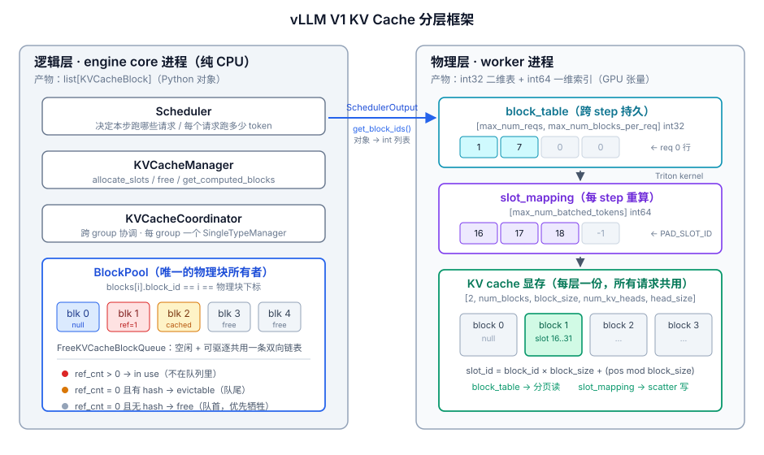
  </picture>
  <figcaption>图 1: KV Cache 静态框架 —— 五个管理元素（pool / table / block / slot / layer）的归属与块的三种状态</figcaption>
</figure>

&emsp;&emsp;模块之间的关键步骤：

1. `Scheduler` 分配资源给请求，通过 `KVCacheManager` 申请逻辑 `blocks`
2. `KVCacheManager` 把 Pool 中空闲的 `blocks` 选中后分配给对应请求
3. 分配好逻辑 `blocks` 后 `Scheduler` 构建 `SchedulerOutput` 传递给 `ModelRunner`
4. `ModelRunner` 为每个请求更新 block table，并生成 `slot_mapping`
5. 计算时把 `slot_mapping` 传入 attention，就能够从物理 KV Blocks 上面找到需要的数据

&emsp;&emsp;两层的边界可以用一句话概括：**逻辑层的产物是 `list[KVCacheBlock]`（Python 对象），物理层的产物是 `int32` 的二维表和 `int64` 的一维索引（GPU 张量）**。中间的转换点是 `KVCacheBlocks.get_block_ids()`，它把对象列表拍平成整数列表，放进 `SchedulerOutput` 跨进程传给 worker。

<figure align="center">
  <picture>
    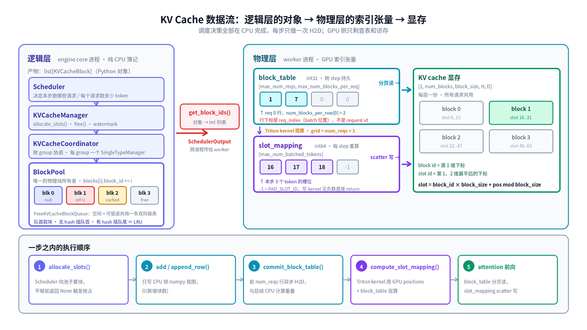
  </picture>
  <figcaption>图 2: 一次 step 内的数据流 —— 左侧纯 CPU 簿记，右侧 GPU 索引与访存，中间由 <code>get_block_ids()</code> 完成「对象 → int 列表」的转换</figcaption>
</figure>

---

## 2. 启动期的容量规划：KVCacheConfig 是怎么算出来的

&emsp;&emsp;第 3、4 章讲的逻辑层和物理层，消费的都是同一份 `KVCacheConfig`。这一章回答它是怎么来的：**层的 spec 从哪来、怎么被分成 kv_cache_group、`num_blocks` 按什么公式算、`kv_cache_tensor` 怎么在层之间共享**。整条流程发生在 `llm.generate()` 之前的引擎启动期，全部在 engine core 进程里同步完成。

&emsp;&emsp;先看结果。`KVCacheConfig` 只有三个字段（`vllm/v1/kv_cache_interface.py`）：

```python{.line-numbers}
@dataclass
class KVCacheConfig:
    num_blocks: int
    """The number of KV cache blocks"""
    kv_cache_tensors: list[KVCacheTensor]
    """How should model runner initialize the KV cache tensors for each layer"""
    kv_cache_groups: list[KVCacheGroupSpec]
    """The kv cache groups of the model."""
```

| 字段 | 谁消费 | 决定了什么 |
| --- | --- | --- |
| `num_blocks` | 逻辑层 `BlockPool` | 池子里有多少个 `KVCacheBlock` 对象、并发上限 |
| `kv_cache_tensors` | 物理层 `_allocate_kv_cache_tensors` | 分配几块裸显存、每块多大、被哪些 layer 共享 |
| `kv_cache_groups` | 两层都要 | 有几张 block table、每张的 `block_size` 和 `max_num_blocks_per_req` |

### 2.1 总入口：EngineCore._initialize_kv_caches

&emsp;&emsp;整条链路的编排在 `vllm/v1/engine/core.py`：

```python{.line-numbers}
# ① 向所有 worker 收集「每层的 KV cache spec」
kv_cache_specs = self.model_executor.get_kv_cache_specs()

has_kv_cache = any(kv_cache_spec for kv_cache_spec in kv_cache_specs)
if has_kv_cache:
    # ② 显存 profiling，得到每个 worker 能给 KV cache 用多少字节
    available_gpu_memory = self.model_executor.determine_available_memory()
else:
    # Attention free models don't need memory for kv cache
    available_gpu_memory = [0] * len(kv_cache_specs)

# ③ 核心：分组 + 算 num_blocks + 规划 tensor 布局
kv_cache_configs = get_kv_cache_configs(
    vllm_config, kv_cache_specs, available_gpu_memory
)

# ④ 把结果同步进全局 config，供 scheduler 使用
scheduler_kv_cache_config = generate_scheduler_kv_cache_config(kv_cache_configs)
vllm_config.cache_config.num_gpu_blocks = scheduler_kv_cache_config.num_blocks
kv_cache_groups = scheduler_kv_cache_config.kv_cache_groups
if kv_cache_groups:
    vllm_config.cache_config.block_size = min(
        g.kv_cache_spec.block_size for g in kv_cache_groups
    )
    num_tokens, max_concurrency = get_kv_cache_capacity(
        vllm_config, scheduler_kv_cache_config
    )
    vllm_config.cache_config.kv_cache_size_tokens = num_tokens
    vllm_config.cache_config.kv_cache_max_concurrency = max_concurrency

# ⑤ 下发给所有 worker，真正 malloc 显存
self.model_executor.initialize_from_config(kv_cache_configs)
```

&emsp;&emsp;注意三点：

- `kv_cache_specs` 和 `available_gpu_memory` 都是 **list**，每个 worker 一项。PP 场景下不同 stage 持有的层不同、剩余显存也不同，所以必须逐 worker 收集。
- 步骤 ③ 返回的也是 list，但里面的 `num_blocks` 最后会被统一成所有 worker 的最小值（见 [2.6](#26-跨-worker-对齐取最小-num_blocks)）。
- 启动日志里那两行 `GPU KV cache size: N tokens` 和 `Maximum concurrency for M tokens per request: X.XXx` 就是在步骤 ④ 打印的。

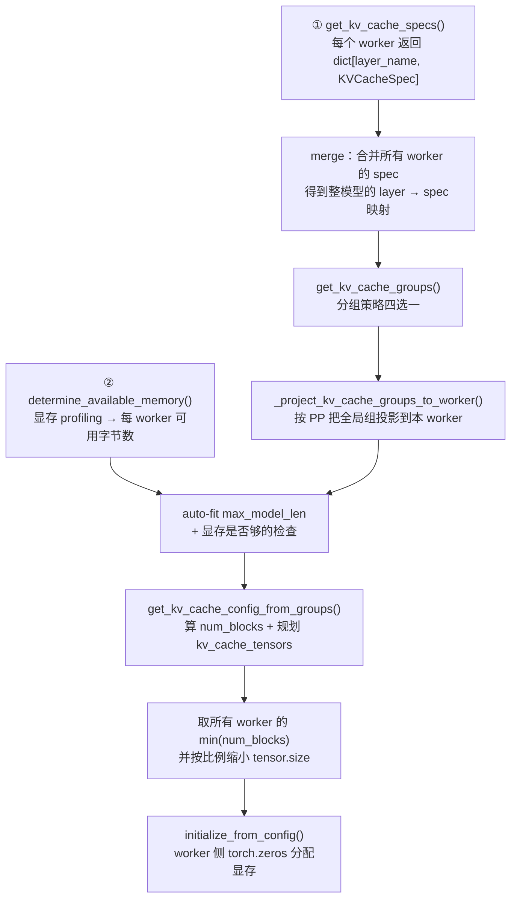

### 2.2 第一步：每层的 KVCacheSpec 从哪来

&emsp;&emsp;`get_kv_cache_specs()` 最终落到 `GPUModelRunner.get_kv_cache_spec()`，它遍历已构建的 attention / mamba layer，为每一层产出一个 `KVCacheSpec`。关键属性只有两个：

| 属性 | 含义 | 由谁决定 |
| --- | --- | --- |
| `block_size` | 一个块装多少 token | `cache_config.block_size`（attention）/ `mamba_block_size`（mamba） |
| `page_size_bytes` | **一个块在一层里占多少字节** | 模型结构 + dtype |

&emsp;&emsp;`page_size_bytes` 是整章的核心量纲，两种 spec 的算法完全不同（`vllm/v1/kv_cache_interface.py`）：

```python{.line-numbers}
# AttentionSpec：与 block_size 成正比
@property
def page_size_bytes(self) -> int:
    if self.page_size_padded is not None:
        assert self.page_size_padded >= self.unpadded_page_size_bytes
        return self.page_size_padded
    return self.unpadded_page_size_bytes
# unpadded ≈ 2(K,V) × block_size × num_kv_heads × head_size × dtype_size

# MambaSpec：由 state 形状决定，与 block_size 无关
@property
def page_size_bytes(self) -> int:
    page_size = sum(
        prod(shape) * get_dtype_size(dtype)
        for (shape, dtype) in zip(self.shapes, self.dtypes)
    )
    if self.page_size_padded is not None:
        assert self.page_size_padded >= page_size
        return self.page_size_padded
    return page_size
```

!!! important
    「**MambaSpec 的 page 与 `block_size` 无关**」是理解混合模型所有怪异行为的钥匙。KV cache manager 只能管理一种大小的 page，而 mamba 的 page 是定死的一整份 recurrent state，于是只能反过来**抬高 attention 的 `block_size`**，直到 attention 的 page 追上 mamba 的 page。这就是为什么混合模型的 `block_size` 会从默认的 16 变成几百。

### 2.3 第二步：显存 profiling 决定 available_memory

&emsp;&emsp;`GPUWorker.determine_available_memory()`（`vllm/v1/worker/gpu_worker.py`）用一次 dummy 前向来测峰值，公式只有一行：

```python{.line-numbers}
self.available_kv_cache_memory_bytes = (
    self.requested_memory                        # 总显存 × gpu_memory_utilization
    - profile_result.non_kv_cache_memory         # 权重 + 激活峰值 + 非 torch 分配
    - cudagraph_memory_estimate_applied          # CUDA graph 预留（可选）
)
```

&emsp;&emsp;三个减数的来源：

```python{.line-numbers}
# requested_memory（vllm/v1/worker/utils.py）
requested_memory = math.ceil(
    init_snapshot.total_memory * cache_config.gpu_memory_utilization
)

# non_kv_cache_memory（三部分相加）
profile_result.non_kv_cache_memory = (
    profile_result.non_torch_increase      # NCCL buffer、cuBLAS workspace 等
    + profile_result.torch_peak_increase   # 前向激活峰值
    + profile_result.weights_memory        # 模型权重
)
```

&emsp;&emsp;两个容易被忽略的点：

- **分布式初始化必须在 snapshot 之前完成**，否则 NCCL 的常驻 buffer 不会被计入 `non_torch_increase`，`available_memory` 会偏大、运行时 OOM。
- 设了 `--kv-cache-memory-bytes` 时**跳过 profiling 直接返回该值**（但仍会跑一次 `profile_run()` 用于编译），此时 `gpu_memory_utilization` 不再生效。

### 2.4 第三步：分组，得到 kv_cache_groups

&emsp;&emsp;`get_kv_cache_groups()`（`vllm/v1/core/kv_cache_utils.py`）是一条**从简单到复杂的短路链**，命中哪条就返回哪条：

```python{.line-numbers}
if vllm_config.scheduler_config.disable_hybrid_kv_cache_manager:
    unify_hybrid_kv_cache_specs(kv_cache_spec)     # 强行把 SWA 当 full attention

if is_kv_cache_type_attention_free(kv_cache_spec):
    return []                                       # ① 无 attention 模型，0 个 group

if is_kv_cache_spec_uniform(kv_cache_spec):
    # ② 所有层 spec 完全一致（绝大多数纯 attention 模型）
    return _get_kv_cache_groups_uniform_spec(kv_cache_spec)
elif uniform_spec := UniformTypeKVCacheSpecs.from_specs(kv_cache_spec):
    # ③ 类型相同但 hidden size 不同 → 仍然只要 1 个 group
    return _get_kv_cache_groups_uniform_type(uniform_spec)
elif grouped_specs := group_and_unify_kv_cache_specs(kv_cache_spec):
    # ④ DeepSeek V4：token 槽位数相同但窗口大小不同
    kv_cache_groups = _get_kv_cache_groups_uniform_groups(grouped_specs)
    _annotate_eagle_groups_deepseek_v4(vllm_config, kv_cache_spec, kv_cache_groups)
    return kv_cache_groups

# ⑤ 一般混合模型：先统一 page size，再按层数切组
filtered_spec = unify_kv_cache_spec_page_size(filtered_spec)
groups = _get_kv_cache_groups_uniform_page_size(filtered_spec)
```

| 分支 | 触发条件 | group 数 |
| --- | --- | --- |
| ① attention-free | 模型没有任何 KV cache 层 | 0（`BlockPool` 仍要 1 个 null block） |
| ② uniform spec | 所有层 spec 相等 | **1**，所有层共用一张 block table |
| ③ uniform type | 类型相同、hidden size 不同 | 1，但每层单独分配显存 |
| ④ uniform groups | DeepSeek V4 式的多窗口 | 每种窗口一组 |
| ⑤ uniform page size | 一般混合模型（attention + mamba / SWA） | 见下文 |

#### 2.4.1 分支 ⑤ 之前：统一 page size

&emsp;&emsp;`unify_kv_cache_spec_page_size()` 的目标是让所有层的 `page_size_bytes` 相等，手段有三种：

```python{.line-numbers}
max_page_size = max(page_sizes)
for layer_name, layer_spec in kv_cache_spec.items():
    if layer_spec.page_size_bytes == max_page_size:
        new_kv_cache_spec[layer_name] = layer_spec              # 已经最大，不动
    elif isinstance(layer_spec, MambaSpec):
        # page 不随 block_size 变化，只能 padding
        new_spec = replace(layer_spec, page_size_padded=max_page_size)
    else:
        layer_page_size = layer_spec.page_size_bytes
        if max_page_size % layer_page_size == 0:
            ratio = max_page_size // layer_page_size
            new_block_size = layer_spec.block_size * ratio      # 抬高 block_size
            new_spec = replace(layer_spec, block_size=new_block_size)
        elif (isinstance(layer_spec, AttentionSpec)
              and layer_spec.indexes_kv_by_block_stride):
            new_spec = replace(layer_spec, page_size_padded=max_page_size)
        else:
            raise NotImplementedError(...)                       # 无法统一，直接报错
    assert new_spec.page_size_bytes == max_page_size
```

| 情况 | 手段 | 代价 |
| --- | --- | --- |
| attention 层且能整除 | **抬高 `block_size`** | 短请求内部碎片变大 |
| mamba 层 | **padding 到 `page_size_padded`** | 浪费 `max - 原始` 字节 |
| attention 层不能整除但后端支持 stride 索引 | padding | 同上 |
| 其余 | `NotImplementedError` | —— |

!!! note
    这里的「抬高 block_size」和平台层 `Platform._align_hybrid_block_size()` 是两处不同的对齐：后者在**模型加载后、按后端支持的 kernel block size** 把 `cache_config.block_size` 整体抬高；前者是**分组时**对个别层的兜底。两者都可能改变 `block_size`，所以启动日志里看到的 `block_size` 与命令行传入的不一致是正常的。

#### 2.4.2 分支 ⑤：按 spec 聚类再切成等长组

&emsp;&emsp;`_get_kv_cache_groups_uniform_page_size()` 分两步。第一步按 spec 相等性聚类：

```python{.line-numbers}
# E.g., 2 full attention layers and 3 sliding window attention layers,
# -> (full.0, full.1), (sw.0, sw.1, sw.2)
same_type_layers: dict[KVCacheSpec, list[str]] = defaultdict(list)
for layer_name, layer_spec in kv_cache_spec.items():
    same_type_layers[layer_spec].append(layer_name)
```

&emsp;&emsp;第二步把每一类切成**层数相同**的若干组，组数由 `group_size` 决定：

```python{.line-numbers}
min_num_layers = min([len(layers) for layers in same_type_layers.values()])
group_size = min_num_layers
max_num_layers = max([len(layers) for layers in same_type_layers.values()])
if max_num_layers < min_num_layers * 1.5:
    # 层数差距不大时用 max，避免过多 padding 层
    # 典型例子：gpt-oss-20b + eagle，12 sw + 13 full
    # 补成 (13 sw, 13 full) 而不是 (12 sw, 24 full)
    group_size = max_num_layers

for layers in same_type_layers.values():
    num_padding_layers = group_size - len(layers) % group_size
    if num_padding_layers != group_size:
        logger.warning("Add %d padding layers, may waste at most %.2f%% KV cache memory",
                       num_padding_layers, num_padding_layers / len(layers) * 100)
    num_groups = cdiv(len(layers), group_size)
    for i in range(num_groups):
        grouped_layers.append(layers[i::num_groups])     # 注意是切片步进，不是连续切
```

&emsp;&emsp;两个设计细节值得单独说：

1. **`group_size` 取「n:1 模式里的那个 1」**。源码 FIXME 写明了这是个启发式：目前所有开源混合模型都是 n:1 的层间隔（Gemma3 是 sw:full = 5:1，LLaMA4 local:full = 3:1），所以取最少的那一类的层数即可。`1.5` 这个阈值是为了照顾投机解码 drafter 给某一类多加几层的情况。
2. **`layers[i::num_groups]` 是步进切片而不是连续切片**。源码注释给了理由 —— PP 场景下，若 stage 0 持有 `full.0, sw.0, sw.1`、stage 1 持有 `full.1, sw.2, sw.3`：
   - 连续切片会得到 `(sw.0, sw.1), (sw.2, sw.3)`，于是 stage 0 的三个组变成 `(full.0), (sw.0, sw.1), (空)`，为了让每组层数一致要补两个 padding 层，白白浪费显存；
   - 步进切片得到 `(sw.0, sw.2), (sw.1, sw.3)`，每个 stage 在每个组里都恰好有一层，零 padding。

&emsp;&emsp;最后 `create_kv_cache_group_specs()` 把每组的多个 spec 合并成一个：

```python{.line-numbers}
for layer_names_one_group in grouped_layer_names:
    layer_specs = [kv_cache_spec[layer_name] for layer_name in layer_names_one_group]
    merged_layer_spec = layer_specs[0].merge(layer_specs)
    kv_cache_groups.append(KVCacheGroupSpec(layer_names_one_group, merged_layer_spec))
```

!!! important
    **group 的顺序由层的遍历顺序决定**，不要假设 attention 一定是 gid 0。混合模型里如果第 0 层是 linear attention，那 mamba group 就排在前面。`GPUModelRunner._get_attention_kv_cache_gid()` 会显式查找第一个 `FullAttentionSpec` 组。

#### 2.4.3 PP 投影

&emsp;&emsp;上面得到的是**全局**分组（基于合并后的整模型 spec）。每个 worker 只持有一部分层，所以要投影一次：

```python{.line-numbers}
def _project_kv_cache_groups_to_worker(global_kv_cache_groups, worker_spec):
    projected_groups = []
    for group in global_kv_cache_groups:
        worker_layer_names = [
            ln for ln in group.layer_names if ln in worker_spec       # 只保留本 worker 的层
        ]
        group_spec = group.kv_cache_spec
        if worker_layer_names and isinstance(group_spec, UniformTypeKVCacheSpecs):
            group_spec = UniformTypeKVCacheSpecs(
                block_size=group_spec.block_size,
                kv_cache_specs={ln: group_spec.kv_cache_specs[ln] for ln in worker_layer_names},
            )
        projected_groups.append(KVCacheGroupSpec(worker_layer_names, group_spec, ...))
    return projected_groups
```

&emsp;&emsp;**group 的数量在所有 worker 上保持一致**（可能有空组），这是「用一个中心化 scheduler 控制所有 worker」的前提 —— scheduler 只维护一套 gid 编号。

### 2.5 第四步：算 num_blocks 与规划 kv_cache_tensors

&emsp;&emsp;`get_kv_cache_config_from_groups()` 按 group 布局分三条路：

```python{.line-numbers}
if len(kv_cache_groups) == 0:
    # Attention free models do not have KV cache.
    # Return num_blocks=1 as BlockPool always needs a null_block.
    return KVCacheConfig(num_blocks=1, kv_cache_tensors=[], kv_cache_groups=kv_cache_groups)

if len(kv_cache_groups) == 1 and isinstance(kv_cache_groups[0].kv_cache_spec,
                                            UniformTypeKVCacheSpecs):
    # 路 A：同类型不同 hidden size，逐层单独分配
    num_blocks = available_memory // kv_cache_groups[0].kv_cache_spec.page_size_bytes
    num_blocks = may_override_num_blocks(vllm_config, num_blocks)
    per_layer_specs = kv_cache_groups[0].kv_cache_spec.kv_cache_specs
    kv_cache_tensors = [
        KVCacheTensor(size=per_layer_specs[ln].page_size_bytes * num_blocks, shared_by=[ln])
        for ln in kv_cache_groups[0].layer_names
    ]
elif _use_packed_kv_cache_config(vllm_config, kv_cache_groups):
    # 路 B：packed 布局（DeepSeek V4 默认 / --enable-cross-layers 显式开启）
    num_blocks, kv_cache_tensors = _get_kv_cache_config_packed(...)
else:
    # 路 C：一般情况
    group_size = max(len(group.layer_names) for group in kv_cache_groups)
    page_size = get_uniform_page_size([g.kv_cache_spec for g in kv_cache_groups])
    num_blocks = get_num_blocks(vllm_config, group_size, available_memory, page_size)
    kv_cache_tensors = []
    for i in range(group_size):
        shared_by = []
        for j in range(len(kv_cache_groups)):
            if i < len(kv_cache_groups[j].layer_names):
                shared_by.append(kv_cache_groups[j].layer_names[i])
        kv_cache_tensors.append(KVCacheTensor(size=page_size * num_blocks, shared_by=shared_by))
```

#### 2.5.1 num_blocks 的公式

```python{.line-numbers}
def get_num_blocks(vllm_config, num_layers, available_memory, page_size) -> int:
    num_blocks = int(available_memory // page_size // num_layers)
    num_blocks = max(num_blocks, 0)
    return may_override_num_blocks(vllm_config, num_blocks)


def may_override_num_blocks(vllm_config, num_blocks: int) -> int:
    if vllm_config.cache_config.num_gpu_blocks_override is not None:
        num_blocks = vllm_config.cache_config.num_gpu_blocks_override
    return num_blocks
```

&emsp;&emsp;即：

```text
num_blocks = available_memory / (page_size × group_size)
```

&emsp;&emsp;分母里的 `group_size` 是**每组的层数**，不是组数。理解这一点的关键在下一小节的共享布局：一个 block id 在**每个 group 的每一层**上都要占一份 page，而 `group_size` 个 tensor 恰好覆盖了所有层。

&emsp;&emsp;`--num-gpu-blocks-override` 会在最后无条件覆盖这个结果。为了让「auto-fit max_model_len」「显存够不够的检查」「per-worker 配置」三处都按同一个有效容量规划，`get_kv_cache_configs()` 会反过来把 `available_memory` 也改掉：

```python{.line-numbers}
override = vllm_config.cache_config.num_gpu_blocks_override
if override is not None:
    adjusted_memory = []
    for groups, avail_mem in zip(projected_groups_per_worker, available_memory):
        if not groups:
            adjusted_memory.append(avail_mem); continue
        bytes_per_block = _pool_bytes_per_block(vllm_config, groups)
        logger.info("Overriding num_gpu_blocks=%d with num_gpu_blocks_override=%d",
                    avail_mem // bytes_per_block, override)
        adjusted_memory.append(override * bytes_per_block)
    available_memory = adjusted_memory
```

&emsp;&emsp;`_pool_bytes_per_block()` 就是上面三条路各自的除数（路 C 下是 `page_size * group_size`），保证两边口径一致。

#### 2.5.2 kv_cache_tensors 的共享布局（路 C）

&emsp;&emsp;这是最反直觉的一段。源码注释给了完整例子：

```text
3 个 group：(full.0, full.1), (sw.0, sw.2), (sw.1, padding)
group_size = 2  →  分配 2 个 tensor，每个 size = page_size × num_blocks

tensor[0]  shared_by = [full.0, sw.0, sw.1]
tensor[1]  shared_by = [full.1, sw.2]
```

&emsp;&emsp;循环的写法就是「第 i 个 tensor 收集每个 group 的第 i 层」：

```python{.line-numbers}
for i in range(group_size):
    shared_by = []
    for j in range(len(kv_cache_groups)):
        if i < len(kv_cache_groups[j].layer_names):
            shared_by.append(kv_cache_groups[j].layer_names[i])
    kv_cache_tensors.append(KVCacheTensor(size=page_size * num_blocks, shared_by=shared_by))
```

!!! important
    「共享」**不是把 tensor 分段切开给各层**。`_reshape_kv_cache_tensors()` 给 `shared_by` 里每个 layer 的视图都覆盖**整块** `page_size × num_blocks` 显存，也就是说这几个 layer 的 KV cache 是**互相 alias** 的。
    <br><br>
    之所以不会互相踩踏，是因为**所有 group 共用同一个 `BlockPool`**：block id 全局唯一，同一时刻一个 id 只会被一个 group 的一个请求持有。所以「每个 group 各有各的 block table」说的是**索引结构独立**，**不是 block id 命名空间独立**。这条不变量一旦被破坏（比如给某个 group 单独发号），显存立刻串写。

&emsp;&emsp;把这条和 `num_blocks` 的公式对上就自洽了：一个 block id 消耗 `group_size` 个 tensor 各一个 page，合计 `page_size × group_size` 字节，因此 `num_blocks = available_memory / (page_size × group_size)`。

### 2.6 跨 worker 对齐：取最小 num_blocks

&emsp;&emsp;各 worker 独立算完后必须对齐，否则中心化的 scheduler 发出的 block id 会在某些 worker 上越界：

```python{.line-numbers}
# Change the num_blocks of each rank to the smallest among all ranks.
# We also need to shrink the tensor size proportionally to avoid
# allocating unused memory.
min_num_blocks = min(cfg.num_blocks for cfg in kv_cache_configs)
for kv_cache_config in kv_cache_configs:
    num_blocks_old = kv_cache_config.num_blocks
    kv_cache_config.num_blocks = min_num_blocks
    for tensor in kv_cache_config.kv_cache_tensors:
        assert tensor.size % num_blocks_old == 0
        tensor.size = tensor.size // num_blocks_old * min_num_blocks
```

&emsp;&emsp;**tensor.size 必须同步等比缩小**，否则显存充裕的那个 worker 会 malloc 一大块永远用不到的显存。

&emsp;&emsp;这也解释了一个常见现象：TP/PP 场景下，只要有一张卡上跑了别的进程，整个实例的 KV cache 容量就会被那张卡拉低到相同水平。

### 2.7 第五步：worker 侧真正分配显存

&emsp;&emsp;`initialize_from_config()` 把 `KVCacheConfig` 下发到每个 worker，最终落到 `GPUModelRunner`。分两步：**先按字节数分配裸 buffer，再按后端要求切视图**。

```python{.line-numbers}
# ① 分配裸显存：以 int8 为单位，只关心字节数
def _allocate_kv_cache_tensors(self, kv_cache_config) -> dict[str, torch.Tensor]:
    kv_cache_raw_tensors: dict[str, torch.Tensor] = {}
    packed_backing: torch.Tensor | None = None
    for kv_cache_tensor in kv_cache_config.kv_cache_tensors:
        if kv_cache_tensor.block_stride > 0:
            # packed 布局：所有 tensor alias 同一块 backing
            if packed_backing is None:
                packed_backing = torch.zeros(kv_cache_tensor.size, dtype=torch.int8,
                                             device=self.device)
            tensor = packed_backing
        else:
            tensor = torch.zeros(kv_cache_tensor.size, dtype=torch.int8, device=self.device)
        for layer_name in kv_cache_tensor.shared_by:
            kv_cache_raw_tensors[layer_name] = tensor    # ← 同一个 tensor 对象给多个 layer
    ...
    return kv_cache_raw_tensors
```

&emsp;&emsp;最后那行 `for layer_name in kv_cache_tensor.shared_by` 就是 alias 的实现：**多个 layer name 指向同一个 `torch.Tensor` 对象**，没有任何切分。

```python{.line-numbers}
# ② 切视图：attention 分支
num_blocks = raw_tensor.numel() // kv_cache_spec.page_size_bytes
num_blocks_per_kv_block = kv_cache_spec.block_size // kernel_block_size
kernel_num_blocks = num_blocks * num_blocks_per_kv_block

kv_cache_shape = attn_backend.get_kv_cache_shape(
    kernel_num_blocks, shape_block_size,
    kv_cache_spec.num_kv_heads, kv_cache_spec.head_size,
    cache_dtype_str=layer_cache_dtype_str,
)
kv_caches[layer_name] = _reshape_attention_kv_cache(
    raw_tensor, kv_cache_spec, kv_cache_shape, kv_cache_stride_order,
    kernel_num_blocks, packing,
)
```

&emsp;&emsp;得到形如 `[2, num_blocks, block_size, num_kv_heads, head_size]` 的视图，**block id 就是第 1 维的下标**。

```python{.line-numbers}
# ② 切视图：mamba 分支，用 as_strided 把一块裸显存切成多个 state 张量
for shape, dtype in zip(kv_cache_spec.shapes, kv_cache_spec.dtypes):
    dtype_size = get_dtype_size(dtype)
    num_element_per_page = kv_cache_spec.page_size_bytes // dtype_size
    target_shape = (num_blocks, *shape)
    stride = torch.empty(target_shape).stride()
    target_stride = (num_element_per_page, *stride[1:])     # 第 0 维步长 = 一整个 page
    tensor = torch.as_strided(
        raw_tensor.view(dtype), size=target_shape, stride=target_stride,
        storage_offset=storage_offset_bytes // dtype_size,
    )
```

&emsp;&emsp;`target_stride[0] = num_element_per_page` 是关键：conv state 和 ssm state 在同一个 page 内首尾相接，靠 `storage_offset` 区分起点，靠 page 大小的步长跨到下一个 block。这样 mamba 层的 block id 同样是第 0 维下标，与 attention 保持一致的语义。

### 2.8 完整链路小结

| 步骤 | 函数 | 输入 | 输出 |
| --- | --- | --- | --- |
| ① 收集 spec | `GPUModelRunner.get_kv_cache_spec()` | 已构建的 layer | `dict[layer_name, KVCacheSpec]`（每 worker 一份） |
| ② 显存 profiling | `GPUWorker.determine_available_memory()` | dummy 前向 | `available_memory`（每 worker 一个字节数） |
| ③ 合并 | `get_kv_cache_configs()` 开头 | 各 worker 的 spec | 整模型的 `merged_kv_cache_specs` |
| ④ 统一 page | `unify_kv_cache_spec_page_size()` | 合并后的 spec | page_size 全相等的 spec |
| ⑤ 分组 | `get_kv_cache_groups()` | 统一后的 spec | `list[KVCacheGroupSpec]` |
| ⑥ PP 投影 | `_project_kv_cache_groups_to_worker()` | 全局组 + 本 worker 的层 | 本 worker 的组（组数不变） |
| ⑦ 算容量 | `get_kv_cache_config_from_groups()` | 组 + available_memory | `num_blocks` + `kv_cache_tensors` |
| ⑧ 跨 worker 对齐 | `get_kv_cache_configs()` 结尾 | 各 worker 的 config | 统一 `min_num_blocks`，等比缩 tensor |
| ⑨ 分配裸显存 | `_allocate_kv_cache_tensors()` | `kv_cache_tensors` | `dict[layer_name, int8 Tensor]`（含 alias） |
| ⑩ 切视图 | `_reshape_kv_cache_tensors()` | 裸 tensor + 后端 shape | `dict[layer_name, 有形状的 Tensor]` |

&emsp;&emsp;三句话记住：

- **`kv_cache_groups` 由「层的 spec 是否相等」决定**，组数 = 不同 spec 的类别数（经过等长切分后可能更多）；每个 group 对应 worker 侧的**一张 block table**。
- **`num_blocks = available_memory / (page_size × group_size)`**，`group_size` 是每组的层数；`--num-gpu-blocks-override` 会连带把 `available_memory` 一起改写以保持口径一致。
- **`kv_cache_tensors` 的数量 = `group_size`**，第 i 个 tensor 被「每个 group 的第 i 层」共享，且是**完整 alias 而非分段**；不串写的保证来自全局唯一的 block id。

---

## 3. 逻辑层

### 3.1 blocks 的管理逻辑

&emsp;&emsp;KV cache 存储是以 `block` 为基本单位组织的。按照需要设定 `block_size`，表示 `block` 中可存储的 tokens 的数量，用 `slot` 来表示 token 在 `block` 中位置，所有的 `block` 都在 `KV Pool` 里面。

&emsp;&emsp;接下来看一下 vLLM `block` 的定义 `KVCacheBlock`，其实例化流程为 `Scheduler -> KVCacheManager -> KVCacheCoordinator -> BlockPool`。

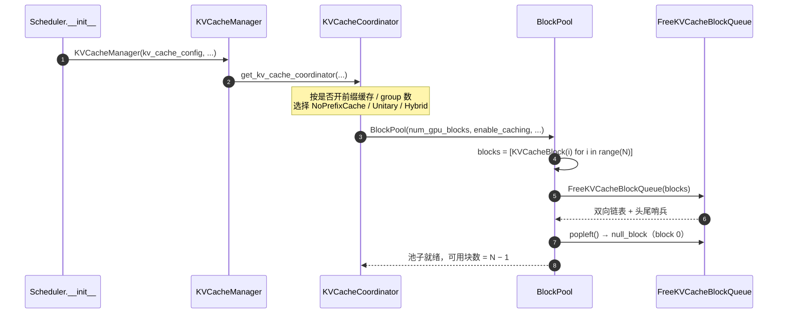

<figcaption align="center">图 3: Block 实例化流程（Scheduler → KVCacheManager → Coordinator → BlockPool）</figcaption>

&emsp;&emsp;在 `BlockPool` 实例化过程中，根据 `num_gpu_blocks` 的数量，创建 `KVCacheBlock` 对象构建 list，该 list 就是 vLLM 中常见的参数 `blocks`。整个 `__init__` 可以拆成四个步骤，下图给出了每步做的事情和最终的池子状态：

<figure align="center">
  <picture>
    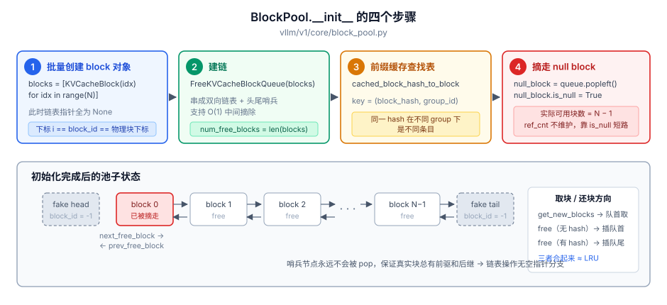
  </picture>
  <figcaption>图 4: BlockPool 初始化的四个步骤，以及建链后的双向链表结构</figcaption>
</figure>

&emsp;&emsp;`KVCacheBlock` 结构具体定义如下所示（代码位置 `vllm/v1/core/kv_cache_utils.py`）：

```python{.line-numbers}
@dataclass(slots=True)
class KVCacheBlock:
    """KV-cache block metadata."""

    # Block ID, ranging from 0 to num_gpu_blocks - 1.
    # 就是物理 KV cache 张量第 1 维的下标
    block_id: int
    # Reference count. 表示有多少请求正在使用该 block
    ref_cnt: int = 0
    # The hash key (block hash + group id) of the block, only available
    # when the block is full and cached.
    # 用作已完成计算块的唯一标志
    _block_hash: BlockHashWithGroupId | None = None
    # Number of prefix tokens covered by _block_hash. For full blocks this is
    # the full block boundary; partial entries can end inside a cache block.
    # 该 hash 覆盖的前缀 token 数，支持「块内部分命中」
    _block_hash_num_tokens: int | None = None

    # Used to construct a doubly linked list for free blocks.
    # These two attributes should only be manipulated by FreeKVCacheBlockQueue.
    prev_free_block: "KVCacheBlock | None" = None
    next_free_block: "KVCacheBlock | None" = None

    # Whether the block is a null block that should never be cached.
    is_null: bool = False
```

&emsp;&emsp;这里要强调一点：**`ref_cnt` 与 `_block_hash` 两个字段交叉出三种状态**，理解这三种状态是读懂后面分配/驱逐逻辑的前提。

| 状态 | `ref_cnt` | `_block_hash` | 在空闲队列里 | 含义 |
| --- | --- | --- | --- | --- |
| In use | > 0 | 可有可无 | 否 | 某个活跃请求正在读/写 |
| Evictable（前缀缓存命中候选） | 0 | 有 | **是** | 内容仍然有效，随时可被别人命中，也随时可能被驱逐 |
| Free | 0 | 无 | 是 | 纯空块 |

&emsp;&emsp;**vLLM V1 没有独立的「已缓存块池」**：被前缀缓存持有的块和真正空闲的块躺在同一条 `free_block_queue` 上，靠 `ref_cnt` 区分。这是 V1 相对 V0 最重要的简化，也意味着 `get_num_free_blocks()` 返回的数字包含了所有前缀缓存块。

&emsp;&emsp;`_block_hash` 只有 setter/getter 而没有直接赋值路径，写入必须走 `set_block_hash()`，且带有「只能设一次」的断言：

```python{.line-numbers}
def set_block_hash(self, block_hash, num_tokens=None) -> None:
    assert self.block_hash is None and self._block_hash_num_tokens is None, (
        "The block already has a hash. This should not happen."
    )
    self._block_hash = block_hash
    self._block_hash_num_tokens = num_tokens

def reset_hash(self):
    """Reset the block hash when the block is evicted."""
    self._block_hash = None
    self._block_hash_num_tokens = None
```

&emsp;&emsp;构建好的 `KVCacheBlock` 之间截止目前并未形成双向链表结构，通过 debug Console 窗口打印 `self.blocks` 信息，可以发现其 `prev_free_block` 以及 `next_free_block` 指向都是 `None`，链表的构建需要通过 `FreeKVCacheBlockQueue` 来完成（即图 4 的第 ② 步，链表的最终形态见图 4 下半部分）。

&emsp;&emsp;用于组织 blocks 的几个关键模块如下：

- **Block Pool**（`BlockPool`）：存储 `KVCacheBlock`，一般初始化时决定数量，可以降低 CPU 侧的操作次数；
- **空闲队列**（`FreeKVCacheBlockQueue`）：空闲块的队列，仅保存头尾哨兵节点指针信息；
- **缓存协调模块**（`KVCacheCoordinator`）：协调不同的 KV cache 组。

```txt{.line-numbers}
# 当前分支中模块的定位位置：
# BlockPool                 vllm/v1/core/block_pool.py
# FreeKVCacheBlockQueue     vllm/v1/core/kv_cache_utils.py
# KVCacheCoordinator        vllm/v1/core/kv_cache_coordinator.py
# KVCacheManager            vllm/v1/core/kv_cache_manager.py
# SingleTypeKVCacheManager  vllm/v1/core/single_type_kv_cache_manager.py
```

### 3.2 blocks 管理数据结构初始化流程

&emsp;&emsp;上文了解了有关 blocks 管理的一些重要数据结构，本小节结合 vLLM 具体代码详细分析主要数据结构的初始化流程。`KVCacheManager` 的实例化是在 `Scheduler.__init__` 函数中完成的，整条调用链见上文图 3。

&emsp;&emsp;主要逻辑包括 `KV cache 块池`、`FreeKVCacheBlockQueue`（空闲队列）的初始化，都是在 `KVCacheCoordinator` 对象的初始化过程中完成的。以示例 demo 为例，调用 `get_kv_cache_coordinator()`（定位 `vllm/v1/core/kv_cache_coordinator.py`）会根据配置选择具体的 coordinator 实现，再通过 `super().__init__()` 初始化父类 `KVCacheCoordinator`。

&emsp;&emsp;coordinator 的三个变体决定了后续的前缀缓存行为，选择规则如下：

| Coordinator | 适用条件 | `find_longest_cache_hit` 行为 |
| --- | --- | --- |
| `KVCacheCoordinatorNoPrefixCache` | 关闭前缀缓存 | 直接返回空，`get_num_common_prefix_blocks()` 恒返回 0 |
| `UnitaryKVCacheCoordinator` | 开启前缀缓存且只有 1 个 group | 单组扫描，无需跨组对齐 |
| `HybridKVCacheCoordinator` | 开启前缀缓存且有多个 group | 定点迭代，让所有 group 在同一个前缀长度上达成一致 |

&emsp;&emsp;在 `KVCacheCoordinator.__init__` 中可以看到 KV Cache block pool 的创建入口，`BlockPool.__init__` 的关键几行如下（`vllm/v1/core/block_pool.py`）：

```python{.line-numbers}
assert isinstance(num_gpu_blocks, int) and num_gpu_blocks > 0
self.num_gpu_blocks = num_gpu_blocks
self.enable_caching = enable_caching
self.hash_block_size = hash_block_size

# ① 一次性创建全部 block 对象，此时尚未建链
self.blocks: list[KVCacheBlock] = [KVCacheBlock(idx) for idx in range(num_gpu_blocks)]

# ② 建链：把上面的 list 组织成双向链表
self.free_block_queue = FreeKVCacheBlockQueue(self.blocks)

# ③ 前缀缓存查找表，key 是 (block_hash, group_id)
self.cached_block_hash_to_block: BlockHashToBlockMap = BlockHashToBlockMap()
self.cached_block_hashes_by_block: dict[int, set[BlockHashWithGroupId]] = {}

# ④ 摘走队首的 block 0 作为 null block（占位块）
# To represent a placeholder block with block_id=0.
# The ref_cnt of null_block is not maintained, needs special care to
# avoid freeing it.
self.null_block = self.free_block_queue.popleft()
self.null_block.is_null = True
```

&emsp;&emsp;四个步骤对应四件事：

1. **`blocks` 列表的下标即 `block_id`**，也即物理 KV cache 张量的块下标。这条恒等关系贯穿全文。
2. 建链交给 `FreeKVCacheBlockQueue`，见下文。
3. 哈希表的 key 是 `(block_hash, group_id)` 二元组——**同一个 hash 在不同 group 下是不同的条目**，因为不同 group 存的是不同层的 KV。
4. **block 0 被永久摘走作为 null block**，所以实际可用块数是 `num_gpu_blocks - 1`。`null_block.ref_cnt` 不参与维护，所有路径靠 `is_null` 短路。它在物理层还有第二个用途（见 [4.4.3](#443-两个哨兵值)）。

&emsp;&emsp;`FreeKVCacheBlockQueue.__init__` 负责把这个 list 串成双向链表：

```python{.line-numbers}
def __init__(self, blocks: list[KVCacheBlock]) -> None:
    self.num_free_blocks = len(blocks)

    # Initialize doubly links of consecutive blocks
    for i in range(self.num_free_blocks):
        if i > 0:
            blocks[i].prev_free_block = blocks[i - 1]
        if i < self.num_free_blocks - 1:
            blocks[i].next_free_block = blocks[i + 1]

    # Create a fake head and a tail block for the doubly linked list to
    # reduce branching in the code
    #
    # The implementation guaranteed that the fake head and tail
    # are NEVER got popped, so we could safely assume each real blocks
    # in the queue has prev and next blocks.
    self.fake_free_list_head = KVCacheBlock(block_id=-1)
    self.fake_free_list_tail = KVCacheBlock(block_id=-1)
    if self.num_free_blocks > 0:
        self.fake_free_list_head.next_free_block = blocks[0]
        blocks[0].prev_free_block = self.fake_free_list_head
        self.fake_free_list_tail.prev_free_block = blocks[-1]
        blocks[-1].next_free_block = self.fake_free_list_tail
    else:
        self.fake_free_list_head.next_free_block = self.fake_free_list_tail
        self.fake_free_list_tail.prev_free_block = self.fake_free_list_head
```

&emsp;&emsp;两个设计选择值得注意，类的 docstring 里都写明了理由：

- **为什么手写链表而不用 `collections.deque`**：需要支持 **O(1) 从队列中间摘除**。前缀缓存命中一个 `ref_cnt == 0` 的块时，必须把它从队列中间拿走（`touch()`），`deque` 做不到。
- **为什么用哨兵头尾节点**：`block_id = -1` 的两个假节点保证真实块永远有前驱和后继，消掉了链表操作里的空指针分支。它们**永远不会被 pop**。

&emsp;&emsp;经过该步骤之后，kv cache blocks 的队列形成双向链表，每个 `KVCacheBlock` 的 `next`/`prev` 指针被更新，结构见图 4 下半部分。

&emsp;&emsp;至此与 KV Cache Blocks 管理相关的主要数据结构初始化流程分析结束。

### 3.3 KVCacheManager 运行逻辑

&emsp;&emsp;`KVCacheManager` 的关键动作包括：**开辟、释放、淘汰**。三者都收敛到 `BlockPool` 的四个方法上——`get_new_blocks()`、`touch()`、`free_blocks()`、`cache_full_blocks()`。把 `ref_cnt` 和 `_block_hash` 摆成两个维度，四种状态与它们之间的迁移就一目了然：

<figure align="center">
  <picture>
    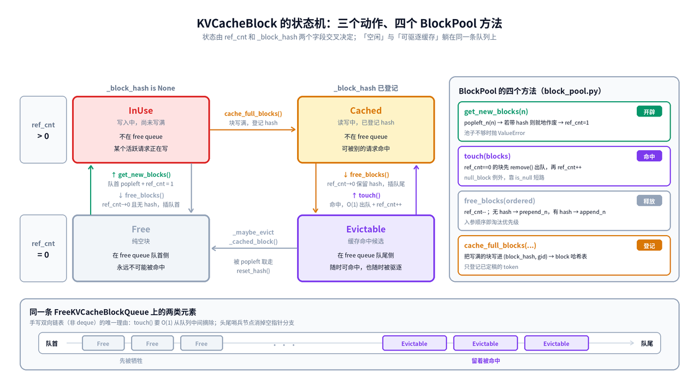
  </picture>
  <figcaption>图 5: KVCacheBlock 的四种状态、六条迁移边，以及它们在 FreeKVCacheBlockQueue 上的位置</figcaption>
</figure>

&emsp;&emsp;读这张图时抓住三点：

- **横向看是「有没有 hash」，纵向看是「有没有人引用」**。`Cached` 与 `Evictable` 的内容完全一样，区别只在 `ref_cnt`——前者被活跃请求持有，后者已经躺回队列随时可被别人命中，也随时可能被驱逐。
- **只有下面一行在 free queue 里**。`Free` 靠队首、`Evictable` 靠队尾，`get_new_blocks()` 永远从队首取，于是「无 hash 的块先死」这条淘汰序是由入队位置直接编码的。
- **`touch()` 是唯一需要从队列中间摘元素的操作**，这也是 `FreeKVCacheBlockQueue` 手写双向链表而不用 `deque` 的唯一理由。

#### 3.3.1 开辟：allocate_slots

&emsp;&emsp;`KVCacheManager.allocate_slots()` 是唯一的分配入口，被 scheduler 在两处调用：running 队列（追加 decode/后续 chunk）和 waiting 队列（首次准入或抢占恢复）。它的 token 布局在源码 docstring 里画得很清楚：

&emsp;&emsp;整条路径遵循两条原则：**先释放再分配**、**先算够不够再动手**。下图把 docstring 的 token 布局和八个步骤画在了一起：

<figure align="center">
  <picture>
    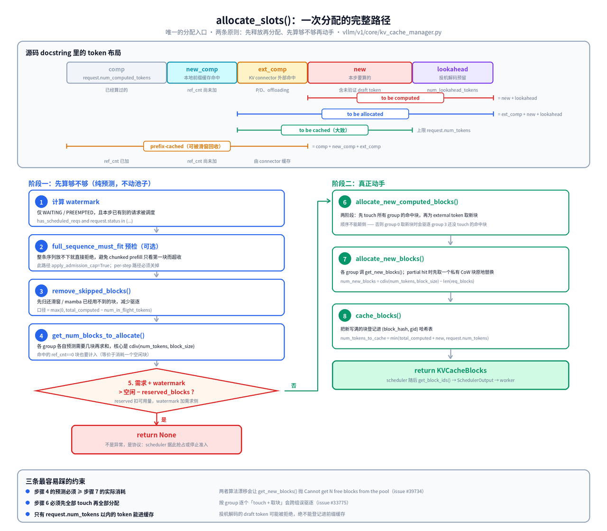
  </picture>
  <figcaption>图 6: 上半部分为 token 布局与四条区间的覆盖范围，下半部分为「先预测、后动手」两阶段的执行路径</figcaption>
</figure>

&emsp;&emsp;五段 token 的定义：

| 段 | 变量 | 含义 |
| --- | --- | --- |
| `comp` | `request.num_computed_tokens` | 已经算过的 |
| `new_comp` | `num_new_computed_tokens` | 本次前缀缓存命中的（vLLM 本地），`ref_cnt` 尚未加 |
| `ext_comp` | `num_external_computed_tokens` | KV connector（P/D、offloading）报告的外部命中 |
| `new` | `num_new_tokens` | 本步要算的，含未验证的 draft token |
| `lookahead` | `num_lookahead_tokens` | 投机解码预留 |

&emsp;&emsp;四条区间各自的边界（这是理解后面所有公式的前提）：

- **to be computed** = `new + lookahead`，本步真正要跑 attention 的部分；
- **to be allocated** = `ext_comp + new + lookahead`，需要新分配槽位的部分——`comp` 和 `new_comp` 的块已经在手上（或已被 `touch()` 拿住）；
- **to be cached** ≈ `ext_comp + new`，且上限被 `request.num_tokens` 截断，把可能被拒绝的 draft token 排除在外；
- **prefix-cached** = `comp + new_comp + ext_comp`，滑窗/mamba 可以安全回收其中落在窗口外的块。

&emsp;&emsp;对应源码的关键几段（`vllm/v1/core/kv_cache_manager.py`）：

```python{.line-numbers}
# 步骤 1：watermark 的两个前提条件缺一不可
watermark_blocks = 0
if has_scheduled_reqs and request.status in (
    RequestStatus.WAITING, RequestStatus.PREEMPTED
):
    watermark_blocks = self.watermark_blocks

# 步骤 2：按「已处理并定稿」的口径释放，而不是乐观的 total_computed_tokens
# 还在飞行中的那一步的 attention 窗口仍会读到边界以下的块，
# 而且被拒绝的 draft token 会把边界回滚
self.coordinator.remove_skipped_blocks(
    request.request_id,
    max(0, total_computed_tokens - request.num_in_flight_tokens),
    num_prompt_tokens=request.num_prompt_tokens,
)

# 步骤 3~4：reserved_blocks 与 watermark 分列公式两侧，语义不同
available_blocks = self.block_pool.get_num_free_blocks() - reserved_blocks
required_blocks = num_blocks_to_allocate + watermark_blocks
if required_blocks > available_blocks:
    # Cannot allocate new blocks
    return None
```

&emsp;&emsp;真正取块发生在 `SingleTypeKVCacheManager.allocate_new_blocks()`（`vllm/v1/core/single_type_kv_cache_manager.py`）：

```python{.line-numbers}
req_blocks = self.req_to_blocks[request_id]
num_required_blocks = cdiv(num_tokens, self.block_size)
num_new_blocks = num_required_blocks - len(req_blocks)
if num_new_blocks <= 0:
    return cow_blocks
new_blocks = self.block_pool.get_new_blocks(num_new_blocks)
req_blocks.extend(new_blocks)
```

&emsp;&emsp;这里出现了本文最重要的一个数据结构：**`req_to_blocks[req_id]` 是 block table 的 CPU 权威副本**。物理层那张 `int32` 二维表只是它的一个投影。以调试为例，`allocate_new_blocks` 的返回值形如：

```text
[KVCacheBlock(block_id=1, ref_cnt=1, _block_hash=None,
              prev_free_block=None, next_free_block=None)]
```

&emsp;&emsp;几个容易忽略的点：

- **返回 `None` 不是异常，是协议**。scheduler 看到 `None` 就去抢占（running 路径）或停止准入（waiting 路径）。整个 KV cache 压力反馈就是这一个返回值。
- **步骤 3 的预测和步骤 6 的实际动作必须口径一致**，两者核心都是同一个 `cdiv(num_tokens, block_size)`。算法漂移会导致 `get_new_blocks()` 取不到块而抛 `Cannot get N free blocks from the pool`。
- **步骤 5 的两阶段不是可有可无**。如果按 group 逐个「touch 命中块 + 取外部块」，group 0 取新块时可能把 group 3 还没 touch 的命中块驱逐掉。所以先全部 touch，再全部分配。

#### 3.3.2 淘汰：只发生在取块的瞬间

&emsp;&emsp;vLLM V1 **没有独立的驱逐线程或扫描过程**：

```python{.line-numbers}
# BlockPool.get_new_blocks
if num_blocks > self.get_num_free_blocks():
    raise ValueError(f"Cannot get {num_blocks} free blocks from the pool")

ret: list[KVCacheBlock] = self.free_block_queue.popleft_n(num_blocks)

# In order to only iterate the list once, we duplicated code a bit
if self.enable_caching:
    for block in ret:
        self._maybe_evict_cached_block(block)   # 有 hash 就从哈希表摘掉 + reset_hash
        assert block.ref_cnt == 0
        block.ref_cnt += 1
else:
    for block in ret:                            # 关闭前缀缓存时走这条快路
        assert block.ref_cnt == 0
        block.ref_cnt += 1
```

&emsp;&emsp;也就是说：**从队首拿到的块如果恰好还带着 hash，它的缓存身份就地作废**。没有「缓存满了要清理」这一说，因为缓存和空闲共用容量。

#### 3.3.3 释放：入队位置即淘汰优先级

&emsp;&emsp;驱逐顺序不是靠时间戳排序，而是靠**入队位置**编码的。三处代码合起来构成一个近似 LRU：

```python{.line-numbers}
# ① BlockPool.get_new_blocks —— 永远从队首取
ret = self.free_block_queue.popleft_n(num_blocks)

# ② BlockPool.free_blocks —— 按有无 hash 分流
for block in ordered_blocks:
    block.ref_cnt -= 1
    if block.ref_cnt == 0 and not block.is_null:
        if block.block_hash is None:
            blocks_without_hash.append(block)      # 永远不可能被命中
        else:
            blocks_with_hash.append(block)
self.free_block_queue.prepend_n(blocks_without_hash)   # 放队首，优先牺牲
self.free_block_queue.append_n(blocks_with_hash)       # 放队尾，留着被命中

# ③ SingleTypeKVCacheManager.free —— 逆序释放
# Free blocks in reverse order so that the tail blocks are freed first.
self.block_pool.free_blocks(reversed(self.pop_blocks_for_free(request_id)))
```

&emsp;&emsp;第 ③ 条最容易被忽略：逆序释放让一个请求的**尾块排在头块前面**，于是尾块先被驱逐。这符合前缀缓存的直觉——前缀（头块）更可能被别的请求复用。

#### 3.3.4 抢占：最粗暴的一档反馈

&emsp;&emsp;当 `allocate_slots()` 返回 `None` 时，scheduler 走 `_preempt_request()`：

```python{.line-numbers}
self._free_request_blocks(request)      # 整个请求的块全部归还
request.status = RequestStatus.PREEMPTED
request.num_computed_tokens = 0         # 从头再来
self.waiting.prepend_request(request)   # 插回等待队首
```

&emsp;&emsp;`num_computed_tokens = 0` 是真的从头重算。**开着前缀缓存且块还没被挤掉时，恢复时会把这些块原样命中回来，代价接近零；关掉前缀缓存则必须重跑整个 prompt。** 这是「抢占很贵」还是「抢占还好」的分水岭。

&emsp;&emsp;抢占对物理层有一个直接后果：**恢复后 block id 是全新一批**，所以 worker 侧必须走 `add_row()` 覆盖整行，而不是 `append_row()` 追加。这条规则在 [4.2](#42-推理过程中的逐步更新逻辑) 会再次出现。

---

## 4. 物理层

&emsp;&emsp;在 KVCacheManager 中为请求分配好逻辑 blocks 后，通过 `SchedulerOutput` 传递给 ModelRunner，进而构造 request 与物理 blocks 的映射关系。

&emsp;&emsp;物理层只有两个数据结构，分工如下：

| 数据结构 | 形状 / dtype | 生命周期 | 回答的问题 |
| --- | --- | --- | --- |
| `block_table` | `[max_num_reqs, max_num_blocks_per_req]` int32 | 跨 step 持久，随请求增长追加 | 「这个请求的第 i 个逻辑块，在显存里是哪个物理块？」 |
| `slot_mapping` | `[max_num_batched_tokens]` int64 | **每个 step 重算** | 「本 step 第 j 个 token 的 KV，要写到哪个物理槽位？」 |

&emsp;&emsp;核心公式（无 DCP/PCP 时）：

```text
block_idx = block_table[req_idx][pos // block_size]
slot_id   = block_idx * block_size + (pos % block_size)
```

&emsp;&emsp;`block_table` 是**读**路径需要的（attention kernel 要按块随机访问历史 KV），`slot_mapping` 是**写**路径需要的（把本 step 新算出的 K/V scatter 写进 cache）。两者由同一张表推导，但被传给不同的 kernel。

<figure align="center">
  <picture>
    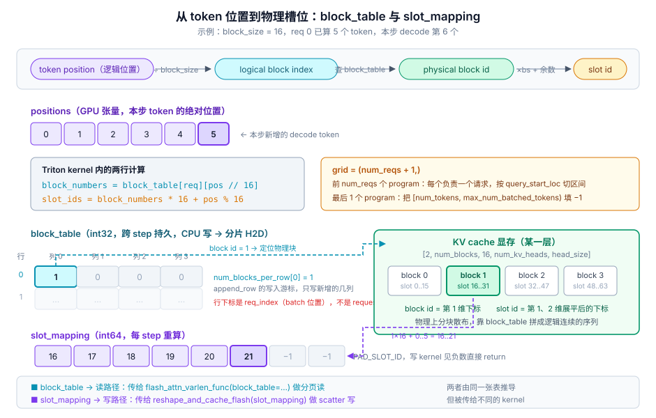
  </picture>
  <figcaption>图 7: 三个 ID 空间的转换 —— token position → logical block index → physical block id → slot id</figcaption>
</figure>

### 4.1 物理层数据结构的初始化

#### 4.1.1 BlockTable 的构造

&emsp;&emsp;vLLM 中通过 `block_table`（映射表）来记录每个请求信息，并处理多个请求。用 `BlockTable` 类实现请求的增、删操作，代码如下（`vllm/v1/worker/block_table.py`，节选并加注释）：

```python{.line-numbers}
class BlockTable:
    def __init__(
        self,
        block_size: int,
        max_num_reqs: int,
        max_num_blocks_per_req: int,
        max_num_batched_tokens: int,
        pin_memory: bool,
        device: torch.device,
        kernel_block_size: int,
        cp_kv_cache_interleave_size: int,
        slot_mapping_mode: SlotMappingMode = SlotMappingMode.TOKEN_TO_KV_SLOT,
    ):
        self.max_num_reqs = max_num_reqs
        self.max_num_batched_tokens = max_num_batched_tokens
        self.pin_memory = pin_memory
        self.device = device
        # 保存 manager 粒度的 block size（后面 self.block_size 可能被改写）
        self.kv_cache_block_size = block_size

        if kernel_block_size == block_size:
            # 标准路径：分配粒度与 kernel 粒度一致，block id 直接可用
            self.block_size = block_size
            self.blocks_per_kv_block = 1
            self.use_hybrid_blocks = False
        else:
            # 混合路径：一个 manager block 被切成多个 kernel block
            # 例：32 token 的内存块 + 16 token 的 kernel 块 -> 一块拆两块
            if block_size % kernel_block_size != 0:
                raise ValueError(
                    f"kernel_block_size {kernel_block_size} must divide "
                    f"kv_manager_block_size size {block_size} evenly"
                )
            self.block_size = kernel_block_size      # 注意：被改写成 kernel 粒度
            self.blocks_per_kv_block = block_size // kernel_block_size
            self.use_hybrid_blocks = True

        # 表的列数按拆分倍数放大，因为表里存的是 kernel block id
        self.max_num_blocks_per_req = max_num_blocks_per_req * self.blocks_per_kv_block

        # 例：max_num_reqs=256, max_num_blocks_per_req=16 -> tensor [256, 16]
        self.block_table = self._make_buffer(
            self.max_num_reqs, self.max_num_blocks_per_req, dtype=torch.int32
        )

        # 记录每行已写到第几列，是 append_row 的写入游标，shape (256,)
        self.num_blocks_per_row = np.zeros(max_num_reqs, dtype=np.int32)

        # 例：max_num_batched_tokens=8192 -> slot_mapping shape (8192,)
        self.slot_mapping = self._make_buffer(
            self.max_num_batched_tokens, dtype=torch.int64
        )

        if self.use_hybrid_blocks:
            self._kernel_block_arange = np.arange(0, self.blocks_per_kv_block).reshape(1, -1)
        else:
            self._kernel_block_arange = None
        ...
        self.slot_mapping_mode = slot_mapping_mode
```

&emsp;&emsp;三个容易踩坑的点：

1. **`self.block_size` 在混合路径下不等于构造参数 `block_size`**，它被改写成 kernel 粒度；原值保存在 `self.kv_cache_block_size` 里。前者传给 Triton kernel 的 `block_size` 参数，后者传 `KV_CACHE_BLOCK_SIZE`——两者混淆会让 slot 全部错位。
2. **表的列数被放大 `blocks_per_kv_block` 倍**，因为表里存的是 kernel block id。
3. **`slot_mapping_mode` 是当前分支新增的字段**。Mamba/GDN 这类 recurrent state 的 group 用 `SlotMappingMode.NONE`，它们的 block table 是「状态槽位索引」而不是「token 分页表」，没有 per-token slot 概念。

&emsp;&emsp;`max_num_blocks_per_req` 的来源在当前分支也变了：不再是写死的公式，而是由每个 KV cache spec 自己算（`vllm/v1/kv_cache_interface.py`）：

```python{.line-numbers}
# KVCacheSpec 基类
def max_num_blocks_per_req(self, vllm_config, max_len: int) -> int:
    """The number of block table entries needed per request, i.e. the row
    length of the worker-side block table for this cache group."""
    return cdiv(max_len, self.block_size)

# AttentionSpec：要除以 DCP 分片数
def max_num_blocks_per_req(self, vllm_config, max_len: int) -> int:
    kv_shard_count = vllm_config.parallel_config.decode_context_parallel_size
    return cdiv(max_len, self.block_size * kv_shard_count)

# MambaSpec：状态块数与序列长度无关（"none" 模式下）
def max_num_blocks_per_req(self, vllm_config, max_len: int) -> int:
    if vllm_config.cache_config.mamba_cache_mode == "align":
        return cdiv(max_len, self.block_size) + self.num_speculative_blocks
    return cdiv(self.max_memory_usage_bytes(vllm_config), self.page_size_bytes)
```

#### 4.1.2 CpuGpuBuffer：CPU 写、GPU 读

&emsp;&emsp;`_make_buffer()` 创建的 `CpuGpuBuffer`（`vllm/v1/utils.py`）是整个物理层性能设计的核心：

```python{.line-numbers}
with torch.inference_mode(False):     # 可变运行时状态，不能是 inference tensor
    self.cpu = torch.zeros(*size, dtype=dtype, device="cpu", pin_memory=pin_memory)
    self.gpu = torch.zeros_like(self.cpu, device=device)
self.np = self.cpu.numpy()            # 与 self.cpu 共享内存，零拷贝视图

def copy_to_gpu(self, n=None):
    if n is None:
        return self.gpu.copy_(self.cpu, non_blocking=True)
    return self.gpu[:n].copy_(self.cpu[:n], non_blocking=True)   # 只拷前 n 行
```

- **CPU 侧 numpy 数组是唯一的写入点**。`self.np` 与 `self.cpu` 共享同一块 pinned 内存，对 numpy 的写入自动对 torch tensor 可见。
- **GPU 侧只靠显式 `copy_to_gpu()` 同步**，且是 `non_blocking=True` 的异步拷贝（pinned 内存是异步 H2D 的前提）。
- **`copy_to_gpu(n)` 的分片拷贝**是 `commit_block_table(num_reqs)` 只搬前 `num_reqs` 行的底层机制。

&emsp;&emsp;一句话概括：**调度决策全部在 CPU 上完成，每步只做一次 H2D**。

#### 4.1.3 MultiGroupBlockTable：多 group 的封装

&emsp;&emsp;混合模型（如同时含 full attention 和 linear attention 的模型）会有多个 KV cache group，每个 group 一张独立的 `BlockTable`。`may_reinitialize_input_batch()` 负责从 `kv_cache_config` 读出每组参数并重建（`vllm/v1/worker/gpu_model_runner.py`）：

```python{.line-numbers}
for kv_cache_group in kv_cache_config.kv_cache_groups:
    kv_cache_spec = kv_cache_group.kv_cache_spec
    kv_cache_spec_kind = get_kv_cache_spec_kind(kv_cache_spec)
    if kv_cache_spec_kind == KVCacheSpecKind.ENCODER_ONLY_ATTENTION:
        continue
    block_sizes.append(kv_cache_spec.block_size)
    if kv_cache_spec_kind == KVCacheSpecKind.MAMBA:
        slot_mapping_modes.append(SlotMappingMode.NONE)
    else:
        slot_mapping_modes.append(SlotMappingMode.TOKEN_TO_KV_SLOT)
    max_num_blocks.append(
        kv_cache_spec.max_num_blocks_per_req(self.vllm_config, max_model_len)
    )
```

&emsp;&emsp;`MultiGroupBlockTable.__init__` 在建表前还有一次对齐：

```python{.line-numbers}
# Align to a multiple of (128 / block_size) as required
# by some attention backends such as TRTLLM (#39324)
max_num_blocks = [
    cdiv(n, 128 // bs) * (128 // bs) if bs <= 128 else n
    for n, bs in zip(max_num_blocks, block_sizes)
]
```

&emsp;&emsp;`block_size > 128` 时条件为假，直接取 `n`，不发生对齐。

&emsp;&emsp;之后所有写方法都是 fan-out：

```python{.line-numbers}
def append_row(self, block_ids: tuple[list[int], ...], row_idx: int) -> None:
    for i, block_table in enumerate(self.block_tables):
        block_table.append_row(block_ids[i], row_idx)
```

&emsp;&emsp;注意入参是 **tuple**，外层下标就是 KV cache group id——与逻辑层 `KVCacheBlocks.get_block_ids()` 的返回结构一一对应。

#### 4.1.4 初始化时序总览

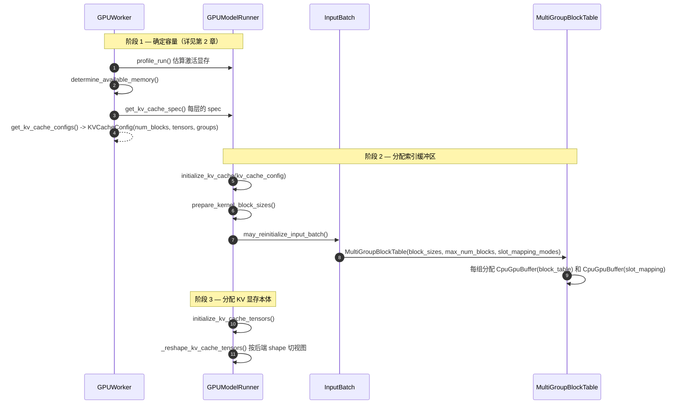

&emsp;&emsp;阶段 1 的完整推导见 [第 2 章](#2-启动期的容量规划kvcacheconfig-是怎么算出来的)，这里只关注它的产物如何被物理层消费。阶段 3 的 `_reshape_kv_cache_tensors()` 决定了物理布局，对 FlashAttention：

```python{.line-numbers}
kv_cache_shape = attn_backend.get_kv_cache_shape(
    kernel_num_blocks, shape_block_size,
    kv_cache_spec.num_kv_heads, kv_cache_spec.head_size,
)
```

&emsp;&emsp;得到形如 `[2, num_blocks, block_size, num_kv_heads, head_size]` 的张量（K/V、块数、块内 token、KV head、head dim）。**block id 就是第 1 维的下标，slot id 是把第 1、2 维展平后的下标**——这正是 `slot = block_id * block_size + offset` 成立的原因。

### 4.2 推理过程中的逐步更新逻辑

&emsp;&emsp;**block table 的内容由调度器决定，模型执行器只负责搬运。** 逻辑层的 `req_to_blocks` 就是这里的数据来源。

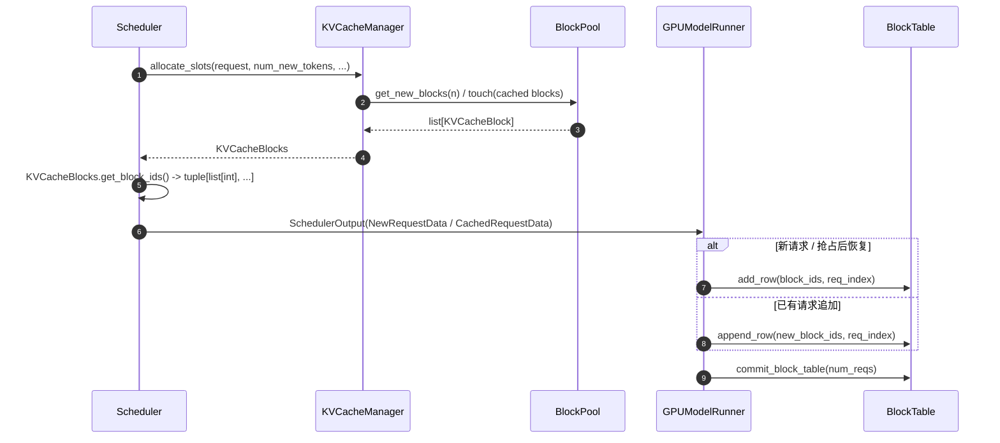

#### 4.2.1 两个写入口：add_row 与 append_row

&emsp;&emsp;`block_table` 通过 `add_row` 添加请求，其中 `row_idx` 参数是指传入的请求索引（`req_index`，即 persistent batch 中的位置，**不是 request id**）。两个写入口的差别和一步之内的完整时序如下图：

<figure align="center">
  <picture>
    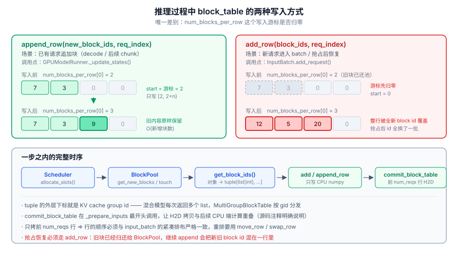
  </picture>
  <figcaption>图 8: append_row（追加）与 add_row（覆盖）的区别，以及 block table 每步的更新时序</figcaption>
</figure>

```python{.line-numbers}
def append_row(self, block_ids: list[int], row_idx: int) -> None:
    if not block_ids:
        return
    if self.use_hybrid_blocks:
        block_ids = self.map_to_kernel_blocks(
            np.array(block_ids), self.blocks_per_kv_block, self._kernel_block_arange
        )
    num_blocks = len(block_ids)
    start = self.num_blocks_per_row[row_idx]          # 该行已写到哪里
    self.num_blocks_per_row[row_idx] += num_blocks
    self.block_table.np[row_idx, start : start + num_blocks] = block_ids

def add_row(self, block_ids: list[int], row_idx: int) -> None:
    self.num_blocks_per_row[row_idx] = 0              # 游标归零 = 覆盖整行
    self.append_row(block_ids, row_idx)
```

&emsp;&emsp;两者的**唯一差别是游标是否归零**。这决定了调用时机：

| 场景 | 调用点 | 使用的方法 | 原因 |
| --- | --- | --- | --- |
| 新请求进入 persistent batch | `InputBatch.add_request()` | `add_row` | 整行是新的 |
| 抢占后恢复 | `_update_states()` 走 `reqs_to_add` 路径 | `add_row` | **旧块已归还，block id 全换了一批** |
| 已有请求追加块 | `_update_states()` | `append_row` | 只写新增的几个块 |

&emsp;&emsp;`GPUModelRunner._update_states()` 里这个分支非常直白（`vllm/v1/worker/gpu_model_runner.py`）：

```python{.line-numbers}
# Update the block IDs.
if not resumed_from_preemption:
    if new_block_ids is not None:
        # Append the new blocks to the existing block IDs.
        for block_ids, new_ids in zip(req_state.block_ids, new_block_ids):
            block_ids.extend(new_ids)
else:
    assert req_index is None
    assert new_block_ids is not None
    # The request is resumed from preemption.
    # Replace the existing block IDs with the new ones.
    req_state.block_ids = new_block_ids
...
# 已在 persistent batch 中的请求，直接追加到 GPU 侧的表
if new_block_ids is not None:
    self.input_batch.block_table.append_row(new_block_ids, req_index)
```

&emsp;&emsp;注意 `zip(req_state.block_ids, new_block_ids)`——**外层循环的是 KV cache group**，每个 group 各有一个 list。

&emsp;&emsp;混合块模式下 `append_row` 还要先展开 block id，这是一次纯 numpy 广播、没有 Python 循环：

```python{.line-numbers}
kernel_block_ids = (
    kv_manager_block_ids.reshape(-1, 1) * blocks_per_kv_block + kernel_block_arange
)
return kernel_block_ids.reshape(-1)
# manager [0, 1, 2] + blocks_per_kv_block=2  ->  kernel [0, 1, 2, 3, 4, 5]
```

#### 4.2.2 其余行操作

&emsp;&emsp;`BlockTable` 对外只有五个写方法，全部只动 CPU numpy，都是 O(改动量)：

- `clear_row(row_idx)`：把 `[0, num_blocks)` 写 0 并把游标归零，行被回收给新请求前调用；
- `move_row(src, tgt)` / `swap_row(src, tgt)`：服务于 persistent batch 的紧凑重排。

```python{.line-numbers}
def move_row(self, src: int, tgt: int) -> None:
    num_blocks = self.num_blocks_per_row[src]
    block_table_np = self.block_table.np
    block_table_np[tgt, :num_blocks] = block_table_np[src, :num_blocks]
    self.num_blocks_per_row[tgt] = num_blocks

def swap_row(self, src: int, tgt: int) -> None:
    src_tgt, tgt_src = [src, tgt], [tgt, src]
    self.num_blocks_per_row[src_tgt] = self.num_blocks_per_row[tgt_src]
    self.block_table.np[src_tgt] = self.block_table.np[tgt_src]   # numpy 花式索引
```

&emsp;&emsp;`move_row` 只搬 `num_blocks` 个有效元素，**不清理目标行尾部的残留**——这是安全的，因为读取方永远以 `num_blocks_per_row` 或 `seq_lens` 为界。

#### 4.2.3 H2D 提交的时机

&emsp;&emsp;`commit_block_table()` 在 `_prepare_inputs()` **最开头**调用，源码注释说明了原因：

```python{.line-numbers}
total_num_scheduled_tokens = scheduler_output.total_num_scheduled_tokens
assert total_num_scheduled_tokens > 0
num_reqs = self.input_batch.num_reqs
assert num_reqs > 0

# OPTIMIZATION: Start copying the block table first.
# This way, we can overlap the copy with the following CPU operations.
self.input_batch.block_table.commit_block_table(num_reqs)
```

&emsp;&emsp;它内部就是 `self.block_table.copy_to_gpu(num_reqs)`，只拷前 `num_reqs` 行。**未被本 step 调度的请求，其行内容保持不变但不会被拷贝**——所以行的顺序必须与 `input_batch` 的紧凑排布严格一致。

### 4.3 slot_mapping 的计算

&emsp;&emsp;`slot_mapping` 存储了每个 token 在 layer 数据中的位置，其包含的元素总数与本 step 调度的 tokens 数量相等，其运算需要与 `block_size` 结合。

&emsp;&emsp;`scheduler` 是多个请求同时下发，映射关系有多组，`slot_mapping` 如何构造？答案是靠 `query_start_loc` 切分请求边界，再用 `positions` 定位每个 token 的绝对位置。

#### 4.3.1 输入的准备：req_indices、query_pos、positions

&emsp;&emsp;先看 `_prepare_inputs()` 如何构造这三个数组。以下面这批 prompts 为例：

```python{.line-numbers}
prompts = [
    "Hello, my name is",
    "The president of the United States is",
    "The capital of France is",
    "The capital of France is",
    "The future of AI is",
]
```

&emsp;&emsp;假设在第二次调度时，`num_scheduled_tokens` 的值为 `[1, 7, 5, 5, 5]`，每个元素表示该请求本步需要计算的 tokens 数（req0 已经做完了 prefill，req1~4 还在 prefill 阶段）。

```python{.line-numbers}
# Get request indices.
# E.g., [2, 5, 3] -> [0, 0, 1, 1, 1, 1, 1, 2, 2, 2]
# 本例 num_scheduled_tokens=[1,7,5,5,5] ->
#   req_indices = [0, 1,1,1,1,1,1,1, 2,2,2,2,2, 3,3,3,3,3, 4,4,4,4,4]
# 每个元素代表该 token 属于哪个 request index
req_indices = np.repeat(self.arange_np[:num_reqs], num_scheduled_tokens)

# cu_num_tokens: [2, 5, 3] -> [2, 7, 10]
# self.query_pos.np[:10]: [0, 1, 0, 1, 2, 3, 4, 0, 1, 2]
# 本例 cu_num_tokens = [1, 8, 13, 18, 23]
#      query_pos     = [0, 0,1,2,3,4,5,6, 0,1,2,3,4, 0,1,2,3,4, 0,1,2,3,4]
cu_num_tokens = self._get_cumsum_and_arange(num_scheduled_tokens, self.query_pos.np)

# Get positions.（CPU 侧，用于后续 gather input_ids）
# num_computed_tokens_cpu 表示当前请求已经算过多少 token，本例 req0=5，其余=0
# positions_np = [5, 0,1,2,3,4,5,6, 0,1,2,3,4, 0,1,2,3,4, 0,1,2,3,4]
positions_np = (
    self.input_batch.num_computed_tokens_cpu[req_indices]
    + self.query_pos.np[: cu_num_tokens[-1]]
)
```

&emsp;&emsp;`_get_cumsum_and_arange` 在当前分支的签名是「传入输出缓冲、只返回前缀和」：

```python{.line-numbers}
def _get_cumsum_and_arange(self, num_tokens, arange_out, cumsum_dtype=None) -> np.ndarray:
    """Get the cumulative sum and batched arange of the given array.
    E.g., [2, 5, 3] -> [2, 7, 10], arange written to
    arange_out[:10] as [0, 1, 0, 1, 2, 3, 4, 0, 1, 2].
    Equivalent to but faster than:
    np.concatenate([np.arange(n) for n in num_tokens])
    """
    # Step 1. [2, 5, 3] -> [2, 7, 10]
    cu_num_tokens = np.cumsum(num_tokens, dtype=cumsum_dtype)
    total_num_tokens = cu_num_tokens[-1]
    # Step 2. [2, 7, 10] -> [0, 0, 2, 2, 2, 2, 2, 7, 7, 7]
    cumsums_offsets = np.repeat(cu_num_tokens - num_tokens, num_tokens)
    # Step 3. [0, 1, 0, 1, 2, 3, 4, 0, 1, 2]
    np.subtract(self.arange_np[:total_num_tokens], cumsums_offsets, out=arange_out[:total_num_tokens])
    return cu_num_tokens
```

&emsp;&emsp;`cu_num_tokens` 随后被写进 `query_start_loc`，这是 slot mapping kernel 划分请求边界的依据：

```python{.line-numbers}
self.query_start_loc.np[0] = 0
self.query_start_loc.np[1 : num_reqs + 1] = cu_num_tokens
# Note: pad query_start_loc to be non-decreasing, as kernels
# like FlashAttention requires that
self.query_start_loc.np[num_reqs + 1 :].fill(cu_num_tokens[-1])
self.query_start_loc.copy_to_gpu()
```

&emsp;&emsp;**关键变化**：当前分支的 `positions` 是在 **GPU 上**算的，CPU 侧的 `positions_np` 只用于 gather `input_ids` 和 M-RoPE。传给 slot mapping 的是 GPU 版本：

```python{.line-numbers}
self.req_indices.np[:total_num_scheduled_tokens] = req_indices
self.req_indices.copy_to_gpu(total_num_scheduled_tokens)
req_indices_gpu = self.req_indices.gpu[:total_num_scheduled_tokens]

self.query_pos.copy_to_gpu(total_num_scheduled_tokens)
...
self.positions[:total_num_scheduled_tokens] = (
    self.num_computed_tokens[req_indices_gpu].to(torch.int64)
    + self.query_pos.gpu[:total_num_scheduled_tokens]
)
self.seq_lens[:num_reqs] = self.num_computed_tokens[:num_reqs] + num_scheduled_tokens_gpu
self.seq_lens[num_reqs:].fill_(0)

self.input_batch.block_table.compute_slot_mapping(
    num_reqs,
    self.query_start_loc.gpu[: num_reqs + 1],
    self.positions[:total_num_scheduled_tokens],
)
```

&emsp;&emsp;之所以要在 GPU 上重算一遍 `positions`：async scheduling + 投机解码时，CPU 侧的 `num_computed_tokens` 是**乐观值**（假设所有 draft token 都被接受），真实值要靠上一步的 `valid_sampled_token_count_gpu` 在 GPU 上修正（见 `update_num_computed_tokens_for_batch_change`）。CPU 拿不到这个修正结果，所以 slot mapping 必须用 GPU 上的 positions。

#### 4.3.2 分发：哪些 group 需要算

```python{.line-numbers}
def compute_slot_mapping(self, num_reqs, query_start_loc, positions) -> None:
    num_tokens = positions.shape[0]
    if self.slot_mapping_mode == SlotMappingMode.NONE:
        # Mamba/GDN groups consume the block table as recurrent state
        # indices and do not use per-token slot mappings.
        return
    assert self.slot_mapping_mode == SlotMappingMode.TOKEN_TO_KV_SLOT

    _compute_slot_mapping_kernel[(num_reqs + 1,)](     # 注意 grid 是 num_reqs + 1
        num_tokens,
        self.max_num_batched_tokens,
        query_start_loc,
        positions,
        self.block_table.gpu,
        self.block_table.gpu.stride(0),
        self.block_size,                                # kernel 粒度
        self.slot_mapping.gpu,
        KV_CACHE_BLOCK_SIZE=self.kv_cache_block_size,   # manager 粒度
        BLOCKS_PER_KV_BLOCK=self.blocks_per_kv_block,
        TOTAL_CP_WORLD_SIZE=self.dcp_world_size,
        TOTAL_CP_RANK=self.dcp_rank,
        CP_KV_CACHE_INTERLEAVE_SIZE=self.cp_kv_cache_interleave_size,
        PAD_ID=PAD_SLOT_ID,
        BLOCK_SIZE=1024,
    )
```

&emsp;&emsp;`grid = (num_reqs + 1,)`：前 `num_reqs` 个 program 各负责一个请求，**最后一个 program 专门做 padding**。

#### 4.3.3 Triton kernel 逐段解读

```python{.line-numbers}
req_idx = tl.program_id(0)

# ① 最后一个 program：把 [num_tokens, max_num_tokens) 填成 PAD_SLOT_ID
if req_idx == tl.num_programs(0) - 1:
    for i in range(num_tokens, max_num_tokens, BLOCK_SIZE):
        offsets = i + tl.arange(0, BLOCK_SIZE)
        tl.store(slot_mapping_ptr + offsets, PAD_ID, mask=offsets < max_num_tokens)
    return

# ② 本请求在扁平 token 序列里的区间，由 query_start_loc 给出
start_idx = tl.load(query_start_loc_ptr + req_idx).to(tl.int64)
end_idx   = tl.load(query_start_loc_ptr + req_idx + 1).to(tl.int64)

virtual_block_size = KV_CACHE_BLOCK_SIZE * TOTAL_CP_WORLD_SIZE
row_offset = req_idx * block_table_stride       # 定位到 block_table 的第 req_idx 行

for i in range(start_idx, end_idx, BLOCK_SIZE):
    offsets = i + tl.arange(0, BLOCK_SIZE)
    mask = offsets < end_idx
    pos = tl.load(positions_ptr + offsets, mask=mask, other=0)

    # ③ 先在「虚拟块」空间里定位：CP 场景下一个虚拟块横跨所有 CP rank
    virtual_block_indices = pos // virtual_block_size
    virtual_block_offsets = pos - virtual_block_indices * virtual_block_size

    # ④ 判断这个 token 的 KV 是否归本 rank 存
    is_local = (virtual_block_offsets // CP_KV_CACHE_INTERLEAVE_SIZE) \
               % TOTAL_CP_WORLD_SIZE == TOTAL_CP_RANK

    # ⑤ 折算成本 rank 内的块内偏移
    local_block_offsets = (
        virtual_block_offsets // (TOTAL_CP_WORLD_SIZE * CP_KV_CACHE_INTERLEAVE_SIZE)
    ) * CP_KV_CACHE_INTERLEAVE_SIZE + (virtual_block_offsets % CP_KV_CACHE_INTERLEAVE_SIZE)

    # ⑥ 查表 + 展开：这两行就是本文开头那条核心公式
    block_indices = virtual_block_indices * BLOCKS_PER_KV_BLOCK \
                    + local_block_offsets // block_size
    block_numbers = tl.load(block_table_ptr + row_offset + block_indices,
                            mask=mask & is_local, other=0).to(tl.int64)
    slot_offsets = local_block_offsets % block_size
    slot_ids = block_numbers * block_size + slot_offsets

    # ⑦ 非本 rank 的 token 写哨兵
    slot_ids = tl.where(is_local, slot_ids, PAD_ID)
    tl.store(slot_mapping_ptr + offsets, slot_ids, mask=mask)
```

&emsp;&emsp;在无 DCP/PCP（`TOTAL_CP_WORLD_SIZE = 1`，绝大多数部署）时，整段大幅化简：

| 段 | CP=1 时退化为 |
| --- | --- |
| ③ | `virtual_block_size == KV_CACHE_BLOCK_SIZE`，`virtual_block_offsets == pos % block_size` |
| ④ | `0 % 1 == 0` 恒真，`is_local` 永远为真 |
| ⑤ | `local_block_offsets == virtual_block_offsets` |
| ⑥ | `BLOCKS_PER_KV_BLOCK = 1` 时 `block_indices == pos // block_size` |
| ⑦ | `tl.where` 退化为直通 |

&emsp;&emsp;于是只剩下：

```text
block_numbers = block_table[req_idx][pos // block_size]
slot_ids      = block_numbers * block_size + pos % block_size
```

&emsp;&emsp;这个计算过程实际就是**二维转一维**的运算。另外注意 `.to(tl.int64)` 加在 `block_numbers` 上而不是之后——`block_numbers * block_size` 在 int32 下很容易溢出。

#### 4.3.4 一个完整的算例

&emsp;&emsp;以 `block_size = 16`、req0 有 5 个 token、调度器分配了物理块 1 为例：

```text
block_size          = 16
block_table[0]      = [1, 0, 0, ..., 0]         # 只有第 0 列有效
num_blocks_per_row  = [1]
query_start_loc     = [0, 5]
positions           = [0, 1, 2, 3, 4]

pos // 16           = [0, 0, 0, 0, 0]           -> block_table[0][0] = 1
pos %  16           = [0, 1, 2, 3, 4]
slot_mapping        = 1 * 16 + [0..4] = [16, 17, 18, 19, 20]
slot_mapping[5:]    = -1                        # PAD_SLOT_ID
```

&emsp;&emsp;更新后的 `slot_mapping` 值为 `[16, 17, 18, 19, 20, -1, -1, ...]`。

&emsp;&emsp;下一步 decode 时 `positions = [5]`，仍落在同一块内，`slot_mapping = [21]`。直到第 17 个 token（`pos = 16`）才需要第二个块，调度器在那一步之前通过 `allocate_slots()` 追加 block id，`append_row()` 写进 `block_table[0][1]`。

### 4.4 两个张量的消费路径

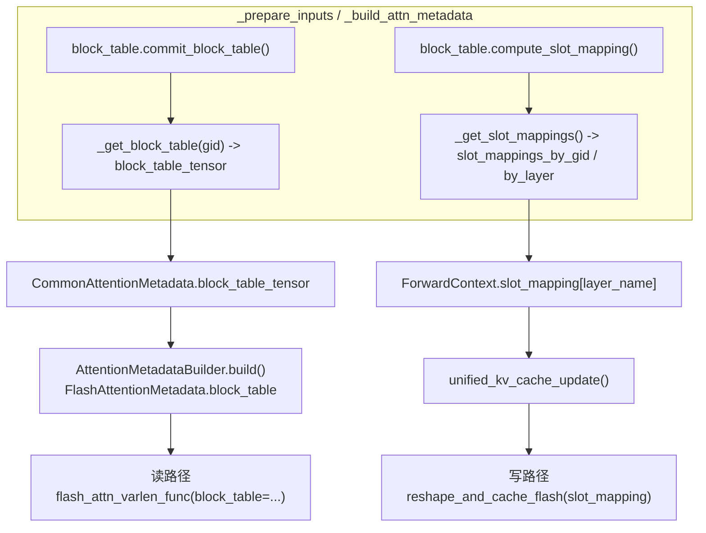

#### 4.4.1 写路径：slot_mapping

&emsp;&emsp;`slot_mapping` 按 **layer name** 放进 `ForwardContext`，由 `unified_kv_cache_update` 自定义算子取出后调用后端：

```python{.line-numbers}
_, attn_layer, kv_cache, layer_slot_mapping = get_attention_context(layer_name)
if layer_slot_mapping is not None:
    attn_layer.impl.do_kv_cache_update(attn_layer, key, value, kv_cache, layer_slot_mapping)
```

&emsp;&emsp;FlashAttention 的实现直接调用 `reshape_and_cache_flash`，CUDA kernel 里逐 token 拆 slot：

```c
const int64_t slot_idx = slot_mapping[token_idx];
if (slot_idx < 0) { return; }               // PAD_SLOT_ID，跳过
const int64_t block_idx    = slot_idx / block_size;
const int64_t block_offset = slot_idx % block_size;
cache_t* key_dst = key_cache + block_idx * block_stride + block_offset * page_stride;
```

&emsp;&emsp;这里做了一次 `slot_idx / block_size` 的**逆运算**——kernel 拿到的是展平后的 slot id，要还原成 (块, 块内偏移) 才能算地址。所以 `slot = block * bs + off` 这个编码在 kernel 两端各出现一次，`block_size` 必须完全一致。这也是 [4.1.1](#411-blocktable-的构造) 里强调 `self.block_size` 传 kernel 粒度的原因。

&emsp;&emsp;`slot_idx < 0` 的早退是 padding 安全性的最后一道防线。CUDA graph 模式下 batch 形状固定，多余的 token 槽位必须是 `-1`，否则会把垃圾 KV 写进别的请求的块里。`_get_slot_mappings()` 里那句 `slot_mapping[num_tokens_unpadded:num_tokens_padded].fill_(-1)` 就是干这个的。

#### 4.4.2 读路径：block_table

&emsp;&emsp;`block_table_tensor` 经 `CommonAttentionMetadata` 传给每个后端的 builder，最终作为 `flash_attn_varlen_func` 的 `block_table` 参数：

```python{.line-numbers}
flash_attn_varlen_func(
    q=query, k=key_cache, v=value_cache,
    cu_seqlens_q=attn_metadata.query_start_loc,
    seqused_k=attn_metadata.seq_lens,
    block_table=attn_metadata.block_table,
    ...
)
```

&emsp;&emsp;kernel 内部按 `block_table[req_idx][i]` 逐块取 KV，配合 `seq_lens` 知道最后一块用到第几个 token。这就是 PagedAttention 的本质：**KV 物理上分块散布，靠 block table 拼成逻辑连续的序列**。

&emsp;&emsp;取表时会顺手做 CUDA graph 的行 padding：

```python{.line-numbers}
def _get_block_table(kv_cache_gid: int):
    ...
    blk_table = self.input_batch.block_table[kv_cache_gid]
    blk_table_tensor = blk_table.get_device_tensor(num_reqs_padded)
    # Fill unused block table entries with NULL_BLOCK_ID (null block)
    # for CUDAGraph padding. Block 0 is reserved for padding.
    blk_table_tensor[num_reqs:num_reqs_padded].fill_(NULL_BLOCK_ID)
    return blk_table_tensor
```

#### 4.4.3 两个哨兵值

&emsp;&emsp;两个哨兵值含义完全不同，不要混：

| 常量 | 值 | 用在哪 | 含义 |
| --- | --- | --- | --- |
| `PAD_SLOT_ID` | `-1` | `slot_mapping` | 该 token 是 padding，写 kernel 直接跳过 |
| `NULL_BLOCK_ID` | `0` | `block_table` | 该行是 padding 请求，或该逻辑块已被回收，指向保留的 null block |

&emsp;&emsp;两者都定义在 `vllm/v1/attention/backends/utils.py`。`NULL_BLOCK_ID` 有两个用途：上面的 CUDA graph 行 padding，以及逻辑层回收窗口外块时的占位——`SlidingWindowManager`、`MambaManager`（`align` 模式）释放块时不是从 `req_to_blocks` 里 `del`，而是**原地替换成 `null_block`**，因为 block table 的下标必须始终等于逻辑块号，删掉会让后面所有块的下标错位，slot mapping 立刻算错。

#### 4.4.4 特例：linear attention 把 block table 当状态索引

&emsp;&emsp;Mamba/GDN 层不用 slot mapping，而是把 block table 当作**状态槽位索引**：

```python{.line-numbers}
block_table_tensor = mamba_get_block_table_tensor(
    m.block_table_tensor, m.seq_lens, self.kv_cache_spec, mamba_cache_mode
)
...
non_spec_state_indices_tensor = block_table_tensor[:, 0]
```

&emsp;&emsp;`[:, 0]` 取每请求唯一的状态块号，kernel 用它索引 conv state / ssm state，**原地读改写**，没有「追加」语义。

| | full attention | linear attention (GDN) |
| --- | --- | --- |
| 每 token 占用 | 一个 slot | 0（状态是定长的） |
| 块数随序列增长 | 是，`cdiv(len, block_size)` | 否，恒为 1（`none` 模式） |
| 写操作 | scatter 追加 | 原地覆盖 |
| 需要 slot mapping | 是 | 否（`SlotMappingMode.NONE`） |

---

## 5. 全流程串联

| 阶段 | 逻辑层（engine core） | `block_table` | `slot_mapping` |
| --- | --- | --- | --- |
| 引擎启动 | profiling → 统一 page → 划分 group → 算 `num_blocks` → 规划 `kv_cache_tensors`（第 2 章）；再建 `BlockPool` 与空闲链表、摘走 block 0 | 按 group 分配 `[max_num_reqs, max_num_blocks_per_req]` 的 CPU+GPU 缓冲 | 按 group 分配 `[max_num_batched_tokens]` 缓冲，mamba 组标记为 `NONE` |
| 准入 | `get_computed_blocks()` 查前缀缓存 → `allocate_slots()` 取块，不够就返回 `None` 触发抢占 | `add_row()` 写入 CPU numpy 视图 | 不参与 |
| `_prepare_inputs` | 不参与 | `commit_block_table()` 做分片 H2D（最先执行，与后续 CPU 运算重叠） | Triton kernel 从 block table + GPU positions 重算 |
| 前向 | 不参与 | 传给 attention kernel 做分页读 | 传给 `reshape_and_cache_flash` 做 scatter 写 |
| 步后 | `cache_blocks()` 登记满块；滑窗/mamba `remove_skipped_blocks()` 回收 | 下一步 `append_row()` 追加 | 下一步重算 |
| 请求结束 | `free()` 逆序还池；有 hash 的块留在队尾等待复用 | `clear_row()`，行被回收给新请求 | — |

&emsp;&emsp;三句话概括：

- **逻辑层**是纯 CPU 的簿记：一个全局 `BlockPool` 用 `ref_cnt` + 一条双向链表同时表达「空闲」和「可驱逐的缓存」，`SingleTypeKVCacheManager` 决定块的生命周期。
- **`block_table`** 是请求级、跨 step 持久的「逻辑块 → 物理块」映射，内容来自 `req_to_blocks`，worker 侧只做 numpy 写入 + 分片 H2D。
- **`slot_mapping`** 是 step 级、每步重算的「token → 物理槽位」展开结果，由前者加上本步的 token 位置在 Triton kernel 里推导而来。

---

## 6. 调试用的不变量清单

&emsp;&emsp;排查相关问题时，以下不变量值得优先检查。

### 6.1 物理层

- `block_table` 的**行**由 `req_index`（persistent batch 中的位置）索引，**不是 request id**。批次重排时 `move_row()` / `swap_row()` 必须与采样元数据同步移动。
- `num_blocks_per_row[i] * block_size >= seq_len_i`，否则 `slot_mapping` 会读到未初始化的表项。
- 每个 group 的 `block_table` 和 `slot_mapping` 必须来自**同一个 gid**；混用会把 KV 写进另一组的显存。
- `slot_mapping` 的 dtype 是 `int64`，`block_table` 是 `int32`，kernel 签名依赖这一点。
- 混合块模式下，传给 kernel 的 `block_size` 是 **kernel 粒度**（`self.block_size`），`KV_CACHE_BLOCK_SIZE` 才是 manager 粒度（`self.kv_cache_block_size`）。
- 抢占恢复必须走 `add_row()` 而非 `append_row()`。

### 6.2 逻辑层

- **block id 全局唯一**。所有 group 共用一个 `BlockPool`，同一个 id 不会同时属于两个 group。
- `block.ref_cnt` 恰好等于「持有该块的请求数」。`touch()` / `free_blocks()` 必须成对；`null_block` 是唯一例外，靠 `is_null` 短路所有路径。
- `get_num_blocks_to_allocate()` 的预测必须 ≥ `allocate_new_blocks()` 的实际消耗，低估会抛 `Cannot get N free blocks from the pool`。
- `req_to_blocks[req_id]` 的**长度和下标语义不可破坏**：释放窗口外的块只能替换成 `null_block`，不能 `del`。
- 只有 `request.num_tokens` 以内的 token 能进前缀缓存；draft token 必须排除。
- `free_blocks()` 的入参顺序即驱逐优先级，请求级释放一律传 `reversed(blocks)`。

### 6.3 启动期容量规划

- 所有 group 的 `page_size_bytes` 必须相等（`get_uniform_page_size()` 里有 `assert len(page_sizes) == 1`），这是 `num_blocks` 公式成立的前提。
- `num_blocks` 的除数 `group_size` 是**每组的层数**，不是组数；与 `kv_cache_tensors` 的个数必须一致，否则显存会算多或算少。
- `kv_cache_tensors[i].shared_by` 里的多个 layer 是**完整 alias**，不做分段。不串写只依赖「所有 group 共用一个 `BlockPool`、block id 全局唯一」这一条。
- 所有 worker 的 group 数量必须一致（可以有空组），中心化 scheduler 只维护一套 gid。
- 跨 worker 取 `min_num_blocks` 时，`tensor.size` 必须按 `num_blocks_old` 等比缩小（源码有 `assert tensor.size % num_blocks_old == 0`）。
- 设了 `--num-gpu-blocks-override` 时，`available_memory` 会被反算覆盖，保证 auto-fit / 显存检查 / 配置构建三处口径一致。

---

## 附录 A：与旧版本的主要差异

&emsp;&emsp;本文早期版本基于 v0.12.0 编写，以下几处在当前分支已经改变，阅读旧笔记时需要注意：

| 项 | 旧版本 | 当前分支 |
| --- | --- | --- |
| `compute_slot_mapping` 签名 | `(req_indices: np.ndarray, positions: np.ndarray)` | `(num_reqs: int, query_start_loc: Tensor, positions: Tensor)` |
| `compute_slot_mapping` 实现 | CPU numpy：`block_table.np.ravel()[block_table_indices]` + `np.add` | GPU Triton kernel `_compute_slot_mapping_kernel`，grid = `num_reqs + 1` |
| `positions` 来源 | CPU numpy 计算后拷贝 | **GPU 上计算**（`num_computed_tokens[req_indices_gpu] + query_pos.gpu`），CPU 版仅用于 gather `input_ids` / M-RoPE |
| 请求边界 | `req_indices` 逐 token 数组 | `query_start_loc` 前缀和，kernel 内按 program 切分 |
| `_get_cumsum_and_arange` | 返回 `(cu_num_tokens, arange)` 元组 | 返回 `cu_num_tokens`，arange 写入传入的 `arange_out` 缓冲 |
| `max_num_blocks_per_req` | 写死公式 `max(cdiv(max_model_len, block_size * cp), 1 + num_spec_tokens)` | 由各 `KVCacheSpec.max_num_blocks_per_req()` 各自实现（Attention 除 DCP、Mamba 按显存算） |
| `BlockTable.__init__` | 无 slot mapping 模式概念 | 新增 `slot_mapping_mode`，Mamba group 走 `SlotMappingMode.NONE` 直接 return |
| `KVCacheBlock` | 无 `_block_hash_num_tokens` | 新增该字段，支持「块内部分命中」 |
| padding 填充 | —— | kernel 最后一个 program 专门填 `PAD_SLOT_ID`；`_get_block_table` 填 `NULL_BLOCK_ID` |

---

## 附录 B：源码索引

| 模块 | 路径 |
| --- | --- |
| `Scheduler`、抢占与释放 | `vllm/v1/core/sched/scheduler.py` |
| `KVCacheManager.allocate_slots` / `free` | `vllm/v1/core/kv_cache_manager.py` |
| `KVCacheCoordinator` 三个变体 | `vllm/v1/core/kv_cache_coordinator.py` |
| 各类型 `SingleTypeKVCacheManager` | `vllm/v1/core/single_type_kv_cache_manager.py` |
| `BlockPool`、`BlockHashToBlockMap` | `vllm/v1/core/block_pool.py` |
| `KVCacheBlock`、`FreeKVCacheBlockQueue` | `vllm/v1/core/kv_cache_utils.py` |
| `KVCacheSpec.max_num_blocks_per_req`、`page_size_bytes`、`KVCacheConfig`/`KVCacheTensor`/`KVCacheGroupSpec` | `vllm/v1/kv_cache_interface.py` |
| `get_kv_cache_configs`、`get_kv_cache_groups`、`get_kv_cache_config_from_groups`、`get_num_blocks`、`unify_kv_cache_spec_page_size` | `vllm/v1/core/kv_cache_utils.py` |
| `EngineCore._initialize_kv_caches` | `vllm/v1/engine/core.py` |
| `determine_available_memory`、`request_memory` | `vllm/v1/worker/gpu_worker.py`、`vllm/v1/worker/utils.py` |
| `_allocate_kv_cache_tensors`、`_reshape_kv_cache_tensors`、`initialize_kv_cache_tensors` | `vllm/v1/worker/gpu_model_runner.py` |
| `BlockTable`、`MultiGroupBlockTable`、Triton kernel | `vllm/v1/worker/block_table.py` |
| `CpuGpuBuffer` | `vllm/v1/utils.py` |
| `InputBatch.add_request` | `vllm/v1/worker/gpu_input_batch.py` |
| `_prepare_inputs`、`_update_states`、`may_reinitialize_input_batch` | `vllm/v1/worker/gpu_model_runner.py` |
| `PAD_SLOT_ID`、`NULL_BLOCK_ID`、`mamba_get_block_table_tensor` | `vllm/v1/attention/backends/utils.py` |
| `FlashAttentionImpl.do_kv_cache_update` | `vllm/v1/attention/backends/flash_attn.py` |
| `reshape_and_cache_flash_kernel` | `csrc/libtorch_stable/cache_kernels.cu` |
