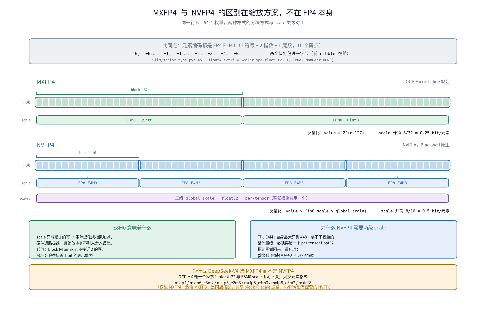
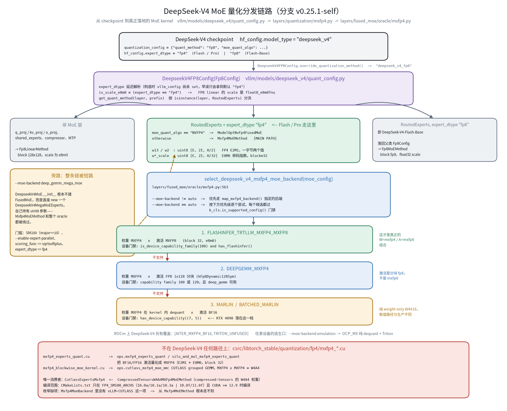
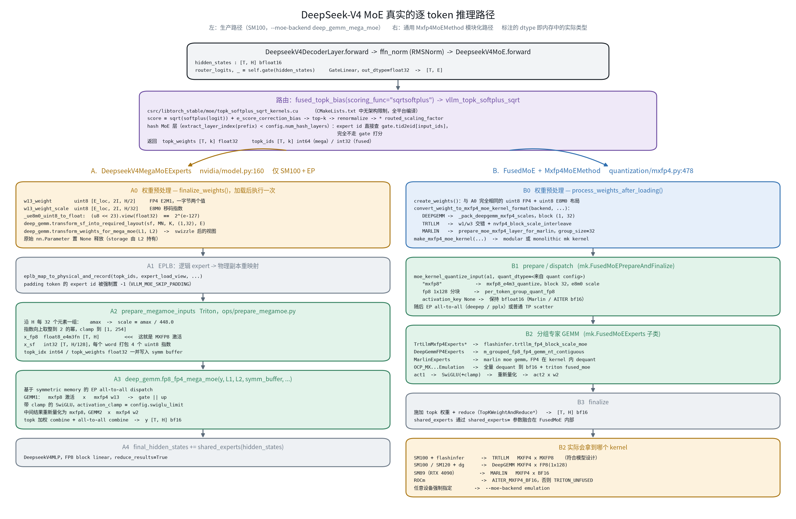
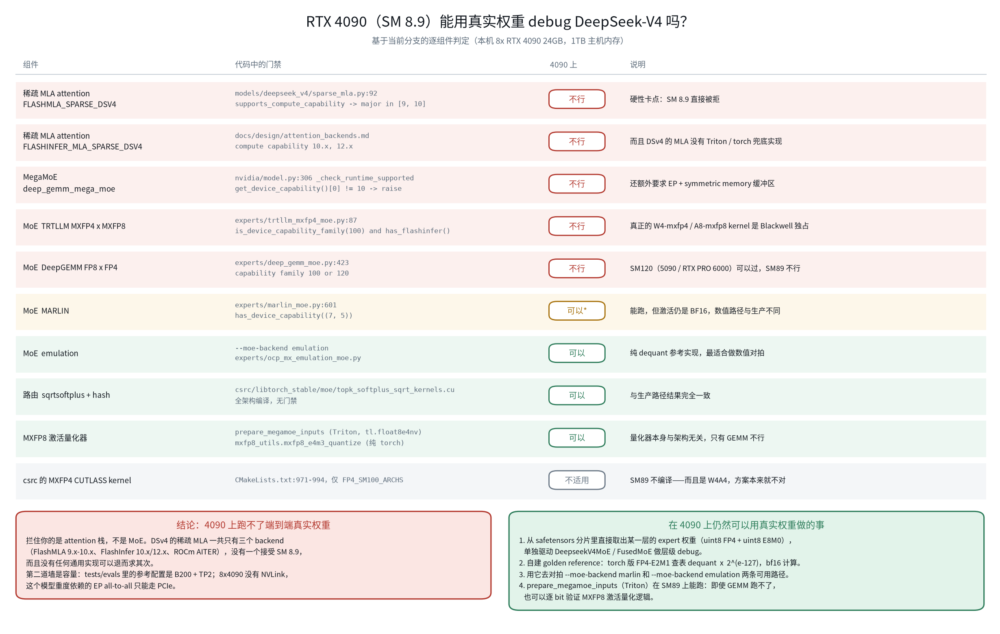

# DeepSeek-V4 MoE 量化推理路径分析

本文梳理 DeepSeek-V4 在当前分支（`v0.25.1-self`）上 MoE 层的量化推理全链路，回答四个问题：

1. MXFP4 和别的 FP4（尤其是 NVFP4）到底差在哪？
2. 从 checkpoint 到真正执行的 MoE kernel，中间经过哪些分发决策？
3. DeepSeek-V4 的 MoE 是「权重 MXFP4 + 激活 MXFP8」，它真实的推理路径是什么样的？
4. `csrc/` 里那套 MXFP4 CUTLASS kernel 适用于 DeepSeek-V4 吗？RTX 4090 能用真实权重 debug 吗？

## 结论速览

| 问题 | 结论 |
| --- | --- |
| MXFP4 与 NVFP4 差在哪 | 元素编码同为 E2M1，差异全在缩放：MXFP4 是 block 32 + E8M0 单级 scale，NVFP4 是 block 16 + FP8 scale + per-tensor global scale。两者在 vLLM 里是完全独立的实现栈 |
| `csrc` 的 MXFP4 kernel 适用吗 | **不适用**。它是 W4A4（激活也压到 MXFP4），唯一消费者是 compressed-tensors 的 `CompressedTensorsW4A4MXFp4MoEMethod`，且只在 SM100 编译 |
| 真实 MoE 路径 | 生产路径是 `--moe-backend deep_gemm_mega_moe`：Triton 做 MXFP8 激活量化 → `deep_gemm.fp8_fp4_mega_moe`。通用路径 `Mxfp4MoEMethod` 中只有 `FLASHINFER_TRTLLM_MXFP4_MXFP8` 是严格的 mxfp4×mxfp8 |
| 4090 端到端 | **跑不了**。卡点是 attention 不是 MoE：稀疏 MLA 的三个 backend 都不接受 SM 8.9，且没有兜底实现 |
| 4090 层级 debug | **可行**。`--moe-backend marlin` / `emulation` 都能跑，配合纯 torch golden reference 做数值对拍 |

## 1. 代码位置

DeepSeek-V4 的模型实现**不在** `vllm/model_executor/models/`，而在独立包 `vllm/models/deepseek_v4/`
（见 `vllm/model_executor/models/registry.py:94`，指向 `vllm.models.deepseek_v4`），按平台分
`nvidia/`、`amd/`、`xpu/` 三套实现。

MoE 相关的核心文件：

| 文件 | 内容 |
| --- | --- |
| `vllm/models/deepseek_v4/quant_config.py` | `DeepseekV4FP8Config`，按 `expert_dtype` 分流 |
| `vllm/models/deepseek_v4/nvidia/model.py:160` | `DeepseekV4MegaMoEExperts` |
| `vllm/models/deepseek_v4/nvidia/model.py:511` | `DeepseekV4MoE` |
| `vllm/models/deepseek_v4/nvidia/ops/prepare_megamoe.py` | MXFP8 激活量化的 Triton kernel |
| `vllm/model_executor/layers/quantization/mxfp4.py:478` | `Mxfp4MoEMethod` |
| `vllm/model_executor/layers/fused_moe/oracle/mxfp4.py:563` | `select_deepseek_v4_mxfp4_moe_backend` |

## 2. FP4 格式辨析：MXFP4 与 NVFP4



理解后面的分发逻辑之前，需要先明确一点：**FP4 的区别不在 FP4 本身，而在缩放方案。**

### 2.1 元素编码是相同的

主流 FP4 只有一种浮点编码 **E2M1**（1 符号 + 2 指数 + 1 尾数），16 个码点，值域固定：

```text
{0, ±0.5, ±1, ±1.5, ±2, ±3, ±4, ±6}
```

MXFP4 与 NVFP4 在这一层完全一致，vLLM 里也只有一个类型：

```python
# vllm/scalar_type.py:345
float4_e2m1f = ScalarType.float_(2, 1, True, NanRepr.NONE)
# vllm/model_executor/layers/quantization/utils/quant_utils.py:21
FP4_DTYPE = torch.uint8        # 两个 FP4 打包进一字节
```

4 bit 只有 16 个码点、最大值 6.0，单独使用毫无意义，所以真正的差异全在如何配 scale。

### 2.2 核心差异

| | **MXFP4** | **NVFP4** |
| --- | --- | --- |
| 元素格式 | E2M1 | E2M1 |
| block size | **32** | **16** |
| scale 格式 | **E8M0**（uint8） | **FP8 E4M3** |
| scale 能表示什么 | 只能是 2 的幂 `2^(e-127)` | 有 3 位尾数，可以是非 2 的幂 |
| 二级 scale | **无** | **有**，per-tensor FP32 global scale |
| scale 开销 | 8/32 = **0.25 bit**/元素 | 8/16 = **0.5 bit**/元素 |
| 有效位宽 | ≈ 4.25 bit | ≈ 4.5 bit |
| 出处 | OCP Microscaling 规范 | NVIDIA，Blackwell 原生 |

这个差异被直接编码在 `QuantKey` 上，对比很直观：

```python
# quant_utils.py:166-173  —— MXFP4：单级 scale，uint8，block 32
kMxfp4Static = QuantKey(FP4_DTYPE,
                        scale=ScaleDesc(MXFP_SCALE_DTYPE, True, GroupShape(1, 32)),
                        symmetric=True)

# quant_utils.py:143-146  —— NVFP4：FP8 scale，block 16，多一个 scale2
kNvfp4Static = QuantKey(FP4_DTYPE,
                        scale=ScaleDesc(FP8_DTYPE, True, GroupShape(1, 16)),
                        scale2=kStaticTensorScale)   # <-- 二级 global scale
```

反量化时也能看出层级差异。NVFP4 需要两级 scale 先相乘：

```python
# nvfp4_emulation_utils.py: dequantize_to_dtype
tensor_sf_dtype = tensor_sf.to(torch.float32) * global_scale
out = tensor_f32 * tensor_sf_dtype.unsqueeze(-1)
```

MXFP4 只有一级，且解码就是一次位移：

```python
# DeepseekV4MegaMoEExperts._ue8m0_uint8_to_float
(sf.to(torch.int32) << 23).view(torch.float32)     # 即 2^(e-127)
```

### 2.3 两种设计的权衡

**MXFP4 用 E8M0 的代价与收益**：scale 只能是 2 的幂，好处是乘除退化成指数加减，硬件通路极简，
且缩放这一步本身不引入任何舍入误差（只有元素量化到 E2M1 时才有）。代价是 block 内 amax 若不接近
2 的幂，动态范围会被浪费，最坏接近 1 bit 的表示能力。block 取 32 也是取舍：元数据开销小，
但一个离群值会拖累整整 32 个元素。

**NVFP4 用 FP8 scale + global scale 的代价与收益**：block 减半到 16、scale 又带 3 位尾数，
对 block 内分布的拟合更贴合，同等条件下精度通常更好。但 FP8 E4M3 自身最大只到 448，
装不下权重的整体量级，必须再配一个 per-tensor FP32 global scale 把范围搬回来——这就是二级 scale
的由来。量化时的 global scale 为 `(FLOAT8_E4M3_MAX * FLOAT4_E2M1_MAX) / amax`，即 `(448 × 6) / amax`。
代价是元数据开销翻倍，kernel 和权重预处理都更复杂。

### 2.4 MX 是一个家族，不只有 FP4

这一点对理解 DeepSeek-V4 的选型很关键。OCP MX 规范固定了 **block=32 与 E8M0 scale**，
变的只是元素格式：

```python
# vllm/model_executor/layers/quantization/utils/ocp_mx_utils.py
OCP_MX_BLOCK_SIZE = 32
OCP_MX_DTYPES = {"mxfp4", "mxfp6_e3m2", "mxfp6_e2m3",
                 "mxfp8_e4m3", "mxfp8_e5m2", "mxint8"}
```

所以 DeepSeek-V4 的「权重 MXFP4 + 激活 MXFP8」是**同一族内的搭配**：两者共享 block=32 和
E8M0 scale，硬件里 scale 通路可以复用，混合精度 GEMM 的实现代价小得多。这不是随意挑的组合。
相比之下 NVFP4 没有配套的 "NVFP8" 家族，激活量化需要另配方案。

### 2.5 在 vLLM 里的后果

MXFP4 与 NVFP4 是两条**完全独立的实现栈**，不共享代码：

| | MXFP4 | NVFP4 |
| --- | --- | --- |
| oracle | `fused_moe/oracle/mxfp4.py` | `fused_moe/oracle/nvfp4.py` |
| CUDA kernel | `csrc/.../fp4/mxfp4_*.cu` | `csrc/.../fp4/nvfp4_*.cu` |
| MoE method | `Mxfp4MoEMethod` | `ModelOptNvFp4FusedMoE` |
| scale swizzle | `[numMTiles, numKTiles, 32, 4, 4]` | 另一套 128×4 layout |

这个岔路口就在 DeepSeek-V4 的 quant config 里——同样是 FP4 权重的 checkpoint，
`moe_quant_algo` 一个字段就决定了走哪条栈：

```python
# vllm/models/deepseek_v4/quant_config.py:142-152
if self.expert_dtype == "fp4":
    if self.moe_quant_algo == "NVFP4":
        return ModelOptNvFp4FusedMoE(...)
    return Mxfp4MoEMethod(layer.moe_config)
```

!!! note "INT4 不是 FP4"
    INT4 是定点整数，没有指数位，量化误差在 block 内均匀分布；FP4 是浮点，小值附近分辨率高、
    大值附近粗，更贴合权重的钟形分布。vLLM 里 INT4 是独立类型（`scalar_types.uint4b8`），
    AWQ/GPTQ 那类通常是 group 128 + FP16 scale，有时还带 zero point 做非对称量化，
    和 MX 系的 block 32 + E8M0 完全是两条路子。

## 3. 量化分发链



checkpoint 里的 `quant_method: "fp8"` 配合 `model_type: "deepseek_v4"`，被
`DeepseekV4FP8Config.override_quantization_method` 劫持成 `deepseek_v4_fp8`。

该配置按 `hf_config.expert_dtype` **延迟**分流（`quant_config.py:57-78`）。之所以延迟解析，是因为
配置对象在 `VllmConfig` setup 期间构造，此时 `set_current_vllm_config` 尚未生效，提前读 `hf_config`
只会拿到默认值 `"fp4"`，从而静默地把 Flash-Base checkpoint 误路由。

分流结果：

- **非 MoE 层**（q/kv/o_proj、shared_experts、compressor、MTP）→ `Fp8LinearMethod`，block 128×128，
  且 **scale dtype 是 `float8_e8m0fnu`**（因为 `is_scale_e8m0 = (expert_dtype == "fp4")`）
- **`expert_dtype == "fp8"`**（DeepSeek-V4-Flash-Base）→ 落回父类 `Fp8Config`，得到 `Fp8MoEMethod`
- **`expert_dtype == "fp4"`**（Flash / Pro）→ `moe_quant_algo == "NVFP4"` 时用 `ModelOptNvFp4FusedMoE`，
  否则 → **`Mxfp4MoEMethod`**

两条路径的专家权重内存布局完全一致：

```text
w13_weight        uint8 [E, 2I, H/2]     FP4 E2M1，一字节两个值，低 nibble 在前
w13_weight_scale  uint8 [E, 2I, H/32]    E8M0 移码指数，block = 32
w2_weight         uint8 [E, H,  I/2]
w2_weight_scale   uint8 [E, H,  I/32]
```

其中 `w13` 的行 `[0:I]` 是 gate（`w1`），`[I:2I]` 是 up（`w3`）。

## 4. 真实的推理路径



### 4.1 共同前端：路由

`ffn_norm` → `GateLinear`（输出 float32）→ `fused_topk_bias(scoring_func="sqrtsoftplus")`
→ `vllm_topk_softplus_sqrt`（`csrc/libtorch_stable/moe/topk_softplus_sqrt_kernels.cu`，
`CMakeLists.txt` 中无架构限制，全平台编译）。

打分公式为 `sqrt(softplus(logit)) + e_score_correction_bias`，随后 top-k、renormalize、
乘 `routed_scaling_factor`。

一个容易忽略的分支：前 `config.num_hash_layers` 层是 **hash MoE**，expert id 直接查
`gate.tid2eid[input_ids]`，完全不走 gate 打分。

### 4.2 路径 A：MegaMoE（生产路径）

启用方式为 `--moe-backend deep_gemm_mega_moe`。这条路径会**绕过 `Mxfp4MoEMethod` 和整个 oracle**：
`DeepseekV4MoE.__init__` 不构造 `FusedMoE`，而是直接实例化 `DeepseekV4MegaMoEExperts` 并自己持有
uint8 参数。

官方 eval 配置用的就是这条路径（`tests/evals/gsm8k/configs/moe-refactor/DeepSeek-V4-Flash-deepgemm-mega-moe.yaml`，
B200 + TP2 + EP + MTP）。

**激活量化**在 `prepare_megamoe_inputs`（Triton）中完成，这就是所谓的 MXFP8：

```python
GROUP_K = 32                            # 每 32 个元素一组
scale = amax / 448.0                    # 448 = fp8 e4m3 的最大值
scale_exp = 指数位 + (尾数非零 ? 1 : 0)   # 向上取整到 2 的幂 -> E8M0
scale_exp = clamp(scale_exp, 1, 254)
fp8 = (hidden / rounded_scale).to(tl.float8e4nv)
```

输出 `x_fp8 [T, H] float8_e4m3fn` 加 `x_sf`（每个 int32 打包 4 个 uint8 指数）。

**权重预处理**在 `finalize_weights()` 中一次性完成：

1. `_ue8m0_uint8_to_float`：`(u8 << 23).view(float32)`，即 `2^(e-127)`
2. `deep_gemm.transform_sf_into_required_layout(sf, MN, K, (1, 32), E)`
3. `deep_gemm.transform_weights_for_mega_moe(L1, L2)`
4. 原始 `nn.Parameter` 置 `None` 释放（storage 由 L2 持有，不会失效）

**主 kernel** `deep_gemm.fp8_fp4_mega_moe` 内部依次是：symmetric-memory EP all-to-all dispatch →
GEMM1（mxfp8 激活 × mxfp4 `w13`）→ 带 clamp 的 SwiGLU（`activation_clamp = config.swiglu_limit`）→
中间结果重新量化为 mxfp8 → GEMM2（× mxfp4 `w2`）→ topk 加权 combine → all-to-all combine。

硬性门槛见 `_check_runtime_supported()`：要求 `get_device_capability()[0] == 10`（纯 SM100），
且必须开启 `--enable-expert-parallel`。

### 4.3 路径 B：`Mxfp4MoEMethod`（通用路径）

`select_deepseek_v4_mxfp4_moe_backend` 在 CUDA 上的 auto 优先级（`_get_priority_backends()`）：

| 优先级 | backend | 权重 × 激活 | 设备门槛 |
| --- | --- | --- | --- |
| 1 | `FLASHINFER_TRTLLM_MXFP4_MXFP8` | MXFP4 × **MXFP8**（block 32 / e8m0） | SM100 family + flashinfer |
| 2 | `DEEPGEMM_MXFP4` | MXFP4 × FP8 **1×128 分块**（`kFp8Dynamic128Sym`） | SM100 或 SM120 |
| 3 | `MARLIN` / `BATCHED_MARLIN` | MXFP4 kernel 内 dequant × **BF16** | SM75+ |

!!! warning "只有第 1 项是严格意义的 W4-mxfp4 / A8-mxfp8"
    第 2 项 DeepGEMM 的激活是 1×128 分块 FP8，不是 block-32 的 MXFP8
    （见 `DeepGemmFP4Experts._ACT_BLOCK_K = 128`）。

    本分支中真正的 MXFP8 激活只出现在两处：MegaMoE 的 Triton staging kernel，
    以及 FlashInfer TRTLLM / CUTLASS 的 `_MXFP8` 变体。

ROCm 上 DeepSeek-V4 另有覆盖：`[AITER_MXFP4_BF16, TRITON_UNFUSED]`。任意设备都可以用
`--moe-backend emulation` 作为逃生口，走 `OCP_MXQuantizationEmulationTritonExperts`
（全量 dequant 到 bf16 再算）。

## 5. `csrc` 的 MXFP4 kernel 为何不适用

`csrc/libtorch_stable/quantization/fp4/` 下有两个 MXFP4 文件：

- `mxfp4_experts_quant.cu` → `ops.mxfp4_experts_quant` / `ops.silu_and_mul_mxfp4_experts_quant`
- `mxfp4_blockwise_moe_kernel.cu` → `ops.cutlass_mxfp4_moe_mm`

它们对 DeepSeek-V4 **不适用**，三条独立理由，任何一条都足以排除：

1. **精度方案不匹配（最根本）**。`mxfp4_experts_quant.cu` 做的是把 BF16/FP16 激活量化成
   **MXFP4**（E2M1 + E8M0，block 32），配套的 `cutlass_mxfp4_moe_mm` 是
   **MXFP4 × MXFP4 的 W4A4** grouped GEMM。DeepSeek-V4 需要的是 W4(mxfp4) × A8(mxfp8)，
   把激活压到 4 bit 会直接毁掉精度。

2. **调用链上够不着**。唯一消费者是 `CutlassExpertsMxfp4`（`cutlass_moe.py:990`），
   它只被 `CompressedTensorsW4A4MXFp4MoEMethod` 使用，即 compressed-tensors 的 W4A4 checkpoint。
   而 `Mxfp4MoeBackend` 枚举里**没有 vLLM 自家 CUTLASS 这一项**，`backend_to_kernel_cls`
   也没有对应分支。

3. **编译范围**。`CMakeLists.txt:971-994` 中，这两个 `.cu` 只在 `FP4_SM100_ARCHS`
   （`10.0a/10.1a/10.3a`，CUDA 13 下为 `10.0f/11.0f`）且 CUDA ≥ 12.9 时编译
   （kernel 需要 PACK16 模式）。在 SM89 上连符号都不存在。

如果目标是复现或优化 DeepSeek-V4 的 MoE kernel，参考对象应该是 `deep_gemm.fp8_fp4_mega_moe`
和 flashinfer 的 `trtllm_fp4_block_scale_moe`，而不是这两个文件。

## 6. RTX 4090（SM 8.9）可行性



### 6.1 端到端不可行

拦住的是 attention 栈而非 MoE。`DeepseekV4FlashMLABackend.supports_compute_capability`
写死 `capability.major in [9, 10]`（`vllm/models/deepseek_v4/sparse_mla.py:92`），
FlashInfer 版要求 10.x / 12.x。`_select_dsv4_attn_cls` 在 CUDA 上只会返回这两个类之一，
**没有 Triton / torch 兜底实现**，所以 SM 8.9 上模型根本起不来。

第二道墙是容量：DeepSeek-V4-Flash 的参考配置是 B200 × TP2；8×4090 虽有 192 GB 显存，
但没有 NVLink，EP all-to-all 只能走 PCIe。此外 `tests/models/registry.py:263` 标了
`is_available_online=False`，权重本身也未必容易获取。

### 6.2 层级 debug 可行

| 组件 | 4090 | 说明 |
| --- | --- | --- |
| 稀疏 MLA attention | 不行 | `major in [9, 10]` / `10.x, 12.x`，无兜底 |
| MegaMoE | 不行 | `_check_runtime_supported` 要求 `major == 10` |
| TRTLLM MXFP4×MXFP8 | 不行 | `is_device_capability_family(100)` |
| DeepGEMM FP8×FP4 | 不行 | capability family 100 或 120，SM89 不在内 |
| MARLIN | 可以 | `has_device_capability((7, 5))`，但激活是 BF16 |
| emulation | 可以 | 纯 dequant 参考实现 |
| 路由 sqrtsoftplus / hash | 可以 | kernel 全架构编译 |
| MXFP8 激活量化器 | 可以 | 量化器与架构无关，只有 GEMM 不行 |

建议的 debug 方式：

1. 从 safetensors 分片里按 `experts.{i}.w1/w2/w3` 及其 `.scale` 读出 uint8 FP4 权重和
   uint8 E8M0 scale，单独驱动 `FusedMoE` / `Mxfp4MoEMethod`。
   注意权重名映射：fp4 checkpoint 下 expert 的 `.scale` → `.weight_scale`，
   其余 → `.weight_scale_inv`（见 `_make_deepseek_v4_weights_mapper`）。
2. 自建 golden reference：FP4 E2M1 查表 dequant × `2^(e-127)`，bf16/fp32 计算。
3. 用 `--moe-backend marlin` 和 `--moe-backend emulation` 两条可用路径对拍。
4. `prepare_megamoe_inputs` 用的是 `tl.float8e4nv`，Ada 支持，可以单独跑起来逐 bit
   验证 MXFP8 量化逻辑。

## 7. 配套对拍脚本

脚本位于 `/home/cj002213/intellif_infer/vllm_project/dsv4_moe_docs/dsv4_moe_probe.py`
（仓库外，避免污染 vLLM 源码树）。

```bash
# 自检 + dummy 权重，纯 torch 参考（CPU 即可跑）
python3 dsv4_moe_probe.py --dummy --ref-only

# 造一个 mini MXFP4 checkpoint，验证读取路径
python3 dsv4_moe_probe.py --make-fake-ckpt /tmp/fake_dsv4
python3 dsv4_moe_probe.py --model /tmp/fake_dsv4 --discover
python3 dsv4_moe_probe.py --model /tmp/fake_dsv4 --layer 1 --ref-only

# 真实权重 + marlin 对拍（需要 CUDA 环境）
python3 dsv4_moe_probe.py --model /path/to/DeepSeek-V4-Flash \
    --layer 3 --num-experts 8 --backend marlin
```

脚本包含四部分：

1. **`--discover`**：正则扫描 safetensors index 自动发现 expert 权重命名（不写死 key），
   打印层数、专家数、dtype、shape。DeepSeek-V4 的实际命名是
   `layers.{L}.ffn.experts.{E}.w[123].{weight,scale}`，但不同发布版本可能有前缀差异，
   匹配失败时会打印实际 key 供调整正则。

2. **纯 torch golden reference**：不依赖 `amd-quark`（`vllm.dequant_mxfp4` 需要它，
   4090 环境通常没装）。FP4-E2M1 查表解包配合 `(u8 << 23).view(float32)` 的 E8M0 解码，
   与 `DeepseekV4MegaMoEExperts._ue8m0_uint8_to_float` 使用同一种位运算。

3. **两种 MXFP8 语义**：代码库里这两处的取整方向确实不同，脚本都实现了。
    - `megamoe`：`prepare_megamoe_inputs` 的 `amax / 448` 加指数**向上**取整，clamp `[1, 254]`
    - `mxspec`：`mxfp8_utils._mxfp8_e4m3_quantize_torch` 的 `floor(log2(amax)) + 127`，clamp `[0, 254]`

    输出表里「激活 MXFP8 vs 激活不量化」一栏，就是 DeepSeek-V4 激活量化这一步**单独**引入的误差
    （权重侧的 MXFP4 误差已包含在 golden 里，两边共用同一组 dequant 权重）。

4. **vLLM 后端对拍**：不走 `FusedMoE` layer（那需要完整的 `vllm_config` 和分布式初始化），
   而是直接调用 oracle 暴露的 `convert_weight_to_mxfp4_moe_kernel_format`、
   `make_mxfp4_moe_quant_config`、`make_mxfp4_moe_kernel` 三个工厂函数，
   等价于 `Mxfp4MoEMethod._setup_kernel` 做的事。

### 已验证与未验证

已实测通过：自检四项全 PASS（E8M0 解码、MXFP4 round-trip、nibble 顺序、符号位加 scale）；
checkpoint 读取路径用多分片加 `index.json` 的构造权重端到端验证过（w1/w3 拼成 `w13`、
shape 推断、dtype 校验均正确）。

**未实测**：marlin 后端对拍那一栏。调用签名已验证正确（一路走到
`prepare_moe_mxfp4_layer_for_marlin` → `ops.gptq_marlin_repack`），异常也被优雅捕获，
但最终 CUDA 算子没能执行。原因是测试环境：

- `torch` 为 `2.12.0+cpu`，`torch.cuda.is_available()` 为 `False`
- `vllm._C` / `vllm._C_stable_libtorch` 均未编译
- import 到的是 site-packages 里的 vllm 0.25.1，而非本仓库源码

脚本内置 `check_env()`，运行前会把这三点明确打印出来。要跑真 kernel 需按
[AGENTS.md](../../AGENTS.md) 的流程准备环境：

```bash
uv venv --python 3.12 && source .venv/bin/activate
VLLM_USE_PRECOMPILED=1 uv pip install -e . --torch-backend=auto
```

注意在仓库根目录执行或设置 `PYTHONPATH`，否则仍会 import 到 site-packages 中的副本。

## 参考

- [量化识别与分发](quantization_dispatch.md) — 本文第 3 节所属的通用机制：
  vLLM 如何从 checkpoint 识别量化方案并逐层分发到 kernel
- [MoE kernel features](moe_kernel_features.md)
- [Fused MoE modular kernel](fused_moe_modular_kernel.md)
- [Attention backends](attention_backends.md) — 其中「DeepSeek V4 Decode Backends」一节列出了
  三个稀疏 MLA backend 的 compute capability 要求
