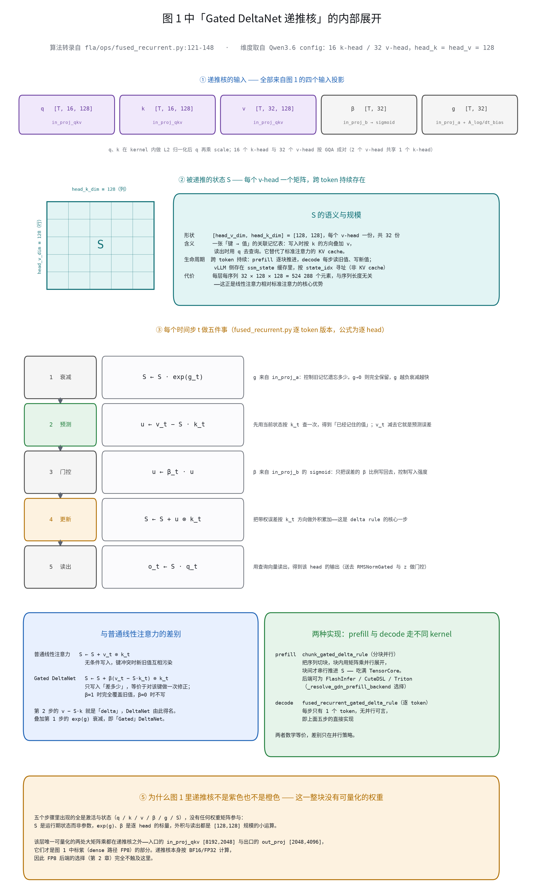
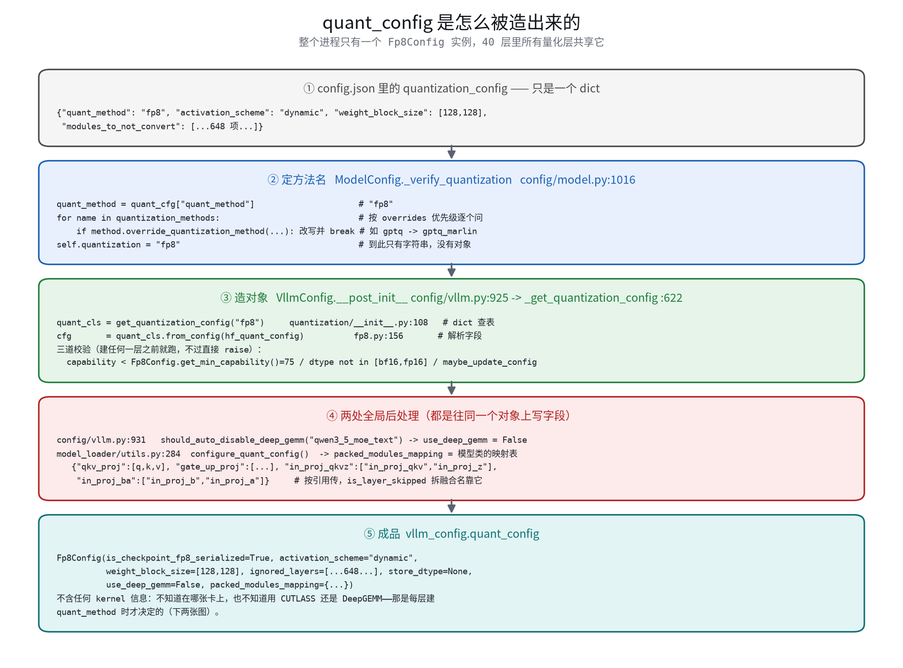
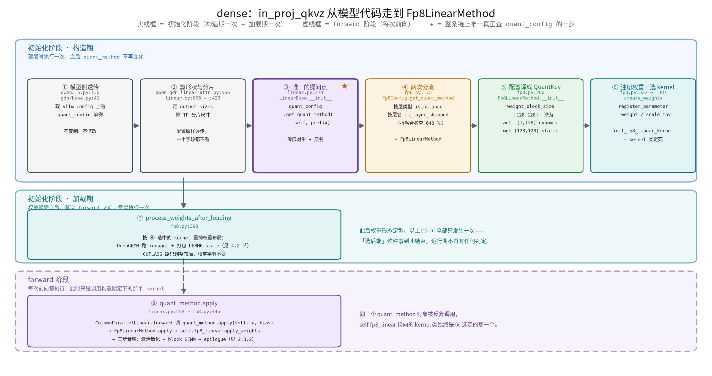
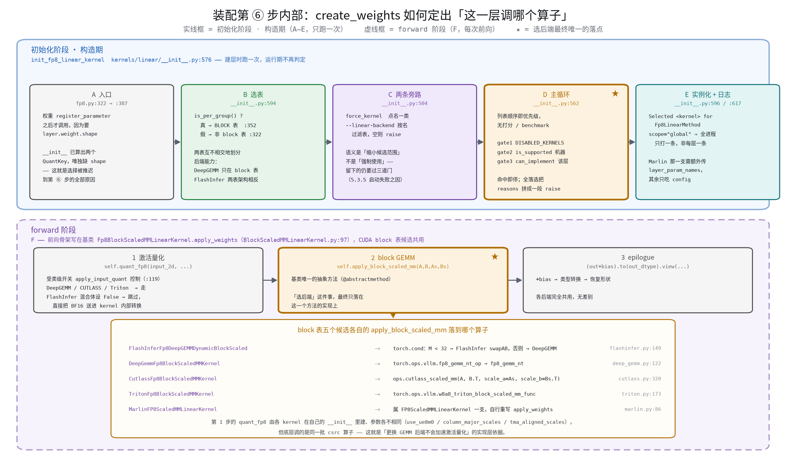
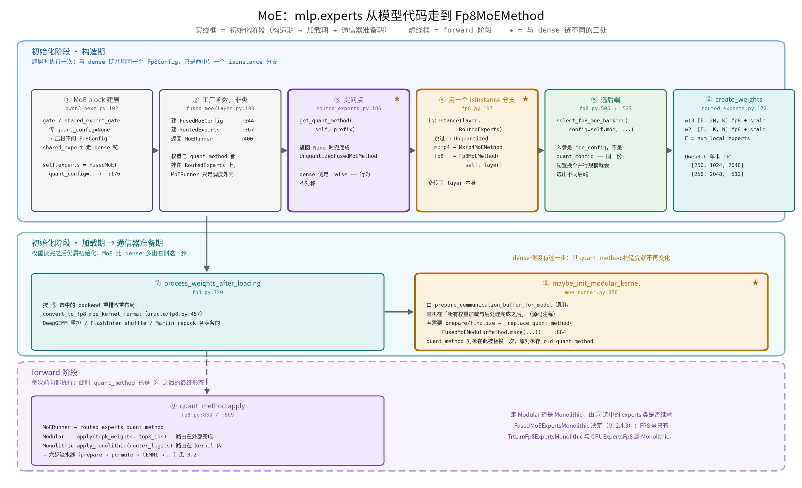
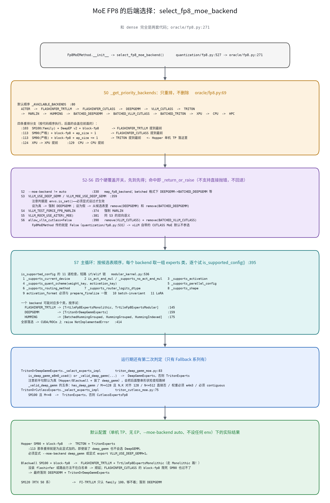
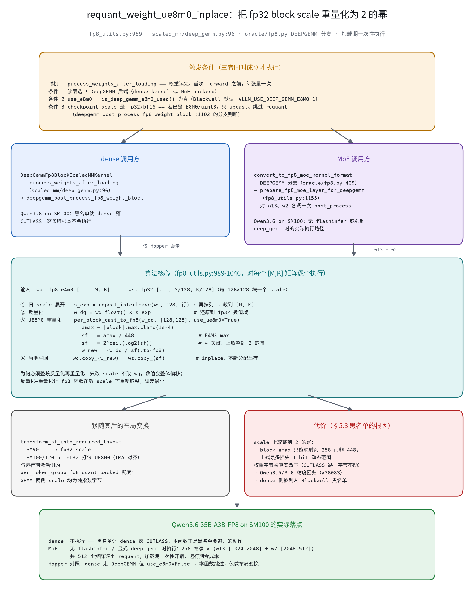
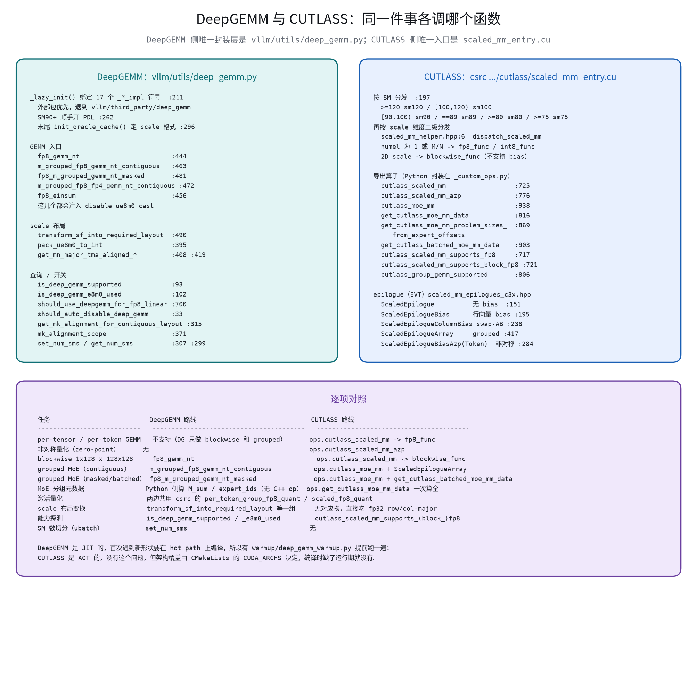
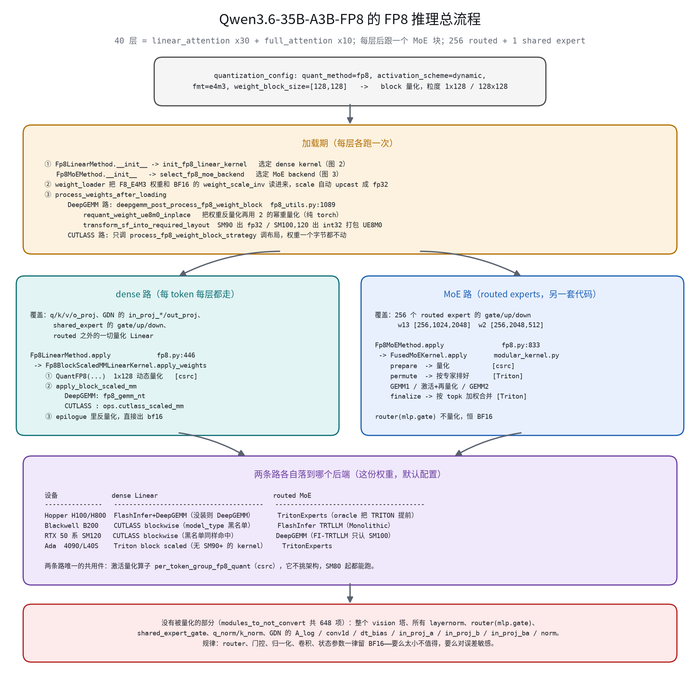
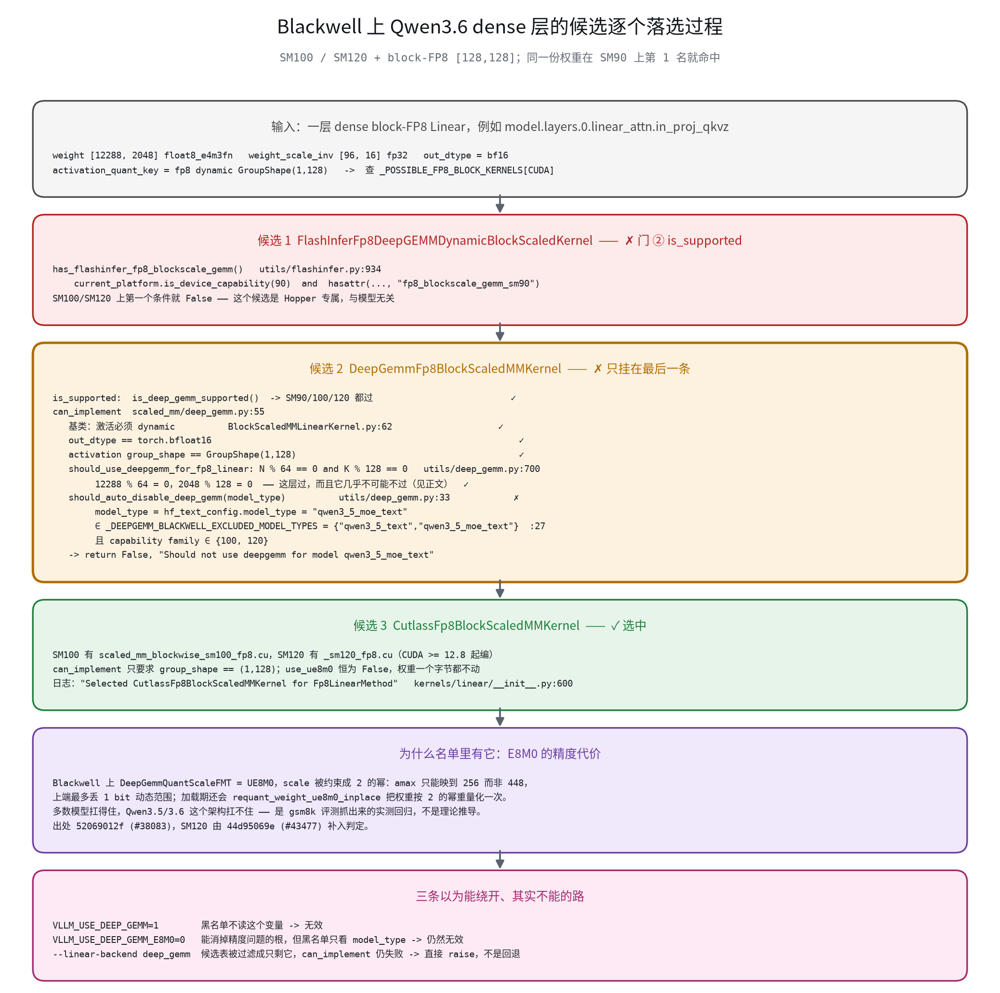

# vLLM FP8 量化：初始化、运行时与 Qwen3.6 on Blackwell 实战

**摘要**：本文以 vLLM（分支 `v0.25.1-self`）为对象，系统梳理 FP8 量化推理的完整链路。
初始化部分阐述 HF checkpoint 的 `quantization_config` 如何构造为进程级唯一的
`Fp8Config`、各层如何经 `get_quant_method` 获得量化方法，以及 dense Linear 与
routed MoE 两条相互独立的后端选择机制（候选表、默认优先级、后端与实现类的映射）。
运行时部分阐述 dense 的「激活量化 → block GEMM → epilogue」三步流程与 MoE 的六步
流水线，以及唯一存在运行期重判定的 Fallback 机制。原理部分集中讨论 scale 格式与
两大 GEMM 库：UE8M0 的数学与硬件根据、`requant_weight_ue8m0_inplace` 的算法与
调用链、DeepGEMM 与 CUTLASS 在能力边界与接口层面的系统对比。案例部分以
Qwen3.6-35B-A3B-FP8 在 Blackwell（SM100）上的部署为对象，论证 dense 路径无法
使用 FlashInfer（block 量化仅有 SM90 kernel）与 DeepGEMM（UE8M0 精度回归引入的
模型黑名单）的原因，并分析 MoE 路径上 FlashInfer TRTLLM 与 DeepGEMM 的取舍。

## 目录

| 章 | 小节 |
| --- | --- |
| **1 引言** | 1.1 研究对象与内容组织 · 1.2 前提与约定 · 1.3 预备事实：dense 与 MoE 的后端机制相互独立 |
| **2 初始化阶段：从 HF checkpoint 到后端定型** | 2.1 `quant_config` 的构造 · 2.2 `quant_method` 的装配 · 2.3 dense 后端选择 · 2.4 MoE 后端选择 · 2.5 收尾：按后端重排权重 |
| **3 运行时阶段：FP8 前向的整体逻辑** | 3.1 dense 三步 · 3.2 MoE 六步 · 3.3 运行期重判定 |
| **4 scale 格式与两大 GEMM 库** | 4.1 UE8M0 的数学原理 · 4.2 `requant_weight_ue8m0_inplace` · 4.3 DeepGEMM 与 CUTLASS 对比 |
| **5 案例分析：Qwen3.6-MoE-FP8 在 Blackwell（SM100）上** | 5.1 checkpoint 概况 · 5.2 加载期实况 · 5.3 dense 侧不可用性分析 · 5.4 MoE 侧取舍 · 5.5 结论矩阵 |
| **6 结论** | 六条要点 |
| **附录** | A 配图索引 · B requant 数值演示 · C 相关文档 |

---

## 1 引言

### 1.1 研究对象与内容组织

本文回答四个问题：

1. `quant_config` 如何构造，一层 Linear / 一个 MoE block 获得它之后做了什么；
2. FP8 模型运行时，dense Linear 和 MoE 分别依据什么规则选择 CUTLASS、DeepGEMM
   或其他后端；
3. 为什么 DeepGEMM 在 Blackwell 上要求 UE8M0 scale 而 CUTLASS 能保持 fp32，
   两库的能力与接口差异何在；
4. 一份真实的 Qwen3.6-MoE-FP8 权重，从加载到前向的完整算子链路是什么形态。

全文按「初始化（第 2 章）→ 运行时（第 3 章）→ 原理：scale 格式与两大 GEMM 库
（第 4 章）→ 案例分析（第 5 章）」组织，第 6 章给出结论。第 2、3 章是机制总览，
第 4 章是理解第 5 章案例结论所需的原理，第 5 章将前三章应用到一份具体权重上。

### 1.2 前提与约定

前置知识（FP8 的数值格式、量化粒度、csrc 算子清单）见
[FP8 量化原理与 vLLM 实现](fp8_quantization_kernels.md)，本文不重复。
「checkpoint 如何被识别为 FP8」的通用规则见
[量化识别与分发](quantization_dispatch.md)，本文 2.1 节是该规则在 Qwen3.6 上的
具体实例。所有行号以分支 `v0.25.1-self` 为准。

### 1.3 预备事实：dense 与 MoE 的后端机制相互独立

这一事实贯穿全文，也是实践中最常见的误判来源。同一个模型里，dense Linear 和
routed MoE 的后端**分别决定、互不影响、代码互不共享**（表 1）。

**表 1** dense Linear 与 routed MoE 后端机制对比

| 维度 | dense Linear | routed MoE |
| --- | --- | --- |
| 入口 | `Fp8LinearMethod.__init__` → `init_fp8_linear_kernel`（`fp8.py:387`） | `Fp8MoEMethod.__init__` → `select_fp8_moe_backend`（`fp8.py:527`） |
| 候选表 | `_POSSIBLE_FP8_BLOCK_KERNELS` / `_POSSIBLE_FP8_KERNELS`（`kernels/linear/__init__.py`） | `_AVAILABLE_BACKENDS`（`fused_moe/oracle/fp8.py:80`） |
| 选择算法 | 静态列表顺序，第一个通过门禁者胜出 | 先重排列表，再过五个覆盖开关，最后扫描 |
| 覆盖开关 | `--linear-backend`、`VLLM_DISABLED_KERNELS` | `--moe-backend`、`VLLM_USE_DEEP_GEMM`、`VLLM_MOE_USE_DEEP_GEMM`、`VLLM_TEST_FORCE_FP8_MARLIN` |
| 运行期是否重判 | **否**，构造期定死 | 部分会（`FallbackExperts` 系列每次 forward 重判，见 3.3） |

两条路径覆盖的层也不同：dense 路径管辖 attention 的 q/k/v/o_proj、线性注意力的
`in_proj_*`/`out_proj`、**shared expert 的三个投影**以及一切非 routed 的量化
Linear；MoE 路径只管辖 routed expert 的 gate/up/down。`o_proj` 和 shared expert
均属于 dense 路径，实践中经常被误归入 MoE。

仅凭上述文字，不熟悉 Qwen3.6 结构的读者仍难以定位 `in_proj_qkv`、`in_proj_b`
这些算子究竟在计算图的哪个位置。图 1 把一层的完整数据流画了出来，并将每个权重
标注在它所在的那条边上——层名、shape、dtype 全部实测自该权重的
`layers-0.safetensors`（linear_attention 层）与 `layers-3.safetensors`
（full_attention 层）。


**图 1** Qwen3.6-35B-A3B-FP8 一层的数据流与权重位置。梯形 = Linear（唯一可量化的算子）；**紫框 = dense 路径 FP8，橙框 = MoE 路径 FP8，细灰框 = 保持 BF16**

图的读法与常见的模型结构图一致：**左侧是整个模型的骨架**（Tokenizer → Embedding
→ 40 层 → RMSNorm → LM-Head），层堆叠按 `10 × [3 × LinearAttention + 1 ×
FullAttention]` 展开；**右侧三个虚线面板**是骨架里三个彩色块的放大，用虚线引到
对应位置。每层的主干是标准两段式：`input_layernorm` → 注意力子层 → 残差① →
`post_attention_layernorm` → MoE block → 残差②。

**Linear 一律画成梯形**，因为它是这个模型里唯一可量化的算子类型；框线颜色即量化
归属。三处要点：

**① GDN 面板：四个输入投影去向完全不同。** 同一份 `x` 分别喂给四个投影：
`in_proj_qkv` 产出 q/k/v 后过 `conv1d`；`in_proj_b` 产出的 b 经 sigmoid 变成写入
强度 β；`in_proj_a` 产出的 a 配合 `A_log`、`dt_bias` 变成衰减率 g；四者汇入
Gated DeltaNet 递推核。`in_proj_z` 产出的 z 则**旁路到递推之后**，在
`RMSNormGated` 里充当输出门，最后过 `out_proj`。

这条数据流解释了「为什么 `in_proj_a` / `in_proj_b` 保持 BF16 而 `in_proj_z` 被
量化」——前两者只有 `[32, 2048]`，产出的是**直接决定递推稳定性的门控标量**
（β 与 g），量化收益小而风险大；`in_proj_z` 虽然同为门控用途，却是
`[4096, 2048]` 的大矩阵乘，值得量化。

递推核内部的展开见图 2。它对本文主题的意义在最后一栏：**递推核里没有任何可量化
的权重**——五个步骤出现的全是激活与状态，因此 FP8 后端的选择完全不触及这里，
该层可量化的只有入口 `in_proj_qkv` 与出口 `out_proj` 两处大矩阵乘。



**图 2** 图 1 中「Gated DeltaNet 递推核」的内部展开（算法转录自 `fla/ops/fused_recurrent.py:121-148`）

递推核维护的状态 `S` 是每个 v-head 一个 `[128, 128]` 矩阵（共 32 份），可理解为
一张「键 → 值」的关联记忆表，**替代了标准注意力的 KV cache**，其大小与序列长度
无关。每个时间步做五件事：

```text
1 衰减   S ← S · exp(g_t)          g 来自 in_proj_a，控制旧记忆遗忘多少
2 预测   u ← v_t − S · k_t         先按 k_t 查一次，v_t 减去它即预测误差
3 门控   u ← β_t · u               β 来自 in_proj_b，控制写入强度
4 更新   S ← S + u ⊗ k_t           带权误差按 k_t 方向外积累加
5 读出   o_t ← S · q_t             送去 RMSNormGated 与 z 做门控
```

第 2 步的 `v − S·k` 就是「delta」，也是 DeltaNet 与普通线性注意力
（`S ← S + v ⊗ k`，无条件写入）的本质差别：它只写入「差多少」，等价于对该键做
一次修正，避免键冲突时新旧值互相污染；叠加第 1 步的 `exp(g)` 衰减，即
「Gated」DeltaNet。prefill 与 decode 走的是数学等价、并行策略不同的两个 kernel
（`chunk_gated_delta_rule` 分块并行 / `fused_recurrent_gated_delta_rule` 逐 token）。

**② Gated Attention 面板：四个投影全部量化**，`q_norm` / `k_norm` 保持 BF16。
注意 `o_proj` 位于注意力之后、残差之前，**属 dense 路径而非 MoE**——这是实践中
最常见的误归类。

**③ MoE 面板：一个 block 内三条去向。** `mlp.gate`（router）与
`mlp.shared_expert_gate` 建层时**显式传 `quant_config=None`**，连 `Fp8Config` 都
不询问，恒为 BF16；`mlp.shared_expert` 的三个投影是 FP8，但走 **dense 路径**；
只有 `mlp.experts.{0..255}` 的三个投影走 MoE 路径。图中这两个专家框形状标注完全
相同（都是 `[512,2048]×2 + [2048,512]`），却一个标 `Fp8LinearMethod`、一个标
`Fp8MoEMethod`——这正是本节所说「相互独立」在模型结构上的具体落点。

vLLM 侧还会做权重融合，checkpoint 名与运行时模块名并非一一对应：
`in_proj_qkv + in_proj_z → in_proj_qkvz`、`in_proj_b + in_proj_a → in_proj_ba`
（整块 BF16）、`q_proj + k_proj + v_proj → qkv_proj`。这也是 2.1 节
`packed_modules_mapping` 存在的原因。

一个便于记忆的规律：被量化的都是「大矩阵乘」，保持 BF16 的要么规模太小不值得
（`in_proj_a` 仅 32×2048），要么对误差敏感（router 一旦出错，选出的专家就全错）。
checkpoint 用 `modules_to_not_convert` 的 648 项把后者显式列了出来。

因此，「安装了 DeepGEMM 即意味着模型在使用 DeepGEMM」的推断不成立——完全可能
dense 在使用而 MoE 未使用，或反之。

三张候选表的 CUDA 默认条目分别列于表 2、表 3、表 4，第 2 章的 2.3 / 2.4 节均是
对这三张表消费过程的解释。

**表 2** `_POSSIBLE_FP8_BLOCK_KERNELS`：dense block 量化候选（CUDA，按优先级）

| 优先级 | kernel 类 |
| --- | --- |
| 1 | `FlashInferFp8DeepGEMMDynamicBlockScaledKernel` |
| 2 | `DeepGemmFp8BlockScaledMMKernel` |
| 3 | `CutlassFp8BlockScaledMMKernel` |
| 4 | `MarlinFP8ScaledMMLinearKernel` |
| 5 | `TritonFp8BlockScaledMMKernel` |
| 6 | `HummingFP8ScaledMMLinearKernel` |

**表 3** `_POSSIBLE_FP8_KERNELS`：dense per-tensor / per-token 候选（CUDA，按优先级）

| 优先级 | kernel 类 |
| --- | --- |
| 1 | `MarlinFP8ScaledMMLinearKernel` |
| 2 | `FlashInferFP8ScaledMMLinearKernel` |
| 3 | `CutlassFP8ScaledMMLinearKernel` |
| 4 | `PerTensorTorchFP8ScaledMMLinearKernel` |
| 5 | `ChannelWiseTorchFP8ScaledMMLinearKernel` |
| 6 | `HummingFP8ScaledMMLinearKernel` |

**表 4** `_AVAILABLE_BACKENDS`：routed MoE 候选（全平台一张表，按默认顺序）

| 顺序 | Backend | 顺序 | Backend |
| --- | --- | --- | --- |
| 1 | `AITER` | 8 | `HUMMING` |
| 2 | `FLASHINFER_TRTLLM` | 9 | `BATCHED_DEEPGEMM` |
| 3 | `FLASHINFER_CUTLASS` | 10 | `BATCHED_VLLM_CUTLASS` |
| 4 | `DEEPGEMM` | 11 | `BATCHED_TRITON` |
| 5 | `VLLM_CUTLASS` | 12 | `XPU` |
| 6 | `TRITON` | 13 | `CPU` |
| 7 | `MARLIN` | 14 | `HPC` |

三张表的来源与性质在正文补充如下。dense 的两张表（表 2、表 3）定义于
`kernels/linear/__init__.py:352` 与 `:322`，**按平台划分 key**——CUDA / ROCM /
CPU / XPU 各有一份列表，上表仅列 CUDA；它们是模块级常量，运行期不变。MoE 的表
（表 4）定义于 `fused_moe/oracle/fp8.py:80`，**不分平台**——平台差异不体现在表
中，而是由 `_move_to_front` 重排（表 13）和各 experts 类的
`_supports_current_device` 门禁实现；且它定义在 `_get_priority_backends` 函数体
内，**每次调用重建一份**（因为需要就地重排和删除元素）。dense 两张表的逐条目
门禁细节见表 10（2.3.1 节），MoE 的 backend → experts 类映射见表 14（2.4.1 节）。

---

## 2 初始化阶段：从 HF checkpoint 到后端定型

初始化阶段依次回答三个问题，并以一次收尾动作结束：

1. **`quant_config` 由谁构造？**（2.1）——`config.json` 中的 `quantization_config`
   经 `Fp8Config.from_config` 解析为**进程级唯一**的一个配置对象，只描述
   checkpoint（量化方法、粒度、哪些层不量化），不描述硬件。
2. **每一层如何获得自己的 `quant_method`？**（2.2）——层在构造时以自己的层名向
   该对象请求，dense 拿到 `Fp8LinearMethod`、MoE 拿到 `Fp8MoEMethod`，两条装配
   链互不共享代码。
3. **`quant_method` 内部如何确定具体后端？**（2.3 dense / 2.4 MoE）——硬件相关
   的决策**全部发生在 `quant_method` 的构造函数中**：dense 按候选表逐项过门禁，
   MoE 按重排规则与 11 道检查逐项筛选。
4. **收尾：格式转换**（2.5）——权重加载完成后，`process_weights_after_loading`
   按已选定的后端对权重与 scale 做一次性重排，此后运行期不再改变布局。

一条主线贯穿全章：**配置对象不含任何硬件信息，后端决策集中在第 3 步的构造函数
里**，第 4 步只负责把权重排成被选中后端所要求的形状。

### 2.1 quant_config 的构造：config.json → Fp8Config



**图 3** quant_config 的五步构造过程

构造分五步：

1. **`ModelConfig._verify_quantization`**（`config/model.py:1016`）读取 `config.json`
   的 `quantization_config["quant_method"]`，再由每个已注册方法通过
   `override_quantization_method` 决定是否改写（GPTQ→GPTQ-Marlin 一类）。此时结果
   仅是字符串 `"fp8"`，尚无对象。
2. **`VllmConfig.__post_init__`**（`config/vllm.py:925`）调 `_get_quantization_config`
   （`:622`）→ `get_quant_config`（`weight_utils.py:240`）→ `get_quantization_config("fp8")`
   查表得到类（`quantization/__init__.py:108`，全部条目见表 5）→
   `Fp8Config.from_config(hf_quant_config)`（`fp8.py:156`）解析字段。
3. 随后执行三道校验：`get_min_capability()`（FP8 为 75）、`get_supported_act_dtypes()`、
   `maybe_update_config()`。**这三道校验发生在任何一层被构造之前**，因此启动阶段的
   能力不足报错必然源于此处。
4. 两处向该对象**补写字段**：`config/vllm.py:931` 的 Blackwell 黑名单将
   `use_deep_gemm` 置 `False`（详见 5.3）；`model_loader/utils.py:284` 的
   `configure_quant_config` 将模型类的 `packed_modules_mapping` 按引用挂载。
5. 成品挂在 `vllm_config.quant_config`。对 Qwen3.6-35B-A3B-FP8 而言即：

```python
Fp8Config(is_checkpoint_fp8_serialized=True, activation_scheme="dynamic",
          weight_block_size=[128, 128], ignored_layers=[...648 项...],
          store_dtype=None,
          use_deep_gemm=False,             # ← 第 4 步写入，只影响 dense
          packed_modules_mapping={...})    # ← 第 4 步挂载
```

第 2 步「查表」的那张表是 `get_quantization_config` 函数体内的
`method_to_config`（`quantization/__init__.py:140`）——它是**字符串 → 配置类**的
全部注册关系，`Fp8Config` 只是其中一行。表 5 按其代码顺序完整列出，配置类的路径
若无特别说明均相对 `vllm/model_executor/layers/quantization/`。

**表 5** `get_quantization_config` 的 `quant_method` → 配置类映射表

| `quant_method` 字符串 | 配置类 | 定义位置 | 说明 |
| --- | --- | --- | --- |
| `awq` / `auto_awq` / `awq_marlin` | `AutoAWQConfig` | `auto_awq.py` | 三个键共用一个类；`awq_marlin` 由第 1 步的 `override_quantization_method` 改写产生 |
| `gptq` / `auto_gptq` / `gptq_marlin` | `AutoGPTQConfig` | `auto_gptq.py` | 同上，`gptq_marlin` 亦为改写结果 |
| `fp8` | `Fp8Config` | `fp8.py` | **本文对象**，`get_min_capability()` 为 75 |
| `fbgemm_fp8` | `FBGEMMFp8Config` | `fbgemm_fp8.py` | 在 `DEPRECATED_QUANTIZATION_METHODS`（`:49`）中，已弃用 |
| `fp_quant` | `FPQuantConfig` | `fp_quant.py` | 同为已弃用 |
| `modelopt` | `ModelOptFp8Config` | `modelopt.py` | NVIDIA ModelOpt 导出的 FP8 |
| `modelopt_fp4` | `ModelOptNvFp4Config` | `modelopt.py` | NVFP4 |
| `modelopt_mxfp8` | `ModelOptMxFp8Config` | `modelopt.py` | MXFP8 |
| `modelopt_mixed` | `ModelOptMixedPrecisionConfig` | `modelopt.py` | 逐层混合精度 |
| `mxfp8` | `ModelOptMxFp8Config` | `modelopt.py` | MiniMax 风格 checkpoint 直接标 `mxfp8`；该键同时又是 online shorthand，靠下方 `setdefault`（`:177`）保证 **checkpoint 类优先** |
| `compressed-tensors` | `CompressedTensorsConfig` | `compressed_tensors/compressed_tensors.py` | llmcompressor 系列，内部再按 scheme 二次分发 |
| `bitsandbytes` | `BitsAndBytesConfig` | `bitsandbytes.py` | NF4 / INT8 |
| `experts_int8` | `ExpertsInt8Config` | `experts_int8.py` | 仅 MoE 专家 INT8 |
| `quark` | `QuarkConfig` | `quark/quark.py` | AMD Quark |
| `moe_wna16` | `MoeWNA16Config` | `moe_wna16.py` | MoE weight-only INT4/INT8 |
| `torchao` | `TorchAOConfig` | `torchao.py` | 委托给 torchao |
| `inc` | `INCConfig` | `inc/inc.py` | Intel Neural Compressor（HPU） |
| `mxfp4` | `Mxfp4Config` | `mxfp4.py` | 通用 MXFP4 |
| `gpt_oss_mxfp4` | `GptOssMxfp4Config` | `mxfp4.py` | gpt-oss 专用 MXFP4 |
| `deepseek_v4_fp8` | `DeepseekV4FP8Config` | `vllm/models/deepseek_v4/quant_config.py` | 唯一定义在 `models/` 下而非 `quantization/` 下的配置类 |
| `humming` | `HummingConfig` | `humming.py` | Humming 后端 |
| `online` | `OnlineQuantizationConfig` | `online/base.py` | 读 `--quantization-config`，运行时在线量化 BF16 权重 |
| `fp8_per_tensor` / `fp8_per_block` / `fp8_per_channel` / `int8_per_channel_weight_only` | `OnlineQuantizationConfig` | `online/base.py` | `--quantization` 的 online shorthand，由 `_ONLINE_SHORTHANDS`（`config/quantization.py:114`）经 `setdefault` 批量注册 |

三点值得留意：

- **键多于类。** 字面量的 26 个键加 `setdefault` 补入的 4 个 online shorthand，
  共 30 个键，只对应 **21 个类**：AWQ、GPTQ 各有三个别名，`mxfp8` 与
  `modelopt_mxfp8` 同类，4 个 shorthand 与 `online` 同类。因此「日志里打印的
  quant_method 字符串」与「实际生效的配置类」不是一一对应关系。
- **表在函数体内、且为惰性导入。** `method_to_config` 每次调用重建，所有
  `from .xxx import` 都写在函数内部（`:112` 起），注释说明其目的是**避免过早触发
  `torch.compile`**；`QuantizationMethods`（`:12`）中 4 个 online shorthand 只能以
  字符串字面量列出，同样是为了规避与 `vllm.config.quantization` 的循环导入。
- **表可被外部扩展。** 返回前先 `method_to_config.update(_CUSTOMIZED_METHOD_TO_QUANT_CONFIG)`
  （`:180`），因此用 `@register_quantization_config("my_quant")` 注册的自定义类
  **会覆盖同名内建条目**，注册时只打 debug 日志、不报错。

回到 Qwen3.6：`quantization_config["quant_method"]` 为 `"fp8"`，命中表 5 第三行，
得到 `Fp8Config`。

第 4 步的 `packed_modules_mapping` 需要单独说明。checkpoint 中 `in_proj_qkv` 和
`in_proj_z` 是两个独立张量，vLLM 构建的却是融合的 `in_proj_qkvz`；而
`modules_to_not_convert` 使用的是 checkpoint 的名字。若无这张映射表，
`is_layer_skipped` 以融合名查询 648 项必然失配。Qwen3.5 的映射表在
`qwen3_5.py:278`：

```python
packed_modules_mapping = {
    "qkv_proj": ["q_proj", "k_proj", "v_proj"],
    "gate_up_proj": ["gate_proj", "up_proj"],
    "in_proj_qkvz": ["in_proj_qkv", "in_proj_z"],   # GDN 专用
    "in_proj_ba": ["in_proj_b", "in_proj_a"],
}
```

最后需要交代这个对象的**作用域**：它是**进程级唯一**的一份，dense Linear 与
routed MoE 问的是**同一个实例**，而且是**按引用共享、全程不复制**——
`_get_quantization_config` 只在 `VllmConfig.__post_init__`（`config/vllm.py:926`）
被调用一次，全仓找不到任何 `deepcopy(quant_config)`。

**一个对象如何给出上百种不同答案**，全部机制在 `get_quant_method`（`fp8.py:175`）
的两个入参上：

```python
def get_quant_method(self, layer, prefix):
    if isinstance(layer, LinearBase):          # ← layer 决定层类型走哪个分支
        if is_layer_skipped(prefix, self.ignored_layers,
                            self.packed_modules_mapping):
            return UnquantizedLinearMethod()   # ← prefix 决定这一层量不量化
        return Fp8LinearMethod(self)
    elif isinstance(layer, RoutedExperts):
        ...
        return Fp8MoEMethod(self, layer)
```

`isinstance` 分流层类型，`prefix` 分流层名。同一个 `Fp8Config` 在 Qwen3.6 上被
询问数百次，每次入参不同——**这就是「一份 checkpoint 内部混合精度」的全部实现
机制**，代码中没有第二处在做这件事。详细装配步骤见 2.2。

不走这条询问路径的例外只有三类（表 6）。

**表 6** 不经由共享 `quant_config` 决定的三类层

| 例外 | 表现 | 例子 |
| --- | --- | --- |
| 建层时显式传 `quant_config=None` | **根本不询问** `Fp8Config`，走 `LinearBase.__init__:272` 的 `None` 分支，与 `modules_to_not_convert` 是否列出它无关 | `qwen3_next.py:142`/`:150` 的 `mlp.gate`（router）与 `mlp.shared_expert_gate`；全仓共 38 处 |
| `ignored_layers` 命中 | 询问了，但返回 `UnquantizedLinearMethod` / `UnquantizedFusedMoEMethod` | Qwen3.6 的 648 项 |
| 投机解码 draft 模型 | **另建一份** quant_config 并覆盖 `vllm_config.quant_config` | `mistral_large_3_eagle.py:122`：`VllmConfig.get_quantization_config(spec.draft_model_config, ...)`，注释写明 draft 与 target 的量化配置可能不同 |

第三类是**唯一**会在一个进程内出现两份 quant_config 的场景；它调用的是带
`deepcopy(model_config)` 的包装版 `VllmConfig.get_quantization_config`
（`config/vllm.py:658`），而非 `_` 版。

「按引用共享」还有一个直接后果：**本节第 4 步的两处补写都是对这一个共享对象的
原地改写，因而对全模型可见**——`configure_quant_config` 挂上的
`packed_modules_mapping` 被每一层的 `is_layer_skipped` 读取，`use_deep_gemm=False`
被每一个 `Fp8LinearMethod` 读取，都只写一次。

但共享的**仅限「要不要量化、什么粒度」，不含「用哪个后端」**：该对象不含任何
kernel 信息——它不知道运行在哪种设备上，也不知道应使用 CUTLASS 还是 DeepGEMM。
拿到它之后，dense 在 `create_weights` 中依据两个 `QuantKey` 与权重形状选 kernel，
MoE 在 `__init__` 中依据 `moe_config` 选 backend，两条链**代码完全不共享**
（1.3 节表 1、2.2.3 节表 9）。因此同一份 `Fp8Config` 完全可能一边选中 CUTLASS、
一边选中 FlashInfer TRTLLM，这正是 Qwen3.6 在 SM100 上的实际结果（5.5 节表 28）。
对象里唯一与后端沾边的 `use_deep_gemm` 也只是一个「禁用」标记，不是「选中」，
且当前分支中它只可能取 `None` 或 `False`（写入点仅 `fp8.py:133` 与
`config/vllm.py:940`），真正决定 dense 落选 DeepGEMM 的是 5.3.4 节所述的另一处
判定。

### 2.2 quant_method 的装配：每一层如何获得量化方法

#### 2.2.1 dense：`create_qkvz_proj` → `Fp8LinearMethod`



**图 4** dense Linear 的 quant_method 装配链（实线框 = 初始化阶段，虚线框 = forward 阶段）

图 4 按**执行阶段**分成三条泳道，这是阅读整条链的关键：

- **初始化阶段 · 构造期**（实线，①–⑥）：建层时执行一次。「选后端」这件事全部
  发生在这一段，结束时 `quant_method` 与 `self.fp8_linear` 指向的 kernel 类就定死了。
- **初始化阶段 · 加载期**（实线，⑦）：权重读完之后、首次 forward 之前，每层执行
  一次，按 ⑥ 选中的 kernel 重排权重布局。
- **forward 阶段**（虚线，⑧）：每次前向都执行，但此时不再有任何判定——只是调用
  构造期定下的那个 kernel。

以 Qwen3.6 线性注意力层的 `in_proj_qkvz` 为例，构造期的装配分七步（表 7）。

**表 7** dense quant_method 装配的七个步骤

| 步 | 位置 | 行为 |
| --- | --- | --- |
| ① | `qwen3_5.py:130` → `gdn/base.py:41` | `self.quant_config = vllm_config.quant_config`，**取引用，不复制** |
| ② | `qwen_gdn_linear_attn.py:566` `create_qkvz_proj` | 只计算 `output_sizes`，将 quant_config 和 prefix 一并交给 Linear |
| ③ | `linear.py:606` `MergedColumnParallelLinear` → `:423` `ColumnParallelLinear` | 计算融合尺寸和 TP 分片，quant_config **原样透传，不读取任何字段** |
| ④ | `linear.py:274` `LinearBase.__init__` | **唯一的提问点**：`quant_config.get_quant_method(self, prefix=prefix)` |
| ⑤ | `fp8.py:175` `Fp8Config.get_quant_method` | 按层类型 + 层名两次分流，返回 `Fp8LinearMethod(self)` |
| ⑥ | `fp8.py:322` `create_weights` | 注册 `weight` / `weight_scale_inv`，并调 `init_fp8_linear_kernel`（`:387`）选 kernel |
| ⑦ | `fp8.py:398` / `:446` | 加载后 `process_weights_after_loading`；每次 forward `apply` |

以下四点容易被忽略：

- **④ 传入的是 `(self, prefix)` 两个参数。** `self` 决定命中哪个 `isinstance`
  分支（层类型），`prefix` 决定该层的名字（层名）。同一个 `Fp8Config` 会被询问
  数百次，每次 `prefix` 不同——**这就是「一份 checkpoint 内部混合精度」的全部
  实现机制**，代码中没有第二处在做这件事。
- **⑤ 中 `is_layer_skipped` 会先拆融合名。** `in_proj_qkvz` 被拆成 `in_proj_qkv`
  和 `in_proj_z` 分别查询 648 项，两个分片结论不一致时直接 raise
  （`quant_utils.py:555`），避免半量化半不量化的静默错误。同一层的 `in_proj_ba`
  拆出的 `in_proj_b` / `in_proj_a` 均在 648 项中，因此它获得的是
  `UnquantizedLinearMethod`，保持 BF16。
- **⑥ 才是 kernel 选择发生的位置，而非 ⑤。**
  `Fp8LinearMethod.__init__`（`fp8.py:280`）只做「配置字段 → `QuantKey`」的翻译：
  `weight_block_size=[128,128]` 译为
  `activation_quant_key = fp8 dynamic GroupShape(1,128)` 与
  `weight_quant_key = fp8 static GroupShape(128,128)`。真正查候选表的
  `init_fp8_linear_kernel` 在 `create_weights` 中调用，因为它需要
  `layer.weight.shape`。2.3 节所述即为这一步。
- **⑦ 之后 `quant_method` 不再变化。** dense 侧构造期定死，运行期不重判。

##### ⑥ 的内部：从候选表到一个具体算子

⑥ 这一步值得单独展开——它是「后端选择」这件事真正发生的地方，也是全链路里
唯一一处把「配置」翻译成「调哪个 CUDA / Triton 算子」的位置。图 5 把
`init_fp8_linear_kernel`（`kernels/linear/__init__.py:576`）拆成 A–F 六段。



**图 5** 装配第 ⑥ 步内部：`create_weights` 如何定出这一层调哪个算子（实线 = 构造期 A–E，虚线 = forward 阶段 F）

图 5 同样按执行阶段分带：**A–E 全在构造期，只跑一次**；而 **F 描述的是 forward
阶段**——它是构造期那次选择在每次前向中的兑现方式，画在虚线带里以示区别。

**A 入口：为什么必须等到 `create_weights`。** `Fp8LinearMethod.__init__`
（`fp8.py:280`）已经算出了两个 `QuantKey`，却唯独缺 `weight_shape`——参数是在
`create_weights` 里才 `register_parameter` 的。而 `should_use_deepgemm_for_fp8_linear`
要查 `N % 64 == 0 and K % 128 == 0`，没有 shape 就无法判定。这就是选择被推迟到
第 ⑥ 步、而非 ⑤ 的全部原因。

**B 第一次分流：按激活粒度二选一张表**（`:594`）。
`activation_quant_key.scale.group_shape.is_per_group()` 为真走
`_POSSIBLE_FP8_BLOCK_KERNELS`，否则走 `_POSSIBLE_FP8_KERNELS`。两张表**互不相交
地划分了后端能力**：DeepGEMM 只存在于 block 表，per-tensor 权重根本不会遇到它；
FlashInfer 在两表中的架构归属恰好相反（block 表 Hopper-only、non-block 表
Blackwell-only）。这一步之后，候选集合就固定了。

**C 两条能跳过整张表的旁路**（`choose_scaled_mm_linear_kernel`，`:504`）。
`force_kernel` 参数由调用方点名一个类，通过门禁即 `return`；`--linear-backend`
则先用 `_filter_kernels_by_backend` 按名字过滤候选表，**过滤后为空直接 raise**。
注意后者的语义是「缩小候选范围」而非「强制使用」——被留下的候选**仍要过三道门**，
这正是 5.3.5 节 `--linear-backend deep_gemm` 会导致启动失败而非回退的原因。

**D 主循环：列表顺序即优先级**（`:562`）。没有打分、没有 benchmark、没有 autotune，
就是顺序扫描，第一个通过 `is_supported_and_can_implement_kernel`（`:479`）的胜出。
三道门的分工是正交的：

| 门 | 检查 | 回答的问题 |
| --- | --- | --- |
| `VLLM_DISABLED_KERNELS`（`:482`） | 类名是否被环境变量禁用 | 人为开关 |
| `is_supported(cc)`（`:490`） | 设备架构 + wheel 里编没编进来 | **这台机器**能不能跑 |
| `can_implement(config)`（`:494`） | dtype / 形状 / 量化粒度 | **这一层**能不能跑 |

全部落选时 `raise` 会把每个候选的失败原因拼成一段文本（`:569`）——排查「为什么
没选上目标后端」时直接读它即可，不必逐个类去看源码。

**E 实例化并落日志**（`:596` / `:617`）。两点容易踩坑：其一，`module_name` 传的是
`self.__class__.__name__`（即恒为 `"Fp8LinearMethod"`），且 `logger.info_once` 带
`scope="global"`，因此 **`Selected ... for Fp8LinearMethod` 全进程只打一条，不是每层
一条**——想知道具体某一层用了什么，只能用 2.2.3 节的打印法。其二，构造参数分两种：
只有继承 `FP8ScaledMMLinearKernel` 的那一支（block 表里仅 Marlin）需要额外传
`layer_param_names`，其余 block kernel 只吃 `config`。

**F 落点：选中的类其实只替换了一个方法。这一段描述的是 forward 阶段。** 前向的
骨架写在基类 `Fp8BlockScaledMMLinearKernel.apply_weights`
（`BlockScaledMMLinearKernel.py:97`）里，CUDA block 表的候选共用同一份实现：

```text
1. if self.apply_input_quant:                           # 类级开关，见下
       q_input, As = self.quant_fp8(input_2d, ...)      # 激活量化
   else:
       q_input = input_2d                               # 直接把 BF16 送进去
2. out = self.apply_block_scaled_mm(A, B, As, Bs)       # ← 唯一的抽象方法
3. out = (out + bias).to(out_dtype).view(output_shape)  # epilogue
```

**「选后端」最终只落在第 2 步这一个抽象方法的实现上**，第 3 步各后端完全共用。
第 1 步则由类级开关 `apply_input_quant` 控制（基类默认 `True`，`:47`）：
`FlashInferFp8BlockScaledMMKernel`（`flashinfer.py:90`）与 block 表首位候选
`FlashInferFp8DeepGEMMDynamicBlockScaledKernel`（`flashinfer.py:172`）都置为
`False`——FlashInfer 接受 BF16 输入、在 kernel 内部自行完成 FP8 转换，因此**跳过
第 1 步**；基类还会塞一个占位张量并注明「`apply_input_quant=False` 的子类不得使用
`As`」。此外 `CPUFp8BlockScaledMMKernel`（`cpu.py:292`）整个重写了
`apply_weights`，不在这套骨架内。block 表五个候选各自的落点如表 8。

**表 8** block 表候选类与其最终调用的算子

| kernel 类 | `apply_block_scaled_mm` 调用的算子 | 位置 |
| --- | --- | --- |
| `FlashInferFp8DeepGEMMDynamicBlockScaledKernel` | `torch.cond`：`M < 32` → FlashInfer swapAB，否则 → DeepGEMM，两条编入同一张图 | `flashinfer.py:149` |
| `DeepGemmFp8BlockScaledMMKernel` | `torch.ops.vllm.fp8_gemm_nt_op` → `fp8_gemm_nt` | `deep_gemm.py:122` |
| `CutlassFp8BlockScaledMMKernel` | `ops.cutlass_scaled_mm(A, B.T, scale_a=As, scale_b=Bs.T)` | `cutlass.py:320` |
| `TritonFp8BlockScaledMMKernel` | `torch.ops.vllm.w8a8_triton_block_scaled_mm_func` | `triton.py:173` |
| `MarlinFP8ScaledMMLinearKernel` | 属 `FP8ScaledMMLinearKernel` 一支，自行重写 `apply_weights` | `marlin.py:86` |

第 1 步的 `quant_fp8` 虽由各 kernel 在自己的 `__init__` 里建、参数各不相同
（`use_ue8m0`、`column_major_scales`、`tma_aligned_scales`），但底层调的是**同一批
csrc 算子**——这也是 3.1 节「更换 GEMM 后端不会加速激活量化」的实现层依据。

#### 2.2.2 MoE：`FusedMoE(...)` → `Fp8MoEMethod`



**图 6** MoE 的 quant_method 装配链（实线 = 初始化阶段，虚线 = forward 阶段；★ 标出与 dense 链不同之处）

图 6 与图 4 采用同一套泳道版式，便于对照。差别在于 **MoE 的初始化阶段比 dense
多出一个子阶段**：

| 阶段 | dense（图 4） | MoE（图 6） |
| --- | --- | --- |
| 构造期 | ①–⑥ | ①–⑥ |
| 加载期 | ⑦ `process_weights_after_loading` | ⑦ 同名，但按 backend 分派到各自的 prepare 函数 |
| **通信器准备期** | **无** | **⑧ `maybe_init_modular_kernel`，可能替换 `quant_method`** |
| forward | ⑧ `apply` | ⑨ `apply` / `apply_monolithic` |

⑧ 由 `prepare_communication_buffer_for_model` 调用，源码注释写明其时机是「所有权重
加载与后处理完成之后」（`moe_runner.py:854`），因此仍属初始化阶段，只是排在加载期
之后。

同一个 `Fp8Config`，同一个 `get_quant_method`，只是命中另一个 `isinstance` 分支。
但路径上有五处与 dense 不同（图中 ★ 标出了其中最关键的三处）：

**(a) 一个 MoE block 内的四个子模块，分三种待遇。** `Qwen3NextSparseMoeBlock.__init__`
（`qwen3_next.py:102`，Qwen3.5 在 `qwen3_5.py:150` 复用）中：

```python
self.gate              = ReplicatedLinear(..., quant_config=None)     # :138
self.shared_expert_gate = ReplicatedLinear(..., quant_config=None)    # :146
self.shared_expert     = Qwen3NextMLP(..., quant_config=quant_config) # :165
self.experts           = FusedMoE(..., quant_config=quant_config)     # :176
```

router 和 shared expert gate **显式传入 `None`**——它们走的是
`LinearBase.__init__:272` 的 `quant_config is None` 分支，完全不询问 `Fp8Config`，
与 `modules_to_not_convert` 中是否包含它们无关。shared expert 走 2.2.1 的 dense
链。只有 `self.experts` 走下述路径。

**(b) `FusedMoE` 不是类，而是工厂函数**（`fused_moe/layer.py:100`）。它构建三个
对象：`FusedMoEConfig`（`:344`）、`RoutedExperts`（`:367`）、`MoERunner`（`:400`），
返回最后一个。权重和 `quant_method` 都挂在 `RoutedExperts` 上，`MoERunner` 只是
调度外壳。因此 `isinstance(layer, RoutedExperts)` 中的 `layer` 是
`RoutedExperts`，不是模型中的 `self.experts`。

**(c) 提问点在 `RoutedExperts.__init__`**（`routed_experts.py:118` → `:186`）：

```python
quant_method = quant_config.get_quant_method(self, prefix)      # :198
if quant_method is None:
    quant_method = UnquantizedFusedMoEMethod(moe_config)        # 兜底，不 raise
assert isinstance(quant_method, FusedMoEMethodBase)
```

dense 侧返回 `None` 会 `raise`，MoE 侧则静默兜底为未量化——行为不对称，
排查时需注意。

**(d) 返回的是 `Fp8MoEMethod(self, layer)`**（`fp8.py:211`），比 dense 多传一个
`layer`。原因在 `Fp8MoEMethod.__init__`（`fp8.py:505`）：

```python
self.fp8_backend, self.experts_cls = select_fp8_moe_backend(
    config=self.moe,          # ← layer.moe_config，不是 quant_config
    weight_key=kFp8Static128BlockSym,
    activation_key=kFp8Dynamic128Sym,
    allow_vllm_cutlass=False)
```

后端选择的入参是 `moe_config`——EP/DP/TP 规模、专家数、hidden dim、routing
method。**同一份 `quant_config`，并行配置不同即会选出不同后端**，5.5 结论矩阵中
Hopper「TP only」与「EP > 1」两行结果不同，根源即在于此。而 dense 侧的
`init_fp8_linear_kernel` 只接受两个 `QuantKey` 与权重形状，与并行配置无关。

**(e) `quant_method` 可能被替换一次**，dense 完全没有这一步。
`MoERunner.maybe_init_modular_kernel`（`runner/moe_runner.py:858`）在 EP 通信器
准备缓冲时，若 `maybe_make_prepare_finalize` 给出非空的 prepare/finalize，则调
`_replace_quant_method(FusedMoEModularMethod.make(...))`（`:884`），将原
`Fp8MoEMethod` 包装一层。原对象保存在 `old_quant_method` 中。细节见 2.4.3。

#### 2.2.3 两条装配链的对照

**表 9** dense 与 MoE 装配链对照

| 环节 | dense | MoE |
| --- | --- | --- |
| 提问者 | `LinearBase.__init__`（`linear.py:274`） | `RoutedExperts._get_quant_method`（`routed_experts.py:186`） |
| 提问参数 | `(layer, prefix)` | `(layer, prefix)`，但 layer 携带 `moe_config` |
| 返回 `None` | `raise ValueError` | 兜底 `UnquantizedFusedMoEMethod` |
| 层名被跳过后 | `UnquantizedLinearMethod` | `UnquantizedFusedMoEMethod` |
| 后端选择位置 | `create_weights` 中的 `init_fp8_linear_kernel` | `__init__` 中的 `select_fp8_moe_backend` |
| 选择依据 | 两个 `QuantKey` + 权重形状 | `moe_config`（并行配置、专家数、routing） |
| 构造后是否变化 | 否 | 可能被 `_replace_quant_method` 替换为 Modular 版 |

要确认某一层实际获得的方法，最直接的方式是启动服务后打印：

```python
m = llm.llm_engine.model_executor.driver_worker.model_runner.model

lin = m.model.layers[0].linear_attn.in_proj_qkvz          # 0 号层是 linear_attention
print(type(lin.quant_method).__name__,                     # Fp8LinearMethod
      type(lin.quant_method.fp8_linear).__name__)          # 实际选中的 kernel 类

qm = m.model.layers[3].mlp.experts.routed_experts.quant_method
print(type(qm).__name__,                                   # Fp8MoEMethod 或 FusedMoEModularMethod
      getattr(qm, "fp8_backend", None) or qm.old_quant_method.fp8_backend)
```

### 2.3 dense FP8 后端选择


**图 7** dense FP8 Linear 的后端选择流程

#### 2.3.1 候选表与默认优先级

`init_fp8_linear_kernel`（`kernels/linear/__init__.py:576`）先按量化粒度分流：

```python
if activation_quant_key.scale.group_shape.is_per_group():   # :594  有 weight_block_size
    possible_kernels = _POSSIBLE_FP8_BLOCK_KERNELS           # DeepGEMM 和 CUTLASS blockwise 在此
else:                                                        # per-tensor / per-token
    possible_kernels = _POSSIBLE_FP8_KERNELS                 # DeepGEMM 不在此表中
```

**DeepGEMM 只支持 block 量化。** 早期 per-tensor / per-token 的 FP8 checkpoint
（`activation_scheme: static` 或无 `weight_block_size` 者）完全不在其候选范围内，
CUTLASS 是唯一主力。因此「用 CUTLASS 还是 DeepGEMM」这一问题仅对 DeepSeek 风格的
block FP8 权重成立。

两张表在 CUDA 上的默认优先级及后端与 kernel 类的对应关系汇总于表 10。

**表 10** dense FP8 候选表、默认优先级与门禁要点（CUDA）

| 表 | 优先级 | kernel 类 | 可用条件（门禁要点） |
| --- | --- | --- | --- |
| block（`:352`） | 1 | `FlashInferFp8DeepGEMMDynamicBlockScaledKernel` | **仅 SM90**。门禁查 `has_flashinfer_fp8_blockscale_gemm()`（`utils/flashinfer.py:934`），符号名硬编码 `fp8_blockscale_gemm_sm90` 且要求 `is_device_capability(90)` |
| block | 2 | `DeepGemmFp8BlockScaledMMKernel` | SM90 / SM100 / SM120；另需 bf16 输出、`N%64==0 且 K%128==0`、不在 Blackwell 黑名单（见 5.3） |
| block | 3 | `CutlassFp8BlockScaledMMKernel` | SM90+（SM100+ 需 CUDA ≥ 12.8）；仅要求 `group_shape == (1,128)` |
| block | 4 | `MarlinFP8ScaledMMLinearKernel` | 需 `VLLM_TEST_FORCE_FP8_MARLIN=1` |
| block | 5 | `TritonFp8BlockScaledMMKernel` | 恒可用，最终兜底 |
| block | 6 | `HummingFP8ScaledMMLinearKernel` | 需安装 Humming |
| non-block（`:322`） | 1 | `MarlinFP8ScaledMMLinearKernel` | cc≥89 时除非显式强制否则拒绝 |
| non-block | 2 | `FlashInferFP8ScaledMMLinearKernel` | **要求 cc ≥ 100，Blackwell 独有**（`scaled_mm/flashinfer.py:50`） |
| non-block | 3 | `CutlassFP8ScaledMMLinearKernel` | CUTLASS scaled_mm 编译覆盖即可 |
| non-block | 4/5 | `PerTensorTorch` / `ChannelWiseTorch` | `torch._scaled_mm` 兜底 |
| non-block | 6 | `HummingFP8ScaledMMLinearKernel` | 需安装 Humming |

block 表的首位候选较为特殊：它按 M 分流，`M < 32` 走 FlashInfer 的 swapAB、
`M >= 32` 走 DeepGEMM，以 `torch.cond` 将两条路径编入同一张计算图
（`scaled_mm/flashinfer.py:232`）。但它是 **Hopper 专属**，Blackwell 上直接落选。

**block 表的结论：CUTLASS blockwise 排在 DeepGEMM 之后，是兜底而非并列选项。**
两者能在同一层互换，是因为输入输出约定完全一致：均接受
`per_token_group_fp8_quant` 产出的 `(fp8, scale)`，均在 epilogue 中反量化为 bf16。
差别在三处——DeepGEMM 只接受 bf16 输出、额外要求 N/K 对齐、`use_ue8m0` 随设备
变化；CUTLASS 没有前两条限制，且 `use_ue8m0` 恒为 `False`
（`scaled_mm/cutlass.py:283`），因此 scale 始终为 fp32、权重不会被重量化
（原理见第 4 章）。

**FlashInfer 在两张表中的架构归属恰好相反**——block 表中为 Hopper-only，
non-block（per-tensor）表中为 Blackwell-only。因此 non-block 权重在 Hopper 上走
CUTLASS、在 Blackwell 上先试 FlashInfer 再退 CUTLASS；block 权重则相反，
FlashInfer 仅在 Hopper 上可用。此点为 5.3 节的伏笔。

#### 2.3.2 三道门禁与覆盖开关

`choose_scaled_mm_linear_kernel`（`:504`）遍历候选表，每个候选须同时通过三道门禁
（表 11）。

**表 11** dense 候选的三道门禁

| 门 | 位置 | 检查内容 |
| --- | --- | --- |
| ① `kernel.__name__ not in VLLM_DISABLED_KERNELS` | `:482` | 环境变量按类名禁用 |
| ② `kernel.is_supported(compute_capability)` | `:490` | 设备架构 + wheel 中是否编译了该 kernel |
| ③ `kernel.can_implement(config)` | `:494` | 该层的 dtype / 形状 / 粒度是否匹配 |

三道全部通过即 `return kernel`，**构造期定死，forward 不再判定**。全部落选则抛
`ValueError`，并拼接每个候选的失败原因（`:569`）——该报错信息可直接定位
未选中目标后端的原因。

覆盖开关共三个（表 12）。

**表 12** dense 后端选择的覆盖开关

| 开关 | 位置 | 语义 |
| --- | --- | --- |
| `--linear-backend <name>` | `_filter_kernels_by_backend`（`:301`） | 先按名字过滤候选表；**过滤后为空直接报错，不回退** |
| `force_kernel` 参数 | `:536` | 调用方指定，通过门禁则跳过整张表 |
| `VLLM_DISABLED_KERNELS` | `:482` | 按类名逐个禁用 |

`--linear-backend` 的可选值包括 `cutlass`、`deep_gemm`、`triton`、`marlin`、`torch`、
`flashinfer_cutlass` / `flashinfer_trtllm` / `flashinfer_cutedsl` / `flashinfer_cudnn`、
`humming`、`aiter`、`machete`、`fbgemm` 等（映射表在 `:209`）。

### 2.4 MoE FP8 后端选择



**图 8** MoE FP8 的后端选择流程

MoE 的机制显著更复杂：先重排候选表（2.4.1），再过硬覆盖开关，最后进入主循环
逐个通过 11 道检查（2.4.2）；选中的 experts 类还决定走 Monolithic 还是 Modular
组装（2.4.3）。

#### 2.4.1 候选表、重排规则与 backend → experts 类映射

默认顺序 `_AVAILABLE_BACKENDS`（`oracle/fp8.py:80`）：

```text
AITER -> FLASHINFER_TRTLLM -> FLASHINFER_CUTLASS -> DEEPGEMM -> VLLM_CUTLASS -> TRITON
  -> MARLIN -> HUMMING -> BATCHED_DEEPGEMM -> BATCHED_VLLM_CUTLASS -> BATCHED_TRITON -> XPU -> CPU -> HPC
```

`_get_priority_backends`（`:69`）**只重排、不删除**，四条分支按代码顺序执行，
后执行者覆盖先执行者（表 13）。

**表 13** MoE 候选表的重排规则

| 位置 | 条件 | 动作 |
| --- | --- | --- |
| `:103` | `is_device_capability_family(100)` + DeepEP v2 + block-fp8 | `FLASHINFER_TRTLLM` 提至最前 |
| `:113` | `is_device_capability(90)`（严格 SM90）+ block-fp8 + `ep_size > 1` | `FLASHINFER_CUTLASS` 提至最前 |
| `:113` | 同上但 `ep_size <= 1` | **`TRITON` 提至最前** |
| `:124` / `:129` | XPU / CPU 平台 | 对应后端提至最前 |

第三条是理解 Hopper 行为的关键：**单机 TP 的 Hopper 上，TRITON 被显式提到了
DeepGEMM 之前**。另注意第一条使用的是 `family(100)`，**SM120 不在其内**。

每个 backend 对应的 experts 类由 `backend_to_kernel_cls`（`:136`）给出，部分
backend 对应多个类，主循环中按序尝试（表 14）。

**表 14** backend → experts 类映射

| Backend | experts 类（按尝试顺序） |
| --- | --- |
| `FLASHINFER_TRTLLM` | `TrtLlmFp8ExpertsMonolithic` → `TrtLlmFp8ExpertsModular` |
| `FLASHINFER_CUTLASS` | `FlashInferExperts` |
| `DEEPGEMM` / `BATCHED_DEEPGEMM` | `TritonOrDeepGemmExperts` / `BatchedDeepGemmExperts` |
| `VLLM_CUTLASS` / `BATCHED_VLLM_CUTLASS` | `TritonOrCutlassExperts` / `CutlassBatchedExpertsFp8` |
| `TRITON` / `BATCHED_TRITON` | `TritonExperts` / `BatchedTritonExperts` |
| `MARLIN` | `MarlinExperts` |
| `AITER` | `AiterExperts` |
| `HUMMING` | `BatchedHummingGroupedExperts` → `HummingGroupedExperts` → `HummingIndexedExperts` |
| `XPU` | `XPUExpertsFp8` → `XPUExpertsMxFp8` → `XPUExpertsBlockFp8` |
| `CPU` / `HPC` | `CPUExpertsFp8` / `HPCExperts` |

#### 2.4.2 硬覆盖开关与主循环 11 道检查

主循环之前有五个硬覆盖开关，按代码顺序先到先得，命中即 `_return_or_raise`
（`:313`）——**不支持则直接抛错，不回退**（表 15）。

**表 15** MoE 后端选择的硬覆盖开关

| 步骤 | 位置 | 触发条件与语义 |
| --- | --- | --- |
| S2 | `:330` | `--moe-backend != auto`。batched 格式下做映射：`DEEPGEMM→BATCHED_DEEPGEMM` 等 |
| S3 | `:359` | `VLLM_USE_DEEP_GEMM` / `VLLM_MOE_USE_DEEP_GEMM`。**判据是 `envs.is_set()`，须显式设置过才生效**。设为真 → 强制 DEEPGEMM；设为假 → 从候选表 `remove(DEEPGEMM)` 与 `remove(BATCHED_DEEPGEMM)` 后继续 |
| S4 | `:374` | `VLLM_TEST_FORCE_FP8_MARLIN` → 强制 MARLIN |
| S5 | `:381` | `VLLM_ROCM_USE_AITER(_MOE)`，双向语义同 S3 |
| S6 | `:390` | `allow_vllm_cutlass=False` → 移除 `VLLM_CUTLASS` 与 `BATCHED_VLLM_CUTLASS` |

其中 S6 需要特别说明：`Fp8MoEMethod` 传入的即是 `False`（`quantization/fp8.py:531`），
因此 **vLLM 自带的 CUTLASS MoE 在纯 FP8 路径上默认不参选**；仅 compressed-tensors
路径传 `True`（`compressed_tensors_moe_w8a8_fp8.py:107`）。

S3 的 `is_set()` 语义亦需注意：`VLLM_USE_DEEP_GEMM` 有默认值，但只有**显式
export 过**才会进入该分支。因此「默认开启 DeepGEMM」与「显式设为 1」在 MoE 上是
两种不同的行为。

主循环按候选表顺序，对每个 backend 的 experts 类逐个调用 `is_supported_config()`
（`modular_kernel.py:536`）。该函数是一条短路 if/elif 链，顺序固定：

1. `_supports_current_device`
2. `is_act_and_mul` / `_supports_no_act_and_mul`
3. `_supports_activation`
4. `_supports_quant_scheme(weight_key, activation_key)`
5. `_supports_parallel_config`
6. `_supports_routing_method`
7. `_supports_router_logits_dtype`
8. `_supports_shape`
9. `activation_format` 必须与 prepare_finalize 一致
10. batch-invariant
11. LoRA

若干关键类的门禁汇总于表 16。

**表 16** 关键 experts 类的门禁条件

| 类 | 设备要求 | 支持的 (weight, activation) |
| --- | --- | --- |
| `TritonExperts` | `is_cuda_alike() or is_xpu()` | `supports_fp8()` 时含全部 5 组 fp8 对，覆盖最广 |
| `DeepGemmExperts` | `is_deep_gemm_supported()`（仅 Hopper/Blackwell） | block-fp8；MXFP8 1×32 仅 family 100 |
| `TrtLlmFp8ExpertsMonolithic` | `family(100)` + `has_flashinfer_trtllm_fused_moe()` | block-fp8、per-tensor、MXFP8 |
| `FlashInferExperts`（CUTLASS） | cc90 / family100 / family120（排除 SM110） | **block-fp8 限定 `is_device_capability(90)`**，Blackwell 上只接受 nvfp4 / mxfp4 |
| `MarlinExperts` | `has_device_capability((7,5))` | 只看 weight_key，忽略 activation_key |

`FlashInferExperts` 的限制至关重要：**Blackwell 上 FI-CUTLASS 不接受
block-FP8**，因此表 13 中「EP > 1 提前 FLASHINFER_CUTLASS」的规则在 Blackwell 上
没有对应物。

#### 2.4.3 Monolithic 与 Modular 的组装及 prepare/finalize 的确定

`make_fp8_moe_kernel`（`:670`）组装时，`use_monolithic` 完全由所选 experts 类是否
继承 `FusedMoEExpertsMonolithic` 决定（`:679`）。两条路径的区别见表 17。

**表 17** Modular 与 Monolithic 两条组装路径

| 维度 | Modular | Monolithic |
| --- | --- | --- |
| 入口 | `Fp8MoEMethod.apply`（`fp8.py:833`） | `Fp8MoEMethod.apply_monolithic`（`fp8.py:809`） |
| 传入内容 | `topk_weights` / `topk_ids`（路由在外部完成） | `router_logits` + 路由参数（**路由在 kernel 内部完成**） |
| 组装 | `FusedMoEKernelModularImpl` | `FusedMoEKernelMonolithicImpl` |

FP8 中仅有两个 Monolithic 类：`TrtLlmFp8ExpertsMonolithic` 与 `CPUExpertsFp8`，
其余均为 Modular。prepare_finalize 与 experts 的类型必须配对，混搭会在
`modular_kernel.py:1555` 直接 `raise`。

prepare / finalize 由 `maybe_make_prepare_finalize`（`all2all_utils.py:117`）按
并行配置决定。关键前提（`fused_moe/config.py:1041`）：

```python
use_all2all_kernels = use_ep and (dp_size > 1 or is_sequence_parallel)
```

即**单机 TP、无 EP、`dp_size == 1` 时 `use_all2all_kernels` 为假**，直接落入
`MoEPrepareAndFinalizeNoDPEPModular`。其余分支按 `all2all_backend` 取值分派至
`deepep_ht` / `deepep_ll` / `deepep_v2` / `mori` / `nixl_ep` / `flashinfer_nvlink_*` / `naive_dp_ep`。

「batched」不是一个 prepare/finalize，而是 activation format：
`use_batched_activation_format = use_deepep_ll_kernels or use_nixl_ep_kernels`
（`config.py:1068`）。**只有 `deepep_ll` 与 `nixl_ep` 会触发 `BatchedExperts`
格式**，进而将 `DEEPGEMM/TRITON/VLLM_CUTLASS` 映射为 `BATCHED_*` 变体。

### 2.5 收尾：process_weights_after_loading 按后端重排权重

权重读取完成之后、首次 forward 之前，每层执行一次
`process_weights_after_loading`，将 checkpoint 布局转换为选中后端要求的布局。
这是初始化阶段的最后一步，也是**后端间差异首次落到权重字节上**的位置：

- **DeepGEMM 路径**执行 `deepgemm_post_process_fp8_weight_block`
  （`fp8_utils.py:1089`）：`requant_weight_ue8m0_inplace` 将权重反量化后按 2 的幂
  重量化（算法详见 4.2），随后 `transform_sf_into_required_layout` 按目标架构
  排布 scale——SM90 输出 fp32，SM100/120 输出 int32 打包 UE8M0；
- **CUTLASS 路径**仅调用基类的 `process_fp8_weight_block_strategy` 调整布局，
  **权重字节不变**（`use_ue8m0` 恒 `False`）。

MoE 侧的对应机制是 `convert_to_fp8_moe_kernel_format`（`oracle/fp8.py:457`），按
`fp8_backend` 分派至各自的 prepare 函数（DeepGEMM 重排、FlashInfer shuffle、
Marlin repack 等）。

至此初始化阶段结束：dense 的 kernel 类、MoE 的 backend 与 experts 类、权重布局
全部定型。

---

## 3 运行时阶段：FP8 前向的整体逻辑

### 3.1 dense：激活量化 → block GEMM → epilogue 三步


**图 9** dense FP8 Linear 的运行期调用链（整张图都在 forward 阶段；角标标出各步由哪套代码实现）

三步固定：激活量化 → GEMM → epilogue 反量化。两个后端仅在第二步不同，第一步
产出的 scale 形态也随之不同（fp32 列主序 vs int32 打包）。

激活量化一步无论走哪个后端，使用的都是 csrc 的同一批算子
（`per_token_group_fp8_quant` 或 `_packed` 变体），**更换 GEMM 后端不会加速量化**。

第一步的执行者是 kernel 构造期定死的 `self.quant_fp8`
（`BlockScaledMMLinearKernel.py:53`，`QuantFP8(static=False, group_shape=(1,128))`）。
权重为何取 `[128,128]` 而激活取 `[1,128]`，图 10 给出了量化算法与 GEMM 内核的
耦合关系。


**图 10** QuantFP8 激活量化与 block FP8 GEMM 的粒度耦合

要点归纳为三条：

- **K 方向 128 是数学前提，而非巧合。** `activation_quant_key` 的组宽直接取自
  `weight_block_size[0]`（`fp8.py:307`）。GEMM 按 128 切分 K 片，片内 As、Bs 均为
  常数，反量化因子方可提出求和号（`Σₖ (aq·s_a)(bq·s_b) = s_a·s_b·Σₖ aq·bq`），
  FP8 TensorCore 点积得以整段累加、每片仅乘一次 scale。
- **M 方向逐行是精度需求。** 激活逐 token 动态范围差异大，`[1,·]` 使离群 token 的
  absmax 只影响其自身一组；权重分布平稳且可离线精调，N 方向 128 行共享一个
  scale 已足够，且节省 128 倍 scale 存储。
- **反量化融合在 GEMM 内。** epilogue 仅做 +bias 与类型转换，无独立 dequant kernel。

### 3.2 MoE：prepare → permute → GEMM1 → 激活+再量化 → GEMM2 → finalize 六步


**图 11** routed MoE 的运行期调用链（整张图都在 forward 阶段；角标标出各步由哪套代码实现）

contiguous 布局下六步：prepare 量化 → permute 重排 → GEMM1 → 激活+再量化 →
GEMM2 → finalize 合并。

两处实现细节值得注意：

- **permute 与 finalize 是 Triton kernel，既非 DeepGEMM 亦非 csrc。** DeepGEMM
  只负责中间两次 grouped GEMM，出入口的数据重排由 vLLM 自行提供 kernel。
- **`M_sum` 不等于 `M × topk`**。其值为 `Σ_e round_up(专家 e 的 token 数, 128)`，
  因为 grouped GEMM 要求每个专家的行段起点对齐到 tile 边界。以 Qwen3.6 这份权重
  为例（256 专家、top-8），prefill 256 个 token 时真实工作量 2048 行而
  `M_sum = 34560` 行，接近 17 倍膨胀——padding 行的 `expert_ids` 填 −1，
  DeepGEMM 的 scheduler 遇负数即跳过整个 block，因此不产生计算，但确实占用显存。

GEMM1 是 gate+up 拼合的 w13，GEMM2 是 down_proj。**o_proj 与 shared expert 均不在
这两次 grouped GEMM 内**，它们走 dense 路径（3.1）。

#### 3.2.1 permute / finalize 的三个 Triton 算子

上述六步里的 permute（第 2 步）与 finalize（第 6 步）并非单个 kernel，而是
`count_expert_num_tokens` + `ep_scatter` + `ep_gather` 三个 Triton 算子的组合，
分别位于 `fused_moe/utils.py:69` 与 `fused_moe/deep_gemm_utils.py:273` / `:416`
（后两者移植自 LightLLM，见 `deep_gemm_utils.py:4` 的出处注释）。

**它们要解决的问题**：DeepGEMM 的 `m_grouped_fp8_gemm_nt_contiguous` 一次处理
全部专家，前提是**同一专家的 token 在内存中连续存放、且每段起点对齐到 tile
边界（128）**。而 router 产出的 `topk_ids` 形如 `[M, topk]`——token 0 可能选中
专家 3/17/200，token 1 选中 5/17/99，同一专家的 token 散落在整个 batch 中。这三个
算子负责把散乱布局整理成 grouped GEMM 要求的连续布局，算完再还原回原顺序。

**适用范围**：三者**只服务 `DeepGemmExperts`**。经全仓库检索，
`count_expert_num_tokens` 仅有一个调用点（`deep_gemm_utils.py:527`），
`ep_scatter`/`ep_gather` 也仅由 `deepgemm_moe_permute` /
`deepgemm_unpermute_and_reduce` 调用，而这两个函数只出现在
`experts/deep_gemm_moe.py`（`:331`/`:386`、`:561`/`:610`）。因此走
FlashInfer TRTLLM（Monolithic，路由与重排都在 flashinfer kernel 内部）或
`TritonExperts` 时，这条路径完全不会被触及——对 Qwen3.6 而言，**装了 flashinfer
的 SM100 走不到这里，未装 flashinfer 落到 DeepGEMM 时才会用上**（见 5.4）。

**算子一：`count_expert_num_tokens` —— 统计每个专家分到多少 token**

Triton kernel 里一个 program 负责一个专家，扫一遍整个 `topk_ids`，累计等于自身
编号的元素个数（`utils.py:37`）：

```python
expert_num_tokens = count_expert_num_tokens(topk_ids, local_num_experts, expert_map)
# 返回 [local_num_experts] 的 int32，tensor[i] = 第 i 个专家分到的 token 数
```

两点值得注意。其一，`expert_map` 非空时（EP 场景）kernel 会先把全局专家 id 映射
到本 rank 的局部 id，不属于本 rank 的映射成 −1 并跳过。其二，**这一步经常可以
省掉**：若 prepare/finalize 是 DeepEP 一类的 all2all 通信器，通信过程本身已经
产出了每专家 token 数，`deepgemm_moe_permute`（`deep_gemm_utils.py:524`）会直接
复用 `expert_tokens_meta.expert_num_tokens`，不再启动这个 kernel；只有单机 TP /
无 EP 这类没有通信器的场景才需要现场统计一遍。

**算子二：`ep_scatter` —— 把 token 搬进各自的专家分段**

由两个 Triton kernel 串联完成：

- **kernel 1**（`:113`）按专家计算分段起点。它把每个专家的 token 数**向上取整到
  `ALIGN_M`（128）**后做前缀和，得到 `expert_start_loc`；同时把该专家分段内的
  `m_indices`（即 `expert_ids`）写成自己的编号。注意 `expert_ids` 在调用前已被
  **整体初始化为 −1**（`:515`），kernel 只写真实 token 覆盖的行——**padding 行
  保持 −1，DeepGEMM 的 scheduler 见负数即跳过整个 block**，这正是 3.2 中
  `M_sum` 大幅膨胀却不产生计算的实现机制。
- **kernel 2**（`:159`）按 token 搬运数据。每个 token 遍历自己的 topk 个目的专家，
  用 `tl.atomic_add(expert_start_loc + expert_id, 1)` 原子地抢占该专家段内的一个
  槽位，随后把这一行 fp8 激活与对应 scale 拷贝过去，并把「目的行号」写进
  `output_index`（即 `inv_perm`）供后续反查。

这里有个容易忽略的附加职责：**scale 的布局转换也在 scatter 里顺带完成**。
fp32 scale 按行直接搬；MXFP8 的 uint8 UE8M0 scale 则在 kernel 内现场做
4 合 1 位打包（`b0 | b1<<8 | b2<<16 | b3<<24`，`:227`），写成 DeepGEMM 要求的
int32 MN-major TMA 对齐布局。也就是说这一个 kernel 同时干了「重排 + 打包」两件事，
省掉一趟额外的显存往返。

**算子三：`ep_gather` —— 按 topk_weights 加权合并回原顺序**

网格是二维的 `[hidden 分块, token]`。对每个 token，遍历其 topk 个专家：用
`inv_perm` 找到该 (token, expert) 对在 GEMM2 输出中的源行，乘以对应的
`topk_weight` 累加进 fp32 累加器，最后一次性写回 `[M, H]`（`:354`）。

关键在于它**同时完成了 unpermute 与 topk 加权求和两件事**。这也是为什么
`DeepGemmExperts.finalize_weight_and_reduce_impl` 返回
`TopKWeightAndReduceNoOP()`（`deep_gemm_moe.py:196`）——加权规约已经在 gather 里
做完，modular kernel 的 finalize 阶段无需再做第二次。

**完整调用链**

```text
prepare  : moe_kernel_quantize_input → a1q [M, H] fp8 + a1q_scale
   ↓
deepgemm_moe_permute                                   deep_gemm_utils.py:457
   ├─ expert_num_tokens = expert_tokens_meta.expert_num_tokens        (有通信器时复用)
   │                    或 count_expert_num_tokens(topk_ids, ...)     (无通信器时现算)
   ├─ M_sum, align = compute_aligned_M_and_alignment(...)
   ├─ 分配 aq_out[M_sum, H] / aq_scale_out / expert_ids(全填 -1) / inv_perm[M, topk]
   └─ ep_scatter(...)      kernel1: 算 expert_start_loc + 填 expert_ids
                           kernel2: 搬 fp8 行与 scale + 记 inv_perm（+ UE8M0 打包）
   ↓ 产出 (a1q[M_sum,H], a1q_scale, expert_ids[M_sum], inv_perm[M,topk])
GEMM1    : m_grouped_fp8_gemm_nt_contiguous(..., expert_ids)   ← expert_ids 即 m_indices
激活+再量化
GEMM2    : m_grouped_fp8_gemm_nt_contiguous(...)
   ↓
deepgemm_unpermute_and_reduce                          deep_gemm_utils.py:550
   └─ ep_gather(GEMM2 输出, inv_perm, topk_weights) → output [M, H]
```

**落到 Qwen3.6 的数字**（256 专家、top-8，prefill 256 个 token）：`topk_ids` 是
`[256, 8]`，即 2048 个 (token, expert) 配对；`count_expert_num_tokens` 数出 256 个
计数值；`M_sum = Σ_e round_up(cnt_e, 128) = 34560`。`ep_scatter` 实际搬运 2048 行，
其余 32512 行的 `expert_ids` 保持 −1 被 DeepGEMM 跳过；`ep_gather` 再把这 2048 行
按 `topk_weights` 加权合并回 256 行输出。**三个算子的工作量都与真实 token 数
（2048）成正比，与膨胀后的 `M_sum`（34560）无关**——膨胀只占显存，不占算力。

### 3.3 运行期重判定：dense 定死，MoE 的 Fallback 系列逐次二次分发

dense 侧构造期定死后运行期不再重判。MoE 侧仅 `FallbackExperts` 系列存在第二次
判定：其静态门禁是 **AND**（两个子实现均须支持才会被选中），运行期再按输入
shape 二选一：

```python
# TritonOrDeepGemmExperts._select_experts_impl   triton_deep_gemm_moe.py:83
if is_deep_gemm_e8m0_used() or _valid_deep_gemm(hidden_states, w1, w2):
    return self.experts            # DeepGemmExperts
return self.fallback_experts       # TritonExperts
```

**前半句默认为真**（Hopper/Blackwell + 安装了 deep_gemm +
`VLLM_USE_DEEP_GEMM_E8M0` 默认开启），会将后续整串形状检查短路。
`_valid_deep_gemm`（`experts/deep_gemm_moe.py:58`）的五条检查为：

1. `has_deep_gemm()`；
2. `M >= 128` 且 `N % 128 == 0` 且 `K % 128 == 0`（`align` 来自
   `get_mk_alignment_for_contiguous_layout()`）；
3. **`N <= 512` 直接返回 False**（`:88`）——注意此处 `_, K, N = w2.size()`，
   N 即 `moe_intermediate_size`；
4. `w1`/`w2` 必须为 `float8_e4m3fn`；
5. 激活与权重均须 contiguous。

另一个 `TritonOrCutlassExperts`（`triton_cutlass_moe.py:75`）的判据为
**SM100 且 `M <= 8` 走 Triton，否则 CutlassExpertsFp8**。

---

## 4 scale 格式与两大 GEMM 库

本章集中讨论贯穿全文的一条主线：block FP8 的 scale 以什么格式存在、由谁消费。
4.1 回答「为什么 DeepGEMM 在 Blackwell 上要求 UE8M0 而 CUTLASS 能保持 fp32」；
4.2 拆解将 checkpoint scale 转换为 UE8M0 的函数 `requant_weight_ue8m0_inplace`；
4.3 给出 DeepGEMM 与 CUTLASS 的能力与接口全面对比。本章内容与具体模型无关，
第 5 章的案例结论均以此为原理依据。

### 4.1 UE8M0：数学原理与两条反量化通路

数学上，任何浮点数为 `v = ±m × 2^e`（尾数 × 2^指数）。两种 scale 的反量化有
本质差别：**乘以 2 的幂**（`v × 2^k = ±m × 2^(e+k)`）只对指数域做整数加法，
尾数一位不动——不需要乘法器、结果逐位精确；**乘以任意 fp32** 则需要完整 FMA
（尾数相乘 + 规格化 + 一次舍入）。E8M0 格式（8 bit 纯指数，bias 127，无符号位
无尾数位）恰是「2 的幂 scale」的单字节容器，可表达 `2^-127 … 2^127`。

两大 GEMM 库据此选择了不同的反量化通路（图 12）：

- **DeepGEMM：scale 进 TensorCore（硬件通路）。** Blackwell 第五代 TensorCore 的
  `tcgen05.mma` 提供 block-scale 变体，其 scale factor 操作数（SFA/SFB）按
  OCP Microscaling 规范定义为 **E8M0 字节**——scale 在 MMA 流水内部以指数加
  完成，与乘累加融合、零额外指令。走此通路的前提是 scale 必须为 2 的幂，因此
  需要加载期的 `requant_weight_ue8m0_inplace`（4.2）；附带收益是 4 个 E8M0 打包
  1 个 int32 + TMA 对齐，scale 带宽降为 fp32 方案的 1/4。SM90 无此硬件指令，
  DeepGEMM 在 Hopper 上退用 CUDA core FFMA 两级累加，fp32 scale 可用。
- **CUTLASS：scale 留在 CUDA core（软件通路）。** vLLM 的 CUTLASS blockwise
  kernel 显式声明 `ElementBlockScale = float`
  （`scaled_mm_blockwise_sm100_fp8_dispatch.cuh:58`）：MMA 使用普通 FP8 指令，
  不携带硬件 SF 操作数；每个 K-block 的部分和在 CUDA core 上以 fp32 FMA 乘
  `s_a × s_b` 后并入主累加器（软件 promotion，`Sm100BlockwiseScaleConfig`）。
  任意 fp32 值皆可参与乘法，故无格式约束、权重零改动；代价是 promotion 占用
  CUDA core 且 scale 每个 4 字节。

vLLM 的 scale 格式仲裁（`deep_gemm.py:49` `DeepGemmQuantScaleFMT`）由此分三档：
E8M0 关闭 → `FLOAT32`；E8M0 开 + SM90 → `FLOAT32_CEIL_UE8M0`（值取 2 的幂、
仍存 fp32 张量）；E8M0 开 + SM100/120 → `UE8M0`（值取 2 的幂、4 合 1 打包进
int32）。


**图 12** DeepGEMM 为何要求 UE8M0 scale 而 CUTLASS 能保持 fp32：硬件与软件两条反量化通路

得失概括：UE8M0 换来反量化免费且逐位精确、scale 带宽 1/4、主循环无 promotion
FMA；付出的是 scale 上取整到 2^n——block amax 只能映射到 256 而非 448，上端
最多损失 1 bit 动态范围（数值实测见附录 B：量化误差约放大 1.37 倍）。这一精度
让渡正是第 5 章 Blackwell dense 黑名单的根因。

### 4.2 requant_weight_ue8m0_inplace：算法与调用链

`requant_weight_ue8m0_inplace`（`fp8_utils.py:989`）负责把「fp32 任意 scale 的
block FP8 权重」原地重量化为「2 的幂 scale」，是 UE8M0 约束真正落到权重字节上
的位置。其触发条件、算法核心与调用链见图 13。



**图 13** `requant_weight_ue8m0_inplace` 的触发条件、算法核心与调用链

**触发条件**（三者同时成立）：

1. 该层选中 DeepGEMM 后端；
2. `is_deep_gemm_e8m0_used()` 为真（Blackwell 默认，`VLLM_USE_DEEP_GEMM_E8M0=1`）；
3. checkpoint scale 为 fp32/bf16——若已是 E8M0/uint8 则只 upcast、跳过 requant
   （`deepgemm_post_process_fp8_weight_block` `fp8_utils.py:1102` 的分支）。

执行时机是 `process_weights_after_loading`（2.5），**初始化阶段一次性动作，
运行期零成本**。

**算法四步**（对每个 `[M, K]` 矩阵）：

1. 旧 scale 展开：`repeat_interleave` 将 `[M/128, K/128]` 的 scale 扩至 `[M, K]`；
2. 反量化：`w_dq = wq.float() × s_exp`，还原至 fp32 数值域；
3. UE8M0 重量化：`per_block_cast_to_fp8(w_dq, [128,128], use_ue8m0=True)`——
   每块取 amax，`sf = amax/448`，再 `sf ← 2^ceil(log2 sf)` 上取整到 2 的幂，
   `(w_dq/sf).to(fp8)`；
4. 原地写回：`wq.copy_() / ws.copy_()`，不新分配显存。

必须整段「反量化 → 重量化」而不能只改 scale：只把 scale 换成 2 的幂而不动 fp8
尾数会使数值整体偏移；先还原再重新取整才能使误差最小。

**两个调用方**：dense 侧为
`DeepGemmFp8BlockScaledMMKernel.process_weights_after_loading`
（`scaled_mm/deep_gemm.py:96`），MoE 侧为 `convert_to_fp8_moe_kernel_format` 的
DEEPGEMM 分支 → `prepare_fp8_moe_layer_for_deepgemm`（`fp8_utils.py:1155`），
对 w13 与 w2 各调用一次。重量化完成后紧接 `transform_sf_into_required_layout`
打包 scale 布局，与运行期激活侧的 `per_token_group_fp8_quant_packed`（3.1）
配套——GEMM 两侧 scale 均为纯指数字节。真实数据的逐步执行演示见附录 B。

### 4.3 DeepGEMM 与 CUTLASS：能力与接口对比

#### 4.3.1 能力对比

**表 18** DeepGEMM 与 CUTLASS 的能力对比

| 维度 | DeepGEMM | CUTLASS（vLLM csrc） |
| --- | --- | --- |
| 支持架构 | 仅 Hopper / Blackwell（`is_deep_gemm_supported`） | SM75 → SM120 全覆盖，按 SM 分发 |
| 量化粒度 | 仅 block（1×128 激活 × 128×128 权重） | per-tensor / per-token / per-channel / block 全部支持 |
| scale 格式 | SM90 fp32；SM100/120 **UE8M0**（2 的幂，需加载期 requant 权重，见 4.1/4.2） | 恒 fp32，权重不变 |
| grouped MoE GEMM | contiguous + masked 两种布局 | contiguous + batched；**但无 sm120 grouped kernel** |
| 小 M 处理 | swapAB（由 FlashInfer 混合 kernel 或库内部处理） | 依赖 tile 配置，无专门路径 |
| bias | 支持 | blockwise 分支**不支持 bias** |
| 编译方式 | **JIT**，首遇新形状即时编译，需 warmup | **AOT**，能力边界在编译期（`CUDA_ARCHS`） |
| 在 Qwen3.6 权重上的角色（第 5 章） | MoE 的 grouped GEMM（SM100 无 flashinfer 时的落点） | dense 的全部 block GEMM |

编译方式一行是两者最本质的差异：**DeepGEMM 的能力边界在运行期，CUTLASS 的能力
边界在编译期。** DeepGEMM 缺形状即现场编译，代价是首次调用的延迟；CUTLASS
编译期未覆盖的架构，运行期即不存在，`is_supported` 直接返回 False。scale 格式
一行的差异即 4.1 所述两条反量化通路。

两库在 vLLM 中的接口全景见图 14，逐项细节见 4.3.2 / 4.3.3。



**图 14** DeepGEMM 与 CUTLASS 的接口全景

#### 4.3.2 DeepGEMM：`vllm/utils/deep_gemm.py` 是唯一封装层

`_lazy_init()`（`:211`）绑定 17 个 `_*_impl` 符号，外部 pip 包优先，回退至
`vllm/third_party/deep_gemm` 中 vendored 的版本；SM90+ 同时启用 PDL（`:262`）；
末尾调用 `DeepGemmQuantScaleFMT.init_oracle_cache()`（`:296`）确定 scale 格式。

**GEMM 入口**（以下均会注入 `disable_ue8m0_cast`）见表 19。

**表 19** DeepGEMM 的 GEMM 入口

| 函数 | 位置 | 用途 | 调用点 |
| --- | --- | --- | --- |
| `fp8_gemm_nt` | `:444` | 普通 blockwise FP8 GEMM | `scaled_mm/deep_gemm.py:134`、`warmup/deep_gemm_warmup.py:236` |
| `m_grouped_fp8_gemm_nt_contiguous` | `:463` | contiguous 布局 grouped MoE GEMM | `experts/deep_gemm_moe.py:358`、`:375` |
| `fp8_m_grouped_gemm_nt_masked` | `:481` | masked/batched 布局 grouped GEMM | `experts/batched_deep_gemm_moe.py:425`、`:440` |
| `m_grouped_fp8_fp4_gemm_nt_contiguous` | `:472` | FP8 激活 × FP4 权重 | `experts/deep_gemm_moe.py:578`、`:598` |
| `fp8_einsum` | `:456` | DSv4 o_proj 的 FP8 einsum | `models/deepseek_v4/nvidia/ops/o_proj.py:63` |

**scale 布局**：`transform_sf_into_required_layout`（`:490`，主入口）、
`pack_ue8m0_to_int`（`:395`）、`get_mn_major_tma_aligned_packed_ue8m0_tensor`
（`:408`）及其 3D 分组变体（`:419`）。后三者当前分支无 Python 调用点，仅作为
`__all__` 导出——实际打包发生在库内部。

**查询与开关**：`is_deep_gemm_supported`（`:93`）、`is_deep_gemm_e8m0_used`
（`:102`）、`should_use_deepgemm_for_fp8_linear`（`:700`）、
`should_auto_disable_deep_gemm`（`:33`）、
`get_mk_alignment_for_contiguous_layout`（`:315`）、`mk_alignment_scope`
（`:371`）、`set_num_sms`/`get_num_sms`（`:307`/`:299`，ubatch 下切分 SM）。

**warmup**：DeepGEMM 为 JIT 编译，首次遇到新 `(M,N,K,BLOCK_M)` 会在 hot path 上
编译。`warmup/deep_gemm_warmup.py` 提前将运行期会用到的 kernel 全部 JIT——
`fp8_gemm_nt` 逐个 M 值执行（`:236`），grouped 版包在 `mk_alignment_scope` 内
执行（`:336`）。`VLLM_DEEP_GEMM_WARMUP="relax"` 时仅按 tile/wave 边界采样 M，
否则遍历 `1..max_tokens`。

#### 4.3.3 CUTLASS：`scaled_mm_entry.cu` 是唯一入口

分发为两层正交。第一层按 SM 版本（`:197`）：`>=120` → sm120，`[100,120)` →
sm100，`[90,100)` → sm90，`==89` → sm89，`>=80` → sm80，`>=75` → sm75。第二层按
scale 维度（`scaled_mm_helper.hpp:6` 的 `dispatch_scaled_mm`）：scale numel 为 1
或 M/N 时走 `fp8_func`/`int8_func`，2D scale 走 `blockwise_func`（`:55`，
**不支持 bias**）。

导出算子与 Python 封装（`vllm/_custom_ops.py`）见表 20。

**表 20** CUTLASS 导出算子与调用方

| 算子 | C++ | Python | 调用方 |
| --- | --- | --- | --- |
| `cutlass_scaled_mm` | `:197` | `:725` | `CutlassFP8ScaledMMLinearKernel:265`、`CutlassFp8BlockScaledMMKernel:320`、`CutlassInt8...:151` |
| `cutlass_scaled_mm_azp` | `:381` | `:776` | `CutlassInt8ScaledMMLinearKernel:141` |
| `cutlass_moe_mm` | `:272` | `:938` | `run_cutlass_moe_fp8`（`experts/cutlass_moe.py:219`、`:240`） |
| `get_cutlass_moe_mm_data` | `:306` | `:816` | `run_cutlass_moe_fp4:599`、`run_cutlass_moe_mxfp4:871` |
| `get_cutlass_moe_mm_problem_sizes_from_expert_offsets` | `:335` | `:869` | `run_cutlass_moe_fp8:208` |
| `get_cutlass_batched_moe_mm_data` | `:355` | `:903` | `run_cutlass_moe_fp8:172` |
| `cutlass_scaled_mm_supports_fp8` | `:145` | `:717` | `w8a8_utils.py:11` |
| `cutlass_scaled_mm_supports_block_fp8` | `:161` | `:721` | `w8a8_utils.py:21` |
| `cutlass_group_gemm_supported` | `:176` | `:806` | `CutlassExpertsFp8Base._supports_current_device` |

epilogue 家族（`scaled_mm_epilogues_c3x.hpp`）见表 21。

**表 21** CUTLASS epilogue 家族

| Epilogue | 位置 | 计算 | 使用场景 |
| --- | --- | --- | --- |
| `ScaledEpilogue` | `:151` | `D = scale_a * (scale_b * acc)` | 无 bias 的普通 w8a8 GEMM |
| `ScaledEpilogueBias` | `:195` | 同上 + **行向量** bias | 有 bias 且不做 swap-AB |
| `ScaledEpilogueColumnBias` | `:238` | 同上但 bias 为**列向量** | swap-AB 时（逻辑 M/N 互换，bias 方向翻转） |
| `ScaledEpilogueArray` | `:417` | ScaleA/ScaleB 为**指针数组** | 所有 grouped / MoE GEMM |
| `ScaledEpilogueBiasAzp(Token)` | `:284` / `:349` | 带 zero-point 修正 | `cutlass_scaled_mm_azp`，per-tensor / per-token azp |

一处值得注意的架构缺口：MoE 分发仅有 `sm100` 与 `sm90` 两个分支（`:283`），
仓库中亦**无 `grouped_mm_c3x_sm120.cu`**，因此 SM120 上不存在 vLLM CUTLASS 的
grouped FP8 MoE。

#### 4.3.4 逐项对照

**表 22** DeepGEMM 与 CUTLASS 的逐项对照

| 任务 | DeepGEMM 路线 | CUTLASS 路线 |
| --- | --- | --- |
| per-tensor / per-token GEMM | 不支持 | `ops.cutlass_scaled_mm` → `fp8_func` |
| 非对称量化（zero-point） | 无 | `ops.cutlass_scaled_mm_azp` |
| blockwise 1×128 × 128×128 | `fp8_gemm_nt` | `ops.cutlass_scaled_mm` → `blockwise_func`（无 bias） |
| grouped MoE（contiguous） | `m_grouped_fp8_gemm_nt_contiguous` | `ops.cutlass_moe_mm` + `ScaledEpilogueArray` |
| grouped MoE（masked/batched） | `fp8_m_grouped_gemm_nt_masked` | `ops.cutlass_moe_mm` + `get_cutlass_batched_moe_mm_data` |
| MoE 分组元数据 | Python 侧计算 `M_sum` / `expert_ids`，无 C++ op | `ops.get_cutlass_moe_mm_data` 一次算全 |
| 激活量化 | **两侧共用** csrc 的 `per_token_group_fp8_quant` / `scaled_fp8_quant` | 同左 |
| scale 布局变换 | `transform_sf_into_required_layout` 等一组 | 无对应物，直接接受 fp32 row/col-major |
| 能力探测 | `is_deep_gemm_supported` / `_e8m0_used` | `cutlass_scaled_mm_supports_(block_)fp8` |
| SM 数切分（ubatch） | `set_num_sms` | 无 |
| 编译方式 | JIT，需 warmup | AOT，覆盖由 `CMakeLists.txt` 的 `CUDA_ARCHS` 决定 |

---

## 5 案例分析：Qwen3.6-MoE-FP8 在 Blackwell（SM100）上



**图 15** Qwen3.6-35B-A3B-FP8 的 FP8 推理总流程

### 5.1 checkpoint 概况

以 `/data/chengjie/models/Qwen3.6-35B-A3B-FP8` 为例，数据均读自 `config.json` 与
safetensors 头：

```json
"architectures": ["Qwen3_5MoeForConditionalGeneration"],
"model_type": "qwen3_5_moe",
"text_config.model_type": "qwen3_5_moe_text",
"quantization_config": {
    "quant_method": "fp8",
    "activation_scheme": "dynamic",
    "fmt": "e4m3",
    "weight_block_size": [128, 128],
    "modules_to_not_convert": [ ...648 项... ]
}
```

结构：40 层按 `[linear_attention ×3, full_attention]` 循环
（`full_attention_interval: 4`），即 30 层 Gated DeltaNet、10 层标准注意力；
`hidden_size` 2048、16 个 attention head、2 个 KV head、`head_dim` 256；MoE 部分
256 个 routed expert、top-8、`moe_intermediate_size` 512，另有 1 个同为 512 宽的
shared expert。

`weight_block_size: [128,128]` 决定其走 block 量化路径——2.3 的 block 表、
2.4 的 block-fp8 分支由此生效。

**`text_config.model_type` 为 `qwen3_5_moe_text`**，该值命中 Blackwell 黑名单，
后果见 5.3。

### 5.2 加载期实况

每层各执行一次 2.2 → 2.3/2.4 → 2.5 的流程，落到这份权重上有三点值得记录：

- **scale 的精度**：`weight_loader` 读入 `F8_E4M3` 权重与 **BF16** 的
  `weight_scale_inv`。checkpoint 中 scale 存储为 bf16，vLLM 侧
  `create_fp8_scale_parameter`（`fp8_utils.py:1266`）建立的是 fp32 参数，`copy_`
  时自动 upcast——无须额外处理，但该权重的 block scale 本身仅有 bf16 精度。
- **被量化的层**：full attention 的 q/k/v/o_proj、linear attention 的
  `in_proj_qkv` / `in_proj_z` / `out_proj`、256 个 routed expert 的
  gate/up/down、shared expert 的三个投影。
- **未量化的层（648 项）**：整个 vision 塔、所有 layernorm、router
  （`mlp.gate`）、`shared_expert_gate`、`q_norm`/`k_norm`、GDN 的 `A_log` /
  `conv1d` / `dt_bias` / `in_proj_a` / `in_proj_b` / `in_proj_ba` / `norm`。
  规律是：router、门控、归一化、卷积、状态参数一律保留 BF16——要么规模太小
  不值得量化，要么对误差敏感（router 一旦出错，专家选择即全错）。

### 5.3 dense 侧 FlashInfer 与 DeepGEMM 的不可用性分析

这是该权重部署中最反直觉的结果，本节单独展开。

首先明确适用范围：**该现象仅发生在 Blackwell（capability family 100 / 120）**。
同一份 Qwen3.6-35B-A3B-FP8，在 Hopper 上 dense 走的正是 DeepGEMM（甚至是表 10
候选 1 的 FlashInfer+DeepGEMM 混合体）。因此准确的表述不是「Qwen3.6 无法使用
DeepGEMM」，而是「Qwen3.6 在 Blackwell 上无法以 DeepGEMM 执行 dense」。



**图 16** Blackwell 上 Qwen3.6 dense 候选的逐个落选过程

#### 5.3.1 三个候选的落选过程

按表 10 的 block 表，SM100 上依序扫描：

**候选 1 `FlashInferFp8DeepGEMMDynamicBlockScaledKernel`** 在门 ② 即落选，原因与
模型无关——`has_flashinfer_fp8_blockscale_gemm()`（`utils/flashinfer.py:934`）
要求 `is_device_capability(90)`，且查找的符号名硬编码为
`fp8_blockscale_gemm_sm90`。**这即是「dense 阶段无法使用 FlashInfer」的全部
原因**：block 量化下 FlashInfer 仅有 SM90 kernel；FlashInfer 在 dense 侧唯一的
Blackwell 候选位于 non-block 表（表 10），对这份 block 权重不适用。

**候选 2 `DeepGemmFp8BlockScaledMMKernel`** 的 `can_implement`
（`scaled_mm/deep_gemm.py:55`）先调基类再附加四条检查，前四条全部通过，仅最后
一条失败（表 23）。

**表 23** DeepGemm 候选的 `can_implement` 检查结果

| 检查 | Qwen3.6 的判定 |
| --- | --- |
| 基类：激活须为 dynamic（`BlockScaledMMLinearKernel.py:62`） | 通过（`activation_scheme: dynamic`） |
| `out_dtype == torch.bfloat16` | 通过 |
| activation `group_shape == GroupShape(1, 128)` | 通过 |
| `should_use_deepgemm_for_fp8_linear`：`N % 64 == 0 and K % 128 == 0`（`utils/deep_gemm.py:700`） | 通过 |
| `should_auto_disable_deep_gemm(model_type)`（`utils/deep_gemm.py:33`） | **不通过** |

形状检查的具体数据（TP=1，`hidden_size=2048`、`head_dim=256`、
`linear_key_head_dim=128`、`linear_num_key_heads=16`、`linear_value_head_dim=128`、
`linear_num_value_heads=32`、`moe_intermediate_size=512`）见表 24。

**表 24** Qwen3.6 各 dense 层的权重形状与对齐检查

| 层 | weight `[N, K]` | `N % 64` | `K % 128` |
| --- | --- | --- | --- |
| `self_attn.qkv_proj` | `[5120, 2048]` | 0 | 0 |
| `self_attn.o_proj` | `[2048, 4096]` | 0 | 0 |
| `linear_attn.in_proj_qkvz` | `[12288, 2048]` | 0 | 0 |
| `linear_attn.out_proj` | `[2048, 4096]` | 0 | 0 |
| `shared_expert.gate_up_proj` | `[1024, 2048]` | 0 | 0 |
| `shared_expert.down_proj` | `[2048, 512]` | 0 | 0 |

事实上，形状对齐检查**几乎不可能失败**：block-FP8 权重在 `create_weights` 中先要
通过 `validate_fp8_block_shape`（`fp8_utils.py:1195`），其对 TP 切分后的
row-parallel 输入维和 column-parallel 输出维要求 **128 对齐**，严于 DeepGEMM 的
64/128；不满足时建层即 raise，根本到不了 kernel 选择。因此「N/K 未对齐导致选不上
DeepGEMM」的猜测对 block-FP8 基本不成立，排查时可直接排除此方向。

**候选 3 `CutlassFp8BlockScaledMMKernel`** 全部通过，选中。日志为
`Selected CutlassFp8BlockScaledMMKernel for Fp8LinearMethod`
（`kernels/linear/__init__.py:600`）。

#### 5.3.2 唯一原因：仅在 Blackwell 生效的模型黑名单

```python
_DEEPGEMM_BLACKWELL_EXCLUDED_MODEL_TYPES: set[str] = {   # utils/deep_gemm.py:27
    "qwen3_5_text",
    "qwen3_5_moe_text",
}

def should_auto_disable_deep_gemm(model_type: str | None) -> bool:      # :33
    if model_type is None:
        return False
    if not (current_platform.is_device_capability_family(100)
            or current_platform.is_device_capability_family(120)):
        return False
    return model_type in _DEEPGEMM_BLACKWELL_EXCLUDED_MODEL_TYPES
```

判定读取的是 `model_config.hf_text_config.model_type`。Qwen3.6 系列两个变体的
`text_config.model_type` 恰为名单中的两个值——dense 版为 `qwen3_5_text`，
MoE 版（本文这份权重）为 `qwen3_5_moe_text`——因此**整个系列均命中**。

#### 5.3.3 根因：UE8M0 的精度代价

Blackwell 上 `DeepGemmQuantScaleFMT` 默认取 `UE8M0`（4.1 的格式仲裁第三档）。
对 dense 权重这意味着两件事：scale 被约束为 2 的幂（block amax 只能映射到 256
而非 448，上端损失至多 1 bit 动态范围，原理见 4.1）；权重在加载期被
`requant_weight_ue8m0_inplace` 重新量化一次（算法见 4.2，数值实测见附录 B——
量化误差约放大 1.37 倍）。CUTLASS 路径 `use_ue8m0` 恒 `False`
（`scaled_mm/cutlass.py:283`），权重字节不变。

多数模型可承受这一损失，Qwen3.5/3.6 架构不能。引入黑名单的提交是 `52069012f`
——`[Bugfix] Fix DeepGemm E8M0 accuracy degradation for Qwen3.5 FP8 on Blackwell (#38083)`。
同一提交还新增了 gsm8k 评测配置
`tests/evals/gsm8k/configs/models-qwen35-blackwell.txt`（`Qwen3.5-35B-A3B-FP8`
的门槛是 `accuracy_threshold: 0.79`、`tolerance: 0.03`），表明**该黑名单来自实际
精度评测发现的回归，而非理论推导**；名单最初仅覆盖 family 100，family 120 由
`44d95069e`（#43477）补入判定。

值得注意的是，黑名单要避开的正是 4.2 那次加载期重量化——而 MoE 侧走 DeepGEMM
时它照常执行（对 256 个专家的 w13/w2 共 512 个矩阵各做一次），黑名单并不管辖
MoE（见 5.3.6）。

#### 5.3.4 判定写在两处，起作用的是后者

同一条黑名单被查询两次，作用完全不同（表 25）。

**表 25** 黑名单的两处判定及其后果

| 位置 | 写入内容 | 实际后果 |
| --- | --- | --- |
| `VllmConfig.__post_init__`（`config/vllm.py:931`） | `quant_config.use_deep_gemm = False` | 传给 `Fp8LinearMethod.use_deep_gemm`（`fp8.py:292`），当前分支中仅被 `quant_utils.py:436` 的反量化守卫消费 |
| `DeepGemmFp8BlockScaledMMKernel.can_implement`（`scaled_mm/deep_gemm.py:75`） | 直接 `return False` | **真正使候选 2 落选的是此处** |

后者独立调用 `should_auto_disable_deep_gemm`，不读取
`quant_config.use_deep_gemm`。因此即使在代码中将 `quant_config.use_deep_gemm`
强行改回 `True`，dense 仍选不上 DeepGEMM——只会使反量化守卫失效。

#### 5.3.5 三条看似可行、实则无效的绕行路径

**表 26** 三条绕行尝试及其失败原因

| 尝试 | 失败原因 |
| --- | --- |
| `VLLM_USE_DEEP_GEMM=1` | `should_auto_disable_deep_gemm` 只读 model_type 与设备 capability，不读该变量 |
| `VLLM_USE_DEEP_GEMM_E8M0=0` | 可将 scale 格式退回 `FLOAT32`、消除精度问题的根源，但黑名单**按模型一刀切**而非按 scale 格式判定，依然命中 |
| `--linear-backend deep_gemm` | 后果更严重：候选表被 `_filter_kernels_by_backend` 过滤为仅剩 DeepGemm，`can_implement` 仍失败，循环结束后 `raise ValueError("Failed to find a kernel that can implement the ScaledMM linear layer. Reasons: ... Should not use deepgemm for model qwen3_5_moe_text.")`（`kernels/linear/__init__.py:570`）——**是启动失败，而非回退 CUTLASS** |

若确需在 Blackwell 上运行 DeepGEMM dense，唯一途径是修改代码，将对应
model_type 从 `_DEEPGEMM_BLACKWELL_EXCLUDED_MODEL_TYPES` 中移除，并自行重新完成
精度评测。

#### 5.3.6 作用边界：仅限 dense

`select_fp8_moe_backend` 完全不消费该判定，**routed MoE 不受影响**。因此 SM100 上
会出现 dense 走 CUTLASS、MoE 走 FlashInfer TRTLLM 或 DeepGEMM 的组合，这不是
配置错误。完整结论见 5.5。

### 5.4 MoE 侧实际选择：FlashInfer TRTLLM 与 DeepGEMM 的取舍

前提：`--moe-backend auto`、不显式设置任何相关环境变量、`dp_size=1`、无 EP。
按第 2.4 节机制在各设备上推演，结果见表 27。

**表 27** 默认配置下各设备的 MoE 后端选择结果

| 设备 + 量化 | 结果 |
| --- | --- |
| **Hopper SM90 + block-fp8** | `TRITON` + `TritonExperts`。表 13 第三条重排即为此显式加入——**即使安装了 deep_gemm 也不会选 DeepGEMM** |
| **Blackwell SM100 + block-fp8** | `FLASHINFER_TRTLLM` + `TrtLlmFp8ExpertsMonolithic`，走 Monolithic 路径。未安装 flashinfer 或路由方法不在白名单则顺延；FI-CUTLASS 的 block-fp8 限定 SM90 亦不通过 → 最终落至 `DEEPGEMM` |
| **SM120（RTX 50 系）** | FI-TRTLLM 只认 family 100 → 落至 `DEEPGEMM` |
| **Hopper + per-tensor static** | `FLASHINFER_CUTLASS` + `FlashInferExperts`；flashinfer 缺失则 `TRITON` |
| **任意 + per-tensor dynamic** | `(kFp8StaticTensorSym, kFp8DynamicTensorSym)` 不在 FI-CUTLASS 支持列表 → `TRITON` |

对 Qwen3.6 在 SM100 上，这意味着：安装 flashinfer 时 MoE 默认走
**FlashInfer TRTLLM Monolithic**（5.3 的黑名单仅限 dense，不及于此）；未安装
flashinfer、或显式 `--moe-backend deep_gemm` / `VLLM_USE_DEEP_GEMM=1` 时，MoE
落至 **DeepGEMM**。

MoE 选中 DEEPGEMM 之后还有 3.3 节的运行期判定：`_valid_deep_gemm` 中
`N <= 512` 一条对该权重（`w2 = [256, 2048, 512]`，N=512）恰好命中。默认
`VLLM_USE_DEEP_GEMM_E8M0=1` 会将其短路，置 0 则每次 forward 均回退
`TritonExperts`。

### 5.5 结论矩阵

**表 28** Qwen3.6-35B-A3B-FP8 在各设备 / 并行配置下的后端结论矩阵

| 设备 / 并行 | dense Linear | routed MoE |
| --- | --- | --- |
| Hopper H100/H800，TP only | FlashInfer+DeepGEMM；未装 FlashInfer 则 DeepGEMM `fp8_gemm_nt` | **TritonExperts**（oracle 将 TRITON 提前） |
| Hopper，EP > 1 | 同上 | FlashInfer CUTLASS |
| Blackwell B200（SM100） | **CUTLASS blockwise** | FlashInfer TRTLLM（Monolithic） |
| RTX 50 系（SM120） | **CUTLASS blockwise** | DeepGEMM（FI-TRTLLM 只认 SM100） |
| Ada 4090 / L40S（SM89） | Triton block scaled | TritonExperts |
| 任意 H/B + `VLLM_USE_DEEP_GEMM=1` | H 为 DeepGEMM；**B 仍为 CUTLASS** | DeepGEMM |

Blackwell 两行的 dense 列为 CUTLASS，是因为
`text_config.model_type = qwen3_5_moe_text` 命中
`_DEEPGEMM_BLACKWELL_EXCLUDED_MODEL_TYPES`（`utils/deep_gemm.py:27`）。完整
拆解——三个候选各在哪条门禁上落选、黑名单由来、三条无效绕行——见 **5.3**；
更多精度数据与排除实验见
[FP8 量化原理与 vLLM 实现](fp8_quantization_kernels.md) 的第十四、十六节。

MoE 一列还有一层：即使选中 DEEPGEMM，`_valid_deep_gemm` 中 `N <= 512` 一条对该
权重（`w2 = [256, 2048, 512]`，N=512）恰好命中。默认
`VLLM_USE_DEEP_GEMM_E8M0=1` 会将其短路，置 0 则每次 forward 均回退
`TritonExperts`（见 3.3）。

确认线上实际路径可查看以下四条日志（表 29）。

**表 29** 用于确认实际后端的日志

| 日志 | 位置 | 含义 |
| --- | --- | --- |
| `Selected %s for %s` | `kernels/linear/__init__.py:600` | dense 实际选中的 kernel 类名 |
| `Using ... Fp8 MoE backend out of potential backends: [...]` | `oracle/fp8.py` 的 `_make_log_backend` | MoE 实际选中的 backend 及当次候选表 |
| `Auto-disabled DeepGemm for model_type=%s on Blackwell ...` | `config/vllm.py:940` | 命中 Blackwell 模型黑名单（见 5.3） |
| `DeepGemm disabled for N <= 512 ...`（debug 级） | `experts/deep_gemm_moe.py:89` | MoE 运行期回退 `TritonExperts`（见 3.3） |

---

## 6 结论

1. **dense 与 MoE 的后端机制完全独立**：入口、候选表、选择算法、覆盖开关均不
   共享；`o_proj` 与 shared expert 属于 dense 路径。任何「装了某库即在用某库」的
   推断都需按两条路径分别验证。
2. **`quant_config` 只描述 checkpoint，不描述硬件**；硬件决策全部发生在各层
   `quant_method` 的构造过程中——dense 于 `create_weights`（构造期定死），MoE 于
   `__init__`（并行配置参与决策，且可能被 Modular 包装替换一次）。
3. **运行期仅 MoE 的 Fallback 系列存在二次分发**；dense 三步（QuantFP8 激活量化 →
   block GEMM → epilogue）中，激活量化与 GEMM 的 `[1,128]`/`[128,128]` 粒度耦合
   是反量化因子可提出求和号的数学前提。
4. **UE8M0 与 fp32 是硬件与软件两条反量化通路的取舍**：DeepGEMM（SM100）把
   scale 交给 `tcgen05` block-scaled MMA 在硬件内做指数加，换取免费且逐位精确的
   反量化与 1/4 的 scale 带宽，代价是加载期重量化让出至多 1 bit 动态范围
   （实测误差 ×1.37，附录 B）；CUTLASS 以 CUDA core 的软件 promotion 保留任意
   fp32 scale，权重零改动。
5. **Qwen3.6 在 SM100 上的最终格局**：dense 为 CUTLASS blockwise（FlashInfer 的
   block kernel 仅有 SM90 版本；DeepGEMM 因 UE8M0 精度回归被模型黑名单排除，且
   三条常见绕行路径均无效），MoE 默认为 FlashInfer TRTLLM Monolithic、无
   flashinfer 时落至 DeepGEMM——黑名单不影响 MoE。
6. **DeepGEMM 与 CUTLASS 最本质的差异在编译模型**：前者 JIT、能力边界在运行期，
   需要 warmup；后者 AOT、能力边界在编译期，未编译的架构运行期即不存在。

---

## 附录 A 配图索引

**表 A1** 全文配图索引

| 图号 | 文件 | 说明 | 所在节 |
| --- | --- | --- | --- |
| 图 1 | `qwen36_quantized_layer_map.png` | Qwen3.6 一层的数据流与权重位置 | 1.3 |
| 图 2 | `gdn_core_expanded.png` | Gated DeltaNet 递推核的内部展开 | 1.3 |
| 图 3 | `quant_config_build.png` | quant_config 的五步构造过程 | 2.1 |
| 图 4 | `dense_quant_method_chain.png` | dense Linear 的 quant_method 装配链 | 2.2.1 |
| 图 5 | `dense_kernel_pick_workflow.png` | `create_weights` 内部的 kernel 选择流程 | 2.2.1 |
| 图 6 | `moe_quant_method_chain.png` | MoE 的 quant_method 装配链 | 2.2.2 |
| 图 7 | `dense_backend_tree.png` | dense FP8 Linear 的后端选择流程 | 2.3 |
| 图 8 | `moe_backend_tree.png` | MoE FP8 的后端选择流程 | 2.4 |
| 图 9 | `dense_runtime.png` | dense FP8 Linear 的运行期调用链 | 3.1 |
| 图 10 | `quant_fp8_block_workflow.png` | QuantFP8 与 block FP8 GEMM 的粒度耦合 | 3.1 |
| 图 11 | `moe_runtime.png` | routed MoE 的运行期调用链 | 3.2 |
| 图 12 | `ue8m0_vs_fp32_scale.png` | UE8M0 与 fp32 scale 两条反量化通路 | 4.1 |
| 图 13 | `requant_ue8m0_workflow.png` | `requant_weight_ue8m0_inplace` 的调用流程 | 4.2 |
| 图 14 | `api_surface.png` | DeepGEMM 与 CUTLASS 的接口全景 | 4.3.1 |
| 图 15 | `overview.png` | Qwen3.6-35B-A3B-FP8 的推理总流程 | 5（开头） |
| 图 16 | `qwen36_dense_deepgemm_gate.png` | dense 候选的逐个落选过程 | 5.3 |

生成脚本位于 `docs/assets/design/fp8_backend_selection_qwen36/src/`，重新生成方法
见其 README。

---

## 附录 B requant 数值演示

用真实数据直接调用仓库中的 `requant_weight_ue8m0_inplace`（非复刻实现），验证
4.2 的算法步骤与 4.1 的精度结论。演示脚本为
`docs/assets/design/fp8_backend_selection_qwen36/src/demo_requant_ue8m0.py`，
在 CPU torch（float8_e4m3fn 支持即可）上可复现。

### B.1 微型示例（4×4 矩阵、2×2 块，逐元素观察）

构造 4 个量级刻意拉开的 2×2 块（amax 分别为 0.011 / 0.37 / 1.9 / 0.0021），按
checkpoint 方式量化后调用该函数，关键中间量见表 B1。

**表 B1** 微型示例的 requant 前后对照

| 观测量 | requant 前 | requant 后 |
| --- | --- | --- |
| `log2(ws)`（四个块） | −15.31 / −10.24 / −7.88 / −17.70（非整数） | **−15 / −10 / −7 / −17（整数，恰为旧值的 ceil）** |
| scale 上调倍数 new/old | — | 1.24 / 1.18 / 1.84 / 1.63（必落 `[1, 2)`） |
| `\|wq\|` 的典型值 | 416–448（值域用满） | 240–384（上端让出，scale 放大越多让得越多） |
| 反量化 `wq×scale` 与真值最大偏差 | 0.0357 | 0.0500 |
| `data_ptr` / dtype | — | 均不变（原地 `copy_` 写回） |

### B.2 Qwen3.6 真实形状（`[4, 2048, 512]`、128×128 块）

取 4 个专家的 down_proj（与实际权重 `w2 = [256, 2048, 512]` 的单专家形状一致，
走函数内 3-D 拍平循环路径），权重按真实量级（std ≈ 0.02）生成，统计见表 B2。

**表 B2** Qwen3.6 形状下的 requant 统计

| 指标 | requant 前 | requant 后 |
| --- | --- | --- |
| scale 为 2 的幂的比例 | 0% | **100%** |
| scale 上调倍数 new/old | — | min 1.077 / mean **1.332** / max 1.533 |
| fp8 值域利用 `\|wq\|.max` | ≈ 448 | 416 / 448 |
| 相对量化误差 | 0.02250 | 0.03074（**放大 1.366×**） |

两组数据与正文结论互证：新 scale 全部为 `2^ceil(log2 旧scale)`；scale 平均被
抬高约 1.33 倍（理论期望 `1/ln2 ≈ 1.44`，随块内分布浮动）；量化误差放大约
1.37 倍——即 4.1 所述 UE8M0 的精度代价、5.3.3 黑名单的量化根源。函数全程原地
写回、dtype 不变，与「加载期一次性、运行期零成本」的定位一致。

---

## 附录 C 相关文档

- [FP8 量化原理与 vLLM 实现](fp8_quantization_kernels.md)——数值格式、量化粒度、
  csrc 算子清单、Blackwell 完整 workflow
- [量化识别与分发](quantization_dispatch.md)——checkpoint 如何被识别为 FP8
- [DeepSeek-V4 MoE MXFP4](deepseek_v4_moe_mxfp4.md)——FP4 系列格式与 MoE 路径
- [Fused MoE Modular Kernel](fused_moe_modular_kernel.md)——MoE 中
  prepare/experts/finalize 的组合方式

所有行号以分支 `v0.25.1-self` 为准。
