# FP8 量化原理与 vLLM 实现

本文分两部分：

- **第一部分**只讲数据格式和量化本身的道理，不出现任何 vLLM 代码。想搞清楚
  「E4M3 到底是什么」「scale 为什么存在」「粒度该怎么选」，读到第六节就够了。
- **第二部分**讲这些概念在 vLLM 里落成了什么——`csrc/` 下有哪些算子、GEMM 后端怎么选、
  最后用一份真实的 checkpoint 走一遍完整链路。

范围限定在 **W8A8-FP8**（权重 8 bit + 激活 8 bit）。FP4 / MXFP4 只在第三节做横向对照；
「某个 checkpoint 为什么会被认成 FP8」属于识别与分发问题，见 [量化识别与分发](quantization_dispatch.md)。

---

## 第一部分　数据格式与量化理论

### 一、浮点数是怎么编码的

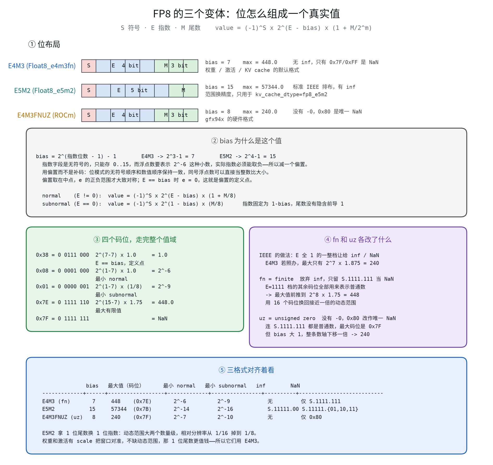

名字就是位分配：**E**xponent 几位、**M**antissa 几位，剩下 1 位符号。三种格式都和 fp32 同构，
解码规则完全一样，只有指数 bias 和「顶部码位留给谁」不同：

```text
      S EEEE MMM              (E4M3 / E4M3FNUZ)      S EEEEE MM   (E5M2)

E ≠ 0（normal）:     value = (-1)^S × 2^(E - bias) × (1 + M / 2^m)
E = 0（subnormal）:  value = (-1)^S × 2^(1 - bias) × (M / 2^m)        m = 尾数位数
```

**bias 取多少不是随意定的**：`bias = 2^(E-1) - 1`，E4M3 是 `2^3 - 1 = 7`，E5M2 是 `2^4 - 1 = 15`。
指数字段是无符号的，只能存 0…15，而浮点数要表示 2⁻⁶ 这种小数，实际指数必须能取负值。
用「减偏置」而不是补码，是为了让**位模式的无符号顺序和数值顺序保持一致**——同号浮点数可以直接
当整数比大小；偏置取在中点，e 的正负范围才大致对称（E4M3 是 −6…+8，负方向由 subnormal 再往下延伸）。
偏置的定义点是 `E == bias`，此时 `e = 0`：

```text
0x38 = 0 0111 000   →  2^(7-7) × (1 + 0/8) = 1 × 1.0 = 1.0
```

再验证两个码位（E4M3，bias = 7），它们在第五节的实例里还会出现：

```text
0x60 = 0 1100 000   →  2^(12-7) × (1 + 0/8) = 32 × 1.0     = 32.0
0x1E = 0 0011 110   →  2^(3-7)  × (1 + 6/8) = 0.0625 × 1.75 = 0.109375
```

---

### 二、FP8 的三个变体

FP8 有两种基本排布——8 个 bit 在指数和尾数之间怎么分——再加上 ROCm 的一个变体，一共三个。
下面这张是它们的完整参数，后文所有数字都出自这里：

| 格式 | 位分配 | bias | 最大值（码位） | 最小 subnormal | inf | NaN |
| --- | --- | :---: | --- | --- | :---: | --- |
| E4M3 (`Float8_e4m3fn`) | 1+4+3 | 7 | 448 (`0x7E`) | 2⁻⁹ ≈ 0.00195 | 无 | 仅 `S.1111.111` |
| E5M2 (`Float8_e5m2`) | 1+5+2 | 15 | 57344 (`0x7B`) | 2⁻¹⁶ | `S.11111.00` | `S.11111.{01,10,11}` |
| E4M3FNUZ (`Float8_e4m3fnuz`) | 1+4+3 | 8 | 240 (`0x7F`) | 2⁻¹⁰ | 无 | 仅 `0x80`（原 -0 的码位） |

E4M3 只有 3 位尾数，一个数只有 4 个有效二进制位，所以**它自己撑不起任何动态范围**——
必须配一个 fp32 的 scale。scale 这条线从第四节开始展开。

#### 三个最大值是怎么来的

表里只有「最大值」这一列不能直接从位分配算出来，它取决于每个格式把顶部的码位让给了谁。

**E4M3 = 448**。按 IEEE 的标准做法（fp32/fp16 都是这样），指数全 1 的那一整档
（E4M3 里就是 `E=1111` 的 16 个码位）要整体让给 inf 和 NaN，那样最大值只能到
`2^(14-7) × (1+7/8) = 240`。E4M3 的后缀 **fn（finite）** 表示它放弃了 inf，
只保留 `S.1111.111` 这一对码位当 NaN，`E=1111` 档的其余码位全部用来表示普通数——
于是最大值前推到 `S.1111.110`：

```text
0x7E = 0 1111 110   →  2^(15-7) × (1 + 6/8) = 256 × 1.75 = 448.0
```

用 16 个码位换回接近一倍的动态范围，对一个总共只有 256 个码位的格式来说非常划算。
代价是溢出行为变了：cvt 指令会把超界的值转成 `0x7F`，得到 NaN 而不是 inf。
第四节的 clamp 就是为这件事准备的。

**E5M2 = 57344**。标准 IEEE 排布（可以理解成 fp16 砍掉 8 位尾数），`E=11111` 整档
照常让给 inf/NaN，所以最大 normal 只能取次高一档：

```text
0x7B = 0 11110 11   →  2^(30-15) × (1 + 3/4) = 32768 × 1.75 = 57344.0
```

**E4M3FNUZ = 240**。ROCm gfx94x 硬件用的变体，在 fn 之外再改两处：**uz（unsigned zero）**
表示没有 -0，`0x80` 这个码位改作全格式**唯一**的 NaN（连 `S.1111.111` 都是普通数）；
同时 bias 从 7 变成 8。所以它的最大值码位能一路用到 `0x7F`，但 bias 大 1 又把整个数轴
往下挪了一倍，最终比 E4M3 还小：

```text
0x7F = 0 1111 111   →  2^(15-8) × (1 + 7/8) = 128 × 1.875 = 240.0
```

#### E4M3 还是 E5M2

E5M2 拿 1 位尾数换 1 位指数：动态范围大两个数量级，但相对分辨率从 1/16 掉到 1/8。
所以它只配给动态范围大、对精度不敏感的 KV cache（`--kv-cache-dtype fp8_e5m2`）；
权重和激活有 scale 负责对准窗口，动态范围本来就不缺，E4M3 的那 1 位尾数更值钱——
这也是为什么 E4M3 是权重、激活、KV cache 的默认格式。

---

### 三、格式谱系：FP8 站在哪，旁边都有谁

上面三种 FP8 只是同一套 S/E/M 规则的不同切法。把常见格式排在一起看，FP8 的位置就清楚了。

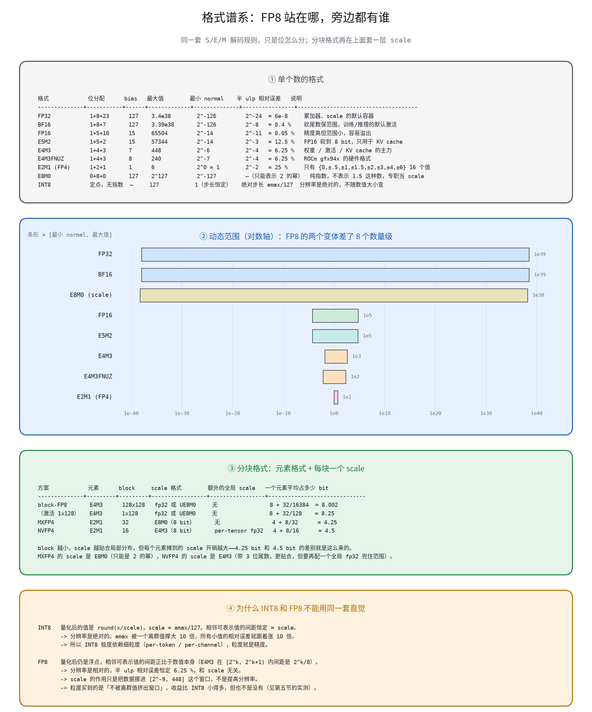

#### 单个数的格式

FP8 三行的完整参数（bias、inf/NaN 怎么划）在第二节，这里只并排列出可横向比较的几项：

| 格式 | 位分配 | 表示范围（最小 normal → 最大） | 半 ulp 相对误差 | 定位 |
| --- | --- | --- | --- | --- |
| FP32 | 1+8+23 | 2⁻¹²⁶ → 3.4e38 | ≈ 6e-8 | 累加器、scale 的默认容器 |
| BF16 | 1+8+7 | 2⁻¹²⁶ → 3.39e38 | ≈ 0.4 % | 砍尾数保范围，推理的默认激活类型 |
| FP16 | 1+5+10 | 2⁻¹⁴ → 65504 | ≈ 0.05 % | 精度高但范围小，容易溢出 |
| E5M2 | 1+5+2 | 2⁻¹⁴ → 57344 | 12.5 % | FP16 砍到 8 bit，只用于 KV cache |
| E4M3 | 1+4+3 | 2⁻⁶ → 448 | 6.25 % | 权重 / 激活 / KV cache 的主力 |
| E4M3FNUZ | 1+4+3 | 2⁻⁷ → 240 | 6.25 % | ROCm gfx94x 的硬件格式 |
| E2M1（FP4） | 1+2+1 | 1 → 6 | 25 % | 正负各 8 个值：`{0, ±0.5, ±1, ±1.5, ±2, ±3, ±4, ±6}` |
| E8M0 | 0+8+0 | 2⁻¹²⁷ → 2¹²⁷ | 只能表示 2 的幂 | 纯指数，没有符号也没有尾数，专职当 scale |
| INT8 | 定点，无指数 | −127 → 127，步长恒定 | 绝对步长 `amax/127` | 分辨率不随数值大小变 |

真正要盯住的是「半 ulp 相对误差」这一列：它**只由尾数位数决定**（等于 `2^-(m+1)`），
和表示范围无关，也和后面要引入的 scale 无关。E4M3 的 6.25 % 就是这么来的，
第五节会用具体数字验证它确实恒定。

两个容易被忽略的成员：

- **E8M0** 不是用来存数据的，它只用来存 scale。8 个 bit 全是指数（`bits=127` 表示 `2⁰=1`，
  `bits=255` 是 NaN），所以它只能表示 2 的整数次幂。这个限制反而是优点：
  用 2 的幂做 scale，`x / scale` 只改指数不动尾数，量化时不会引入额外的舍入。
- **INT8** 放在这里是为了对照。它和 FP8 的差别不是「8 bit 定点 vs 8 bit 浮点」这么轻描淡写，
  两者的误差行为完全不同，见本节最后。

#### 分块格式：元素格式 + 每块一个 scale

单个 8 bit（乃至 4 bit）的数撑不起动态范围，所以真正投入使用的都是
「元素格式 + 分块 scale」的组合：

| 方案 | 元素 | block | scale 格式 | 额外的全局 scale | 每元素平均 bit |
| --- | --- | --- | --- | --- | --- |
| block-FP8（权重） | E4M3 | 128×128 | fp32 或 UE8M0 | 无 | 8 + 32/16384 ≈ 8.002 |
| block-FP8（激活） | E4M3 | 1×128 | fp32 或 UE8M0 | 无 | 8 + 32/128 = 8.25 |
| MXFP4 | E2M1 | 32 | E8M0（8 bit） | 无 | 4 + 8/32 = 4.25 |
| NVFP4 | E2M1 | 16 | E4M3（8 bit） | per-tensor fp32 | 4 + 8/16 = 4.5 |

block 越小，scale 越贴合局部分布，但每个元素摊到的 scale 开销越大——4.25 bit 和 4.5 bit
的差别就是这么来的。两种 FP4 的取舍也不同：MXFP4 的 scale 是 E8M0（只能是 2 的幂，省事但粗），
NVFP4 的 scale 是 E4M3（带 3 位尾数，更贴合，但本身范围有限，得再配一个 per-tensor 的 fp32 兜住）。
FP4 的细节见 [DeepSeek-V4 MoE MXFP4](deepseek_v4_moe_mxfp4.md)。

#### 为什么 INT8 和 FP8 不能用同一套直觉

这一小段是后面粒度讨论（第六节）和实测（第五节）共同的前提，只在这里讲一次。

**INT8**：量化后的值是 `round(x/scale)`，`scale = amax/127`。相邻可表示值的间距恒定，就等于 `scale`。
分辨率是**绝对的**——`amax` 被一个离群值撑大 10 倍，所有小值的相对误差就跟着涨 10 倍。
所以 INT8 极度依赖细粒度，粒度基本等同于精度。

**FP8**：量化后仍然是浮点，相邻可表示值的间距正比于数值本身（E4M3 在 `[2^k, 2^(k+1))`
区间内间距是 `2^k/8`）。分辨率是**相对的**，半个 ulp 的相对误差恒定在 6.25 %，和 scale 无关。
scale 的作用只是把数据挪进 `[2⁻⁹, 448]` 这个窗口——所以细粒度买到的是
「离群值不会把小值挤出窗口」，收益比 INT8 小得多，但也不是没有（第五节有实测）。

---

### 四、量化的数学

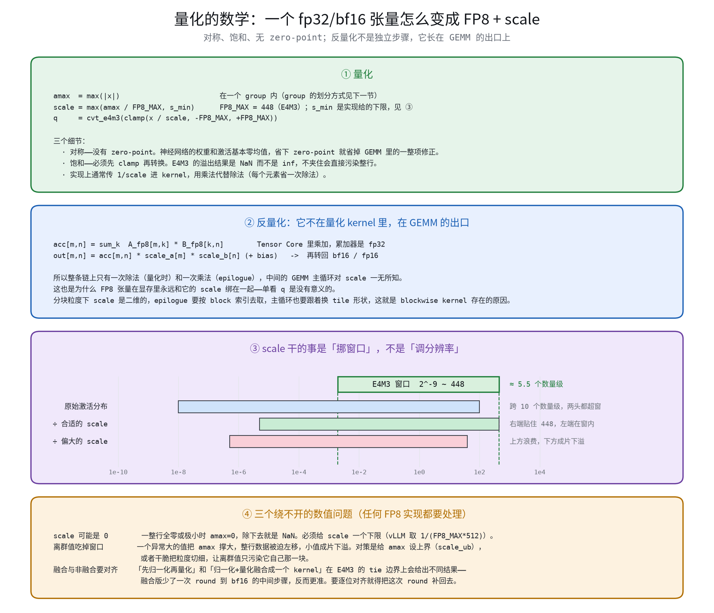

#### 量化

FP8 量化是**对称、饱和、无 zero-point**的：

```text
amax  = max(|x|)                       在一个 group 内（group 怎么划分见第六节）
scale = max(amax / FP8_MAX, s_min)     FP8_MAX = 448（E4M3）
q     = cvt_e4m3(clamp(x / scale, -FP8_MAX, +FP8_MAX))
```

三个细节值得单独说：

- **对称**——没有 zero-point。神经网络的权重和激活基本零均值，省掉 zero-point
  就省掉了 GEMM 里的一整项修正（INT8 带 zero-point 时要额外算 `azp * sum(B)`）。
- **饱和**——必须先 `clamp` 再转换。E4M3 的溢出结果是 NaN 而不是 inf，不夹住会直接污染整行。
- 实现上通常把 `1/scale` 传进 kernel，用乘法代替除法，每个元素省一次除法。

#### 反量化：它不在量化 kernel 里，在 GEMM 的出口

```text
acc[m,n] = sum_k  A_fp8[m,k] * B_fp8[k,n]              Tensor Core 里乘加，累加器是 fp32
out[m,n] = acc[m,n] * scale_a[m] * scale_b[n] (+ bias) -> 再转回 bf16 / fp16
```

整条链上只有一次除法（量化时）和一次乘法（epilogue），中间的 GEMM 主循环对 scale 一无所知。
这也是为什么 FP8 张量在显存里永远和它的 scale 绑在一起——单看 `q` 是没有意义的。

分块粒度是个例外：scale 是二维的，epilogue 要按 block 索引去取，主循环也要跟着按 K 分段缩放。
这就是 blockwise GEMM 需要单独一套 kernel 的原因。

#### 三个绕不开的数值问题

任何 FP8 实现都要处理这三件事，具体到 vLLM 的做法见第九节。

- **scale 可能是 0**。一整行全零或极小时 `amax = 0`，除下去就是 NaN。必须给 scale 一个下限。
- **离群值吃掉窗口**。一个异常大的值把 `amax` 撑大，整行数据被迫左移，小值成片下溢。
  对策有两个：给 `amax` 设上界（截断离群值），或者把粒度切细，让离群值只污染它自己那一块。
- **融合与非融合要对齐**。「先归一化再量化」和「归一化+量化融合成一个 kernel」在 E4M3 的
  tie 边界上会给出不同结果——融合版少了一次 round 回 bf16 的中间步骤，**反而更准**。
  想让两条路径逐位一致，就得在融合 kernel 里把这次 round 补回去。

---

### 五、走一遍具体的数字

光看公式不容易有感觉，下面用 6 个真实的值走一遍。取一个 token 的 6 个激活
（数字都是用 `torch.float8_e4m3fn` 实算的，不是手推）：

```text
x = [512.0, 37.0, -2.5, 0.125, 0.0195, -0.0007]
```

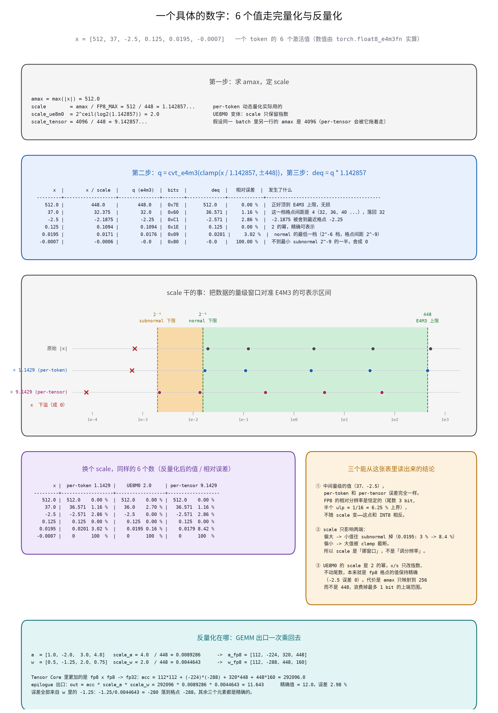

**第一步，定 scale**：`amax = 512.0`，`scale = 512 / 448 = 1.142857...`

**第二、三步，量化与反量化**（`q = cvt_e4m3(clamp(x / scale, ±448))`，`deq = q * scale`）：

| x | x / scale | q (E4M3) | 位模式 | deq | 相对误差 | 发生了什么 |
| ---: | ---: | ---: | :---: | ---: | ---: | --- |
| 512.0 | 448.0 | 448.0 | `0x7E` | 512.0 | 0.00 % | 正好顶到 E4M3 上限，无损 |
| 37.0 | 32.375 | 32.0 | `0x60` | 36.571 | 1.16 % | 这一档格点间距是 4（32, 36, 40…），落回 32 |
| -2.5 | -2.1875 | -2.25 | `0xC1` | -2.571 | 2.86 % | 舍到最近格点 -2.25 |
| 0.125 | 0.109375 | 0.109375 | `0x1E` | 0.125 | 0.00 % | 2 的幂，精确可表示 |
| 0.0195 | 0.017063 | 0.017578 | `0x09` | 0.020089 | 3.02 % | 落在 normal 的最低一档（2⁻⁶ 档，格点间距 2⁻⁹） |
| -0.0007 | -0.000613 | -0.0 | `0x80` | -0.0 | 100.00 % | 不到最小 subnormal 2⁻⁹ 的一半，舍成 0 |

**换个 scale，同样这 6 个数**（`scale_ue8m0 = 2^ceil(log2 1.142857) = 2.0`；
`scale_tensor = 9.142857` 假设同 batch 另一行的 amax 是 4096）：

| x | deq (per-token 1.1429) | 误差 | deq (UE8M0 2.0) | 误差 | deq (per-tensor 9.1429) | 误差 |
| ---: | ---: | ---: | ---: | ---: | ---: | ---: |
| 512.0 | 512.0 | 0.00 % | 512.0 | 0.00 % | 512.0 | 0.00 % |
| 37.0 | 36.571 | 1.16 % | 36.0 | 2.70 % | 36.571 | 1.16 % |
| -2.5 | -2.571 | 2.86 % | **-2.5** | **0.00 %** | -2.571 | 2.86 % |
| 0.125 | 0.125 | 0.00 % | 0.125 | 0.00 % | 0.125 | 0.00 % |
| 0.0195 | 0.0201 | 3.02 % | **0.0195** | **0.16 %** | **0.0179** | **8.42 %** |
| -0.0007 | 0 | 100 % | 0 | 100 % | 0 | 100 % |

这两张表是第三节那几条断言的实测证据，一条一条对：

1. **相对分辨率确实恒定**。中间量级的值换了 scale 误差纹丝不动——37 都是 1.16 %，
   -2.5 都是 2.86 %，per-token 和 per-tensor 给出完全相同的结果。这就是「半 ulp 相对误差
   只由尾数位数决定」的直接体现。同样一组数用 INT8 走一遍，小值会被 512 这个离群值成片压扁。
2. **scale 只影响两端**。偏大时小值往 subnormal 掉（0.0195 的误差从 3.02 % 涨到 8.42 %，
   因为它从 normal 的最低一档掉成了最小 subnormal 2⁻⁹）；偏小时大值被 `clamp` 截断；
   中间的值毫发无损。图里那三条数轴画的就是这件事：per-tensor 的除数偏大，整行数据整体左移，
   两个小值掉进了橙色的 subnormal 区。
3. **UE8M0 的误差反而更小**。2 的幂 scale 不动尾数，本来就落在格点上的值保持精确
   （-2.5 误差为 0，0.0195 误差 0.16 %）；而 1.142857 这种非 2 的幂会先做一次实数除法，
   把原本精确的值挪到两个格点中间。代价是 amax 只映射到 256 而不是 448，
   浪费掉最多 1 bit 的上端范围。

**第四节那个 epilogue 公式，用数字走一遍**：一个 4 元素点积

```text
a = [1.0, -2.0, 3.0, 4.0]     scale_a = 4.0 / 448 = 0.0089286   ->  a_fp8 = [112, -224, 320, 448]
w = [0.5, -1.25, 2.0, 0.75]   scale_w = 2.0 / 448 = 0.0044643   ->  w_fp8 = [112, -288, 448, 160]

acc = 112*112 + (-224)*(-288) + 320*448 + 448*160 = 292096.0      Tensor Core 用 fp32 累加
out = acc * scale_a * scale_w = 292096 * 0.0089286 * 0.0044643 = 11.643     精确值 12.0，误差 2.98 %
```

误差全部来自 `w` 里的 `-1.25`：`-1.25 / 0.0044643 = -280`，而 280 不是 E4M3 的格点，落到了 -288。
其余三个元素在这个 scale 下都是精确的。注意 `acc` 是一个干净的整数——
FP8 乘积在这个例子里恰好都落在整数上，整条链上唯一的除法在量化那一步，
出口那一次 `* scale_a * scale_w` 就是全部的反量化。

---

### 六、缩放粒度

粒度就是「一个 scale 管多少个元素」。它决定 scale 张量的形状，而 scale 的形状反过来
决定 GEMM 里怎么取它——这条因果链是后面所有 kernel 选择的根源。

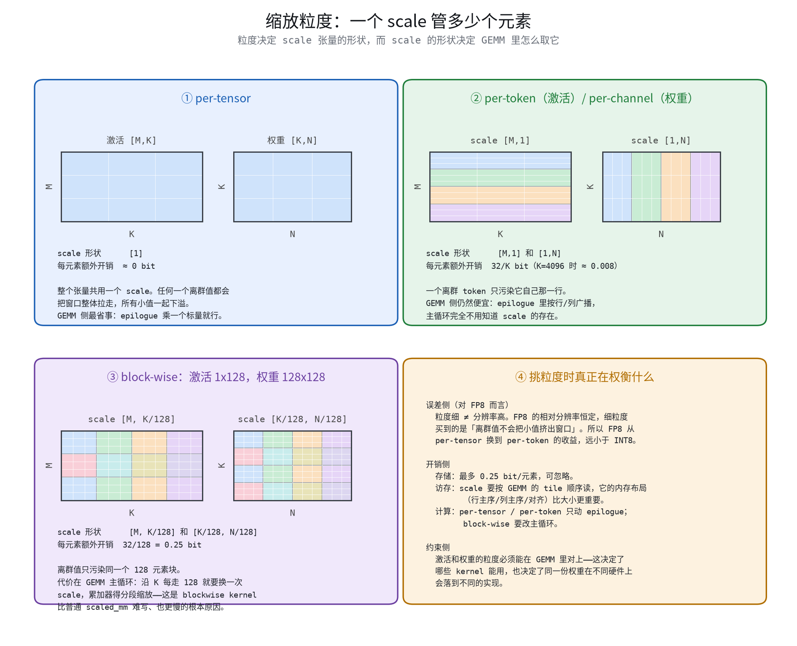

| 粒度 | 激活 scale | 权重 scale | 每元素额外开销 | 谁受离群值影响 |
| --- | --- | --- | --- | --- |
| per-tensor | `[1]` | `[1]` | ≈ 0 bit | 整个张量 |
| per-token（激活）/ per-channel（权重） | `[M,1]` | `[1,N]` | 32/K bit | 一行 / 一列 |
| block-wise | `[M, K/128]` | `[K/128, N/128]` | 32/128 = 0.25 bit | 一个 128 元素块 |

挑粒度时真正在权衡三件事：

**误差**。第三节那条「FP8 相对分辨率恒定」在这里直接兑现：粒度细 ≠ 分辨率高，
细粒度买到的只是「离群值不会把小值挤出窗口」。所以 FP8 从 per-tensor 换到 per-token 的收益，
远小于 INT8 做同样切换的收益——按 INT8 的直觉判断，会高估细粒度对 FP8 的价值。

**开销**。存储开销最多 0.25 bit/元素，可以忽略。真正的代价在访存和计算：
scale 要按 GEMM 的 tile 顺序读，所以它的**内存布局**（行主序还是列主序、是否按对齐要求 pad）
比它本身的大小重要得多；计算上，per-tensor / per-token 只动 epilogue，block-wise 要改主循环。

**约束**。激活和权重的粒度必须能在 GEMM 里对上。这决定了哪些 kernel 能用，
也决定了同一份权重在不同硬件上会落到不同的实现——第二部分基本上都在展开这一句。

---

## 第二部分　vLLM 里的实现

这一部分先按「零件」拆开讲——算子在哪（八）、量化怎么实现（九）、GEMM 后端怎么选（十）、
融合（十一）、KV cache（十二）、MoE（十三）——再用两章把零件装回去：
**第十四节把这些零件在 Blackwell（SM100/SM120）上串成一条完整链路**，
第十六节落到一份真实 checkpoint 上验证。

之所以单独给 Blackwell 一章，是因为它和 Hopper 的差异不是「换个 kernel」那么简单，
而是散落在五六个文件里的四处改动，单看任何一处都拼不出全貌——具体是哪四处，
第十四节开头会给出。

### 七、从 checkpoint 到 kernel

第一部分的每个概念，在 vLLM 里都有一个对应物：

| 第一部分的概念 | vLLM 里的落点 |
| --- | --- |
| E4M3 / E5M2 | `torch.float8_e4m3fn` / `torch.float8_e5m2`，加上 `csrc/quantization/utils.cuh` 里的上限特化 |
| scale 的粒度 | `GroupShape(row, col)`，以及由它生成的 `QuantKey` |
| 量化这一步 | `csrc/` 下的几个量化算子（第八、九节） |
| 反量化 | GEMM kernel 的 epilogue（第十节） |
| 粒度和 GEMM 必须配对 | kernel 选择表 + 每个 kernel 的 `can_implement`（第十节） |

链路的起点是 checkpoint 里的 `quantization_config`。识别这一段（怎么从 config 判定该用
FP8、以及各层怎么拿到对应的 `QuantizeMethod`）在
[量化识别与分发](quantization_dispatch.md) 里讲过，这里只接它的下半段：
`Fp8Config` 已经建好，接下来粒度怎么定。

粒度由谁决定？由 `Fp8LinearMethod.__init__`（`vllm/model_executor/layers/quantization/fp8.py:301`）：

```python
if self.block_quant:                     # checkpoint 里有 weight_block_size
    activation_quant_key = ... GroupShape(1, block[0])      # 激活 1x128
    weight_quant_key     = ... GroupShape(*block)           # 权重 128x128
else:
    weight_quant_key = kFp8StaticTensorSym                  # 权重 per-tensor
    if self.act_q_static:      activation_quant_key = kFp8StaticTensorSym
    elif cutlass_fp8_supported(): activation_quant_key = kFp8DynamicTokenSym  # per-token
    else:                      activation_quant_key = kFp8DynamicTensorSym
```

注意最后那个分支：**没有 CUTLASS 的设备上，动态量化会退回 per-tensor**，因为不带 CUTLASS 的 GEMM 后端
消费不了 per-token 的 scale 向量。量化粒度和 GEMM 后端必须成对选择，这是这套设计里最容易踩的耦合。

---

### 八、csrc 下的 FP8 算子地图

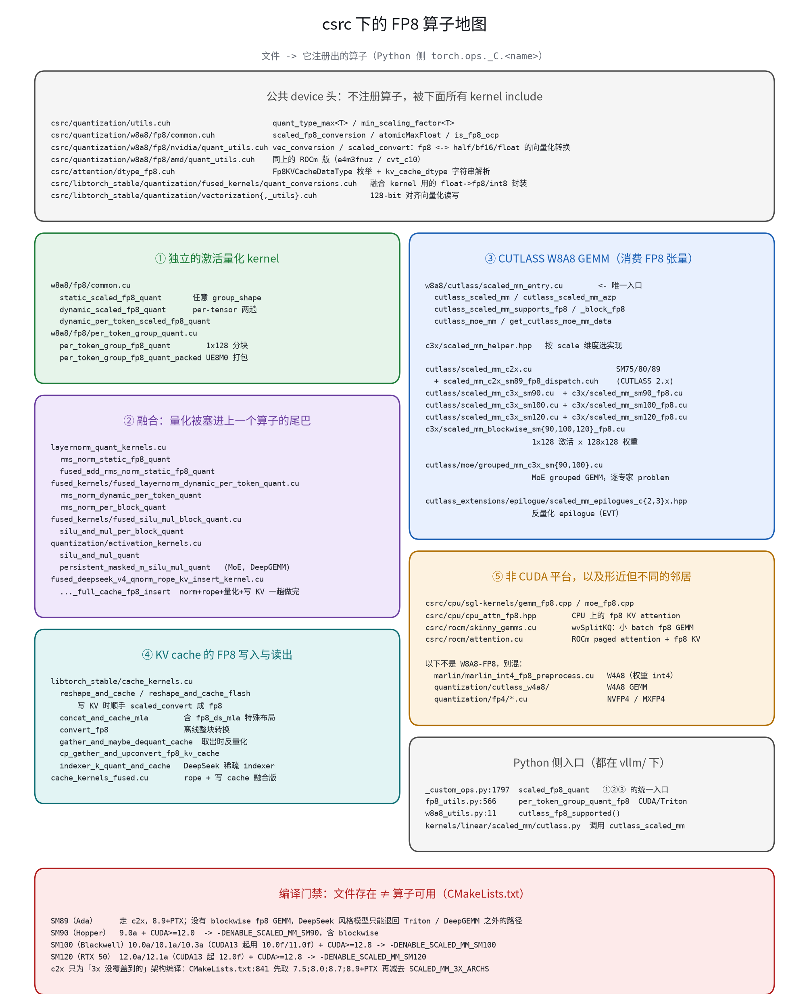

#### 8.1 公共 device 头（不注册算子）

| 文件 | 作用 |
| --- | --- |
| `csrc/quantization/utils.cuh` | `quant_type_max<T>`、`min_scaling_factor<T>`；e4m3fnuz 的 224 特化 |
| `csrc/quantization/w8a8/fp8/common.cuh` | `scaled_fp8_conversion`、`atomicMaxFloat`、`is_fp8_ocp`（ROCm 上判断是 OCP 还是 fnuz） |
| `csrc/quantization/w8a8/fp8/nvidia/quant_utils.cuh` | `vec_conversion` / `scaled_convert`：fp8 ↔ half / bf16 / float 的 1/2/4/8 元素向量化转换 |
| `csrc/quantization/w8a8/fp8/amd/quant_utils.cuh` | 同上的 ROCm 版本（`cvt_c10`、e4m3fnuz） |
| `csrc/attention/dtype_fp8.cuh` | `Fp8KVCacheDataType` 枚举 + `--kv-cache-dtype` 字符串解析 |
| `csrc/libtorch_stable/quantization/fused_kernels/quant_conversions.cuh` | 融合 kernel 用的 `float -> fp8/int8` 封装 |
| `csrc/libtorch_stable/quantization/vectorization{,_utils}.cuh` | 128 bit 对齐的向量化读写（`vectorize_with_alignment`） |

#### 8.2 独立的激活量化 kernel

这五个算子是整套 FP8 的入口，每个的内部结构见第九节。

| 文件 | 注册的算子 |
| --- | --- |
| `.../w8a8/fp8/common.cu` | `static_scaled_fp8_quant`、`dynamic_scaled_fp8_quant`、`dynamic_per_token_scaled_fp8_quant` |
| `.../w8a8/fp8/per_token_group_quant.cu` | `per_token_group_fp8_quant`、`per_token_group_fp8_quant_packed` |
| `.../w8a8/per_token_group_quant_8bit.h` | —（int8 / fp8 两个 `.cu` 共用的 host 声明） |

#### 8.3 融合算子

量化的上游是归一化或激活函数时，vLLM 提供融合版本，把量化塞进上一个 kernel 的尾巴。
这里只列文件归属，融合前后的对应关系、触发条件和数值代价见第十一节。

| 文件 | 注册的算子 |
| --- | --- |
| `csrc/libtorch_stable/layernorm_quant_kernels.cu` | `rms_norm_static_fp8_quant`、`fused_add_rms_norm_static_fp8_quant` |
| `.../fused_kernels/fused_layernorm_dynamic_per_token_quant.cu` | `rms_norm_dynamic_per_token_quant`、`rms_norm_per_block_quant` |
| `.../fused_kernels/fused_silu_mul_block_quant.cu` | `silu_and_mul_per_block_quant` |
| `csrc/libtorch_stable/quantization/activation_kernels.cu` | `silu_and_mul_quant`、`persistent_masked_m_silu_mul_quant` |
| `csrc/libtorch_stable/fused_deepseek_v4_qnorm_rope_kv_insert_kernel.cu` | `fused_deepseek_v4_qnorm_rope_kv_rope_full_cache_fp8_insert` |

#### 8.4 消费 FP8 的 GEMM（CUTLASS W8A8）

| 文件 | 注册的算子 / 作用 |
| --- | --- |
| `.../w8a8/cutlass/scaled_mm_entry.cu` | 唯一入口：`cutlass_scaled_mm`、`cutlass_scaled_mm_azp`、`cutlass_scaled_mm_supports_fp8`、`cutlass_scaled_mm_supports_block_fp8`、`cutlass_moe_mm`、`get_cutlass_moe_mm_data` |
| `.../cutlass/c3x/scaled_mm_helper.hpp` | `dispatch_scaled_mm`：按 scale 的维度决定走普通 fp8 kernel 还是 blockwise kernel |
| `.../cutlass/scaled_mm_c2x.cu` + `scaled_mm_c2x_sm89_fp8_dispatch.cuh` | CUTLASS 2.x 实现，覆盖 SM75 / SM80 / SM89（Ada 的 FP8 走这条） |
| `.../cutlass/scaled_mm_c3x_sm90.cu` + `c3x/scaled_mm_sm90_fp8{,_dispatch}.cu[h]` | Hopper，CUTLASS 3.x + TMA warp-specialized |
| `.../cutlass/scaled_mm_c3x_sm100.cu` + `c3x/scaled_mm_sm100_fp8{,_dispatch}.cu[h]` | Blackwell SM100 |
| `.../cutlass/scaled_mm_c3x_sm120.cu` + `c3x/scaled_mm_sm120_fp8{,_dispatch}.cu[h]` | SM120（RTX 50 系） |
| `.../cutlass/c3x/scaled_mm_blockwise_sm{90,100,120}_fp8.cu` | 1×128 激活 × 128×128 权重的 blockwise GEMM（DeepSeek 路径） |
| `.../cutlass/moe/grouped_mm_c3x_sm{90,100}.cu` | MoE 的 grouped GEMM，逐专家一个 problem size，`ScaledEpilogueArray` 做逐组反量化 |
| `csrc/libtorch_stable/cutlass_extensions/epilogue/scaled_mm_epilogues_c{2,3}x.hpp` | 反量化 epilogue（EVT）：`ScaledEpilogue`、`ScaledEpilogueBias`、`ScaledEpilogueColumnBias`、`ScaledEpilogueArray` |

#### 8.5 KV cache

| 文件 | 注册的算子 | 作用 |
| --- | --- | --- |
| `csrc/libtorch_stable/cache_kernels.cu` | `reshape_and_cache` / `reshape_and_cache_flash` | 写 KV 时顺手量化成 fp8 |
| | `concat_and_cache_mla` | MLA 的 NoPE + RoPE 拼接写入，含 `fp8_ds_mla` 特殊布局 |
| | `convert_fp8` | 整块 cache 的离线转换 |
| | `gather_and_maybe_dequant_cache`、`cp_gather_and_upconvert_fp8_kv_cache` | 取出时反量化回 bf16 |
| | `indexer_k_quant_and_cache`、`cp_gather_indexer_k_quant_cache` | DeepSeek 稀疏 indexer 的 K 量化与回读 |
| `csrc/libtorch_stable/cache_kernels_fused.cu` | `concat_and_cache_mla_rope_fused` | MLA 的 RoPE + 拼接写 cache 融合成一个 kernel |

#### 8.6 非 CUDA 平台，以及形近但不同的邻居

| 文件 | 说明 |
| --- | --- |
| `csrc/cpu/sgl-kernels/gemm_fp8.cpp`、`moe_fp8.cpp` | CPU 上的 fp8 GEMM / MoE（AMX、AVX512） |
| `csrc/cpu/cpu_attn_fp8.hpp` | CPU 的 fp8 KV attention |
| `csrc/rocm/skinny_gemms.cu` | `wvSplitKQ`：ROCm 上小 batch 的 fp8 GEMM |
| `csrc/rocm/attention.cu` | ROCm paged attention，直接吃 fp8 KV |
| `.../quantization/marlin/marlin_int4_fp8_preprocess.cu` | **W4A8**（权重 int4、激活 fp8）的权重预处理，不是 W8A8 |
| `.../quantization/cutlass_w4a8/` | W4A8 GEMM，同上 |
| `.../quantization/fp4/*.cu` | NVFP4 / MXFP4，是另一套格式，见 [DeepSeek-V4 MoE MXFP4](deepseek_v4_moe_mxfp4.md) |

---

### 九、激活量化 kernel 的实现

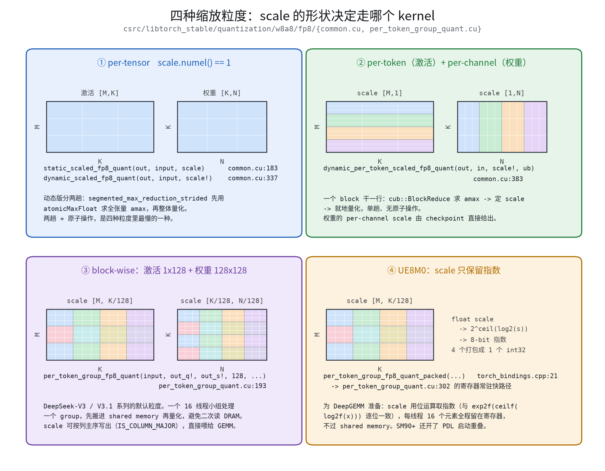

| 粒度 | 算子 | 典型模型 |
| --- | --- | --- |
| per-tensor | `static_scaled_fp8_quant` / `dynamic_scaled_fp8_quant` | 早期 FP8 checkpoint（`activation_scheme: static`） |
| per-token + per-channel | `dynamic_per_token_scaled_fp8_quant` | 大多数 `activation_scheme: dynamic` 的模型 |
| block-wise 1×128 | `per_token_group_fp8_quant` | DeepSeek-V3 系列（`weight_block_size: [128,128]`） |
| block-wise + UE8M0 | `per_token_group_fp8_quant_packed` | 喂给 DeepGEMM 的路径 |

#### 9.1 三种量化 kernel 的结构差异

`common.cu` 里三个 host 入口对应三种完全不同的 kernel 结构：

- **`static_scaled_fp8_quant`**（`common.cu:183`）——scale 已知，最通用。host 侧从 scale 张量的形状
  反推 `group_m / group_n / scale_stride_i / scale_stride_j`，再按 `STRIDE_I_ZERO / STRIDE_J_ZERO`
  两个 bool 模板参数实例化 kernel，让编译期把用不到的索引计算整条消掉。1D scale 必须显式给
  `group_shape` 来区分 per-channel 和 per-token（否则 `num_tokens == hidden_size` 时无法判定）。
- **`dynamic_scaled_fp8_quant`**（`common.cu:337`）——per-tensor 动态，**两趟**：
  先 `segmented_max_reduction_strided` 每个 block 归约一行、`atomicMaxFloat` 打到全局 scale，
  再整体量化。原子操作 + 两趟读，是四种粒度里最慢的。
- **`dynamic_per_token_scaled_fp8_quant`**（`common.cu:383`）——一个 block 干一行，
  `cub::BlockReduce` 求 amax、定 scale、就地量化，**单趟无原子**。这也是为什么有 CUTLASS 时
  vLLM 宁可用 per-token：既更准又更快。

`per_token_group_quant.cu` 里有两套实现：

- **通用版**（`:100`）：16 个线程一组处理一个 group，先把 group 搬进 shared memory，量化时从 shared 读，
  避免二次访问 DRAM；支持 scale 列主序输出（`IS_COLUMN_MAJOR`），直接满足 GEMM 对 scale 布局的要求。
- **寄存器快路径**（`:302`）：`group_size == 128` 专用（`static_assert` 写死），每组 8 个线程、
  每线程 16 个元素（两个相邻 `uint4`）全程留在寄存器，完全不碰 shared memory
  （`dynamicSmemBytes = 0`）；UE8M0 的指数用位运算取，与 `exp2f(ceilf(log2f(x)))` 逐位一致。

两者都在 SM90+ 上开了 PDL 启动重叠（`cudaGridDependencySynchronize` /
`cudaTriggerProgrammaticLaunchCompletion`，device 侧包在 `__CUDA_ARCH__ >= 900` 里，
host 侧用 `cudaLaunchKernelEx` + `ProgrammaticStreamSerialization`）——**PDL 不是快路径独有的**。
ROCm 上没有 PDL，走普通的 `<<<>>>` 启动。

---

#### 9.2 第四节那三个数值问题，在代码里长什么样

- **scale 下限**：`min_scaling_factor<T>::val() = 1/(FP8_MAX * 512)`（`utils.cuh:50`），
  在 `common.cu:165` 的 per-token kernel 里和算出来的 scale 取 max。
- **离群值上界**：`dynamic_per_token_scaled_fp8_quant` 的 `scale_ub` 参数（`common.cu:163`）。
- **融合对齐**：`layernorm_quant_kernels.cu:70` 特意把归一化的中间结果先 round 回 `scalar_t`
  再量化——不这么做，融合路径反而更准，于是在 E4M3 的 tie 边界上和非融合路径对不上，测试会挂。

量化本身那一行是 `scaled_fp8_conversion`（`csrc/quantization/w8a8/fp8/common.cuh:57`）：

```cpp
template <bool is_scale_inverted, typename fp8_type>
__device__ __forceinline__ fp8_type scaled_fp8_conversion(float const val,
                                                          float const scale) {
  float x = is_scale_inverted ? val * scale : val / scale;
  float r = fmaxf(-quant_type_max_v<fp8_type>, fminf(x, quant_type_max_v<fp8_type>));
  return fp8::vec_conversion<fp8_type, float>(r);   // 硬件 cvt 指令
}
```

`is_scale_inverted` 就是第四节说的「传 1/scale 用乘法代替除法」。注意两个入口的约定是相反的：
`static_scaled_fp8_quant` 传 `1/scale`，`dynamic_per_token` 传 `scale` 本身
（`common.cu:176` 的 `scaled_fp8_conversion<false>`），这是为了和 FBGemm 逐位对齐，改动时别顺手统一。

#### 9.3 一个 vLLM 特有的选择：ROCm 上用 224 而不是 240

一个仓库特有的细节：ROCm 的 `e4m3fnuz` 虽然能表示到 240（`0x7F`），但 vLLM 把上限降一档到 224（`0x7E`），
因为用 240 做动态量化时反量化误差过大：

```cpp
// csrc/quantization/utils.cuh:31
// Using the default max value from pytorch (240.0 0x7F) will cause accuracy
// issues when running dynamic quantization. Here use 224.0 0x7E for rocm.
template <>
struct quant_type_max<torch::headeronly::Float8_e4m3fnuz> { ... 0x7E ... };
```

#### 9.4 scale 的形状和布局是 Python 侧定的

两个后端的 `__init__` 里都构造一个 `QuantFP8`，区别只在构造参数：

| | CUTLASS blockwise (`cutlass.py:279`) | DeepGEMM (`deep_gemm.py:38`) |
| --- | --- | --- |
| `group_shape` | (1, 128) | (1, 128) |
| `use_ue8m0` | `False` | `is_deep_gemm_e8m0_used()` |
| `column_major_scales` | `True` | `True` |
| `tma_aligned_scales` | 默认 `False` | `VLLM_USE_DEEP_GEMM_TMA_ALIGNED_SCALES` |

`QuantFP8.forward_cuda`（`input_quant_fp8.py:84`）按这些参数选出口：

```python
if self.is_group_quant and self.use_ue8m0 and ... DeepGemmQuantScaleFMT.UE8M0:
    return per_token_group_quant_fp8_packed_for_deepgemm(...)   # torch.ops._C.per_token_group_fp8_quant_packed
if self.is_group_quant and not self.static:
    return per_token_group_quant_fp8(...)                       # torch.ops._C.per_token_group_fp8_quant
return ops.scaled_fp8_quant(...)                                # common.cu 的三个入口
```

也就是说，**DeepGEMM 路线的激活量化用的就是 8.2 里那两个 csrc 算子**，
一个都没多，只是调用参数不同。ROCm、非 contiguous 输入或 CUDA 不可用时才落到 Triton fallback。

还有一点值得单独说：**scale 张量的形状和 stride 是 Python 侧 `torch.empty_strided` 事先分配好的**
（`fp8_utils.py:613` 那段 TMA 对齐的 stride 计算），csrc kernel 只负责按给定 stride 往里填。
所以 DeepGEMM 那些排布要求——列主序、TMA 对齐、UE8M0 打包——落到 kernel 里
不过是 `IS_COLUMN_MAJOR` 模板参数加几个 stride 参数，并没有为它单写一个 kernel。
唯一为 DeepGEMM 专门写的是 `per_token_group_fp8_quant_packed` 那条寄存器常驻快路径
（`per_token_group_quant.cu:302`），因为 int32 打包的写出模式和普通版差别太大。

Python 侧的三个入口，调用哪个由粒度决定：

| 入口 | 位置 | 落到的算子 |
| --- | --- | --- |
| `ops.scaled_fp8_quant` | `vllm/_custom_ops.py:1797` | `static_` / `dynamic_` / `dynamic_per_token_scaled_fp8_quant` 三选一 |
| `per_token_group_quant_fp8` | `utils/fp8_utils.py:566` | `per_token_group_fp8_quant`，CUDA 不可用时退 Triton |
| `QuantFP8`（CustomOp） | `input_quant_fp8.py:84` | 上面两个的统一封装，被各 kernel 类持有 |

---

### 十、GEMM 后端全景

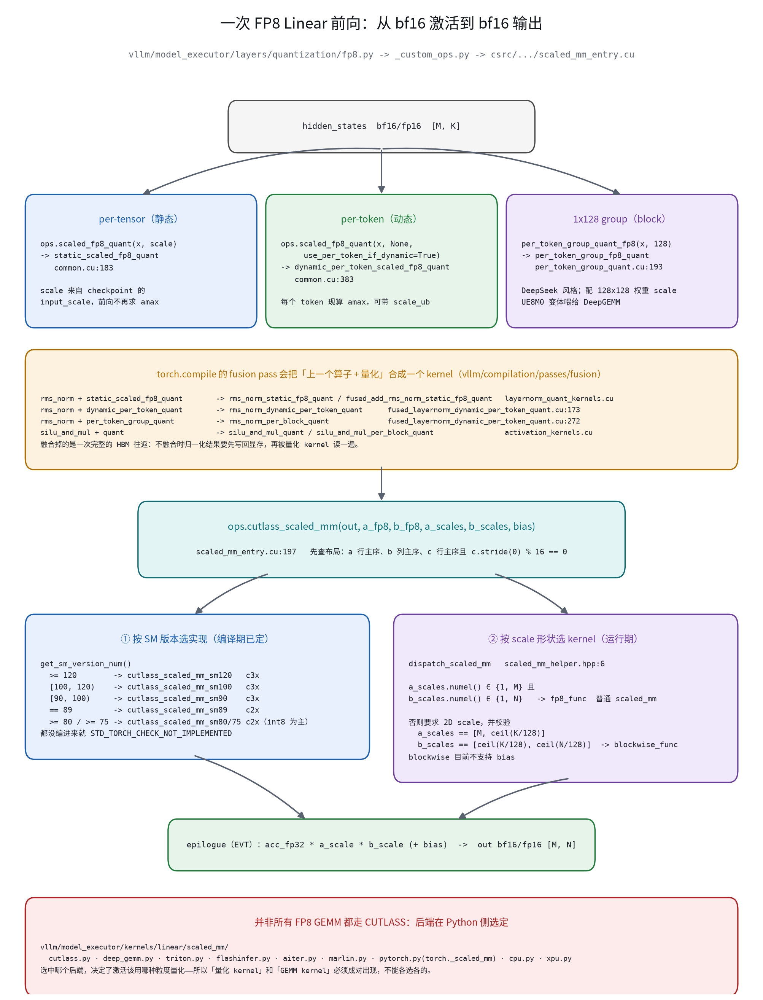

一次 `Fp8LinearMethod.apply` 分三步：量化激活（第九节）、GEMM、epilogue 反量化。
GEMM 这一步有多个后端，选谁由**粒度 + 硬件 + 编译产物**共同决定。

#### 10.1 CUTLASS：仓库自带的那条路

`ops.cutlass_scaled_mm` 进到 `scaled_mm_entry.cu:197`，先检查布局：
**a 行主序、b 列主序、c 行主序且 `c.stride(0) % 16 == 0`**（这是 CUTLASS 对齐要求，
不满足会直接 `STD_TORCH_CHECK` 失败）。然后是两层正交的分发：

**第一层，按 SM 版本**（编译期就已经决定哪些实现存在）：

```cpp
int32_t version_num = get_sm_version_num();
if (version_num >= 120)                      { cutlass_scaled_mm_sm120(...); return; }
if (version_num >= 100 && version_num < 120) { cutlass_scaled_mm_sm100(...); return; }
if (version_num >= 90  && version_num < 100) { cutlass_scaled_mm_sm90(...);  return; }
if (version_num == 89)                       { cutlass_scaled_mm_sm89(...);  return; }  // c2x
if (version_num >= 80)                       { cutlass_scaled_mm_sm80(...);  return; }
```

**第二层，按 scale 的形状**（`scaled_mm_helper.hpp:6`）：

```cpp
if ((a_scales.numel() == 1 || a_scales.numel() == a.size(0)) &&
    (b_scales.numel() == 1 || b_scales.numel() == b.size(1))) {
  fp8_func(...);            // per-tensor / per-token / per-channel
} else {
  // 必须是 2D，且严格等于 [M, ceil(K/128)] 和 [ceil(K/128), ceil(N/128)]
  blockwise_func(...);      // bias 暂不支持
}
```

也就是说：**同一个 `cutlass_scaled_mm` 调用，传进去的 scale 形状不同，落到的 kernel 完全不同。**
调用方不需要（也没法）显式指定，这既是便利也是坑——scale 形状算错时报的是 shape check 失败，
而不是「你选错了 kernel」。

GEMM 的累加器是 fp32，出口的 EVT 做 `acc * a_scale * b_scale (+ bias)` 并转回 bf16/fp16。
per-token 的 `a_scale` 是列向量、per-channel 的 `b_scale` 是行向量，broadcast 由 EVT 描述符完成，
不需要额外 kernel。

#### 10.2 DeepGEMM：外部库的那条路

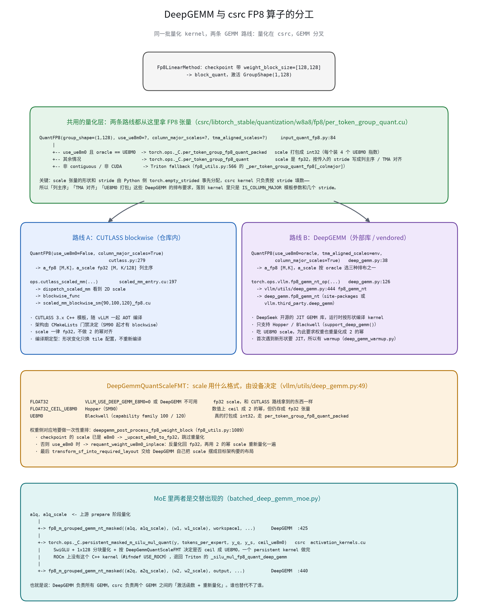

DeepGEMM 常被误解成「另一套 FP8 实现」，其实不是——**它根本不做量化**，
只吃第九节那两个 csrc 算子产出的张量，分叉点在 GEMM 而不在量化。

`DeepGemmQuantScaleFMT`（`vllm/utils/deep_gemm.py:49`）在启动时定一次：

| 取值 | 触发条件 | scale 的实际形态 |
| --- | --- | --- |
| `FLOAT32` | `VLLM_USE_DEEP_GEMM_E8M0=0`，或 DeepGEMM 不可用 | fp32，和 CUTLASS 路线拿到的完全一样 |
| `FLOAT32_CEIL_UE8M0` | Hopper（SM90） | 数值上 ceil 成 2 的幂，但仍存成 fp32 张量 |
| `UE8M0` | Blackwell（capability family 100 / 120） | 真的打包成 int32，每个装 4 个 8 bit 指数 |

权重侧要做对应的一次性处理，在 `process_weights_after_loading` 里完成
（`deepgemm_post_process_fp8_weight_block`，`fp8_utils.py:1089`）：`use_e8m0` 为真、
且 checkpoint 的 scale 还不是 E8M0 时，`requant_weight_ue8m0_inplace` 会**把权重反量化
回 fp32、再用 2 的幂 scale 重新量化一遍**。这是真正的重量化而不是格式转换，也正是切换
`VLLM_USE_DEEP_GEMM_E8M0` 会让同一份 checkpoint 数值结果变化的原因；完整的三条分支
以及它与架构的关系见 14.2。反过来说，**走 CUTLASS blockwise 时权重完全不会被重量化**
（那条路 `use_ue8m0` 恒为 `False`），`weight_scale` 原样保持 checkpoint 里的 fp32。

值得单独点出的是：**这次重量化并不落在 csrc 上，一个 CUDA 算子都没用到。**
`requant_weight_ue8m0_inplace`（`fp8_utils.py:989`）整个函数体是纯 PyTorch——
`torch.repeat_interleave` 把 block scale 展开成逐元素，乘回 fp32 完成反量化，
再交给 `per_block_cast_to_fp8`（`utils/deep_gemm.py:662`）重新量化；后者同样是纯 torch
（`_ceil_to_ue8m0` 就是 `torch.pow(2.0, torch.ceil(torch.log2(x.abs())))`），
只是挂了 `@torch.compile`，最终由 inductor 编成 Triton。它虽然放在 `utils/deep_gemm.py` 里，
却既不是 DeepGEMM 的 JIT kernel，也不是 CUTLASS 算子，只是从 DeepGEMM 仓库抄来的一段 Python。

于是同一套「求 amax → 定 scale → 转 fp8」的逻辑，在激活侧和权重侧有完全不同的实现：

| | 激活侧 | 权重侧 |
| --- | --- | --- |
| 入口 | `per_token_group_fp8_quant` | `requant_weight_ue8m0_inplace` |
| 实现 | csrc 手写 CUDA kernel（第九节） | 纯 torch + `@torch.compile` → Triton |
| 调用频率 | 每层每个 token，热路径 | 每个权重一次，加载期 |

分界线是**调用频率而不是逻辑复杂度**：加载期只跑一次的东西，写成 torch 循环就够用了
（函数里那个 `for idx in range(num_mats)` 是逐矩阵串行处理的），
只有热路径才值得为它写一个 CUDA kernel 并维护它的所有特化。

| | CUTLASS blockwise（csrc） | DeepGEMM |
| --- | --- | --- |
| 代码位置 | 仓库内 `csrc/`，随 wheel 编译 | 外部 pip 包，或 `vllm/third_party/deep_gemm` 里 vendored 一份 |
| 编译时机 | AOT，build 时按 `CUDA_ARCHS` 生成 | JIT，运行时按形状与 SM 数编译 |
| kernel 形态 | CUTLASS 3.x C++ 模板 + `CollectiveBuilder` | DeepSeek 手写的 warp-specialized + TMA 代码生成 |
| 架构覆盖 | SM89 起（blockwise 要 SM90+） | 只有 Hopper / Blackwell |
| scale 格式 | fp32 | fp32 / ceil-UE8M0 / packed-UE8M0，按设备切换 |
| 调优方式 | 编译期在若干 tile 配置里选 | 运行时按形状生成，SM 数可调（`set_num_sms`） |
| 谁做激活量化 | csrc 的 `per_token_group_fp8_quant` | 同一个 csrc 算子，参数不同 |
| 权重是否重量化 | 否，`weight_scale` 原样保留 fp32 | E8M0 开启时是（纯 torch，加载期跑一次） |
| 优先级 | `_POSSIBLE_FP8_BLOCK_KERNELS` 里排第 3 | 排第 2，仅次于 FlashInfer + DeepGEMM 组合 |

#### 10.3 后端全表

`vllm/model_executor/kernels/linear/scaled_mm/` 下并列着 `cutlass.py`、`deep_gemm.py`、`triton.py`、
`flashinfer.py`、`aiter.py`、`marlin.py`、`pytorch.py`（`torch._scaled_mm`）、`cpu.py`、`xpu.py`。
选中哪个后端反过来决定激活该用哪种粒度量化——所以看 FP8 性能问题时，
**要同时看量化 kernel 和 GEMM kernel 这一对**，单看一边得不出结论。

但**候选表有两张，先按量化粒度选表，再在表内按优先级选后端**
（`init_fp8_linear_kernel`，`kernels/linear/__init__.py:594`）：

```python
if activation_quant_key.scale.group_shape.is_per_group():   # 有 weight_block_size
    possible_kernels = _POSSIBLE_FP8_BLOCK_KERNELS           # DeepGEMM 和 CUTLASS blockwise 在这
else:                                                        # per-tensor / per-token
    possible_kernels = _POSSIBLE_FP8_KERNELS                 # DeepGEMM 根本不在这张表里
```

这一步分流很关键：**DeepGEMM 只做 block 量化**，per-tensor / per-token 的 FP8 checkpoint
（早期那一批 `activation_scheme: static` 的模型）压根轮不到它，CUTLASS 是唯一主力。
所以「用 CUTLASS 还是 DeepGEMM」这个问题只在 DeepSeek 风格的 block FP8 权重上才成立。

`_POSSIBLE_FP8_BLOCK_KERNELS[CUDA]`（`kernels/linear/__init__.py:355`）按优先级排列，
取第一个 `is_supported()` 且 `can_implement()` 为真的：

```text
FlashInfer+DeepGEMM  ->  DeepGemm  ->  Cutlass  ->  Marlin  ->  Triton  ->  Humming
```

DeepGemm 排在 Cutlass 前面，**CUTLASS blockwise 实际上是 DeepGEMM 的兜底**，不是并列选项。
两者在同一层能被对调，是因为它们的输入输出约定完全一致：都吃 `per_token_group_fp8_quant`
产出的 `(fp8, scale)`，都在 epilogue 里反量化成 bf16。差别在三处——DeepGEMM 只收 bf16 输出、
额外要求 `N%64==0 且 K%128==0`、`use_ue8m0` 跟随设备；CUTLASS blockwise 没有前两条限制，
`use_ue8m0` 恒为 `False`（`scaled_mm/cutlass.py:283`，后果见 10.2）。
第十六节有一个 Blackwell 上被迫回落到 CUTLASS 的真实例子。

这张表落到实践上有三个含义：

1. **量化 kernel 的性能问题两条路线共担**。`per_token_group_fp8_quant` 慢，
   换成 DeepGEMM 也不会变快——要看的是 `per_token_group_quant.cu` 那两个实现哪个被选中。
2. **切后端会改变数值**（机制见 10.2），做精度对比时必须把后端固定住，否则测的是两件事。
3. **JIT 的开销出现在首次遇到新形状时**，所以有 `vllm/model_executor/warmup/deep_gemm_warmup.py`；
   CUTLASS 路线没有这个问题，但它的架构覆盖由编译期的 `CMakeLists.txt` 决定，缺了就是缺了。

---

### 十一、融合 kernel：量化被塞进上一个算子的尾巴

FP8 量化本身是纯带宽操作——读一遍 bf16、写一遍 fp8，没有任何计算密度。
单独一个 kernel 就是一次完整的 HBM 往返。所以只要量化的上游是归一化或激活函数，
vLLM 都提供了融合版本，由 `torch.compile` 的 fusion pass（`vllm/compilation/passes/fusion/`）
自动替换：

| 融合前 | 融合后的算子 | 文件（8.3 有完整文件清单） |
| --- | --- | --- |
| `rms_norm` + `static_scaled_fp8_quant` | `rms_norm_static_fp8_quant` | `layernorm_quant_kernels.cu` |
| `fused_add_rms_norm`（带 residual）+ 静态量化 | `fused_add_rms_norm_static_fp8_quant` | 同上 |
| `rms_norm` + per-token 动态量化 | `rms_norm_dynamic_per_token_quant`（fp8 与 int8 共用模板） | `fused_layernorm_dynamic_per_token_quant.cu:173` |
| `rms_norm` + 1×group 分块量化 | `rms_norm_per_block_quant`（scale 可转置输出） | 同上 `:272` |
| `silu_and_mul` + 静态量化 | `silu_and_mul_quant` | `activation_kernels.cu` |
| `silu_and_mul` + 分块量化 | `silu_and_mul_per_block_quant`（一个 block 负责一个 (token, group)） | `fused_silu_mul_block_quant.cu` |

替换规则注册在 `rms_quant_fusion.py:121` 和 `act_quant_fusion.py:34` 的 `FUSED_OPS` 字典里，
**key 是 `QuantKey`**——也就是说融合版本存不存在取决于第六节那个粒度：
per-tensor、per-token、1×128 各有各的融合 kernel，粒度对不上就老实退回两个 kernel。

省下来的是一次完整的 HBM 往返：不融合时归一化结果要先写回显存，再被量化 kernel 读一遍。
代价是第四节提到的那个数值陷阱：融合版少了一次 round 回 bf16 的中间步骤，
需要在 kernel 里手工补回去才能和非融合路径逐位一致（`layernorm_quant_kernels.cu:70`）。

#### 不经过 fusion pass 的两个

还有两个融合 kernel 是**调用方直接写死的**，图里根本没有「融合前」的形态：

| 算子 | 谁调用 | 做什么 |
| --- | --- | --- |
| `persistent_masked_m_silu_mul_quant` | `batched_deep_gemm_moe.py:218`、`:434` | MoE masked 布局的 SwiGLU + 1×128 量化，persistent kernel，直接产出 DeepGEMM 要的形态 |
| `fused_deepseek_v4_qnorm_rope_kv_rope_full_cache_fp8_insert` | `deepseek_v4/attention.py:587`、`nvidia/dspark.py:252` | qnorm + RoPE + FP8 量化 + 写 KV cache 一趟做完 |

原因是 fusion pass 只能替换它在 FX 图里认得出的标准算子序列，而 MoE 的 masked 布局
和 DeepSeek-V4 的 attention 前处理都不是——只能在 Python 侧显式调。

---

### 十二、KV cache 的 FP8 通路

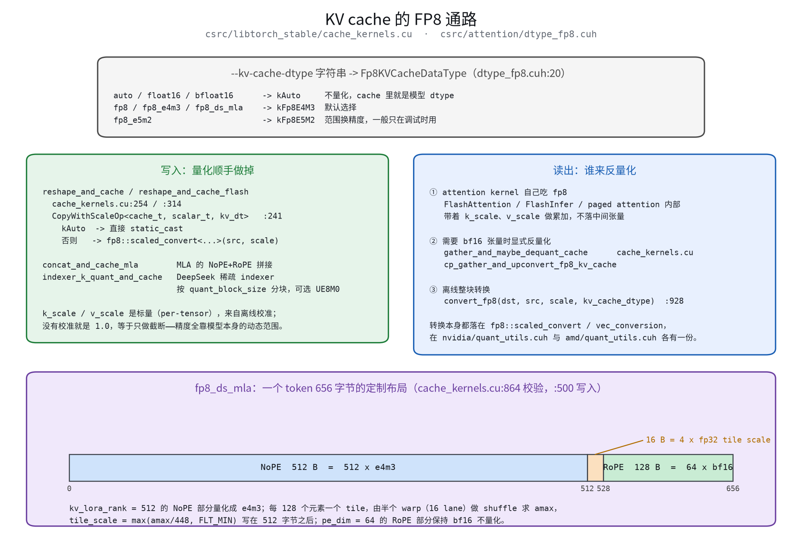

KV cache 的 FP8 和 Linear 的 FP8 是两套独立机制：它不做 GEMM，只是把 KV 存成一半大小。

```cpp
// csrc/attention/dtype_fp8.cuh:20
"auto" / "float16" / "bfloat16"          -> kAuto      // 不量化
"fp8" / "fp8_ds_mla" / "fp8_e4m3"        -> kFp8E4M3
"fp8_e5m2"                               -> kFp8E5M2
```

写入时量化是顺手做的，`CopyWithScaleOp`（`cache_kernels.cu:241`）在拷贝的同一个 kernel 里
调 `fp8::scaled_convert`；`k_scale` / `v_scale` 是**标量**（per-tensor），来自离线校准，
没校准就是 1.0——那种情况下 FP8 KV 等于只做截断，精度完全依赖模型本身的动态范围。

读出侧有三条路：attention kernel 自己吃 fp8（FlashAttention / FlashInfer / paged attention 内部
带着 scale 累加）、需要 bf16 张量时用 `gather_and_maybe_dequant_cache`、
或者用 `convert_fp8` 做整块离线转换。

#### `fp8_ds_mla`：一个 token 656 字节

DeepSeek MLA 的 KV cache 有专门的紧凑布局（`cache_kernels.cu:864` 校验，`:500` 写入），
一个 token 共 656 字节：

| 字节区间 | 长度 | 内容 |
| --- | --- | --- |
| `[0, 512)` | 512 | NoPE，512 个 e4m3（`kv_lora_rank = 512`） |
| `[512, 528)` | 16 | 4 个 fp32 的 tile scale（每 128 个元素一个 tile） |
| `[528, 656)` | 128 | RoPE，64 个 bf16，**不量化**（`pe_dim = 64`） |

每 128 个元素由**半个 warp（16 lane）**用 shuffle 归约求 amax，
`tile_scale = max(amax / 448, FLT_MIN)`，写在 512 字节之后。RoPE 部分保持 bf16 是刻意的：
位置编码对量化误差敏感，且它只占 64 维，省下来的显存不值得。

---

### 十三、MoE 的 FP8 路径

MoE 走的是另一套代码（`FusedMoE` + modular kernel），和普通 Linear 几乎没有共享。
它有自己的后端选择、自己的布局、自己的中间量化。

#### 13.1 后端由 oracle 选，不是按 Linear 那张表

`select_fp8_moe_backend`（`vllm/model_executor/layers/fused_moe/oracle/fp8.py:271`）
按这个顺序决定：

1. `--moe-backend` 显式指定 → 直接用；
2. 显式 `set` 了 `VLLM_USE_DEEP_GEMM` 或 `VLLM_MOE_USE_DEEP_GEMM` → 为真直接选 DEEPGEMM，
   为假则把它从候选里删掉；
3. `VLLM_TEST_FORCE_FP8_MARLIN` / AITER 的特判；
4. 都没有，才走 `_get_priority_backends` 的优先级列表——**而这个列表会被设备和并行方式改写**：

    - Hopper + block fp8 + `ep_size == 1`（纯 TP）→ TRITON 被提到最前；
    - Hopper + block fp8 + `ep_size > 1`（EP）→ FLASHINFER_CUTLASS 被提到最前；
    - Blackwell + DeepEP v2 + block fp8 → FLASHINFER_TRTLLM 被提到最前。

所以「装了 DeepGEMM，MoE 就会用 DeepGEMM」这个推断是错的，默认配置下经常不成立。

#### 13.2 两种布局，两条中间量化路径

`batched_deep_gemm_moe.py` 的一次专家计算：

```text
fp8_m_grouped_gemm_nt_masked((a1q, a1q_scale), (w1, w1_scale), workspace1, ...)   DeepGEMM   :425
torch.ops._C.persistent_masked_m_silu_mul_quant(y, tokens_per_expert, y_q, y_s, ceil_ue8m0)   csrc
fp8_m_grouped_gemm_nt_masked((a2q, a2q_scale), (w2, w2_scale), output, ...)      DeepGEMM   :440
```

中间那一步是 `csrc/libtorch_stable/quantization/activation_kernels.cu` 里的 persistent kernel：
SwiGLU + 1×128 分块量化 + 按 `DeepGemmQuantScaleFMT` 决定是否 ceil 成 UE8M0，一趟做完。
ROCm 上没有这个 C++ kernel（`#ifndef USE_ROCM`），退回 Triton 的 `_silu_mul_fp8_quant_deep_gemm`。

上面那段是 **batched（masked）布局**的走法，用在 DP/EP 场景。
**contiguous 布局**（`deep_gemm_moe.py`）的中间量化在 `_act_mul_quant`（`:225`）里，
按 scale 格式和激活函数分四种：

| 情况 | 走谁 |
| --- | --- |
| UE8M0（Blackwell）+ SiLU | `silu_mul_quant_fp8_packed_triton` —— Triton |
| Hopper 非 UE8M0 + SiLU | `silu_mul_per_token_group_quant_fp8_colmajor` —— Triton |
| 非 SiLU 激活 | `activation` + `per_token_group_quant_fp8` —— csrc |
| batched（masked）布局 | `torch.ops._C.persistent_masked_m_silu_mul_quant` —— csrc |

也就是说：DeepGEMM 负责所有 GEMM，两个 GEMM 之间的「激活函数 + 重新量化」由 vLLM 自己出 kernel，
contiguous 布局下 SiLU 融合走的是 Triton，csrc 的 persistent kernel 只在 batched 布局里用。

#### 13.3 contiguous 布局：permute 与 M_sum

grouped GEMM 有个硬性前提：**同一个专家的行必须连续，且每段起点对齐到 tile 边界**。
而 router 的输出是打散的——token *i* 被送去 8 个任意专家。所以两次 GEMM 之前必须先重排，
这就是 `deepgemm_moe_permute`（`deep_gemm_utils.py:457`）。

**`M_sum` 是重排后那个大缓冲区的行数**，它不等于 `M × topk`：

```text
已知每个专家的 token 数时（expert_num_tokens_cpu 可用）：
    M_sum = Σ_e  round_up(专家 e 分到的 token 数, align)

拿不到时（counts 还在 GPU 上，launch 前读不了）用保守上界：
    max_active_experts = min(M * topk, local_num_experts)
    M_sum = round_up(M*topk + max_active_experts*(align - 1), align)
```

`align` 取 `get_mk_alignment_for_contiguous_layout()[0]`，通常是 128；SM100/SM120 上可能被
`get_theoretical_mk_alignment_for_contiguous_layout` 缩到更小的 BLOCK_M。缩过之后的值作为
`align_used` 返回，**调用方必须用返回的这个而不是自己传进去的 `alignment`**，
否则按块索引会错位（`compute_aligned_M_and_alignment` 的 docstring 特意强调了这点）。

关键在于**每个专家各自向上取整**，不是整体取整一次。代价在「专家多、每个专家分到的 token 少」时
很可观：这份权重 256 个专家、topk=8，prefill 256 个 token 时真实工作只有 `256×8 = 2048` 行，
而 `M_sum = round_up(2048 + 256×127, 128) = 34560` 行，将近 17 倍的膨胀。
这是 contiguous 布局的固有成本，也正是 DP/EP 场景改用 batched（masked）布局的动机。

`deepgemm_moe_permute` 做六件事：

1. 算出 `M_sum` 和 `align_used`；
2. 分配 `aq_out [M_sum, H]`（fp8），装重排后的激活；
3. 分配 scale 缓冲——普通 FP8 是 `[M_sum, H/block_k]` 的 fp32 行主序；MXFP8 那种 uint8 UE8M0
   则用 `torch.empty_strided` 建成 int32 打包 + MN-major + TMA 对齐的布局
   （`tma_aligned_mn = round_up(M_sum, 4)`）；
4. 分配 `expert_ids [M_sum]` 并**全部填 −1**；
5. 数出每个专家分到多少 token（上游没给的话调 `count_expert_num_tokens`）；
6. 调 `ep_scatter` 做真正的数据搬运。

第 4 步那个 −1 是关键设计。`expert_ids` 就是 DeepGEMM 的 `m_indices`，逐行告诉 kernel
这一行该用哪个专家的权重；scatter 没写到的行就是 padding，**DeepGEMM 的 scheduler 见到负数
直接跳过整个 block**，所以上面那三万多行填充不产生任何计算，只占显存。

`ep_scatter` 是个 Triton kernel（`_fwd_kernel_ep_scatter_1/2`，从 LightLLM 改来的，
模块 docstring 注明了出处），一趟同时干四件事：把 token 的 fp8 行拷到它所属专家区段内的目标槽位、
把对应的 scale 一并搬过去（需要时顺手打包成 int32）、写 `expert_ids[目标行] = 专家号`、
写 `inv_perm[token, k] = 目标行`。

最后那个 `inv_perm` 是反向索引，留给收尾的 `deepgemm_unpermute_and_reduce`
（`:550`，内部是 `ep_gather`）：GEMM2 出来的 `[M_sum, K]` 按它把每个 token 的 8 份结果取回来，
乘 `topk_weights` 求和，还原成 `[M, K]`。

所以整条 MoE 链路上，**permute 和 unpermute 这一对既不是 csrc 也不是 DeepGEMM，是 Triton**。
DeepGEMM 只负责中间那两次 grouped GEMM，进出口的数据重排得 vLLM 自己出 kernel——
这和 10.2 那句「DeepGEMM 根本不做量化」是同一个道理：它只管算，不管摆。

#### 13.4 选中 DeepGEMM 之后还会再判一次

`TritonOrDeepGemmExperts` 每次 forward 都会跑
`is_deep_gemm_e8m0_used() or _valid_deep_gemm(hidden_states, w1, w2)`，
而 `_valid_deep_gemm` 里有一条 **`N <= 512` 直接返回 False**（`deep_gemm_moe.py:88`）。
默认 `VLLM_USE_DEEP_GEMM_E8M0=1` 会把这个检查短路掉；置 0 时，
`moe_intermediate_size <= 512` 的模型每次都会回退 `TritonExperts`。第十六节有个正好命中的例子。

---

### 十四、Blackwell 上的完整 workflow

前面几节按零件讲，这一节把它们在 SM100 / SM120 上串成一条链路。

先说结论：**Blackwell 和 Hopper 的差别集中在四个位置**——scale 的存储格式、权重的加载期处理、
dense GEMM 的后端可用性、MoE 的后端优先级。其余部分（量化公式、粒度选择、epilogue 反量化、
csrc 那五个量化算子）两边逐字相同。所以下面每一小节都是「Hopper 怎样 / Blackwell 怎样 / 代码在哪」。

#### 14.1 分水岭：scale 到底存成什么

一切差异的源头是 `DeepGemmQuantScaleFMT`（`vllm/utils/deep_gemm.py:49`），启动时定
一次、之后全局只读，三个取值与触发条件见 10.2 的表。作为「分水岭」，它有两点需要在
这里补上。

**它是启动顺序里的一个隐式依赖。** 这个 oracle 在 `_lazy_init()` 末尾只算一次并缓存
进类属性（`init_oracle_cache`，`:61`）；`from_oracle()` 带断言，任何在 `_lazy_init()`
之前读它的代码会直接挂掉。`VLLM_USE_DEEP_GEMM_E8M0` 默认为真，因此 **Blackwell 上
默认就是 `UE8M0`**。

**它区分的是存储方式，不是数值约定。** 两个架构都用 2 的幂 scale——
`is_deep_gemm_e8m0_used()`（`:103`）在两边默认都返回 True——差别在容器：
Hopper 把 2 的幂原样存进 fp32（32 bit 装一个只有 8 bit 信息量的数），
Blackwell 才真的按 E8M0 打包，4 个指数挤进 1 个 int32。所以 Blackwell 的 scale 张量
只有 Hopper 的 1/4 大，代价是布局复杂得多，读写都要按位拆装。

第一部分第三节说 E8M0「专职当 scale」，到这里才真正兑现：它在 Blackwell 上是一种**落到显存里的格式**，
在 Hopper 上只是一个数值约束。

#### 14.2 加载期：权重被重新量化一次

`process_weights_after_loading` 里，DeepGEMM 那条路会调
`deepgemm_post_process_fp8_weight_block`（`fp8_utils.py:1089`）：

- checkpoint 的 scale 已经是 E8M0（`float8_e8m0fnu` 或 uint8）→ `_upcast_e8m0_to_fp32`，跳过重量化；
- 否则 `use_e8m0` 为真时走 `requant_weight_ue8m0_inplace`——**把权重反量化回 fp32，
  再用 2 的幂 scale 重新量化一遍**（实现是纯 torch，细节见 10.2）；
- 最后 `transform_sf_into_required_layout` 把 scale 交给 DeepGEMM 摆成目标架构要的布局。

**这一步本身是架构无关的**：Hopper 和 Blackwell 都会重量化，都由 `is_deep_gemm_e8m0_used()`
驱动，产物都是「fp32 张量里存 2 的幂」。架构差异全部落在第三步——
`transform_sf_into_required_layout` 是 DeepGEMM 库函数，vLLM 只传
`disable_ue8m0_cast=not is_deep_gemm_e8m0_used()`，由库按目标架构决定产物形态：
SM90 出 fp32 MN-major TMA 对齐，SM100/SM120 出 **int32 打包 UE8M0**。
所以「Blackwell 的 scale 是打包的」这件事，在权重侧发生在这一行，不在重量化那一行。

一个副作用：经过这次 layout 变换的权重 scale **不能再喂给 `scaled_dequantize`**，
`quant_utils.py:436` 专门为此加了 `not layer.quant_method.use_deep_gemm` 的判断。

**真正的对照组是 CUTLASS**：它的 `use_ue8m0` 恒为 `False`（`scaled_mm/cutlass.py:283`），
权重一次都不动。所以「同一份 checkpoint 换后端会变数值」这句话，变的主要就是这里。

#### 14.3 运行期：激活量化走 packed 快路径

`QuantFP8.forward_cuda`（`input_quant_fp8.py:84`）三个出口里，第一个是 Blackwell 专属的：

```python
if (self.is_group_quant and self.use_ue8m0 and self.use_deep_gemm_supported
        and DeepGemmQuantScaleFMT.from_oracle() == DeepGemmQuantScaleFMT.UE8M0):
    return per_token_group_quant_fp8_packed_for_deepgemm(...)   # :99
```

四个条件缺一不可，其中 `== UE8M0` 那条只有 Blackwell 满足——Hopper 是
`FLOAT32_CEIL_UE8M0`，会掉到下面的 `per_token_group_quant_fp8`。所以两边落到的 csrc 算子不同：

| | Hopper | Blackwell |
| --- | --- | --- |
| Python 入口 | `per_token_group_quant_fp8`（`fp8_utils.py:566`） | `per_token_group_quant_fp8_packed_for_deepgemm`（`:695`） |
| csrc 算子 | `torch.ops._C.per_token_group_fp8_quant`（10 参数） | `torch.ops._C.per_token_group_fp8_quant_packed`（7 参数） |
| kernel | 通用版（`:100`），16 线程一组，走 shared memory | 寄存器快路径（`:302`），8 线程一组，全程寄存器 |
| scale 输出 | fp32 `[M, K/128]`，列主序 | int32 `[M, ceil(K/512)]`，UE8M0 ×4 打包 |
| Triton fallback | 有 | **没有**，只有 native kernel |

packed 版还有两个实现细节值得看：**指数是纯位运算取的**，
`exp = ((bits >> 23) & 0xff) + (mantissa != 0)`——加的那个 1 就是 ceil，
所以和 `exp2f(ceilf(log2f(x)))` 逐位一致，不需要真的算 log；**打包也不是移位或运算**，
而是把 `int32` 数组重解释成 `uint8*` 直接按字节地址写，
`第 sf_k 个 group 的指数 → int32[idx] 的第 sf_k % 4 个字节`，天然是 MN-major。

注意**这仍然是 8.2 里那两个算子，一个都没多**。Blackwell 没有引入新的量化算子，
只是走了同一个 `.cu` 文件里的另一条实现路径——因为 int32 打包的写出模式和普通版差别太大，
才单写了一条寄存器常驻的快路径。

#### 14.4 dense GEMM：优先级第一名在 Blackwell 上根本不可用

`_POSSIBLE_FP8_BLOCK_KERNELS[CUDA]` 排第一的是
`FlashInferFp8DeepGEMMDynamicBlockScaledKernel`，但它**是 Hopper 专属的**：门禁一路查到
`has_flashinfer_fp8_blockscale_gemm()`，那里检查的符号名硬编码成
`flashinfer.gemm.fp8_blockscale_gemm_sm90`，并且要求 `is_device_capability(90)`
（`vllm/utils/flashinfer.py:933`）。所以 Blackwell 上第一候选直接落选，DeepGEMM 才是实际起点。

这个 kernel 本身挺有意思：它按 M 分流，`M < 32` 走 FlashInfer 的 swapAB、`M >= 32` 走 DeepGEMM，
用 `torch.cond` 把两条路编进同一张图（`scaled_mm/flashinfer.py:232`）。Blackwell 上没有对应物。

剩下两个候选在 Blackwell 上都可用：DeepGEMM，以及 CUTLASS blockwise
（`scaled_mm_blockwise_sm100_fp8.cu` / `_sm120_fp8.cu` 都有编，门槛是 CUDA ≥ 12.8）。
顺带一提，三个架构的 blockwise dispatch 启发式并不相同：

| | SM90 | SM100 | SM120 |
| --- | --- | --- | --- |
| swap A/B 条件 | `M % 4 != 0` | `M < 16 或 M % 4 != 0` | `M <= 64 或 M % 4 != 0` |
| 非 swap tile | 固定 `128×128×128` | 按 SM 数动态选 `tile_m ∈ {64,128,256}`，256 时用 2-SM cluster | `M<=256` 用 pingpong，否则 128×128×128 |
| ScaleConfig | `Sm90BlockwiseScaleConfig` | `Sm100BlockwiseScaleConfig` | `Sm120BlockwiseScaleConfig` |

按优先级本该走 DeepGEMM，但有一条**只在 Blackwell 生效的模型黑名单**会把它挡掉：

```python
def should_auto_disable_deep_gemm(model_type):        # utils/deep_gemm.py:33
    if model_type is None: return False
    if not (is_device_capability_family(100) or is_device_capability_family(120)): return False
    return model_type in _DEEPGEMM_BLACKWELL_EXCLUDED_MODEL_TYPES   # :27
```

命中的模型，dense Linear 顺延到 `CutlassFp8BlockScaledMMKernel`。这条判断写在
`DeepGemmFp8BlockScaledMMKernel.can_implement`（`scaled_mm/deep_gemm.py:75`）里，
**不看 `VLLM_USE_DEEP_GEMM`，所以显式置 1 也绕不开**；它也只作用于 dense，MoE 不受影响。
成因和一个正好命中的例子见 16.5。

**非 block 量化那张表反过来**：`_POSSIBLE_FP8_KERNELS` 里的
`FlashInferFP8ScaledMMLinearKernel` 要求 `compute_capability >= 100`
（`scaled_mm/flashinfer.py:50`），是 Blackwell 独有的候选，Hopper 上直接跳过用 CUTLASS。
所以 FlashInfer 在这两张表里的架构归属正好相反——block 那张是 Hopper-only，
per-tensor 那张是 Blackwell-only。

#### 14.5 MoE：优先级表被设备改写

MoE 不看 Linear 那张优先级表，走 `select_fp8_moe_backend`（`oracle/fp8.py:271`）。
这里 **SM100 和 SM120 分道扬镳**，不能笼统说「Blackwell」：

- **SM100 + DeepEP v2 + block fp8 → `FLASHINFER_TRTLLM` 提到最前**（`oracle/fp8.py:103`）。
  理由写在注释里：DeepEP v2 的 contiguous 布局按最坏情况 padding 分配，
  而 TRTLLM 能按 tile 跳过 padding 行——正是 13.3 那个 `M_sum` 膨胀问题的另一种解法。
  这条判断用的是 `is_device_capability_family(100)`，**SM120 不在内**；
  `TrtLlmFp8ExpertsBase` 本身也只认 family 100（`experts/trtllm_fp8_moe.py:98`）。
- **FI-CUTLASS 的 block-FP8 是 Hopper 专属**。`FlashInferExperts._supports_quant_scheme`
  把 `(kFp8Static128BlockSym, kFp8Dynamic128Sym)` 限死在 `is_device_capability(90)`
  （`experts/flashinfer_cutlass_moe.py:167`）；Blackwell 上它只接 nvfp4 / mxfp4+mxfp8。
  所以 Hopper 那条「EP > 1 提 FLASHINFER_CUTLASS」的规则在 Blackwell 上没有对应物。
- **MXFP8（1×32）只在 family 100**（`experts/deep_gemm_moe.py:173`）：复用
  `fp8_fp4` 别名的 grouped GEMM，传 `recipe_a=recipe_b=(1,32)`，permute 时 `block_size` 也换成 32。
- **CUTLASS grouped FP8 MoE 没有 SM120 版本**——`scaled_mm_entry.cu` 的 MoE 分发只有
  `sm100` 和 `sm90` 两个分支，仓库里也没有 `grouped_mm_c3x_sm120.cu`。

选中 DeepGEMM 之后，两个 GEMM 之间和进出口也都变了：

- `_act_mul_quant` 走 UE8M0 分支（`deep_gemm_moe.py:244`）→ `silu_mul_quant_fp8_packed_triton`，
  **Triton 而不是 csrc**；kernel 内部同样是 `exponent = ceil(log2 scale)`、
  `scale_byte = clamp(exponent+127, 0, 255)`、4 个 byte 移位拼成一个 int32。
- permute 阶段按 `pack_ue8m0` 把 scale 摆成 int32 + MN-major + TMA 对齐（13.3）。
- batched（masked）布局另有一套：scale 从 `(E,T,G)` fp32 变成 `(E,T,ceil(G/4))` int32
  （`batched_deep_gemm_moe.py:51`），csrc 的 `persistent_masked_m_silu_mul_quant` 里
  对应 `scale_t = uint8_t` 那条分支，存 scale 时直接 `int16(bf16) >> 7` 取指数。
  开关是 `supports_packed_ue8m0_act_scales()`（`:325`，family 100/120），
  它还会一路传到 DeepEP low-latency dispatch 的 `use_ue8m0` 参数——**Hopper 上恒为 False**。

#### 14.6 全链路对照

把上面五节合起来，一次 block-FP8 的 Linear 前向在两个架构上是这样的：

| 阶段 | 环节 | Hopper (SM90) | Blackwell (SM100 / SM120) |
| --- | --- | --- | --- |
| 加载期 | 权重重量化 | 是（反量化再用 2 的幂量化） | 是，完全相同的一步 |
| 加载期 | scale 最终布局 | fp32、MN-major、TMA 对齐 | int32 打包 UE8M0（体积 1/4） |
| 运行期 | ① 激活量化算子 | `per_token_group_fp8_quant` | `per_token_group_fp8_quant_packed` |
| 运行期 | ① scale 形态 | fp32 `[M, K/128]` 列主序 | int32 `[M, ceil(K/512)]`（UE8M0 ×4） |
| 运行期 | ① kernel | 通用版，16 线程 / 组，走 smem | 寄存器快路径，8 线程 / 组，无 smem |
| 运行期 | ② GEMM 首选 | FlashInfer+DeepGEMM（M<32 swapAB） | 该 kernel 不可用 → 直接 DeepGEMM |
| 运行期 | ② 模型黑名单 | 不生效 | 命中则退 CUTLASS blockwise |
| 运行期 | ③ 反量化 | DeepGEMM epilogue，出 bf16 | 完全相同 |
| MoE | 后端优先级 | TP 提 TRITON / EP 提 FI-CUTLASS | SM100 + DeepEP v2 提 FI-TRTLLM |
| MoE | FI-CUTLASS | 接 block-FP8 | 不接（只接 nvfp4 / mxfp4） |
| MoE | 中间量化 | Triton，fp32 列主序 scale | Triton，int32 打包 scale |
| MoE | batched 布局 | scale `(E,T,G)` fp32 | scale `(E,T,ceil(G/4))` int32 |
| MoE | MXFP8 1×32 | 不支持 | 仅 SM100 |
| MoE | CUTLASS grouped | sm90 | sm100（**没有 sm120**） |

表里有两行是「看起来像架构差异、其实不是」，单独点出来：CUTLASS 路线两边都不重量化、
scale 恒为 fp32；两条激活量化路径也都在 SM90+ 上开 PDL。

一句话总结：**Blackwell 改的是「scale 长什么样」和「谁有资格跑」，没有改「算什么」。**
量化公式、粒度、epilogue 这三件事两个架构逐位相同；变的是 scale 的容器
（fp32 → 打包 int32，省 3/4 显存，换来一堆按位拆装的代码）、多了一条模型黑名单、
以及一批「只在 SM100」或「只在 SM90」的 kernel 可用性。

最后提醒一句：**SM100 和 SM120 不能当成一回事**。上面至少有三处只认 family 100
（FI-TRTLLM MoE、MXFP8 1×32、CUTLASS grouped MoE），SM120 会静默走到别的分支去。
RTX 50 系属于 SM120，拿它验证 B200 的行为经常得到不一样的结果。

---

### 十五、编译门禁与常见坑

#### 文件存在不等于算子可用

`csrc/` 里有文件，不代表你的 wheel 里有这个 kernel。`CMakeLists.txt` 按架构裁剪：

| 实现 | 架构 | CUDA 版本要求 | 宏 |
| --- | --- | --- | --- |
| `scaled_mm_c3x_sm90` | `9.0a` | ≥ 12.0 | `ENABLE_SCALED_MM_SM90` |
| `scaled_mm_c3x_sm100` | `10.0a;10.1a;10.3a`（CUDA 13 起 `10.0f;11.0f`） | ≥ 12.8 | `ENABLE_SCALED_MM_SM100` |
| `scaled_mm_c3x_sm120` | `12.0a;12.1a`（CUDA 13 起 `12.0f`） | ≥ 12.8 | `ENABLE_SCALED_MM_SM120` |
| `scaled_mm_c2x` | `7.5;8.0;8.7;8.9+PTX` **减去**已被 3x 覆盖的架构 | — | `ENABLE_SCALED_MM_C2X` |

运行期查询用 `cutlass_scaled_mm_supports_fp8(capability)`（`scaled_mm_entry.cu:145`）和
`cutlass_scaled_mm_supports_block_fp8`（`:161`）。注意 blockwise 的门槛是 **SM90 起**，
Ada（SM89）只有普通 fp8 GEMM，DeepSeek 风格的 128×128 blockwise 模型在 Ada 上必须走
Triton 或其他后端。

#### 几个反复出现的坑

- **scale 形状即 kernel 选择**。1D scale 必须显式给 `group_shape`，否则 `M == K` 时
  per-channel 和 per-token 无法区分（`common.cu:211` 的注释）。
- **blockwise 不支持 bias**（`scaled_mm_helper.hpp:54`）。
- **`is_scale_inverted` 两个入口语义相反**，是为了和 FBGemm 逐位对齐，别顺手统一（详见 9.2）。
- **ROCm 的 max 是 224 不是 240**，跨平台对数值结果时会差一档（详见 9.3）。
- **别把 W4A8 和 FP4 当成 FP8**。`marlin_int4_fp8_preprocess.cu`、`cutlass_w4a8/`、`fp4/` 三处
  名字里带 fp8/fp4，但走的是完全不同的 kernel 和权重布局。

---

### 十六、实例：Qwen3.5-MoE-35B-A3B-FP8 的真实链路

前面几节是通用机制，这一节把它落到一份具体权重上：
`/data/chengjie/models/Qwen3.6-35B-A3B-FP8`。下面的数字都是从 `config.json`
和 safetensors 头里读出来的，不是推测。

#### 16.1 checkpoint 里有什么

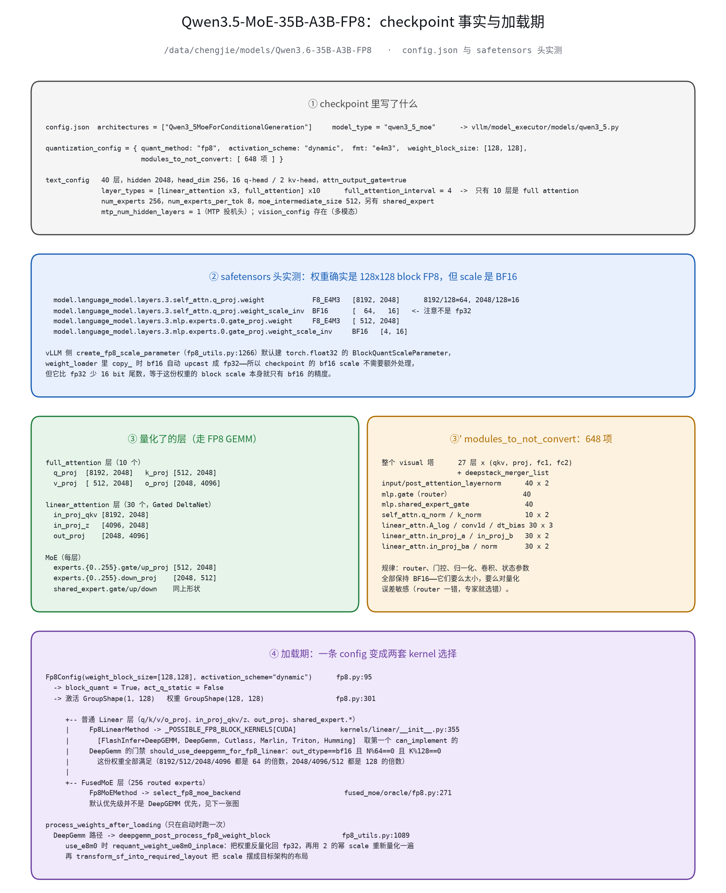

```json
"architectures": ["Qwen3_5MoeForConditionalGeneration"],   "model_type": "qwen3_5_moe",
"quantization_config": {
    "quant_method": "fp8", "activation_scheme": "dynamic", "fmt": "e4m3",
    "weight_block_size": [128, 128],
    "modules_to_not_convert": [ ...648 项... ]
}
```

`weight_block_size: [128, 128]` 是关键——**这是 DeepSeek 风格的 block FP8**，
所以第六节的 block-wise 粒度、第十节的 DeepGEMM 路线才有可能被激活。

模型本身是个混合架构：40 层里 `layer_types` 按 `[linear_attention ×3, full_attention]`
循环（`full_attention_interval: 4`），所以只有 10 层是标准注意力，30 层是 Gated DeltaNet；
MoE 部分 256 个专家、top-8、`moe_intermediate_size: 512`，另有一个 shared expert；
还带 1 层 MTP 和一个 vision 塔。

safetensors 头实测（`layers-3.safetensors`）：

```text
model.language_model.layers.3.self_attn.q_proj.weight            F8_E4M3  [8192, 2048]
model.language_model.layers.3.self_attn.q_proj.weight_scale_inv  BF16     [  64,   16]
model.language_model.layers.3.mlp.experts.0.gate_proj.weight     F8_E4M3  [ 512, 2048]
model.language_model.layers.3.mlp.experts.0.gate_proj.weight_scale_inv  BF16  [4, 16]
```

`8192/128 = 64`、`2048/128 = 16`，确认是 128×128 分块。
注意 **scale 存的是 BF16 而不是 fp32**——vLLM 侧 `create_fp8_scale_parameter`
（`fp8_utils.py:1266`）默认建 fp32 的 `BlockQuantScaleParameter`，
`weight_loader` 里 `copy_` 时自动 upcast，所以不需要额外处理；
但要意识到这份权重的 block scale 本身只有 bf16 的精度。

**哪些层被量化**：full attention 的 q/k/v/o_proj、linear attention 的 `in_proj_qkv` /
`in_proj_z` / `out_proj`、256 个 routed expert 的 gate/up/down_proj、shared expert 的三个投影。

**哪些没被量化**（`modules_to_not_convert` 的 648 项）：整个 vision 塔、所有 layernorm、
router（`mlp.gate`）、`shared_expert_gate`、`q_norm`/`k_norm`、
以及 GDN 的 `A_log` / `conv1d` / `dt_bias` / `in_proj_a` / `in_proj_b` / `in_proj_ba` / `norm`。
规律很清楚：router、门控、归一化、卷积、状态参数全部留 BF16——它们要么太小不值得量化，
要么对误差敏感（router 一错，选的专家就错了）。

#### 16.2 一层权重的逐字节实证

16.1 的数字来自 safetensors 头，这一节再往下走一层：把 layer 0 的
`linear_attn.in_proj_qkv` 整张权重读进内存，用真实字节验证前六节讲的编码格式与
量化约定。读取脚本是
`docs/assets/design/fp8_quantization_kernels/src/inspect_real_weight.py`，
只依赖 `safetensors` 和 CPU torch，本节所有数字都是它的输出。

选这一层的理由：40 层里 30 层是 Gated DeltaNet，`in_proj_qkv` 是其中最大的量化
Linear；它的 `[8192, 2048]` 又正好让块划分落成 64×16，便于对照。

| 张量 | dtype | shape | 元素数 |
| --- | --- | --- | --- |
| `...layers.0.linear_attn.in_proj_qkv.weight` | `torch.float8_e4m3fn` | `[8192, 2048]` | 16 777 216 |
| `...layers.0.linear_attn.in_proj_qkv.weight_scale_inv` | `torch.bfloat16` | `[64, 16]` | 1 024 |

**一个 scale 服务 16384 个权重元素**，存储开销只有权重的 1/8192
（bf16 2 字节 ÷ fp8 1 字节 ÷ 16384）——第六节 block-wise 那一行「每元素额外开销
0.25 bit」在这份权重上就是这个数。

下面分三个角度展开，各配一张图：权重侧的块划分、激活侧的分组、两侧如何对齐。

##### 权重侧：128×128 块与 weight_scale_inv 逐格对应

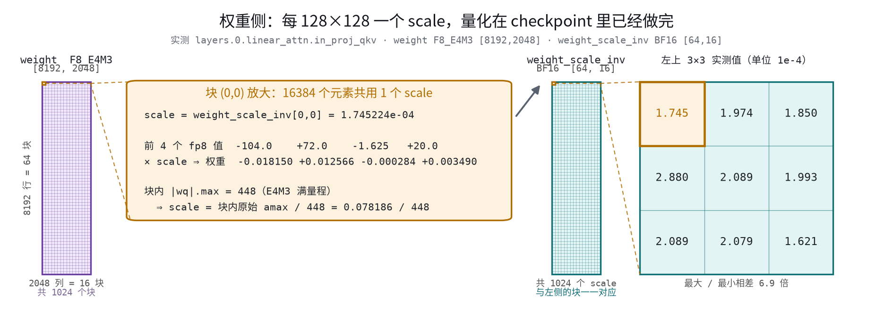

图里左右两个矩阵都按真实比例画：`weight` 的 `[8192, 2048]` 被切成 64×16 = 1024
个 128×128 块，`weight_scale_inv` 恰好也是 64×16，两者逐格对应——
`weight_scale_inv[i][j]` 就是第 `(i, j)` 块的反量化乘数。一个 128×128 的块放进
8192×2048 里只有图上那么一小格，中间的放大子图展开的就是左上角那一格。这一切都是
**静态**的：量化在制作 checkpoint 时离线完成，vLLM 只负责读进来。

**E4M3 的位域：4 个真实字节。** 第二节讲 E4M3 是 `1|4|3` 布局、指数 bias=7。取
`weight[0, 0:4]` 的原始字节手工解码，与 torch 的解码结果逐一核对：

| 字节 | 二进制 | S | E | M | 手算 `(-1)^S × (1+M/8) × 2^(E-7)` | torch 解码 |
| --- | --- | --- | --- | --- | --- | --- |
| `0xed` | `1 1101 101` | 1 | 13 (`+6`) | 5 | `-(1+5/8) × 2^6` = **−104.0** | −104.0 |
| `0x69` | `0 1101 001` | 0 | 13 (`+6`) | 1 | `+(1+1/8) × 2^6` = **+72.0** | +72.0 |
| `0xbd` | `1 0111 101` | 1 | 7 (`+0`) | 5 | `-(1+5/8) × 2^0` = **−1.625** | −1.625 |
| `0x5a` | `0 1011 010` | 0 | 11 (`+4`) | 2 | `+(1+2/8) × 2^4` = **+20.0** | +20.0 |

四个值的 E 都不为 0，全部落在正规数区间，没有用到 subnormal。注意 fp8 里存的是
**量化后的整数级数值**（−104、+72、+20 这种量级），不是权重原值——原值要乘 scale
才能得到，也就是图中放大子图第二、三行做的那一步。

**scale 与反量化的闭环。** 块 (0,0) 的实测：

```text
scale_inv[0,0] = 0.0001745224          # bf16 原值
log2(scale)    = -12.4843              # 非整数 ⇒ 不是 2 的幂
块内 |wq|.max  = 448.0                 # E4M3 满量程
反量化后块 amax = 448.0 × 1.745e-4 = 0.078186
weight[0,0]    = -104.0 × 1.745e-4 = -0.01815033
```

原始 bf16 权重块的最大绝对值是 0.078186，量化时取 `scale = amax / 448 = 1.745e-4`，
块内每个元素除以 scale 后落进 E4M3 可表示的范围，推理时再乘回来——这就是第四节
量化数学的完整闭环。`log2(scale)` 非整数这一点很关键：它说明 **checkpoint 存的是
任意 fp32/bf16 scale**，不是 2 的幂，这正是 Blackwell 上 DeepGEMM 需要
`requant_weight_ue8m0_inplace` 重量化的起点（14.2）。

**量化约定的反推：每块 amax 都恰好是 448。**

| 统计量（1024 个块的 `\|wq\|.max`） | 值 |
| --- | --- |
| min / median / max | 448 / 448 / 448 |
| `== 448` 的块占比 | **100.0%** |

1024 个块**无一例外**都有元素触达 E4M3 的满量程 448。这反推出量化时用的就是
`scale = amax / 448`（第四节的 absmax 对称量化），而不是留了余量的保守缩放——
制作这份 checkpoint 的量化器把每个块的动态范围都用满了。交叉验证：全张量中
`|x| == 448` 的元素占比 0.0083%，约 1392 个，除以 1024 个块正好是每块平均 1.4 个，
与「每块至少一个元素定义了 amax」完全吻合。

**1024 个 scale 的分布，以及块间差异有多大。**

```text
min = 1.249313e-04    max = 8.583069e-04    mean = 2.717869e-04
是 2 的幂的比例: 0.5%
```

最大与最小 scale 相差 6.9 倍——**块与块之间的权重量级差异接近一个数量级**（图中
右侧 3×3 那九个实测值已能看出参差）。这正是 per-block 缩放存在的意义：若改用
per-tensor 单一 scale，量级小的块会被压进 fp8 的低位，有效位数大量流失
（第六节的粒度权衡）。

「是 2 的幂的比例 0.5%」是随机巧合而非设计：bf16 有 8 位尾数，一个任意值恰好尾数
全零的概率约 1/256 ≈ 0.39%，实测 0.5% 与之相符。这从数据上确认了 checkpoint 的
scale 未做任何 UE8M0 约束。

**fp8 元素本身的分布。**

```text
零值占比        1.37%
饱和(|x|=448)   0.0083%
|wq × scale|.mean = 0.01154        # 反量化后的平均权重量级
```

零值占比 1.37% 说明权重本身有少量精确零（或量化后下溢到零）；饱和比例极低，说明
绝大部分元素分布在中间区段，没有出现大面积截断。反量化后平均量级 0.0115，与常见
LLM 权重的 std（0.01～0.03）一致——量化没有引入系统性的量级偏移。

##### 激活侧：1×128 组与 As

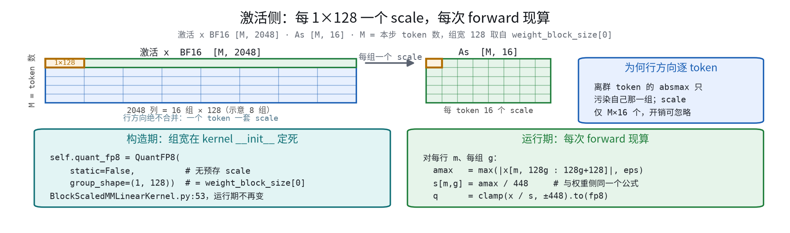

同一层的激活 `x` 形状是 `[M, 2048]`（M = 本步 token 数），分组是 `[1, 128]`：列
方向和权重一样每 128 个一组，于是每行 16 组、scale 张量 `[M, 16]`；**行方向却一个
token 一组、绝不合并**。图里那条绿色高亮就是一个 token 的一整行，行内第一格是一个
`[1, 128]` 组，与权重侧的块 (0,0) 同构。

**行方向不合并是精度选择。** 权重是静态的、分布平稳，离线量化时可以慢慢挑最优
scale，128 行共享一个也不吃亏（还省 128 倍 scale 存储）。激活则相反：不同 token
的幅值差异很大，常有离群 token；如果让 128 个 token 共享一个 scale，一个离群
token 的大 absmax 会把同组其他 127 个 token 的有效位一起压低。`[1, ·]` 粒度把这种
污染限制在它自己那一行一组内，代价很小——scale 只有 `M × 16` 个，相对 `M × 2048`
的激活本体可以忽略。

**「动态」指的是没有预存 scale。** checkpoint 里 `activation_scheme: "dynamic"`
就是这个意思，与之相对的 `static` 会在权重文件里带一个 `input_scale`。构建分两段，
即图下方那两个框：组宽在 kernel 构造期就定死、运行期不再变；每次 forward 由
`QuantFP8.forward_cuda` 分派到 csrc 算子现算 amax 与 scale（`per_token_group_fp8_quant`，
Blackwell + DeepGEMM 时是 `_packed` 变体，两者的差异见 14.3）。

值得注意的是运行期那三行公式与权重侧离线量化**完全同构**，差别只在「谁来算、什么
时候算」：权重侧是量化工具离线算一次、结果写进 checkpoint；激活侧是 csrc kernel
在线算，每步都重来一遍。这也解释了为什么换 GEMM 后端不会让量化变快——两条路用的
是同一批 csrc 算子，区别仅在产出的 scale 布局（CUTLASS 要 fp32 列主序，
DeepGEMM on Blackwell 要 int32 打包 UE8M0）。

##### K 向对齐：两侧必须是同一套 128 切法

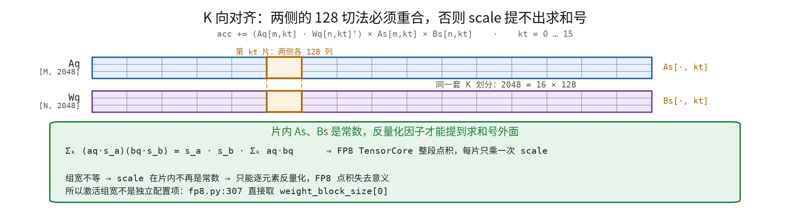

列方向（K 向）取 128 与行方向的取舍性质完全不同：**它是硬约束，由 GEMM 决定，没有
选择余地。** block-scaled GEMM 按 K 切 128 一片，片内先做 FP8 TensorCore 点积再乘
scale 累加，而这一步合法的前提是片内 `As`、`Bs` 都是常数，反量化因子才能提到求和号
外面。图里两条竖虚线框出的就是「同一片」：激活的第 kt 组与权重的第 kt 个 K 段必须
落在同样的 128 列上。

落到本层就是权重 scale 列数 16 与激活 scale 列数 16 严格相等。vLLM 里这一点是代码
强制的——`Fp8LinearMethod.__init__`（`fp8.py:307`）直接拿 `weight_block_size[0]` 去
构造激活的 group shape，激活组宽根本不是一个独立配置项。若组宽不等，scale 在片内
不再是常数，整段累加就不成立，只能退化成逐元素反量化，FP8 点积的意义全失。

---

把三张图合起来看，这份 checkpoint 的量化配方是：**E4M3 格式、权重 128×128 块 /
激活 1×128 组、absmax 对称量化、scale 为任意 bf16 值、每块用满 448 满量程**。
后面 16.5 讲的 Blackwell DeepGEMM 黑名单，起因就是最后两项与 UE8M0 的「scale 必须
是 2 的幂」要求冲突：重量化会让「用满 448」退化成「最多用到 256」。

#### 16.3 一层的真实算子序列

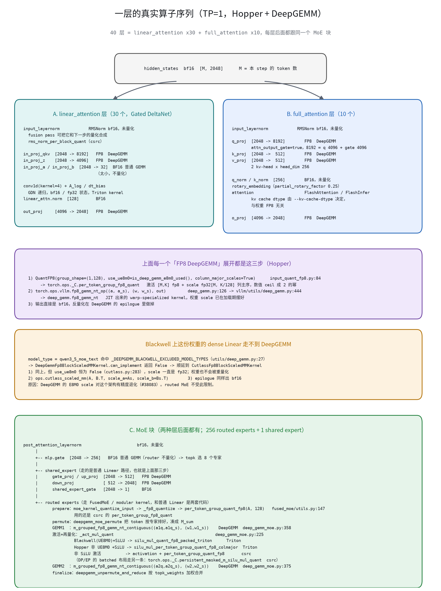

以 TP=1、DeepGEMM 可用为前提，每个「FP8 DeepGEMM」展开都是固定的三步：

1. `QuantFP8(group_shape=(1,128), use_ue8m0=is_deep_gemm_e8m0_used(), column_major_scales=True)`
   → Blackwell 上是 `torch.ops._C.per_token_group_fp8_quant_packed`，
   Hopper 上是 `torch.ops._C.per_token_group_fp8_quant`；
2. `torch.ops.vllm.fp8_gemm_nt_op` → `deep_gemm.fp8_gemm_nt`；
3. 输出直接是 bf16，反量化在 DeepGEMM 的 epilogue 里做掉。

「DeepGEMM 可用」这个前提对这份权重在 Blackwell 上其实不成立——dense Linear 被 model_type
黑名单挡掉，改走 CUTLASS blockwise（16.5）。下面按 Hopper 读即可；Blackwell 上把第 2 步换成
`ops.cutlass_scaled_mm`、第 1 步的 `use_ue8m0` 换成恒定 `False`，其余不变。

MoE 块是另一套代码（modular kernel），一次专家计算的完整序列：

```text
prepare : moe_kernel_quantize_input -> _fp8_quantize -> per_token_group_quant_fp8(A, 128)   fused_moe/utils.py:147
permute : deepgemm_moe_permute 把 token 按专家排好，凑成 M_sum
GEMM1   : m_grouped_fp8_gemm_nt_contiguous((a1q, a1q_s), (w1, w1_s))    deep_gemm_moe.py:358
激活+再量化 : _act_mul_quant                                             deep_gemm_moe.py:225
GEMM2   : m_grouped_fp8_gemm_nt_contiguous((a2q, a2q_s), (w2, w2_s))    deep_gemm_moe.py:375
finalize: deepgemm_unpermute_and_reduce 按 topk_weights 加权合并
```

其中 `_act_mul_quant` 按 scale 格式和激活函数分四种走法（表在 13.2）。
落到这份权重上：它是 SiLU、contiguous 布局，所以 Hopper 和 Blackwell 都走 **Triton**，
csrc 的 `persistent_masked_m_silu_mul_quant` 用不上——那条只在 DP/EP 的 batched 布局里出现。

#### 16.4 代码走读：跟着一次 forward 走到 kernel

上面的算子序列是结果，这一小节给出**完整的调用链**（文件与行号都按当前分支核对过），
每一步标注它落在哪一层：`Python` 是纯调度和内存分配，`csrc` 是本仓库编译的 CUDA 算子，
`DeepGEMM` 是外部包的 JIT kernel。建议开着编辑器对照跳转。

**链路一：量化 Linear（以 `layers.3.self_attn.q_proj` 为例）**

kernel 的选择发生在构造期，不在 forward 里：`Fp8LinearMethod.__init__` 调
`init_fp8_linear_kernel`（`fp8.py:387`），按 `kernels/linear/__init__.py:355` 的优先级表
选中 `DeepGemmFp8BlockScaledMMKernel`——它的 `can_implement`（`scaled_mm/deep_gemm.py:55`）
就是 16.5 那三道门。**下面按 Hopper 读**；Blackwell 上第三道门不过，选中的是
`CutlassFp8BlockScaledMMKernel`，②换成 `ops.cutlass_scaled_mm`，①固定走 fp32 scale 那一支，
其余结构完全一样。之后每次 forward 走的是同一条固定路径：

```text
Fp8LinearMethod.apply                                fp8.py:446 → :489
└─ Fp8BlockScaledMMLinearKernel.apply_weights        scaled_mm/BlockScaledMMLinearKernel.py:97
   │  # 拿 weight / weight_scale_inv，把输入 view 成 2D
   ├─ ① 激活量化  q_input, input_scale = self.quant_fp8(input_2d, ...)      :120
   │   └─ QuantFP8.forward_cuda                      input_quant_fp8.py:84        [Python 分发]
   │      ├─ Blackwell(UE8M0):  per_token_group_quant_fp8_packed_for_deepgemm    :99
   │      │   └─ torch.ops._C.per_token_group_fp8_quant_packed   fp8_utils.py:753  [csrc]
   │      └─ Hopper / fp32 scale:  per_token_group_quant_fp8                      :108
   │          └─ fp8_utils.py:566  先在 Python 侧 empty_strided 分配好
   │             列主序 / TMA 对齐的 scale 张量（:609–:630），再调
   │             torch.ops._C.per_token_group_fp8_quant           :637            [csrc]
   │             └─ csrc/libtorch_stable/quantization/w8a8/fp8/per_token_group_quant.cu
   │                host 入口 :613 → 通用 kernel :100 或 group_size==128 快路径 :302
   ├─ ② GEMM     apply_block_scaled_mm               scaled_mm/deep_gemm.py:109
   │   └─ torch.ops.vllm.fp8_gemm_nt_op              :122
   │      └─ fp8_gemm_nt                             vllm/utils/deep_gemm.py:444   [DeepGEMM]
   │         # JIT kernel；acc 为 fp32，出口乘 a_scale*b_scale，直接吐 bf16
   └─ ③ bias / reshape / 返回                        BlockScaledMMLinearKernel.py:139
```

加载期还有一步只跑一次的：`process_weights_after_loading`（`scaled_mm/deep_gemm.py:84`）
→ `deepgemm_post_process_fp8_weight_block`（`fp8_utils.py:1089`），UE8M0 设备上在这里
把权重反量化再用 2 的幂 scale 重量化——这一步是 Python/Triton，csrc 不参与。

**链路二：routed MoE（`FusedMoE` + modular kernel）**

MoE 的选路也在构造期：`Fp8MoEMethod.__init__` 调 `select_fp8_moe_backend`
（`fp8.py:527` → `oracle/fp8.py:271`），加载完权重后 `make_fp8_moe_kernel`（`fp8.py:711`）
把 prepare/finalize、experts 组装成一个 `FusedMoEModularKernel`；DEEPGEMM 后端拿到的
experts 是 `TritonOrDeepGemmExperts`（`experts/triton_deep_gemm_moe.py:24`）。forward 时：

```text
Fp8MoEMethod.apply → self.moe_kernel.apply           fp8.py:833 → :844
└─ FusedMoEModularKernel.apply                       modular_kernel.py:1371
   ├─ ① _prepare                                     :1419（实现在 :1118）
   │   └─ prepare_finalize.prepare      TP 单机是 no_dp_ep.py:57
   │      └─ moe_kernel_quantize_input               fused_moe/utils.py:262
   │         └─ _fp8_quantize :128 → per_token_group_quant_fp8(A, block_k=128)
   │            # 和链路一②之前是同一个 csrc 算子                              [csrc]
   ├─ ② _fused_experts                               :1435（实现在 :1222）
   │   └─ TritonOrDeepGemmExperts._select_experts_impl   triton_deep_gemm_moe.py:83
   │      # 每次 forward 判一遍: is_deep_gemm_e8m0_used() or _valid_deep_gemm(...)
   │      # N 取自 w2 末维即 moe_intermediate_size，本模型 =512，命中禁用分支；
   │      # 默认 E8M0 开启时整个判断被 :83 的 or 短路，仍走 DeepGEMM（13.4 / 16.5）
   │      └─ DeepGemmExperts.apply                   experts/deep_gemm_moe.py:287
   │         ├─ deepgemm_moe_permute                 :331   [Python/Triton] 按专家重排
   │         ├─ GEMM1  m_grouped_fp8_gemm_nt_contiguous  :358               [DeepGEMM]
   │         │    # gate_proj + up_proj：w13 [256, 1024, 2048]，
   │         │    # [M_sum, 2048] → [M_sum, 1024]（1024 = 2 × moe_intermediate 512）
   │         ├─ _act_mul_quant                       :370 → 实现在 :225
   │         │    # SwiGLU 把前后两半合成 [M_sum, 512] 并重新量化
   │         │    UE8M0+SiLU → Triton :246；Hopper+SiLU → Triton :268；
   │         │    非 SiLU → activation + per_token_group_quant_fp8 :283     [csrc]
   │         ├─ GEMM2  m_grouped_fp8_gemm_nt_contiguous  :375               [DeepGEMM]
   │         │    # down_proj：w2 [256, 2048, 512]，[M_sum, 512] → [M_sum, 2048]
   │         └─ 输出 bf16，反量化同样在 DeepGEMM epilogue
   └─ ③ _finalize                                    :1455（实现在 :1303）
       └─ deepgemm_unpermute_and_reduce              experts/deep_gemm_moe.py:386
          # 按 topk_weights 加权合并回 [M, K]        [Python/Triton]
```

**两条链路的边界在哪**：链路二的两次 grouped GEMM 只覆盖 256 个 routed expert 的
gate/up/down 三个投影（GEMM1 = gate+up 拼成的 w13，GEMM2 = down），`M_sum` 行是每个
token 被 top-8 复制后按专家排好的展开。**o_proj 不在其中**——它是 attention 块的输出
投影，和 q/k/v_proj 一样走链路一；**shared expert 也不在其中**——它不参与路由，
它的 gate/up/down 是三个独立的普通量化 Linear，量化与 GEMM 同样走链路一
（`fp8_gemm_nt`，非 grouped 版）。所以 8.5 结论矩阵里 Linear 与 routed MoE 分成两列，
分界线就是「是否进 `m_grouped_*` 这两次 grouped GEMM」。

对照这两条链路，两边的分工可以压缩成一句话：**凡是「bf16 → (fp8, scale)」的转换都落在
csrc（或 Triton 的融合变体），DeepGEMM 只消费已经量化好的 `(fp8, scale)` 对，
做 GEMM 和出口反量化；Python 层负责选路、按 GEMM 后端的要求预分配 scale 的布局，
以及 MoE 的 permute/unpermute。** 三层各自的输入输出边界都是 `(fp8 张量, scale 张量)` 这个对。

想亲手验证走到了哪条分支，两个低成本的办法：`VLLM_LOGGING_LEVEL=DEBUG` 看 8.6 节列的
那几行日志；或者在 `input_quant_fp8.py:99/:108`、`triton_deep_gemm_moe.py:83` 这三个
分叉点打断点——整条链路的所有「选择」就这三处，其余都是直线。

#### 16.5 谁真的会走 DeepGEMM

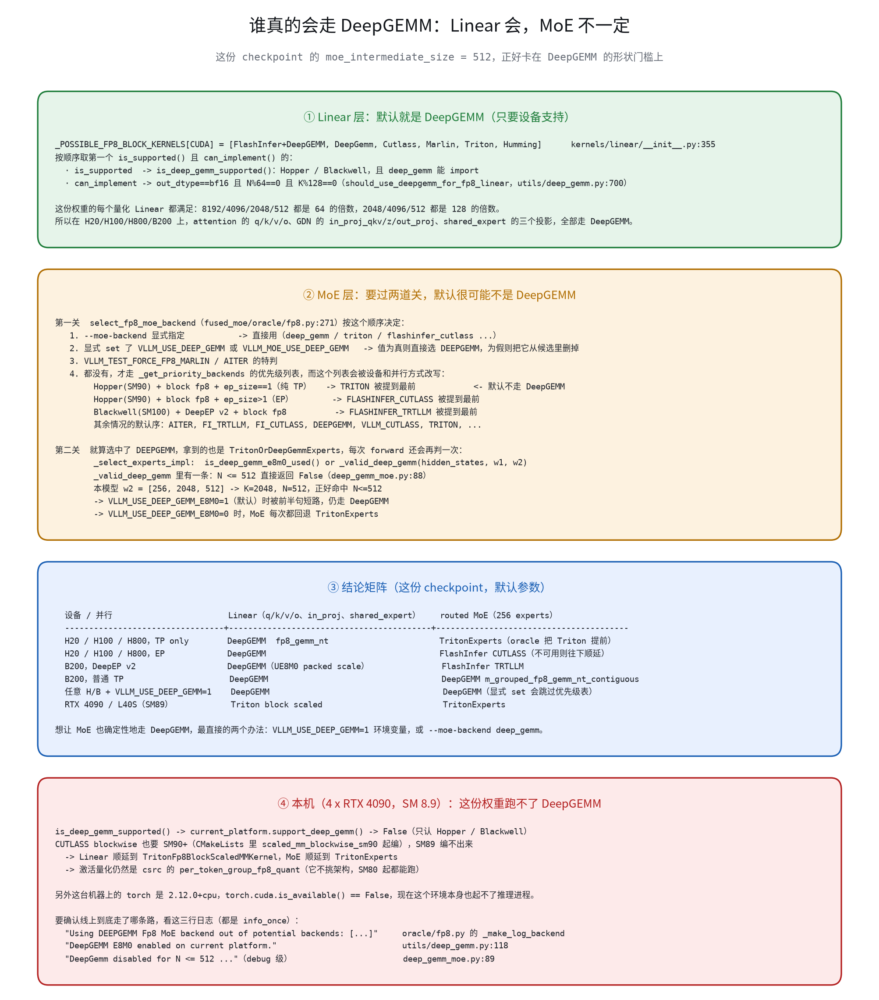

**Linear 层：Hopper 上走 DeepGEMM，Blackwell 上反而不走。**
`_POSSIBLE_FP8_BLOCK_KERNELS[CUDA]` 里 DeepGemm 排第二、CUTLASS blockwise 排第三，
`DeepGemmFp8BlockScaledMMKernel.can_implement`（`scaled_mm/deep_gemm.py:55`）要依次过三道门：

| 门禁 | 对这份权重的判定 |
| --- | --- |
| `out_dtype == bfloat16` 且 `group_shape == (1,128)` | 过 |
| `should_use_deepgemm_for_fp8_linear`：`N % 64 == 0 and K % 128 == 0`（`utils/deep_gemm.py:700`） | 过——8192/4096/2048/512 都是 64 的倍数，2048/4096/512 都是 128 的倍数 |
| `should_auto_disable_deep_gemm(model_type)`（`utils/deep_gemm.py:33`） | **Blackwell 上不过** |

第三道最容易漏。`_DEEPGEMM_BLACKWELL_EXCLUDED_MODEL_TYPES`（`utils/deep_gemm.py:27`）
这个黑名单里有 `qwen3_5_text` 和 `qwen3_5_moe_text`，而这份 checkpoint 的
`text_config.model_type` 正是后者。在 capability family 100 / 120 上，DeepGEMM 的 E8M0
scale 对这个架构有精度退化，于是 `can_implement` 直接返回 False，dense Linear
**顺延到 CUTLASS blockwise**——`vllm/config/vllm.py:936` 的日志原文就是 "Falling back to CUTLASS"。

**这条黑名单是怎么来的。** 引入它的是 `52069012f`——`[Bugfix] Fix DeepGemm E8M0 accuracy
degradation for Qwen3.5 FP8 on Blackwell (#38083)`。同一个提交还给 `input_quant_fp8.py:93`
的 UE8M0 分支补了 `and self.use_ue8m0` 条件，并新增了 gsm8k 评测配置
`tests/evals/gsm8k/configs/models-qwen35-blackwell.txt`——说明这是拿实际精度评测抓出来的回归，
不是理论推导。名单最初只覆盖 capability family 100，family 120 是后来 `44d95069e` 补上的。

根因就是第五节那张表里的取舍：UE8M0 把 scale 限制成 2 的幂，amax 只能映射到 256 而不是 448，
上端白白扔掉最多 1 bit 的范围。多数模型扛得住这点损失，Qwen3.5 这个架构扛不住。

这条黑名单还有两个容易误判的边界：

- **绕不开**。`should_auto_disable_deep_gemm` 只看 model_type 和设备 capability，不看
  `VLLM_USE_DEEP_GEMM`，所以显式置 1 也不会让 Blackwell 上的 dense 回到 DeepGEMM。
- **只管 dense**。`select_fp8_moe_backend` 不消费这个判断，routed MoE 那一列完全不受影响。

所以 Hopper（H20/H100/H800）上 attention 的四个投影、GDN 的三个投影、shared expert 的三个投影
全部走 DeepGEMM 系；换到 Blackwell（SM100 和 SM120 都一样）则全部改走 CUTLASS blockwise。
这是第十四节那条链路在这份权重上最直观的一个后果。

**MoE 层：两道关都要过。** 机制见 13.1（后端 oracle）和 13.4（`_valid_deep_gemm` 的形状门槛），
落到这份 checkpoint 上的判定是：

| 关卡 | 对这份权重的判定 |
| --- | --- |
| 第一道 `select_fp8_moe_backend` | 默认配置下 Hopper 纯 TP 会把 TRITON 提到最前，**DeepGEMM 根本选不上**；要显式 `VLLM_USE_DEEP_GEMM=1` 或 `--moe-backend deep_gemm` 才会选中 |
| 第二道 `_valid_deep_gemm` | `w2 = [256, 2048, 512]` → `K=2048, N=512`，**正好命中 `N <= 512` 那条**。默认 `VLLM_USE_DEEP_GEMM_E8M0=1` 把它短路掉，仍走 DeepGEMM；置 0 则每次回退 `TritonExperts` |

`moe_intermediate_size` 只要再大一点（比如 768），第二道关就不存在了——这份权重是卡在边界上的特例。

#### 16.6 结论矩阵

| 设备 / 并行 | Linear（q/k/v/o、in_proj、shared_expert） | routed MoE（256 experts） |
| --- | --- | --- |
| H20 / H100 / H800，TP only | FlashInfer+DeepGEMM；没装 FlashInfer 则 DeepGEMM `fp8_gemm_nt` | **TritonExperts**（oracle 把 Triton 提前） |
| H20 / H100 / H800，EP | 同上 | FlashInfer CUTLASS（不可用则顺延） |
| B200（SM100），DeepEP v2 | **CUTLASS blockwise**（model_type 黑名单，见 16.5） | FlashInfer TRTLLM |
| B200（SM100），普通 TP | **CUTLASS blockwise**（同上） | **FlashInfer TRTLLM**（默认候选表里它排在 DeepGEMM 之前，且 SM100 上支持 block-fp8）；没装 flashinfer 才顺延到 DeepGEMM |
| RTX 50 系（SM120） | **CUTLASS blockwise**（黑名单同样命中） | DeepGEMM；**FI-TRTLLM 不可用**（只认 SM100） |
| 任意 H/B + `VLLM_USE_DEEP_GEMM=1` | H 是 DeepGEMM；**B 仍是 CUTLASS blockwise** | DeepGEMM（显式 set 跳过优先级表） |
| RTX 4090 / L40S（SM89） | Triton block scaled | TritonExperts |

两个方向相反的结论容易记混：想让 MoE 确定性地走 DeepGEMM，显式 `VLLM_USE_DEEP_GEMM=1`
或 `--moe-backend deep_gemm` 即可；但想让 Blackwell 上的 dense Linear 走 DeepGEMM，
**没有开关能做到**——16.5 那条黑名单是硬编码的。

#### 16.7 当前这台机器跑不了这条路

本机是 4×RTX 4090（SM 8.9）。`is_deep_gemm_supported()` 走
`current_platform.support_deep_gemm()`，只认 Hopper / Blackwell，返回 False；
CUTLASS blockwise 也要 SM90+（`CMakeLists.txt` 里 `scaled_mm_blockwise_sm90` 起编）。
所以在这台机器上：

- Linear 顺延到 `TritonFp8BlockScaledMMKernel`，MoE 顺延到 `TritonExperts`；
- **激活量化仍然是 csrc 的 `per_token_group_fp8_quant`**——它不挑架构，SM80 起都能跑。

要确认线上实际走了哪条路，看这几行日志：

| 日志 | 位置 | 含义 |
| --- | --- | --- |
| `Using DEEPGEMM Fp8 MoE backend out of potential backends: [...]` | `oracle/fp8.py` 的 `_make_log_backend` | MoE 实际选中的后端与当次候选表 |
| `DeepGEMM E8M0 enabled on current platform.` | `utils/deep_gemm.py:118` | scale 走 2 的幂（14.1 的三档取值） |
| `DeepGemm disabled for N <= 512 ...`（debug 级） | `deep_gemm_moe.py:89` | MoE 运行期回退 Triton（13.4） |
| `DeepGemm disabled due to unaligned problem size ...`（debug 级） | `deep_gemm_moe.py:76` | 形状未对齐 128，同样回退 |

---

### 相关文档

- [vLLM FP8 量化：初始化、运行时与 Qwen3.6 on Blackwell 实战](fp8_backend_selection_qwen36.md)——quant_config 构建、dense 与 MoE 的后端优先级完整规则、DeepGEMM/CUTLASS 对比
- [量化识别与分发](quantization_dispatch.md)——checkpoint 怎么被认成 FP8，以及各层怎么拿到对应的 `QuantizeMethod`
- [DeepSeek-V4 MoE MXFP4](deepseek_v4_moe_mxfp4.md)——FP4 系列格式与 MoE 路径
- [Fused MoE Modular Kernel](fused_moe_modular_kernel.md)——MoE 里量化与 GEMM 的组合方式
