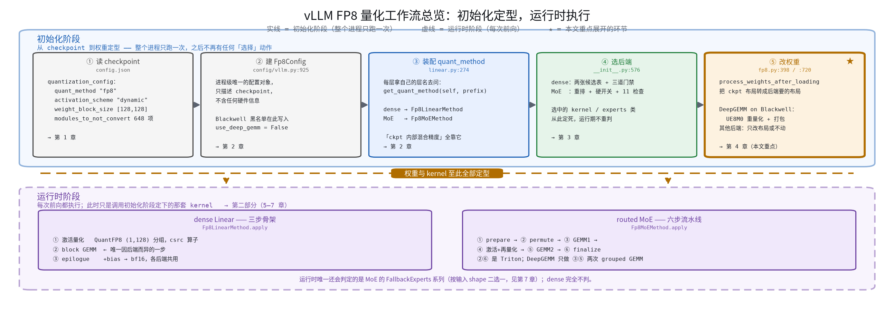
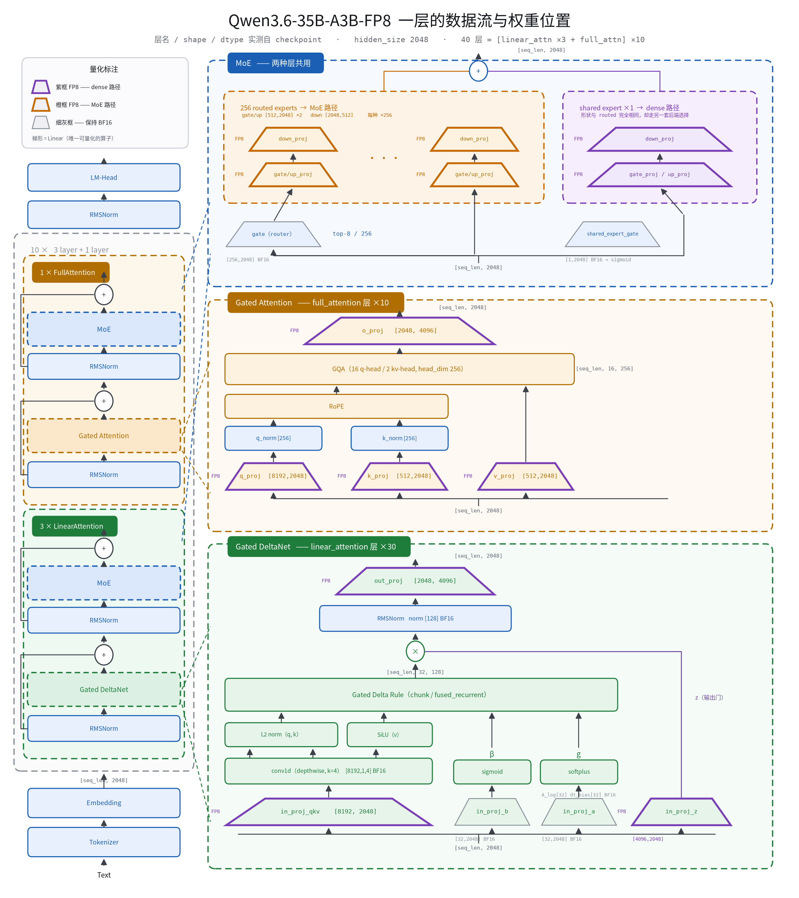
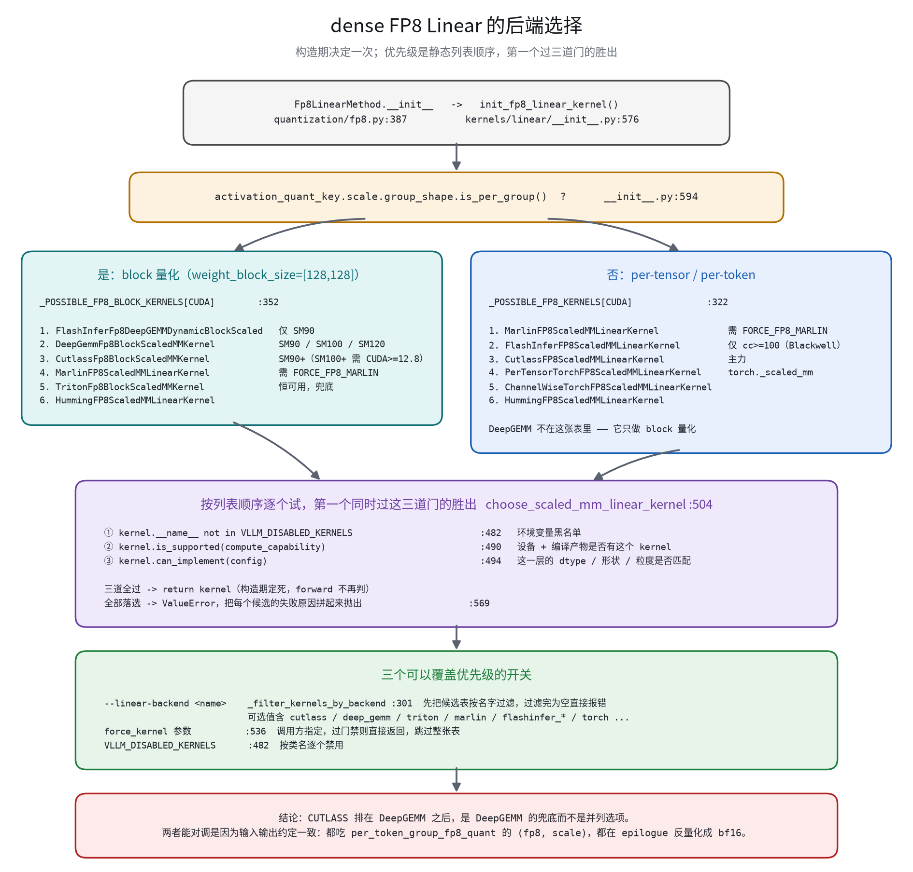
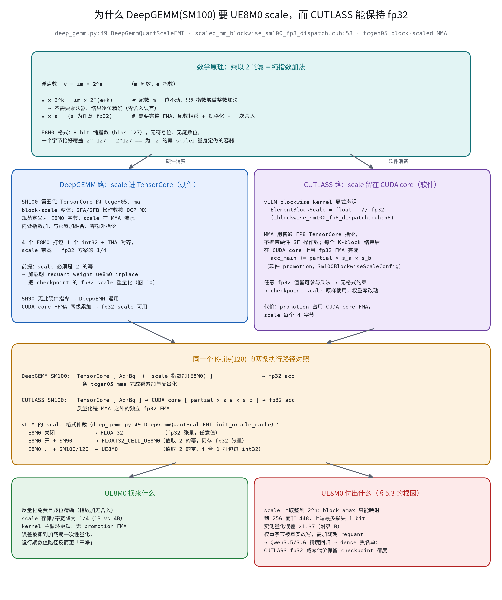
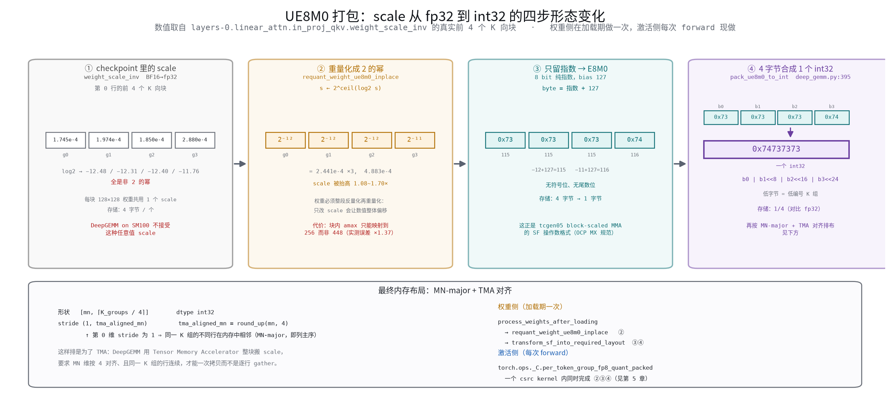
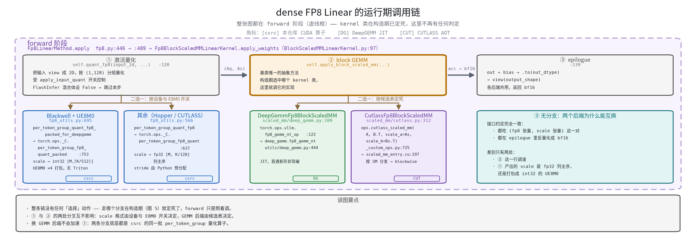
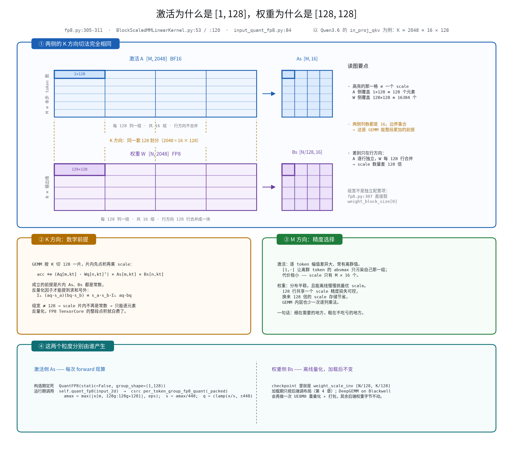
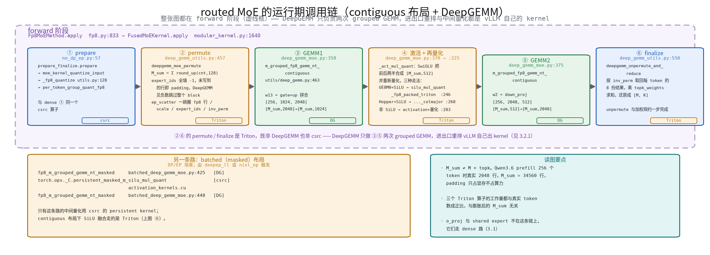

# vLLM FP8 量化工作流 —— 以 Qwen3.6-35B-A3B-FP8 为例

> 本文是**分享讲解稿**，按「初始化 → 运行时」单线组织，重点回答五个问题：
> 一个 FP8 模型跑起来时哪些算子被量化、dense 与 MoE 各自怎么选后端、
> 为什么加载完权重还要再改一遍、Blackwell 上走 DeepGEMM 为什么必须做 UE8M0 打包
> 以及具体怎么打包、运行时一次前向到底发生了什么。
>
> 逐行号级别的穷举细节（候选表全条目、每个门禁的实现、接口清单）见配套的参考文档
> [FP8 后端选择与 Qwen3.6-MoE 推理链路](../fp8_backend_selection_qwen36.md)，
> 本文在相关处给出指引。代码以分支 `v0.25.1-self` 为准。

## 目录

- [0 开篇](#0-开篇)
- 第一部分 初始化阶段
  - [1 量化了什么](#1-量化了什么--qwen36-的实际情况)
  - [2 配置怎么传到每一层](#2-配置怎么传到每一层)
  - [3 后端怎么选](#3-后端怎么选)
  - [4 process_weights_after_loading：为什么加载完还要改权重](#4-process_weights_after_loading为什么加载完还要改权重)
- 第二部分 运行时阶段
  - [5 dense：三步骨架](#5-dense三步骨架)
  - [6 MoE：六步流水线](#6-moe六步流水线)
  - [7 运行时还有判定吗](#7-运行时还有判定吗)
- [8 结论与排查速查](#8-结论与排查速查)
- [附录](#附录-a-图表索引)

---

## 0 开篇

### 0.1 一句话概括

**vLLM 的 FP8 量化分成两段：初始化阶段做完全部决策并把权重改成目标形态，运行时
阶段只是照着执行。** 「用哪个 GEMM 后端」「scale 存成什么格式」「权重要不要重排」
这些问题全部在服务启动时就有了答案，一次前向里不再有任何选择动作。

把这句话记住，后面所有内容都是它的展开。

### 0.2 全景



**图 1** vLLM FP8 量化工作流总览：初始化定型，运行时执行

图 1 的五个初始化步骤对应本文第 1–4 章，下半部分对应第 5–7 章。第 ⑤ 步
（`process_weights_after_loading`）打了星号，是本文着墨最多的地方——它既是
「初始化」与「运行时」的分界，也是 Blackwell 上那条 DeepGEMM 黑名单的成因所在。

### 0.3 三个前置结论

讲下去之前有三件事必须先立住，否则后面很容易理解偏。

**其一，dense 与 MoE 是两套完全独立的机制。** 入口、候选表、选择算法、覆盖开关
一律不共享。所以「我装了 DeepGEMM，模型就在用 DeepGEMM」这个推断不成立——完全
可能 dense 在用而 MoE 没用，或者反过来。**Qwen3.6 在 Blackwell 上恰好就是这种
情况。**

**其二，只有「大矩阵乘」被量化。** router、各种门控、layernorm、卷积、状态参数
一律保持 BF16。checkpoint 用 `modules_to_not_convert` 的 648 项把它们显式列了
出来。

**其三，所有选择都在初始化阶段定死。** dense 侧构造期定完就不再变；MoE 侧多一次
「通信器准备期」的替换机会，但也在首次 forward 之前完成。运行时唯一还会判定的是
MoE 的 `FallbackExperts` 系列（第 7 章）。

---

# 第一部分　初始化阶段：从 checkpoint 到权重定型

## 1 量化了什么 —— Qwen3.6 的实际情况

### 1.1 checkpoint 事实

以 `/data/chengjie/models/Qwen3.6-35B-A3B-FP8` 为例，数据均读自 `config.json` 与
safetensors 头，不是推测：

```json
"architectures": ["Qwen3_5MoeForConditionalGeneration"],
"model_type": "qwen3_5_moe",     "text_config.model_type": "qwen3_5_moe_text",
"quantization_config": {
    "quant_method": "fp8",  "activation_scheme": "dynamic",  "fmt": "e4m3",
    "weight_block_size": [128, 128],
    "modules_to_not_convert": [ ...648 项... ]
}
```

四个字段各自决定了后面的一整条路：

| 字段 | 取值 | 决定了什么 |
| --- | --- | --- |
| `quant_method` | `fp8` | 用哪个配置类（`Fp8Config`）和哪套 method |
| `weight_block_size` | `[128, 128]` | 走 **block 量化**那条路——第 3 章的 block 候选表、DeepGEMM 才有可能被选上 |
| `activation_scheme` | `dynamic` | 激活没有预存 scale，每次 forward 现算（第 5 章） |
| `modules_to_not_convert` | 648 项 | 哪些层保持 BF16 |

另外 **`text_config.model_type` 是 `qwen3_5_moe_text`**——这个看似无关的字段会在
第 3 章决定 dense 侧的最终结果。

模型结构：40 层按 `[linear_attention ×3, full_attention]` 循环，即 30 层 Gated
DeltaNet、10 层标准注意力；`hidden_size` 2048；MoE 部分 256 个 routed expert、
top-8、`moe_intermediate_size` 512，另有 1 个同为 512 宽的 shared expert。

### 1.2 一层里哪些算子被量化



**图 2** Qwen3.6-35B-A3B-FP8 一层的数据流与权重位置

图 2 左侧是模型骨架，右侧三个面板是骨架里三个彩色块的放大。**Linear 一律画成
梯形**，因为它是这个模型里唯一可量化的算子类型；**框线颜色就是量化归属**：紫框
= dense 路径 FP8、橙框 = MoE 路径 FP8、细灰框 = 保持 BF16。

扫一遍梯形的框色，就能读出全部量化位置：

| 模块 | FP8（dense 路径） | FP8（MoE 路径） | 保持 BF16 |
| --- | --- | --- | --- |
| Gated DeltaNet（30 层） | `in_proj_qkv` `[8192,2048]`、`in_proj_z` `[4096,2048]`、`out_proj` `[2048,4096]` | — | `in_proj_a`、`in_proj_b`（各 `[32,2048]`）、`conv1d`、`A_log`、`dt_bias`、`norm` |
| Gated Attention（10 层） | `q_proj` `[8192,2048]`、`k_proj`/`v_proj` `[512,2048]`、`o_proj` `[2048,4096]` | — | `q_norm`、`k_norm` |
| MoE block（两种层共用） | `shared_expert` 的 gate/up/down | `experts.{0..255}` 的 gate/up/down | `gate`（router）、`shared_expert_gate` |
| 层级 | — | — | `input_layernorm`、`post_attention_layernorm` |

两个最容易搞错的点：

- **`o_proj` 属于 dense**，不属于 MoE。它在注意力之后、残差之前。
- **shared expert 属于 dense**。它和 routed experts 在同一个 MoE block 里、形状
  完全相同（都是 `[512,2048]` 和 `[2048,512]`），却由两套互不相干的机制选后端。
  这就是 0.3 第一条在模型结构上的具体落点。

### 1.3 规律与例外

被量化的都是「大矩阵乘」；保持 BF16 的分两类——

**太小不值得**：`in_proj_a` / `in_proj_b` 只有 `32 × 2048`，量化省不下多少，
反而多两次量化/反量化开销。

**对误差敏感**：router 一旦出错，选出的专家就全错了，误差不是「变模糊一点」而是
「换了一批专家」；layernorm、`A_log`/`dt_bias` 这类状态参数直接决定递推稳定性。

GDN 层的数据流能把这条规律讲得更透（图 2 左下面板）：同一份 `x` 喂给四个投影，
`in_proj_qkv` 产出 q/k/v 进卷积，`in_proj_b` 产出的 b 经 sigmoid 变成写入强度 β，
`in_proj_a` 配合 `A_log`/`dt_bias` 变成衰减率 g——**后两者产出的是直接控制递推
稳定性的门控标量**，所以保持 BF16。而 `in_proj_z` 虽然同为门控用途（输出门），
却是 `[4096, 2048]` 的大矩阵乘，仍然被量化。

---

## 2 配置怎么传到每一层

### 2.1 config.json → Fp8Config


**图 3** `quant_config` 的五步构造过程

`quant_config` 是**进程级唯一的一个对象**。要点只有两条：

**它只描述 checkpoint，不描述硬件。** 它不知道跑在哪张卡上，也不知道该用 CUTLASS
还是 DeepGEMM。所有硬件相关的决策都发生在后面各层的 `quant_method` 构造函数里。

**有两处会往它上面补写字段**（图 3 第 4 步）：`config/vllm.py:931` 的 Blackwell
黑名单把 `use_deep_gemm` 置 `False`；`model_loader/utils.py:284` 把模型类的
`packed_modules_mapping` 挂上去——后者是必需的，因为 checkpoint 里
`in_proj_qkv`/`in_proj_z` 是两个张量而 vLLM 建的是融合的 `in_proj_qkvz`，没有这张
映射表，按层名跳过的逻辑会全部失配。

### 2.2 每层如何领到自己的 quant_method


**图 4** dense Linear 的 quant_method 装配链（实线 = 初始化，虚线 = forward）


**图 5** MoE 的 quant_method 装配链

两条链的形状相似，讲的时候抓住三个对比即可：

**唯一的提问点。** dense 在 `LinearBase.__init__`（`linear.py:274`），MoE 在
`RoutedExperts.__init__`（`routed_experts.py:186`），都是
`quant_config.get_quant_method(self, prefix)`。**传的是层对象 + 层名**——同一个
`Fp8Config` 被问几百次、每次 `prefix` 不同，这就是「一份 checkpoint 内部混合
精度」的**全部**实现机制，代码里没有第二处在做这件事。

**返回 `None` 的行为不对称。** dense 侧 `raise`，MoE 侧静默兜底成
`UnquantizedFusedMoEMethod`。排查时注意。

**MoE 多一个阶段。** dense 是「构造期 → 加载期 → forward」三段；MoE 在加载期之后
多一个**通信器准备期**（图 5 的 ⑧）：`maybe_init_modular_kernel` 可能把
`quant_method` 整个替换成 `FusedMoEModularMethod` 的包装。源码注释写明其时机是
「所有权重加载与后处理完成之后」（`moe_runner.py:854`），仍属初始化阶段。

还有一类层压根不问 `Fp8Config`：`mlp.gate`（router）和 `shared_expert_gate` 建层
时**显式传 `quant_config=None`**（`qwen3_next.py:138`/`:146`），走的是
`LinearBase` 里那条 `quant_config is None` 的分支。所以它们保持 BF16 与
`modules_to_not_convert` 里有没有它们无关。

---

## 3 后端怎么选

### 3.1 dense：两张候选表 + 三道门禁



**图 6** dense FP8 Linear 的后端选择流程

第一步按**量化粒度**二选一张表（`kernels/linear/__init__.py:594`）：有
`weight_block_size` 走 block 表，否则走 per-tensor/per-token 表。这一步之后候选
集合就固定了。**DeepGEMM 只存在于 block 表**——per-tensor 权重根本不会遇到它。

block 表在 CUDA 上的默认优先级：

| 优先级 | kernel 类 | 可用条件要点 |
| --- | --- | --- |
| 1 | `FlashInferFp8DeepGEMMDynamicBlockScaledKernel` | **仅 SM90**（符号名硬编码 `fp8_blockscale_gemm_sm90`） |
| 2 | `DeepGemmFp8BlockScaledMMKernel` | SM90/100/120；需 bf16 输出、N/K 对齐、**不在 Blackwell 黑名单** |
| 3 | `CutlassFp8BlockScaledMMKernel` | SM90+，只要求 `group_shape == (1,128)` |
| 4–6 | Marlin / Triton / Humming | Marlin 需显式开关；Triton 恒可用，最终兜底 |

**列表顺序就是优先级**——没有打分、没有 benchmark、没有 autotune。每个候选按序过
三道门：`VLLM_DISABLED_KERNELS`（人为开关）→ `is_supported(cc)`（**这台机器**能不
能跑）→ `can_implement(config)`（**这一层**能不能跑）。三道全过即返回，构造期定死。

选择发生在 `create_weights` 而非 `Fp8LinearMethod.__init__`，原因很实际：
`should_use_deepgemm_for_fp8_linear` 要查 `N % 64 == 0 and K % 128 == 0`，而
`weight` 参数是在 `create_weights` 里才 `register_parameter` 的，此前拿不到 shape。

> 更细的展开（A–F 六段、`--linear-backend` 的「缩小范围而非强制使用」语义、
> 五个候选各自落到哪个算子）见参考文档 2.3 节与其图 5。

### 3.2 MoE：重排 + 硬开关 + 11 道检查


**图 7** MoE FP8 的后端选择流程

MoE 的机制复杂得多，分三段：

**S0 重排候选表。** `_get_priority_backends` 只重排、不删除。最关键的一条：
**严格 SM90 + block-fp8 + 单机 TP 时，`TRITON` 被显式提到 DeepGEMM 前面**——所以
Hopper 上即使装了 deep_gemm，MoE 默认也不会用它。另一条：`family(100)` +
DeepEP v2 时把 `FLASHINFER_TRTLLM` 提到最前。

**S2–S6 五个硬覆盖开关**，先到先得，命中即返回，**不支持就直接抛错、不回退**。
两个坑：`Fp8MoEMethod` 传的 `allow_vllm_cutlass=False`，所以 vLLM 自带的 CUTLASS
MoE 在纯 FP8 路径上默认不参选；`VLLM_USE_DEEP_GEMM` 的判据是 `envs.is_set()`，
必须**显式 export 过**才生效——「默认开着」和「显式设成 1」是两种不同的行为。

**S7 主循环**，每个 backend 的 experts 类逐个过 11 道检查
（`modular_kernel.py:536`）。其中一条对 Blackwell 影响很大：`FlashInferExperts`
（FI-CUTLASS）的 **block-fp8 限定 `is_device_capability(90)`**，Blackwell 上只接受
nvfp4/mxfp4——所以「EP > 1 提前 FI-CUTLASS」那条重排规则在 Blackwell 上没有对应物。

### 3.3 Qwen3.6 在 Blackwell 上实际选中了谁


**图 8** Blackwell 上 Qwen3.6 dense 候选的逐个落选过程

**dense 侧：CUTLASS blockwise。** 三个候选依次落选：

1. **FlashInfer 混合体**在门 ② 落选，与模型无关——block 量化下 FlashInfer 只有
   SM90 kernel。（FlashInfer 在 dense 侧唯一的 Blackwell 候选在 non-block 表里，
   对这份 block 权重不适用。）
2. **DeepGEMM** 前四条检查全过，只挂在最后一条
   `should_auto_disable_deep_gemm(model_type)`——一条**只在 Blackwell 生效的模型
   黑名单**，Qwen3.6 系列的 `text_config.model_type`（`qwen3_5_text` /
   `qwen3_5_moe_text`）恰好都在名单里。
3. **CUTLASS blockwise** 全过，选中。

黑名单的成因就是第 4 章要展开的 UE8M0 精度代价，引入它的提交是 `52069012f`
（#38083），同一提交还加了 gsm8k 评测配置——**这是拿实际精度评测抓出来的回归，
不是理论推导**。

**MoE 侧：不受影响。** `select_fp8_moe_backend` 完全不消费这个判定。装了
flashinfer 时走 `FLASHINFER_TRTLLM` + `TrtLlmFp8ExpertsMonolithic`；没装或显式
指定时落到 `DEEPGEMM`。

所以 SM100 上会出现 **dense 走 CUTLASS、MoE 走 FlashInfer TRTLLM 或 DeepGEMM** 的
组合，这不是配置错误。

> 三条看似能绕开黑名单、实则不能的尝试（`VLLM_USE_DEEP_GEMM=1`、
> `VLLM_USE_DEEP_GEMM_E8M0=0`、`--linear-backend deep_gemm`）见参考文档 5.3.5。
> 其中第三条会导致**启动失败**而非回退。

---

## 4 process_weights_after_loading：为什么加载完还要改权重

### 4.1 问题定义

权重从 safetensors 读进来时是 **checkpoint 的布局**：FP8 权重 `[N, K]`，scale 是
`[N/128, K/128]` 的 bf16 张量，值是任意浮点数。

但**每个 GEMM 后端对权重和 scale 的要求都不一样**：DeepGEMM 在 Blackwell 上要
2 的幂的 scale 且打包成 int32；Marlin 要自己的交错权重布局；FlashInfer 要 shuffle
过的权重；CUTLASS 则原样就能用。

`process_weights_after_loading` 就是这道转换，在**权重读完之后、首次 forward
之前**，每层执行一次。它是初始化阶段的最后一步，也是**后端差异第一次落到权重
字节上**的地方。

对照图 1 就是第 ⑤ 步。为什么不能放到运行时？因为它是纯开销、且结果对所有 forward
都一样——放在运行时等于每步重做一遍。

### 4.2 【核心】DeepGEMM on Blackwell：UE8M0 重量化 + 打包

这是本文最需要讲清楚的一节。它回答两个问题：**为什么必须做**，以及**具体怎么做**。

#### 4.2.1 为什么必须做：硬件根据



**图 9** DeepGEMM 为何要求 UE8M0 scale 而 CUTLASS 能保持 fp32

先看数学。任何浮点数都是 `v = ±m × 2^e`。乘以 **2 的幂** 时
`v × 2^k = ±m × 2^(e+k)`——尾数一位不动，**只对指数域做整数加法**，不需要乘法器、
结果逐位精确；乘以**任意 fp32** 则需要完整 FMA（尾数相乘 + 规格化 + 一次舍入）。

再看硬件。Blackwell 第五代 TensorCore 的 `tcgen05.mma` 提供 block-scale 变体，
它的 scale factor 操作数（SFA/SFB）按 OCP Microscaling 规范定义为 **E8M0 字节**
（8 bit 纯指数，bias 127，无符号位无尾数位）。scale 在 MMA 流水内部以指数加完成，
与乘累加融合、零额外指令。

**走这条硬件通路的前提，就是 scale 必须是 2 的幂。** 这就是必须做重量化的全部
原因——不是 DeepGEMM 的偏好，是硬件指令的输入格式要求。

作为对照，vLLM 的 CUTLASS blockwise kernel 显式声明
`ElementBlockScale = float`（`scaled_mm_blockwise_sm100_fp8_dispatch.cuh:58`）：
MMA 用普通 FP8 指令、不携带硬件 SF 操作数，每个 K-block 的部分和在 **CUDA core**
上以 fp32 FMA 乘 `s_a × s_b` 后并入主累加器（软件 promotion）。任意 fp32 值都能
参与乘法，所以**无格式约束、权重零改动**。

vLLM 的 scale 格式仲裁（`deep_gemm.py:49` `DeepGemmQuantScaleFMT`）由此分三档：

| 条件 | 格式 | 含义 |
| --- | --- | --- |
| E8M0 关闭 | `FLOAT32` | fp32 张量，任意值 |
| E8M0 开 + SM90 | `FLOAT32_CEIL_UE8M0` | 值取 2 的幂，**仍存 fp32 张量** |
| E8M0 开 + SM100/120 | `UE8M0` | 值取 2 的幂，**4 合 1 打包进 int32** |

注意 SM90 那一档只做「取 2 的幂」不做打包——因为 Hopper 没有这条硬件指令。

#### 4.2.2 具体怎么做：四步形态变化



**图 10** UE8M0 打包：scale 从 fp32 到 int32 的四步形态变化（数值取自真实权重）

图 10 用 `layers-0.linear_attn.in_proj_qkv.weight_scale_inv` 的真实前 4 个 K 向块
走了一遍全过程。

**① checkpoint 原始形态。** 四个 scale 是 `1.745e-4 / 1.974e-4 / 1.850e-4 /
2.880e-4`，`log2` 分别是 `−12.48 / −12.31 / −12.40 / −11.76`——**全是非 2 的幂**。
每个占 4 字节。

**② 重量化成 2 的幂**（`requant_weight_ue8m0_inplace`，`fp8_utils.py:989`）。
核心是 `s ← 2^ceil(log2 s)`，四个 scale 变成 `2⁻¹² / 2⁻¹² / 2⁻¹² / 2⁻¹¹`。
函数分四步：

```text
1 旧 scale 展开    repeat_interleave 把 [M/128, K/128] 扩成 [M, K]
2 反量化           w_dq = wq.float() × s_exp        还原到 fp32 数值域
3 UE8M0 重量化     per_block_cast_to_fp8(w_dq, [128,128], use_ue8m0=True)
                     amax → s = amax/448 → s ← 2^ceil(log2 s) → (w_dq/s).to(fp8)
4 原地写回         wq.copy_() / ws.copy_()          不新分配显存
```

**必须整段「反量化 → 重量化」，不能只改 scale。** 只把 scale 换成 2 的幂而不动
fp8 尾数，数值会整体偏移；先还原再按新 scale 重新取整，误差才最小。

**③ 只留指数 → E8M0。** 2 的幂只需要记指数：`byte = 指数 + 127`。四个 scale 变成
`0x73 / 0x73 / 0x73 / 0x74`（115/115/115/116）。**存储从 4 字节降到 1 字节。**

**④ 4 个字节合成 1 个 int32**（`pack_ue8m0_to_int`，`deep_gemm.py:395`）：

```text
packed = b0 | (b1 << 8) | (b2 << 16) | (b3 << 24)
       = 0x73 | 0x73<<8 | 0x73<<16 | 0x74<<24
       = 0x74737373
```

低字节对应低编号的 K 组。最终 scale 张量的形状与布局是：

```text
形状    [mn, ⌈K_groups / 4⌉]      dtype int32
stride  (1, tma_aligned_mn)       tma_aligned_mn = round_up(mn, 4)
```

**第 0 维 stride 为 1**，意味着同一个 K 组的不同行在内存中相邻——这就是
**MN-major（列主序）**。之所以这样排并且把 MN 维按 4 对齐，是为了 **TMA**：
DeepGEMM 用 Tensor Memory Accelerator 整块搬运 scale，只有连续且对齐才能一次
拷贝，否则要逐行 gather。

综合下来 scale 的存储/带宽降到 fp32 方案的 **1/4**。

#### 4.2.3 代价：真实数据实测

用仓库里的原函数对真实形状的权重跑一遍（脚本见附录 B）：

| 指标 | requant 前 | requant 后 |
| --- | --- | --- |
| scale 是 2 的幂的比例 | 0% | **100%** |
| scale 上调倍数 new/old | — | min 1.077 / mean **1.332** / max 1.533 |
| fp8 值域利用 `\|wq\|.max` | ≈ 448 | 416 / 448 |
| 相对量化误差 | 0.02250 | 0.03074（**放大 1.366×**） |

原理上说得通：scale 被上取整，一个 block 的 amax 就只能映射到 256（`2^8`）而不是
E4M3 的最大值 448，**上端白白让出至多 1 bit 的动态范围**。

#### 4.2.4 后果：Blackwell 模型黑名单

多数模型扛得住这点损失，Qwen3.5/3.6 这个架构扛不住。于是有了 3.3 讲的那条黑名单
（`utils/deep_gemm.py:27`），**它要避开的正是 4.2.2 这次加载期重量化**。

两个边界要说清楚：

- **黑名单只管 dense。** MoE 侧走 DeepGEMM 时照常执行重量化——对 256 个专家的
  w13/w2 共 512 个矩阵各做一次，加载期一次性开销。
- **判定写在两个地方，起作用的是后一个。** `VllmConfig.__post_init__` 会把
  `quant_config.use_deep_gemm` 置 False，但真正让候选落选的是
  `DeepGemmFp8BlockScaledMMKernel.can_implement` 里独立的那次调用。所以把前者
  强行改回 `True` 也没用。

#### 4.2.5 一个常被追问的问题：为什么 MoE 侧没有同样的黑名单

直觉上的解释是「MoE 扛得住这点误差，dense 扛不住」。**这个说法在代码里找不到
依据。** 查引入黑名单的提交 `52069012f`（#38083），它改动的文件里根本没有 MoE 侧：

```text
vllm/config/vllm.py                              +19   写 quant_config.use_deep_gemm = False
vllm/model_executor/layers/quantization/fp8.py    +9   只改 Fp8LinearMethod.__init__
vllm/utils/deep_gemm.py                          +18   黑名单本体
tests/evals/gsm8k/...                                  新增 Blackwell 回归评测配置
```

`fp8.py` 那 9 行全部落在 `Fp8LinearMethod.__init__`（`:292`）；`Fp8MoEMethod` 与
`select_fp8_moe_backend` **一次都没读过 `use_deep_gemm`**。所以 MoE 不是「被评估后
判定可以接受」，而是**这次修复的作用域从一开始就只覆盖 dense**。

作者只修 dense 就收工，有三个可查证的原因：

**一、Blackwell 上 MoE 默认压根不走 DeepGEMM。** 后端优先级里 `FLASHINFER_TRTLLM`
排在 `DEEPGEMM` 前面（3.2 节），SM100 + block-fp8 默认选中的是
`TrtLlmFp8ExpertsMonolithic`。要让 MoE 落到 DeepGEMM，得「没装 flashinfer」或
显式指定。**默认部署里「MoE + DeepGEMM + UE8M0」这个组合不会被触发**，修它没有收益。

**二、修复由评测驱动，评测覆盖到哪就修到哪。** 同一提交新增了
`models-qwen35-blackwell.txt` 的 gsm8k 回归配置——跑出掉点 → 定位到 dense 的
DeepGEMM E8M0 → 关掉 → 分数恢复。这是一次目标明确的 bugfix，不是对称的双路评估。
日志文案也只提一个回退目标：「... Falling back to CUTLASS.」——MoE 侧没有对应的
回退语义可写，因为它本来就不在这条路上。

**三、两侧的误差暴露面确实不同。** dense 的量化投影在**每一层、每个 token** 的
关键路径上（40 层的 qkv / o_proj / in_proj 全部命中）；routed expert 每个 token
只激活 256 个里的 8 个，误差累积次数差一个量级。**但这是结构上的合理推断，不是
仓库里有实测数据支撑的结论**——没有找到任何针对 MoE 侧 UE8M0 的精度评测。

**实践含义**：如果在 SM100 上刻意把 MoE 逼到 DeepGEMM（不装 flashinfer，或
`VLLM_USE_DEEP_GEMM=1`），512 个专家矩阵会照常做 UE8M0 重量化，误差放大倍数与
dense 侧同源（4.2.3 实测 ×1.37），而这条路**没有被任何评测覆盖过，也没有黑名单
保护**。真要用，建议自己先跑一遍精度评测。

### 4.3 其他后端怎么处理

不是所有后端都动权重。按「动作强度」排：

| 后端 | 做了什么 | 权重字节是否改变 |
| --- | --- | --- |
| **DeepGEMM**（`scaled_mm/deep_gemm.py:84`） | 先调基类调整布局，再 `deepgemm_post_process_fp8_weight_block`：Blackwell 上重量化 + 打包 UE8M0；SM90 只做 `ceil` 到 2 的幂，scale 仍存 fp32 | **是**（重量化） |
| **Marlin**（`marlin.py:86`） | `process_fp8_weight_block_strategy` + `prepare_fp8_layer_for_marlin`：把权重 repack 成 Marlin 的交错布局 | **是**（重排） |
| **FlashInfer 混合体**（`flashinfer.py:178`） | 直接委托给 fallback（DeepGEMM）那一份——两个 kernel 共用同一套参数布局，处理一次即可 | 同 DeepGEMM |
| **CUTLASS blockwise** | 继承基类的 `process_fp8_weight_block_strategy`（`BlockScaledMMLinearKernel.py:75`），只调整布局 | **否** |
| **Triton blockwise** | 同上，继承基类 | **否** |
| **CPU**（`cpu.py:292`） | 自行重写整个 `apply_weights` 与后处理 | 是 |

**这张表是 4.1 那个问题的答案**：`process_weights_after_loading` 存在，是因为
后端对权重形态的要求分布在「完全不改 → 只改布局 → 改数值」这个谱系上，而
checkpoint 只能存一种形态。

顺带解释了 3.3 的一个结论：Qwen3.6 在 Blackwell 上 dense 落到 CUTLASS 之后，
**权重一个字节都不会被改动**，checkpoint 的精度原样保留。

### 4.4 MoE 侧的对应机制

MoE 走的是另一个入口：`convert_to_fp8_moe_kernel_format`（`oracle/fp8.py:457`），
按 `fp8_backend` 分派：

| backend | 处理函数 |
| --- | --- |
| `DEEPGEMM` / `BATCHED_DEEPGEMM` | `prepare_fp8_moe_layer_for_deepgemm` → 对 w13、w2 各调一次 `deepgemm_post_process_fp8_weight_block` |
| `FLASHINFER_CUTLASS` / `FLASHINFER_TRTLLM` | `prepare_fp8_moe_layer_for_fi`（含 shuffle） |
| `MARLIN` | `prepare_fp8_moe_layer_for_marlin` |
| `AITER` | `rocm_aiter_ops.shuffle_weights` |
| `HUMMING` | `convert_to_humming_moe_kernel_format` |
| `XPU` / `CPU` | 各自的 prepare 函数 |
| `TRITON` / `VLLM_CUTLASS` / `BATCHED_*` | **什么都不做**（走到最后的 else 分支只做合法性断言） |

### 4.5 小结

一张表收口本章：

| | 改数值 | 改布局 | 什么都不做 |
| --- | --- | --- | --- |
| dense | DeepGEMM(Blackwell) 重量化、Marlin repack | DeepGEMM(SM90)、CUTLASS、Triton 的 block strategy | — |
| MoE | DeepGEMM 重量化、Marlin repack、AITER shuffle | FlashInfer shuffle | Triton、vLLM CUTLASS |

**Qwen3.6 on SM100 的实际情况**：dense 走 CUTLASS → 只改布局；MoE 走 FlashInfer
TRTLLM → shuffle，或走 DeepGEMM → 512 个专家矩阵逐个重量化 + 打包。

---

# 第二部分　运行时阶段：一次前向发生了什么

## 5 dense：三步骨架



**图 11** dense FP8 Linear 的运行期调用链（整张图都在 forward 阶段）

前向骨架写在基类 `Fp8BlockScaledMMLinearKernel.apply_weights`
（`BlockScaledMMLinearKernel.py:97`），CUDA block 表的候选共用同一份实现：

```text
① if self.apply_input_quant:                      ← 类级开关
       q_input, As = self.quant_fp8(input_2d, ...)   激活量化
   else:
       q_input = input_2d                            直接送 BF16
② out = self.apply_block_scaled_mm(A, B, As, Bs)  ← 唯一的抽象方法
③ out = (out + bias).to(out_dtype).view(shape)      epilogue
```

**「选后端」最终只落在第 ② 步一个抽象方法的实现上。** 第 ③ 步各后端完全共用；
第 ① 步由类级开关 `apply_input_quant` 控制——FlashInfer 那两个类置为 `False`，
它们接受 BF16 输入、在 kernel 内部自行转 FP8。

### 5.1 激活量化：[1,128] 的由来



**图 12** 激活为什么是 `[1,128]`、权重为什么是 `[128,128]`（以 `in_proj_qkv` 为例，K = 2048 = 16 × 128）

执行者是 kernel 构造期就定死的 `self.quant_fp8 = QuantFP8(static=False,
group_shape=(1,128))`。为什么权重是 `[128,128]` 而激活是 `[1,128]`？

图 12 的第 ① 栏把两侧的分块画在一起，**上下两个矩阵共用一套竖直虚线**——那就是
K 方向的 128 边界。三处对照着看：

- **高亮的那一格就是一个 scale 的覆盖范围**：A 侧是 `1×128`（128 个元素），
  W 侧是 `128×128`（16384 个元素）。同样是「一个 scale」，覆盖面差 128 倍。
- **列方向两边完全一样**：都切成 16 组、边界逐条对齐，所以 `As` 是 `[M, 16]`、
  `Bs` 是 `[N/128, 16]`，**第二维都是 16**。
- **差别只在行方向**：A 的每一行自成一组（图中横线密），W 则每 128 行合并成一块
  （图中横线稀）。

这两点差异各有各的理由，正是下面两段。

**K 方向的 128 是数学前提（图中第 ② 栏）。** GEMM 按 128 切 K 片，片内先做
FP8 TensorCore 点积再乘 scale 累加：

```text
acc += (Aq[m,kt] · Wq[n,kt]ᵀ) × As[m,kt] × Bs[n,kt]
```

这一步合法的前提是**片内 As、Bs 都是常数**，反量化因子才能提到求和号外面
（`Σₖ (aq·s_a)(bq·s_b) = s_a·s_b·Σₖ aq·bq`）。所以激活的组宽必须等于权重块的 K
宽——代码里是强制的，`fp8.py:307` 直接拿 `weight_block_size[0]` 构造激活的 group
shape，不是独立配置项。

**M 方向逐行是精度选择（图中第 ③ 栏）。** 激活逐 token 幅值差异大、常有离群值；
`[1,·]` 让离群 token 的 absmax 只污染它自己那一组，而代价极小——scale 总共才
`M × 16` 个。权重则相反：分布平稳、又能离线慢慢挑最优 scale，128 行共享一个就够，
换来 128 倍的 scale 存储节省，GEMM 内层也少一次逐列乘法。一句话概括就是
**细在需要的地方，粗在不吃亏的地方**。

图 12 第 ④ 栏还标出了这两个粒度分别由谁产生：`As` 由构造期定死、每次 forward
现算的 `QuantFP8` 产生；`Bs` 则直接来自 checkpoint 的 `weight_scale_inv`，加载期
只按后端调布局（第 4 章）。这也解释了为什么组宽不是一个独立配置项——
`fp8.py:307` 直接拿 `weight_block_size[0]` 去构造激活的 group shape，两者**从代码
层面就被绑定在一起**，不可能配不齐。

### 5.2 与第 4 章呼应：权重离线打包，激活在线打包

Blackwell + DeepGEMM 时，**GEMM 两侧的 scale 都是 UE8M0**，但生成时机完全不同：

| | 谁做 | 何时 | 怎么做 |
| --- | --- | --- | --- |
| 权重侧 | `process_weights_after_loading` | 加载期一次 | 重量化 + `transform_sf_into_required_layout` 打包（4.2） |
| 激活侧 | `torch.ops._C.per_token_group_fp8_quant_packed` | **每次 forward** | 一个 csrc kernel 内同时完成量化、取指数、4 合 1 打包 |

激活侧之所以能一趟做完，是因为激活本来就要现场量化——顺手把 scale 直接写成 int32
的 TMA 对齐布局，省掉一趟额外的显存往返。这个 kernel 用位运算提取 UE8M0
（取 float 的指数位，尾数非零则 +1，与 `exp2f(ceilf(log2f(x)))` 位级等价但没有
超越函数开销），全寄存器驻留、无 shared memory。

**换 GEMM 后端不会让激活量化变快**——两条分支底层都是 csrc 的同一批
`per_token_group` 算子，区别只在 scale 的输出排布（fp32 列主序 vs int32 打包）。

---

## 6 MoE：六步流水线



**图 13** routed MoE 的运行期调用链（contiguous 布局 + DeepGEMM）

contiguous 布局下六步：prepare 量化 → permute 重排 → GEMM1 → 激活+再量化 →
GEMM2 → finalize 合并。

**DeepGEMM 只负责 ③⑤ 两次 grouped GEMM。** 进出口的重排（②⑥）和中间量化（④）
都是 vLLM 自己的 Triton kernel——这一点从图 13 的角标一排看下来就是
`csrc → Triton → DG → Triton → DG → Triton`。

### 6.1 permute / finalize 背后的三个 Triton 算子

②⑥ 不是单个 kernel，而是三个算子的组合。它们解决同一个问题：**grouped GEMM 要求
同一专家的 token 在内存中连续、且每段起点对齐到 128，而路由结果天然是散乱的。**

**`count_expert_num_tokens`**（`utils.py:69`）：一个 program 负责一个专家，扫一遍
`topk_ids` 数出属于自己的元素个数。若 prepare/finalize 是 DeepEP 一类通信器，
通信本身已产出这个计数，则直接复用、不启动这个 kernel。

**`ep_scatter`**（`deep_gemm_utils.py:273`）：两个 kernel 串联。kernel 1 把每专家
token 数**向上取整到 128 再前缀和**得到分段起点，并填 `m_indices`；`expert_ids`
调用前已整体初始化为 −1，**padding 行保持 −1，DeepGEMM 的 scheduler 见负数就跳过
整个 block**。kernel 2 按 token 搬运，用 `tl.atomic_add` 原子抢占段内槽位，拷贝
fp8 行与 scale，并记录 `inv_perm`。顺带一提，**MXFP8 的 scale 打包也在这个 kernel
里现场完成**（`b0 | b1<<8 | b2<<16 | b3<<24`），省一趟往返。

**`ep_gather`**（`:416`）：用 `inv_perm` 反查每个 (token, expert) 对在 GEMM2 输出
中的源行，乘 `topk_weight` 累加进 fp32 累加器后写回。它**同时完成 unpermute 与
topk 加权求和**——所以 `DeepGemmExperts.finalize_weight_and_reduce_impl` 返回
`TopKWeightAndReduceNoOP()`。

这三个算子**只服务 `DeepGemmExperts`**。走 FlashInfer TRTLLM（Monolithic，路由与
重排都在 flashinfer kernel 内部）时完全不会触及。

### 6.2 M_sum 膨胀与 padding 跳过

`M_sum` 不等于 `M × topk`，而是 `Σ_e round_up(专家 e 的 token 数, 128)`。以
Qwen3.6 为例（256 专家、top-8），prefill 256 个 token 时真实工作量 2048 行，
而 `M_sum = 34560` 行——接近 17 倍膨胀。

但**膨胀只占显存，不占算力**：padding 行的 `expert_ids` 是 −1，DeepGEMM 跳过整个
block；三个 Triton 算子的工作量也都与真实 token 数成正比，与 `M_sum` 无关。

---

## 7 运行时还有判定吗

**dense：没有。** 构造期定死之后，`apply_weights` 只是照着调。

**MoE：只有 `FallbackExperts` 系列有。** 它的静态门禁是 **AND**（两个子实现都要
支持才会被选中），运行期再按输入 shape 二选一：

```python
# TritonOrDeepGemmExperts._select_experts_impl   triton_deep_gemm_moe.py:83
if is_deep_gemm_e8m0_used() or _valid_deep_gemm(hidden_states, w1, w2):
    return self.experts            # DeepGemmExperts
return self.fallback_experts       # TritonExperts
```

**前半句默认为真**（Blackwell + 装了 deep_gemm + `VLLM_USE_DEEP_GEMM_E8M0` 默认
开），会把后面整串形状检查短路掉。这一点对 Qwen3.6 很关键：`_valid_deep_gemm`
里有一条 `N <= 512 直接返回 False`，而这份权重的 `w2` 是 `[256, 2048, 512]`、
N 正好是 512——**默认配置下被短路了，一旦把 `VLLM_USE_DEEP_GEMM_E8M0` 置 0，
每次 forward 都会回退到 `TritonExperts`**。

---

## 8 结论与排查速查

### 8.1 结论矩阵

| 设备 / 并行 | dense Linear | routed MoE |
| --- | --- | --- |
| Hopper H100/H800，TP only | FlashInfer+DeepGEMM；未装 FlashInfer 则 DeepGEMM | **TritonExperts**（oracle 把 TRITON 提前） |
| Hopper，EP > 1 | 同上 | FlashInfer CUTLASS |
| **Blackwell B200（SM100）** | **CUTLASS blockwise** | **FlashInfer TRTLLM（Monolithic）** |
| RTX 50 系（SM120） | CUTLASS blockwise | DeepGEMM（FI-TRTLLM 只认 SM100） |
| Ada 4090 / L40S（SM89） | Triton block scaled | TritonExperts |
| 任意 H/B + `VLLM_USE_DEEP_GEMM=1` | H 是 DeepGEMM；**B 仍是 CUTLASS** | DeepGEMM |

### 8.2 怎么确认线上实际走了哪条路

```text
"Selected %s for %s"                                        kernels/linear/__init__.py:600
    → dense kernel 名。注意 scope="global"，全进程只打一条，不是每层一条
"Using ... Fp8 MoE backend out of potential backends: [...]" oracle/fp8.py
"Auto-disabled DeepGemm for model_type=%s on Blackwell ..."  config/vllm.py:940
"DeepGemm disabled for N <= 512 ..."（debug 级）              experts/deep_gemm_moe.py:89
```

要确认**具体某一层**用了什么，只能起服务后打印：

```python
m = llm.llm_engine.model_executor.driver_worker.model_runner.model
lin = m.model.layers[0].linear_attn.in_proj_qkvz
print(type(lin.quant_method).__name__, type(lin.quant_method.fp8_linear).__name__)

qm = m.model.layers[3].mlp.experts.routed_experts.quant_method
print(type(qm).__name__, getattr(qm, "fp8_backend", None) or qm.old_quant_method.fp8_backend)
```

### 8.3 五条常见误解

1. **「装了 DeepGEMM 就在用 DeepGEMM」** —— dense 与 MoE 分别决定，Qwen3.6 on
   SM100 恰好是 dense 不用、MoE 可能用。
2. **「`o_proj` 和 shared expert 属于 MoE」** —— 都属于 dense 路径。
3. **「`--linear-backend deep_gemm` 能强制用 DeepGEMM」** —— 它的语义是「缩小候选
   范围」，被留下的候选仍要过三道门；过不了就**启动失败**，不会回退。
4. **「N/K 没对齐所以选不上 DeepGEMM」** —— block-FP8 权重建层时先要过
   `validate_fp8_block_shape` 的 128 对齐检查，比 DeepGEMM 的 64/128 更严，
   不满足根本走不到 kernel 选择。这个方向可以直接排除。
5. **「换 GEMM 后端能让激活量化变快」** —— 两条分支底层是同一批 csrc 算子。

---

## 附录 A 图表索引

| 图号 | 文件 | 所在节 |
| --- | --- | --- |
| 图 1 | `overview_two_phase.png` | 0.2 全景 |
| 图 2 | `qwen36_quantized_layer_map.png` | 1.2 一层的量化位置 |
| 图 3 | `quant_config_build.png` | 2.1 quant_config 构造 |
| 图 4 | `dense_quant_method_chain.png` | 2.2 dense 装配链 |
| 图 5 | `moe_quant_method_chain.png` | 2.2 MoE 装配链 |
| 图 6 | `dense_backend_tree.png` | 3.1 dense 后端选择 |
| 图 7 | `moe_backend_tree.png` | 3.2 MoE 后端选择 |
| 图 8 | `qwen36_dense_deepgemm_gate.png` | 3.3 候选逐个落选 |
| 图 9 | `ue8m0_vs_fp32_scale.png` | 4.2.1 两条反量化通路 |
| 图 10 | `ue8m0_packing_layout.png` | 4.2.2 UE8M0 打包布局 |
| 图 11 | `dense_runtime.png` | 5 dense 运行期 |
| 图 12 | `quant_fp8_block_workflow.png` | 5.1 粒度耦合 |
| 图 13 | `moe_runtime.png` | 6 MoE 运行期 |

图片位于本目录的 `images/`。生成脚本在
`docs/assets/design/fp8_backend_selection_qwen36/src/`（未随本目录打包），
重新生成方法见该目录 README。

## 附录 B 真实数据实证

两个脚本已随本目录打包在 `scripts/` 下，只依赖 `safetensors` 与 CPU torch，
可直接复现文中所有数字。

**`inspect_real_weight.py`** —— 读取真实权重逐字节解码。验证 E4M3 位域
（`0xed = 1|1101|101 → -(1+5/8)×2^6 = -104.0`）、块 scale 与反量化闭环、以及一个
很能说明问题的统计：**1024 个块的 `|wq|.max` 全部恰好等于 448**，反推出量化器用的
就是 `scale = amax/448` 的 absmax 对称量化，每个块的动态范围都用满了。

**`demo_requant_ue8m0.py`** —— 直接调用仓库里的 `requant_weight_ue8m0_inplace`
（非复刻），用 4×4 微型示例逐元素展示四步算法，再用 Qwen3.6 真实形状
（`[4, 2048, 512]`、128×128 块）统计出 4.2.3 那张表的数字。

## 附录 C 延伸阅读

- [FP8 后端选择与 Qwen3.6-MoE 推理链路](../fp8_backend_selection_qwen36.md)
  —— 本文的参考手册版：候选表全条目、每道门禁的实现、`init_fp8_linear_kernel`
  的 A–F 六段拆解、DeepGEMM 与 CUTLASS 的完整接口清单（含
  `api_surface.png`）、Gated DeltaNet 递推核的内部展开。
- [FP8 量化原理与 vLLM 实现](../fp8_quantization_kernels.md)
  —— 数值格式、量化粒度、csrc 算子地图、Blackwell 完整 workflow。
- [量化识别与分发](../quantization_dispatch.md) —— checkpoint 如何被识别为 FP8。
- [Fused MoE Modular Kernel](../fused_moe_modular_kernel.md)
  —— MoE 中 prepare / experts / finalize 的组合方式。

所有行号以分支 `v0.25.1-self` 为准。
