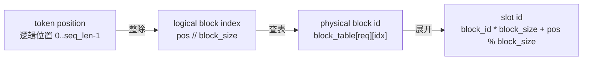
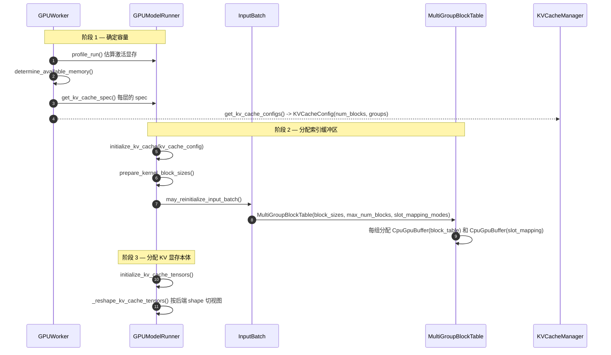
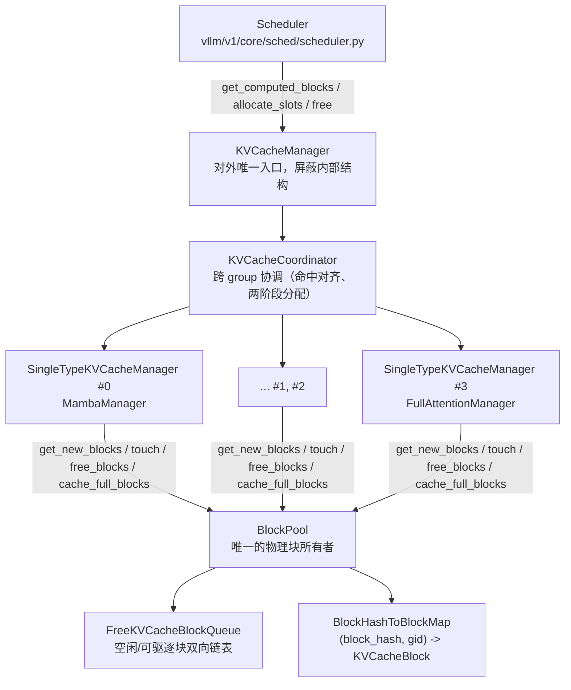
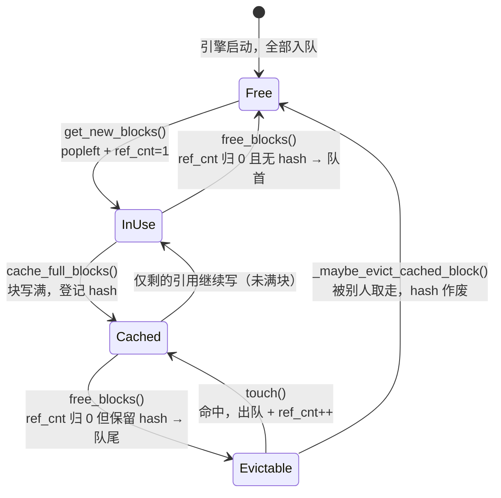
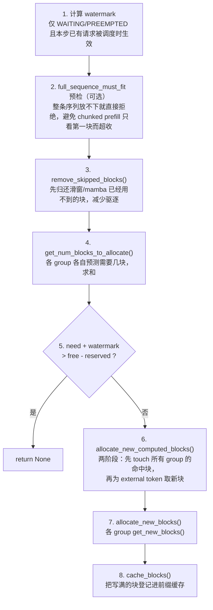
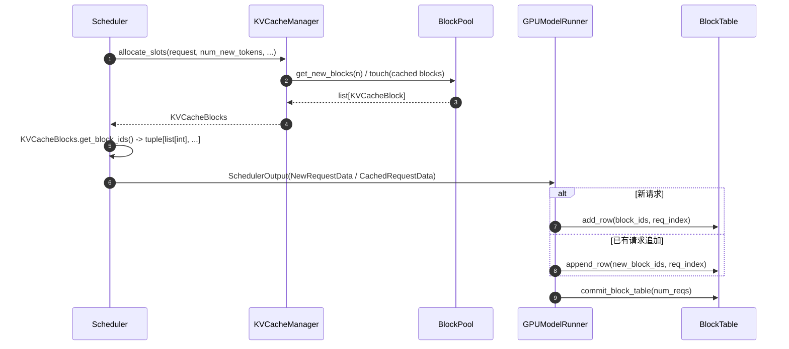
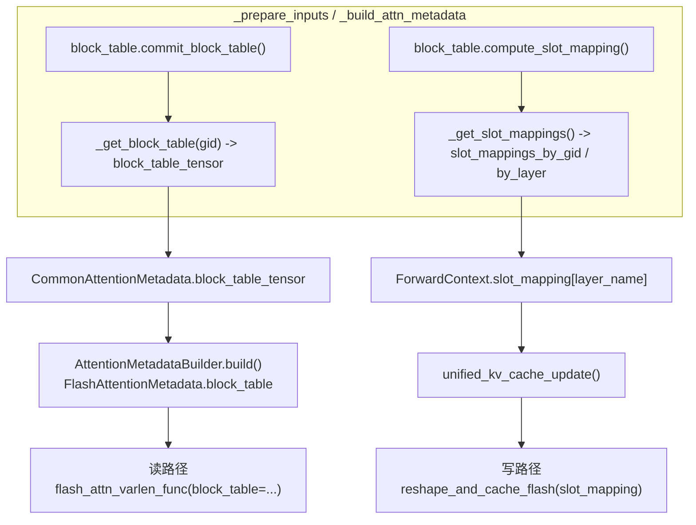

# KV Cache 的 Block Table 与 Slot Mapping

本文以 [examples/basic/offline_inference/basic.py](../../examples/basic/offline_inference/basic.py) 为入口，结合该脚本的实际参数，讲清 vLLM V1 中 KV cache 的两条主线：

- **Worker 侧的索引结构**：`block_table` 与 `slot_mapping` 如何初始化、每步如何更新、attention 后端如何消费；
- **Engine core 侧的管理逻辑**：block id 如何被分配、命中、驱逐、释放（见 [第六章](#六engine-core-侧的-kv-cache-管理)）。

文中所有数值都是按脚本给定的参数、在本仓库代码上实际推导得到的，不是通用示例。所有代码片段均摘自当前分支源码，行为解释以源码为准。

阅读路线：

| 想了解 | 直接看 |
| --- | --- |
| 两个数据结构分别解决什么问题 | [第二章 核心概念](#二核心概念) |
| 为什么本模型的 `block_size` 是 528、为什么有 4 张表 | [第三章 参数推导](#三本模型的关键数值推导) |
| 缓冲区在启动期怎么建出来的 | [第四章 初始化](#四初始化三个阶段) |
| block id 从哪来、什么时候被回收 | [第六章 engine core](#六engine-core-侧的-kv-cache-管理) |
| 每步怎么更新、kernel 怎么用 | [第七章](#七每步的-block-table-更新)、[第八章](#八slot-mapping-的计算)、[第九章](#九attention-后端如何消费) |
| 排查问题查什么 | [第十一章 可观测性](#十一可观测性)、[第十二章 不变量](#十二不变量清单) |

---

## 一、入口脚本

脚本的关键参数：

```python
llm = LLM(
    model="/data/chengjie/models/Qwen/Qwen3.5-35B-A3B",
    enforce_eager=True,
    gpu_memory_utilization=0.9,
    max_model_len=8192,
    tensor_parallel_size=4,
    enable_expert_parallel=True,
)
```

这些参数经过 `EngineArgs.create_engine_config()` 和平台层的 `update_block_size_for_backend()` 之后，解析结果如下：

| 配置项 | 值 | 来源 |
| --- | --- | --- |
| `max_model_len` | 8192 | 脚本显式指定 |
| `tensor_parallel_size` | 4 | 脚本显式指定 |
| `max_num_seqs` | 128 | 默认值 |
| `max_num_batched_tokens` | 2048 | 默认值 |
| `enable_prefix_caching` | `False` | 该混合模型不支持，自动关闭 |
| `cache_config.block_size` | 16 → **528** | 默认 16，被 `_align_hybrid_block_size()` 提升 |
| `cache_config.mamba_block_size` | 8192 | `mamba_cache_mode="none"` 时等于 `max_model_len` |
| `cache_config.mamba_cache_mode` | `none` | prefix caching 关闭时强制为 `none` |
| `cache_config.mamba_page_size_padded` | 540672 | 对齐到 attention page |
| `num_kv_heads`（每 rank） | 1 | 总共 2 个 KV head，TP=4 时复制 |
| `head_size` | 256 | 模型配置 |
| KV dtype | `bfloat16` | `--kv-cache-dtype auto` |

!!! important
    Qwen3.5-35B-A3B 是**混合模型**：40 层中 30 层是 `linear_attention`（Gated DeltaNet，走 `MambaSpec`），10 层是 `full_attention`（走 `FullAttentionSpec`，`full_attention_interval=4`）。这直接导致 block table 不是一张表，而是**四张**，且 attention 的 `block_size` 从默认的 16 被提升到 528。下文会完整推导这个 528。

---

## 二、核心概念

`block_table` 和 `slot_mapping` 解决的是同一个问题的两个方向：**逻辑上连续的 token 序列，如何落到物理上不连续的 KV cache 显存**。

vLLM 中存在三个 ID 空间：



两个数据结构的分工：

| 数据结构 | 形状 | 生命周期 | 回答的问题 |
| --- | --- | --- | --- |
| `block_table` | `[max_num_reqs, max_num_blocks_per_req]` int32 | 跨 step 持久，随请求增长追加 | 「这个请求的第 i 个逻辑块，在显存里是哪个物理块？」 |
| `slot_mapping` | `[max_num_batched_tokens]` int64 | 每个 step 重算 | 「本 step 第 j 个 token 的 KV，要写到哪个物理槽位？」 |

核心公式（`_compute_slot_mapping_kernel` 的非 CP 情形）：

```text
block_idx = block_table[req_idx][pos // block_size]
slot_id   = block_idx * block_size + (pos % block_size)
```

!!! note
    `block_table` 是**读**路径需要的（attention kernel 要按块随机访问历史 KV），`slot_mapping` 是**写**路径需要的（把本 step 新算出的 K/V scatter 写进 cache）。两者由同一张表推导，但被传给不同的 kernel。

---

## 三、本模型的关键数值推导

### 3.1 为什么 block_size 变成 528

默认 `block_size` 是 `CacheConfig.DEFAULT_BLOCK_SIZE = 16`。但 KV cache manager 只能管理**一种大小的 page**，而混合模型里 mamba 层的 page 是整份 recurrent state，与 `block_size` 无关。`Platform._align_hybrid_block_size()` 因此把 attention 的 `block_size` 抬高到「一个 attention page ≥ 一个 mamba page」。

单 token 的 attention page：

```text
attn_page_size_1_token = 2 (K,V) * 1 (num_kv_heads) * 256 (head_size) * 2 (bf16)
                       = 1024 bytes
```

mamba（GDN）状态 page，形状取自 `Qwen3_5MoeForConditionalGeneration.get_mamba_state_shape_from_config()`：

```text
conv state: (3, 2048)     bf16  = 3 * 2048 * 2         =  12288 bytes
ssm  state: (8, 128, 128) fp32  = 8 * 128 * 128 * 4    = 524288 bytes
mamba_page_size                                        = 536576 bytes
```

`mamba_cache_mode="none"` 走非 prefix-caching 分支：

```text
kernel_block_alignment_size = max(min(FlashAttention 支持的 kernel block size), block_size)
                            = max(16, 16) = 16

attn_block_size = 16 * cdiv(536576, 16 * 1024)
                = 16 * cdiv(536576, 16384)
                = 16 * 33
                = 528
```

于是 `cache_config.block_size = 528`，attention page 变成 `528 * 1024 = 540672` 字节；mamba page 被 padding 到同样的 540672 字节（浪费 0.76%）。

相关代码：

- `Platform._align_hybrid_block_size`、`Platform.update_block_size_for_backend`：[vllm/platforms/interface.py](../../vllm/platforms/interface.py)
- `unify_kv_cache_spec_page_size`：[vllm/v1/core/kv_cache_utils.py](../../vllm/v1/core/kv_cache_utils.py)

!!! warning
    `update_block_size_for_backend()` 在 **executor 启动、模型加载之后**才执行（它需要遍历已构建的 attention layer 来确定后端）。所以在引擎启动日志里会看到 `block_size` 从 16 变成 528 的 `Setting attention block size to 528 tokens ...` 信息。如果只在进程外构造 `VllmConfig`，读到的仍是 16。

### 3.2 为什么有四个 KV cache group

`_get_kv_cache_groups_uniform_page_size()` 先按 spec 相等性把层聚类，再切成层数相同的若干组：

```text
same_type_layers = {
    MambaSpec:          30 层 linear_attention,
    FullAttentionSpec:  10 层 full_attention,
}

min_num_layers = 10, max_num_layers = 30
30 >= 10 * 1.5  ->  group_size = min_num_layers = 10

MambaSpec:         cdiv(30, 10) = 3 组，按 layers[i::3] 切分
FullAttentionSpec: cdiv(10, 10) = 1 组
```

最终 **4 个 KV cache group**，每组 10 层：

| Group | KV cache spec | 层数 | `block_size` | `max_num_blocks_per_req` | slot mapping 模式 |
| --- | --- | --- | --- | --- | --- |
| 3 个 linear group | `MambaSpec` | 10 × 3 | 8192 | `cdiv(8192, 8192)` = 1 | `SlotMappingMode.NONE` |
| 1 个 full group | `FullAttentionSpec` | 10 | 528 | `cdiv(8192, 528)` = 16 | `SlotMappingMode.TOKEN_TO_KV_SLOT` |

!!! note
    group 的顺序由层的遍历顺序决定。本模型第 0 层是 `linear_attention`，所以 mamba group 排在前面，full attention group 在最后。代码中不要假设 attention 一定是 gid 0——`GPUModelRunner._get_attention_kv_cache_gid()` 会显式查找第一个 `FullAttentionSpec` 组。

因此 `MultiGroupBlockTable` 里有 **4 个 `BlockTable` 实例**，形状分别是：

```text
block_tables[0..2].block_table  : (128, 1)   int32   # mamba，每请求 1 个状态块
block_tables[3].block_table     : (128, 16)  int32   # full attention
block_tables[3].slot_mapping    : (2048,)    int64   # = max_num_batched_tokens
```

### 3.3 Kernel block size 与块拆分

`prepare_kernel_block_sizes()` 检查后端能否直接吃下 manager 的 `block_size`。FlashAttention 声明 `get_supported_kernel_block_sizes() -> [MultipleOf(16)]`，而 `528 % 16 == 0`，所以：

```text
kernel_block_size    = 528
blocks_per_kv_block  = 528 // 528 = 1
use_hybrid_blocks    = False
```

即本例**不发生**块拆分。这段判断就写在 `BlockTable.__init__` 里：

```python
if kernel_block_size == block_size:
    # 标准路径：分配粒度与 kernel 粒度一致，block id 直接可用
    self.block_size = block_size
    self.blocks_per_kv_block = 1
    self.use_hybrid_blocks = False
else:
    # 混合路径：一个 manager block 被切成多个 kernel block
    if block_size % kernel_block_size != 0:
        raise ValueError(...)
    self.block_size = kernel_block_size          # 注意：self.block_size 变成 kernel 粒度
    self.blocks_per_kv_block = block_size // kernel_block_size
    self.use_hybrid_blocks = True

self.max_num_blocks_per_req = max_num_blocks_per_req * self.blocks_per_kv_block
```

三个容易踩坑的点：

1. **`self.block_size` 在混合路径下不等于构造参数 `block_size`**，它被改写成 kernel 粒度；原值保存在 `self.kv_cache_block_size` 里，后者才是传给 Triton kernel 的 `KV_CACHE_BLOCK_SIZE`。
2. **表的列数被放大** `blocks_per_kv_block` 倍——因为表里存的是 kernel block id，一个 manager block 展开成多个。
3. 展开由 `map_to_kernel_blocks()` 完成，是一次纯 numpy 广播，没有 Python 循环：

```python
kernel_block_ids = (
    kv_manager_block_ids.reshape(-1, 1) * blocks_per_kv_block + kernel_block_arange
)
return kernel_block_ids.reshape(-1)
# manager [0, 1, 2] + blocks_per_kv_block=2  ->  kernel [0, 1, 2, 3, 4, 5]
```

其中 `kernel_block_arange = np.arange(0, blocks_per_kv_block).reshape(1, -1)` 在 `__init__` 里预先算好，避免每次 `append_row` 重建。`blocks_per_kv_block == 1` 时函数首行直接原样返回，零开销。

相关代码：

- `prepare_kernel_block_sizes`、`select_common_block_size`：[vllm/v1/worker/utils.py](../../vllm/v1/worker/utils.py)
- `BlockTable.map_to_kernel_blocks`：[vllm/v1/worker/block_table.py](../../vllm/v1/worker/block_table.py)

---

## 四、初始化：三个阶段

初始化全部发生在 `llm.generate()` 之前的引擎启动期。



### 4.1 阶段一：确定容量

`determine_available_memory()` 用显存快照算出 KV cache 可用字节数，`get_kv_cache_configs()` 据此算 `num_blocks`。本例走 `get_kv_cache_config_from_groups()` 的 general 分支：

```python
group_size = max(len(group.layer_names) for group in kv_cache_groups)  # = 10
page_size  = 540672
num_blocks = available_memory // (group_size * page_size)
```

得到 10 个 `KVCacheTensor`，每个被 4 层共享（4 个 group 各出一层，`shared_by` 列出这 4 个 layer name）。

!!! important
    「共享」不是分段切开：`_reshape_kv_cache_tensors()` 给每个 layer 的视图都覆盖**整块** `page_size * num_blocks` 显存，即 4 个 group 的 4 个 layer 是**互相 alias** 的。之所以不会互相踩踏，是因为 4 个 group 共用**同一个 `BlockPool`**——block id 是全局唯一的，一个 id 在同一时刻只会被一个 group 的一个请求持有。所以「group 各有各的 block table」说的是索引结构独立，**不是** block id 命名空间独立。这条不变量一旦破坏（例如给某个 group 单独发号），显存立刻串写。

!!! note
    RTX 4090 单卡 24 GiB，模型 A3B 激活参数 TP=4 后每卡权重约十几 GiB，留给 KV cache 的显存不多；而每个 block 是 528 KiB，所以 `num_blocks` 会是几百到一两千的量级。`max_num_seqs=128` 配合每请求最多 16 个块，理论峰值需求是 2048 个块——实际并发上限由 `num_blocks` 决定，不足时调度器会排队或抢占。

### 4.2 阶段二：索引缓冲区

`may_reinitialize_input_batch()` 从 `kv_cache_config` 读出每组的 `block_size`、`max_num_blocks_per_req` 和 slot mapping 模式，重建 `InputBatch`：

```python
if kv_cache_spec_kind == KVCacheSpecKind.MAMBA:
    slot_mapping_modes.append(SlotMappingMode.NONE)
else:
    slot_mapping_modes.append(SlotMappingMode.TOKEN_TO_KV_SLOT)
max_num_blocks.append(kv_cache_spec.max_num_blocks_per_req(vllm_config, max_model_len))
```

`MultiGroupBlockTable.__init__` 在建表之前先做一次对齐：

```python
# Align to a multiple of (128 / block_size) as required
# by some attention backends such as TRTLLM (#39324)
max_num_blocks = [
    cdiv(n, 128 // bs) * (128 // bs) if bs <= 128 else n
    for n, bs in zip(max_num_blocks, block_sizes)
]
```

本例两个 `block_size`（528 和 8192）都大于 128，条件为假，直接取 `n`，所以 `max_num_blocks_per_req` 保持 16 和 1。

每个 `BlockTable` 内部持有两个 `CpuGpuBuffer`：

```python
self.block_table = self._make_buffer(
    self.max_num_reqs, self.max_num_blocks_per_req, dtype=torch.int32
)
self.num_blocks_per_row = np.zeros(max_num_reqs, dtype=np.int32)
self.slot_mapping = self._make_buffer(self.max_num_batched_tokens, dtype=torch.int64)
```

`CpuGpuBuffer` 的实现很薄，但设计意图很重（[vllm/v1/utils.py](../../vllm/v1/utils.py)）：

```python
with torch.inference_mode(False):          # 这些是可变运行时状态，不能是 inference tensor
    self.cpu = torch.zeros(*size, dtype=dtype, device="cpu", pin_memory=pin_memory)
    self.gpu = torch.zeros_like(self.cpu, device=device)
self.np = self.cpu.numpy()                 # 与 self.cpu 共享内存，零拷贝视图

def copy_to_gpu(self, n=None):
    if n is None:
        return self.gpu.copy_(self.cpu, non_blocking=True)
    return self.gpu[:n].copy_(self.cpu[:n], non_blocking=True)   # 只拷前 n 行
```

要点：

- **CPU 侧 numpy 数组是唯一的写入点**。`self.np` 与 `self.cpu` 共享同一块 pinned 内存，所以对 numpy 的写入自动对 torch tensor 可见。
- **GPU 侧只靠显式 `copy_to_gpu()` 同步**，且是 `non_blocking=True` 的异步拷贝（pinned 内存是异步 H2D 的前提）。
- **`copy_to_gpu(n)` 的分片拷贝**是 `commit_block_table(num_reqs)` 只搬前 `num_reqs` 行的底层机制——批次里没有的行不拷，省带宽。

这就是整个机制的关键设计：调度决策在 CPU 上完成，每步只做一次 H2D。

相关代码：

- `BlockTable`、`MultiGroupBlockTable`：[vllm/v1/worker/block_table.py](../../vllm/v1/worker/block_table.py)
- `InputBatch`：[vllm/v1/worker/gpu_input_batch.py](../../vllm/v1/worker/gpu_input_batch.py)
- `may_reinitialize_input_batch`、`initialize_kv_cache`：[vllm/v1/worker/gpu_model_runner.py](../../vllm/v1/worker/gpu_model_runner.py)

### 4.3 阶段三：KV cache 显存本体

`_reshape_kv_cache_tensors()` 把裸显存按后端要求的形状切视图。对 FlashAttention 的 attention group：

```python
kv_cache_shape = attn_backend.get_kv_cache_shape(
    kernel_num_blocks, shape_block_size, kv_cache_spec.num_kv_heads, kv_cache_spec.head_size
)
```

得到 `[2, num_blocks, 528, 1, 256]`（K/V、块数、块内 token、KV head、head dim）。**block id 就是这个张量第 1 维的下标，slot id 是把第 1、2 维展平后的下标**——这正是 `slot = block_id * block_size + offset` 成立的原因。

mamba group 则被 `torch.as_strided()` 切成 `(num_blocks, 3, 2048)` 和 `(num_blocks, 8, 128, 128)` 两个状态张量，block id 直接是状态槽位下标。

---

## 五、BlockTable 的行操作

`BlockTable` 对外只有五个写方法，全部只动 CPU numpy，都是 O(改动量)：

```python
def append_row(self, block_ids: list[int], row_idx: int) -> None:
    if not block_ids:
        return
    if self.use_hybrid_blocks:
        block_ids = self.map_to_kernel_blocks(
            np.array(block_ids), self.blocks_per_kv_block, self._kernel_block_arange
        )
    num_blocks = len(block_ids)
    start = self.num_blocks_per_row[row_idx]          # 该行已写到哪里
    self.num_blocks_per_row[row_idx] += num_blocks
    self.block_table.np[row_idx, start : start + num_blocks] = block_ids

def add_row(self, block_ids: list[int], row_idx: int) -> None:
    self.num_blocks_per_row[row_idx] = 0              # 游标归零 = 覆盖整行
    self.append_row(block_ids, row_idx)
```

- `num_blocks_per_row` 是每行的**写入游标**，也是这张表唯一的额外状态。`append_row` 只写 `[start, start+n)` 这一小段，decode 阶段通常 n=0 或 1，几乎零成本。
- `add_row` 与 `append_row` 的差别仅在于游标是否归零。**抢占恢复**走 `add_row`：旧块已经还回池子，新块是全新一批，必须覆盖而不是追加。
- `clear_row` 把 `[0, num_blocks)` 写 0 并把游标归零；行被回收给新请求前调用。
- `move_row` / `swap_row` 服务于 persistent batch 的紧凑重排——注意 `move_row` 只搬 `num_blocks` 个有效元素，**不清理目标行尾部的残留**，这是安全的，因为读取方永远以 `num_blocks_per_row` 或 `seq_lens` 为界。

```python
def swap_row(self, src: int, tgt: int) -> None:
    src_tgt, tgt_src = [src, tgt], [tgt, src]
    self.num_blocks_per_row[src_tgt] = self.num_blocks_per_row[tgt_src]
    self.block_table.np[src_tgt] = self.block_table.np[tgt_src]     # numpy 花式索引，一次交换
```

`MultiGroupBlockTable` 只是这些方法的 fan-out 封装，参数按 gid 分发：

```python
def append_row(self, block_ids: tuple[list[int], ...], row_idx: int) -> None:
    for i, block_table in enumerate(self.block_tables):
        block_table.append_row(block_ids[i], row_idx)
```

注意入参是 **tuple**，外层下标就是 KV cache group id——与 `KVCacheBlocks.get_block_ids()` 的返回结构一一对应。本例每次传 4 个 list。

---

## 六、Engine core 侧的 KV cache 管理

前面几章回答的是「索引结构长什么样、怎么被 kernel 消费」。这一章回答上游的问题：**那些 block id 是怎么被算出来的**——即 engine core 进程里 KV cache 的分配、命中、驱逐、释放全流程。这部分逻辑完全在 CPU 上、在 `Scheduler.schedule()` 里同步执行，不碰任何张量。

### 6.1 组件分层



| 组件 | 职责 | 感知 attention 类型 | 持有物理块 |
| --- | --- | --- | --- |
| `Scheduler` | 决定这一步跑哪些请求、每个请求跑多少 token；分配失败时抢占 | 否 | 否 |
| `KVCacheManager` | 对 scheduler 暴露的门面；watermark、统计、事件注解 | 否 | 否 |
| `KVCacheCoordinator` | 把一次分配拆给各 group；跨 group 求解共同的 cache hit 长度 | 弱（只按 spec 分桶） | 否 |
| `SingleTypeKVCacheManager` | 每个 group 一个实例；`req_to_blocks` 记账；该类型特有的命中/回收语义 | **是** | 否（只引用） |
| `BlockPool` | 全局唯一；`ref_cnt` 维护、空闲链表、前缀缓存哈希表、KV events | 否 | **是** |

三条贯穿全局的设计：

1. **`BlockPool` 只有一个**。所有 group 从同一个池子里取号（见 4.1 的 alias 说明）。
2. **`SingleTypeKVCacheManager.req_to_blocks[req_id]` 是 block table 的 CPU 权威副本**。worker 侧那张 `[128, 16]` 的 int32 表只是它的一个投影；`KVCacheBlocks.get_block_ids()` 就是把 `KVCacheBlock` 对象列表拍平成 id。
3. **没有单独的「已缓存块」池**。被前缀缓存持有的块和真正空闲的块躺在同一条 `free_block_queue` 上，靠 `ref_cnt` 区分。这是 V1 相对 V0 最重要的简化。

### 6.2 物理块的元数据与三种状态

```python
@dataclass(slots=True)
class KVCacheBlock:
    block_id: int                                    # 0..num_gpu_blocks-1，就是显存下标
    ref_cnt: int = 0                                 # 有多少请求正在引用
    _block_hash: BlockHashWithGroupId | None = None  # 满块且被缓存时才有
    _block_hash_num_tokens: int | None = None        # 该 hash 覆盖的前缀 token 数
    prev_free_block / next_free_block                # 空闲链表指针，只能由队列操作
    is_null: bool = False                            # block 0，占位用
```

`ref_cnt` 与 `_block_hash` 两个维度交叉出三种状态：



| 状态 | `ref_cnt` | `_block_hash` | 在 free queue 里 | 含义 |
| --- | --- | --- | --- | --- |
| In use | > 0 | 可有可无 | 否 | 某个活跃请求正在读/写 |
| Evictable（缓存命中候选） | 0 | 有 | **是** | 内容仍然有效，随时可被别人命中，也随时可能被驱逐 |
| Free | 0 | 无 | 是 | 纯空块 |

!!! important
    「evictable」和「free」在 vLLM V1 里是同一条队列上的两类元素。这意味着 `get_num_free_blocks()` 返回的数字**包含了所有前缀缓存块**——KV cache 显存永远是「用满」的，`usage` 指标算的是 `1 - free/(num_blocks-1)`，反映的是被活跃请求占住的比例，不是缓存占用率。

### 6.3 空闲队列与驱逐顺序

`FreeKVCacheBlockQueue` 是手写的双向链表而不是 `deque`，唯一原因是**要支持 O(1) 从中间摘除**（`touch()` 命中一个 evictable 块时必须把它从队列中间拿走）。它不分配任何 Python 对象，直接改 `KVCacheBlock` 上的两个指针，并用哨兵 head/tail 消掉分支。

驱逐顺序不是靠时间戳排序，而是靠**入队位置**编码的，三处代码合起来构成一个近似 LRU：

```python
# ① BlockPool.get_new_blocks —— 永远从队首取
ret: list[KVCacheBlock] = self.free_block_queue.popleft_n(num_blocks)

# ② BlockPool.free_blocks —— 按有无 hash 分流
for block in ordered_blocks:
    block.ref_cnt -= 1
    if block.ref_cnt == 0 and not block.is_null:
        if block.block_hash is None:
            blocks_without_hash.append(block)      # 永远不可能被命中
        else:
            blocks_with_hash.append(block)
self.free_block_queue.prepend_n(blocks_without_hash)   # 放队首，优先牺牲
self.free_block_queue.append_n(blocks_with_hash)       # 放队尾，留着被命中

# ③ SingleTypeKVCacheManager.free —— 逆序释放
self.block_pool.free_blocks(reversed(self.pop_blocks_for_free(request_id)))
```

第 ③ 条最容易被忽略：逆序释放让一个请求的**尾块排在头块前面**，于是尾块先被驱逐。这符合前缀缓存的直觉——前缀（头块）更可能被别的请求复用。

三点连起来：无 hash 的块最先死，有 hash 的块按「越靠近序列头部越晚死」排队，最久未被释放的块最靠近队首。

相关代码：[vllm/v1/core/kv_cache_utils.py](../../vllm/v1/core/kv_cache_utils.py)（`KVCacheBlock`、`FreeKVCacheBlockQueue`）、[vllm/v1/core/block_pool.py](../../vllm/v1/core/block_pool.py)。

### 6.4 allocate_slots：一次分配的完整路径

`KVCacheManager.allocate_slots()` 是唯一的分配入口，被 scheduler 在两个地方调用：running 队列（追加 decode/后续 chunk）和 waiting 队列（首次准入或抢占恢复）。它的 token 布局在源码 docstring 里画得很清楚：

```text
----------------------------------------------------------------------
| < comp > | < new_comp > | < ext_comp >  | < new >  | < lookahead >  |
----------------------------------------------------------------------
                                          |   < to be computed >      |
----------------------------------------------------------------------
                          |            < to be allocated >            |
----------------------------------------------------------------------
comp      = request.num_computed_tokens        已经算过的
new_comp  = 本次前缀缓存命中的（vLLM 本地）
ext_comp  = KV connector（P/D、offloading）报告的外部命中
new       = 本步要算的（含未验证的 draft token）
lookahead = 投机解码预留
```

流程图（注意「先释放再分配」和「先算够不够再动手」）：



对应到源码，几个关键片段：

```python
# 步骤 1：watermark 的两个前提条件缺一不可
watermark_blocks = 0
if has_scheduled_reqs and request.status in (
    RequestStatus.WAITING, RequestStatus.PREEMPTED
):
    watermark_blocks = self.watermark_blocks

# 步骤 3：按「已处理并定稿」的口径释放，而不是乐观的 total_computed_tokens
self.coordinator.remove_skipped_blocks(
    request.request_id,
    max(0, total_computed_tokens - request.num_in_flight_tokens),
    num_prompt_tokens=request.num_prompt_tokens,
)

# 步骤 5：reserved_blocks 与 watermark 分列公式两侧，语义不同
available_blocks = self.block_pool.get_num_free_blocks() - reserved_blocks
required_blocks = num_blocks_to_allocate + watermark_blocks
if required_blocks > available_blocks:
    return None
```

而 `get_num_blocks_to_allocate`（步骤 4，预测）与 `allocate_new_blocks`（步骤 7，执行）必须口径一致，两者的核心都是同一个 `cdiv`：

```python
# 预测
num_required_blocks = cdiv(num_tokens, self.block_size)
if apply_admission_cap and self._max_admission_blocks_per_request is not None:
    num_required_blocks = min(num_required_blocks, ...)   # 仅预检路径

# 执行
req_blocks = self.req_to_blocks[request_id]
num_required_blocks = cdiv(num_tokens, self.block_size)
num_new_blocks = num_required_blocks - len(req_blocks)
if num_new_blocks <= 0:
    return cow_blocks
new_blocks = self.block_pool.get_new_blocks(num_new_blocks)
req_blocks.extend(new_blocks)
```

几个容易忽略的点：

- **返回 `None` 不是异常，是协议**。scheduler 看到 `None` 就去抢占（running 路径）或停止准入（waiting 路径）。整个 KV cache 压力反馈就是这一个返回值。
- **步骤 4 和步骤 7 必须口径一致**。两者算法漂移会导致 `get_new_blocks()` 在池子里取不到块而抛 `ValueError: Cannot get N free blocks from the pool`。这就是 `apply_admission_cap` 只在 `full_sequence_must_fit` 预检路径打开、per-step 路径必须关掉的原因（源码注释直接点名了 issue #39734）。
- **步骤 6 的两阶段不是可有可无**。如果按 group 逐个「touch 命中块 + 取外部块」，group 0 取新块时可能把 group 3 还没 touch 的命中块驱逐掉（issue #33775）。所以先全部 touch，再全部分配。
- **`num_blocks_to_allocate` 要把「可驱逐的命中块」算进去**（`_get_num_evictable_blocks`）：命中一个 `ref_cnt == 0` 的块会把它从 free queue 摘走，等价于消耗了一个空闲块。
- **watermark**（`--watermark`，默认 `0.0` 即关闭）只对 WAITING/PREEMPTED 请求生效，且必须本步已有别的请求被调度。作用是给正在跑的请求留出 decode 余量，用轻微的准入延迟换取更少的抢占抖动。
- **`reserved_blocks` 与 watermark 不是一回事**：前者是给已在飞行中的 KV connector 加载预留的硬额度，从可用量里扣；后者是给 running 请求留的软余量，加在需求侧。

### 6.5 前缀缓存：哈希、查找、登记

#### 哈希在请求侧计算

block hash 不是 KV cache 模块算的，而是 `Request` 自己算的：`Request.update_block_hashes()` 在请求创建时和每次追加 token 后调用 `_block_hasher`，把新满的块的 hash 追加进 `request.block_hashes`。hasher 只在 `enable_prefix_caching` 或配了 KV connector 时才创建（[vllm/v1/engine/core.py](../../vllm/v1/engine/core.py)）。

哈希是**链式**的，所以每个 hash 唯一指纹化「从 0 到该边界的整段前缀」：

```text
h_0 = H(NONE_HASH, tokens[0:B],   extra_keys_0)
h_i = H(h_{i-1},   tokens[iB:(i+1)B], extra_keys_i)
```

- `NONE_HASH` 由 `init_none_hash()` 初始化：设了 `PYTHONHASHSEED` 就用它派生，否则用 `os.urandom(32)`。后者意味着**跨进程不可复现**，这是刻意的安全默认（防止跨租户构造碰撞）。
- `extra_keys` 把非 token 的身份信息掺进哈希：多模态项的 `(identifier, 块内偏移)`、LoRA 名字、`cache_salt`、prompt embeds 的稳定哈希。少掺一样就会出现跨请求串 KV。
- 只哈希**满块**，`B = hash_block_size`。

#### hash_block_size ≠ group block_size

混合模型里各 group 的 `block_size` 不同，`resolve_kv_cache_block_sizes()` 因此解出两个粒度：

| 量 | 定义 | 用途 |
| --- | --- | --- |
| `scheduler_block_size` | 各 group 有效 block size 的 **LCM** | 调度对齐单位；`num_computed_tokens` 必须按它取整 |
| `hash_block_size` | 各 group block size 的 **GCD**（或 `--prefix-match-unit` 覆盖） | `request.block_hashes` 的计算粒度 |

粗粒度的 group 通过 `resolve_block_hashes()` 把细粒度 hash 列表按倍数抽样成自己的视图（`BlockHashListWithBlockSize`），于是**一套 hash 服务所有 group**。这也让 full attention 和 mamba "align" 组能做「块内部分命中」：`FullAttentionManager.find_longest_cache_hit()` 的第二阶段会在第一个未命中的整块内部，从高到低探测 hash 边界，把命中长度往前挤。

#### 查找

`BlockPool.cached_block_hash_to_block` 的 key 是 `(block_hash, group_id)`——**同一个 hash 在不同 group 下是不同的条目**，因为不同 group 存的是不同层的 KV。`get_cached_block(hash, group_ids)` 要求所有传入的 group 同时命中，否则返回 `None`。

各类型的查找语义差别很大：

| Manager | 命中形状 | 说明 |
| --- | --- | --- |
| `FullAttentionManager` | 前缀连续 | 从头扫，第一个 miss 之后必然全 miss（链式 hash）；可选块内细粒度尾部探测 |
| `SlidingWindowManager` | 尾窗连续，头部填 null | 只需要窗口内的块，返回值里跳过的位置是 `null_block` |
| `ChunkedLocalAttentionManager` | 按 chunk 对齐 | 同上，按 local chunk 边界 |
| `MambaManager` | 单点 | recurrent state 只有「某个前缀长度的快照」，命中就是找到那一个状态块；前面全填 null |
| `CrossAttentionManager` | 不命中 | encoder KV 不做前缀缓存，恒返回空 |

混合模型要让所有 group 在**同一个前缀长度**上达成一致，`HybridKVCacheCoordinator.find_longest_cache_hit()` 用定点迭代：每个 spec 组要么接受当前候选长度，要么把它压低；有人压低就重跑一轮。因为长度单调下降且有下界 0，必然收敛。full attention 被排到第一位（它的左到右扫描能最快给出紧的上界），只有一个 full + 一个其它类型时（`is_simple_hybrid`）一轮就够。

#### 登记

`cache_blocks()` → `BlockPool.cache_full_blocks()`：把 `[num_cached_block, num_full_blocks)` 这段新写满的块登记进哈希表。三个细节：

- **只登记「已定稿」的 token**。`allocate_slots()` 里：

  ```python
  # 投机解码的 draft token 可能被拒绝，绝不能进缓存
  num_tokens_to_cache = min(total_computed_tokens + num_new_tokens, request.num_tokens)
  self.coordinator.cache_blocks(request, num_tokens_to_cache)
  ```

- **`block_mask`**：SWA / Mamba 这类稀疏留存的 group 只有部分块可能被命中，掩掉的块不进哈希表，避免污染。`VLLM_PREFIX_CACHE_RETENTION_INTERVAL` 进一步稀疏化这些 checkpoint（Marconi 式 APC）。
- **partial hit 的 CoW**：命中长度落在某个块中间时，该块被别人共享但本请求还要往里写。`allocate_new_blocks()` 开头就处理它：

  ```python
  if request_id in self._partial_hit_reqs:
      block_idx, source_block = self._partial_hit_reqs.pop(request_id)
      cow_block = self.block_pool.get_new_blocks(1)[0]
      self._apply_cow(request_id, block_idx, source_block, cow_block)
      self.new_block_ids.append(cow_block.block_id)
      cow_blocks.append(cow_block)
  ```

  注意是**原地替换** `req_to_blocks[block_idx]`，长度不变，所以后面基于 `len(req_blocks)` 的分配计算依然正确；(src, dst) 记进 `_pending_cow_copies`，由 worker 侧真正做显存拷贝。预测阶段 `_has_partial_local_hit()` 会为这个额外块预留名额。

### 6.6 驱逐

vLLM V1 没有独立的驱逐线程或扫描过程，驱逐**只发生在取块的瞬间**：

```python
# BlockPool.get_new_blocks
if num_blocks > self.get_num_free_blocks():
    raise ValueError(f"Cannot get {num_blocks} free blocks from the pool")

ret: list[KVCacheBlock] = self.free_block_queue.popleft_n(num_blocks)

# In order to only iterate the list once, we duplicated code a bit
if self.enable_caching:
    for block in ret:
        self._maybe_evict_cached_block(block)   # 有 hash 就从哈希表摘掉 + reset_hash
        assert block.ref_cnt == 0
        block.ref_cnt += 1
else:
    for block in ret:                            # 本例走这条：没有哈希表要维护
        assert block.ref_cnt == 0
        block.ref_cnt += 1
```

两点：

- **从队首拿到的块如果恰好还带着 hash，它的缓存身份就地作废**。没有「缓存满了要清理」这一说，因为缓存和空闲共用容量。
- 关掉前缀缓存时走的是下面那条分支，连 `_maybe_evict_cached_block` 的函数调用都省掉（源码注释解释了这段刻意的代码重复：为了只遍历一次列表）。

另外两条驱逐路径：

- `evict_blocks(block_ids)`：KV connector 报告某些块的内容已失效时，只摘哈希不还块（`ref_cnt > 0` 的块不会回到池子）。
- `reset_prefix_cache()`：RLHF 更新权重后整体作废。要求此刻除 null block 外**没有任何块被引用**，否则拒绝执行并 warning。

### 6.7 释放与抢占

释放走两条路，区别在于是否可能有 in-flight 的 GPU 写：

```python
# Scheduler._free_request_blocks
if not self.defer_block_free or request.last_sched_seq <= self.processed_step_seq:
    self.kv_cache_manager.free(request)            # 立即还池
else:
    blocks = self.kv_cache_manager.pop_blocks_for_free(request)
    self.deferred_frees.append((self.sched_step_seq, blocks))   # 挂栅栏，等步骤跑完再还
```

`defer_block_free` 只在「多批次并发（async scheduling / PP）+ KV consumer connector」时打开：否则一个刚被释放的块可能被 connector 立刻重新分配并写入，而上一步的 attention 还在往里写。

抢占（`Scheduler._preempt_request`）是最粗暴的一档反馈：

```python
self._free_request_blocks(request)      # 整个请求的块全部归还
request.status = RequestStatus.PREEMPTED
request.num_computed_tokens = 0         # 从头再来
self.waiting.prepend_request(request)   # 插回等待队首
```

- 默认策略下牺牲的是 `self.running.pop()`——running 队列**队尾**，即最晚加入的请求；`--scheduling-policy priority` 下改为 `max(priority, arrival_time)`。
- `num_computed_tokens = 0` 是真的从头重算。**如果开着前缀缓存，且它的块还没被别人挤掉，恢复时 `get_computed_blocks()` 会把这些块原样命中回来，代价接近零**；关掉前缀缓存（本例就是）则必须重跑整个 prompt。这是「抢占很贵」还是「抢占还好」的分水岭。
- 恢复后 block id 是全新一批，所以 worker 侧走 `resumed_from_preemption` → `add_row()` 覆盖整行，而不是 `append_row()`（见第五章）。

### 6.8 各 attention 类型的管理差异

| Manager | `block_size` | 块生命周期 | `remove_skipped_blocks` | cascade attention |
| --- | --- | --- | --- | --- |
| `FullAttentionManager` | `cache_config.block_size`（×DCP） | 持有到请求结束 | 不释放任何块 | 支持（数 `ref_cnt == 请求数`） |
| `SinkFullAttentionManager` | 同上 | 同上 | 保留 sink 头部 | 继承 full |
| `RSWAManager` | 同上 | 释放「prefill 尾部 ~ decode 窗口」之间的空洞 | 按 `num_prompt_tokens` + `rswa_window` 算空洞 | 继承 full |
| `SlidingWindowManager` | 同上 | 滚动释放窗口外的块，位置填 `null_block` | `max(0, computed - window + 1)` | 返回 0（前缀全是 null） |
| `ChunkedLocalAttentionManager` | 同上 | 按 local chunk 边界释放 | 按 chunk 对齐 | 返回 0 |
| `MambaManager` | `mamba_block_size`（本例 8192） | 每请求 1 个状态块（`none` 模式）；`align` 模式下逐步搬迁并释放上上步的块 | `align` 模式释放 `last_state_block_idx` | 返回 0（不支持） |
| `CrossAttentionManager` | 同上 | 按 encoder token 数一次性静态分配 | 不释放 | 返回 0 |

`MambaManager.remove_skipped_blocks()` 的 `align` 分支值得单独看一眼，它是唯一会主动搬迁状态的实现：

```python
if self.mamba_cache_mode == "align":
    # last_state_block_idx 指向两步之前分配的块；上一步的块正被用来把
    # mamba state 拷进本步的块，更早的那个已经没用了
    last_state_block_idx = self.last_state_block_idx.get(request_id)
    if (last_state_block_idx is not None
            and last_state_block_idx < cdiv(processed_computed_tokens, self.block_size) - 1):
        blocks = self.req_to_blocks[request_id]
        if blocks[last_state_block_idx] != self._null_block:
            self.block_pool.free_blocks([blocks[last_state_block_idx]])
            blocks[last_state_block_idx] = self._null_block     # 替换而非删除
```

!!! note
    释放窗口外的块时不是把它从 `req_to_blocks` 里删掉，而是**原地替换成 `null_block`**（`_remove_blocks_in_range` 也是同样写法）。因为 block table 的下标必须始终等于逻辑块号——删掉会让后面所有块的下标错位，slot mapping 立刻算错。这就是 `NULL_BLOCK_ID = 0` 在读路径上的第二个用途。

另外 `remove_skipped_blocks()` 传入的是 `max(0, total_computed_tokens - request.num_in_flight_tokens)` 而不是 `total_computed_tokens`：还在飞行中的那一步的 attention 窗口仍会读到边界以下的块，而且被拒绝的 draft token 会把边界回滚。按「已处理并定稿」的口径释放才安全。

### 6.9 这个例子实际走的路径

`enable_prefix_caching = False`（混合模型不支持），所以：

- `get_kv_cache_coordinator()` 返回 **`KVCacheCoordinatorNoPrefixCache`**——它是唯一支持任意 group 数（包括 0）的 coordinator，`find_longest_cache_hit()` 直接返回空，`get_num_common_prefix_blocks()` 恒返回 `[0, 0, 0, 0]`（cascade attention 关闭）。
- `BlockPool.cached_block_hash_to_block` 全程为空，`get_new_blocks()` 走的是不带 `_maybe_evict_cached_block` 的那条快路（见 6.6）。
- `Request.block_hashes` 甚至不会被计算（engine core 没有创建 hasher）。
- 4 个 `SingleTypeKVCacheManager`：3 个 `MambaManager` + 1 个 `FullAttentionManager`，各自维护 `req_to_blocks`。

一个跑到 8192 token 满长度的请求，占用的块数：

```text
full attention group : cdiv(8192, 528)  = 16 块
mamba group × 3      : cdiv(8192, 8192) = 1 块 × 3 = 3 块
                                          ------------
每请求峰值                                  19 个 block id
```

每块 528 KiB，所以单请求满长度约 **9.8 MiB**（跨全部 40 层）。`num_blocks` 是 `available_memory // (10 * 540672)`；假设留给 KV cache 的显存是 4 GiB，则 `num_blocks ≈ 794`，实际并发满长度请求约 `794 / 19 ≈ 41` 条——远低于 `max_num_seqs = 128`。也就是说**这个配置下的并发上限由 KV cache 而非 `max_num_seqs` 决定**，超出后 scheduler 会靠抢占来回收，而由于前缀缓存关闭，每次抢占都意味着整个 prompt 重算。

!!! warning
    这正是混合模型把 `block_size` 抬到 528 的代价：一个只有 100 个 token 的短请求，也要占满整整 1 个 528-token 的 attention 块 + 3 个 8192-token 的 mamba 块，内部碎片极高（短请求的块利用率不到 20%）。评估这类模型的吞吐时，`num_blocks` 和平均序列长度要一起看。

相关代码：

- `KVCacheManager.allocate_slots`、`get_computed_blocks`：[vllm/v1/core/kv_cache_manager.py](../../vllm/v1/core/kv_cache_manager.py)
- `KVCacheCoordinator` 三个变体：[vllm/v1/core/kv_cache_coordinator.py](../../vllm/v1/core/kv_cache_coordinator.py)
- 各类型 manager：[vllm/v1/core/single_type_kv_cache_manager.py](../../vllm/v1/core/single_type_kv_cache_manager.py)
- `BlockPool`、`BlockHashToBlockMap`：[vllm/v1/core/block_pool.py](../../vllm/v1/core/block_pool.py)
- `KVCacheBlock`、`FreeKVCacheBlockQueue`、哈希与配置推导：[vllm/v1/core/kv_cache_utils.py](../../vllm/v1/core/kv_cache_utils.py)
- 抢占与释放：[vllm/v1/core/sched/scheduler.py](../../vllm/v1/core/sched/scheduler.py)

---

## 七、每步的 block table 更新

block table 的内容由**调度器**决定，模型执行器只负责搬运。上一章的 `req_to_blocks` 就是这里的数据来源。



几个要点：

- `get_block_ids()` 返回的是 **tuple**，外层下标就是 KV cache group id。本例每次返回 4 个 list。
- `append_row()` 用 `num_blocks_per_row[row_idx]` 记录每行已写到哪里，追加是 O(新增块数)，不重写整行。
- 请求被**抢占后恢复**时走 `add_row()` 语义（`resumed_from_preemption`），因为旧的块已经被释放，block id 完全换了一批。
- `commit_block_table()` 在 `_prepare_inputs()` **最开头**调用，注释明确说明是为了让 H2D 拷贝与后续 CPU 端计算重叠。它内部就是 `self.block_table.copy_to_gpu(num_reqs)`，只拷前 `num_reqs` 行。

对本例的 mamba group：每请求只有 1 个块，`block_table[req][0]` 就是该请求 recurrent state 的槽位号，整个生命周期基本不变。

相关代码：

- `KVCacheManager.allocate_slots`、`KVCacheBlocks.get_block_ids`：[vllm/v1/core/kv_cache_manager.py](../../vllm/v1/core/kv_cache_manager.py)
- `NewRequestData`、`CachedRequestData`：[vllm/v1/core/sched/output.py](../../vllm/v1/core/sched/output.py)
- `InputBatch.add_request`：[vllm/v1/worker/gpu_input_batch.py](../../vllm/v1/worker/gpu_input_batch.py)

---

## 八、slot mapping 的计算

`slot_mapping` 每步重算，在 `_prepare_inputs()` 中触发：

```python
self.input_batch.block_table.compute_slot_mapping(
    num_reqs,
    self.query_start_loc.gpu[: num_reqs + 1],
    self.positions[:total_num_scheduled_tokens],
)
```

### 8.1 分发：哪些 group 需要算

```python
def compute_slot_mapping(self, num_reqs, query_start_loc, positions) -> None:
    num_tokens = positions.shape[0]
    if self.slot_mapping_mode == SlotMappingMode.NONE:
        # Mamba/GDN 组把 block table 当作 recurrent state 索引，没有 per-token 槽位
        return
    assert self.slot_mapping_mode == SlotMappingMode.TOKEN_TO_KV_SLOT

    _compute_slot_mapping_kernel[(num_reqs + 1,)](   # 注意 grid 是 num_reqs + 1
        num_tokens, self.max_num_batched_tokens,
        query_start_loc, positions,
        self.block_table.gpu, self.block_table.gpu.stride(0),
        self.block_size,                             # kernel 粒度
        self.slot_mapping.gpu,
        KV_CACHE_BLOCK_SIZE=self.kv_cache_block_size,  # manager 粒度
        BLOCKS_PER_KV_BLOCK=self.blocks_per_kv_block,
        TOTAL_CP_WORLD_SIZE=self.dcp_world_size,
        TOTAL_CP_RANK=self.dcp_rank,
        CP_KV_CACHE_INTERLEAVE_SIZE=self.cp_kv_cache_interleave_size,
        PAD_ID=PAD_SLOT_ID,
        BLOCK_SIZE=1024,
    )
```

本例 4 个 group 里有 3 个在第 3 行就 return 了，只有 full attention group 真正启动 kernel。

`grid = (num_reqs + 1,)`：前 `num_reqs` 个 program 各负责一个请求，**最后一个 program 专门做 padding**。

### 8.2 Kernel 逐段解读

```python
req_idx = tl.program_id(0)

# ① 最后一个 program：把 [num_tokens, max_num_tokens) 填成 PAD_SLOT_ID
if req_idx == tl.num_programs(0) - 1:
    for i in range(num_tokens, max_num_tokens, BLOCK_SIZE):
        offsets = i + tl.arange(0, BLOCK_SIZE)
        tl.store(slot_mapping_ptr + offsets, PAD_ID, mask=offsets < max_num_tokens)
    return

# ② 本请求在扁平 token 序列里的区间，由 query_start_loc 给出
start_idx = tl.load(query_start_loc_ptr + req_idx).to(tl.int64)
end_idx   = tl.load(query_start_loc_ptr + req_idx + 1).to(tl.int64)

virtual_block_size = KV_CACHE_BLOCK_SIZE * TOTAL_CP_WORLD_SIZE
row_offset = req_idx * block_table_stride          # 定位到 block_table 的第 req_idx 行

for i in range(start_idx, end_idx, BLOCK_SIZE):
    offsets = i + tl.arange(0, BLOCK_SIZE)
    mask = offsets < end_idx
    pos = tl.load(positions_ptr + offsets, mask=mask, other=0)

    # ③ 先在「虚拟块」空间里定位：CP 场景下一个虚拟块横跨所有 CP rank
    virtual_block_indices = pos // virtual_block_size
    virtual_block_offsets = pos - virtual_block_indices * virtual_block_size

    # ④ 判断这个 token 的 KV 是否归本 rank 存
    is_local = (virtual_block_offsets // CP_KV_CACHE_INTERLEAVE_SIZE) \
               % TOTAL_CP_WORLD_SIZE == TOTAL_CP_RANK

    # ⑤ 折算成本 rank 内的块内偏移
    local_block_offsets = (
        virtual_block_offsets // (TOTAL_CP_WORLD_SIZE * CP_KV_CACHE_INTERLEAVE_SIZE)
    ) * CP_KV_CACHE_INTERLEAVE_SIZE + (virtual_block_offsets % CP_KV_CACHE_INTERLEAVE_SIZE)

    # ⑥ 查表 + 展开
    block_indices = virtual_block_indices * BLOCKS_PER_KV_BLOCK \
                    + local_block_offsets // block_size
    block_numbers = tl.load(block_table_ptr + row_offset + block_indices,
                            mask=mask & is_local, other=0).to(tl.int64)
    slot_offsets = local_block_offsets % block_size
    slot_ids = block_numbers * block_size + slot_offsets

    # ⑦ 非本 rank 的 token 写哨兵
    slot_ids = tl.where(is_local, slot_ids, PAD_ID)
    tl.store(slot_mapping_ptr + offsets, slot_ids, mask=mask)
```

在无 DCP/PCP（`TOTAL_CP_WORLD_SIZE = 1`，本例即是）时：

- ③ `virtual_block_size == KV_CACHE_BLOCK_SIZE == 528`；
- ④ `is_local` 恒为 `0 % 1 == 0`，即恒真，⑦ 的 `tl.where` 退化为直通；
- ⑤ `local_block_offsets == virtual_block_offsets == pos % 528`；
- ⑥ `BLOCKS_PER_KV_BLOCK = 1`、`block_size == 528`，于是 `block_indices == pos // 528`。

整段化简为第二章给出的两行公式。**int64 转换**（`.to(tl.int64)`）出现在 `block_numbers` 上而不是之后，是为了避免 `block_numbers * block_size` 在 int32 下溢出——`num_blocks * 528` 很容易超过 2^31。

!!! note
    最后一个 program（`req_idx == num_programs - 1`）不处理任何请求，专门把 `[num_tokens, max_num_batched_tokens)` 区间填成 `PAD_SLOT_ID = -1`。这是为 CUDA graph 的固定形状服务的：padding 位置必须是无害的哨兵值。

### 8.3 一个完整的例子

假设 `"The capital of France is"` 被切成 8 个 token，是本 step 唯一的请求，调度器给它分配了物理块 137：

```text
block_size          = 528
block_table[0]      = [137, 0, 0, ..., 0]        # 16 列，只有第 0 列有效
num_blocks_per_row  = [1]
query_start_loc     = [0, 8]
positions           = [0, 1, 2, 3, 4, 5, 6, 7]

pos // 528          = [0, 0, 0, 0, 0, 0, 0, 0]   -> block_table[0][0] = 137
pos %  528          = [0, 1, 2, 3, 4, 5, 6, 7]
slot_mapping        = 137 * 528 + [0..7]
                    = [72336, 72337, ..., 72343]
slot_mapping[8:2048] = -1                        # PAD_SLOT_ID，由最后一个 program 写入
```

下一步 decode 时 `positions = [8]`，仍落在同一块内，`slot_mapping = [72344]`。直到第 529 个 token（`pos = 528`）才需要第二个块，调度器在那一步之前通过 `allocate_slots()` 追加 block id，`append_row()` 写进 `block_table[0][1]`。

---

## 九、Attention 后端如何消费

模型执行时，两个张量走两条不同的路。



### 9.1 写路径：slot_mapping

`slot_mapping` 按 **layer name** 放进 `ForwardContext`，`unified_kv_cache_update` 自定义算子取出后调用后端：

```python
_, attn_layer, kv_cache, layer_slot_mapping = get_attention_context(layer_name)
if layer_slot_mapping is not None:
    attn_layer.impl.do_kv_cache_update(attn_layer, key, value, kv_cache, layer_slot_mapping)
```

FlashAttention 的实现直接调用 `reshape_and_cache_flash`，CUDA kernel 里就是逐 token 拆 slot：

```c
const int64_t slot_idx = slot_mapping[token_idx];
if (slot_idx < 0) { return; }               // PAD_SLOT_ID，跳过
const int64_t block_idx    = slot_idx / block_size;
const int64_t block_offset = slot_idx % block_size;
cache_t* key_dst = key_cache + block_idx * block_stride + block_offset * page_stride;
```

注意这里做了一次 `slot_idx / block_size` 的**逆运算**——kernel 拿到的是展平后的 slot id，要还原成 (块, 块内偏移) 才能算地址。所以 `slot = block * bs + off` 这个编码在 kernel 两端各出现一次，`block_size` 必须完全一致，这也是 8.1 里 `self.block_size` 传的是 kernel 粒度而非 manager 粒度的原因。

!!! important
    `slot_idx < 0` 的早退是 padding 安全性的最后一道防线。CUDA graph 模式下 batch 形状固定，多余的 token 槽位必须是 `-1`，否则会把垃圾 KV 写进别的请求的块里。`_get_slot_mappings()` 里那句 `slot_mapping[num_tokens_unpadded:num_tokens_padded].fill_(-1)` 就是干这个的（[vllm/v1/worker/gpu_model_runner.py](../../vllm/v1/worker/gpu_model_runner.py)）。

一个容易误解的点：`key`/`value` 是 padding 过的，而 `slot_mapping` 没有 padding。kernel 用 `slot_mapping` 的长度决定 grid 大小，所以不需要先切 `key[:num_actual_tokens]`——源码注释专门说明了这一点。

### 9.2 读路径：block_table

`block_table_tensor` 经 `CommonAttentionMetadata` 传给每个后端的 builder，最终作为 `flash_attn_varlen_func` 的 `block_table` 参数：

```python
flash_attn_varlen_func(
    q=query, k=key_cache, v=value_cache,
    cu_seqlens_q=attn_metadata.query_start_loc,
    seqused_k=attn_metadata.seq_lens,
    block_table=attn_metadata.block_table,
    ...
)
```

kernel 内部按 `block_table[req_idx][i]` 逐块取 KV，配合 `seq_lens` 知道最后一块用到第几个 token。这就是 PagedAttention 的本质：**KV 物理上分块散布，靠 block table 拼成逻辑连续的序列**。

取表时会顺手做 CUDA graph 的行 padding：

```python
def _get_block_table(kv_cache_gid: int):
    kv_cache_spec = kv_cache_groups[kv_cache_gid].kv_cache_spec
    if isinstance(kv_cache_spec, EncoderOnlyAttentionSpec):
        blk_table_tensor = torch.zeros((num_reqs_padded, 1), dtype=torch.int32, ...)
    else:
        blk_table = self.input_batch.block_table[kv_cache_gid]
        blk_table_tensor = blk_table.get_device_tensor(num_reqs_padded)
    # 把 padding 出来的请求行指向 null block（block 0）
    blk_table_tensor[num_reqs:num_reqs_padded].fill_(NULL_BLOCK_ID)
    return blk_table_tensor
```

多 group 时，`_build_attn_metadata` 会为每个 group 覆写这两个字段：

```python
cm.block_table_tensor = _get_block_table(kv_cache_gid)
cm.slot_mapping = slot_mappings[kv_cache_gid]
```

支持 `supports_update_block_table` 的后端（FlashAttention 就是）还有一条快路 `update_block_table()`，只替换 metadata 里的这两个字段，避免整个 metadata 重建。

### 9.3 线性注意力：block table 当状态索引

本模型 30 层 linear attention 不用 slot mapping，而是把 block table 当作**状态槽位索引**：

```python
block_table_tensor = mamba_get_block_table_tensor(
    m.block_table_tensor, m.seq_lens, self.kv_cache_spec, mamba_cache_mode
)
...
non_spec_state_indices_tensor = block_table_tensor[:, 0]
```

`mamba_cache_mode="none"` 时 `mamba_get_block_table_tensor()` 原样返回，`[:, 0]` 取每请求唯一的状态块号。GDN kernel 用它去索引 `(num_blocks, 3, 2048)` 的 conv state 和 `(num_blocks, 8, 128, 128)` 的 ssm state，**原地读改写**，没有「追加」语义——这正是线性注意力与 full attention 在显存管理上的根本差别：

| | full attention | linear attention (GDN) |
| --- | --- | --- |
| 每 token 占用 | 一个 slot | 0（状态是定长的） |
| 块数随序列增长 | 是，`cdiv(len, 528)` | 否，恒为 1 |
| 写操作 | scatter 追加 | 原地覆盖 |
| 需要 slot mapping | 是 | 否 |
| 前缀缓存语义 | 前缀连续命中 | 单点快照命中 |

相关代码：

- `unified_kv_cache_update`：[vllm/model_executor/layers/attention/attention.py](../../vllm/model_executor/layers/attention/attention.py)
- `FlashAttentionImpl.do_kv_cache_update`、`FlashAttentionMetadataBuilder.update_block_table`：[vllm/v1/attention/backends/flash_attn.py](../../vllm/v1/attention/backends/flash_attn.py)
- `reshape_and_cache_flash_kernel`：[csrc/libtorch_stable/cache_kernels.cu](../../csrc/libtorch_stable/cache_kernels.cu)
- `GDNAttentionMetadataBuilder`：[vllm/v1/attention/backends/gdn_attn.py](../../vllm/v1/attention/backends/gdn_attn.py)
- `mamba_get_block_table_tensor`：[vllm/v1/attention/backends/utils.py](../../vllm/v1/attention/backends/utils.py)

---

## 十、两个哨兵值

含义完全不同，不要混：

| 常量 | 值 | 用在哪 | 含义 |
| --- | --- | --- | --- |
| `PAD_SLOT_ID` | `-1` | `slot_mapping` | 该 token 是 padding，写 kernel 直接跳过 |
| `NULL_BLOCK_ID` | `0` | `block_table` | 该行是 padding 请求，或该逻辑块已被回收，指向保留的 null block |

`BlockPool` 始终保留 block 0 作为 null block，`is_null=True` 让它短路所有 `ref_cnt` 维护路径，所以即便被误读也不会污染真实请求。`NULL_BLOCK_ID` 有两个用途：9.2 的 CUDA graph 行 padding，和 6.8 的窗口外块回收占位。

!!! note
    本脚本设置了 `enforce_eager=True`，不会捕获 CUDA graph，padding 路径基本不触发。但这两处填充仍然执行——去掉 `enforce_eager` 后它们才真正关键。

---

## 十一、可观测性

排查 KV cache 问题时可用的信号：

| 信号 | 来源 | 说明 |
| --- | --- | --- |
| `kv_cache_usage` | `KVCacheManager.usage` → `SchedulerStats` | `1 - free/(num_blocks-1)`。**包含前缀缓存块的容量**，所以它反映的是活跃占用而非缓存占用 |
| `PrefixCacheStats` | `make_prefix_cache_stats()` | 每次 `get_computed_blocks()` 记一条 `(num_tokens, num_hits, preempted)`；connector 侧另有一份 |
| KV cache events | `BlockPool.take_events()` → `BlockStored` / `BlockRemoved` / `AllBlocksCleared` | `--kv-events-config` 打开，供外部路由器（gateway）做亲和性调度。`KVCacheManager.take_events()` 会补上 spec kind 和 sliding window 元数据 |
| `KVCacheMetricsCollector` | 采样（默认 1%）记录块的 lifetime / idle / reuse gap | 分析缓存复用质量，代价可控 |

抢占次数在 `request.num_preemptions` 上累计，并进入 `EngineCoreEventType.PREEMPTED` 事件。**抢占计数持续增长 + `kv_cache_usage` 长期接近 1.0** 是 KV cache 配置偏小的典型特征。

---

## 十二、不变量清单

调试相关问题时，以下不变量值得优先检查。

### 12.1 Worker 侧（索引结构）

- `block_table` 的**行**由 `req_index`（persistent batch 中的位置）索引，不是 request id。批次重排时 `move_row()` / `swap_row()` 必须与采样元数据同步移动。
- `num_blocks_per_row[i] * block_size >= seq_len_i`，否则 `slot_mapping` 会读到未初始化的表项。
- 每个 group 的 `block_table` 和 `slot_mapping` 必须来自**同一个 gid**；混用会把 KV 写进另一组的显存。
- `slot_mapping` 的 dtype 是 `int64`，`block_table` 是 `int32`。kernel 签名依赖这一点。
- 混合块模式下，传给 kernel 的 `block_size` 是 **kernel 粒度**（`self.block_size`），`KV_CACHE_BLOCK_SIZE` 才是 manager 粒度（`self.kv_cache_block_size`）。两者混淆会让 slot 全部错位。
- 未被本 step 调度的请求，其 block table 行内容保持不变但不会被 `commit_block_table()` 拷贝（只拷前 `num_reqs` 行）——所以行的顺序必须与 `input_batch` 的紧凑排布一致。

### 12.2 Engine core 侧（管理逻辑）

- **block id 全局唯一**。所有 group 共用一个 `BlockPool`，同一个 id 不会同时属于两个 group（否则 alias 的显存立刻串写）。
- `block.ref_cnt` 恰好等于「持有该块的请求数」。`touch()` / `free_blocks()` 必须成对；`null_block` 是唯一例外，它的 `ref_cnt` 不维护，靠 `is_null` 短路所有路径。
- `get_num_blocks_to_allocate()` 的预测必须 ≥ `allocate_new_blocks()` 的实际消耗。低估会让 `get_new_blocks()` 抛 `Cannot get N free blocks from the pool`。
- `req_to_blocks[req_id]` 的**长度和下标语义不可破坏**：释放窗口外的块只能替换成 `null_block`，不能 `del`。
- 只有 `request.num_tokens` 以内的 token 能进前缀缓存；draft token 必须排除。
- `free_blocks()` 的入参顺序即驱逐优先级。请求级释放一律传 `reversed(blocks)`。
- 每个 group 的 `block_size` 必须能整除 `scheduler_block_size`，且被 `hash_block_size` 整除——coordinator 构造时有 assert，违反会让 hash 视图错位。

---

## 十三、小结

| 阶段 | KV cache 管理（engine core） | block table | slot mapping |
| --- | --- | --- | --- |
| 引擎启动 | 划分 group、算 `num_blocks`、建 `BlockPool` 与空闲链表 | 按 group 分配 `[128, 16]` / `[128, 1]` 的 CPU+GPU 缓冲 | 按 group 分配 `[2048]` 缓冲，mamba 组标记为 `NONE` |
| 准入 | `get_computed_blocks()` 查前缀缓存 → `allocate_slots()` 取块，不够就抢占 | `allocate_slots()` 产出 block id，写入 CPU numpy 视图 | 不参与 |
| `_prepare_inputs` | 不参与 | `commit_block_table()` 做 H2D | Triton kernel 从 block table + positions 重算 |
| 前向 | 不参与 | 传给 attention kernel 做分页读 | 传给 `reshape_and_cache_flash` 做 scatter 写 |
| 步后 | `cache_blocks()` 登记满块；滑窗/mamba `remove_skipped_blocks()` 回收 | 下一步继续 `append_row()` | 下一步重算 |
| 请求结束 | `free()` 逆序还池；有 hash 的块留在队尾等待复用 | 行被回收给新请求 | — |
| 混合模型 | 4 个 single-type manager 共用一个 `BlockPool` | mamba 组复用为 recurrent state 槽位索引 | mamba 组不使用 |

三句话概括：

- **KV cache 管理**是纯 CPU 的簿记：一个全局 `BlockPool` 用 `ref_cnt` + 一条双向链表同时表达「空闲」和「可驱逐的缓存」，每个 attention 类型用自己的 `SingleTypeKVCacheManager` 决定块的生命周期，coordinator 负责让多个 group 在同一个前缀长度上达成一致。
- **block table** 是请求级、跨 step 持久的「逻辑块 → 物理块」映射，内容来自 `req_to_blocks`，worker 侧只做 numpy 写入 + 分片 H2D。
- **slot mapping** 是 step 级、每步重算的「token → 物理槽位」展开结果，由前者加上本步的 token 位置在 Triton kernel 里推导而来。
