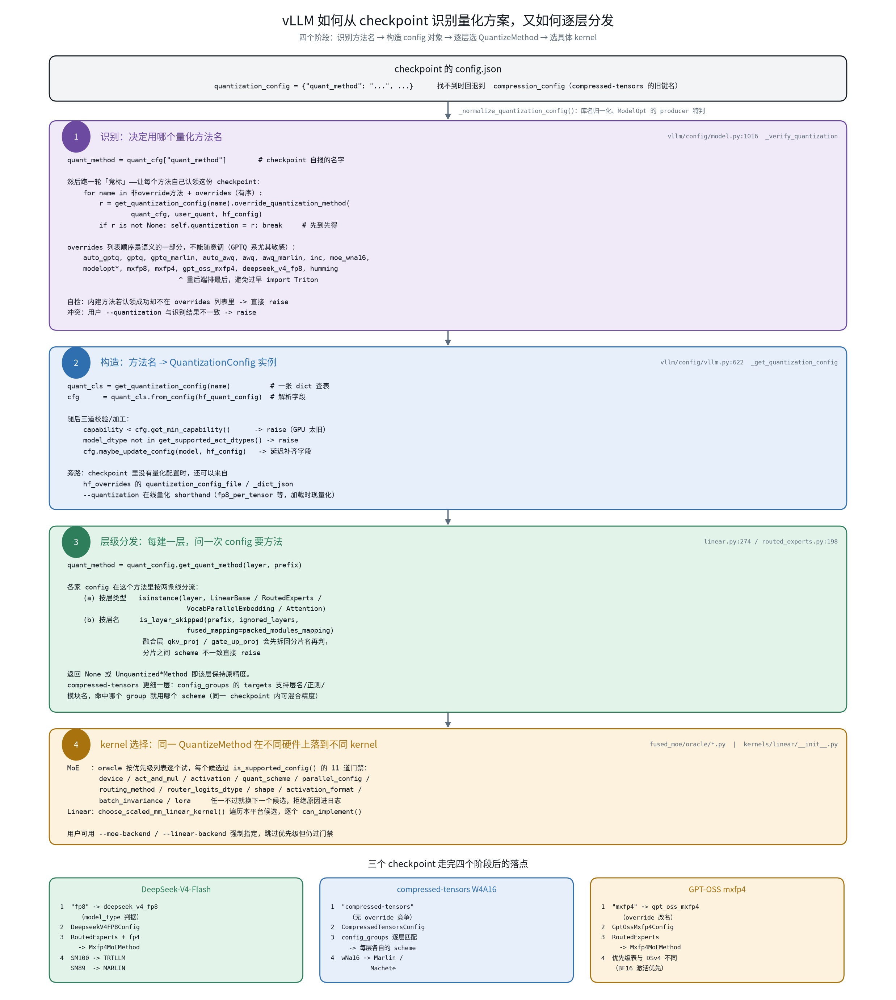

# 量化识别与分发

本文说明 vLLM 如何从 checkpoint 判断该用哪种量化方案，以及这个决定如何一路传递到具体的
CUDA kernel。

整条链是四个阶段，每个阶段的产物是下一阶段的输入：

```text
config.json  →  ① 方法名 (str)  →  ② QuantizationConfig 实例
             →  ③ 每层的 QuantizeMethod  →  ④ 具体 kernel
```

关键在于：**checkpoint 只决定前两个阶段，后两个阶段由层类型和硬件决定**。
同一个 checkpoint 在不同 GPU 上会落到完全不同的 kernel。



## 阶段 0：读出 `quantization_config`

`vllm/transformers_utils/model_arch_config_convertor.py:209`

```python
quant_cfg = getattr(config, "quantization_config", None)
if quant_cfg is None:
    quant_cfg = getattr(config, "compression_config", None)   # compressed-tensors 旧键名
```

这一步做三件归一化的事：

1. **回退键名**：`compression_config` 是 compressed-tensors 早期使用的键。
2. **ModelOpt 特判**：ModelOpt 导出的 checkpoint 不写 `quant_method`，而是写
   `producer.name == "modelopt"`，需要从 `quantization.quant_algo` 反推——
   `FP8` / `FP8_PER_CHANNEL_PER_TOKEN` / `FP8_PB_WO` → `modelopt`，`NVFP4` → `modelopt_fp4`，
   其余直接 raise。
3. **库名归一化**：`compressed_tensors`（下划线）统一成 `compressed-tensors`（连字符）。

多模态模型如果顶层没有，还会去 `text_config` 里再找一次。

## 阶段 1：识别——决定用哪个方法名

`vllm/config/model.py:1016` `_verify_quantization`

这一步不是读一下 `quant_method` 字段就完事，而是跑一轮**竞标**：让每个已注册的量化方法
自己判断「这份 checkpoint 是不是我的」。

```python
quant_method = quant_cfg["quant_method"]      # checkpoint 自报的名字

for name in 非override方法 + overrides:       # overrides 有严格顺序
    r = get_quantization_config(name).override_quantization_method(
            quant_cfg, user_quant, hf_config)
    if r is not None:
        self.quantization = r
        break                                  # 先到先得
```

`override_quantization_method` 的典型实现（`auto_awq.py:260`）：

```python
quant_method = hf_quant_cfg.get("quant_method", "").lower()
if quant_method != "awq":
    return None
is_valid_user_quant = user_quant is None or user_quant in (
    "awq", "awq_marlin", "auto_awq", "marlin")
if is_valid_user_quant:
    return cls.get_name()
return None
```

判据可以任意复杂。DeepSeek-V4 就同时看 `quant_method` 和 `model_type`，把通用的 `fp8`
劫持成专用配置：

```python
# vllm/models/deepseek_v4/quant_config.py:121
if not hf_quant_cfg.get("quant_method") in ("fp8", "deepseek_v4_fp8"):
    return None
if getattr(hf_config, "model_type", None) == "deepseek_v4":
    return "deepseek_v4_fp8"
```

### 三个容易忽略的设计细节

**`overrides` 列表的顺序是语义的一部分**。代码注释明确写了 "particularly important for
GPTQ"——GPTQ 系有 `auto_gptq` / `gptq` / `gptq_marlin` 三个候选，谁先认领就是谁。

**重后端刻意排在最后**。`mxfp4` / `gpt_oss_mxfp4` / `deepseek_v4_fp8` / `humming` 位于列表末尾，
注释说明是为了「避免在 override 探测期间产生不必要的 import（例如 MXFP4 会 import Triton）」。
这是一项启动时延优化。

**自定义方法的优先级高于所有内建 override**。通过 `register_quantization_config("my_quant")`
注册的方法会进入 `QUANTIZATION_METHODS`，但不在 `overrides` 列表里，因而落入「非 override 组」；
而这一组整体排在 `overrides` 之前：

```python
quantization_methods = [q for q in supported_quantization if q not in overrides]
quantization_methods = quantization_methods + overrides
```

此外还有两道保护：

- **自检**：内建方法若认领成功却不在 `overrides` 列表里，直接 raise。这是防止新增方法时
  忘记维护顺序。
- **冲突检查**：用户 `--quantization` 指定的方法与识别结果不一致时 raise。

## 阶段 2：构造——方法名变成配置对象

`vllm/config/vllm.py:622` `_get_quantization_config`

```python
quant_cls = get_quantization_config(name)          # 一张 dict 查表
cfg = quant_cls.from_config(hf_quant_config)       # 解析字段
```

查表在 `quantization/__init__.py:140`，约 25 个条目。注意映射不是一一对应的：
`awq` / `awq_marlin` / `auto_awq` 都指向 `AutoAWQConfig`；`mxfp8` 既是 checkpoint 方法名
（映射到 `ModelOptMxFp8Config`），也是在线量化 shorthand。

构造完跑三道校验与加工：

```python
capability < quant_config.get_min_capability()        # → raise，GPU 太旧
model_config.dtype not in get_supported_act_dtypes()  # → raise
quant_config.maybe_update_config(model, hf_config)    # → 延迟补齐字段
```

`get_min_capability()` 这道检查发生在**任何层构造之前**，所以「启动就报能力不足」一定是
卡在这里，与具体模型结构无关。

### 三条旁路

checkpoint 里没有量化配置时，仍然可能走量化：

- `hf_overrides` 里的 `quantization_config_file` / `quantization_config_dict_json`，
  对应 `quant_cls.from_config_file()` / `from_config_dict_json()`。
- `--quantization fp8_per_tensor` 这类在线量化 shorthand，加载 bf16 权重时现场量化，
  不读 checkpoint 配置。
- `register_quantization_config` 注册的自定义方法。

## 阶段 3：层级分发——每建一层问一次

这是**同一个 checkpoint 内部实现混合精度**的地方。层在构造时主动去问配置对象：

```python
# vllm/model_executor/layers/linear.py:274
elif quant_method := quant_config.get_quant_method(self, prefix=prefix):
    self.quant_method = quant_method

# vllm/model_executor/layers/fused_moe/routed_experts.py:198
quant_method = quant_config.get_quant_method(self, prefix)
```

各家 config 在 `get_quant_method` 里按两条正交的线分流。

### (a) 按层类型

`isinstance` 判断，覆盖 `LinearBase` / `RoutedExperts` / `VocabParallelEmbedding` /
`ParallelLMHead` / `Attention` 几类。以 `Fp8Config.get_quant_method` 为例：

```python
if isinstance(layer, LinearBase):
    ...                                          # → Fp8LinearMethod 或在线量化版本
elif isinstance(layer, RoutedExperts):
    if self.store_dtype == "mxfp4":
        return Mxfp4MoEMethod(layer.moe_config)  # fp8 配置也可能路由到 mxfp4
    return Fp8MoEMethod(self, layer)
```

### (b) 按层名

```python
is_layer_skipped(prefix, ignored_layers, fused_mapping=packed_modules_mapping)
```

这里有个非平凡的地方：**融合层要先拆回分片名再判**。checkpoint 里是 `q_proj` / `k_proj` /
`v_proj` 三个独立张量，而 vLLM 建的是融合的 `qkv_proj`，所以要把 `qkv_proj` 展开成三个分片名
分别查 `ignored_layers`，**三个分片的结论不一致就直接 raise**，避免半量化半不量化的静默错误。

有些 checkpoint（如 block-FP8 的 Step-3.5-Flash）直接在 `modules_to_not_convert` 里写融合名，
所以函数会先尝试融合名的整体匹配，再退回分片展开。

返回 `None` 或 `Unquantized*Method` 就表示该层保持原精度。

### compressed-tensors 的额外一层

`CompressedTensorsConfig` 在层类型之上还有一层 scheme 匹配。`config_groups` 里每个 group
带一组 `targets`，可以是完整层名、正则、或 nn.Module 类名；`get_scheme` 逐层匹配，
命中哪个 group 就用哪个 scheme：

```python
# compressed_tensors.py:815
scheme_dict = self.get_scheme_dict(layer, layer_name)
weight_quant = scheme_dict.get("weights")
if weight_quant is None:
    return None                       # 回退到 UnquantizedLinearMethod
scheme = self._get_scheme_from_parts(weight_quant, input_quant, output_quant, ...)
self._check_scheme_supported(scheme.get_min_capability())   # 再查一次设备能力
```

这就是为什么一个 compressed-tensors checkpoint 里 attention 可以是 W8A8、MLP 是 W4A16。

## 阶段 4：kernel 选择——硬件说了算

到这里 checkpoint 的信息已经用完，剩下的完全由硬件和部署配置决定。

### MoE 侧：oracle

`vllm/model_executor/layers/fused_moe/oracle/` 下按量化类型各一个文件
（`fp8.py` / `nvfp4.py` / `mxfp4.py` / `mxfp8.py` / `int8.py` / `int_wna16.py` / `w4a8.py` …）。
每个 oracle 维护一张优先级列表，逐个候选过 `is_supported_config`。

这是一道 **11 项的门禁**（`modular_kernel.py:536`），任一项不满足就返回
`(False, reason)` 并换下一个候选：

| # | 检查 | 拒绝原因示例 |
| --- | --- | --- |
| 1 | `_supports_current_device()` | 当前设备不支持 |
| 2 | `is_act_and_mul` / `_supports_no_act_and_mul()` | 非门控 MLP（如 Nemotron-Nano） |
| 3 | `_supports_activation()` | 该激活函数不支持 |
| 4 | `_supports_quant_scheme()` | 权重/激活的 `QuantKey` 组合不支持 |
| 5 | `_supports_parallel_config()` | EP/DP/TP 组合不支持 |
| 6 | `_supports_routing_method()` | 路由方法不支持 |
| 7 | `_supports_router_logits_dtype()` | router logits dtype 不支持 |
| 8 | `_supports_shape()` | hidden dim 不满足对齐要求 |
| 9 | `activation_format()` | Standard / BatchedExperts 不匹配 |
| 10 | `_supports_batch_invariance()` | 开了 `VLLM_BATCH_INVARIANT` 但内核不保证 |
| 11 | `supports_lora()` | 启用了 LoRA 但内核不支持 |

被拒的 reason 会进 `logger.debug_once`，排查「为什么没走上我想要的 kernel」就靠它。

### Linear 侧

`choose_scaled_mm_linear_kernel`（`kernels/linear/__init__.py:504`）遍历本平台候选列表，
逐个 `can_implement()`，全部失败时把所有 `failure_reason` 拼起来报错。

### 用户强制

两侧都支持 `--moe-backend` / `--linear-backend` 强制指定。注意**强制只是跳过优先级排序，
门禁仍然要过**——指定一个当前硬件不支持的后端仍会失败，只是错误信息更直接。

## 三个实例对照

| | DeepSeek-V4-Flash | compressed-tensors W4A16 | GPT-OSS mxfp4 |
| --- | --- | --- | --- |
| ① 识别 | `"fp8"` + `model_type=deepseek_v4` → `deepseek_v4_fp8` | `"compressed-tensors"`，无人竞争 | `"mxfp4"` → override 改名 `gpt_oss_mxfp4` |
| ② 构造 | `DeepseekV4FP8Config` | `CompressedTensorsConfig` | `GptOssMxfp4Config` |
| ③ 层分发 | 按 `expert_dtype` 分流，fp4 → `Mxfp4MoEMethod` | `config_groups` 逐层匹配 scheme | → `Mxfp4MoEMethod` |
| ④ kernel | SM100 → TRTLLM，SM89 → Marlin | wNa16 → Marlin / Machete | 优先级表与 DSv4 不同，BF16 激活优先 |

注意后两列：**GPT-OSS 和 DeepSeek-V4 在阶段 ③ 汇合到同一个 `Mxfp4MoEMethod`，
但阶段 ④ 用的是不同的优先级函数**——`_get_priority_backends_for_gpt_oss()` 把 BF16 激活变体
排在激活量化变体之前，而 DeepSeek-V4 走 `select_deepseek_v4_mxfp4_moe_backend`，
把 `FLASHINFER_TRTLLM_MXFP4_MXFP8` 排第一。同一个 method，不同的选型偏好。

## 排查切口

按阶段定位问题：

| 现象 | 看哪里 |
| --- | --- |
| 方法名不对 | `self.quantization` 的最终值；`overrides` 列表顺序 |
| 某层没被量化 / 不该被量化 | `is_layer_skipped` 的 `ignored_layers` 与 `packed_modules_mapping` |
| kernel 不是预期的 | oracle 的 `logger.debug_once(_make_log_unsupported(...))`，会打印每个候选被拒的原因 |
| 启动即报能力不足 | 阶段 ② 的 `get_min_capability()`，早于任何层构造 |
| 同一 checkpoint 换卡后结果变了 | 阶段 ④，前三阶段与硬件无关 |

## 参考

- [MoE kernel features](moe_kernel_features.md)
- [Fused MoE modular kernel](fused_moe_modular_kernel.md)
- [DeepSeek-V4 MoE 量化推理路径分析](deepseek_v4_moe_mxfp4.md) — 一个完整实例，
  含 MXFP4 与 NVFP4 的格式辨析
