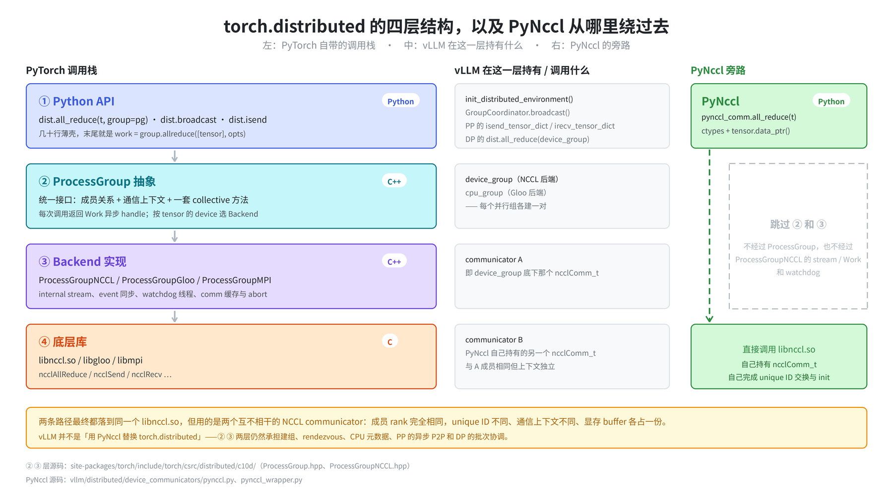
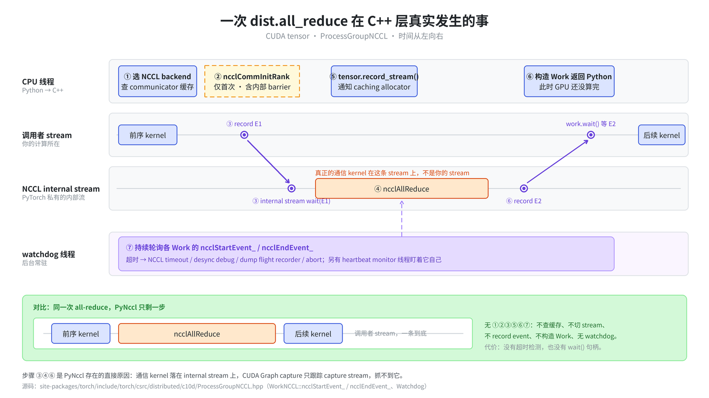
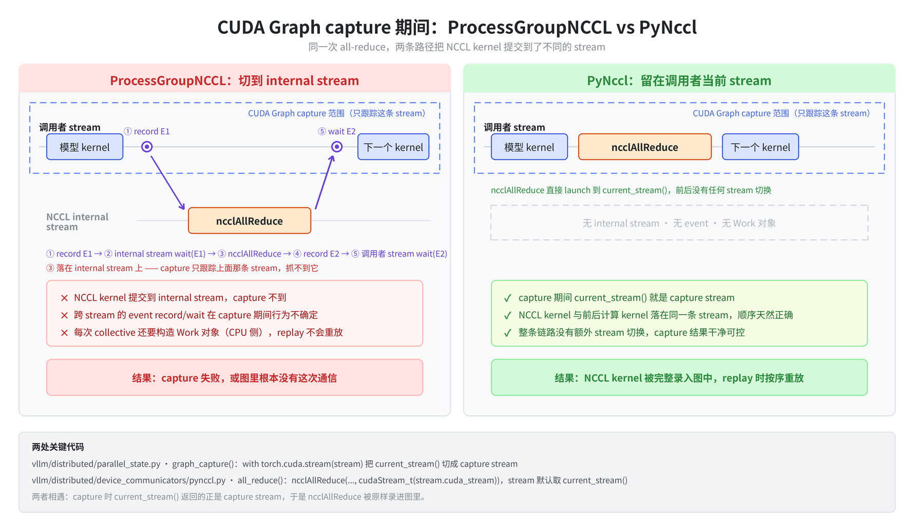
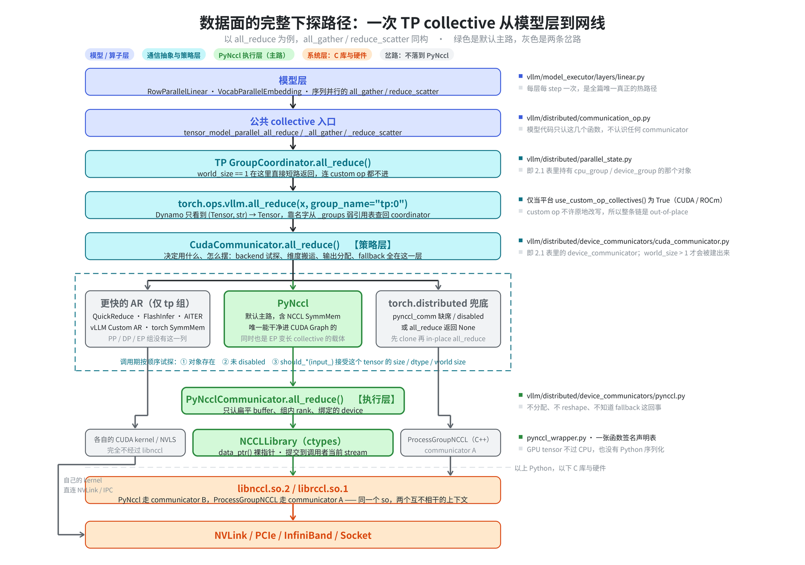
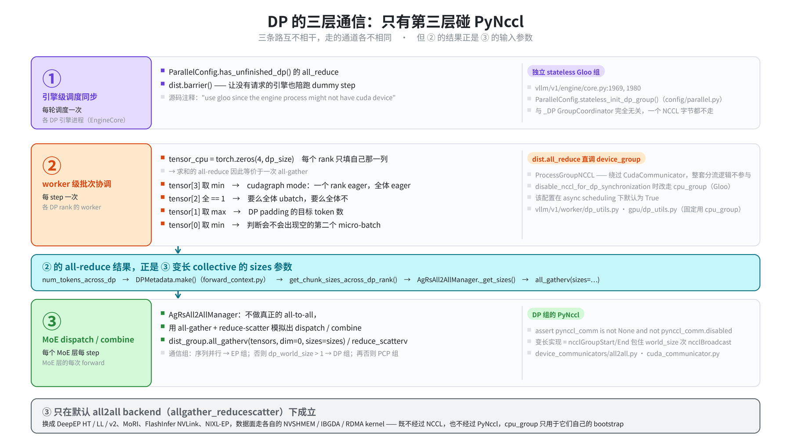
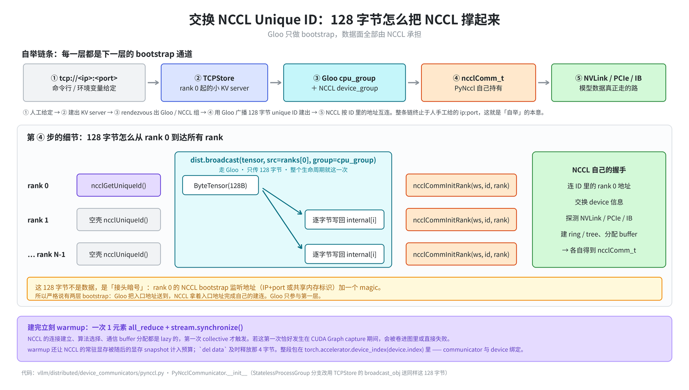
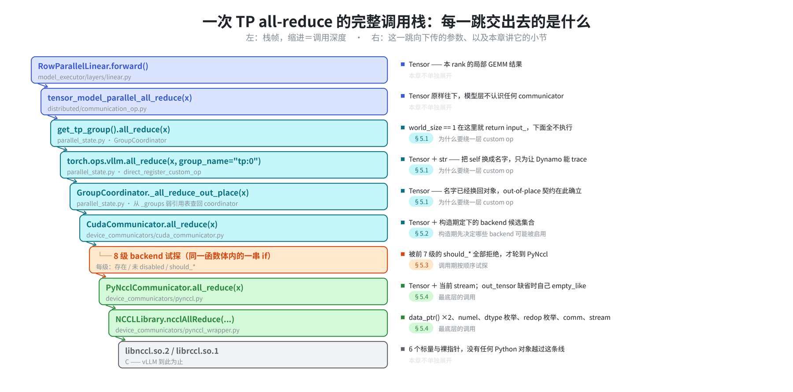
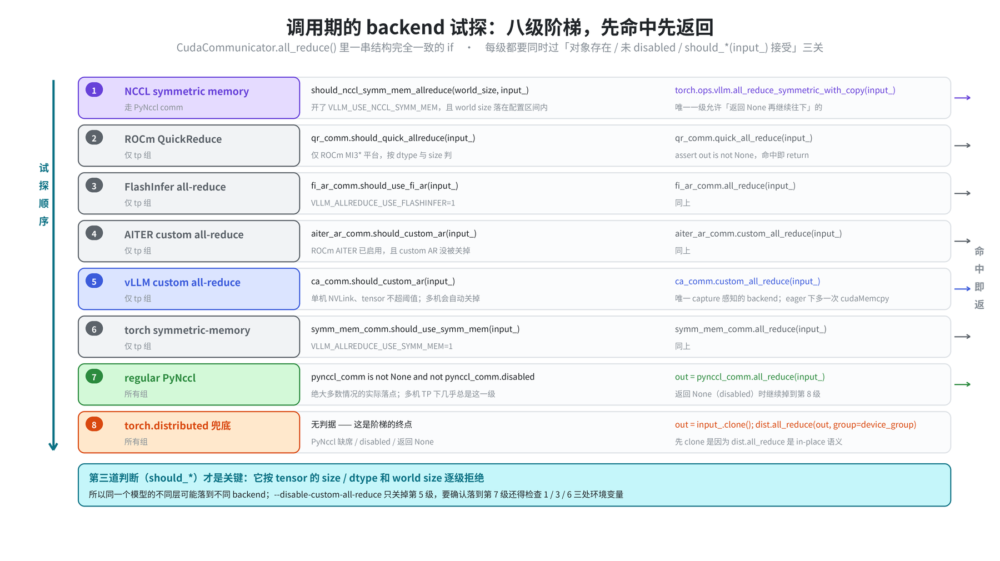
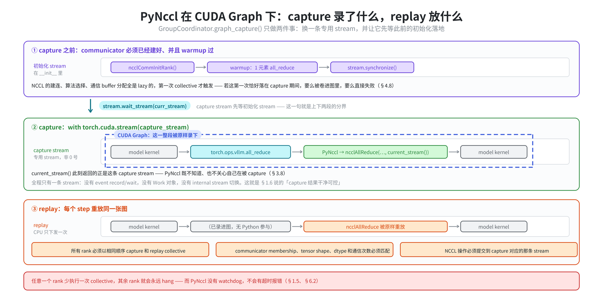

# vLLM 分布式通信：PyNccl 与 torch.distributed 的分工

本文回答一个问题：**vLLM 里每一次分布式通信，最终落在哪条通信栈上，为什么。**

vLLM 同时持有两套 NCCL 通道——PyTorch 的 `ProcessGroupNCCL`，以及 vLLM 自己用 `ctypes` 直接封装 NCCL C API 的 PyNccl。两者并存不是历史包袱，是 CUDA Graph 逼出来的分工。PyNccl 使用 Gloo 或 TCPStore 完成 communicator 的 bootstrap，但 GPU tensor 的数据传输由 NCCL 完成，不经过 Gloo 或 Python 序列化。

!!! note
    PyNccl 与 PyTorch NCCL ProcessGroup 同时存在，并不会替换整个 `torch.distributed` 通信层。

## 摘要

**一句话结论**：`torch.distributed` 负责建组、rendezvous 和 CPU 元数据；PyNccl 接管能进 CUDA Graph 的热点数据面（TP 的 collective、EP 默认后端的变长 collective）；而 PP 的 hidden states 传递和 DP 的批次协调仍然由 `ProcessGroupNCCL`（或 Gloo）承担。

| 通信 | 实际路线 |
| --- | --- |
| TP all-reduce / all-gather / reduce-scatter | custom AR / symm mem / **PyNccl**，兜底 `torch.distributed` |
| PP hidden states | **ProcessGroupNCCL** 的 `isend` / `irecv` |
| DP 批次协调 | **ProcessGroupNCCL** 直调 `dist.all_reduce`（可切 Gloo） |
| EP dispatch / combine | 默认后端走 **PyNccl** 变长 collective；DeepEP 等则完全不碰 NCCL |
| CPU 元数据、barrier、bootstrap | **Gloo** |

完整版见 [3.7 判定表](#37-判定表)。

**三条最容易误解的结论**：

1. **建了 PyNccl ≠ 走 PyNccl。** 每个并行组都持有一个 PyNccl communicator，但 DP 的批次协调直接调 `torch.distributed` 绕开了它，而 DP 组的 PyNccl 反倒是被 EP 的默认 all2all 后端借用的（[2.4](#24-这些对象什么时候才存在)、[3.5](#35-ep取决于-all2all-backend)）。
2. **CUDA Graph 是 PyNccl 的设计理由，不是它的启用条件。** `--enforce-eager` 下 PyNccl 照常工作，通信层里根本没有 cudagraph 相关的判断（[3.8](#38-常见误解eager-模式下-pynccl-仍然生效)）。
3. **`VLLM_DISABLE_PYNCCL=1` 不等于全部退回 `torch.distributed`。** 只有 `all_reduce` 等少数操作有 fallback，其余路径直接 assert（[6.2](#62-fallback-行为并不一致)）。

## 阅读路线

| 你的处境 | 从哪读 |
| --- | --- |
| 只想知道我的通信到底走哪条路 | [第三章](#三结论每一类通信实际走哪条路)，一章即可，前两章可跳 |
| 没接触过 `torch.distributed` | [第一章](#一背景为什么不能只用-torchdistributed)，尤其 1.1–1.3 |
| 想知道这套东西由哪些对象组成 | [第二章](#二总体设计四个对象及其关系) |
| 要改通信相关代码 | 全篇，重点 [第四章](#四初始化从-ipport-到可用的-communicator)、[第五章](#五运行时一次-tp-all-reduce-的完整路径) |
| 查某个 collective 怎么实现的 | [附录 A](#附录-a各-collective-的实现细节) |
| 排查 hang / OOM / capture 失败 | [第六章](#六边界与限制) 和 [3.8](#38-常见误解eager-模式下-pynccl-仍然生效) |
| 只想查代码在哪个文件 | [附录 D](#附录-d代码位置速查索引) |
| 遇到不认识的术语 | [附录 C](#附录-c术语表) |

---

## 一、背景：为什么不能只用 torch.distributed

`torch.distributed`、PyTorch NCCL ProcessGroup 和 PyNccl 属于不同层次，混在一起谈很容易错位。

本章先把 PyTorch 自带的那套讲清楚——它是什么、一次 collective 在 C++ 层到底做了多少事——再指出其中哪几件事和 CUDA Graph 冲突。**PyNccl 存在的全部理由都在这一章。**

### 1.1 torch.distributed 的分层与 ProcessGroup

PyTorch 自带的分布式包本身是分层的。下图左侧是这四层，中间是 vLLM 在每一层持有或调用的东西，右侧是 PyNccl 的旁路——**全文的结构性认知都在这一张图里**：

<p align="center">
    
</p>

从上往下读四层：`dist.all_reduce()` 这类 Python 调用（①）只是薄壳，转手交给 C++ 的 `ProcessGroup` 抽象（②）；②按 tensor 的 device 选一个 Backend 实现（③）；③再去调 `libnccl.so` / `libgloo` 的 C API（④）。

**关键是右侧那条绿色虚线：PyNccl 从 ① 直接跳到 ④，把 ② 和 ③ 整个跳过去了。** 它自己用 `ctypes` 加载 `libnccl.so`、自己持有 `ncclComm_t`，因此也就得不到 ② 的 `Work` 句柄和 ③ 的 internal stream / watchdog——这既是它的代价，也正是它能进 CUDA Graph 的原因（[1.6](#16-冲突点cuda-graph)）。

中间一列说明了另一件容易误解的事：**vLLM 在这四层里都有对应物，并没有"用 PyNccl 替换掉 torch.distributed"。** `init_distributed_environment()` 建 WORLD、`new_group()` 切子组、PP 的 `isend_tensor_dict`、DP 的批次协调 all-reduce，全都仍然走 ① → ② → ③ 这条主路。两条路径最终落到同一个 `libnccl.so`，但用的是两个互不相干的 communicator（[2.1](#21-每个并行组持有什么)）。

需要先建立的两个认知：

- **第 ② ③ 层整个是 C++**，源码在 `torch/csrc/distributed/c10d/`（安装包里可以直接看到头文件：`site-packages/torch/include/torch/csrc/distributed/c10d/ProcessGroup.hpp`、`ProcessGroupNCCL.hpp`），通过 pybind11 暴露给 Python。第 ① 层的 `dist.all_reduce()` 只是几十行 Python 薄壳，末尾就是 `work = group.allreduce([tensor], opts)`。
- **`init_process_group()` 的第一件事不是建 NCCL communicator，而是建一个 Store**（默认 `TCPStore`，rank 0 起一个小 KV server），所有 rank 通过它做 rendezvous。`new_group()` 复用 WORLD 的 store，但**它是集合调用——所有 rank 都必须执行，哪怕自己不在这个子组里**。[4.3](#43-创建模型并行组) 里那个「对全部子组遍历 `new_group`」的循环就是这个原因。

### 1.2 ProcessGroup 封装了什么

即 `torch.distributed.new_group(ranks, backend="nccl")` 返回的对象，在 vLLM 中保存为 `GroupCoordinator.device_group`。

**ProcessGroup 是「一组进程 + 一个通信上下文」的句柄**，封装三样东西：

1. **成员关系**——哪些 global rank 属于这个组、本进程在组内排第几（`pg.rank()` / `pg.size()`）。
2. **通信上下文**——对 NCCL 后端来说就是一个 `ncclComm_t`。*两个成员完全相同的 ProcessGroup，底下也是两个互不相干的 NCCL communicator，消息不会串*，这正是 [2.1](#21-每个并行组持有什么) 里 communicator A / B 能共存的原因。
3. **一套 collective 方法**——`allreduce()`、`broadcast()`、`send()` 等，每个返回一个 `Work`。

它不是 Python 类，可以直接验证：

```python
>>> from torch._C._distributed_c10d import ProcessGroup   # torch._C 即 C++ 扩展模块
>>> [m for m in dir(ProcessGroup) if not m.startswith('_')]
['BackendType', 'GLOO', 'NCCL', ..., 'allreduce', 'allgather', 'broadcast', 'send', 'recv',
 'reduce_scatter', 'alltoall', 'barrier', 'abort', 'rank', 'size', 'split_group', ...]
```

**ProcessGroup 和 Backend 是两层**：前者是前台对象，可以挂多个 Backend（CPU tensor 走 Gloo backend，CUDA tensor 走 NCCL backend），`ProcessGroupNCCL` 是后者。`dist.get_backend(group)` 返回的 `"nccl"` / `"gloo"` 字符串问的就是这个——[1.7](#17-pynccl-的定位) 里 PyNccl 那句断言用的正是它。

### 1.3 一次 dist.all_reduce 在 C++ 层真实发生的事

这是理解「PyNccl 为什么要另起一套」的核心。以 CUDA tensor 为例：

| 步骤 | `ProcessGroupNCCL` 做的事 |
| --- | --- |
| 1 | 按 tensor 的 device 选到 NCCL backend，查 communicator 缓存 |
| 2 | **首次调用才真正 `ncclCommInitRank`**（lazy init，还带一次内部 barrier） |
| 3 | 在调用者 stream 上 record 一个 CUDA event，让 NCCL **internal stream** wait 这个 event |
| 4 | 把 `ncclAllReduce` launch 到 **internal stream**（不是调用者的 stream） |
| 5 | 对 tensor 调 `record_stream()`，告知 caching allocator 这块显存还被另一条 stream 引用 |
| 6 | 在 internal stream 上 record 结束 event，包进 `Work` 对象返回 |
| 7 | 后台 watchdog 线程持续轮询这些 event，超时则报 NCCL timeout / dump flight recorder / abort |

把这七步铺到时间轴上：

<p align="center">
    
</p>

图上有四条泳道，对着它读这张表：

- **CPU 线程**（最上）承担 ①②⑤⑥。注意 ⑥ 的位置——`Work` 对象在 GPU 还没算完时就已经返回 Python 了，这就是下面 [Work 与异步语义](#14-work-与异步语义) 说的「返回 ≠ 完成」。
- **两条 stream 泳道**是整张图的重点。你的计算在上面那条，而 ④ 真正的 `ncclAllReduce` 落在下面那条 **internal stream** 上，两条之间靠 ③ 和 ⑥ 的两个 event 建立先后依赖：调用者 stream record E1 → internal stream 等 E1 → 通信 → internal stream record E2 → `work.wait()` 时调用者 stream 再等 E2。
- **watchdog 线程**（最下）不在数据路径上，它只是持续轮询这些 event 判断有没有超时。
- **底部绿框是同一次 all-reduce 在 PyNccl 下的样子**：只有一条 stream、一个 kernel，①②③⑤⑥⑦ 全部消失。代价写在旁边——没有超时检测，也没有 `wait()` 句柄。

!!! note "internal stream 怎么理解"
    CUDA stream 是 GPU 上的一条任务队列：同一条 stream 里的 kernel 按提交顺序串行执行，不同 stream 之间默认并行、互不保证先后。**internal stream 就是 `ProcessGroupNCCL` 自己创建并私有持有的一条 CUDA stream**，专门用来跑 NCCL kernel，不是你提交计算 kernel 的那条。中文可以译作「内部流」「内部 CUDA 流」或「NCCL 专用流」——重点不在译名，而在「它是另一条队列」这件事。

    它存在的理由是**通信与计算重叠**：NCCL kernel 在自己的队列里跑，你的计算队列可以继续下发后续 kernel，两边只在必要处用 event 对齐。代价就是图里 ③⑥ 那两次跨 stream 的 event 同步——而这正是 CUDA Graph capture 抓不住它的原因（capture 只跟踪一条 stream）。

第 2 步是 [4.8](#48-warmup把-lazy-变成-eager) 里 warmup 存在的理由，第 3、4、6 步是 [1.6](#16-冲突点cuda-graph) 里 CUDA Graph capture 不干净的直接来源。

### 1.4 Work 与异步语义

```python
>>> from torch._C._distributed_c10d import Work
>>> [m for m in dir(Work) if not m.startswith('_')]
['block_current_stream', 'exception', 'get_future', 'is_completed', 'is_success',
 'result', 'source_rank', 'synchronize', 'wait']
```

!!! note
    `work.wait()` 通常**不是** CPU 阻塞等 GPU 完成，而是让调用者 stream 去 wait 那个结束 event——即把依赖关系插回你的 stream。真正的 CPU 阻塞只在 `blockingWait_` 模式或读取 tensor 值时才发生。

PP 就是冲着这个 handle 去的（[3.3](#33-pp主路径是-pytorch-processgroupnccl)）：`isend` 返回 `Work`，攒一批再统一 `wait()`，实现计算/通信重叠。PyNccl 给不了这个——它只把 kernel 塞进 stream，没有返回值。

### 1.5 ProcessGroupNCCL 额外扛的东西

除了发起通信，`ProcessGroupNCCL` 是个相当「重」的对象：internal stream + event 同步、watchdog 线程（超时检测 / desync debug / 心跳监控）、communicator 缓存与 `abort()`/`shutdown()` 生命周期、NCCL 错误转 C++ 异常、以及与 caching allocator 的 `record_stream` 协作。这些能力在训练场景很有价值，但对 vLLM 的推理热路径来说既用不上又挡了 CUDA Graph 的路。

vLLM 中仍直接使用它的路径包括 `GroupCoordinator.broadcast()`、PP 的 `send_tensor_dict()`/`recv_tensor_dict()`，以及 DP 的批次协调 all-reduce（[3.4](#34-dp三条互不相干的通信)）。

### 1.6 冲突点：CUDA Graph

主要原因是 CUDA Graph。`ProcessGroupNCCL` 在 collective 前后有 internal stream 切换、event record/wait 和 `Work` 对象创建，这些操作在 graph capture 期间要么无法被 capture，要么行为不确定；PyNccl 则把 `ncclAllReduce` 直接 launch 到调用者当前 stream，capture 结果干净可控。

<p align="center">
    
</p>

对着上图读这段话：

- **CUDA Graph capture 是「按 stream」进行的。** 图中蓝色虚线框就是 capture 的作用域——只有落在 capture stream 上的 kernel 会被录进图里。这是理解左右两边差别的唯一前提。
- **左边：`ProcessGroupNCCL` 把 `ncclAllReduce` 提交到了框外。** 它不会在调用者 stream 上直接下发 NCCL kernel，而是走 ①～⑤ 五步：在调用者 stream 上 record 事件 E1 → 让 internal stream 等 E1 → 把 `ncclAllReduce` launch 到 **internal stream** → record E2 → 让调用者 stream 等 E2。真正的通信 kernel（③）落在下面那条 internal stream 上，而 capture 只跟踪上面那条，于是通信要么进不了图，要么跨 stream 的 event 依赖在 capture 期间行为不确定。附带的 `Work` 对象是 CPU 侧的产物，graph replay 时根本不会被重放。
- **右边：PyNccl 全程只有一条 stream。** `ncclAllReduce` 直接 launch 到 `current_stream()`，而 capture 期间 `current_stream()` 返回的正是 capture stream（[5.5](#55-这条路径在-cuda-graph-capture-下) 的 `with torch.cuda.stream(stream)`）。计算 kernel 和通信 kernel 排在同一条 stream 上，先后顺序天然正确，整段被原样录进图中。

次要原因是切换 NCCL 版本只需修改 `VLLM_NCCL_SO_PATH`，不需要重新编译 C++ binding。

两者逐项对照：

| | `ProcessGroupNCCL` | PyNccl |
| --- | --- | --- |
| 实现语言 | C++（编译进 libtorch） | Python + `ctypes` |
| kernel 提交到 | **internal stream**，再用 event 同步回调用者 stream | **调用者当前 stream** |
| 返回值 | `Work`，可 `wait()` | 无（只是 enqueue） |
| 超时 / watchdog | 有 | 无 |
| CUDA Graph capture | stream 切换 + event + `Work` 构造，capture 不干净 | 干净可 capture |
| 换 NCCL 版本 | 需重编 C++ | 改 `VLLM_NCCL_SO_PATH` |

第 2 行是根本原因：CUDA Graph capture 要求操作落在被 capture 的那条 stream 上，而 PyNccl 直接 launch 到 `current_stream()`，capture 期间那条 stream 恰好就是 capture stream（[5.5](#55-这条路径在-cuda-graph-capture-下)）。

#### 反问：既然 PyNccl 这么干净，为什么不全用它

这张表和 [1.3](#13-一次-distall_reduce-在-c-层真实发生的事) 的七步很容易读出一个反向结论——PyNccl 处处更优，ProcessGroup 是纯负担。**这是误读：那七步不是「开销」，是「功能」。PyNccl 只剩一步，是因为它把这些功能全放弃了。**

| [1.3](#13-一次-distall_reduce-在-c-层真实发生的事) 的步骤 | 提供的能力 | 谁在用 | PyNccl 的处境 |
| --- | --- | --- | --- |
| ② comm 缓存 + lazy init | 自动管理 communicator 生命周期 | 所有路径 | 自己建、自己 abort，`destroy()` 还要处理自锁（[6.3](#63-资源回收)） |
| ③④⑥ internal stream + event | 通信与计算重叠 | 训练场景 | 没有，全靠调用者 stream 排队 |
| ⑥ `Work` 句柄 | **异步 + 可 `wait()`** | **PP 的 `isend_tensor_dict`** | 没有返回值，做不了 |
| ⑦ watchdog | **超时检测、desync debug、flight recorder** | 多机部署排障 | 没有，hang 了就永远 hang |
| ⑤ `record_stream` | 与 caching allocator 协作 | 跨 stream 场景 | 不需要（因为它不跨 stream） |

中间两行是硬需求，不是偏好。除此之外还有四条更根本的理由：

1. **PyNccl 的存在依赖 ProcessGroup。** 上面那句断言要求传入一个**非 NCCL 的组**来广播 unique ID。没有 `torch.distributed` 先把 WORLD 和 Gloo 子组建起来，PyNccl 根本造不出来（[4.7](#47-交换-nccl-unique-id)）。**「只用 PyNccl」这个选项不存在。**
2. **PyNccl 只能做 GPU，而很多通信本来就不在 GPU 上。** CPU 元数据、`broadcast_object`、`barrier()`，以及 DP 引擎级协调——那些引擎进程可能根本没有 CUDA 设备（源码注释：`use gloo since the engine process might not have cuda device`）。这些只能走 Gloo，而 Gloo 只能通过 ProcessGroup 用。
3. **PP 需要 `Work` 句柄**攒一批再统一 `wait()`（[3.3](#33-pp主路径是-pytorch-processgroupnccl)）。注意区分：`CudaCommunicator.send/recv` 那条**单 tensor 阻塞**路径是优先 PyNccl 的，需要 ProcessGroupNCCL 的是**异步批量**那条。
4. **多平台与生态。** CPU、XPU、out-of-tree platform 各有自己的 communicator；`torch.compile` 的 functional collectives、外部 launcher、Ray 也都建立在 ProcessGroup 之上。PyNccl 只覆盖 CUDA / ROCm。

**复杂度是守恒的。** PyNccl「干净」的代价是责任转移给了调用方——out-of-place 语义、`movedim` / `contiguous` 维度搬运、backend fallback、device 一致性 assert，全部在 `CudaCommunicator` 那一层重新补了一遍（[2.3](#23-cudacommunicator-与-pynccl策略层-vs-执行层)）。整体复杂度没有消失，只是搬了家。加上 PyNccl 是手写 ctypes 绑定、符号对不上就是段错误，而 `ProcessGroupNCCL` 由 PyTorch 维护并有 CI 覆盖——把整个通信层押在前者上并不划算。

**而收益只在热点路径上兑现**，因为调用频率差好几个数量级：

| 通信 | 频率 | 需要进 CUDA Graph | 用 PyNccl 的收益 |
| --- | --- | --- | --- |
| TP all-reduce | **每层每 step** | **是** | 巨大 |
| PP hidden states | 每 step 一次 | 否 | 忽略不计，且会丢掉 `Work` |
| DP 批次协调 | 每 step 一次 | 否 | 忽略不计 |
| CPU 元数据 | 启动时若干次 | 否 | 无（本来就不是 GPU 通信） |

对每 step 只跑一次的通信，省掉那几微秒的 `Work` 构造毫无意义，而失去 watchdog 是实打实的损失——多机 hang 住时没有超时报错，只能靠 `py-spy` 去猜。

!!! important
    结论不是「PyNccl 更好所以应该全用」，而是「PyNccl 在**一个特定维度**上更好，vLLM 只在那个维度真正吃紧的路径上用它」。那个维度是 CUDA Graph 兼容性，那条路径是 TP 每层的 all-reduce。上面对照表里只有第 2 行让 PyNccl 不可替代；「没有 `Work`」「没有 watchdog」两行**是它的短板而非优点**。

所以「不会替换整个 `torch.distributed` 通信层」的含义是：PyNccl 只接管了热点数据面（TP collective、EP 默认后端的变长 collective），进程组建立、CPU 元数据、broadcast、PP 异步 P2P 和 DP 批次协调仍然走 `torch.distributed`。详见[第三章](#三结论每一类通信实际走哪条路)。

### 1.7 PyNccl 的定位

vLLM 自己实现的一层：通过 `ctypes.CDLL` 加载 `libnccl.so.2`，声明 C 函数签名，然后用 `tensor.data_ptr()` 直接调用 `ncclAllReduce`。它完全绕过 PyTorch 的 C++ ProcessGroup 层，自己持有 `ncclComm_t`，自己完成 unique ID 交换和 `ncclCommInitRank()`。

因此 `PyNcclCommunicator` 明确断言 bootstrap group 不能是 NCCL group：

```python
assert dist.get_backend(group) != dist.Backend.NCCL, (
    "PyNcclCommunicator should be attached to a non-NCCL group."
)
# note: this rank is the rank in the group
self.rank = dist.get_rank(group)
self.world_size = dist.get_world_size(group)
```

传入的是 `cpu_group`（Gloo），只用于广播 128 字节的 unique ID。Gloo 只做 bootstrap，数据面全部由 NCCL 承担——「bootstrap」具体指什么、为什么非要一条带外通道不可，见 [4.7](#47-交换-nccl-unique-id)。

紧接着这段断言的两行 `self.rank` / `self.world_size` 已经埋下了后文的坑：它们取的是**组内 rank**，不是 global rank。所有 PyNccl collective 的 `src`/`dst`/`root` 参数都以此为准。

---

## 二、总体设计：四个对象及其关系

上一章回答了「为什么需要另起一套」。本章回答「这一套由哪些对象组成、它们怎么分工、什么条件下才存在」。

三个要点：每个并行组同时持有四个通信对象（2.1）；`CudaCommunicator` 和 PyNccl 是策略层与执行层的关系而不是继承（2.3）；这些对象并非总是存在，取决于该组的 world size（2.4）。

### 2.1 每个并行组持有什么

对同一批 rank，vLLM 实际上同时持有以下通信对象：

| 通信对象 | 类型 | 底层 | 用途 |
| --- | --- | --- | --- |
| `cpu_group` | `ProcessGroupGloo` | libgloo | CPU 元数据、unique ID 广播 |
| `device_group` | `ProcessGroupNCCL` | NCCL communicator A | broadcast、PP P2P |
| `device_communicator` | `CudaCommunicator` | —— | 运行时 backend 分流 |
| `pynccl_comm` | `PyNcclCommunicator` | NCCL communicator B | TP collective、CUDA Graph 路径 |

!!! important
    communicator A 和 B 是两个独立的 NCCL communicator：成员 rank 完全相同，但 unique ID 不同、通信上下文不同、显存 buffer 各占一份。

### 2.2 数据面的完整下探路径

<p align="center">
    
</p>

上图是模型层发起一次 TP collective 后一路下探到网络的完整路径，右侧标注了每一层的代码位置，其中三层对应 [2.1](#21-每个并行组持有什么) 表里的对象：`GroupCoordinator`、`device_communicator`（即 `CudaCommunicator`）、`pynccl_comm`。

**这条链只有一处分叉，就是 `CudaCommunicator`**——它上面的五层是纯粹的直线下探，下面则按 tensor 的属性分成三条互不相同的路：

- **上半段（蓝 → 青）是逐层剥离信息的过程。** 模型层只知道「我要 all-reduce」，公共入口把它翻译成一个组名，custom op 层把 `GroupCoordinator` 这个 Python 对象彻底藏起来、只留 `(Tensor, str) → Tensor` 给 Dynamo 看（[5.1](#51-为什么中间要绕一层-custom-op)），到 `CudaCommunicator` 手上时已经只剩「一个 tensor + 我是哪个组」。注意 `GroupCoordinator` 那一层的短路：`world_size == 1` 时直接原样返回，下面整段都不会执行，这正是 [2.4](#24-这些对象什么时候才存在) 里单卡「0 个 `CudaCommunicator`」的运行时表现。
- **中间虚线框是调用期的 backend 试探**，每一级都要同时过「对象存在 / 未 disabled / `should_*(input_)` 接受这个 tensor」三关（[5.3](#53-调用期按顺序试探)）。这里是原来那张线性图最容易骗人的地方：**Custom AR、SymmMem、PyNccl 是并列的候选，不是串联的三层**。左边那一列还只对名字含 `tp` 的组开放，PP / DP / EP 组的候选集合就只剩中间和右边两格（[5.2](#52-构造期先决定哪些-backend-可能被启用)）。
- **三条支路的终点并不相同。** 左边的更快 AR 走自己的 CUDA kernel 或 NVLS，**完全不经过 `libnccl.so`**，直接落到 NVLink / IPC 上（图左那条绕开 libnccl 的灰线）；右边的 `torch.distributed` 兜底最终也进 `libnccl.so`，但用的是 `device_group` 背后的 **communicator A**；只有中间那条绿色主路经 `PyNcclCommunicator` → `NCCLLibrary`（ctypes）落到 **communicator B**。两个 communicator 共用同一个 `.so`、成员 rank 完全相同，通信上下文却互不相干（[2.1](#21-每个并行组持有什么) 的 important）。
- **底部那条虚线是 Python 与 C 的分界。** 分界之上全是 Python：策略、维度搬运、fallback；分界之下 vLLM 只剩一个裸指针 `tensor.data_ptr()` 和一个 stream 句柄。PyNccl 的全部「薄」都体现在这一跳上——它不构造 `Work`、不切 internal stream，所以这一跳落在调用者当前 stream 上，也就能被 CUDA Graph 原样录进图里（[1.6](#16-冲突点cuda-graph)、[5.4](#54-最底层的调用)）。

### 2.3 CudaCommunicator 与 PyNccl：策略层 vs 执行层

两者是**组合关系（has-a），不是继承**。`pynccl_comm` 只是 `CudaCommunicator` 的一个成员，和 custom AR、QuickReduce、FlashInfer、symm-mem、all2all manager 并列：

```text
GroupCoordinator                    并行组的成员关系 + 公共 API
  └─ CudaCommunicator               DeviceCommunicatorBase 的子类
       ├─ pynccl_comm               PyNcclCommunicator
       ├─ ca_comm / qr_comm / fi_ar_comm / aiter_ar_comm / symm_mem_comm
       └─ all2all_manager
              ↓
       PyNcclCommunicator           只管把 ncclXxx 调下去
         └─ NCCLLibrary (ctypes)
              └─ libnccl.so
```

它由 `CudaCommunicator.__init__` 创建，也由 `CudaCommunicator.destroy()` 销毁。职责分工：

| | `CudaCommunicator` | `PyNcclCommunicator` |
| --- | --- | --- |
| 角色 | **策略层**：决定谁来干 | **执行层**：干活 |
| 选 backend | 是（`all_reduce` 的多级试探） | 不参与，被选中才被调用 |
| 维度处理 | 是（`reshape` / `movedim` / `contiguous`） | 不做，只认扁平 buffer |
| 分配输出 tensor | 是（`torch.empty`） | 不分配，只往传进来的 buffer 里填 |
| fallback 到 `torch.distributed` | 是 | 不知道有这回事 |
| 知道自己是不是 TP 组 | 是（靠 `unique_name`） | 不知道，只认 rank / world_size / device |

一句话：**`CudaCommunicator` 决定「用什么、怎么摆」，PyNccl 决定「怎么调 NCCL」。**

#### 同名方法的三处语义差异

```python
# CudaCommunicator：返回新 tensor，有 dim 语义
def all_gather(self, input_, dim=-1) -> torch.Tensor:
    output_tensor = torch.empty(output_size, ...)        # ← 分配在这一层
    pynccl_comm.all_gather(output_tensor, input_.contiguous())
    output_tensor = output_tensor.reshape(...)           # ← 维度搬运也在这一层
    return output_tensor.movedim(0, dim).reshape(...)

# PyNccl：out-param 风格，无返回值，无 dim 概念
def all_gather(self, output_tensor, input_tensor, stream=None):
```

1. **分配责任在上层**——PyNccl 从不 `torch.empty`（`all_reduce` 是唯一例外，不传 `out_tensor` 时自己 `empty_like`）。
2. **`dim` 只存在于上层**——NCCL 眼里只有连续 buffer、rank 维恒在第 0 维，所有 `movedim` / `contiguous` 都是 `CudaCommunicator` 补的（见 [附录 A](#附录-a各-collective-的实现细节)）。
3. **disabled 只有一条信号**——`PyNccl.all_reduce` 在 disabled 时返回 `None`，上层靠这个 `None` 触发 fallback；其余方法静默 `return`，上层拿不到提示，所以那些路径干脆写成 `assert pynccl_comm is not None`（见 [6.2](#62-fallback-行为并不一致)）。

#### 数量关系与依赖方向

- 一个 `CudaCommunicator` **最多持有 1 个** PyNccl comm；一个进程有**多个** `CudaCommunicator`（每个并行组一个），因而有多个独立的 `ncclComm_t`。
- 依赖是**单向**的：`PyNcclCommunicator` 不知道 `CudaCommunicator` 的存在，它的构造只需要「一个非 NCCL 的 bootstrap group + 一个 device」。所以它可以被绕过 `CudaCommunicator` 直接复用——权重传输自己新建一个（`weight_transfer/nccl_common.py`），EPLB 则从 EP 组的 device communicator 上把现成的借出来用（`eplb/eplb_communicator.py`）。

### 2.4 这些对象什么时候才存在

`world_size` 不是全局值，而是**本 rank 所属的那个子组的成员数**：

```python
for ranks in group_ranks:
    if self.rank in ranks:
        self.ranks = ranks
        self.world_size = len(ranks)          # ← 就是这个
        self.rank_in_group = ranks.index(self.rank)
```

`group_ranks` 由 `initialize_model_parallel` 里那个 `ExternalDP x DP x PP x PCP x TP` 的五维 reshape 切出来，所以**每个组的 world size 一一对应一个配置项**：

| 组 | `world_size` 等于 | `> 1` 的条件 |
| --- | --- | --- |
| `tp` | `tensor_parallel_size` | `-tp N`，N > 1 |
| `dcp` | `decode_context_parallel_size or 1` | `--decode-context-parallel-size N` |
| `pcp` | `prefill_context_parallel_size` | `--prefill-context-parallel-size N` |
| `pp` | `pipeline_parallel_size` | `-pp N`，N > 1 |
| `dp` | `data_parallel_size` | `-dp N`，N > 1 |
| `ep` | `dp × pcp × tp`（**乘积**） | 三者乘积 > 1，且模型是 MoE |
| `eplb` | 同 `ep` | 同上，且 `--enable-eplb` |

注意 `ep` 那行：建组**不看 `--enable-expert-parallel`**，只要 `model_config.is_moe` 就建，而组的大小是 DP×PCP×TP 的乘积。所以 `-tp 8` 跑一个 MoE 模型，EP 组的 world size 就是 8。

!!! important
    `world_size == 1` 时并不是什么都不建——`device_group` 和 `cpu_group` 照样会被 `new_group` 创建出来，只是成员只有自己一个。被跳过的只有 `device_communicator` 这一步，连带 PyNccl 也不建。此时 `GroupCoordinator.all_reduce` 在开头就被 `if self.world_size == 1: return input_` 短路，根本走不到 `CudaCommunicator`。

常见启动配置下的实际情况：

| 启动方式 | tp | pp | dp | ep（MoE 模型） | 建了几个 `CudaCommunicator` |
| --- | --- | --- | --- | --- | --- |
| `vllm serve`（默认单卡） | 1 | 1 | 1 | 1 | **0 个**，全程没有 PyNccl |
| `-tp 8` | 8 | 1 | 1 | 8 | 2 个（tp、ep） |
| `-tp 4 -pp 2` | 4 | 2 | 1 | 4 | 3 个（tp、pp、ep） |
| `-dp 4 -tp 1` | 1 | 1 | 4 | 4 | 2 个（dp、ep） |
| `-dp 2 -tp 4` | 4 | 1 | 2 | 8 | 3 个（tp、dp、ep） |

最后两行解释了一个可能反直觉的现象：**纯 DP、每个 rank 单卡（tp=1）的部署里照样有 PyNccl**，因为 DP 组和 EP 组的 world size 都是 4——这正是 [3.5](#35-ep取决于-all2all-backend) 里 EP 默认 all2all 后端借用 DP 组 PyNccl 的场景。

两个不受这条规则约束的组：`_WORLD` 和 `_INNER_DP_WORLD` 传的都是 `use_device_communicator=False`，哪怕 world size 是全局最大值也永远不建 `CudaCommunicator`。

!!! note
    DP 的各 rank 分属不同引擎进程，但它们加入的是**同一个 torch.distributed WORLD**：`init_distributed_environment` 在 `data_parallel_size > 1`（且不是 `external_launcher`）时把 world 扩成 `world_size_across_dp = pp × tp × pcp × dp`，并把本进程 rank 偏移 `dp_rank × world_size`。正因如此 `_DP` 这个 `GroupCoordinator` 才能横跨引擎进程，其 world size 就等于 `data_parallel_size`。

相关代码：

- `GroupCoordinator`、`initialize_model_parallel`、`init_distributed_environment`：[vllm/distributed/parallel_state.py](../../vllm/distributed/parallel_state.py)
- `world_size_across_dp`：[vllm/config/parallel.py](../../vllm/config/parallel.py)

---

## 三、结论：每一类通信实际走哪条路

**如果你只读一章，读这章。**

前两章说清了「PyNccl 是什么、由谁持有」。本章回答那个真正有实用价值的问题：**TP、PP、DP、EP 每一次实际通信，最终落在哪条栈上**。

想知道这些路线是怎么被选出来的，读完本章再回头看 [第五章](#五运行时一次-tp-all-reduce-的完整路径)；想知道这些对象是怎么建起来的，看 [第四章](#四初始化从-ipport-到可用的-communicator)。

### 3.1 三个前提

**前提一：每个组都有 PyNccl，但不代表每个组都用它。** [4.3](#43-创建模型并行组) 里的两次 `new_group` 对 TP、DCP、PCP、PP、DP、EP、EPLB **每一个**子组都执行，而 `CudaCommunicator` 只要 `world_size > 1` 就无条件建 PyNccl（[4.4](#44-创建-pynccl-communicator)）。所以 DP 组、EP 组同样各自持有一个 PyNccl communicator，区别只在于「哪条调用路径会去用它」。

**前提二：加速 backend 只对 TP 开放。** 即 [5.2](#52-构造期先决定哪些-backend-可能被启用) 的 `if "tp" not in unique_name`。DP、EP、PP 组的 all-reduce 候选集合只有 PyNccl 和 `torch.distributed` 两条。

**前提三：绕过 `GroupCoordinator` 就绕过了 PyNccl。** 有些调用点直接拿 `get_xx_group().device_group` 去调 `torch.distributed`，此时 `CudaCommunicator` 的整套分流逻辑根本不参与——DP 的批次协调就是典型（[3.4](#34-dp三条互不相干的通信)）。

### 3.2 TP：唯一一条全程走 PyNccl（或更快 AR）的路线

CUDA 平台 `use_custom_op_collectives()` 返回 `True`（[vllm/platforms/cuda.py](../../vllm/platforms/cuda.py)），所以 TP collective 走 [5.1](#51-为什么中间要绕一层-custom-op) 的 custom op 一路下探到 [5.3](#53-调用期按顺序试探) 的 backend 分流。`all_gather` / `reduce_scatter`（序列并行）同理。

但 TP 组里仍有不走 PyNccl 的操作：

- **`GroupCoordinator.broadcast()`** 直接调用 `torch.distributed`，**完全不进** `CudaCommunicator`：

```python
def broadcast(self, input_: torch.Tensor, src: int = 0):
    """Broadcast the input tensor.
    NOTE: `src` is the local rank of the source rank.
    """
    assert src < self.world_size, f"Invalid src rank ({src})"
    if self.world_size == 1:
        return input_
    torch.distributed.broadcast(input_, src=self.ranks[src], group=self.device_group)
    return input_
```

注意 `self.ranks[src]`——这里又出现一次组内 rank 到 global rank 的转换。用的是 `device_group`，即 [2.1](#21-每个并行组持有什么) 的 communicator A。

- **元数据 / object / tensor dict** 走 Gloo `cpu_group` 或 `mq_broadcaster`。
- **`barrier()`** 刻意用 `cpu_group`，源码注释说明原因：NCCL barrier 内部是一次偷偷创建 GPU tensor 的 broadcast，容易搞乱 current device。

### 3.3 PP：主路径是 PyTorch ProcessGroupNCCL

V1 的 PP hidden states 使用 `get_pp_group().isend_tensor_dict()` / `irecv_tensor_dict()`（调用点都在 [vllm/v1/worker/gpu_worker.py](../../vllm/v1/worker/gpu_worker.py)，实现在 `parallel_state.py`），实现里是：

```python
group = self.device_group          # ProcessGroupNCCL
metadata_group = self.cpu_group    # Gloo
...
comm_group = metadata_group if tensor.is_cpu else group
handle = torch.distributed.isend(tensor, dst=self.ranks[dst], group=comm_group)
```

用 `ProcessGroupNCCL` 而不是 PyNccl 的原因很实际：这里需要 `Work` 句柄做异步 `wait()`，而 PyNccl 只 enqueue、不返回 handle（见 [5.4](#54-最底层的调用)）。

!!! warning
    容易混的一点：`GroupCoordinator.send()` / `recv()`（单 tensor 阻塞版）走的是 `CudaCommunicator.send/recv`，那里**优先 PyNccl**，不可用才退回 `torch.distributed.send/recv`。PP 前向用的是前者（tensor dict / ProcessGroupNCCL），不是后者。

接收端如果启用了 TP slice 优化，会在 P2P 接收后调用 TP all-gather；这一段 all-gather 仍可能走 PyNccl。

### 3.4 DP：三条互不相干的通信

DP 是最容易误解的维度，它实际有三层，只有第三层碰 PyNccl：

<p align="center">
    
</p>

读这张图先看**左边一列的「参与者」**——三层根本不是同一批进程/对象在通信，这是它们互不相干的原因：

| | 谁在通信 | 走哪条通道 | 频率 |
| --- | --- | --- | --- |
| ① | DP 引擎进程（`EngineCore`），可能连 CUDA 设备都没有 | 独立 stateless **Gloo** 组 | 每轮调度一次 |
| ② | 各 DP rank 的 worker | `dist.all_reduce` 直调 `device_group`（**ProcessGroupNCCL**，可切 Gloo） | 每 step 一次 |
| ③ | MoE 层的每次 forward | DP 组的 **PyNccl** 变长 collective | 每个 MoE 层每 step |

**中间那条青色横条是这张图的重点，也是原来那张树形图完全表达不出来的东西**：三层虽然通道各异，但 ② 的输出正是 ③ 的输入——`num_tokens_across_dp` 一路传到 `all_gatherv(sizes=…)` 的 `sizes` 参数上。所以 ② 自己虽然一个 PyNccl 都不碰，却是 ③ 那条 PyNccl 路径能跑起来的前提（[3.1](#31-三个前提) 的前提三在这里闭环）。

另外两处值得对着图记住的落差：

- **①② 都是「每 step 一次」量级，③ 是「每层每 step」量级**，相差好几个数量级。这解释了为什么只有 ③ 值得用 PyNccl，而 ①② 用 `Work` 构造更重的 `torch.distributed` 完全无所谓（[1.6 的反问](#反问既然-pynccl-这么干净为什么不全用它)）。
- **底部灰条是 ③ 的适用边界**：只有默认的 `allgather_reducescatter` backend 才走 DP 组的 PyNccl，换成 DeepEP / MoRI / FlashInfer / NIXL-EP，整个数据面连 NCCL 都不碰（[3.5](#35-ep取决于-all2all-backend)）。

下面按三层逐个展开。

**① 引擎级调度同步**用的是 `ParallelConfig.stateless_init_dp_group()`（[vllm/config/parallel.py](../../vllm/config/parallel.py)）建的 stateless gloo 组，源码注释写得很直白：`use gloo since the engine process might not have cuda device`。`EngineCore` 用它做 `has_unfinished_dp` 的 all-reduce 和 `dist.barrier`（[vllm/v1/engine/core.py](../../vllm/v1/engine/core.py)）。这条路一个 NCCL 字节都不走，也和 `_DP` `GroupCoordinator` 没有关系。

**② worker 级批次协调**直接调 `torch.distributed`，**绕过 `CudaCommunicator`**。核心是 `_run_ar()` 里那一次 all-reduce（[vllm/v1/worker/dp_utils.py](../../vllm/v1/worker/dp_utils.py)）：

```python
device, group = _get_device_and_group(parallel_config)     # device_group（NCCL）或 cpu_group（Gloo）
# Populate this rank's contribution on CPU to reduce GPU syncs.
tensor_cpu = torch.zeros(4, dp_size, dtype=torch.int32)
tensor_cpu[0][dp_rank] = orig_num_tokens_per_ubatch
tensor_cpu[1][dp_rank] = padded_num_tokens_per_ubatch
tensor_cpu[2][dp_rank] = 1 if should_ubatch else 0
tensor_cpu[3][dp_rank] = cudagraph_mode
tensor = tensor_cpu.to(device, non_blocking=True)
dist.all_reduce(tensor, group=group)
```

注意这个技巧：**每个 rank 只填自己那一列、其余全 0，求和的 all-reduce 因此等价于一次 all-gather**。

#### 同步了哪三件事

`_synchronize_dp_ranks` 拿到这个 4×N 矩阵后逐行归约：

| 行 | 归约方式 | 得到什么 |
| --- | --- | --- |
| `tensor[3]` | **min** | 同步后的 cudagraph mode——**任何一个 rank 要跑 eager，全体跑 eager** |
| `tensor[2]` | **all == 1** | 是否 microbatch——**要么全体 ubatch，要么全体不** |
| `tensor[1]` | **max** | DP padding 的目标 token 数（仅当需要 padding 时） |
| `tensor[0]` | min | 用于判断 ubatch 会不会出现空的第二个 micro-batch |

#### 为什么必须同步

根子在于：**DP rank 各自独立调度请求，但 MoE 层的 EP collective 是跨 DP 组的**。

1. **collective 要求全员参与。** EP 的 dispatch/combine 走的是 DP 组的 `all_gatherv` / `reduce_scatterv`（[3.5](#35-ep取决于-all2all-backend)）。哪怕某个 DP rank 这一步没有请求，它也必须进 forward 跑一个 dummy，否则其余 rank 会永远等它。
2. **CUDA Graph 的形状必须一致。** 一个 rank replay 256 token 的图、另一个 replay 128 token 的，图里那次 EP collective 就对不上。所以 cudagraph mode 取 min、token 数取 max 后统一 padding。
3. **microbatching 改变了每步发出的 collective 次数。** 一半 rank ubatch、一半不 ubatch，调用序列直接错配。

#### 结果流向哪里

即本节开头那张图中间的青色横条：

```text
dist.all_reduce(num_tokens_across_dp)
  → DPMetadata.make()                        forward_context.py
  → get_chunk_sizes_across_dp_rank()         AgRsAll2AllManager._get_sizes
  → get_dp_group().all_gatherv(sizes=…)      PyNccl
```

**这次 all-reduce 的结果，正是后面 EP 变长 collective 的 `sizes` 参数。** 所以它自己虽然不走 PyNccl，却是 PyNccl 那条路能跑起来的前提——[3.1](#31-三个前提) 的前提三在这里形成闭环。

#### Gloo 开关

```python
if parallel_config.disable_nccl_for_dp_synchronization:
    device = "cpu"
    group = get_dp_group().cpu_group         # 改走 Gloo
```

配置项在 [vllm/config/parallel.py](../../vllm/config/parallel.py)，注释写明**开启 async scheduling 时默认为 True**：这个 tensor 算完要读回 CPU（`.item()`），走 GPU 会引入同步点，伤害异步调度的流水。新的 [vllm/v1/worker/gpu/dp_utils.py](../../vllm/v1/worker/gpu/dp_utils.py) 干脆固定用 `cpu_group`。

调用点分布在 `gpu_model_runner.py`（主路径）、`forward_context.py`（没人提前算过时兜底补一次）、以及投机解码的几条路径。

**③ MoE dispatch/combine** 才是 DP 组 PyNccl 的真正使用者，见 [3.5](#35-ep取决于-all2all-backend)。

### 3.5 EP：取决于 all2all backend

PyNccl 不实现 all-to-all，MoE token dispatch/combine 统一进入 `All2AllManager`。manager 只对名字是 `ep` 的组创建（[vllm/distributed/device_communicators/base_device_communicator.py](../../vllm/distributed/device_communicators/base_device_communicator.py)）：

```python
self.is_ep_communicator = unique_name.split(":")[0] == "ep"
self.use_all2all = self.is_ep_communicator and use_ep
```

默认 backend 是 `allgather_reducescatter`（[vllm/config/parallel.py](../../vllm/config/parallel.py)），对应 `AgRsAll2AllManager`。它并不做真正的 all-to-all，而是用 all-gather + reduce-scatter 模拟，并且**通信组通常不是 EP 组**：

```python
def _get_comm_group(self, is_sequence_parallel):
    if is_sequence_parallel:
        return get_ep_group()
    if self.dp_world_size > 1:
        return get_dp_group()
    return get_pcp_group()
...
gathered_tensors = dist_group.all_gatherv(tensors_to_gather, dim=0, sizes=sizes)
```

`all_gatherv` 进入 `CudaCommunicator.all_gatherv`，那里是 `assert pynccl_comm is not None and not pynccl_comm.disabled`，用 [A.6](#a6-变长-collective) 的变长实现；combine 对称走 `reduce_scatterv`。

!!! important
    默认 EP 路线的实际承载者是 **DP 组（或 sequence-parallel 时的 EP 组）的 PyNccl communicator**，而不是 EP 组的 all-reduce。这也是 DP 组那个「看起来没人用」的 PyNccl comm 的用武之地。

其余 backend（DeepEP HT / LL / v2、MoRI、FlashInfer NVLink one/two-sided、NIXL-EP）是各自的 NVSHMEM / IBGDA / RDMA / 专用 kernel 实现，**数据面完全不经过 NCCL，也不经过 PyNccl**，`cpu_group` 只用于它们自己的 bootstrap。backend 到 manager 的映射见 `CudaCommunicator.__init__`。

### 3.6 显式使用 PyNccl P2P / broadcast 的路径

以下路径会明确使用 PyNccl P2P 或 broadcast：

| 场景 | 相关代码 |
| --- | --- |
| Elastic EP 参数同步通过 batched `ncclSend/ncclRecv` 传输参数 | [vllm/distributed/elastic_ep/elastic_execute.py](../../vllm/distributed/elastic_ep/elastic_execute.py) |
| EPLB 的 PyNccl backend 使用指定 CUDA stream 和 NCCL group 批量传输专家权重 | [vllm/distributed/eplb/eplb_communicator.py](../../vllm/distributed/eplb/eplb_communicator.py) |
| Stateless coordinator 的 GPU broadcast/send/recv | [vllm/distributed/stateless_coordinator.py](../../vllm/distributed/stateless_coordinator.py) |
| Trainer 到 inference worker 的动态权重更新使用独立 `StatelessProcessGroup` 和 PyNccl broadcast | [vllm/distributed/weight_transfer/nccl_common.py](../../vllm/distributed/weight_transfer/nccl_common.py)、[vllm/distributed/weight_transfer/nccl_engine.py](../../vllm/distributed/weight_transfer/nccl_engine.py) |

### 3.7 判定表

| 通信 | 实际路线 | 代码 |
| --- | --- | --- |
| TP all-reduce / all-gather / reduce-scatter | custom AR / symm mem / **PyNccl**，兜底 `torch.distributed` | `CudaCommunicator.all_reduce` / `all_gather` / `reduce_scatter` |
| TP broadcast | **ProcessGroupNCCL**（`device_group`） | `GroupCoordinator.broadcast` |
| TP 元数据 / object / mq | Gloo `cpu_group` 或 shm MessageQueue | `GroupCoordinator.broadcast_object` 等 |
| PP hidden states（tensor dict） | **ProcessGroupNCCL** `isend` / `irecv` | `GroupCoordinator.isend_tensor_dict` |
| PP 单 tensor `send` / `recv` | **PyNccl** 优先，退回 torch P2P | `CudaCommunicator.send` / `recv` |
| DP 引擎级 `has_unfinished` / barrier | 独立 stateless **Gloo** 组 | `ParallelConfig.stateless_init_dp_group` |
| DP worker 级 num_tokens / cudagraph 同步 | **ProcessGroupNCCL** 直调 `dist.all_reduce`（可切 Gloo） | `vllm/v1/worker/dp_utils.py`、`vllm/v1/worker/gpu/dp_utils.py` |
| EP dispatch/combine（默认 `allgather_reducescatter`） | DP/EP 组的 **PyNccl** `all_gatherv` / `reduce_scatterv` | `AgRsAll2AllManager` |
| EP dispatch/combine（DeepEP / MoRI / FlashInfer / NIXL） | 各自 kernel，**不走 NCCL** | `CudaCommunicator.__init__` 的 backend 分支 |
| 所有组 `barrier()` | Gloo `cpu_group` | `GroupCoordinator.barrier` |
| PyNccl unique ID 交换 | Gloo（或 TCPStore） | [4.7](#47-交换-nccl-unique-id) |

一句话概括：**PyNccl 只接管了「进 CUDA Graph 的热点数据面」——TP 的 collective、EP 默认后端的变长 collective，以及少量显式 P2P / broadcast；进程组建立、PP 的异步 P2P、DP 的批次协调、所有 CPU 元数据，仍然是 `torch.distributed`（ProcessGroupNCCL 或 Gloo）。**

### 3.8 常见误解：eager 模式下 PyNccl 仍然生效

先澄清一个常见误解：**CUDA Graph 是 PyNccl 被写出来的理由（[1.6](#16-冲突点cuda-graph)），不是它被启用的条件。** `--enforce-eager` 不会让通信退回 `torch.distributed`。

代码上这两件事完全没有耦合：

```bash
$ grep -rn "enforce_eager\|cudagraph_mode" vllm/distributed/ --include=*.py
（无输出）
```

`enforce_eager` / `cudagraph_mode` 从来没有传进 `vllm/distributed/`，通信层根本不知道当前是不是 eager。具体到两个阶段：

- **创建阶段**只看 `world_size > 1`（`CudaCommunicator.__init__`），以及下面 [6.1](#61-disabled-的三种成因) 的三个 disabled 条件。
- **分发阶段**（[5.3](#53-调用期按顺序试探)）每一级的判据都是 `xx_comm is not None and not disabled and should_xxx(input_)`，而 `should_*` 看的是 tensor 的 nbytes、dtype 和 world size。**没有一处询问「现在是不是在 capture」。**

反倒是 vLLM 自己的 custom all-reduce 才是唯一「capture 感知」的 backend：

```python
def custom_all_reduce(self, input):
    """The main allreduce API that provides support for cuda graph."""
    if self.disabled or not self.should_custom_ar(input):
        return None
    if self._IS_CAPTURING:
        if torch.cuda.is_current_stream_capturing():
            return self.all_reduce(input, registered=True)     # 用注册过的 graph buffer
        else:
            return torch.empty_like(input)                     # warmup，只模拟分配
    else:
        # Note: outside of cuda graph context, custom allreduce incurs a
        # cost of cudaMemcpy, which should be small (<=1% of overall
        # latency) compared to the performance gain of using custom kernels
        return self.all_reduce(input, registered=False)        # ← eager 走这条
```

最后那个 `else` 分支和它的注释说明：eager 模式下不仅 PyNccl 在用，连 custom AR 都在用，只是多一次 `cudaMemcpy`。

eager 真正改变的只有一件事：`graph_capture()` 这个 context 不会进入，于是 PyNccl 里 `stream = current_stream()` 拿到的是 runner 的普通 stream 而不是 capture stream。**同一份代码，两种模式走同一条路径**——PyNccl 只负责「提交到当前 stream」，至于这条 stream 是什么，它并不关心。

!!! note
    那为什么 eager 下不干脆换回 `ProcessGroupNCCL`？技术上可以，但没有动力：要为此维护两套分发逻辑；而且 PyNccl 本身更轻——每次调用不构造 `Work` 对象、不做 internal stream 的 event record/wait、没有 watchdog 轮询开销，这些收益与 CUDA Graph 无关。

---

## 四、初始化：从 ip:port 到可用的 communicator

本章按**时间顺序**走一遍：从进程拿到一个 `tcp://ip:port` 字符串，到每个并行组手里有一个可用、且已经吃过显存的 `ncclComm_t`。

| 小节 | 这一步之后有了什么 |
| --- | --- |
| [4.1](#41-绑定-gpu) | 进程绑定到某张 GPU |
| [4.2](#42-初始化-torchdistributed-world) | TCPStore + 全局 WORLD |
| [4.3](#43-创建模型并行组) | 每个并行组的 `device_group` + `cpu_group` |
| [4.4](#44-创建-pynccl-communicator) | `CudaCommunicator` 及其持有的 PyNccl 对象（尚未连通） |
| [4.5](#45-加载-nccl-动态库) / [4.6](#46-ctypes-绑定的组织方式) | `libnccl.so` 已加载、C 函数签名已绑定 |
| [4.7](#47-交换-nccl-unique-id) | 128 字节 unique ID 到达所有 rank，`ncclComm_t` 建成 |
| [4.8](#48-warmup把-lazy-变成-eager) | NCCL 的连接、算法选择、通信 buffer 全部落地 |

### 4.1 绑定 GPU

GPU worker 首先根据 `local_rank` 计算 visible device，并绑定当前进程：

```python
self.device = torch.device(f"cuda:{visible_device_index}")
torch.accelerator.set_device_index(self.device)
```

随后调用 `init_worker_distributed_environment()`。

!!! important
    分布式环境需要在显存 snapshot 之前完成初始化，使 NCCL 的常驻 buffer 被计入显存预算。

相关代码：

- `GPUWorker.init_device`、`init_worker_distributed_environment`：[vllm/v1/worker/gpu_worker.py](../../vllm/v1/worker/gpu_worker.py)

### 4.2 初始化 torch.distributed WORLD

`init_worker_distributed_environment()` 依次完成：

1. 根据配置启用或关闭 vLLM custom all-reduce。
2. 调用 `init_distributed_environment()` 初始化 PyTorch 默认 ProcessGroup。
3. 调用 `ensure_model_parallel_initialized()` 创建模型并行组。

CUDA 平台默认通过 `torch.distributed.init_process_group()` 创建 NCCL WORLD。vLLM 的 `_WORLD` `GroupCoordinator` 不创建 device communicator，主要承担全局 rank 和节点信息管理。

相关代码：

- `init_distributed_environment`、`init_world_group`：[vllm/distributed/parallel_state.py](../../vllm/distributed/parallel_state.py)

### 4.3 创建模型并行组

`initialize_model_parallel()` 按 `ExternalDP x DP x PP x PCP x TP` 的布局组织 rank，并按配置创建 TP、DCP、PCP、PP、DP、EP 和 EPLB group。

对于普通 `GroupCoordinator`，每个子组都会创建 device group 和 cpu group：

```python
device_group = torch.distributed.new_group(ranks, backend=torch_distributed_backend)
cpu_group = torch.distributed.new_group(ranks, backend="gloo")
```

**每个子组都建两个 group**，是后面所有分流的前提：`device_group` 供 `torch.distributed` 路径用，`cpu_group` 既做 CPU 元数据通道，又做 PyNccl 的 bootstrap 通道。

当 group world size 大于 1 时，`GroupCoordinator` 根据平台创建 `CudaCommunicator`：

```python
self.device_communicator = device_comm_cls(
    cpu_group=self.cpu_group,
    device=self.device,
    device_group=self.device_group,
    unique_name=self.unique_name,
)
```

`unique_name` 不只是日志用的标签——它同时是全局注册表 `_groups` 的 key，也是 `CudaCommunicator` 判断「我是不是 TP 组」的依据（见 [5.2](#52-构造期先决定哪些-backend-可能被启用)）。

### 4.4 创建 PyNccl communicator

CUDA 和 ROCm 平台都使用 `CudaCommunicator`。其构造函数会创建 PyNccl communicator：

```python
self.pynccl_comm: PyNcclCommunicator | None = None
if self.world_size > 1:
    self.pynccl_comm = PyNcclCommunicator(
        group=self.cpu_group if tcp_store_group is None else tcp_store_group,
        device=self.device,
    )
    if is_symmetric_memory_enabled():
        register_nccl_symmetric_ops(self.pynccl_comm)
```

两个细节：

- 传入的是 `cpu_group` 而不是 `device_group`，原因见 [1.7](#17-pynccl-的定位)；`tcp_store_group` 分支服务于 elastic EP 等没有 PyTorch WORLD 的场景。
- `world_size == 1` 时根本不创建，这也是 [第六章](#六边界与限制) 里 disabled 状态的来源之一。哪些配置会让某个组的 world size 大于 1，见 [2.4](#24-这些对象什么时候才存在)。

相关代码：

- `CudaCommunicator`：[vllm/distributed/device_communicators/cuda_communicator.py](../../vllm/distributed/device_communicators/cuda_communicator.py)
- `PyNcclCommunicator`：[vllm/distributed/device_communicators/pynccl.py](../../vllm/distributed/device_communicators/pynccl.py)

### 4.5 加载 NCCL 动态库

`PyNcclCommunicator` 创建 `NCCLLibrary`，由它通过 `ctypes.CDLL` 加载动态库并声明 NCCL C API 的参数和返回值。

动态库的选择规则（`find_nccl_library`）：

```python
so_file = envs.VLLM_NCCL_SO_PATH
if so_file:
    logger.info("Found nccl from environment variable VLLM_NCCL_SO_PATH=%s", so_file)
else:
    if torch.version.cuda is not None:
        so_file = "libnccl.so.2"
    elif torch.version.hip is not None:
        so_file = "librccl.so.1"
    else:
        raise ValueError("NCCL only supports CUDA and ROCm backends.")
```

| 条件 | 加载的动态库 |
| --- | --- |
| 设置了 `VLLM_NCCL_SO_PATH` | 指定的动态库 |
| CUDA 环境（默认） | `libnccl.so.2` |
| ROCm 环境（默认） | `librccl.so.1` |

按路径而非编译期链接选择动态库，使得切换 NCCL 版本不需要重新编译 C++ binding，参见 [1.6](#16-冲突点cuda-graph)。

### 4.6 ctypes 绑定的组织方式

`NCCLLibrary` 用一张声明表描述所有要导出的 C 函数，每一项是 `(名字, 返回类型, 参数类型列表)`：

```python
@dataclass
class Function:
    name: str
    restype: Any
    argtypes: list[Any]

exported_functions = [
    # const char* ncclGetErrorString(ncclResult_t result)
    Function("ncclGetErrorString", ctypes.c_char_p, [ncclResult_t]),
    # ncclResult_t ncclCommInitRank(
    #   ncclComm_t* comm, int nranks, ncclUniqueId commId, int rank);
    # note that ncclComm_t is a pointer type, so the first argument
    # is a pointer to a pointer
    Function("ncclCommInitRank", ncclResult_t,
             [ctypes.POINTER(ncclComm_t), ctypes.c_int, ncclUniqueId, ctypes.c_int]),
    Function("ncclAllReduce", ncclResult_t,
             [buffer_type, buffer_type, ctypes.c_size_t,
              ncclDataType_t, ncclRedOp_t, ncclComm_t, cudaStream_t]),
    ...
]
```

加载时按表逐个 `getattr` 并绑定签名，并做**两级缓存**（同一个 so 文件在进程内只加载一次、只绑定一次）：

```python
path_to_library_cache: dict[str, Any] = {}     # so 路径 -> CDLL 对象
path_to_dict_mapping: dict[str, dict[str, Any]] = {}   # so 路径 -> {函数名: 已绑定签名的函数}

if so_file not in NCCLLibrary.path_to_dict_mapping:
    _funcs: dict[str, Any] = {}
    for func in NCCLLibrary.exported_functions:
        try:
            f = getattr(self.lib, func.name)
            f.restype = func.restype
            f.argtypes = func.argtypes
            _funcs[func.name] = f
        except AttributeError:
            if func.name in ["ncclCommWindowRegister", "ncclCommWindowDeregister"]:
                if envs.VLLM_USE_NCCL_SYMM_MEM:
                    logger.warning_once("... please update your NCCL version to >= 2.27.03")
                if current_platform.is_rocm():
                    # Having an exception here on ROCm platform is
                    # not allowed during graph capturing
                    continue
            raise
    NCCLLibrary.path_to_dict_mapping[so_file] = _funcs
self._funcs = NCCLLibrary.path_to_dict_mapping[so_file]
```

- **符号缺失是有选择地容忍的**：只有 symmetric memory 的两个窗口注册函数允许缺失（老版本 NCCL 没有），其它任何符号找不到都直接 raise。ROCm 上额外 `continue` 是因为 graph capture 期间抛异常不被允许。
- **所有 C 调用都过 `NCCL_CHECK`**，把非 0 返回码转成带错误串的 Python 异常：

```python
def NCCL_CHECK(self, result: ncclResult_t) -> None:
    if result != 0:
        raise RuntimeError(f"NCCL error: {self.ncclGetErrorString(result)}")
```

- **类型映射是两张静态表**。`ncclDataTypeEnum.from_torch()` 走 `functools.lru_cache` 缓存的 dict，覆盖 int8/uint8/int32/int64/fp16/fp32/fp64/bf16 和平台 fp8；不认识的 dtype 直接抛 `ValueError`。`ncclRedOpTypeEnum.from_torch()` 映射 SUM/PROD/MAX/MIN/AVG。

相关代码：

- `NCCLLibrary`：[vllm/distributed/device_communicators/pynccl_wrapper.py](../../vllm/distributed/device_communicators/pynccl_wrapper.py)
- `find_nccl_library`：[vllm/utils/nccl.py](../../vllm/utils/nccl.py)

### 4.7 交换 NCCL Unique ID

#### 「bootstrap」指的是什么

Bootstrap 就是**引导 / 自举**：在正式通道建成之前，先用另一条已经能用的通道，把「建这条通道所需的那点信息」送出去。

这里的鸡生蛋问题是：`ncclCommInitRank()` 要求所有 rank 传入**同一个** 128 字节的 unique ID，而这个 ID 只能由组内 rank 0 生成。rank 0 怎么把它发给其他 rank？**不能用 NCCL 发**——NCCL communicator 正是要靠这个 ID 才能建起来，此刻还不存在。所以必须有一条**带外（out-of-band）通道**，vLLM 用的就是 Gloo 组。

这 128 字节里装的不是数据，是「接头暗号」：rank 0 的 NCCL bootstrap 监听地址（IP + port，或同机的共享内存标识）加一个 magic。其他 rank 拿到后去连 rank 0，**NCCL 内部再自己完成一轮握手**——交换各 rank 的 device 信息、探测拓扑（NVLink / PCIe / IB）、算出 ring/tree 通信图、分配显存 buffer，最后各自得到一个 `ncclComm_t`。

所以严格说有两层 bootstrap：Gloo 负责把「入口地址」送到，NCCL 拿着入口地址完成自己的建连。**Gloo 只参与第一层。**

<p align="center">
    
</p>

图分三块，对应三个层次的问题：

- **上方「自举链条」回答「bootstrap 通道是什么」。** 「通道」就是一条能把字节从 A 进程送到 B 进程的现成路径；而每一层通道，都得靠上一层通道把自己建起来：人手工给的 `tcp://ip:port` → `init_process_group` 据此建出 TCPStore → 用 store 做 rendezvous 切出 Gloo `cpu_group` 和 NCCL `device_group` → 用 Gloo 广播 128 字节 unique ID 建出 `ncclComm_t` → NCCL 按 ID 里的地址互连成真正的数据面。**整条链终止于人手工给的那个 `ip:port`**，这就是「自举」的本意。
- **中间的泳道回答「这 128 字节具体怎么传」。** 只有 rank 0 调 `ncclGetUniqueId()` 拿到真身，其余 rank 先造空壳；广播必须先把 `ctypes` 结构体转成 `ByteTensor`（青色区域），收到后再逐字节写回 `internal[i]`——因为 Gloo 传不了 ctypes 结构体。之后所有 rank 用**同一个 ID、各自的 rank 号**调 `ncclCommInitRank`，右侧绿框是 NCCL 自己那一轮握手，跨越三行画成一个整体，表示它们至此才真正成为一个 communicator。
- **底部紫框是紧接着的 warmup**，属于 [4.8](#48-warmup把-lazy-变成-eager) 的内容，放在同一张图里是为了说明「建 communicator」这件事到 `ncclCommInitRank` 返回时其实还没做完——NCCL 的连接、算法选择和 buffer 分配都是 lazy 的。

图里还藏着一条容易读错的线索：中间泳道的 `dist.broadcast(tensor, src=ranks[0], ...)` 用的是 **global rank**，而右侧 `ncclCommInitRank(ws, id, rank)` 里的 `rank` 是**组内 rank**。两个 rank 空间在这几行代码里同时出现。

| | 通道 | 传什么 | 传多少 | 频率 |
| --- | --- | --- | --- | --- |
| 控制面（bootstrap） | Gloo（TCP，走 CPU） | unique ID | 128 字节 | 进程启动时一次 |
| 数据面 | NCCL（NVLink / PCIe / IB） | activation、hidden states | 每次 collective 几 MB～几百 MB | 每层每 step |

这个区分之所以要紧，是因为 Gloo 慢：TCP 收发、数据要过 CPU 内存、没有 GPU direct。activation 走 Gloo 会是性能灾难；但送 128 字节、一辈子送一次，慢不慢完全无所谓。

!!! note
    「Gloo 只做 bootstrap」是**站在 PyNccl 视角**说的。`cpu_group` 本身在 vLLM 里干的事不止这一件——CPU 元数据交换、`broadcast_object`、`barrier()`（[3.2](#32-tp唯一一条全程走-pynccl或更快-ar的路线)）都在用它。这句话的意思是：*对 PyNccl 这条通信链而言*，Gloo 只被用了那一次 broadcast，之后每一次 all-reduce / all-gather 都和它无关。

也正是在这里，[1.7](#17-pynccl-的定位) 那句断言的动机才完整：传进来一个 NCCL 组，等于要求「用还没建好的 NCCL 去传建 NCCL 所需的 ID」，逻辑上自相矛盾，所以直接拦死在构造期。

#### 图 ↔ 代码：整条链的行级对照

图上每一层都能落到具体行，**唯二没有 vLLM 代码对应的是第 ⑤ 层和右侧绿框**——那两块在 `libnccl.so` 内部，vLLM 只能触发、看不见。

| 图上位置 | vLLM 代码 |
| --- | --- |
| ① `tcp://<ip>:<port>` 产生 | 单进程 `v1/executor/uniproc_executor.py:73`；多进程 `v1/executor/multiproc_executor.py:127-129`（`get_loopback_ip()` + `get_open_port()`）；Ray `v1/executor/ray_executor.py:339`、`ray_executor_v2.py:336`；拼串本身在 `utils/network_utils.py:130-136` |
| ① → worker 的传递 | `multiproc_executor.py:186` → `v1/worker/gpu_worker.py:143` |
| ② TCPStore | `gpu_worker.py:369` → `gpu_worker.py:1435` → `parallel_state.py:1655-1661` 的 `torch.distributed.init_process_group(init_method=...)`。**vLLM 的代码到这一行为止**，`tcp://` 的解析和 TCPStore 的创建都在 PyTorch 内部。DP 的 world/rank 偏移见 `parallel_state.py:1583-1608`；elastic EP / stateless 另有 `parallel_state.py:1542` 的 `get_cached_tcp_store_client` |
| ③ `cpu_group` ＋ `device_group` | `gpu_worker.py:1444` `ensure_model_parallel_initialized` → `parallel_state.py:1813+` 各维度的 `init_model_parallel_group` → `parallel_state.py:436-446` 两次 `new_group` → `parallel_state.py:483-492` 建 `CudaCommunicator` |
| ④ 泳道：rank 0 拿真身 / 其余空壳 | `pynccl.py:112` / `pynccl.py:116` |
| ④ 泳道：转 `ByteTensor` → 广播 → 写回 | `pynccl.py:119` / `pynccl.py:122` / `pynccl.py:125`（TCPStore 分支在 `pynccl.py:127`） |
| ④ `ncclCommInitRank` | `pynccl.py:137`；ctypes 层在 `pynccl_wrapper.py:160`（签名声明）和 `pynccl_wrapper.py:418`（Python 封装） |
| ⑤ NCCL 互连、右侧绿框 | **无 vLLM 代码**。唯一的触发点是 `pynccl.py:141-146` 的 warmup；想观测只能靠 `NCCL_DEBUG=INFO`，日志里的 `Channel 00/... via P2P/IPC`、`Connected all rings` 就是绿框的内容 |

!!! note
    行号基于本文写作时的 commit，可能随上游漂移；若对不上，直接 grep 表格里的语句即可。

想亲眼过一遍整条链，按这个顺序下断点，触发次序一定是：`multiproc_executor.py:127`（看到 `tcp://127.0.0.1:xxxxx` 被造出来）→ `parallel_state.py:1655`（torch 拿它建 TCPStore）→ `parallel_state.py:436`（切出两个 group）→ `pynccl.py:122`（128 字节在 Gloo 上飞过去）→ `pynccl.py:137`（`ncclCommInitRank` 返回，**此时还没吃显存**）→ `pynccl.py:144`（warmup，显存在这一下跳一截）。

#### 代码

初始化的核心就是「rank 0 生成 ID → 广播 → 所有 rank 用同一个 ID 建 communicator」：

```python
self.nccl_version = self.nccl.ncclGetRawVersion()
if self.rank == 0:
    self.unique_id = self.nccl.ncclGetUniqueId()          # 只有组内 rank 0 生成
    logger.info_once("vLLM is using nccl==%s", self.nccl.ncclGetVersion())
else:
    self.unique_id = ncclUniqueId()                        # 其余 rank 先造个空壳

if not isinstance(group, StatelessProcessGroup):
    tensor = torch.ByteTensor(list(self.unique_id.internal))   # 128 字节 -> CPU tensor
    ranks = dist.get_process_group_ranks(group)
    # arg `src` in `broadcast` is the global rank
    dist.broadcast(tensor, src=ranks[0], group=group)          # 走 Gloo
    byte_list = tensor.tolist()
    for i, byte in enumerate(byte_list):
        self.unique_id.internal[i] = byte                      # 逐字节写回 ctypes 结构体
else:
    self.unique_id = group.broadcast_obj(self.unique_id, src=0)  # TCPStore 路径
```

几个值得注意的地方：

- `ncclUniqueId` 是 `ctypes.Structure`，字段就是 `("internal", ctypes.c_byte * 128)`。它没法直接被 Gloo 传输，所以要**先转成 `ByteTensor`、广播、再逐字节写回**。
- `dist.broadcast(src=ranks[0])` 里的 `src` 是 **global rank**（源码注释专门标注了），而 `self.rank` 是组内 rank。这两个 rank 空间在这一行里同时出现，是最容易读错的地方。
- `StatelessProcessGroup` 分支用 `broadcast_obj` 直接传对象，服务于没有 PyTorch WORLD 的场景（elastic EP、trainer-to-worker 权重更新）。**bootstrap 通道是可替换的**——它只需要「能可靠送 128 字节」，换成 TCPStore 后 NCCL 数据面照样建得起来。这本身就说明控制面和数据面是彻底解耦的。

拿到 ID 之后才真正建 communicator，并且整段被包在设备上下文里：

```python
with torch.accelerator.device_index(device.index):
    self.comm: ncclComm_t = self.nccl.ncclCommInitRank(
        self.world_size, self.unique_id, self.rank
    )
    stream = current_stream()
    data = torch.zeros(1, device=device)     # A small all_reduce for warmup.
    self.all_reduce(data)
    stream.synchronize()
    del data
```

!!! warning
    `ncclCommInitRank` 传的 `self.rank` 和 `self.world_size` 都是**组内**的。后续所有 collective 的 `src`、`dst`、`root` 也都是组内 rank，不是 global rank。

### 4.8 Warmup：把 lazy 变成 eager

上面那段末尾的单元素 all-reduce 加 `stream.synchronize()` 不是可有可无的：

- NCCL 的连接建立、算法选择和通信 buffer 分配都是 **lazy** 的，第一次 collective 才触发。如果第一次 collective 恰好发生在 CUDA Graph capture 期间，这些初始化操作会被卷进图里或直接失败。
- 显存 snapshot 在初始化之后进行，warmup 让 NCCL 的常驻显存被计入预算（呼应 [4.1](#41-绑定-gpu) 的 important 提示）。
- `del data` 及时释放那 4 字节，避免它留在 caching allocator 的活跃块里干扰 snapshot。

另外整段包在 `torch.accelerator.device_index(device.index)` 里：NCCL communicator 与创建时的 current device 绑定，之后所有 collective 都会 assert tensor 在同一个 device 上（见 [A.1](#a1-所有-collective-共享的四段样板)）。

---

## 五、运行时：一次 TP all-reduce 的完整路径

`RowParallelLinear` 是典型的 TP all-reduce 调用点。每个 TP rank 先计算局部 GEMM，然后归并局部结果：

```python
output_parallel = self.quant_method.apply(self, input_parallel, bias_)
output = tensor_model_parallel_all_reduce(output_parallel)
```

完整调用链为：

<p align="center">
    
</p>

[2.2](#22-数据面的完整下探路径) 那张图关心的是「有哪些层、在哪里分叉」，这张图换一个角度：**把它当作一次真实的栈快照来读，重点在中间那一列——每一跳究竟把什么交给了下一层。**

顺着右侧那一列读下去，会看到信息是被逐层剥掉的：

- **前两跳什么都没变**，只是 `Tensor` 原样往下传。模型层不认识任何 communicator，这是 [2.2](#22-数据面的完整下探路径) 说的「公共入口」的意义。
- **第 3 跳是 `world_size == 1` 的短路点**，单卡时整个栈到这里就结束了，下面七层一次都不会进。
- **第 4 跳是全栈唯一一次「参数变多」**：`Tensor` 变成 `(Tensor, str)`，`self` 被换成组名字符串。这不是为了解耦，纯粹是因为 Dynamo 不能把任意 Python 对象传给 custom op（[5.1](#51-为什么中间要绕一层-custom-op)）。第 5 跳再用这个名字把对象查回来——**这一去一回是整条链上唯一「多余」的一跳，它的代价换来的是 `torch.compile` 能跨 collective 做图优化。**
- **第 6、7 跳是策略与执行的分界**：`CudaCommunicator` 手上还有「本组有哪些候选 backend」这个上下文（构造期定下，[5.2](#52-构造期先决定哪些-backend-可能被启用)），试探完（[5.3](#53-调用期按顺序试探)）才把 tensor 交给 PyNccl；而 PyNccl 收到的就只剩「一个 tensor + 一条 stream」，它不知道自己是不是 TP 组，也不知道有 fallback 这回事。
- **最后两跳跨过 Python/C 边界**：`Tensor` 被拆成 6 个标量和裸指针（[5.4](#54-最底层的调用)），**没有任何 Python 对象越过这条线**，也正因如此才没有 GIL、没有序列化、没有 `Work` 对象。

栈的深度本身也说明一件事：**从模型层到 `libnccl.so` 只有 9 跳，其中 6 跳是纯转发。** 真正做决策的只有第 6 跳一处，真正做事的只有最后两跳。

### 5.1 为什么中间要绕一层 custom op

`GroupCoordinator.all_reduce()` 的实现和它的 docstring 解释了这一跳的动机：

```python
def all_reduce(self, input_: torch.Tensor) -> torch.Tensor:
    """
    We need this because Dynamo does not support passing an arbitrary
    object (`self` in this case) to a custom op. We need to pass the
    group name as a string, and then look up the group coordinator from
    the group name, dispatch the all-reduce operation to the group coordinator.

    In addition, PyTorch custom ops do not support mutation or returning
    a new tensor in the same op. So we always make the all-reduce operation
    out-of-place.
    """
    if self.world_size == 1:            # 单卡直接短路，连 op 都不进
        return input_
    if self.use_custom_op_call:
        return torch.ops.vllm.all_reduce(input_, group_name=self.unique_name)
    else:
        return self._all_reduce_out_place(input_)
```

对应的 op 实现只做一件事：**用字符串名字从全局弱引用表里查回 `GroupCoordinator`**：

```python
def all_reduce(tensor: torch.Tensor, group_name: str) -> torch.Tensor:
    assert group_name in _groups, f"Group {group_name} is not found."
    group = _groups[group_name]()          # _groups 存的是 weakref
    if group is None:
        raise ValueError(f"Group {group_name} is destroyed.")
    return group._all_reduce_out_place(tensor)

def all_reduce_fake(tensor: torch.Tensor, group_name: str) -> torch.Tensor:
    return torch.empty_like(tensor)        # meta 实现，供 Dynamo 做 shape 推导

direct_register_custom_op(op_name="all_reduce", op_func=all_reduce, fake_impl=all_reduce_fake)
```

三个结论：

- **Dynamo 只看到 `(Tensor, str) -> Tensor`**，不需要理解 Python communicator 对象，`torch.compile` 因此可以跨 collective 做图优化。
- **out-of-place 是被 custom op 语义强制的**，不是性能选择——这也是 `all_reduce` 默认 `torch.empty_like()` 分配输出的原因。
- `fake_impl` 让 tracing 阶段不真正通信也能推出形状。

公共 TP collective 入口位于 [vllm/distributed/communication_op.py](../../vllm/distributed/communication_op.py)。

### 5.2 构造期：先决定哪些 backend 可能被启用

创建了 `pynccl_comm` 不代表每次 all-reduce 都会使用普通 PyNccl。

```python
if "tp" not in unique_name:
    # custom allreduce or torch symm mem can be used only by tp
    use_custom_allreduce = False
    use_torch_symm_mem = False
    use_flashinfer_allreduce = False
    use_aiter_allreduce = False
else:
    from vllm.distributed.parallel_state import _ENABLE_CUSTOM_ALL_REDUCE
    use_custom_allreduce = _ENABLE_CUSTOM_ALL_REDUCE
    use_torch_symm_mem = envs.VLLM_ALLREDUCE_USE_SYMM_MEM
    use_flashinfer_allreduce = envs.VLLM_ALLREDUCE_USE_FLASHINFER
    use_aiter_allreduce = use_custom_allreduce and bool(
        rocm_aiter_ops.is_custom_all_reduce_enabled()
    )
```

**所有加速 backend 只对名字里含 `tp` 的组开放**。PP、DP、EP 组即使配置打开了 custom all-reduce，也一律只有 PyNccl 和 `torch.distributed` 两条路。这是理解「为什么我的 PP 组没走 custom AR」的直接答案。

构造完成后 `_log_all_reduce_backend_selection()` 打印本组启用了哪些 backend——注意它打印的是**候选集合**，不是每次调用的实际选择。

### 5.3 调用期：按顺序试探

`CudaCommunicator.all_reduce()` 按以下顺序尝试 backend：

<p align="center">
    
</p>

对着图读，有四件事是那张原来的线性链看不出来的：

- **左边那根箭头是「顺序」，右边那些小箭头是「出口」。** 八级不是八个必经步骤，而是八个 `if`：任何一级命中就 `return`，下面的一级都不会被求值。所以这是一根**阶梯**，不是一条流水线。
- **中间一列的 `should_*` 才是真正的过滤器。** 前两关（对象存在、未 disabled）在构造期就定死了（[5.2](#52-构造期先决定哪些-backend-可能被启用)），运行时每次调用都会变的只有第三关——它看的是 **tensor 的 size、dtype 和 world size**。这直接推出一个容易踩的坑：**同一个模型的不同层完全可能落到不同 backend**，小 tensor 走 custom AR、大 tensor 掉到 PyNccl 是常态。
- **左侧色块标出了作用域。** 第 2–6 级都挂着「仅 tp 组」——即 [5.2](#52-构造期先决定哪些-backend-可能被启用) 里 `if "tp" not in unique_name` 那一刀。**PP、DP、EP 组进来时，这五级是直接被跳过的**，阶梯对它们而言只有第 1、7、8 三级。这就是「为什么我的 PP 组没走 custom AR」的完整答案。
- **只有第 1、7 两级允许「命中了又退回来」。** 第 1 级的 symm-mem op 和第 7 级的 PyNccl 都可能返回 `None`（[6.2](#62-fallback-行为并不一致)），此时继续往下掉；而第 2–6 级命中后都是 `assert out is not None`，没有退路。第 8 级则连判据都没有——它是阶梯的地板。

源码里是一串结构完全一致的 `if`，每个 backend 都要同时通过「对象存在」「未 disabled」「接受这个输入」三道判断：

```python
if self.pynccl_comm is not None and should_nccl_symm_mem_allreduce(
    self.pynccl_comm.world_size, input_
):
    out = torch.ops.vllm.all_reduce_symmetric_with_copy(input_)
    if out is not None:
        return out
# always try quick reduce first, then flashinfer, then the AITER or vLLM
# custom allreduce, and then pynccl. (quick reduce just for ROCM MI3*)
qr_comm = self.qr_comm
if qr_comm is not None and not qr_comm.disabled and qr_comm.should_quick_allreduce(input_):
    out = qr_comm.quick_all_reduce(input_)
    assert out is not None
    return out
...                                        # fi_ar_comm / aiter_ar_comm / ca_comm / symm_mem_comm 同构

pynccl_comm = self.pynccl_comm
if pynccl_comm is None or pynccl_comm.disabled:
    out = input_.clone()                   # 最终 fallback：先 clone 再 in-place
    torch.distributed.all_reduce(out, group=self.device_group)
    return out
out = pynccl_comm.all_reduce(input_)
if out is None:
    # fall back to the default all-reduce using PyTorch.
    # this usually happens during testing.
    out = input_.clone()
    torch.distributed.all_reduce(out, group=self.device_group)
return out
```

第三道判断（`should_*(input_)`）才是关键：它按 **tensor 的 size、dtype 和 world size** 逐次拒绝。所以：

- 单机 NVLink TP 下，小 tensor 可能由 vLLM custom all-reduce 处理，大 tensor 掉到 PyNccl。
- 当前 backend 不支持该 tensor 时，会继续尝试后续 backend，**同一个模型的不同层可能走不同 backend**。
- 多机环境会关闭 vLLM custom all-reduce，普通 PyNccl 通常成为主要 all-reduce backend。
- 最后一条 `torch.distributed` fallback 用 `input_.clone()` 而不是 `empty_like`，因为 `dist.all_reduce` 是 in-place 语义，必须先复制以保持整条链的 out-of-place 契约。

!!! warning
    `--disable-custom-all-reduce` 只关闭 vLLM custom all-reduce；若要确认调用落到普通 PyNccl，还需要检查 FlashInfer、AITER 和 symmetric-memory 配置。

分流逻辑位于 `CudaCommunicator.all_reduce`：[vllm/distributed/device_communicators/cuda_communicator.py](../../vllm/distributed/device_communicators/cuda_communicator.py)。

### 5.4 最底层的调用

最底层的 all-reduce 调用直接传入 GPU 地址、元素数量、数据类型、reduce op、communicator 和 CUDA stream：

```python
if out_tensor is None:
    out_tensor = torch.empty_like(in_tensor)
if stream is None:
    stream = current_stream()
self.nccl.ncclAllReduce(
    buffer_type(in_tensor.data_ptr()),          # ctypes.c_void_p，裸指针
    buffer_type(out_tensor.data_ptr()),
    in_tensor.numel(),
    ncclDataTypeEnum.from_torch(in_tensor.dtype),
    ncclRedOpTypeEnum.from_torch(op),
    self.comm,
    cudaStream_t(stream.cuda_stream),           # 调用者当前 stream，不是 NCCL internal stream
)
return out_tensor
```

该调用具有以下特征：

- GPU tensor 不经过 CPU，也不进行 Python 序列化——`data_ptr()` 拿到的就是显存地址。
- all-reduce 默认是 out-of-place，输出由 `torch.empty_like()` 创建。
- **NCCL 工作被提交到 vLLM 当前 CUDA stream**，这正是 CUDA Graph 能干净 capture 的关键（对比 `ProcessGroupNCCL` 的 internal stream + event 同步）。
- Python 方法返回通常仅表示 NCCL 工作已经 enqueue，而不是 GPU 已完成通信。没有 `Work` 对象，也没有 `wait()`。
- 同一 stream 上的后续 kernel 会自动等待通信；CPU 需要读取结果时才需要显式 synchronize。

`current_stream()` 由 vLLM 自己缓存（[vllm/utils/torch_utils.py](../../vllm/utils/torch_utils.py)），原因写在它的 docstring 里：`torch.cuda.current_stream()` 每次调用都会构造新的 stream wrapper 对象，代价不低；vLLM 改为 patch `torch.cuda.set_stream` 来跟踪当前 stream。它还刻意**避开 0 号默认 stream**——CUDA 上默认 stream 不能用于 graph capture，ROCm 上默认 stream 配 RCCL 有性能问题。

### 5.5 这条路径在 CUDA Graph capture 下

PyNccl 的主要设计目标之一是支持 CUDA Graph。vLLM 在 capture 前建立并 warmup communicator。整个过程分三个阶段：

<p align="center">
    
</p>

三段之间的两条分界线，比三段本身更值得看：

- **①② 之间是 `stream.wait_stream(curr_stream)`。** 这一句话就是「warmup 必须先落地」的技术实现：capture stream 在开始录之前，先等初始化 stream 上的 `ncclCommInitRank` + warmup all-reduce 全部完成。少了它，NCCL 那些 lazy 的建连、算法选择、buffer 分配就可能被卷进图里（[4.8](#48-warmup把-lazy-变成-eager)）。
- **②③ 之间是 Python 的退场。** capture 阶段图里那四个框都还是 Python 在下发；replay 时同样四个框被 GPU 直接重放，**`torch.ops.vllm.all_reduce`、`CudaCommunicator` 的八级试探、PyNccl 的 assert 一行都不会再执行**。这也解释了为什么 backend 的选择必须在 capture 期就定死——replay 时已经没有人能重新选了。

图中间那一段是全文所有 CUDA Graph 讨论的落点：**capture stream 上只有一条队列，四个 kernel 依次排列，中间没有任何 event、没有 `Work`、没有 internal stream 切换。** PyNccl 之所以能被原样录进去，就因为它的 `current_stream()` 此刻拿到的正是这条 capture stream，而它对自己正在被 capture 这件事**一无所知**——同一份代码在 eager 下走的是完全相同的路径（[3.8](#38-常见误解eager-模式下-pynccl-仍然生效)）。

与 `ProcessGroupNCCL` 的逐步对比见 [1.6 的示意图](#16-冲突点cuda-graph)：那张图回答「为什么 `ProcessGroupNCCL` 录不进去」，这张图回答「PyNccl 录进去之后发生了什么」。

`GroupCoordinator.graph_capture()` 做的事情：

```python
if graph_capture_context is None:
    stream = torch.cuda.Stream()               # 专用 capture stream
    graph_capture_context = GraphCaptureContext(stream)
else:
    stream = graph_capture_context.stream

maybe_ca_context = nullcontext()
if self.device_communicator is not None:
    ca_comm = self.device_communicator.ca_comm
    if ca_comm is not None:
        maybe_ca_context = ca_comm.capture()   # custom AR 自己也要进 capture 模式

# ensure all initialization operations complete before attempting to
# capture the graph on another stream
curr_stream = torch.cuda.current_stream()
if curr_stream != stream:
    stream.wait_stream(curr_stream)

with torch.cuda.stream(stream), maybe_ca_context, maybe_aiter_context:
    yield graph_capture_context
```

- `stream.wait_stream(curr_stream)` 就是「capture stream 等待此前的初始化 stream」——warmup 产生的 NCCL 初始化必须先落地，否则可能被卷进图里。
- `with torch.cuda.stream(stream)` 之后，PyNccl 的 `current_stream()` 拿到的就是这条 capture stream，`ncclAllReduce` 自然被 launch 进图。整条链路上**没有任何额外的 stream 切换或 event**，这正是 [1.6](#16-冲突点cuda-graph) 说的「capture 结果干净可控」。
- vLLM 的 `graph_capture()` 同时进入 TP 和 PP group 的 capture context。

图里第 ③ 段底部那三条约束，是 CUDA Graph 中的 collective 必须满足的：所有 rank 相同顺序 capture / replay、communicator membership 与 shape / dtype / 次数必须匹配、NCCL 操作必须提交到 capture 对应的 stream。它们同时也是 [3.4](#34-dp三条互不相干的通信) 里 DP 要同步 cudagraph mode 和 token 数的根本原因。

!!! warning
    任意 rank 少执行一次 collective，都可能导致其他 rank hang——而 PyNccl 没有 watchdog，不会有超时报错，只能靠 `py-spy` 去猜（[1.5](#15-processgroupnccl-额外扛的东西)、[6.2](#62-fallback-行为并不一致)）。

相关代码：

- `graph_capture`：[vllm/distributed/parallel_state.py](../../vllm/distributed/parallel_state.py)
- `current_stream`：[vllm/utils/torch_utils.py](../../vllm/utils/torch_utils.py)
- `test_pynccl_with_cudagraph`：[tests/distributed/test_pynccl.py](../../tests/distributed/test_pynccl.py)

---

## 六、边界与限制

本章是排查问题时用的：什么情况下 PyNccl 根本不存在、不存在时哪些操作有退路而哪些直接崩、以及 teardown 阶段那个会自锁的坑。

关于「eager 模式下还用不用 PyNccl」这个最常见的误解，见 [3.8](#38-常见误解eager-模式下-pynccl-仍然生效)。

### 6.1 disabled 的三种成因

`PyNcclCommunicator` 在三种情况下被标记为 disabled，都发生在构造函数的前几行：

```python
# if world_size == 1, no need to create communicator
if self.world_size == 1 or envs.VLLM_DISABLE_PYNCCL:
    self.available = False
    self.disabled = True
    return
try:
    self.nccl = NCCLLibrary(library_path)
except Exception:
    # disable because of missing NCCL library
    # e.g. in a non-GPU environment
    self.available = False
    self.disabled = True
    return
```

### 6.2 fallback 行为并不一致

| 操作 | PyNccl 不可用时的行为 |
| --- | --- |
| `all_reduce` | fallback 到 `torch.distributed.all_reduce`（靠 `all_reduce` 返回 `None` 触发） |
| `all_gather` | fallback 到基类的 `all_gather_into_tensor` |
| `send` / `recv` | fallback 到 PyTorch P2P |
| CUDA `reduce_scatter` | 实现里是 `assert pynccl_comm is not None`，无 fallback |
| `all_gatherv`、PyNccl broadcast、batched P2P | 明确要求 PyNccl 可用 |

差异的根源在 [A.1](#a1-所有-collective-共享的四段样板)：只有 `all_reduce` 的 disabled 分支返回 `None`（一个上层能识别的信号），其余方法静默 `return`，上层拿不到任何提示。

!!! warning
    `VLLM_DISABLE_PYNCCL=1` 不能理解为所有 PyNccl 操作都会无条件替换为 `torch.distributed`。使用该配置前，需要确认实际模型和并行策略只进入具备 fallback 的通信路径。

### 6.3 资源回收

销毁模型并行环境时，`GroupCoordinator.destroy()` 清理 PyTorch device/cpu groups，并调用 `CudaCommunicator.destroy()`，后者逐个释放各 communicator：

```python
def destroy(self):
    if self.pynccl_comm is not None:
        self.pynccl_comm.destroy()
        self.pynccl_comm = None
    ...
    if self.all2all_manager is not None:
        self.all2all_manager.destroy()
        self.all2all_manager = None
```

PyNccl 自己的 `destroy()` 用 daemon thread 调用 `ncclCommAbort()` 而不是直接同步调用 `ncclCommDestroy()`：

```python
def destroy(self):
    if self.available and not self.disabled:
        # ncclCommAbort can block until all CUDA graphs that
        # captured NCCL ops on this comm are destroyed — and
        # those graphs are released later in this same main-
        # thread teardown, so a direct call here self-deadlocks.
        # Run it in a daemon thread with a timeout: the main
        # thread proceeds, the graphs drop, and the abort returns.
        def _abort():
            with torch.accelerator.device_index(self.device.index):
                self.nccl.ncclCommAbort(self.comm)

        abort_thread = threading.Thread(target=_abort, daemon=True)
        abort_thread.start()
        abort_thread.join(timeout=5.0)
        self.available = False
        self.disabled = True
```

拆开看这段的每个选择：

| 写法 | 原因 |
| --- | --- |
| 用 `ncclCommAbort` 而非 `ncclCommDestroy` | destroy 是 collective 语义，teardown 阶段未必所有 rank 都还在 |
| 放到子线程 | abort 会阻塞到引用该 comm 的 CUDA Graph 全部销毁；而那些 graph 恰恰在同一个主线程的后续步骤里才释放 —— 直接调用即自锁 |
| `daemon=True` | 进程退出时不被这个线程拖住 |
| `join(timeout=5.0)` | 给 abort 五秒完成；超时也继续走，不阻塞整体退出 |
| `device_index(...)` 包裹 | 与 [4.7](#47-交换-nccl-unique-id) 的创建路径对称，abort 必须在同一 device 上下文 |
| 末尾置 `disabled = True` | 防止 teardown 之后还有代码误用这个 comm |

相关代码：

- `GroupCoordinator.destroy`：[vllm/distributed/parallel_state.py](../../vllm/distributed/parallel_state.py)
- `PyNcclCommunicator.destroy`：[vllm/distributed/device_communicators/pynccl.py](../../vllm/distributed/device_communicators/pynccl.py)

---

## 七、小结

| 组件 | 职责 |
| --- | --- |
| Gloo / TCPStore | 负责 bootstrap、元数据交换和 NCCL Unique ID 分发 |
| PyNccl / NCCL | 传输 GPU tensor 数据，并支持 CUDA Graph capture |
| `CudaCommunicator` | 为每次运行时操作选择 PyNccl 或其他优化 backend |
| `GroupCoordinator` | 定义 TP/PP/DP/EP 成员关系，并暴露公共 collective API |

读源码时特别容易踩的几个点：

- **rank 空间有两个**。`self.rank` / collective 的 `src`、`dst`、`root` 是组内 rank；`dist.broadcast(src=...)`、`self.ranks[src]` 是 global rank。同一个函数里两者可能同时出现。
- **communicator 与 device 绑定**。每个 collective 都 assert tensor device 一致，不一致会在 NCCL 层变成 illegal memory access。
- **backend「启用」≠「被选中」**。构造期决定候选集合，调用期按 tensor 属性逐个试探。
- **fallback 不对称**。只有 `all_reduce` 和少数几个操作有 `torch.distributed` 退路。
- **CUDA Graph 是 PyNccl 的设计理由，不是它的启用条件**。`--enforce-eager` 下 PyNccl 照常工作，通信层里根本没有 cudagraph 相关的判断（[3.8](#38-常见误解eager-模式下-pynccl-仍然生效)）。
- **PyNccl「更薄」不等于「更好」**。它省掉的 `Work` 句柄和 watchdog 是短板而非优点；而且它的创建本身就依赖 `torch.distributed` 建出的非 NCCL 组，「只用 PyNccl」这个选项并不存在（[1.6](#16-冲突点cuda-graph)）。
- **「建了 PyNccl」≠「走 PyNccl」**。每个并行组都持有一个 PyNccl communicator，但 DP 的批次协调直接调 `torch.distributed` 绕过了它，而 DP 组的 PyNccl 反倒是被 EP 的默认 all2all backend 借用的。逐维度的路线见[第三章](#三结论每一类通信实际走哪条路)。

!!! important
    理解 PyNccl workflow 时，需要区分「为某个 group 创建了 PyNccl communicator」和「某一次通信最终选择了 PyNccl backend」。前者在多数多 GPU 模型并行组初始化时发生；后者由 collective 类型、平台、tensor 属性和 runtime backend dispatch 共同决定。

---

## 附录 A：各 collective 的实现细节

| Operation | PyNccl 实现 |
| --- | --- |
| `all_reduce` | 直接调用 `ncclAllReduce`，默认 out-of-place |
| `all_gather` | 直接调用 `ncclAllGather` |
| `reduce_scatter` | 直接调用 `ncclReduceScatter` |
| `broadcast` | 直接调用 `ncclBroadcast` |
| `send` / `recv` | 调用 `ncclSend` / `ncclRecv` |
| `all_gatherv` | 在一个 NCCL group 内执行多个 `ncclBroadcast` |
| `reduce_scatterv` | 在一个 NCCL group 内执行多个、root 不同的 `ncclReduce` |
| batched P2P | 使用 `ncclGroupStart/End` 包裹多组 send/recv |
| all-to-all | PyNccl 未实现，由独立的 `All2AllManager` 处理 |

### A.1 所有 collective 共享的四段样板

`PyNcclCommunicator` 里每个方法开头都是同一套四行，读懂一次就够：

```python
if self.disabled:
    return                                    # ① 未启用直接返回（all_reduce 返回 None）
assert input_tensor.device == self.device, (  # ② device 必须与 communicator 绑定的一致
    f"this nccl communicator is created to work on {self.device}, "
    f"but the input tensor is on {input_tensor.device}"
)
if stream is None:
    stream = current_stream()                 # ③ 默认提交到调用者当前 stream
```

- ① 的返回值差异很重要：`all_reduce` 返回 `None`，上层 `CudaCommunicator` 靠这个 `None` 触发 `torch.distributed` fallback（见 [5.3](#53-调用期按顺序试探)）；其余方法只是静默 `return`，**没有 fallback**。
- ② 对应 [4.7](#47-交换-nccl-unique-id) 里的设备绑定。源码注释直接写明：device 不匹配会导致 illegal memory access，所以这里用 assert 提前拦下。
- ③ 使得 collective 天然跟随调用者的 stream 语义，是 CUDA Graph 集成的基础。

### A.2 P2P 的 fp8 处理

`send`/`recv` 在取 dtype 时对 fp8 做了特殊处理：

```python
if tensor.dtype in [torch.float8_e5m2, torch.float8_e4m3fn,
                    torch.float8_e4m3fnuz, torch.float8_e5m2fnuz]:
    nccl_dtype = ncclDataTypeEnum.from_torch(torch.uint8)
else:
    nccl_dtype = ncclDataTypeEnum.from_torch(tensor.dtype)
```

P2P 只是搬字节、不做 reduce，所以把各种 fp8 变体统一按 `uint8` 传是安全的，且绕开了「`ncclDataTypeEnum` 只映射了平台默认那一种 fp8」的限制。注意 `all_reduce` 里没有这段——归约必须知道真实 dtype。

### A.3 broadcast 的 sendbuff 约定

```python
if src == self.rank:
    sendbuff = buffer_type(tensor.data_ptr())
    # NCCL requires the sender also to have a receive buffer
    recvbuff = buffer_type(tensor.data_ptr())
else:
    sendbuff = buffer_type()                  # 空指针
    recvbuff = buffer_type(tensor.data_ptr())
```

root rank 的 send 和 recv 指向同一块显存（原地广播），非 root 传空 sendbuff。这里的 `src` 同样是组内 rank。

### A.4 all-gather 的维度处理

NCCL 原生按照连续 flat buffer 聚合，rank 维恒在第 0 维。`CudaCommunicator.all_gather()` 因此要做一套维度搬运：

```python
input_size = input_.size()
output_size = (input_size[0] * self.world_size,) + input_size[1:]
output_tensor = torch.empty(output_size, dtype=input_.dtype, device=input_.device)
pynccl_comm.all_gather(output_tensor, input_.contiguous())     # ① NCCL 写成 flat
output_tensor = output_tensor.reshape((self.world_size,) + input_size)   # ② 拆出 rank 维
output_tensor = output_tensor.movedim(0, dim)                  # ③ rank 维搬到目标位置
return output_tensor.reshape(                                  # ④ 与目标维合并
    input_size[:dim] + (self.world_size * input_size[dim],) + input_size[dim + 1:]
)
```

`dim` 在进函数时已被归一化为非负（`if dim < 0: dim += input_.dim()`）。

!!! note
    ROCm 是一个例外，直接走基类的 `all_gather_into_tensor`。源码注释说明了原因：上面这条路径每次调用都要多一次输出分配，`dim != 0` 时还多一次拷贝，而这是 TP 前向的热路径，在 ROCm 上会造成 decode 回退。

### A.5 reduce-scatter 的维度处理

```python
# Note: This will produce an incorrect answer if we don't make
# the input_tensor contiguous. Possible bug in reduce_scatter_tensor?
input_tensor = input_.movedim(0, dim).contiguous()
assert input_tensor.shape[0] % world_size == 0
chunk_size = input_tensor.shape[0] // world_size
output_shape = (chunk_size,) + input_tensor.shape[1:]
...
return output.movedim(0, dim).contiguous()
```

先把 scatter 维搬到第 0 维并 `contiguous()`（源码注释明确说少了这一步结果会错），NCCL 按组内 rank 返回对应 chunk，最后再把维度搬回去。注意 `reduce_scatter` 里 `assert pynccl_comm is not None` 是无条件的——这条路径**没有 fallback**，对应 [第六章](#六边界与限制) 表格里那一行。

### A.6 变长 collective

NCCL 没有直接提供 `all_gatherv` 和 `reduce_scatterv`，PyNccl 用「一组 group 化的定长原语」模拟。`all_gatherv` 让每个 rank 轮流当 root 做 broadcast：

```python
assert output_tensor.shape[0] == sum(sizes)
split_offset = 0
self.nccl.ncclGroupStart()
for root, split_size in enumerate(sizes):
    dst_slice = output_tensor[split_offset : split_offset + split_size]
    self.nccl.ncclBroadcast(
        buffer_type(input_tensor.data_ptr()),
        buffer_type(dst_slice.data_ptr()),
        dst_slice.numel(),
        ncclDataTypeEnum.from_torch(input_tensor.dtype),
        root, self.comm, cudaStream_t(stream.cuda_stream),
    )
    split_offset += split_size
self.nccl.ncclGroupEnd()
```

`reduce_scatterv` 结构对称，把输入按目标 rank 的大小切片，每片用一次 root 不同的 `ncclReduce`。

`ncclGroupStart()` / `ncclGroupEnd()` 把这 `world_size` 次调用合并成**一次**通信提交：既避免了逐次同步的开销，也保证所有 rank 的调用序列在同一个 group 内匹配，不会死锁。

上层 `CudaCommunicator.reduce_scatterv()` 还有一层优化——当各 rank size 其实相同时退回定长版本：

```python
if sizes is not None and sizes.count(sizes[0]) != len(sizes):
    pynccl_comm.reduce_scatterv(output, input_tensor, sizes=sizes)
else:
    pynccl_comm.reduce_scatter(output, input_tensor)
```

以及一条 symmetric memory 的约束：

```python
# Symmetric memory is only used when all ranks have uniform sizes.
# ncclCommWindowRegister is collective: asymmetric pool allocations
# from variable per-rank sizes cause deadlocks.
use_symm_mem = sizes is None and should_nccl_symm_mem_ag_rs()
```

### A.7 批量 P2P

```python
def batch_isend_irecv(self, p2p_ops: list, stream=None):
    if self.disabled:
        return
    if stream is None:
        stream = current_stream()
    self.group_start()
    for op in p2p_ops:
        if op.op is torch.distributed.isend:
            self.send(op.tensor, op.group_peer, stream)
        elif op.op is torch.distributed.irecv:
            self.recv(op.tensor, op.group_peer, stream)
    self.group_end()
```

接口刻意做成能吃 `torch.distributed.P2POp` 列表的形状，方便从 PyTorch P2P 迁移；`op.group_peer` 已经是组内 rank。整批被 group 包裹，一次提交。

---

## 附录 B：NCCL Symmetric Memory

设置 `VLLM_USE_NCCL_SYMM_MEM=1` 后，vLLM 可以：

1. 编译基于 `ncclMemAlloc()` 和 `ncclMemFree()` 的 CUDA allocator。
2. 从该 allocator 的 memory pool 分配通信 buffer。
3. 调用 `ncclCommWindowRegister()` 注册内存窗口。
4. 使用 NCCL symmetric-memory/NVLS 路径执行 collective。

注册接口很薄，就是把 tensor 的地址和字节数交给 NCCL：

```python
def register_comm_window(self, tensor: torch.Tensor):
    return self.nccl.ncclCommWindowRegister(
        self.comm, buffer_type(tensor.data_ptr()),
        tensor.numel() * tensor.element_size(), 1,
    )
```

对应的 all-reduce 被注册成一个独立的 custom op，逻辑是「拷进对称 buffer → all-reduce → 返回对称 buffer」：

```python
def all_reduce_symmetric_with_copy_impl(input_tensor: torch.Tensor) -> torch.Tensor:
    with nccl_symm_mem_context(pynccl_comm):
        symm_input = torch.empty_like(input_tensor)     # 从 symm pool 分配
        symm_output = torch.empty_like(input_tensor)
    symm_input.copy_(input_tensor)                      # 拷贝在 context 之外
    symm_output = pynccl_comm.all_reduce(symm_input, symm_output)
    return symm_output
```

注意两次 `empty_like` 在 `nccl_symm_mem_context` **之内**（走 symm allocator），而 `copy_` 在之外（普通 kernel）。这个 op 由 `pynccl.py` 的 `register_nccl_symmetric_ops()` 注册。`cuda_communicator.py` 的 `_get_symm_scratch()` 进一步把 all-gather / reduce-scatter 的 buffer 按 `(role, shape, dtype)` 缓存复用——源码注释给了量化理由：每次调用都重新分配会付出约 0.5 ms 的窗口注册扫描开销，比 NVLS 传输本身还贵。

主要要求包括：

- 使用 CUDA 平台。
- NCCL 版本不低于 2.27.3（低于此版本时 `ncclCommWindowRegister` 符号不存在，见 [4.6](#46-ctypes-绑定的组织方式)）。
- 构建环境能够找到 NCCL headers。
- PyTorch 支持所需的 MemPool API。

该路径依然使用 PyNccl communicator，只是通信 buffer 的分配和注册方式不同。实现位于 [vllm/distributed/device_communicators/pynccl_allocator.py](../../vllm/distributed/device_communicators/pynccl_allocator.py)。

---

## 附录 C：术语表

按首次出现的重要性排列。

| 术语 | 含义 |
| --- | --- |
| **ProcessGroup** | 「一组进程 + 一个通信上下文」的句柄，C++ 对象经 pybind11 暴露给 Python。封装成员关系、通信上下文（NCCL 后端下即一个 `ncclComm_t`）和一套 collective 方法。详见 [1.2](#12-processgroup-封装了什么) |
| **Backend** | ProcessGroup 底下真正干活的实现：`ProcessGroupNCCL` / `ProcessGroupGloo` / `ProcessGroupMPI`。一个 ProcessGroup 可挂多个 Backend，按 tensor 的 device 选用 |
| **Store（TCPStore）** | rank 0 起的一个小 KV server，所有 rank 通过它做 rendezvous。`init_process_group` 的第一件事就是建它，`new_group` 复用它 |
| **bootstrap（自举）** | 在目标通道还没建好之前，借用一条已经能用的通道，运送「建立目标通道所需的那点信息」。这里指用 Gloo 广播 128 字节的 NCCL unique ID。详见 [4.7](#47-交换-nccl-unique-id) |
| **带外通道（out-of-band）** | 承担 bootstrap 的那条通道。它必须不是目标通道本身，否则逻辑上自相矛盾 |
| **控制面 / 数据面** | 控制面＝bootstrap 和元数据，走 Gloo，128 字节量级、一次性；数据面＝activation / hidden states，走 NCCL，几 MB～几百 MB、每层每 step |
| **internal stream** | `ProcessGroupNCCL` 自己创建并私有持有的一条 CUDA stream，专跑 NCCL kernel，不是调用者提交计算 kernel 的那条。中文可译「内部流」。它存在是为了通信与计算重叠，代价是跨 stream 的 event 同步——这正是 CUDA Graph 抓不住它的原因 |
| **CUDA stream** | GPU 上的一条任务队列。同一条 stream 内的 kernel 按提交顺序串行执行，不同 stream 之间默认并行、互不保证先后 |
| **capture / replay** | CUDA Graph 的两个阶段：capture 把一段 kernel 序列录成图，replay 重放。**capture 是按 stream 进行的**，只跟踪 capture stream 上的操作 |
| **lazy 初始化** | `ncclCommInitRank()` 返回时 communicator 只是名义上建好，连接建立、算法选择和通信 buffer 分配都推迟到**第一次 collective** 才做。vLLM 用一次 warmup all-reduce 把它变成 eager，详见 [4.8](#48-warmup把-lazy-变成-eager) |
| **通信 buffer** | NCCL 自己的中转缓冲区（每 channel 的 FIFO，`NCCL_BUFFSIZE` 控制），加上 proxy 的 host pinned 内存、IB 的注册内存等，常驻几十到几百 MB 显存 |
| **组内 rank vs global rank** | 两个 rank 空间。`self.rank`、PyNccl collective 的 `src`/`dst`/`root` 都是**组内** rank；`dist.broadcast(src=...)`、`self.ranks[src]` 是 **global** rank。同一个函数里两者可能同时出现 |
| **`device_group` / `cpu_group`** | 每个并行组都建的两个 ProcessGroup：前者 NCCL 后端，供 `torch.distributed` 路径用；后者 Gloo 后端，既做 CPU 元数据通道，又做 PyNccl 的 bootstrap 通道 |
| **`Work`** | `ProcessGroupNCCL` 每次 collective 返回的异步句柄。`wait()` 通常不是 CPU 阻塞，而是让调用者 stream 去等那个结束 event。PyNccl 不提供这个 |
| **collective / P2P** | collective＝全组参与的操作（all-reduce、all-gather、broadcast…）；P2P＝点对点（send/recv） |
| **all2all manager** | EP 组专有的组件，承担 MoE 的 dispatch/combine。后端可以是 `allgather_reducescatter`（默认，走 PyNccl）、DeepEP、MoRI、FlashInfer、NIXL 等 |

---

## 附录 D：代码位置速查索引

按「我想看 X」组织。行号会随上游漂移，对不上时直接 grep 函数名。

| 我想看 | 去哪 |
| --- | --- |
| 并行组怎么划分（TP/PP/DP/EP 的 rank 布局） | `vllm/distributed/parallel_state.py` · `initialize_model_parallel` |
| 每个组建了哪两个 ProcessGroup | 同上 · `GroupCoordinator.__init__` |
| WORLD 怎么初始化、DP 的 rank 偏移 | 同上 · `init_distributed_environment` |
| `tcp://ip:port` 从哪来 | `vllm/v1/executor/multiproc_executor.py`、`uniproc_executor.py`、`ray_executor*.py` · `get_distributed_init_method` |
| 公共 collective 入口（TP 的 all_reduce 等） | `vllm/distributed/communication_op.py`、`parallel_state.py` · `GroupCoordinator.all_reduce` / `all_gather` |
| custom op 注册与 Dynamo 适配 | `parallel_state.py` · `all_reduce` / `all_reduce_fake` / `direct_register_custom_op` |
| **运行时 backend 分流** | `vllm/distributed/device_communicators/cuda_communicator.py` · `CudaCommunicator.all_reduce` |
| 维度搬运（all_gather / reduce_scatter 的 reshape） | 同上 · `all_gather` / `reduce_scatter` / `all_gatherv` / `reduce_scatterv` |
| PyNccl 的构造、unique ID 交换、warmup | `vllm/distributed/device_communicators/pynccl.py` · `PyNcclCommunicator.__init__` |
| 各 collective 的 NCCL 调用 | 同上 · `all_reduce` / `all_gather` / `reduce_scatter` / `send` / `recv` / `broadcast` |
| ctypes 绑定、NCCL 函数签名 | `vllm/distributed/device_communicators/pynccl_wrapper.py` · `NCCLLibrary.exported_functions` |
| 动态库路径选择 | `vllm/utils/nccl.py` · `find_nccl_library` |
| custom all-reduce（含 capture 感知） | `vllm/distributed/device_communicators/custom_all_reduce.py` · `custom_all_reduce` |
| NCCL symmetric memory | `vllm/distributed/device_communicators/pynccl_allocator.py` |
| MoE dispatch / combine 的各后端 | `vllm/distributed/device_communicators/all2all.py` |
| **PP hidden states 的收发** | `parallel_state.py` · `isend_tensor_dict` / `irecv_tensor_dict`；调用点在 `vllm/v1/worker/gpu_worker.py` |
| **DP 批次协调的 all-reduce** | `vllm/v1/worker/dp_utils.py`、`vllm/v1/worker/gpu/dp_utils.py` |
| DP 引擎级的 stateless 组 | `vllm/config/parallel.py` · `stateless_init_dp_group`；用处在 `vllm/v1/engine/core.py` |
| CUDA Graph capture 的 stream 上下文 | `parallel_state.py` · `GroupCoordinator.graph_capture` |
| `current_stream()` 为什么要自己缓存 | `vllm/utils/torch_utils.py` · `current_stream` |
| 显存 snapshot 与 NCCL buffer 的先后 | `vllm/v1/worker/gpu_worker.py` · `Worker.init_device` |
| 销毁与 abort | `parallel_state.py` · `GroupCoordinator.destroy`；`pynccl.py` · `PyNcclCommunicator.destroy` |
| EPLB 借用 PyNccl | `vllm/distributed/eplb/eplb_communicator.py` |
| 权重传输自建 PyNccl | `vllm/distributed/weight_transfer/nccl_common.py` |
