# vLLM 0.18.0 分布式并行逻辑深度分析报告

> 本报告以 `examples/offline_inference/data_parallel.py` 为入口，结合 vLLM 0.18.0 当前分支源码，对分布式并行方案进行全链路深度分析。同时以 vllm-ascend 和 vllm-musa 为例，分析硬件厂商插件的分布式适配实践。

---

## 目录

1. [整体架构总览](#1-整体架构总览)
2. [从 data_parallel.py 入口追踪全链路](#2-从-data_parallelpy-入口追踪全链路)
3. [并行组的创建：DP / TP / PP / EP 全解析](#3-并行组的创建dp--tp--pp--ep-全解析)
4. [进程模型：Executor → Worker → ModelRunner](#4-进程模型executor--worker--modelrunner)
5. [通信后端层次结构](#5-通信后端层次结构)
6. [DP 同步机制详解](#6-dp-同步机制详解)
7. [GPGPU 芯片适配 vLLM 分布式方案所需软件能力](#7-gpgpu-芯片适配-vllm-分布式方案所需软件能力)
8. [跨机（多节点）分布式系统构建](#8-跨机多节点分布式系统构建)
9. [单机与跨机场景下各 Group 通信机制对比](#9-单机与跨机场景下各-group-通信机制对比)
10. [离线推理与在线服务的并行策略对比](#10-离线推理与在线服务的并行策略对比)
11. [整体调用拓扑图（DP=2, TP=2）](#11-整体调用拓扑图dp2-tp2)
    - [11.2.1 补充：引入 EP 后的离线模式进程拓扑（DP=2, TP=2, MoE 模型）](#1121-补充引入-ep-后的离线模式进程拓扑dp2-tp2-moe-模型)
12. [总结](#12-总结)
13. [硬件厂商插件的分布式适配实践](#13-硬件厂商插件的分布式适配实践)

---

## 1. 整体架构总览

vLLM 的分布式并行方案支持以下维度的并行：

| 并行维度 | 缩写 | 作用 | 涉及通信 |
|---------|------|------|---------|
| **Tensor Parallel** | TP | 将模型权重按张量维度切分到多个 GPU | AllReduce / ReduceScatter / AllGather |
| **Pipeline Parallel** | PP | 将模型按层切分到多个 GPU | P2P Send/Recv |
| **Data Parallel** | DP | 多个引擎副本并行处理不同请求 | AllReduce (用于状态同步) |
| **Expert Parallel** | EP | MoE 模型中将不同 Expert 分布到不同 GPU | All2All |
| **Context Parallel** | PCP/DCP | 长序列按 context 维度切分 | AllGather / ReduceScatter |

### 全局 Rank 布局

vLLM 的全局 rank 按如下维度排列（**从外到内**）：

```
ExternalDP × DP × PP × PCP × TP
```

在代码中（`parallel_state.py` L1530-1540）：

```python
all_ranks = torch.arange(world_size).reshape(
    -1,                                    # ExternalDP
    data_parallel_size,                    # DP
    pipeline_model_parallel_size,          # PP
    prefill_context_model_parallel_size,   # PCP
    tensor_model_parallel_size,            # TP
)
```

**示例**：假设 `DP=2, TP=2, PP=1`，则 4 个 GPU 的 rank 分布为：

```
GPU 0: DP_rank=0, TP_rank=0  (global_rank=0)
GPU 1: DP_rank=0, TP_rank=1  (global_rank=1)
GPU 2: DP_rank=1, TP_rank=0  (global_rank=2)
GPU 3: DP_rank=1, TP_rank=1  (global_rank=3)

TP 组: [0,1], [2,3]
DP 组: [0,2], [1,3]
```

---

## 2. 从 data_parallel.py 入口追踪全链路

### 2.1 入口脚本分析

文件路径：`examples/offline_inference/data_parallel.py`

```
用户命令: python data_parallel.py --model=xxx -dp=2 -tp=2
```

**核心流程**：

```
__main__
  ├── 解析参数: dp_size, tp_size, model 等
  ├── 获取 DP master IP/Port
  ├── 计算每个节点的 DP 数: dp_per_node = dp_size / dp_num_nodes
  └── 为每个 local_dp_rank 启动子进程 (multiprocessing.Process)
        └── target = main(dp_size, local_dp_rank, global_dp_rank, ...)
```

### 2.2 子进程入口：main 函数

每个 DP rank 对应一个独立的操作系统进程，在 `main()` 函数中：

```python
# 1. 通过环境变量传递 DP 信息
os.environ["VLLM_DP_RANK"] = str(global_dp_rank)
os.environ["VLLM_DP_RANK_LOCAL"] = str(local_dp_rank)
os.environ["VLLM_DP_SIZE"] = str(dp_size)
os.environ["VLLM_DP_MASTER_IP"] = dp_master_ip
os.environ["VLLM_DP_MASTER_PORT"] = str(dp_master_port)

# 2. 创建 LLM 引擎（内部会创建 Executor → Worker）
llm = LLM(**engine_args)

# 3. 每个 DP rank 处理不同的 prompts
outputs = llm.generate(prompts, sampling_params)
```

### 2.3 环境变量到 ParallelConfig 的映射

在 `vllm/config/parallel.py` 的 `ParallelConfig.__post_init__()` 中（L738-742）：

```python
# 当 data_parallel_size <= 1 时，从环境变量读取 DP 配置
self.data_parallel_size = envs.VLLM_DP_SIZE        # 从 VLLM_DP_SIZE 读取
self.data_parallel_rank = envs.VLLM_DP_RANK        # 从 VLLM_DP_RANK 读取
self.data_parallel_rank_local = envs.VLLM_DP_RANK_LOCAL
self.data_parallel_master_ip = envs.VLLM_DP_MASTER_IP
self.data_parallel_master_port = envs.VLLM_DP_MASTER_PORT
```

---

## 3. 并行组的创建：DP / TP / PP / EP 全解析

并行组创建的核心函数链：

```
Worker.init_device()
  └── init_worker_distributed_environment()          # gpu_worker.py L1030
        ├── init_distributed_environment()           # parallel_state.py L1343
        │     ├── 调整 rank/world_size 以包含 DP
        │     ├── torch.distributed.init_process_group()
        │     └── 创建 _WORLD (GroupCoordinator)
        └── ensure_model_parallel_initialized()
              └── initialize_model_parallel()        # parallel_state.py L1478
                    ├── 创建 _TP  (Tensor Parallel 组)
                    ├── 创建 _DCP (Decode Context Parallel 组)
                    ├── 创建 _PCP (Prefill Context Parallel 组)
                    ├── 创建 _PP  (Pipeline Parallel 组)
                    ├── 创建 _DP  (Data Parallel 组)
                    ├── 创建 _EP  (Expert Parallel 组, 仅 MoE)
                    └── 创建 _EPLB (Expert Load Balancing 组, 可选)
```

### 3.1 World Group 的初始化

在 `init_distributed_environment()` 中（`parallel_state.py` L1343-1470）：

```python
def init_distributed_environment(world_size, rank, ...):
    # 关键：当有多节点或 DP > 1 时，调整全局 rank 和 world_size
    if config.parallel_config.data_parallel_size > 1:
        # 每个 DP rank 内部的 rank 偏移
        rank = parallel_config.data_parallel_rank * world_size + rank
        # 全局 world_size = TP×PP × DP
        world_size = parallel_config.world_size_across_dp

    # 初始化 PyTorch 分布式
    torch.distributed.init_process_group(
        backend=backend,                    # 通常是 "nccl"
        init_method=distributed_init_method,
        world_size=world_size,
        rank=rank,
    )

    # 创建 World 组
    ranks = list(range(torch.distributed.get_world_size()))
    _WORLD = init_world_group(ranks, local_rank, backend)
```

**关键点**：当 DP=2, TP=2 时，`torch.distributed` 的全局 world_size = 4，每个进程有唯一的全局 rank。

### 3.2 TP 组的创建

在 `initialize_model_parallel()` 中（`parallel_state.py` L1560-1575）：

```python
# all_ranks shape: [ExternalDP, DP, PP, PCP, TP]
# 取最后一维得到 TP 组
group_ranks = all_ranks.view(-1, tensor_model_parallel_size).unbind(0)
group_ranks = [x.tolist() for x in group_ranks]
# 例如 DP=2,TP=2: group_ranks = [[0,1], [2,3]]

_TP = init_model_parallel_group(
    group_ranks,
    get_world_group().local_rank,
    backend,
    use_message_queue_broadcaster=True,  # TP 组使用共享内存广播
    group_name="tp",
)
```

**TP 组特殊之处**：
- 启用了 `use_message_queue_broadcaster`（共享内存 MessageQueue），用于高效广播调度结果
- 在 `CudaCommunicator` 中会初始化 `CustomAllreduce`（基于 CUDA IPC 的自定义 AllReduce）和 `PyNcclCommunicator`

### 3.3 PP 组的创建

```python
# 将 PP 维度转置到最后
group_ranks = all_ranks.transpose(2, 4).reshape(
    -1, pipeline_model_parallel_size
).unbind(0)
# 例如 PP=2,TP=2: group_ranks = [[0,2], [1,3]]

_PP = init_model_parallel_group(
    group_ranks, get_world_group().local_rank, backend, group_name="pp"
)
```

### 3.4 DP 组的创建

```python
# 将 DP 维度转置到最后
group_ranks = all_ranks.transpose(1, 4).reshape(
    -1, data_parallel_size
).unbind(0)
# 例如 DP=2,TP=2: group_ranks = [[0,2], [1,3]]

_DP = init_model_parallel_group(
    group_ranks, get_world_group().local_rank, backend, group_name="dp"
)
```

**DP 组的用途**：
- 在推理过程中通过 AllReduce 同步 DP ranks 之间的状态
- 例如：`has_unfinished_dp()` 使用 MAX AllReduce 判断是否所有 DP ranks 都完成了请求
- `sync_kv_cache_memory_size()` 使用 MIN AllReduce 同步 KV Cache 大小

### 3.5 EP 组的创建（MoE 模型）

```python
# EP 组 = DP × PCP × TP (跨越 DP 和 TP 的所有 rank)
group_ranks = (
    all_ranks.transpose(1, 2)
    .reshape(-1, data_parallel_size * prefill_context_parallel_size
             * tensor_model_parallel_size)
    .unbind(0)
)
# 例如 DP=2,TP=2: group_ranks = [[0,1,2,3]]  (所有 4 个 GPU)

_EP = init_model_parallel_group(
    group_ranks, get_world_group().local_rank, backend, group_name="ep"
)
```

**EP 组的关键**：
- EP 组大小 = DP_size × TP_size（覆盖所有参与推理的 GPU）
- 在 MoE 层中，不同的 Expert 分布在 EP 组的不同 rank 上
- 通过 All2All 操作实现 token 到 Expert 的路由

### 3.6 Elastic EP（弹性 Expert Parallel）

当 `enable_elastic_ep=True` 时，使用 `StatelessGroupCoordinator` 创建 DP/EP 组：

```python
_DP = _init_stateless_group(
    group_ranks, "dp", dp_ports,
    parallel_config.data_parallel_master_ip, backend
)
```

`StatelessGroupCoordinator` 不依赖 `torch.distributed` 的全局状态，允许动态创建和销毁通信组，支持弹性伸缩。

---

## 4. 进程模型：Executor → Worker → ModelRunner

### 4.1 整体进程架构

```
用户进程 (LLM API)
  │
  ├── Engine (AsyncLLM / LLMEngine)
  │     └── EngineCore
  │           └── Scheduler
  │
  └── Executor (进程 / Ray 管理器)
        ├── WorkerProc[rank=0] (driver worker)
        │     └── Worker.init_device() → 初始化分布式 → ModelRunner
        ├── WorkerProc[rank=1]
        │     └── Worker.init_device() → 初始化分布式 → ModelRunner
        └── ...
```

### 4.2 Executor 类型

在 `vllm/v1/executor/abstract.py` L50-85 中定义了 Executor 的选择逻辑：

| Backend | 类 | 适用场景 |
|---------|---|---------|
| `"mp"` | `MultiprocExecutor` | 单机多卡，使用 Python multiprocessing |
| `"ray"` | `RayDistributedExecutor` | 多机分布式，使用 Ray 框架 |
| `"uni"` | `UniProcExecutor` | 单卡推理 |
| `"external_launcher"` | `ExecutorWithExternalLauncher` | 外部启动器（如 torchrun） |

### 4.3 MultiprocExecutor 的 Worker 启动流程

在 `vllm/v1/executor/multiproc_executor.py` L155-195 中：

```python
def _init_executor(self):
    # 1. 设置通信地址
    distributed_init_method = get_distributed_init_method(
        get_loopback_ip(), get_open_port()
    )

    # 2. 创建 RPC 广播队列（共享内存）
    self.rpc_broadcast_mq = MessageQueue(self.world_size, ...)

    # 3. 为每个 rank 启动 WorkerProc 子进程
    for local_rank in range(self.local_world_size):
        global_rank = global_start_rank + local_rank
        WorkerProc.make_worker_process(
            vllm_config=self.vllm_config,
            local_rank=local_rank,
            rank=global_rank,
            distributed_init_method=distributed_init_method,
            ...
        )
```

### 4.4 Worker 初始化：init_device()

在 `vllm/v1/worker/gpu_worker.py` L219-290 中：

```python
def init_device(self):
    # 1. 根据 DP rank 计算实际 local_rank（GPU 编号）
    dp_local_rank = self.parallel_config.data_parallel_rank_local
    tp_pp_world_size = pp_size * tp_size
    self.local_rank += dp_local_rank * tp_pp_world_size
    # 例如: DP_rank=1, TP=2 → local_rank = 1*2 + tp_rank = 2 or 3

    # 2. 设置 CUDA 设备
    self.device = torch.device(f"cuda:{self.local_rank}")
    torch.accelerator.set_device_index(self.device)

    # 3. 初始化分布式环境（创建所有并行组）
    init_worker_distributed_environment(
        self.vllm_config, self.rank,
        self.distributed_init_method, self.local_rank,
        current_platform.dist_backend,  # 通常是 "nccl"
    )

    # 4. 创建 ModelRunner
    self.model_runner = GPUModelRunner(self.vllm_config, self.device)
```

---

## 5. 通信后端层次结构

vLLM 的通信体系是**多层嵌套**的，从上到下分为：

```
┌─────────────────────────────────────────────────────┐
│           GroupCoordinator (parallel_state.py)       │
│   封装通信组：ranks, cpu_group, device_group        │
│   提供: all_reduce, broadcast, send/recv 等接口     │
├─────────────────────────────────────────────────────┤
│         DeviceCommunicatorBase (base_device_comm.)  │
│   抽象设备通信接口                                   │
│   子类按平台实现: CudaComm / XPUComm / CPUComm     │
├─────────────────────────────────────────────────────┤
│        CudaCommunicator (cuda_communicator.py)      │
│   CUDA 设备专用通信器，内部包含:                     │
│   ┌───────────────────────────────────────────┐     │
│   │  PyNcclCommunicator  (NCCL 原语封装)     │     │
│   │  CustomAllreduce     (IPC 自定义AllReduce)│     │
│   │  QuickAllReduce      (AMD MI300 专用)    │     │
│   │  SymmMemCommunicator (对称内存通信)      │     │
│   │  FlashInferAllReduce (FlashInfer AllReduce)│    │
│   │  All2AllManager      (MoE Expert 通信)   │     │
│   └───────────────────────────────────────────┘     │
├─────────────────────────────────────────────────────┤
│        torch.distributed (PyTorch 原生)             │
│   ProcessGroup: NCCL / Gloo / MPI                   │
└─────────────────────────────────────────────────────┘
```

### 5.1 GroupCoordinator

定义在 `vllm/distributed/parallel_state.py` L305-395：

```python
class GroupCoordinator:
    """PyTorch ProcessGroup wrapper for a group of processes."""

    def __init__(self, group_ranks, local_rank, torch_distributed_backend,
                 use_device_communicator, ...):
        # 1. 为每个 rank 组创建 device_group（NCCL）和 cpu_group（Gloo）
        for ranks in group_ranks:
            device_group = torch.distributed.new_group(
                ranks, backend=torch_distributed_backend
            )
            cpu_group = torch.distributed.new_group(ranks, backend="gloo")

        # 2. 根据平台选择 DeviceCommunicator
        if use_device_communicator and self.world_size > 1:
            device_comm_cls = resolve_obj_by_qualname(
                current_platform.get_device_communicator_cls()
            )
            self.device_communicator = device_comm_cls(
                cpu_group=self.cpu_group,
                device=self.device,
                device_group=self.device_group,
            )

        # 3. 可选：共享内存广播器（用于 TP 组）
        if use_message_queue_broadcaster and self.world_size > 1:
            self.mq_broadcaster = MessageQueue.create_from_process_group(...)
```

### 5.2 平台适配：get_device_communicator_cls()

不同平台返回不同的 DeviceCommunicator 类：

| 平台 | 返回的 Communicator 类 |
|------|----------------------|
| CUDA (`vllm/platforms/cuda.py`) | `CudaCommunicator` |
| ROCm (`vllm/platforms/rocm.py`) | `CudaCommunicator`（带 QuickAllReduce） |
| XPU (`vllm/platforms/xpu.py`) | `XPUCommunicator` |
| CPU (`vllm/platforms/cpu.py`) | `CpuCommunicator` |
| OOT (Out-of-Tree) (`vllm/platforms/interface.py`) | `DeviceCommunicatorBase` |

### 5.3 CudaCommunicator 内部组件

在 `vllm/distributed/device_communicators/cuda_communicator.py` L25-150 中：

```python
class CudaCommunicator(DeviceCommunicatorBase):
    def __init__(self, ...):
        # 1. PyNccl（始终创建，最基础的通信原语）
        self.pynccl_comm = PyNcclCommunicator(group=self.cpu_group, device=self.device)

        # 2. 对称内存通信（CUDA 12+ 特性）
        if use_torch_symm_mem:
            self.symm_mem_comm = SymmMemCommunicator(...)

        # 3. FlashInfer AllReduce（可选优化）
        if self.use_flashinfer_allreduce:
            self.fi_ar_comm = FlashInferAllReduce(...)

        # 4. CustomAllreduce（基于 CUDA IPC 的高性能 AllReduce）
        if use_custom_allreduce:
            self.ca_comm = CustomAllreduce(...)

        # 5. QuickAllReduce（AMD MI300 专用）
        if current_platform.is_rocm():
            self.qr_comm = QuickAllReduce(...)

        # 6. All2All Manager（MoE Expert Parallel 通信）
        if self.use_all2all:
            # 根据 all2all_backend 选择实现:
            # naive / allgather_reducescatter / deepep_high_throughput
            # / deepep_low_latency / mori / nixl_ep / flashinfer_nvlink_*
            self.all2all_manager = ...
```

### 5.4 AllReduce 调用链

当模型执行 `tensor_model_parallel_all_reduce(input_)` 时：

```
tp_group.all_reduce(input_)
  │
  ├── [torch.compile 模式] → torch.ops.vllm.all_reduce(input_, group_name)
  │                            → GroupCoordinator._all_reduce_out_place()
  │
  └── [普通模式] → GroupCoordinator._all_reduce_out_place()
                     └── device_communicator.all_reduce(input_)
                           │
                           └── CudaCommunicator.all_reduce():
                                 ├── 优先: CustomAllreduce (小数据量, 同节点)
                                 ├── 其次: SymmMemCommunicator
                                 ├── 其次: FlashInferAllReduce
                                 └── 兜底: PyNcclCommunicator (NCCL)
```

---

## 6. DP 同步机制详解

### 6.1 DP 组的 AllReduce 同步

在 `vllm/v1/worker/dp_utils.py` 中实现了 DP ranks 之间的协调逻辑：

```python
def _run_ar(should_ubatch, orig_num_tokens, padded_num_tokens,
            cudagraph_mode, parallel_config):
    dp_size = parallel_config.data_parallel_size
    dp_rank = parallel_config.data_parallel_rank
    device, group = _get_device_and_group(parallel_config)

    # 创建 [4, dp_size] 的 tensor 传递信息
    tensor = torch.zeros(4, dp_size, device=device, dtype=torch.int32)
    tensor[0][dp_rank] = orig_num_tokens        # 原始 token 数
    tensor[1][dp_rank] = padded_num_tokens      # padding 后 token 数
    tensor[2][dp_rank] = 1 if should_ubatch else 0  # 是否微批处理
    tensor[3][dp_rank] = cudagraph_mode         # CUDAGraph 模式

    # 全局 AllReduce，使所有 DP ranks 看到彼此的信息
    dist.all_reduce(tensor, group=group)
    return tensor
```

### 6.2 DP 是否有未完成请求的同步

在 `ParallelConfig` 中定义（`config/parallel.py` L590）：

```python
@staticmethod
def has_unfinished_dp(dp_group, has_unfinished):
    tensor = torch.tensor([has_unfinished], dtype=torch.int32, device="cpu")
    # OR 操作：只要有一个 DP rank 还有未完成的请求，全部继续
    torch.distributed.all_reduce(tensor, op=ReduceOp.MAX, group=dp_group)
    return bool(tensor.item())
```

### 6.3 KV Cache 内存同步

```python
@staticmethod
def sync_kv_cache_memory_size(dp_group, kv_cache_memory):
    tensor = torch.tensor([kv_cache_memory], dtype=torch.int64, device="cpu")
    # MIN 操作：取所有 DP rank 中最小的内存，确保一致性
    torch.distributed.all_reduce(tensor, op=ReduceOp.MIN, group=dp_group)
    return tensor.item()
```

### 6.4 DP 初始化进程组

`ParallelConfig` 中使用 `stateless_init_dp_group()` 创建独立的 DP 通信组（`config/parallel.py` L505-550）：

```python
def stateless_init_dp_group(self, return_store=False):
    # 使用 Gloo 后端（因为 engine 进程可能没有 CUDA 设备）
    return stateless_init_torch_distributed_process_group(
        self.data_parallel_master_ip,
        self.get_next_dp_init_port(),
        self.data_parallel_rank,
        self.data_parallel_size,
        backend="gloo",
    )
```

---

## 7. GPGPU 芯片适配 vLLM 分布式方案所需软件能力

如果公司自己的 GPGPU 芯片需要适配 vLLM 的分布式方案，需要具备以下层次的软件能力：

### 7.1 必备能力（基础层）

#### 7.1.1 PyTorch Backend 集成

**要求**：芯片必须有 PyTorch 后端支持。

- **方式一**：通过 `torch.distributed` 注册自定义后端（如 `torch.distributed.Backend.register_backend()`）
- **方式二**：提供 PyTorch 的 Out-of-Tree 设备扩展（类似 `torch_xpu`、`torch_npu`）

**关键代码路径**：

```python
# parallel_state.py L1423
torch.distributed.init_process_group(
    backend=backend,  # 你的芯片需要提供此 backend
    ...
)

# 在 GroupCoordinator 中创建 device_group
torch.distributed.new_group(ranks, backend=torch_distributed_backend)
```

**需要实现的 torch.distributed 操作**：
- `init_process_group()` — 初始化进程组
- `new_group()` — 创建子组
- `all_reduce()` — 全归约
- `broadcast()` — 广播
- `send()` / `recv()` — 点对点通信
- `all_gather_into_tensor()` — 全收集
- `reduce_scatter_tensor()` — 归约散播
- `barrier()` — 屏障同步

#### 7.1.2 Gloo Backend 支持

vLLM 的 CPU 通信组**必须使用 Gloo**（`parallel_state.py` L340）：

```python
cpu_group = torch.distributed.new_group(ranks, backend="gloo")
```

Gloo 是 CPU 端通信后端，用于：
- 元数据广播
- 对象序列化传输
- 进程同步（barrier）
- DP 状态同步

**好消息**：Gloo 不依赖具体 GPU 硬件，是纯 CPU 实现，通常无需额外适配。

### 7.2 核心能力（通信层）

#### 7.2.1 实现 DeviceCommunicatorBase 子类

这是**最关键的适配工作**。需要在 `vllm/distributed/device_communicators/` 下创建自定义 Communicator。

参考 `base_device_communicator.py` 的接口定义（L122-381）：

```python
class YourGPGPUCommunicator(DeviceCommunicatorBase):
    def __init__(self, cpu_group, device, device_group, unique_name, ...):
        super().__init__(cpu_group, device, device_group, unique_name)
        # 初始化你的通信库（类似 NCCL）

    def all_reduce(self, input_: torch.Tensor) -> torch.Tensor:
        """实现 AllReduce，这是 TP 最核心的操作"""
        ...

    def all_gather(self, input_: torch.Tensor, dim=-1) -> torch.Tensor:
        """实现 AllGather"""
        ...

    def reduce_scatter(self, input_: torch.Tensor, dim=-1) -> torch.Tensor:
        """实现 ReduceScatter"""
        ...

    def send(self, tensor, dst=None):
        """P2P 发送（PP 需要）"""
        ...

    def recv(self, size, dtype, src=None):
        """P2P 接收（PP 需要）"""
        ...

    def broadcast(self, tensor, src=0):
        """广播"""
        ...
```

**必须实现的集合通信原语**：

| 操作 | 用途 | 性能要求 |
|-----|------|---------|
| `all_reduce` | TP AllReduce（最频繁） | 🔴 极高 |
| `all_gather` | TP AllGather、Context Parallel | 🔴 高 |
| `reduce_scatter` | TP ReduceScatter、MoE SP | 🔴 高 |
| `send / recv` | PP 流水线通信 | 🟡 中等 |
| `broadcast` | 权重广播、状态同步 | 🟡 中等 |
| `all_gather_into_tensor` | 批量 AllGather | 🔴 高 |
| `reduce_scatter_tensor` | 批量 ReduceScatter | 🔴 高 |

#### 7.2.2 注册 Platform 类

创建自定义 Platform 类，注册设备信息和通信器：

```python
# vllm/platforms/your_gpgpu.py
class YourGPGPUPlatform(Platform):
    _enum = PlatformEnum.OOT  # Out-of-Tree 设备
    device_name: str = "your_gpgpu"
    device_type: str = "your_gpgpu"
    dispatch_key: str = "PrivateUse1"  # PyTorch OOT dispatch key
    dist_backend: str = "your_backend"  # 你的分布式后端名
    device_control_env_var: str = "YOUR_VISIBLE_DEVICES"

    @classmethod
    def get_device_communicator_cls(cls) -> str:
        return "vllm.distributed.device_communicators.your_gpgpu_communicator.YourGPGPUCommunicator"

    @classmethod
    def use_custom_allreduce(cls) -> bool:
        return False  # 初期不使用自定义 AllReduce

    @classmethod
    def use_custom_op_collectives(cls) -> bool:
        return False  # 是否支持 torch.compile 自定义 op
```

### 7.3 高性能优化能力（性能层）

以下能力不是必须的，但对性能至关重要：

#### 7.3.1 自定义 AllReduce（Custom AllReduce）

NVIDIA 的实现在 `vllm/distributed/device_communicators/custom_all_reduce.py`：
- 基于 **CUDA IPC**（进程间通信）
- 使用共享 GPU 内存实现零拷贝 AllReduce
- 对小数据量（< 几 MB）比 NCCL 快很多

**适配要求**：
- 设备支持 IPC / 共享内存机制
- 能直接在设备内存上执行原子操作

#### 7.3.2 All2All 通信（MoE Expert Parallel）

对 MoE 模型的 Expert Parallel 至关重要，需要实现 `All2AllManagerBase` 的子类：

```python
class YourAll2AllManager(All2AllManagerBase):
    def dispatch(self, hidden_states, topk_weights, topk_ids, ...):
        """将 token 路由到对应的 Expert 所在的 GPU"""
        ...

    def combine(self, hidden_states, ...):
        """将 Expert 的输出收集回来"""
        ...
```

vLLM 提供了多种 All2All 实现：
- `NaiveAll2AllManager` — 基于 broadcast 的简单实现（可作为起点）
- `AgRsAll2AllManager` — 基于 AllGather + ReduceScatter
- `DeepEPHTAll2AllManager` — DeepSeek EP 高吞吐实现
- `DeepEPLLAll2AllManager` — DeepSeek EP 低延迟实现

**建议**：初期使用 `allgather_reducescatter` 后端，基于标准集合通信即可工作。

#### 7.3.3 CUDA Graph 支持

vLLM 大量使用 CUDA Graph 来减少内核启动开销：

```python
# GroupCoordinator.graph_capture()
@contextmanager
def graph_capture(self, graph_capture_context):
    stream = graph_capture_context.stream
    with torch.cuda.stream(stream), maybe_ca_context:
        yield graph_capture_context
```

**适配要求**：
- 设备支持类似 CUDA Graph 的计算图捕获和重放机制
- 通信操作能在图捕获模式下正确工作

#### 7.3.4 共享内存广播（MessageQueue）

vLLM 使用共享内存 (`shm_broadcast.py`) 在 TP 组内高效广播 `SchedulerOutput`：

```python
self.mq_broadcaster = MessageQueue.create_from_process_group(
    self.cpu_group, 1 << 22, 6
)
```

这是 CPU 端的共享内存通信，不依赖 GPU 硬件，但需要进程间共享内存支持。

### 7.4 适配工作清单

按优先级排序：

| 优先级 | 工作项 | 难度 | 说明 |
|-------|--------|------|------|
| **P0** | PyTorch Backend 注册 | 🔴 高 | 基础依赖，没有则无法运行 |
| **P0** | `torch.distributed` ProcessGroup 实现 | 🔴 高 | 所有通信的基础 |
| **P0** | 实现 `DeviceCommunicatorBase` 子类 | 🟡 中 | 至少包装 `torch.distributed` 调用 |
| **P0** | 注册 `Platform` 类 | 🟢 低 | 模板化工作 |
| **P0** | Worker 类适配（设备初始化） | 🟡 中 | 参考 `gpu_worker.py` / `xpu_worker.py` |
| **P1** | 集合通信性能优化 | 🔴 高 | AllReduce / AllGather 性能调优 |
| **P1** | All2All 实现（MoE） | 🟡 中 | 可先用 naive 实现 |
| **P2** | 自定义 AllReduce（IPC） | 🔴 高 | 显著提升 TP AllReduce 性能 |
| **P2** | Graph Capture 支持 | 🔴 高 | 减少内核启动开销 |
| **P2** | 对称内存 / FlashInfer 集成 | 🔴 高 | 前沿优化 |

### 7.5 参考实现

建议参考以下已有的平台适配：

1. **XPU 适配**：`vllm/platforms/xpu.py` + `vllm/distributed/device_communicators/xpu_communicator.py`
   - 最简洁的 OOT 设备适配参考
   
2. **CPU 适配**：`vllm/platforms/cpu.py` + `vllm/distributed/device_communicators/cpu_communicator.py`
   - 展示了无 GPU 场景下的适配方式

3. **ROCm (AMD) 适配**：`vllm/platforms/rocm.py`
   - 展示了如何在类 CUDA 设备上进行差异化适配

### 7.6 通信库需求总结

你的 GPGPU 芯片需要提供的底层通信库（类比 NCCL 的角色）：

```
┌─────────────────────────────────────────┐
│         你的 GPGPU 通信库                │
│  (类似 NCCL / RCCL / oneCCL)           │
├─────────────────────────────────────────┤
│  必须支持:                              │
│  ✅ AllReduce (sum, max, min)           │
│  ✅ AllGather / AllGatherv              │
│  ✅ ReduceScatter                       │
│  ✅ Broadcast                           │
│  ✅ Send / Recv (P2P)                   │
│  ✅ Barrier                             │
│                                         │
│  建议支持:                              │
│  🔶 All2All (MoE 模型)                  │
│  🔶 非阻塞 (async) 操作                 │
│  🔶 多流 (multi-stream) 支持            │
│  🔶 RDMA / GPUDirect 网络通信           │
│                                         │
│  高级特性:                              │
│  ⭐ IPC 共享内存 (自定义 AllReduce)      │
│  ⭐ 计算图捕获中的通信 (CUDA Graph)      │
│  ⭐ 对称内存分配 (Symmetric Memory)     │
└─────────────────────────────────────────┘
```

---

## 8. 跨机（多节点）分布式系统构建

本节详细分析 vLLM 在跨机（多节点）场景下如何构建分布式系统，与单机场景有何差异。

### 8.1 多节点场景下的进程组初始化

在 `parallel_state.py` 的 `init_distributed_environment()` 中，多节点与单机走不同的初始化路径：

```python
# parallel_state.py L1373-1397
if config.parallel_config.nnodes > 1 or config.parallel_config.data_parallel_size > 1:
    # 调整 rank 以包含 DP 偏移
    rank = parallel_config.data_parallel_rank * world_size + rank
    # 调整 world_size 以包含所有 DP 维度
    world_size = parallel_config.world_size_across_dp  # = TP × PP × DP

    if parallel_config.nnodes > 1:
        # 跨机场景: 使用用户指定的 master_addr 和 master_port
        ip = parallel_config.master_addr
        port = parallel_config.master_port
        distributed_init_method = get_distributed_init_method(ip, port)
    else:
        # 单机多 DP 场景: 使用本机 IP + 动态端口
        ip = parallel_config.data_parallel_master_ip
        port = parallel_config.get_next_dp_init_port()
        distributed_init_method = get_distributed_init_method(ip, port)
```

**关键区别**：

| 场景 | init_method | IP 来源 | Port 来源 |
|------|------------|---------|-----------|
| **跨机** | `tcp://<master_addr>:<master_port>` | 用户指定的 `master_addr` | 用户指定的 `master_port` |
| **单机多 DP** | `tcp://<loopback>:<dynamic_port>` | `data_parallel_master_ip` (通常是 loopback) | `get_next_dp_init_port()` (动态分配) |
| **单机单 DP** | `tcp://127.0.0.1:<random_port>` | loopback 地址 | `get_open_port()` |

所有路径最终都调用 `torch.distributed.init_process_group()`，使用 NCCL backend 建立全局进程组：

```python
torch.distributed.init_process_group(
    backend="nccl",                        # GPU 通信使用 NCCL
    init_method=distributed_init_method,   # tcp://ip:port
    world_size=world_size,                 # 包含所有 DP ranks 的总 world_size
    rank=rank,                             # 包含 DP 偏移的全局 rank
)
```

### 8.2 MultiprocExecutor 的多节点架构

`MultiprocExecutor` 是 vLLM 默认的 `mp` (multiprocessing) 后端，在多节点下采用 **Leader-Follower** 架构：

```
┌─────────────── Node 0 (Leader, node_rank_within_dp=0) ──────────────┐
│                                                                      │
│  ┌─────────────────────────────────────────────────────┐             │
│  │ MultiprocExecutor (调度器进程)                        │             │
│  │   ├── rpc_broadcast_mq: MessageQueue                │             │
│  │   │    (n_reader=world_size,                        │             │
│  │   │     n_local_reader=local_world_size,            │             │
│  │   │     connect_ip=本机IP)                           │             │
│  │   └── response_mqs: [local_mq_0, ..., remote_mq_N] │             │
│  └─────────────────────────────────────────────────────┘             │
│                                                                      │
│  ┌────────────┐  ┌────────────┐                                      │
│  │ WorkerProc │  │ WorkerProc │   global_rank = 0..local_ws-1       │
│  │  rank=0    │  │  rank=1    │   (local readers: 共享内存)          │
│  └────────────┘  └────────────┘                                      │
└──────────────────────────────────────────────────────────────────────┘
                              │ ZMQ TCP + NCCL
                              ▼
┌─────────────── Node 1 (Follower, node_rank_within_dp=1) ────────────┐
│                                                                      │
│  ┌────────────┐  ┌────────────┐                                      │
│  │ WorkerProc │  │ WorkerProc │   global_rank = local_ws..2*local_ws-1│
│  │  rank=2    │  │  rank=3    │   (remote readers: ZMQ TCP)          │
│  └────────────┘  └────────────┘                                      │
│                                                                      │
│  注意：Follower 节点没有 MultiprocExecutor，                          │
│  只有 WorkerProc 进程                                                 │
└──────────────────────────────────────────────────────────────────────┘
```

**Leader 节点** (`node_rank_within_dp == 0`)：

```python
# multiproc_executor.py L130-150
if self.parallel_config.node_rank_within_dp == 0:
    # Leader 节点: 创建 MessageQueue，同时支持本地和远程 reader
    self.rpc_broadcast_mq = MessageQueue(
        n_reader=self.world_size,              # 所有节点所有 worker
        n_local_reader=self.local_world_size,  # 本节点的 worker (共享内存)
        connect_ip=get_ip(),                   # 对外暴露的 TCP 地址
    )
```

**全局 Rank 分配**（`multiproc_executor.py` L166-172）：

```python
global_start_rank = self.local_world_size * self.parallel_config.node_rank_within_dp

for local_rank in range(self.local_world_size):
    global_rank = global_start_rank + local_rank
    # Node 0: ranks 0, 1, ..., local_ws-1
    # Node 1: ranks local_ws, local_ws+1, ...
```

### 8.3 Worker 端的 MessageQueue 初始化差异

在 `WorkerProc._init_message_queues()` 中根据节点数选择不同路径（`multiproc_executor.py` L537-569）：

**单节点路径**：

```python
if vllm_config.parallel_config.nnodes_within_dp == 1:
    # 直接从共享内存 handle 创建 MessageQueue (零拷贝)
    self.rpc_broadcast_mq = MessageQueue.create_from_handle(
        input_shm_handle, self.worker.rank
    )
    # Worker 响应也使用本地 MessageQueue (共享内存)
    self.worker_response_mq = MessageQueue(1, 1)
```

**多节点路径**：

```python
else:
    # 通过分布式组创建跨节点的 MessageQueue
    self.rpc_broadcast_mq = get_inner_dp_world_group().create_mq_broadcaster(
        external_writer_handle=input_shm_handle,
        blocking=False,  # 非阻塞，稍后在 wait_until_ready() 中握手
    )
    # Worker 响应也通过分布式组创建跨节点 MQ
    self.worker_response_mq, self.peer_response_handles = (
        get_inner_dp_world_group().create_single_reader_mq_broadcasters(
            reader_rank_in_group=0  # 驱动节点 rank 0 读取所有响应
        )
    )
```

### 8.4 RayDistributedExecutor 的多节点架构

`RayDistributedExecutor` 使用 Ray 框架管理跨机器的 worker：

```python
# ray_executor.py L280-367
# 1. 按 IP 排序 worker，同节点的 worker 排在一起，驱动节点排最前
sorted_worker_metadata = sorted(worker_metadata, key=sort_by_driver_then_worker_ip)

# 2. 检测节点数
if len(node_gpus) == 1:
    # 单节点: 使用 loopback 地址
    driver_ip = "127.0.0.1"
else:
    # 多节点: 使用实际的节点 IP 地址
    # driver_ip 保持为 get_ip() 返回的实际 IP

# 3. 初始化分布式
distributed_init_method = get_distributed_init_method(driver_ip, get_open_port())

# 4. 为每个 worker 设置 local_rank 和 CUDA_VISIBLE_DEVICES
for rank, (node_id, _) in enumerate(worker_node_and_gpu_ids):
    local_rank = node_workers[node_id].index(rank)
    # ...
```

**Ray 多节点特点**：

- **自动调度**：Ray 将 worker actor 自动调度到 PlacementGroup 指定的节点
- **RPC 通信**：worker 之间通过 Ray 的 gRPC + shared memory 进行 RPC 调用
- **GPU 可见性**：每个 worker 的 `CUDA_VISIBLE_DEVICES` 设为该节点上的所有 GPU
- **编译 DAG**：多节点推理时使用 Ray Compiled DAG 优化通信延迟

### 8.5 多节点下的 `_INNER_DP_WORLD` 组

当 `nnodes_within_dp > 1` 时，vLLM 会创建一个特殊的 `_INNER_DP_WORLD` 组（`parallel_state.py` L1454-1475）：

```python
if config.parallel_config.nnodes_within_dp > 1:
    if parallel_config.data_parallel_size > 1:
        # 为每个 DP rank 创建一个包含其所有节点上 worker 的组
        world_size_inner_dp = parallel_config.world_size
        group_ranks = [
            [dp_rank * world_size_inner_dp + i for i in range(world_size_inner_dp)]
            for dp_rank in range(parallel_config.data_parallel_size)
        ]
        _INNER_DP_WORLD = init_model_parallel_group(
            group_ranks,
            get_world_group().local_rank,
            backend,
            use_message_queue_broadcaster=True,  # 启用 MQ 广播器
            group_name="inner_dp_world",
            use_device_communicator=False,
        )
    else:
        _INNER_DP_WORLD = _WORLD  # 无 DP 时直接使用 WORLD 组
```

此组的核心用途是为**跨节点的 MessageQueue 广播**提供通信基础，使得 Leader 节点的 Executor 能将 `SchedulerOutput` 广播到所有节点上的 Worker。

---

## 9. 单机与跨机场景下各 Group 通信机制对比

### 9.1 MessageQueue（调度器输出广播）通信机制

`MessageQueue`（`shm_broadcast.py`）是 Executor 向 Worker 广播 `SchedulerOutput` 的通道，在单机与跨机场景下使用完全不同的传输机制：

#### 9.1.1 单机场景：共享内存 + ZMQ IPC

```
┌────────────────────────────────────────────────────────────────────┐
│                        同一台机器                                  │
│                                                                    │
│  ┌──────────────┐                                                  │
│  │   Executor   │                                                  │
│  │  (Writer)    │                                                  │
│  │              │                                                  │
│  │  ShmRingBuf ─┼──── 共享内存映射 ────── Worker 0 (local reader) │
│  │  (mmap)     ─┼──── 共享内存映射 ────── Worker 1 (local reader) │
│  │              │                                                  │
│  │  ZMQ XPUB  ──┼── ipc:///tmp/xxx ────── Worker 0 (ZMQ SUB)     │
│  │  (通知)      │                         Worker 1 (ZMQ SUB)      │
│  └──────────────┘                                                  │
│                                                                    │
│  数据路径: 共享内存 (ShmRingBuffer) —— 零拷贝                      │
│  通知路径: ZMQ IPC socket —— 唤醒 reader                          │
└────────────────────────────────────────────────────────────────────┘
```

**关键实现**（`shm_broadcast.py` L376-394）：

```python
# Writer 端创建
if n_local_reader > 0:
    # 1. 共享内存环形缓冲区（数据通道）
    self.buffer = ShmRingBuffer(n_local_reader, max_chunk_bytes, max_chunks)

    # 2. ZMQ IPC socket（通知通道）
    self.local_socket = context.socket(XPUB)
    local_subscribe_addr = get_open_zmq_ipc_path()  # ipc:///tmp/vllm_xxx
    self.local_socket.bind(local_subscribe_addr)

    # 3. SpinCondition（自旋等待 + ZMQ 通知混合策略）
    local_notify_addr = get_open_zmq_ipc_path()
    self._spin_condition = SpinCondition(is_reader=False, ...)
```

```python
# Reader 端连接
# create_from_handle() -> 本地 reader
self.buffer = ShmRingBuffer(*handle.buffer_handle)  # 映射同一块共享内存
self.local_socket = context.socket(SUB)
self.local_socket.connect(handle.local_subscribe_addr)  # ipc://...
```

**特点**：
- **数据传输**：通过 `ShmRingBuffer`（基于 `multiprocessing.shared_memory`）实现零拷贝
- **通知机制**：ZMQ IPC socket（Unix Domain Socket），延迟极低
- **SpinCondition**：高频读取时使用自旋等待，低频时回退到 ZMQ 通知，兼顾延迟和 CPU 使用率

#### 9.1.2 跨机场景：ZMQ TCP

```
┌──────── Node 0 (Leader) ────────┐      ┌──────── Node 1 ────────────┐
│                                  │      │                            │
│  ┌──────────────┐                │      │                            │
│  │   Executor   │                │      │                            │
│  │  (Writer)    │                │      │                            │
│  │              │                │      │                            │
│  │ ShmRingBuf ──┼── 共享内存 ──── Worker 0 (local reader)            │
│  │ ShmRingBuf ──┼── 共享内存 ──── Worker 1 (local reader)            │
│  │              │                │      │                            │
│  │ ZMQ XPUB  ──┼── tcp://ip:port ──── Worker 2 (remote reader) │
│  │ (TCP)       ─┼── tcp://ip:port ──── Worker 3 (remote reader) │
│  └──────────────┘                │      │                            │
│                                  │      │                            │
│  本地 worker: 共享内存 + ZMQ IPC │      │ 远程 worker: ZMQ TCP       │
└──────────────────────────────────┘      └────────────────────────────┘
```

**关键实现**（`shm_broadcast.py` L407-423）：

```python
# Writer 端同时创建本地和远程通道
if n_remote_reader > 0:
    # 远程 reader 使用 ZMQ TCP socket
    if not connect_ip:
        connect_ip = get_ip()  # 获取本机对外可达 IP
    self.remote_socket = context.socket(XPUB)
    remote_subscribe_port = get_open_port()
    socket_addr = f"tcp://{connect_ip}:{remote_subscribe_port}"
    self.remote_socket.bind(socket_addr)
    remote_subscribe_addr = f"tcp://{connect_ip}:{remote_subscribe_port}"
```

```python
# 远程 Reader 端连接
# create_from_handle() -> 远程 reader
self.remote_socket = context.socket(SUB)
socket_addr = handle.remote_subscribe_addr  # tcp://leader_ip:port
self.remote_socket.connect(socket_addr)
```

**特点**：
- **数据传输**：通过 ZMQ TCP 直接传输序列化数据（无共享内存）
- **通知与数据合一**：远程 reader 没有 SpinCondition，直接通过 ZMQ TCP recv 获取数据
- **混合架构**：同节点 worker 使用共享内存，跨节点 worker 使用 TCP

### 9.2 TP 组（Tensor Parallel）通信机制

TP 组的 AllReduce 是推理中**频率最高**的通信操作，单机与跨机有显著的优化差异：

#### 9.2.1 单机 TP AllReduce 优先级链

在 `CudaCommunicator.all_reduce()` 中（`cuda_communicator.py` L182-240），单机 TP AllReduce 按如下优先级尝试：

```
1️⃣  SymmMem NCCL AllReduce (对称内存 + NCCL，仅 NVLink)
     ↓ 不可用
2️⃣  QuickAllReduce (仅 AMD MI300 系列 ROCm)
     ↓ 不可用
3️⃣  FlashInfer AllReduce (基于 FlashInfer 库)
     ↓ 不可用
4️⃣  CustomAllreduce (CUDA IPC 共享 GPU 内存，零拷贝)
     ↓ 不可用
5️⃣  SymmMem AllReduce (torch symmetric memory)
     ↓ 不可用
6️⃣  PyNccl AllReduce (标准 NCCL AllReduce)
     ↓ 不可用
7️⃣  torch.distributed.all_reduce (PyTorch 原生 fallback)
```

**CustomAllreduce** 是单机最常用的优化路径（`custom_all_reduce.py`）：

```python
class CustomAllreduce:
    _SUPPORTED_WORLD_SIZES = [2, 4, 6, 8]

    def __init__(self, group, device, max_size=8192*1024, ...):
        # 关键检查: 所有 rank 必须在同一节点
        if not all(in_the_same_node_as(group, source_rank=0)):
            logger.warning("Custom allreduce is disabled because this "
                           "process group spans across nodes.")
            return

        # 检查 GPU P2P 连通性 (NVLink/PCIe)
        if not _can_p2p(rank, world_size):
            return

        # 创建 CUDA IPC 共享缓冲区
        self.meta_ptrs = self.create_shared_buffer(ops.meta_size() + max_size, ...)
        self.buffer_ptrs = self.create_shared_buffer(max_size, ...)
        # 初始化 C++ 自定义 AllReduce 内核
        self._ptr = ops.init_custom_ar(self.meta_ptrs, self.rank_data, rank, ...)
```

#### 9.2.2 跨机 TP AllReduce

跨机时 CustomAllreduce **自动禁用**：

```python
# parallel_state.py 中根据 nnodes 设置
_ENABLE_CUSTOM_ALL_REDUCE = not parallel_config.disable_custom_all_reduce
# 当 nnodes > 1 时 disable_custom_all_reduce = True
```

因此跨机 TP AllReduce 实际使用 **PyNccl**（标准 NCCL），走网络通信：

```
跨机 TP AllReduce: PyNccl → NCCL → 网络 (InfiniBand / RoCE / TCP)
单机 TP AllReduce: CustomAllreduce → CUDA IPC → NVLink / PCIe P2P
```

### 9.3 PP 组（Pipeline Parallel）通信机制

PP 使用 **P2P Send/Recv**，不区分单机与跨机，始终使用 NCCL：

```python
# cuda_communicator.py L302-326
def send(self, tensor, dst=None):
    pynccl_comm = self.pynccl_comm
    if pynccl_comm is not None and not pynccl_comm.disabled:
        pynccl_comm.send(tensor, dst)       # PyNccl send
    else:
        torch.distributed.send(tensor, ...)  # torch.distributed fallback

def recv(self, size, dtype, src=None):
    pynccl_comm = self.pynccl_comm
    if pynccl_comm is not None and not pynccl_comm.disabled:
        pynccl_comm.recv(tensor, src)       # PyNccl recv
    else:
        torch.distributed.recv(tensor, ...)  # torch.distributed fallback
```

| 场景 | 底层实现 | 传输介质 |
|------|---------|---------|
| **单机 PP** | PyNccl send/recv → NCCL P2P | NVLink / PCIe |
| **跨机 PP** | PyNccl send/recv → NCCL P2P | InfiniBand / RoCE / TCP |

### 9.4 DP 组（Data Parallel）通信机制

DP 组用于在各 DP rank 之间同步调度状态（token 数量、未完成请求等），有两种通信方式：

```python
# dp_utils.py L70-90
def _get_device_and_group(parallel_config):
    if parallel_config.disable_nccl_for_dp_synchronization:
        # CPU 模式: 使用 Gloo AllReduce
        device = torch.device("cpu")
        group = parallel_config.stateless_init_dp_group()  # Gloo 组
    else:
        # GPU 模式: 使用 NCCL AllReduce
        group = get_dp_group().device_group                # NCCL 组
        device = torch.device(f"cuda:{get_dp_group().local_rank}")
    return device, group
```

| DP 通信模式 | Backend | 传输内容 | 适用场景 |
|-------------|---------|---------|---------|
| **Gloo (CPU)** | Gloo over TCP | `torch.int32` tensor on CPU | 默认模式，无需占用 GPU |
| **NCCL (GPU)** | NCCL | `torch.int32` tensor on GPU | 低延迟需求 |

> **注意**：DP 同步传输的数据量很小（一般为 `[4, dp_size]` 的 int32 tensor），因此对网络带宽要求不高，但对延迟较敏感。

### 9.5 EP 组（Expert Parallel）通信机制

EP 用于 MoE 模型的 Expert 分发与收集，使用 **All2All** 操作，有多种后端实现：

| All2All 后端 | 实现类 | 单机/跨机 | 传输特点 |
|-------------|--------|-----------|---------|
| `naive` | `NaiveAll2AllManager` | 均可 | 基于 broadcast，简单但低效 |
| `allgather_reducescatter` | `AgRsAll2AllManager` | 均可 | 基于 AllGather + ReduceScatter |
| `deepep_high_throughput` | `DeepEPHTAll2AllManager` | 均可 | DeepSeek EP 高吞吐优化 |
| `deepep_low_latency` | `DeepEPLLAll2AllManager` | 单机为主 | DeepSeek EP 低延迟优化 |
| `mori` | `MoriAll2AllManager` | 均可 | Mori 优化实现 |
| `nixl_ep` | `NixlEPAll2AllManager` | 跨机优化 | NIXL EP 实现 |
| `flashinfer_nvlink_two_sided` | `FlashInferNVLinkTwoSidedManager` | 单机NVLink | FlashInfer 双边 NVLink |
| `flashinfer_nvlink_one_sided` | `FlashInferNVLinkOneSidedManager` | 单机NVLink | FlashInfer 单边 NVLink |

### 9.6 通信机制全景对比表

| 并行组 | 通信操作 | 单机通信后端 | 跨机通信后端 | 传输介质 (单机) | 传输介质 (跨机) |
|-------|---------|------------|-------------|---------------|---------------|
| **TP** | AllReduce | CustomAllreduce (CUDA IPC) / FlashInfer / SymmMem / PyNccl | PyNccl (NCCL) | NVLink / PCIe P2P | InfiniBand / RoCE / TCP |
| **TP** | AllGather | PyNccl | PyNccl | NVLink / PCIe | InfiniBand / RoCE / TCP |
| **TP** | ReduceScatter | PyNccl | PyNccl | NVLink / PCIe | InfiniBand / RoCE / TCP |
| **PP** | Send/Recv | PyNccl | PyNccl | NVLink / PCIe | InfiniBand / RoCE / TCP |
| **DP** | AllReduce | Gloo (CPU) 或 NCCL | Gloo (CPU) 或 NCCL | TCP loopback | TCP / InfiniBand |
| **EP** | All2All | FlashInfer / DeepEP / AgRs | DeepEP / AgRs / NIXL | NVLink / PCIe | InfiniBand / RoCE |
| **MQ** (调度输出) | Broadcast | 共享内存 + ZMQ IPC | ZMQ TCP (远程) + 共享内存 (本地) | mmap + Unix Socket | TCP |
| **MQ** (Worker 响应) | 单播 | 共享内存 + ZMQ IPC | ZMQ TCP | mmap + Unix Socket | TCP |

### 9.7 单机通信优化总结

vLLM 在单机场景下有大量 **绕过网络栈** 的优化：

1. **CustomAllreduce (CUDA IPC)**：通过 `cuda.ipc` 让多个进程直接访问同一块 GPU 内存，使用自定义 CUDA kernel 执行 AllReduce，避免 NCCL 的协议开销
2. **ShmRingBuffer（共享内存）**：MessageQueue 使用 `multiprocessing.shared_memory` 实现零拷贝数据传输
3. **ZMQ IPC**：通知通道使用 Unix Domain Socket（`ipc://` 协议），比 TCP 延迟低一个数量级
4. **SpinCondition（自旋等待）**：高频场景下不使用任何 socket，直接轮询共享内存标志位
5. **GPU P2P（NVLink/PCIe）**：NCCL 自动利用 NVLink 或 PCIe P2P 进行直接 GPU-GPU 通信

这些优化在**跨机场景下自动降级**：
- CustomAllreduce → 降级为 PyNccl (NCCL over network)
- ShmRingBuffer → 降级为 ZMQ TCP 直接传输
- ZMQ IPC → 降级为 ZMQ TCP
- SpinCondition → 远程 reader 无此优化
- GPU P2P → NCCL over InfiniBand/RoCE/TCP

---

## 10. 离线推理与在线服务的并行策略对比

本节深入分析 vLLM 的 **离线推理**（Offline Inference）与 **在线服务**（Online Serving）两种模式在分布式并行策略上走的接口是否一致，给出详细的流程图和代码级对比。

### 10.1 结论先行：核心并行接口完全一致

> **离线推理和在线服务在底层并行执行层面（Executor → Worker → 通信初始化 → 并行组创建）走的是完全相同的接口。两者的差异仅在上层引擎的进程架构和请求调度方式上。**

具体地说：

| 层次 | 离线推理 (LLM) | 在线服务 (vllm serve) | 是否相同 |
|------|---------------|----------------------|---------|
| **Executor 选择** | `Executor.get_class(vllm_config)` | `Executor.get_class(vllm_config)` | ✅ 完全相同 |
| **Worker 初始化** | `Worker.init_device()` | `Worker.init_device()` | ✅ 完全相同 |
| **并行组创建** | `init_distributed_environment()` + `initialize_model_parallel()` | `init_distributed_environment()` + `initialize_model_parallel()` | ✅ 完全相同 |
| **通信后端** | CudaCommunicator / PyNccl / CustomAllreduce | CudaCommunicator / PyNccl / CustomAllreduce | ✅ 完全相同 |
| **DP/TP/PP/EP 组** | GroupCoordinator | GroupCoordinator | ✅ 完全相同 |
| **EngineCore** | `EngineCore` 类 | `EngineCore` 类（在子进程中运行） | ✅ 相同类 |
| **EngineCoreClient** | `InprocClient` / `SyncMPClient` | `AsyncMPClient` / `DPAsyncMPClient` | ❌ 不同子类 |
| **上层引擎** | `LLMEngine`（同步） | `AsyncLLM`（异步） | ❌ 不同类 |
| **DP 启动方式** | 用户手动 `multiprocessing.Process` | `vllm serve --data-parallel-size` 自动管理 | ❌ 不同方式 |

### 10.2 全链路流程图对比

#### 10.2.1 离线推理（Offline Inference）全链路

```
用户脚本 (data_parallel.py)
  │
  │  [用户进程空间 — 每个 DP rank 一个独立进程]
  │
  ├── multiprocessing.Process × dp_size
  │     └── main(dp_rank, dp_size, ...)
  │           │
  │           ├── os.environ["VLLM_DP_RANK"] = str(dp_rank)
  │           ├── os.environ["VLLM_DP_SIZE"] = str(dp_size)
  │           │
  │           └── LLM(**engine_args)                     ← 用户入口
  │                 │
  │                 └── LLMEngine.from_engine_args()
  │                       │
  │                       ├── engine_args.create_engine_config()
  │                       │     └── VllmConfig → ParallelConfig
  │                       │           (读取 VLLM_DP_* 环境变量)
  │                       │
  │                       ├── Executor.get_class(vllm_config) ←──┐
  │                       │     └── MultiprocExecutor            │ 同一个
  │                       │                                      │ 函数!
  │                       └── EngineCoreClient.make_client()     │
  │                             │                                │
  │                             ├─[multiprocess_mode=False]─→ InprocClient
  │                             │    └── EngineCore(executor_class=...)  ←── EngineCore
  │                             │          │                                 直接实例化
  │                             │          └── self.model_executor = executor_class(vllm_config)
  │                             │                └── MultiprocExecutor.__init__()  ←─────┐
  │                             │                      │                                  │
  │                             │                      └── WorkerProc × tp_size           │
  │                             │                            └── Worker.init_device()     │
  │                             │                                  ├── torch.distributed  │
  │                             │                                  │   .init_process_group()
  │                             │                                  ├── initialize_model_parallel()
  │                             │                                  └── Worker.load_model()│
  │                             │                                                         │
  │                             └─[multiprocess_mode=True]─→ SyncMPClient              同一个
  │                                  └── launch_core_engines() → EngineCoreProc    Executor
  │                                        └── EngineCore(executor_class=...)      类!
  │                                              └── MultiprocExecutor.__init__() ←───────┘
  │
  └── llm.generate(prompts)
        └── LLMEngine.step() → EngineCore.step()
              └── Executor.execute_model() → Worker.execute_model()
```

#### 10.2.2 在线服务（Online Serving）全链路

```
vllm serve <model> --data-parallel-size N --tensor-parallel-size M
  │
  │  [CLI 入口]
  │
  ├── ServeSubcommand.cmd(args)
  │     │
  │     ├─── [dp_size == 1 或 api_server_count == 1]
  │     │      └── uvloop.run(run_server(args))
  │     │            └── run_server_worker(...)
  │     │                  └── build_async_engine_client(args)
  │     │                        └── AsyncLLM.from_vllm_config()      ← 在线入口
  │     │                              │
  │     │                              ├── Executor.get_class(vllm_config) ←── 同一个函数!
  │     │                              │     └── MultiprocExecutor
  │     │                              │
  │     │                              └── EngineCoreClient.make_async_mp_client()
  │     │                                    └── AsyncMPClient(...)
  │     │                                          └── launch_core_engines()
  │     │                                                │
  │     │                                                └── EngineCoreProc (子进程)
  │     │                                                      └── EngineCore(...)
  │     │                                                            └── executor_class(vllm_config)
  │     │                                                                  └── MultiprocExecutor
  │     │                                                                        └── [同上] Worker...
  │     │
  │     └─── [dp_size > 1, api_server_count > 1]
  │            └── run_multi_api_server(args)
  │                  │
  │                  ├── launch_core_engines()                 ← DP 引擎在这里启动!
  │                  │     │
  │                  │     ├── DPCoordinator (DP rank 0)      ← DP 负载均衡协调器
  │                  │     │
  │                  │     └── CoreEngineProcManager × dp_size
  │                  │           └── EngineCoreProc × dp_size (每个一个子进程)
  │                  │                 └── EngineCore(executor_class=...)
  │                  │                       └── MultiprocExecutor.__init__()
  │                  │                             └── WorkerProc × tp_size
  │                  │                                   └── Worker.init_device()
  │                  │                                         ├── torch.distributed...
  │                  │                                         ├── initialize_model_parallel()
  │                  │                                         └── Worker.load_model()
  │                  │
  │                  └── APIServerProcessManager × api_server_count
  │                        └── run_api_server_worker_proc()
  │                              └── build_async_engine_client(client_config=...)
  │                                    └── AsyncLLM(client_addresses=...)
  │                                          └── DPAsyncMPClient / DPLBAsyncMPClient
  │                                                (连接到已启动的 EngineCoreProc)
  │
  └── HTTP Request → FastAPI → AsyncLLM.generate()
        └── engine_core.add_request_async() → [ZMQ] → EngineCoreProc
              └── EngineCore.step() → Executor.execute_model() → Worker
```

### 10.3 代码级汇聚点分析

#### 10.3.1 汇聚点一：`Executor.get_class()`

无论离线还是在线，选择 Executor 都通过同一个静态方法（`v1/executor/abstract.py` L47）：

```python
# 离线路径
# llm_engine.py L168
executor_class = Executor.get_class(vllm_config)

# 在线路径
# async_llm.py L228
executor_class=Executor.get_class(vllm_config)
```

此方法根据 `distributed_executor_backend` 返回相同的 Executor 子类：

```python
@staticmethod
def get_class(vllm_config: VllmConfig) -> type["Executor"]:
    distributed_executor_backend = parallel_config.distributed_executor_backend
    if distributed_executor_backend == "ray":
        return RayDistributedExecutor
    elif distributed_executor_backend == "mp":
        return MultiprocExecutor       # ← 默认路径，离线和在线都走这里
    elif distributed_executor_backend == "uni":
        return UniProcExecutor
    elif distributed_executor_backend == "external_launcher":
        return ExecutorWithExternalLauncher
```

#### 10.3.2 汇聚点二：`EngineCore.__init__()`

`EngineCore` 是离线和在线共享的**核心引擎类**（`v1/engine/core.py` L85）。两种模式的差异仅在于 `EngineCore` 是在当前进程还是子进程中运行：

```python
class EngineCore:
    def __init__(self, vllm_config, executor_class, log_stats, ...):
        # 以下代码 离线/在线 完全一致
        self.model_executor = executor_class(vllm_config)  # ← 创建 Executor
        kv_cache_config = self._initialize_kv_caches(vllm_config)
        self.scheduler = Scheduler(vllm_config, kv_cache_config, ...)
```

| 模式 | EngineCore 运行位置 | 包装类 |
|------|-------------------|--------|
| 离线 (`multiprocess_mode=False`) | 当前进程 (`InprocClient`) | `InprocClient.engine_core = EngineCore(...)` |
| 离线 (`multiprocess_mode=True`) | 子进程 (`EngineCoreProc`) | `SyncMPClient` → ZMQ → `EngineCoreProc(EngineCore)` |
| 在线 | 子进程 (`EngineCoreProc`) | `AsyncMPClient` → ZMQ → `EngineCoreProc(EngineCore)` |

#### 10.3.3 汇聚点三：`MultiprocExecutor.__init__()`

无论从哪条路径到达，Executor 的初始化逻辑完全一致：

```python
# multiproc_executor.py L108
class MultiprocExecutor(Executor):
    def _init_executor(self) -> None:
        # 1. 创建 MessageQueue
        self.rpc_broadcast_mq = MessageQueue(...)

        # 2. 创建 Worker 子进程
        for local_rank in range(self.local_world_size):
            WorkerProc.make_worker_process(
                vllm_config=self.vllm_config,
                local_rank=local_rank,
                rank=global_rank,
                distributed_init_method=distributed_init_method,
                ...)

        # 3. 等待 Worker 就绪
        self.workers = WorkerProc.wait_for_ready(unready_workers)
```

#### 10.3.4 汇聚点四：`Worker.init_device()` — 并行组创建

所有并行组的创建都在 Worker 进程中完成，完全不感知上层是离线还是在线：

```python
# gpu_worker.py L219
def init_device(self):
    # 1. 设置设备
    torch.cuda.set_device(self.device)

    # 2. 初始化分布式环境（TP/PP/DP/EP 组全在这里创建）
    init_worker_distributed_environment(...)
    #   └── init_distributed_environment()        # torch.distributed.init_process_group
    #   └── ensure_model_parallel_initialized()   # 创建所有并行组

    # 3. 加载模型（之后在 load_model() 中执行）
```

### 10.4 差异点详解

#### 10.4.1 差异一：DP 的启动方式

**离线推理**：用户负责 DP 进程管理

```python
# data_parallel.py — 用户脚本手动启动 DP 进程
from multiprocessing import Process

for local_dp_rank in range(dp_per_node):
    proc = Process(
        target=main,
        args=(dp_size, local_dp_rank, global_dp_rank,
              dp_master_ip, dp_master_port, engine_args),
    )
    proc.start()
    procs.append(proc)

# 每个 DP 进程独立创建 LLM 实例
def main(dp_size, local_dp_rank, global_dp_rank, ...):
    os.environ["VLLM_DP_RANK"] = str(global_dp_rank)
    os.environ["VLLM_DP_SIZE"] = str(dp_size)
    llm = LLM(**engine_args)  # 每个 DP rank 一个独立 LLM
```

**在线服务**：vLLM 框架自动管理 DP 引擎

```python
# serve.py L282 — 框架自动启动所有 DP 引擎
with launch_core_engines(
    vllm_config, executor_class, log_stats, addresses, num_api_servers
) as (local_engine_manager, coordinator, addresses):
    # DP 引擎由 CoreEngineProcManager 统一管理
    # 每个 DP rank 是一个 EngineCoreProc 子进程
    api_server_manager = APIServerProcessManager(...)
```

#### 10.4.2 差异二：EngineCoreClient 子类

离线和在线使用不同的 `EngineCoreClient` 子类来适配同步/异步编程模型：

```python
# core_client.py L82-103
class EngineCoreClient(ABC):
    @staticmethod
    def make_client(multiprocess_mode, asyncio_mode, ...):
        if multiprocess_mode and asyncio_mode:
            return AsyncMPClient(...)          # ← 在线服务使用
        if multiprocess_mode and not asyncio_mode:
            return SyncMPClient(...)           # ← 离线推理 (多进程模式) 使用
        return InprocClient(...)               # ← 离线推理 (单进程模式) 使用

    @staticmethod
    def make_async_mp_client(...):
        if dp_size > 1:
            if data_parallel_external_lb:
                return DPAsyncMPClient(...)    # ← 在线 DP (外部LB) 使用
            return DPLBAsyncMPClient(...)      # ← 在线 DP (内部LB) 使用
        return AsyncMPClient(...)              # ← 在线非 DP 使用
```

**关键区别**：这些 Client 子类仅负责**请求的传递方式**（直接调用 vs ZMQ 异步通信），不影响底层并行执行逻辑。

#### 10.4.3 差异三：DP 负载均衡

**离线推理**：用户手动分配请求

```python
# data_parallel.py L133-140 — 用户代码手动切分 prompts
floor = len(prompts) // dp_size
remainder = len(prompts) % dp_size
prompts = prompts[start(global_dp_rank):start(global_dp_rank + 1)]
```

**在线服务**：框架自动负载均衡

```python
# 在线服务支持三种 DP 负载均衡模式:
# 1. Internal LB (DPLBAsyncMPClient): 单个 API Server 向所有 DP rank 分发请求
# 2. External LB (DPAsyncMPClient): 外部负载均衡器分发到各 API Server
# 3. Hybrid LB: 结合以上两种

# DPCoordinator 进程负责收集各引擎队列统计信息，辅助 LB 决策
coordinator = DPCoordinator(
    parallel_config,
    enable_wave_coordination=vllm_config.model_config.is_moe,
)
```

#### 10.4.4 差异四：进程架构模型

**离线推理进程架构**（以 DP=2, TP=2 为例）：

```
┌─── 用户脚本进程 (python data_parallel.py) ───┐
│                                               │
│  multiprocessing.Process × 2                  │
│                                               │
│  ┌──────── DP rank 0 进程 ──────────┐         │
│  │ LLM → LLMEngine → EngineCore    │         │
│  │   └── MultiprocExecutor          │         │
│  │         ├── WorkerProc (TP=0)    │         │
│  │         └── WorkerProc (TP=1)    │         │
│  └──────────────────────────────────┘         │
│                                               │
│  ┌──────── DP rank 1 进程 ──────────┐         │
│  │ LLM → LLMEngine → EngineCore    │         │
│  │   └── MultiprocExecutor          │         │
│  │         ├── WorkerProc (TP=0)    │         │
│  │         └── WorkerProc (TP=1)    │         │
│  └──────────────────────────────────┘         │
│                                               │
│  进程总数: 1 (主) + 2 (DP) + 4 (Worker) = 7  │
└───────────────────────────────────────────────┘
```

**在线服务进程架构**（以 DP=2, TP=2 为例）：

```
┌─── vllm serve 主进程 ───────────────────────────┐
│                                                   │
│  ┌───── API Server 进程 × N ─────┐                │
│  │  FastAPI + AsyncLLM            │                │
│  │  └── DPLBAsyncMPClient         │                │
│  │        (ZMQ 连接到 EngineCore) │                │
│  └────────────────────────────────┘                │
│                                                   │
│  ┌───── DPCoordinator 进程 ──────┐                │
│  │  收集队列统计，辅助负载均衡     │                │
│  └────────────────────────────────┘                │
│                                                   │
│  ┌──── EngineCoreProc (DP=0) ────┐                │
│  │  EngineCore + Scheduler        │                │
│  │   └── MultiprocExecutor        │                │
│  │         ├── WorkerProc (TP=0)  │                │
│  │         └── WorkerProc (TP=1)  │                │
│  └────────────────────────────────┘                │
│                                                   │
│  ┌──── EngineCoreProc (DP=1) ────┐                │
│  │  EngineCore + Scheduler        │                │
│  │   └── MultiprocExecutor        │                │
│  │         ├── WorkerProc (TP=0)  │                │
│  │         └── WorkerProc (TP=1)  │                │
│  └────────────────────────────────┘                │
│                                                   │
│  进程总数: 1(主) + N(API) + 1(Coord)              │
│           + 2(EngineCore) + 4(Worker) = 8+N       │
└───────────────────────────────────────────────────┘
```

### 10.5 通信拓扑对比

```
离线推理 通信拓扑:
═══════════════════════════════════════════════════════

  DP rank 0 进程            DP rank 1 进程
  ┌───────────────┐         ┌───────────────┐
  │  LLMEngine    │         │  LLMEngine    │
  │  EngineCore   │         │  EngineCore   │
  │    │ [直接调用]│         │    │ [直接调用]│
  │    ▼          │         │    ▼          │
  │  Executor  ═══╪═ Gloo ══╪═ Executor    │  ← DP AllReduce
  │  ┌────────┐   │  (CPU)  │  ┌────────┐  │    (状态同步)
  │  │Worker 0├───┼─ NCCL ──┼──┤Worker 0│  │  ← TP AllReduce
  │  │Worker 1├───┼─ NCCL ──┼──┤Worker 1│  │    (张量并行)
  │  └────────┘   │         │  └────────┘  │
  └───────────────┘         └───────────────┘
     Worker 间: SharedMem        Worker 间: SharedMem
     (MessageQueue)              (MessageQueue)


在线服务 通信拓扑:
═══════════════════════════════════════════════════════

  API Server(s)
  ┌──────────────────────┐
  │ AsyncLLM             │
  │ DPLBAsyncMPClient    │
  │   │           │      │
  │   │ ZMQ       │ ZMQ  │    ← 请求通过 ZMQ 分发到 DP 引擎
  └───┼───────────┼──────┘
      │           │
      ▼           ▼
  EngineCoreProc  EngineCoreProc
  (DP rank 0)     (DP rank 1)
  ┌───────────┐   ┌───────────┐
  │EngineCore │   │EngineCore │
  │ Executor ═╪═══╪═ Executor │  ← DP AllReduce (同离线)
  │ ┌───────┐ │   │ ┌───────┐ │
  │ │Worker0├─┼───┼─┤Worker0│ │  ← TP AllReduce (同离线)
  │ │Worker1├─┼───┼─┤Worker1│ │
  │ └───────┘ │   │ └───────┘ │
  └───────────┘   └───────────┘
```

### 10.6 `EngineCoreClient` 子类体系详解

`EngineCoreClient` 是离线/在线模式的**关键分叉点**，它决定了 `EngineCore` 如何与上层通信：

```
                      EngineCoreClient (ABC)
                            │
              ┌─────────────┼─────────────────────┐
              │                                    │
         InprocClient                         MPClient
         (进程内直接调用)                      (多进程 ZMQ 通信)
         用于: 离线推理                             │
         (multiprocess_mode=False)    ┌────────────┼──────────────┐
                                      │                           │
                                 SyncMPClient               AsyncMPClient
                                 (同步 ZMQ)                 (异步 ZMQ)
                                 用于: 离线推理              用于: 在线服务
                                 (multiprocess_mode=True)        │
                                                    ┌────────────┤
                                                    │            │
                                              DPAsyncMPClient  DPLBAsyncMPClient
                                              (外部 DP LB)     (内部 DP LB)
                                              用于: 在线 DP     用于: 在线 DP
```

**InprocClient**（离线默认模式）：

```python
class InprocClient(EngineCoreClient):
    def __init__(self, *args, **kwargs):
        self.engine_core = EngineCore(*args, **kwargs)  # EngineCore 在当前进程

    def get_output(self):
        outputs, _ = self.engine_core.step_fn()  # 直接函数调用
        return outputs

    def add_request(self, request):
        self.engine_core.add_request(request)    # 直接函数调用
```

**SyncMPClient**（离线多进程模式）：

```python
class SyncMPClient(MPClient):
    # EngineCore 在子进程 (EngineCoreProc) 中运行
    # 通过 ZMQ socket 同步收发消息
    def get_output(self):
        outputs = self.outputs_queue.get()  # 阻塞等待 ZMQ 消息
        return outputs
```

**AsyncMPClient**（在线服务模式）：

```python
class AsyncMPClient(MPClient):
    # EngineCore 在子进程 (EngineCoreProc) 中运行
    # 通过 ZMQ socket + asyncio 异步收发消息
    async def get_output_async(self):
        outputs = await self.outputs_queue.get()  # asyncio 异步等待
        return outputs
```

### 10.7 从入口脚本角度对比

#### 10.7.1 离线 DP 入口 (`examples/offline_inference/data_parallel.py`)

```python
# 用户手动管理 DP 进程
if __name__ == "__main__":
    dp_size = args.data_parallel_size
    dp_master_ip = "127.0.0.1"
    dp_master_port = get_open_port()

    for local_dp_rank in range(dp_per_node):
        proc = Process(target=main, args=(...))
        proc.start()

# 每个 DP 进程独立:
def main(dp_size, local_dp_rank, ...):
    os.environ["VLLM_DP_RANK"] = str(global_dp_rank)
    os.environ["VLLM_DP_SIZE"] = str(dp_size)
    llm = LLM(**engine_args)          # 每个 DP rank 创建独立 LLM
    outputs = llm.generate(prompts)   # 同步推理
```

#### 10.7.2 在线 DP 入口 (`vllm serve`)

```bash
# 框架自动管理一切
vllm serve <model> --data-parallel-size 2 --tensor-parallel-size 2
```

```python
# serve.py — 框架内部
def run_multi_api_server(args):
    vllm_config = engine_args.create_engine_config()
    executor_class = Executor.get_class(vllm_config)

    # 1. 统一启动所有 DP 引擎
    with launch_core_engines(vllm_config, executor_class, ...) as (...):
        # 2. 启动 API Server 进程
        api_server_manager = APIServerProcessManager(...)

# API Server 中:
async with build_async_engine_client(args) as engine_client:
    # engine_client 连接到已启动的 EngineCore 进程
    # 通过 ZMQ 进行请求路由
    shutdown_task = await build_and_serve(engine_client, ...)
```

#### 10.7.3 在线 DP 示例 (`examples/online_serving/data_parallel_pause_resume.py`)

此示例展示如何在 DP 在线服务中使用 HTTP API 进行 pause/resume 控制：

```python
# 先启动 DP 服务:
# $ vllm serve facebook/opt-125m --data-parallel-size 4 --tensor-parallel-size 1

# 然后通过 HTTP API 控制:
def pause_generation(base_url):
    requests.post(f"{base_url}/pause", params={"mode": "keep"})

def resume_generation(base_url):
    requests.post(f"{base_url}/resume")

# Pause 通过 DP AllReduce 同步到所有 DP rank
# 确保所有引擎同时暂停/恢复
```

### 10.8 总结：同构底层，异构上层

```
                    ┌────────────────────────────────────────────┐
                    │         上层接口 (异构 — 不同)              │
                    │                                            │
  离线推理:         │  LLM → LLMEngine → InprocClient/SyncMPClient │
  在线服务:         │  HTTP → AsyncLLM → AsyncMPClient/DPAsyncMPClient│
                    │                                            │
                    ├────────────────────────────────────────────┤
                    │                                            │
                    │       请求传递层 (不同方式)                  │
                    │                                            │
  离线推理:         │  直接函数调用 或 ZMQ 同步通信                │
  在线服务:         │  ZMQ 异步通信 + DP 负载均衡                  │
                    │                                            │
                    ╞════════════════════════════════════════════╡
                    │                                            │
                    │       执行层 (同构 — 完全一致)              │
                    │                                            │
                    │  EngineCore                                │
                    │    └── Executor (MultiprocExecutor/Ray)     │
                    │          └── Worker × N                    │
                    │                ├── init_distributed_environment()
                    │                ├── initialize_model_parallel()
                    │                ├── TP/PP/DP/EP 组创建       │
                    │                ├── CudaCommunicator         │
                    │                ├── AllReduce/Send/Recv      │
                    │                └── ModelRunner.execute_model()│
                    │                                            │
                    └────────────────────────────────────────────┘
```

**核心结论**：vLLM 的设计将**请求调度**与**模型执行**完全解耦。`EngineCore` 以下的所有并行逻辑（Executor、Worker、通信组、通信后端）是完全共享的，这意味着：

1. 在离线推理中验证通过的并行配置，可以无缝迁移到在线服务
2. 对 GPGPU 芯片适配者来说，只需要适配一套底层并行接口，即可同时支持离线和在线两种模式
3. 性能特征在两种模式下一致——同样的 TP AllReduce 优化、同样的 PP Send/Recv、同样的 DP 同步机制

---

## 11. 整体调用拓扑图（DP=2, TP=2）

> 以下所有图表均使用 **Mermaid** 语法编写，可通过以下方式转换为 PNG：
> - 使用 [Mermaid CLI](https://github.com/mermaid-js/mermaid-cli)：`mmdc -i input.md -o output.png`
> - 使用 VS Code 的 Mermaid Preview 插件直接预览
> - 在 GitHub / GitLab 中直接渲染
> - 在 [Mermaid Live Editor](https://mermaid.live/) 中粘贴代码导出 PNG

---

### 11.1 EngineCoreClient 类继承与选择逻辑

下图展示了 `EngineCoreClient` 的完整类继承关系，以及不同模式下如何选择具体的客户端实现。

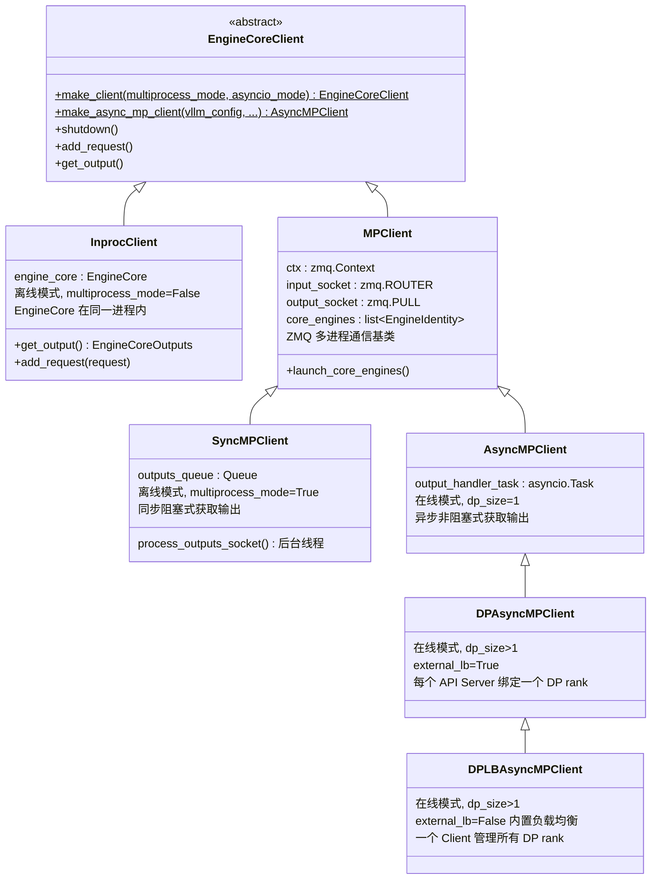

**选择逻辑**（`EngineCoreClient.make_client()` + `make_async_mp_client()`）：

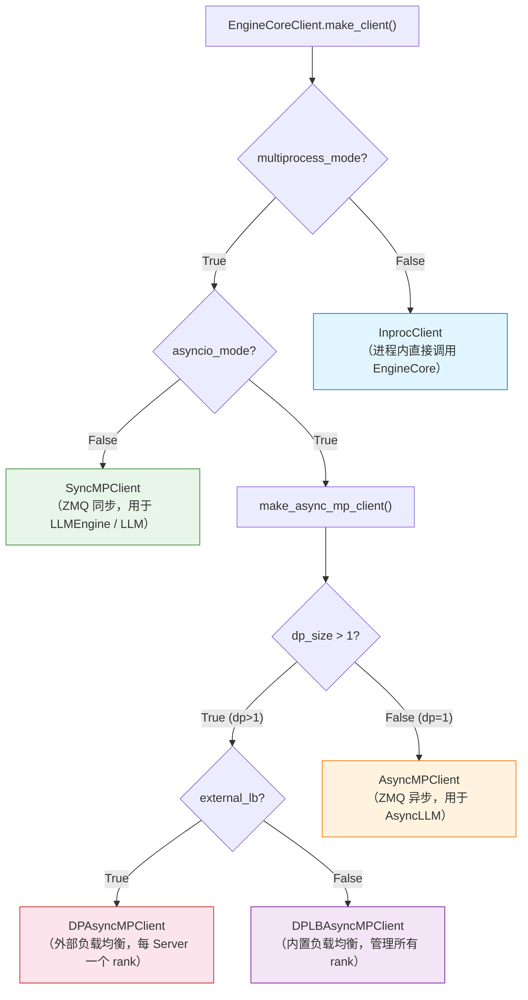

---

### 11.2 离线模式完整进程拓扑（DP=2, TP=2）

离线推理使用 `data_parallel.py` 示例，用户脚本通过 `multiprocessing.Process` 创建 DP 进程，
每个 DP 进程内部通过 `LLM → LLMEngine → SyncMPClient → EngineCoreProc → MultiprocExecutor → WorkerProc` 构建完整推理链路。

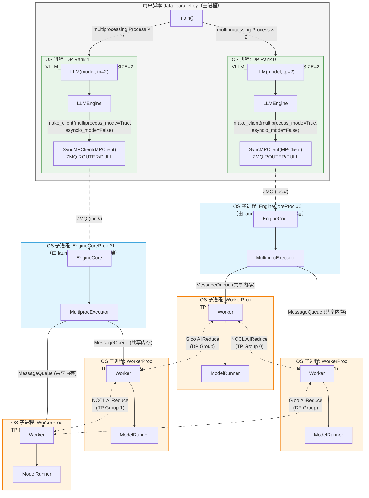

**离线模式进程总数**：1（主进程）+ 2（DP 进程）+ 2（EngineCoreProc）+ 4（WorkerProc）= **9 个 OS 进程**

**关键调用链路**：
```
用户脚本
  └─ multiprocessing.Process(target=run_dp, args=(dp_rank,))
       └─ 设置 VLLM_DP_RANK / VLLM_DP_SIZE / VLLM_DP_MASTER_* 环境变量
            └─ LLM(**engine_args)
                 └─ LLMEngine.from_engine_args()
                      ├─ VllmConfig → ParallelConfig（读取 DP 环境变量）
                      ├─ Executor.get_class() → MultiprocExecutor
                      └─ EngineCoreClient.make_client(multiprocess_mode=True, asyncio_mode=False)
                           └─ SyncMPClient.__init__()
                                └─ MPClient.__init__()
                                     ├─ 创建 ZMQ ROUTER + PULL sockets
                                     └─ launch_core_engines()
                                          └─ CoreEngineProcManager.start()
                                               └─ EngineCoreProc（子进程）
                                                    └─ EngineCore.__init__()
                                                         └─ MultiprocExecutor._init_executor()
                                                              └─ WorkerProc.make_worker_process() × tp_size
```

---

### 11.2.1 补充：引入 EP 后的离线模式进程拓扑（DP=2, TP=2, MoE 模型）

> 当运行 MoE（Mixture-of-Experts）模型时，vLLM 会在已有的 DP/TP 进程拓扑之上叠加 **EP（Expert Parallel）通信组**。EP **不会增加额外的 Worker 进程**，而是在现有进程之间建立新的通信通道。

#### 核心原理：EP 是通信组叠加，不是进程叠加

```
Worker 进程数 = TP_size × PP_size × PCP_size  (每个 DP rank)
总进程数 = DP_size × Worker_per_DP + DP_size(EngineCoreProc) + 1(主进程)
```

EP 仅在 `initialize_model_parallel()` 中创建额外的 `_EP` 通信组（`GroupCoordinator`），该组覆盖所有 DP × TP 的 Worker，使它们能通过 All2All 操作交换 token。

#### EP 组大小计算

```python
# parallel_state.py → initialize_model_parallel()
EP_size = DP_size × PCP_size × TP_size

# 对于 DP=2, TP=2, PP=1, PCP=1:
EP_size = 2 × 1 × 2 = 4  # 所有 4 个 GPU 在同一个 EP 组中
```

#### EP 对 MoE 层的 TP 语义重定义

EP 的一个**关键设计**是：在 MoE 层中，TP 维度被**重新定义**为 Expert 分发维度，而不再是张量切分维度：

```python
# fused_moe/config.py → FusedMoEParallelConfig.make()
if use_ep:
    # "扁平化" TP：将 DP × PCP × TP 合并为一个新的 ep_size
    flatten_tp_size = dp_size * pcp_size * tp_size  # = EP_size
    flatten_tp_rank = dp_rank * pcp_size * tp_size + pcp_rank * tp_size + tp_rank

    return FusedMoEParallelConfig(
        tp_size=1,            # MoE 层内 TP 变为 1（不做张量切分）
        tp_rank=0,
        ep_size=flatten_tp_size,  # EP 大小 = DP × PCP × TP
        ep_rank=flatten_tp_rank,  # 每个 GPU 有唯一的 EP rank
        use_ep=True,
    )
```

这意味着：
- **非 MoE 层**（Attention、LayerNorm 等）：仍然使用标准 TP 通信（AllReduce/AllGather）
- **MoE 层**（FusedMoE）：TP=1，每个 GPU 持有完整的本地 Expert 权重，通过 EP All2All 分发 token

#### Rank 分布与 Expert 分配（DP=2, TP=2, 64 个 Expert）

| GPU | 全局 Rank | DP Rank | TP Rank | EP Rank | EP Size | 持有的 Expert | MoE 层内 TP |
|-----|----------|---------|---------|---------|---------|--------------|------------|
| GPU 0 | 0 | 0 | 0 | 0 | 4 | Expert 0-15 | 1（无切分） |
| GPU 1 | 1 | 0 | 1 | 1 | 4 | Expert 16-31 | 1（无切分） |
| GPU 2 | 2 | 1 | 0 | 2 | 4 | Expert 32-47 | 1（无切分） |
| GPU 3 | 3 | 1 | 1 | 3 | 4 | Expert 48-63 | 1（无切分） |

Expert 分配方式由 `expert_map` 控制，支持 **linear**（连续分块）和 **round_robin**（交错分配）两种策略：

```python
# linear 策略（默认）: 连续分配
base_experts = global_num_experts // ep_size   # 64 // 4 = 16
# GPU 0: Expert[0:16], GPU 1: Expert[16:32], GPU 2: Expert[32:48], GPU 3: Expert[48:64]

# round_robin 策略: 交错分配
# GPU 0: Expert[0,4,8,...,60], GPU 1: Expert[1,5,9,...,61], ...
```

#### 进程拓扑图（DP=2, TP=2, MoE 模型启用 EP）

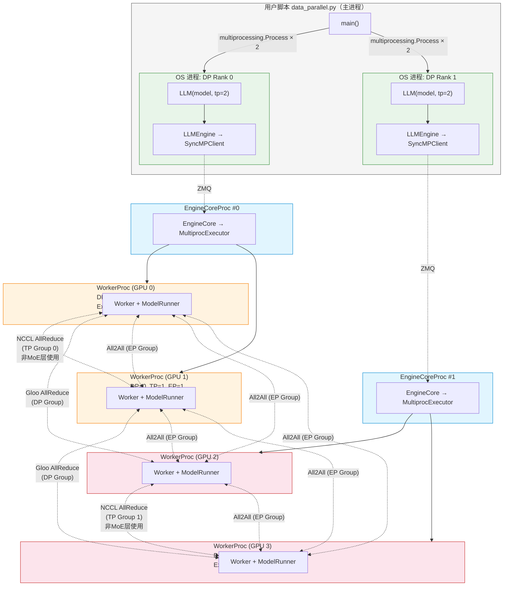

#### 通信组对比视图

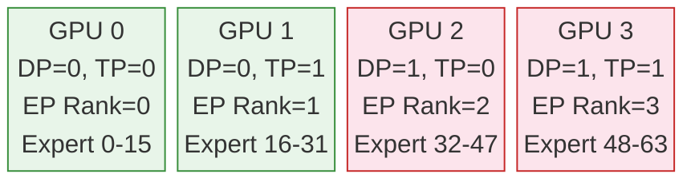

| 通信组 | 成员 | 通信操作 | 使用场景 | 触发层 |
|--------|------|---------|---------|--------|
| **TP Group 0** | {GPU0, GPU1} | AllReduce / AllGather | 非 MoE 层张量并行 | Attention, LayerNorm, Embedding |
| **TP Group 1** | {GPU2, GPU3} | AllReduce / AllGather | 非 MoE 层张量并行 | Attention, LayerNorm, Embedding |
| **DP Group A** | {GPU0, GPU2} | AllReduce (Gloo/NCCL) | 调度状态同步 | dp_utils._run_ar() |
| **DP Group B** | {GPU1, GPU3} | AllReduce (Gloo/NCCL) | 调度状态同步 | dp_utils._run_ar() |
| **EP Group** | {GPU0, GPU1, GPU2, GPU3} | All2All | MoE Expert 分发与收集 | FusedMoE 层 |

#### MoE 层 Transformer Block 内的通信流

单个 Transformer Block 在 EP 模式下的通信序列：

```
输入 hidden_states (每个 DP rank 独立的 batch)
│
├── [Attention 层] ── 正常 TP 通信
│   ├── QKV Linear (TP 切分)
│   ├── Attention 计算
│   ├── O-Projection Linear (TP 切分)
│   └── TP AllReduce (TP Group: {0,1} 或 {2,3})
│
├── [LayerNorm] ── 无通信
│
├── [MoE 层] ── EP 通信（TP 被重定义为 EP）
│   │
│   ├── 1. Router: 计算 top-k expert 分配
│   │      每个 token 选择 top-k 个 Expert
│   │
│   ├── 2. EP Dispatch (All2All 前半)
│   │      ┌─────────────────────────────────────────────────────┐
│   │      │ All2AllManager.dispatch()                           │
│   │      │                                                     │
│   │      │ AllGather 方式: 所有 rank 收集所有 token              │
│   │      │   GPU0 的 tokens ──AllGather──→ 所有 GPU 可见        │
│   │      │   GPU1 的 tokens ──AllGather──→ 所有 GPU 可见        │
│   │      │   GPU2 的 tokens ──AllGather──→ 所有 GPU 可见        │
│   │      │   GPU3 的 tokens ──AllGather──→ 所有 GPU 可见        │
│   │      │                                                     │
│   │      │ 或 DeepEP/Mori 方式: 精确路由到目标 Expert 所在 GPU   │
│   │      └─────────────────────────────────────────────────────┘
│   │
│   ├── 3. Local Expert Compute
│   │      每个 GPU 仅计算分配到本地的 Expert:
│   │        GPU0: Expert 0-15 处理路由到这些 Expert 的 token
│   │        GPU1: Expert 16-31 处理路由到这些 Expert 的 token
│   │        GPU2: Expert 32-47 处理路由到这些 Expert 的 token
│   │        GPU3: Expert 48-63 处理路由到这些 Expert 的 token
│   │
│   └── 4. EP Combine (All2All 后半)
│          ┌─────────────────────────────────────────────────────┐
│          │ All2AllManager.combine()                            │
│          │                                                     │
│          │ ReduceScatter 方式: 结果归约回各 DP rank             │
│          │   Expert 输出 ──ReduceScatter──→ 各 GPU 获得自己 batch │
│          │                                                     │
│          │ 或 DeepEP/Mori 方式: 精确回送到源 GPU                │
│          └─────────────────────────────────────────────────────┘
│
├── [Residual 连接] ── 无通信
│
└── 输出 hidden_states (恢复为每个 DP rank 独立的 batch)
```

#### EP All2All 后端选择

vLLM 为 EP 提供了多种 All2All 后端实现，适用于不同场景：

| All2All 后端 | 实现类 | Dispatch 方式 | Combine 方式 | 适用场景 |
|-------------|--------|-------------|-------------|---------|
| `naive` | `NaiveAll2AllManager` | Broadcast | AllReduce + slice | 调试/测试 |
| `allgather_reducescatter` | `AgRsAll2AllManager` | AllGather | ReduceScatter | 通用，单/跨机 |
| `deepep_low_latency` | `DeepEPLLAll2AllManager` | 精确路由 | 精确回送 | 单机低延迟 |
| `deepep_high_throughput` | `DeepEPHTAll2AllManager` | 精确路由 | 精确回送 | 高吞吐（跨机可用） |
| `mori` | `MoriAll2AllManager` | 精确路由 | 精确回送 | 优化实现 |
| `flashinfer_nvlink_two_sided` | `FlashInferNVLinkTwoSidedManager` | NVLink 双边 | NVLink 双边 | 单机 NVLink |
| `flashinfer_nvlink_one_sided` | `FlashInferNVLinkOneSidedManager` | NVLink 单边 | NVLink 单边 | 单机 NVLink 高吞吐 |

> **注意**：在 `CudaCommunicator.__init__()` 中，All2All Manager 的创建也是在 EP Group 对应的 DeviceCommunicator 中完成的，它使用 EP Group 的 `cpu_group` 和 `device_group`。

#### 关键认知：EP 不改变进程数，只改变通信模式

```
  无 EP (Dense 模型)                    有 EP (MoE 模型)
  ──────────────────                    ──────────────────

  进程数: 完全相同                       进程数: 完全相同
    DP=2 × TP=2 = 4 Worker               DP=2 × TP=2 = 4 Worker

  通信组:                                通信组:
    TP Group 0: {0,1}                      TP Group 0: {0,1}    ← 仅非 MoE 层使用
    TP Group 1: {2,3}                      TP Group 1: {2,3}    ← 仅非 MoE 层使用
    DP Group A: {0,2}                      DP Group A: {0,2}    ← 调度同步使用
    DP Group B: {1,3}                      DP Group B: {1,3}    ← 调度同步使用
                                           EP Group:  {0,1,2,3} ← MoE 层 All2All

  MoE 层行为:                            MoE 层行为:
    每个 GPU 持有 Expert 切片              每个 GPU 持有完整的 16 个 Expert
    (TP 切分 Expert 权重)                  (EP 分发 token 而非切分权重)
    TP AllReduce 聚合结果                  EP All2All 分发/回收 token

  模型参数分布:                          模型参数分布:
    非MoE层: TP 切分 (每GPU 1/2 权重)     非MoE层: TP 切分 (每GPU 1/2 权重)  ← 相同
    MoE层: TP 切分 (每GPU 1/2 所有Expert)  MoE层: EP 分配 (每GPU 全部的 1/4 Expert) ← 不同
```

---

### 11.3 在线模式完整进程拓扑（DP=2, TP=2）

在线服务通过 `vllm serve --dp 2 --tp 2` 启动，API Server 进程中创建 `AsyncLLM → DPLBAsyncMPClient`，
`launch_core_engines()` 创建 2 个 `EngineCoreProc` 子进程 + 1 个 `DPCoordinator` 进程。

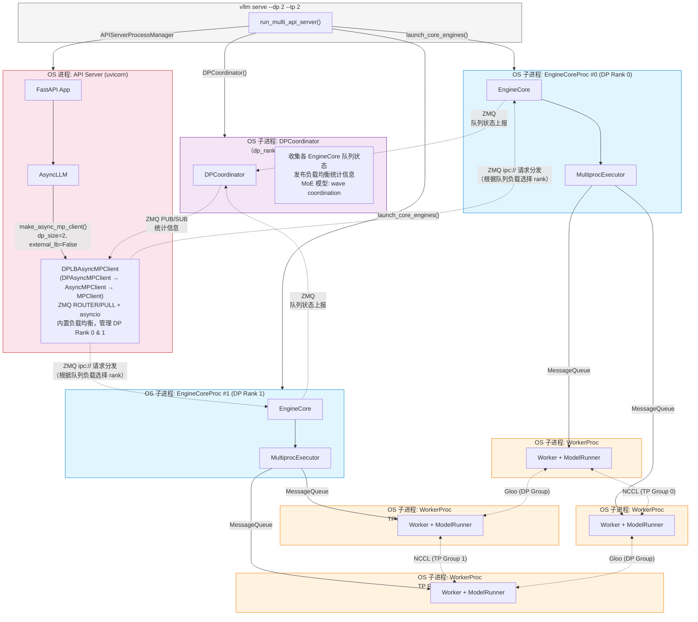

**在线模式进程总数**：1（API Server / uvicorn）+ 1（DPCoordinator）+ 2（EngineCoreProc）+ 4（WorkerProc）= **8 个 OS 进程**

**关键调用链路**：
```
vllm serve --dp 2 --tp 2
  └─ run_multi_api_server()
       ├─ EngineZmqAddresses 分配 ZMQ 地址
       ├─ launch_core_engines()
       │    ├─ DPCoordinator() → 子进程（收集统计 + 负载均衡）
       │    └─ CoreEngineProcManager.start()
       │         ├─ EngineCoreProc(dp_rank=0) → EngineCore → MultiprocExecutor → WorkerProc × 2
       │         └─ EngineCoreProc(dp_rank=1) → EngineCore → MultiprocExecutor → WorkerProc × 2
       │
       └─ APIServerProcessManager
            └─ uvicorn → FastAPI → AsyncLLM
                 └─ EngineCoreClient.make_async_mp_client(dp_size=2, external_lb=False)
                      └─ DPLBAsyncMPClient.__init__()
                           └─ MPClient.__init__(asyncio_mode=True, client_addresses=...)
                                ├─ ZMQ ROUTER socket (连接已创建的 EngineCoreProc)
                                ├─ ZMQ PULL socket (接收输出)
                                └─ 等待所有 EngineCore ready
```

---

### 11.4 离线 vs 在线模式对比拓扑总览

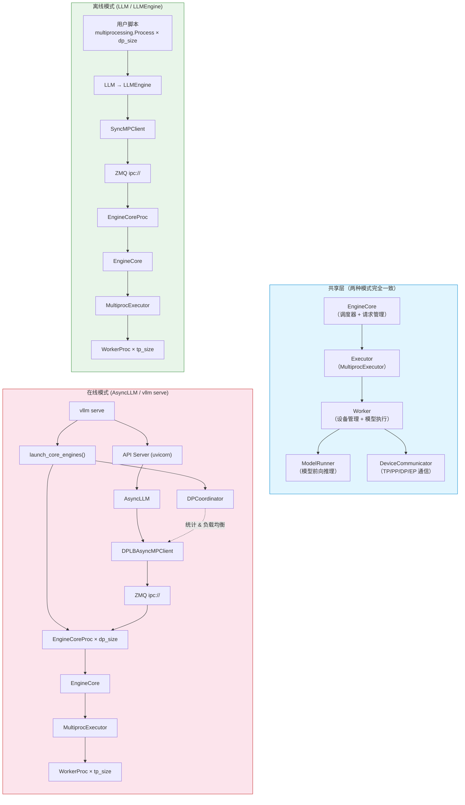

---

### 11.5 单个 EngineCore 内部组件关系

无论是离线还是在线模式，每个 `EngineCore` 实例内部结构完全一致：

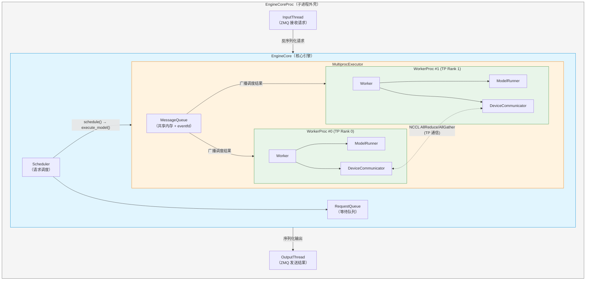

---

### 11.6 通信通道总览（DP=2, TP=2）

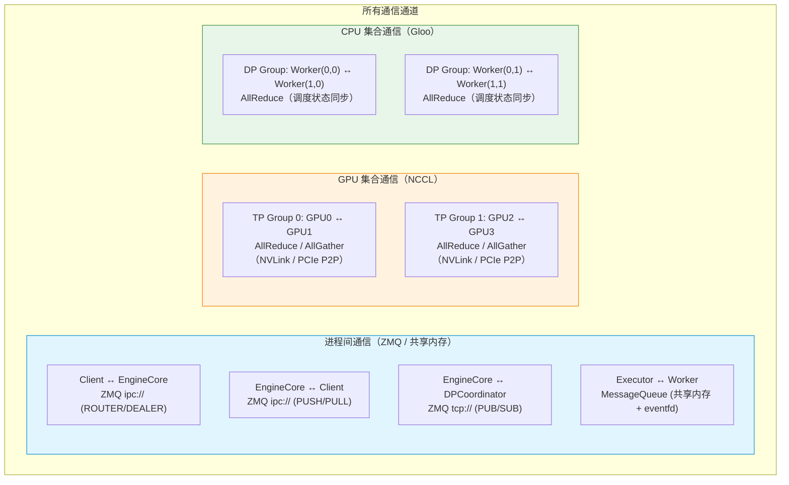

---

### 11.7 GPU 分配视图（DP=2, TP=2，单机 4 卡）

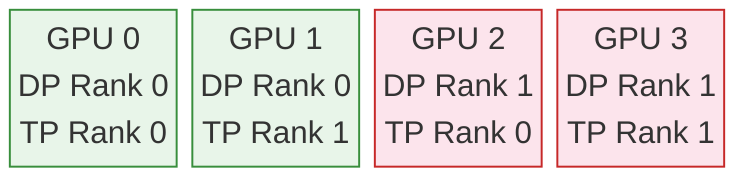

**torch.distributed 全局视图**：`world_size = DP × TP = 4`

| 全局 Rank | DP Rank | TP Rank | GPU | TP Group | DP Group |
|-----------|---------|---------|-----|----------|----------|
| 0 | 0 | 0 | GPU 0 | {0, 1} | {0, 2} |
| 1 | 0 | 1 | GPU 1 | {0, 1} | {1, 3} |
| 2 | 1 | 0 | GPU 2 | {2, 3} | {0, 2} |
| 3 | 1 | 1 | GPU 3 | {2, 3} | {1, 3} |

---

## 12. 总结

### 12.1 vLLM 分布式架构的设计特点

1. **多层抽象**：Platform → DeviceCommunicator → GroupCoordinator → Worker → Executor，层次清晰
2. **插件化设计**：通过 `Platform` 类和 `get_device_communicator_cls()` 实现设备适配的插件化
3. **灵活的进程模型**：支持 multiprocessing / Ray / 外部启动器多种方式
4. **渐进式 DP 实现**：DP 不需要模型切分，只需进程间状态同步，是最简单的并行方式
5. **弹性伸缩**：通过 `StatelessGroupCoordinator` 支持 EP 的弹性伸缩

### 12.2 全链路调用总结图

```
data_parallel.py (用户脚本)
  │
  ├── multiprocessing.Process × dp_size
  │     │
  │     └── 设置 VLLM_DP_* 环境变量
  │           │
  │           └── LLM(**engine_args)
  │                 │
  │                 └── VllmConfig → ParallelConfig (读取 DP 环境变量)
  │                       │
  │                       └── Executor.get_class() → MultiprocExecutor
  │                             │
  │                             └── WorkerProc.make_worker_process() × tp_size
  │                                   │
  │                                   └── Worker.init_device()
  │                                         │
  │                                         ├── torch.distributed.init_process_group()
  │                                         │     (world_size = DP × TP × PP)
  │                                         │
  │                                         ├── initialize_model_parallel()
  │                                         │     ├── 创建 TP 组 (NCCL + CustomAllReduce)
  │                                         │     ├── 创建 PP 组 (NCCL)
  │                                         │     ├── 创建 DP 组 (NCCL/Gloo)
  │                                         │     └── 创建 EP 组 (NCCL + All2All)
  │                                         │
  │                                         └── ModelRunner.load_model()
  │
  └── llm.generate(prompts)
        └── 每个 DP rank 独立处理不同的 prompts
              └── 通过 DP 组 AllReduce 同步状态
```

### 12.3 GPGPU 芯片适配路线图建议

```
阶段一 (MVP): 单卡推理
  ├── PyTorch 后端注册
  ├── Platform 类注册
  └── Worker 适配

阶段二: TP 并行
  ├── 通信库实现 (AllReduce/AllGather/ReduceScatter)
  ├── DeviceCommunicator 实现
  └── 基本 TP 推理验证

阶段三: 完整分布式
  ├── PP 支持 (P2P Send/Recv)
  ├── DP 支持 (多进程 + Gloo 同步)
  └── EP 支持 (All2All 通信)

阶段四: 性能优化
  ├── 自定义 AllReduce (IPC)
  ├── CUDA Graph 等价功能
  ├── 内核融合优化
  └── 网络通信优化 (RDMA)
```

---

> 📅 报告生成时间：2026-03-25（更新：2026-03-28）
> 📦 基于 vLLM 分支：当前工程目录（0.18.0）
> 🔍 分析入口文件：`examples/offline_inference/data_parallel.py`、`examples/online_serving/data_parallel_pause_resume.py`
> 🔌 分析插件：`vllm-ascend` (release/0.18.0)、`vllm-musa` (v0.17.0-dev)、`mate` (kernel library)

---

## 13. 硬件厂商插件的分布式适配实践

> 本节以 **vllm-ascend**（华为昇腾 NPU，`release/0.18.0` 分支）和 **vllm-musa**（摩尔线程 MUSA GPU，`v0.17.0-dev` 分支）为例，分析真实硬件厂商如何基于 vLLM 的插件体系实现分布式适配。同时介绍 **mate**（MUSA AI Tensor Engine）作为算子内核库在 vLLM 生态中的角色。

### 13.1 vLLM 插件扩展点回顾

vLLM 通过 Python `entry_points` 机制提供两类插件入口：

| 入口组 | 作用 | 注册方式 |
|--------|------|----------|
| `vllm.platform_plugins` | 注册硬件平台（Platform 子类） | `setup.py` / `pyproject.toml` 的 `entry_points` |
| `vllm.general_plugins` | 注册通用扩展（KV Connector、Model Loader、自定义 Op 等） | 同上 |

插件通过以下核心抽象实现硬件适配：

```
Platform (平台抽象)
├── get_device_communicator_cls()   → 返回 DeviceCommunicator 子类路径
├── get_attn_backend_cls()          → 返回 Attention Backend 路径
├── get_static_graph_wrapper_cls()  → 返回 Graph 捕获器路径
├── get_compile_backend()           → 返回编译后端路径
├── check_and_update_config()       → 修正不兼容配置
├── set_additional_forward_context() → 注入前向推理上下文
└── use_custom_op_collectives()     → 是否使用自定义集合通信 Op

Worker (工作进程抽象)
├── init_device()                   → 初始化设备
├── _init_worker_distributed_environment() → 初始化分布式环境（含通信后端）
└── execute_model()                 → 执行模型推理

DeviceCommunicatorBase (设备通信器抽象)
├── all_reduce()
├── all_gather()
├── send() / recv()
└── all_to_all()  (可选)
```

### 13.2 vllm-ascend：华为昇腾 NPU 的深度适配

#### 13.2.1 插件注册与入口

```python
# vllm-ascend/setup.py → entry_points
{
    "vllm.platform_plugins": ["ascend = vllm_ascend:register"],
    "vllm.general_plugins": [
        "ascend_kv_connector = vllm_ascend:register_connector",
        "ascend_model_loader = vllm_ascend:register_model_loader",
        "ascend_service_profiling = vllm_ascend:register_service_profiling",
    ],
}

# vllm_ascend/__init__.py
def register():
    """Register the NPU platform."""
    return "vllm_ascend.platform.NPUPlatform"
```

vllm-ascend 注册了 **4 个入口点**：平台插件 + 3 个通用插件（KV 传输连接器、模型加载器、服务剖析）。

#### 13.2.2 NPUPlatform 核心属性

```python
class NPUPlatform(Platform):
    _enum = PlatformEnum.OOT          # 树外（Out-of-Tree）平台
    device_name: str = "npu"
    device_type: str = "npu"
    simple_compile_backend: str = "eager"   # 禁用 torch.compile
    ray_device_key: str = "NPU"             # Ray 资源标识
    device_control_env_var: str = "ASCEND_RT_VISIBLE_DEVICES"
    dispatch_key: str = "PrivateUse1"       # PyTorch 自定义设备调度键
    supported_quantization = ["ascend", "compressed-tensors"]
```

**关键差异**：昇腾使用 `PrivateUse1` 作为 PyTorch 调度键，这是 PyTorch 为非 NVIDIA 设备预留的扩展机制。`ray_device_key = "NPU"` 使 Ray 能识别 NPU 资源进行调度。

#### 13.2.3 分布式通信栈

vllm-ascend 构建了完整的通信栈替代 NCCL：

```
NPUPlatform.get_device_communicator_cls()
    → "vllm_ascend.distributed.device_communicators.npu_communicator.NPUCommunicator"

┌─────────────────────────────────────────────────┐
│              NPUCommunicator                     │
│         (extends DeviceCommunicatorBase)          │
│                                                   │
│  • all_to_all() → dist.all_to_all()              │
│  • 设备: torch.npu.current_device()               │
│  • 继承基类的 all_reduce/all_gather/send/recv      │
└───────────┬─────────────────────────────────────┘
            │
┌───────────▼─────────────────────────────────────┐
│            PyHcclCommunicator                     │
│         (直接封装 HCCL 库)                        │
│                                                   │
│  • all_reduce(tensor, op, stream)                 │
│  • broadcast(tensor, src, stream)                 │
│  • 流管理: aclrtStream_t(stream.npu_stream)       │
│  • 初始化: hcclGetUniqueId → broadcast → CommInit  │
└───────────┬─────────────────────────────────────┘
            │
┌───────────▼─────────────────────────────────────┐
│              HCCLLibrary                          │
│         (ctypes 封装 HCCL C 库)                   │
│                                                   │
│  • 加载 libhccl.so (find_hccl_library)            │
│  • HcclAllReduce / HcclBroadcast                  │
│  • HcclCommInitRank / HcclCommDestroy             │
│  • 类型: hcclDataTypeEnum, hcclRedOpTypeEnum      │
└───────────┬─────────────────────────────────────┘
            │
            ▼
     HCCL (华为集合通信库, 等价于 NCCL)
```

**GroupCoordinatorPatch**：vllm-ascend 还 patch 了 vLLM 的 `GroupCoordinator`，增加了 HCCL 密钥管理和 NPUCommunicator 创建逻辑：

```python
class GroupCoordinatorPatch(GroupCoordinator):
    def __init__(self, ...):
        # 管理 HCCL 密钥
        self._acquired_hccl_keys = set()
        self._unshared_hccl_groups = []
        # 当 world_size > 1 时创建 NPUCommunicator
        if use_device_communicator and world_size > 1:
            self.device_communicator = NPUCommunicator(...)
    
    def all_to_all(self, ...):
        return self.device_communicator.all_to_all(...)
```

**310P 兼容性补丁**：对于较老的 Ascend 310P 设备，vllm-ascend 需要 patch `torch.distributed` 的基本操作：

```python
def communication_adaptation_310p():
    # 310P 不支持 broadcast，用 all_gather 替代
    original_broadcast = torch.distributed.broadcast
    def patched_broadcast(tensor, src, group, ...):
        gather_list = [torch.empty_like(tensor) for _ in range(world_size)]
        torch.distributed.all_gather(gather_list, tensor, group)
        tensor.copy_(gather_list[src])
    
    # 310P 不支持 int64 all_reduce，用 all_gather + sum 替代
    original_all_reduce = torch.distributed.all_reduce
    def patched_all_reduce(tensor, op, group, ...):
        if tensor.dtype == torch.int64:
            gather_list = all_gather(tensor, group)
            tensor.copy_(sum(gather_list))
```

#### 13.2.4 额外并行组

vllm-ascend 在 vLLM 标准的 TP/PP/DP/EP 组之外，定义了大量华为特有的并行组：

```python
# vllm_ascend/distributed/parallel_state.py
_MC2          # MC2 通信组 (Matrix-Compute Communication)
_MLP_TP       # MLP 专用张量并行组
_LMTP         # Language Model 张量并行组
_EMBED_TP     # Embedding 张量并行组
_OTP          # O-projection 张量并行组
_P_TP         # P-projection 张量并行组
_FLASHCOMM2_OTP  # FlashComm v2 O-projection 组
_FLASHCOMM2_ODP  # FlashComm v2 O-projection DP 组
```

这些额外组支持华为独创的 **细粒度张量并行**（`FinegrainedTPConfig`），允许模型不同层使用不同的 TP 切分大小：

```python
class FinegrainedTPConfig:
    oproj_tensor_parallel_size    # O-projection 张量并行度
    lmhead_tensor_parallel_size   # LM Head 张量并行度
    embedding_tensor_parallel_size # Embedding 张量并行度
    mlp_tensor_parallel_size      # MLP 张量并行度
```

#### 13.2.5 融合通信算子

vllm-ascend 的一大核心优化是将**计算与通信融合**为单个 NPU 算子，避免两步操作的同步开销：

```python
# vllm_ascend/ops/linear_op.py

class MatmulAllreduceRowParallelOp:
    """融合 matmul + all_reduce"""
    def forward(self, x, weight, bias):
        return torch_npu.npu_mm_all_reduce_base(
            x, weight, hcom, reduce_op="sum", bias=bias, comm_turn=0
        )

class SequenceRowParallelOp:
    """序列并行: 融合 matmul + reduce_scatter"""
    def forward(self, x, weight, bias):
        return torch_npu.npu_mm_reduce_scatter_base(
            x, weight, hcom, world_size, reduce_op="sum", bias=bias, comm_turn=0
        )

class Flashcomm2OProjRowParallelOp:
    """FlashComm v2: reduce_scatter + all_gather"""
    # 用于 O-projection 的分布式通信优化
```

#### 13.2.6 MoE 通信方法

vllm-ascend 为 Mixture-of-Experts 模型提供了 4 种通信策略：

```python
class MoECommType(Enum):
    ALLGATHER = 0   # 简单 All-Gather 方式
    MC2 = 1         # Matrix-Compute Communication v2
    ALLTOALL = 2    # All-to-All 方式
    FUSED_MC2 = 3   # 融合 MC2 (dispatch_ffn_combine 算子)
```

通信流水线模式：

```
无序列并行时：
  Attn → TP AllReduce → DP AllGather → MoE → DP ReduceScatter → TP AllReduce

有序列并行时 (FlashComm v1)：
  TP AllGather → Attn → TP ReduceScatter → TP AllGather → DP AllGather → MoE → DP ReduceScatter → TP ReduceScatter
```

#### 13.2.7 序列并行编译 Pass

vllm-ascend 在编译层面实现了序列并行优化，通过图模式匹配将标准的 `all_reduce` 替换为 `reduce_scatter + all_gather`：

```python
# vllm_ascend/compilation/passes/sequence_parallelism.py

class MiddleAllReduceRMSNormPattern:
    """替换 all_reduce + RMSNorm 为 reduce_scatter + RMSNorm + all_gather"""
    # 这是编译器级别的优化，在 ACL Graph 捕获时应用
    # 效果：减少通信数据量 (从 full tensor 降为 1/tp_size)
```

#### 13.2.8 NPUWorker 初始化流程

```python
class NPUWorker(WorkerBase):
    def __init__(self, vllm_config, local_rank, rank, ...):
        adapt_patch()              # 应用全局补丁
        ops.register_dummy_fusion_op()  # 注册算子
        register_ascend_customop(vllm_config)  # 注册自定义 Op
        init_ascend_config(vllm_config)         # 初始化昇腾配置
        super().__init__(...)
    
    def _init_device(self):
        device = torch.device(f"npu:{self.local_rank}")
        torch.npu.set_device(device)
        torch.npu.empty_cache()
    
    def _init_worker_distributed_environment(self):
        init_distributed_environment(
            world_size, rank, dist_init_method, local_rank,
            backend="hccl"  # 使用 HCCL 后端
        )
        ensure_model_parallel_initialized(tp_size, pp_size, pcp_size, dcp_size)
        init_ascend_model_parallel(parallel_config)  # 初始化昇腾特有并行组
    
    def init_device(self):
        self.device = self._init_device()
        self.model_runner = NPUModelRunner(self.vllm_config, self.device)
```

### 13.3 vllm-musa：摩尔线程 MUSA GPU 的兼容性适配

#### 13.3.1 技术路线差异

与 vllm-ascend 的「深度重写」策略不同，vllm-musa 采用了 **「CUDA 兼容 + 运行时补丁」** 的轻量化适配策略：

| 维度 | vllm-ascend (昇腾) | vllm-musa (摩尔线程) |
|------|-------------------|---------------------|
| 设备抽象 | `PrivateUse1`（完全独立） | `MUSA`（CUDA-alike） |
| 通信库 | HCCL（自研） | MCCL（兼容 NCCL 接口） |
| 编程模型 | `torch_npu` + 自定义算子 | `torchada`（CUDA→MUSA 零改动兼容层） |
| 适配策略 | 深度重写 Worker/ModelRunner/Ops | 运行时源码补丁 + 选择性重写 |
| 通信器 | 自研 NPUCommunicator | 复用 vLLM 的 CudaCommunicator |
| `is_cuda_alike()` | `False` | `True` |

#### 13.3.2 插件注册与入口

```python
# vllm_musa/pyproject.toml → entry_points (推断)
{
    "vllm.platform_plugins": ["musa = vllm_musa:musa_platform_plugin"],
    "vllm.general_plugins": ["musa_ops = vllm_musa:register_custom_ops"],
}

# vllm_musa/__init__.py
def musa_platform_plugin() -> str | None:
    """平台检测：torchada 或 torch_musa 可用时返回平台路径"""
    if _torchada_available:
        import torchada
        if torchada.is_musa_platform():
            return "vllm_musa.musa.MUSAPlatform"
    try:
        import torch_musa
        return "vllm_musa.musa.MUSAPlatform"
    except ImportError:
        pass
    return None

def register_custom_ops():
    """通用插件：应用源码补丁 + 注册自定义算子 + 注册模块"""
    _register_patches()   # 运行时源码补丁
    _register_ops()       # OOT 自定义算子 (SiluAndMul 等)
    _register_modules()   # 分布式连接器、Attention Backend 等
```

#### 13.3.3 MUSAPlatform 核心属性

```python
class MUSAPlatformBase(Platform):
    _enum = PlatformEnum.OOT          # 树外平台
    device_name: str = "musa"
    device_type: str = "musa"
    dispatch_key: str = "MUSA"        # MUSA 专用调度键
    ray_device_key: str = "GPU"       # Ray 中视为 GPU 资源
    dist_backend: str = "mccl"        # MUSA Collective Communication Library
    device_control_env_var: str = "MUSA_VISIBLE_DEVICES"

    def is_cuda_alike(self) -> bool:
        return True    # 关键：声明为 CUDA 兼容设备

    def is_musa(self) -> bool:
        return True
```

**关键设计**：`is_cuda_alike() → True` 意味着 MUSA 平台可以复用 vLLM 中大量的 CUDA 代码路径，而不需要完全重写。

#### 13.3.4 分布式通信：复用 + 补丁

vllm-musa 的通信层策略是 **复用 vLLM 的 CudaCommunicator**：

```python
class MUSAPlatformBase(Platform):
    @classmethod
    def get_device_communicator_cls(cls) -> str:
        # 直接使用 vLLM 的 CUDA 通信器！
        return "vllm.distributed.device_communicators.cuda_communicator.CudaCommunicator"
    
    @classmethod
    def use_custom_allreduce(cls) -> bool:
        return True  # 启用自定义 AllReduce 优化
    
    @classmethod
    def get_static_graph_wrapper_cls(cls) -> str:
        return "vllm.compilation.cuda_graph.CUDAGraphWrapper"  # 复用 CUDA Graph
```

这之所以可行，是因为：

1. **torchada**：MooreThreads 开发的 CUDA→MUSA 兼容层，使 `torch.cuda.*` API 透明地重定向到 `torch.musa.*`
2. **MCCL**：MooreThreads 的集合通信库，接口与 NCCL 兼容
3. **运行时补丁**：对少量不兼容代码进行字符串替换

```
┌────────────────────────────────────────────────┐
│       vLLM CudaCommunicator (原生复用)          │
│  • 调用 torch.distributed.all_reduce() 等       │
│  • 底层自动走 MCCL 后端 (dist_backend="mccl")   │
└───────────┬────────────────────────────────────┘
            │  torchada 透明重定向
┌───────────▼────────────────────────────────────┐
│              torchada 兼容层                     │
│  • torch.cuda.* → torch.musa.*                  │
│  • torch.device("cuda:X") → torch.device("musa:X") │
│  • CUDA 代码零改动运行在 MUSA 上                 │
└───────────┬────────────────────────────────────┘
            │
┌───────────▼────────────────────────────────────┐
│         MCCL (MUSA Collective Comm Lib)         │
│  • NCCL 兼容接口                                │
│  • AllReduce / AllGather / ReduceScatter         │
│  • All-to-All / Send / Recv                      │
└────────────────────────────────────────────────┘
```

#### 13.3.5 运行时源码补丁系统

vllm-musa 通过独特的 **运行时源码补丁** 机制处理不兼容的硬编码：

```python
# vllm_musa/patches/vllm__v1__worker__gpu_worker.patch.py
PATCHES = [
    # GPU Worker 硬编码了 "cuda" 设备检查
    ('if self.device_config.device_type == "cuda":',
     'if self.device_config.device_type in ("cuda", "musa"):'),
    # torch.cuda.is_available() 替换
    ("torch.cuda.is_available()",
     "torch.musa.is_available()"),
]

# vllm_musa/patches/vllm__distributed__device_communicators__all2all.patch.py
PATCHES = [
    # MUSA 的 all2all 不支持 explicitly_destroy 参数
    ("explicitly_destroy=True,", ""),
]

# vllm_musa/patches/vllm__utils__deep_gemm.patch.py
PATCHES = [
    # DeepGemm 硬编码了 NVIDIA 的 Compute Capability
    ("is_supported_arch = current_platform.is_cuda()",
     "is_supported_arch = current_platform.is_musa()"),
    ("current_platform.is_device_capability(90)",    # Hopper
     "current_platform.is_device_capability(31)"),   # Pinghu MP31
]
```

当前的补丁列表及其目标：

| 补丁文件 | 目标模块 | 目的 |
|---------|---------|------|
| `gpu_worker.patch` | `vllm.v1.worker.gpu_worker` | 扩展设备类型检查支持 "musa" |
| `all2all.patch` | `vllm.distributed.device_communicators.all2all` | 移除不支持的参数 |
| `custom_all_reduce.patch` | `vllm.distributed.device_communicators.custom_all_reduce` | 自定义 AllReduce 适配 |
| `deep_gemm.patch` | `vllm.utils.deep_gemm` | DeepGemm 硬件能力检查适配 |
| `fp8.patch` | `vllm.model_executor.layers.quantization.fp8` | FP8 量化适配 |
| `fa_utils.patch` | `vllm.v1.attention.backends.fa_utils` | 强制使用 Flash Attention v2 |
| `flashmla.patch` | `vllm.v1.attention.backends.mla.flashmla` | MLA reorder 阈值调整 |
| `topk_topp.patch` | `vllm.v1.sample.ops.topk_topp_triton` | 采样算子适配 |
| `profiler.patch` | `vllm.profiler.wrapper` | 性能分析器 MUSA 支持 |

#### 13.3.6 MTGPUWorker

vllm-musa 定义了 `MTGPUWorker` 作为工作进程：

```python
class MUSAPlatformBase(Platform):
    @classmethod
    def check_and_update_config(cls, vllm_config):
        if parallel_config.worker_cls == "auto":
            parallel_config.worker_cls = "vllm_musa.worker.MTGPUWorker"
```

`MTGPUWorker` 继承自 vLLM V1 的 `Worker`，主要扩展了 MUSA 特有的设备初始化逻辑。由于 `is_cuda_alike() = True`，大部分 Worker 逻辑无需重写。

#### 13.3.7 MATE 内核库的角色

**MATE**（MUSA AI Tensor Engine）是 MooreThreads 开发的高性能算子库，它 **不是** vLLM 插件，而是为 vllm-musa 提供优化内核的底层库：

```python
# mate/__init__.py
from mate.mha_interface import flash_attn_varlen_func, flash_attn_with_kvcache
from mate.mla_interface import mla
from mate.flashmla import flash_mla_with_kvcache, get_mla_metadata

# 通过 TORCH_LIBRARY_FRAGMENT 注册为 PyTorch 算子
TORCH_LIBRARY_FRAGMENT(mate, m) {
    m.def("mla_with_kvcache(...)");
    m.def("get_mla_decoding_metadata(...)");
}
```

MATE 提供的核心能力：

| 算子类别 | 具体算子 | 说明 |
|---------|---------|------|
| Flash Attention | `flash_attn_varlen_func`, `flash_attn_with_kvcache` | 变长/带 KV Cache 的 Flash Attention |
| MLA | `mla`, `mla_with_kvcache` | Multi-head Latent Attention（DeepSeek 架构） |
| FlashMLA | `flash_mla_with_kvcache`, `get_mla_metadata` | FlashMLA 解码加速 |
| GEMM | `bmm_fp8`, `ragged_moe_gemm_8bit` | FP8 批量矩阵乘、MoE GEMM |
| DeepGEMM | `fp8_paged_mqa_logits` | FP8 分页 MQA logits 计算 |

vllm-musa 中的 Attention Backend 通过 MATE 获得硬件加速：

```python
# vllm_musa/v1/attention/backends/mla/flashmla.py
class MusaFlashMLABackend:
    """使用 MATE 的 FlashMLA 内核实现 MLA 加速"""
    # 调用 mate.flashmla.flash_mla_with_kvcache()
    # 调用 mate.flashmla.get_mla_metadata()
```

### 13.4 两种适配策略对比

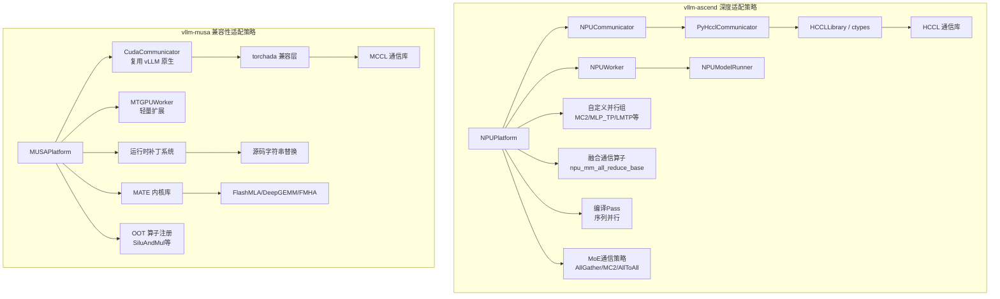

### 13.5 分布式适配核心差异总结

| 对比维度 | vllm-ascend (昇腾 NPU) | vllm-musa (摩尔线程 MUSA) |
|---------|----------------------|--------------------------|
| **平台枚举** | `PlatformEnum.OOT` | `PlatformEnum.OOT` |
| **PyTorch 调度键** | `PrivateUse1` | `MUSA` |
| **CUDA 兼容性** | `is_cuda_alike() = False` | `is_cuda_alike() = True` |
| **通信后端** | HCCL（自研 ctypes 封装） | MCCL（NCCL 兼容，通过 torchada） |
| **通信器** | 自研 `NPUCommunicator` | 复用 `CudaCommunicator` |
| **Worker 类** | `NPUWorker(WorkerBase)` 深度重写 | `MTGPUWorker(Worker)` 轻量扩展 |
| **ModelRunner** | `NPUModelRunner(GPUModelRunner)` 大量重写 | 复用 `GPUModelRunner`（通过补丁） |
| **Graph 捕获** | `ACLGraphWrapper`（自定义） | `CUDAGraphWrapper`（复用） |
| **编译后端** | `AscendCompiler`（自定义） | 默认（通过 torchada） |
| **额外并行组** | 8+ 自定义组（MC2, MLP_TP, LMTP…） | 无额外组 |
| **融合通信算子** | ✅ `npu_mm_all_reduce_base` 等 | ❌ 不需要（走标准路径） |
| **MoE 通信** | 4 种策略（AllGather/MC2/AllToAll/FusedMC2） | 标准 vLLM MoE 路径 |
| **序列并行** | 编译 Pass 替换 all_reduce | 标准 vLLM 路径 |
| **适配复杂度** | 高（数百个文件） | 低（~20 个文件 + 补丁） |
| **内核库** | torch_npu 内置 | MATE（独立 PyTorch 算子库） |
| **补丁方式** | 猴子补丁（Python class patch） | 源码字符串替换 |
| **设备检测** | `ASCEND_RT_VISIBLE_DEVICES` | `MUSA_VISIBLE_DEVICES` |
| **310P/老设备兼容** | ✅ 完整 310P 适配 | N/A |
| **支持引擎** | V0 + V1 | 仅 V1 |

### 13.6 对新硬件厂商的启示

从两个插件的实践中，可以总结出硬件厂商适配 vLLM 分布式系统的两种路线：

#### 路线 A：CUDA 兼容路线（参考 vllm-musa）

**适用场景**：硬件提供了 CUDA 兼容的编程接口（如 torchada、HIP）

```
1. 开发 CUDA→自研 GPU 的兼容层 (如 torchada)
2. 实现 NCCL 兼容的集合通信库 (如 MCCL)
3. 注册 Platform 子类，is_cuda_alike() = True
4. 复用 CudaCommunicator，通过补丁修复硬编码
5. 开发高性能内核库作为 Attention Backend (如 MATE)
```

**优势**：开发量小、迭代快、与 vLLM 升级同步成本低
**劣势**：难以利用硬件专有特性做深度优化

#### 路线 B：深度定制路线（参考 vllm-ascend）

**适用场景**：硬件架构与 NVIDIA GPU 差异大，有独特的通信/计算能力

```
1. 实现完整的 DeviceCommunicator 子类
2. 开发 ctypes 封装的通信库接口 (如 HCCLLibrary)
3. 自研 Worker 和 ModelRunner
4. 定义额外并行组利用硬件特性
5. 开发融合通信算子 (计算+通信一体)
6. 实现编译器 Pass 做图级优化
```

**优势**：能充分发挥硬件特有优势，深度性能优化
**劣势**：开发和维护成本高，与 vLLM 升级同步困难

#### 两种路线的 vLLM 扩展点使用对比

```
vLLM 扩展点              vllm-ascend 使用    vllm-musa 使用
────────────────────────────────────────────────────────
Platform                   ✅ 深度重写         ✅ 轻量实现
DeviceCommunicator         ✅ 自研              ❌ 复用 CUDA
Worker                     ✅ 自研              ✅ 轻量扩展
ModelRunner                ✅ 深度重写         ❌ 复用 (补丁)
Attention Backend          ✅ 自研              ✅ MATE 提供
Graph Wrapper              ✅ ACLGraph          ❌ 复用 CUDA Graph
Compile Backend            ✅ AscendCompiler    ❌ 默认
Custom Ops                 ✅ 大量自定义         ✅ 少量 OOT
Parallel State             ✅ 8+ 额外组         ❌ 无额外
Runtime Patches            ✅ Python class      ✅ 源码字符串
entry_points               4 个                 2 个
```
