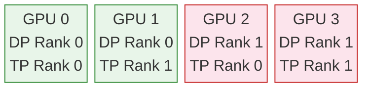
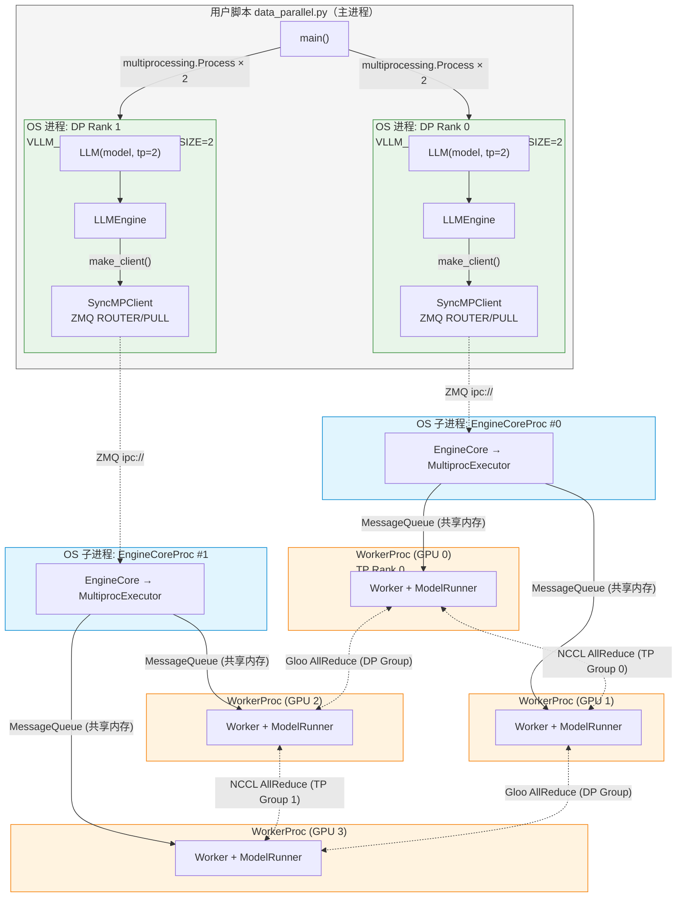
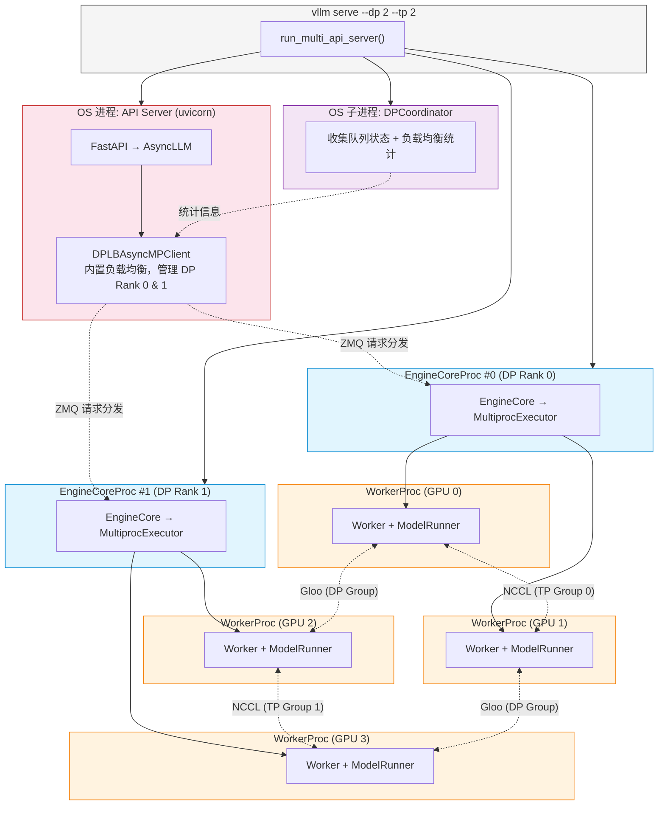

# vLLM 0.18.0 分布式并行逻辑分析报告（精简版）

> 本报告基于 vLLM 0.18.0 源码，对分布式并行方案进行全链路分析，并以 vllm-ascend 和 vllm-musa 为例分析硬件适配实践。
> 完整版详见 [vLLM并行分析.md](vLLM并行分析.md)（~3300 行）。

---

## 目录

1. [管理摘要](#1-管理摘要)
2. [架构全景](#2-架构全景)
3. [通信与并行机制](#3-通信与并行机制)
4. [部署模式](#4-部署模式)
5. [关键拓扑图](#5-关键拓扑图)
6. [硬件适配指南](#6-硬件适配指南)
- [附录索引](#附录索引)

---

## 1. 管理摘要

### 1.1 vLLM 分布式架构 6 大设计特点

1. **多层抽象**：`Platform → DeviceCommunicator → GroupCoordinator → Worker → Executor`，层次清晰、职责分明
2. **插件化设计**：通过 `Platform` 类和 `get_device_communicator_cls()` 实现设备适配的插件化，硬件厂商无需修改 vLLM 主仓库
3. **灵活的进程模型**：支持 multiprocessing / Ray / 外部启动器（torchrun）多种方式
4. **渐进式 DP 实现**：DP 不需要模型切分，只需进程间状态同步，是最简单的并行方式
5. **弹性伸缩**：通过 `StatelessGroupCoordinator` 支持 EP 的弹性伸缩
6. **同构底层，异构上层**：离线推理与在线服务在 EngineCore 以下完全共享，仅上层 Client 和调度方式不同

### 1.2 全链路调用总结图

```
data_parallel.py (用户脚本)
  │
  ├── multiprocessing.Process × dp_size
  │     │
  │     └── 设置 VLLM_DP_* 环境变量
  │           │
  │           └── LLM(**engine_args)
  │                 │
  │                 └── VllmConfig → ParallelConfig (读取 DP 环境变量)
  │                       │
  │                       └── Executor.get_class() → MultiprocExecutor
  │                             │
  │                             └── WorkerProc.make_worker_process() × tp_size
  │                                   │
  │                                   └── Worker.init_device()
  │                                         │
  │                                         ├── torch.distributed.init_process_group()
  │                                         │     (world_size = DP × TP × PP)
  │                                         │
  │                                         ├── initialize_model_parallel()
  │                                         │     ├── 创建 TP 组 (NCCL + CustomAllReduce)
  │                                         │     ├── 创建 PP 组 (NCCL)
  │                                         │     ├── 创建 DP 组 (NCCL/Gloo)
  │                                         │     └── 创建 EP 组 (NCCL + All2All)
  │                                         │
  │                                         └── ModelRunner.load_model()
  │
  └── llm.generate(prompts)
        └── 每个 DP rank 独立处理不同的 prompts
              └── 通过 DP 组 AllReduce 同步状态
```

### 1.3 GPGPU 芯片适配路线图建议

```
阶段一 (MVP): 单卡推理
  ├── PyTorch 后端注册
  ├── Platform 类注册
  └── Worker 适配

阶段二: TP 并行
  ├── 通信库实现 (AllReduce/AllGather/ReduceScatter)
  ├── DeviceCommunicator 实现
  └── 基本 TP 推理验证

阶段三: 完整分布式
  ├── PP 支持 (P2P Send/Recv)
  ├── DP 支持 (多进程 + Gloo 同步)
  └── EP 支持 (All2All 通信)

阶段四: 性能优化
  ├── 自定义 AllReduce (IPC)
  ├── CUDA Graph 等价功能
  ├── 内核融合优化
  └── 网络通信优化 (RDMA)
```

---

## 2. 架构全景

### 2.1 五大并行维度

| 并行维度 | 缩写 | 作用 | 涉及通信 |
|---------|------|------|---------|
| **Tensor Parallel** | TP | 将模型权重按张量维度切分到多个 GPU | AllReduce / ReduceScatter / AllGather |
| **Pipeline Parallel** | PP | 将模型按层切分到多个 GPU | P2P Send/Recv |
| **Data Parallel** | DP | 多个引擎副本并行处理不同请求 | AllReduce（状态同步） |
| **Expert Parallel** | EP | MoE 模型中将不同 Expert 分布到不同 GPU | All2All |
| **Context Parallel** | PCP/DCP | 长序列按 context 维度切分 | AllGather / ReduceScatter |

全局 Rank 按如下维度排列（从外到内）：`ExternalDP × DP × PP × PCP × TP`

**示例**：`DP=2, TP=2, PP=1` → 4 个 GPU：

```
GPU 0: DP_rank=0, TP_rank=0 (global_rank=0)    TP 组: [0,1], [2,3]
GPU 1: DP_rank=0, TP_rank=1 (global_rank=1)    DP 组: [0,2], [1,3]
GPU 2: DP_rank=1, TP_rank=0 (global_rank=2)
GPU 3: DP_rank=1, TP_rank=1 (global_rank=3)
```

### 2.2 三层进程架构

```
用户进程 (LLM API)
  │
  ├── Engine (AsyncLLM / LLMEngine)
  │     └── EngineCore → Scheduler
  │
  └── Executor (进程 / Ray 管理器)
        ├── WorkerProc[rank=0] (driver worker) → Worker → ModelRunner
        ├── WorkerProc[rank=1]                 → Worker → ModelRunner
        └── ...
```

| 层级 | 职责 | 关键类 |
|------|------|--------|
| **Executor** | 管理 Worker 生命周期、消息广播 | `MultiprocExecutor` / `RayDistributedExecutor` / `UniProcExecutor` |
| **Worker** | 绑定 GPU 设备、初始化分布式通信 | `Worker`（`gpu_worker.py`）|
| **ModelRunner** | 加载模型、执行前向推理 | `GPUModelRunner` |

### 2.3 GPU 分配视图（DP=2, TP=2，单机 4 卡）



| 全局 Rank | DP Rank | TP Rank | GPU | TP Group | DP Group |
|-----------|---------|---------|-----|----------|----------|
| 0 | 0 | 0 | GPU 0 | {0, 1} | {0, 2} |
| 1 | 0 | 1 | GPU 1 | {0, 1} | {1, 3} |
| 2 | 1 | 0 | GPU 2 | {2, 3} | {0, 2} |
| 3 | 1 | 1 | GPU 3 | {2, 3} | {1, 3} |

---

## 3. 通信与并行机制

### 3.1 并行组创建逻辑

所有并行组在 `Worker.init_device()` 中创建：

```
Worker.init_device()
  └── init_worker_distributed_environment()
        ├── init_distributed_environment()           # torch.distributed.init_process_group()
        │     └── 创建 _WORLD (GroupCoordinator)
        └── ensure_model_parallel_initialized()
              └── initialize_model_parallel()
                    ├── 创建 _TP  组 (NCCL + MessageQueue + CustomAllReduce)
                    ├── 创建 _PP  组 (NCCL)
                    ├── 创建 _DP  组 (Gloo)
                    └── 创建 _EP  组 (NCCL, 仅 MoE 模型)
```

**各组创建要点**：

| 并行组 | Backend | 成员示例 (DP=2,TP=2) | 特殊说明 |
|--------|---------|---------------------|---------|
| **TP** | NCCL | {0,1}, {2,3} | 启用 MessageQueue 广播 + CustomAllReduce |
| **PP** | NCCL | {0,2}, {1,3} (若PP=2) | P2P Send/Recv |
| **DP** | Gloo | {0,2}, {1,3} | CPU 侧同步，不占 GPU |
| **EP** | NCCL | {0,1,2,3} (所有 GPU) | 覆盖 DP×TP，不增加进程 |

**EP 关键认知**：EP 不增加 Worker 进程，只在现有进程间创建新的通信组。在 MoE 层中，TP 维度被"扁平化"为 EP 维度（`tp_size=1, ep_size=DP×TP`），每个 GPU 持有完整的本地 Expert 权重，通过 All2All 分发 token。

### 3.2 通信后端四层抽象

```
┌─────────────────────────────────────────────────────┐
│           GroupCoordinator (parallel_state.py)       │
│   封装通信组：ranks, cpu_group, device_group        │
│   提供: all_reduce, broadcast, send/recv 等接口     │
├─────────────────────────────────────────────────────┤
│         DeviceCommunicatorBase (抽象接口)            │
│   子类按平台实现: CudaComm / XPUComm / CPUComm     │
├─────────────────────────────────────────────────────┤
│        CudaCommunicator (CUDA 设备专用)             │
│   内部包含:                                         │
│   • PyNcclCommunicator  (NCCL 原语封装)             │
│   • CustomAllreduce     (IPC 共享内存,小数据快)      │
│   • All2AllManager      (MoE Expert 通信)           │
│   • FlashInfer/SymmMem/QuickAllReduce (可选优化)    │
├─────────────────────────────────────────────────────┤
│        torch.distributed (PyTorch 原生)             │
│   ProcessGroup: NCCL / Gloo / MPI                   │
└─────────────────────────────────────────────────────┘
```

### 3.3 AllReduce 调用优先级链

TP AllReduce 是推理中频率最高的操作，按以下优先级选择后端：

```
1️⃣ SymmMem NCCL AllReduce (对称内存，仅 NVLink)
2️⃣ QuickAllReduce (仅 AMD MI300)
3️⃣ FlashInfer AllReduce
4️⃣ CustomAllreduce (CUDA IPC 共享 GPU 内存，小数据量首选)
5️⃣ SymmMem AllReduce
6️⃣ PyNccl AllReduce (标准 NCCL，兜底)
7️⃣ torch.distributed.all_reduce (最终 fallback)
```

### 3.4 DP 同步机制

DP 组通过 Gloo AllReduce 在 CPU 侧同步调度状态，传输数据量很小（`[4, dp_size]` int32 tensor）：

- **`_run_ar()`**：同步各 DP rank 的 token 数量、微批处理标志、CUDAGraph 模式
- **`has_unfinished_dp()`**：MAX AllReduce——只要有一个 DP rank 有未完成请求，全部继续
- **`sync_kv_cache_memory_size()`**：MIN AllReduce——取最小内存确保一致性

---

## 4. 部署模式

### 4.1 单机 vs 多机架构差异

**单机模式**（默认）：
- `MultiprocExecutor` 通过 `multiprocessing.spawn` 启动 Worker
- 通信：共享内存（MessageQueue） + NCCL（NVLink/PCIe P2P）
- CustomAllReduce 可用（CUDA IPC）

**多机模式**（`nnodes > 1`）：
- **Leader-Follower 架构**：Leader 节点运行 Executor + 本地 Worker，通过 SSH 启动 Follower 节点
- 通信回退：共享内存 → ZMQ TCP，CustomAllReduce → PyNccl over InfiniBand
- 也可使用 Ray 框架进行更大规模集群管理

```
单机: Executor → 共享内存 → Worker     | TP: CUDA IPC / NVLink
多机: Leader → SSH → Follower          | TP: NCCL over InfiniBand/RoCE
      Leader → ZMQ TCP → Follower Worker
```

### 4.2 离线推理 vs 在线服务

> **核心结论：同构底层，异构上层**

| 层次 | 离线推理 (LLM) | 在线服务 (vllm serve) | 是否相同 |
|------|---------------|----------------------|---------|
| **Executor / Worker / 并行组** | MultiprocExecutor → Worker | MultiprocExecutor → Worker | ✅ 完全相同 |
| **通信后端** | CudaCommunicator / PyNccl | CudaCommunicator / PyNccl | ✅ 完全相同 |
| **EngineCore** | 相同类 | 相同类（在子进程中运行） | ✅ 相同 |
| **EngineCoreClient** | `InprocClient` / `SyncMPClient` | `AsyncMPClient` / `DPAsyncMPClient` | ❌ 不同 |
| **上层引擎** | `LLMEngine`（同步） | `AsyncLLM`（异步） | ❌ 不同 |
| **DP 启动** | 用户手动 `multiprocessing.Process` | `vllm serve --dp-size` 自动管理 | ❌ 不同 |
| **DP 负载均衡** | 用户手动切分 prompts | DPCoordinator 自动分发 | ❌ 不同 |

**意义**：对 GPGPU 芯片适配者来说，只需适配一套底层并行接口，即可同时支持离线和在线两种模式。

### 4.3 通信机制全景对比表

| 并行组 | 通信操作 | 单机通信后端 | 跨机通信后端 | 单机介质 | 跨机介质 |
|-------|---------|------------|-------------|---------|---------|
| **TP** | AllReduce | CustomAllreduce / PyNccl | PyNccl | NVLink / PCIe P2P | InfiniBand / RoCE |
| **PP** | Send/Recv | PyNccl | PyNccl | NVLink / PCIe | InfiniBand / RoCE |
| **DP** | AllReduce | Gloo (CPU) | Gloo (CPU) | TCP loopback | TCP / InfiniBand |
| **EP** | All2All | FlashInfer / DeepEP / AgRs | DeepEP / AgRs / NIXL | NVLink / PCIe | InfiniBand / RoCE |
| **MQ** | Broadcast | 共享内存 + ZMQ IPC | ZMQ TCP | mmap + Unix Socket | TCP |

**单机优化**在跨机场景下**自动降级**：CustomAllreduce → PyNccl，ShmRingBuffer → ZMQ TCP，ZMQ IPC → ZMQ TCP。

---

## 5. 关键拓扑图

> 所有图表使用 Mermaid 语法，可通过 `mmdc -i input.md -o output.png` 或 [Mermaid Live Editor](https://mermaid.live/) 转换为 PNG。

### 5.1 离线模式进程拓扑（DP=2, TP=2）



**进程总数**：1（主）+ 2（DP）+ 2（EngineCoreProc）+ 4（WorkerProc）= **9 个 OS 进程**

### 5.2 在线模式进程拓扑（DP=2, TP=2）



**进程总数**：1（API Server）+ 1（DPCoordinator）+ 2（EngineCoreProc）+ 4（WorkerProc）= **8 个 OS 进程**

### 5.3 EP 拓扑补充（DP=2, TP=2, MoE 模型）

EP 在现有 DP/TP 进程之上叠加通信组，**不增加 Worker 进程**：

- EP_size = DP × TP = 4，所有 4 个 GPU 在同一个 EP 组中
- 非 MoE 层仍使用 TP AllReduce（{0,1} / {2,3}）
- MoE 层使用 EP All2All（{0,1,2,3}），TP 被重定义为 EP

| GPU | DP Rank | TP Rank | EP Rank | 持有的 Expert (64个) | MoE 层内 TP |
|-----|---------|---------|---------|---------------------|------------|
| GPU 0 | 0 | 0 | 0 | Expert 0-15 | 1（无切分） |
| GPU 1 | 0 | 1 | 1 | Expert 16-31 | 1（无切分） |
| GPU 2 | 1 | 0 | 2 | Expert 32-47 | 1（无切分） |
| GPU 3 | 1 | 1 | 3 | Expert 48-63 | 1（无切分） |

**MoE 层通信流**：Router 计算 top-k → EP Dispatch（AllGather/DeepEP） → 本地 Expert 计算 → EP Combine（ReduceScatter/DeepEP）

| 通信组 | 成员 | 操作 | 使用场景 |
|--------|------|------|---------|
| TP Group 0 | {GPU0, GPU1} | AllReduce | Attention, LayerNorm（非 MoE 层） |
| TP Group 1 | {GPU2, GPU3} | AllReduce | Attention, LayerNorm（非 MoE 层） |
| DP Group A | {GPU0, GPU2} | AllReduce (Gloo) | 调度状态同步 |
| DP Group B | {GPU1, GPU3} | AllReduce (Gloo) | 调度状态同步 |
| **EP Group** | **{GPU0, GPU1, GPU2, GPU3}** | **All2All** | **MoE Expert 分发与收集** |

### 5.4 离线 vs 在线模式架构对比

```
                    ┌────────────────────────────────────────────┐
                    │         上层接口 (不同)                      │
  离线推理:         │  LLM → LLMEngine → InprocClient/SyncMPClient │
  在线服务:         │  HTTP → AsyncLLM → DPLBAsyncMPClient        │
                    ├────────────────────────────────────────────┤
                    │       请求传递 (不同方式)                     │
  离线推理:         │  直接函数调用 或 ZMQ 同步通信                  │
  在线服务:         │  ZMQ 异步通信 + DP 负载均衡                   │
                    ╞════════════════════════════════════════════╡
                    │       执行层 (完全一致)                      │
                    │  EngineCore → Executor → Worker × N        │
                    │    ├── init_distributed_environment()       │
                    │    ├── TP/PP/DP/EP 组创建                   │
                    │    ├── CudaCommunicator                     │
                    │    └── ModelRunner.execute_model()          │
                    └────────────────────────────────────────────┘
```

---

## 6. 硬件适配指南

### 6.1 三级适配能力清单

#### P0 必备（基础层）

| 工作项 | 难度 | 说明 |
|--------|------|------|
| PyTorch Backend 注册 | 🔴 高 | `torch.distributed.init_process_group(backend=...)` |
| `torch.distributed` ProcessGroup 实现 | 🔴 高 | 所有通信的基础 |
| 实现 `DeviceCommunicatorBase` 子类 | 🟡 中 | 至少包装 `torch.distributed` 调用 |
| 注册 `Platform` 类 | 🟢 低 | 模板化工作 |
| Worker 适配 | 🟡 中 | 参考 `gpu_worker.py` |
| Gloo 支持 | 🟢 低 | CPU 端，纯 CPU 实现无需 GPU 适配 |

#### P1 核心（通信层）

| 工作项 | 难度 | 说明 |
|--------|------|------|
| AllReduce / AllGather / ReduceScatter 性能调优 | 🔴 高 | TP 核心操作 |
| All2All 实现（MoE） | 🟡 中 | 可先用 `allgather_reducescatter` 后端 |
| P2P Send/Recv（PP） | 🟡 中 | 流水线并行 |

#### P2 优化（性能层）

| 工作项 | 难度 | 说明 |
|--------|------|------|
| 自定义 AllReduce（IPC 共享内存） | 🔴 高 | 小数据量远快于 NCCL |
| Graph Capture 支持 | 🔴 高 | 减少内核启动开销 |
| 融合通信算子 | 🔴 高 | matmul + all_reduce 融合 |
| RDMA / GPUDirect 网络 | 🔴 高 | 跨机高性能通信 |

#### 通信库总体需求

```
必须支持:                        建议支持:                      高级特性:
✅ AllReduce (sum, max, min)     🔶 All2All (MoE 模型)          ⭐ IPC 共享内存
✅ AllGather / AllGatherv         🔶 非阻塞 (async) 操作        ⭐ 计算图内通信
✅ ReduceScatter                  🔶 多流 (multi-stream)        ⭐ 对称内存分配
✅ Broadcast / Send / Recv        🔶 RDMA / GPUDirect
✅ Barrier
```

### 6.2 业界实践：vllm-ascend vs vllm-musa 对比

| 维度 | vllm-ascend (华为昇腾) | vllm-musa (摩尔线程) |
|------|----------------------|---------------------|
| **适配策略** | 深度定制 | CUDA 兼容 |
| **CUDA 兼容** | `is_cuda_alike() = False` | `is_cuda_alike() = True` |
| **通信库** | HCCL（自研 ctypes 封装） | MCCL（NCCL 兼容，通过 torchada） |
| **通信器** | 自研 `NPUCommunicator` | 复用 `CudaCommunicator` |
| **Worker** | `NPUWorker` 深度重写 | `MTGPUWorker` 轻量扩展 |
| **额外并行组** | 8+ 自定义组（MC2, MLP_TP, LMTP…） | 无额外组 |
| **融合通信算子** | ✅ `npu_mm_all_reduce_base` 等 | ❌ 走标准路径 |
| **MoE 通信** | 4 种策略（AllGather/MC2/AllToAll/FusedMC2） | 标准 vLLM 路径 |
| **补丁方式** | Python class 猴子补丁 | 源码字符串替换 |
| **适配复杂度** | 高（数百个文件） | 低（~20 个文件 + 补丁） |
| **性能上限** | 高（充分利用硬件特性） | 中（受限于 CUDA 兼容度） |
| **维护成本** | 高（与 vLLM 升级同步困难） | 低（升级同步成本低） |

**通信栈对比图**：

```
vllm-ascend:                              vllm-musa:
  NPUCommunicator (自研)                    CudaCommunicator (复用 vLLM)
    → PyHcclCommunicator                      → torch.distributed
    → HCCLLibrary (ctypes)                    → torchada 透明重定向
    → HCCL 通信库                              → MCCL 通信库
```

vLLM 扩展点使用对比：

```
扩展点                  vllm-ascend    vllm-musa
────────────────────────────────────────────────
Platform                ✅ 深度重写     ✅ 轻量实现
DeviceCommunicator      ✅ 自研        ❌ 复用 CUDA
Worker                  ✅ 自研        ✅ 轻量扩展
ModelRunner             ✅ 深度重写     ❌ 复用 (补丁)
Graph Wrapper           ✅ ACLGraph    ❌ 复用 CUDA Graph
额外并行组               ✅ 8+ 组       ❌ 无
entry_points            4 个           2 个
```

### 6.3 对新硬件厂商的启示

**路线 A：CUDA 兼容路线**（参考 vllm-musa）

适用场景：硬件提供了 CUDA 兼容的编程接口

```
1. 开发 CUDA→自研 GPU 的兼容层
2. 实现 NCCL 兼容的集合通信库
3. 注册 Platform，is_cuda_alike() = True
4. 复用 CudaCommunicator，通过补丁修复硬编码
5. 开发高性能内核库作为 Attention Backend
```

✅ 优势：开发量小、迭代快、升级同步成本低
❌ 劣势：难以利用硬件专有特性做深度优化

**路线 B：深度定制路线**（参考 vllm-ascend）

适用场景：硬件架构与 NVIDIA GPU 差异大

```
1. 实现完整的 DeviceCommunicator 子类
2. 开发 ctypes 封装的通信库接口
3. 自研 Worker 和 ModelRunner
4. 定义额外并行组利用硬件特性
5. 开发融合通信算子 + 编译器 Pass
```

✅ 优势：能充分发挥硬件特有优势，深度性能优化
❌ 劣势：开发和维护成本高，升级同步困难

---

## 附录索引

以下内容在完整版 [vLLM并行分析.md](vLLM并行分析.md) 中有详细分析：

| 附录 | 对应章节 | 行号范围 | 内容 |
|------|---------|---------|------|
| A. 入口追踪 | §2 | L72-126 | `data_parallel.py` 全链路代码追踪 |
| B. 并行组创建细节 | §3 | L127-270 | DP/TP/PP/EP 组创建代码与 Elastic EP |
| C. 进程模型 | §4 | L271-355 | Executor → Worker 启动流程代码 |
| D. 通信后端细节 | §5 | L356-486 | CudaCommunicator 内部组件与 AllReduce 调用链 |
| E. DP 同步细节 | §6 | L487-553 | DP AllReduce、未完成请求同步、KV Cache 同步代码 |
| F. 适配能力完整清单 | §7 | L554-812 | 完整接口定义、参考实现、通信库需求 |
| G. 多节点架构 | §8 | L813-1013 | Leader-Follower、Ray、MessageQueue 跨机详解 |
| H. 通信机制对比 | §9 | L1014-1283 | MQ/TP/PP/DP/EP 在单机/跨机下的完整对比 |
| I. 离线/在线全链路 | §10 | L1284-1873 | 代码级汇聚点分析、差异点详解、EngineCoreClient 体系 |
| J. 完整拓扑图集 | §11 | L1874-2667 | 7 张 Mermaid 图 + EP 拓扑、类继承图、通信通道图 |
| K. vllm-ascend 完整分析 | §13.2 | L2784-3014 | HCCL 栈、额外并行组、融合算子、序列并行 Pass |
| L. vllm-musa 完整分析 | §13.3 | L3015-3224 | torchada 兼容层、运行时补丁系统、MATE 内核库 |

---

> 📅 报告生成时间：2026-03-25（更新：2026-03-28）
> 📦 基于 vLLM 分支：当前工程目录（0.18.0）
> 🔍 分析入口：`examples/offline_inference/data_parallel.py`、`examples/online_serving/data_parallel_pause_resume.py`
> 🔌 分析插件：`vllm-ascend` (release/0.18.0)、`vllm-musa` (v0.17.0-dev)、`mate` (kernel library)
