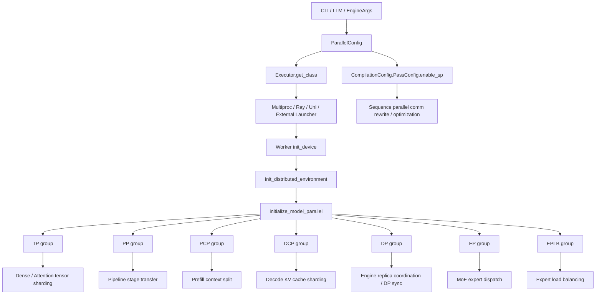
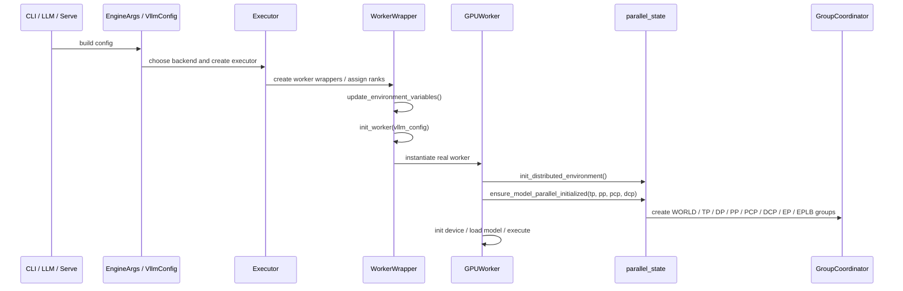

# vLLM 分布式并行设计分析报告

## 1. 报告范围

本文结合当前 vLLM 仓库代码与配套文档，对以下并行能力的设计逻辑做统一分析：

- DP（Data Parallel）
- TP（Tensor Parallel）
- EP（Expert Parallel）
- CP（Context Parallel）
- SP（Sequence Parallelism）

这里先给出最重要的结论：

> 在当前 vLLM 框架中，DP、TP、EP、CP 并不是同一层面的“几种并列并行方式”；其中 CP 还要拆成 PCP 与 DCP 两种机制，而 SP 也不是一个和 DP/TP/EP 同层的部署维度，而更像编译/运行时优化语义。

因此，如果要理解 vLLM 的并行架构，不能只看参数名，而必须同时看三层：

1. 用户配置层：CLI / `EngineArgs` / `ParallelConfig`
2. 运行时拓扑层：进程、worker、process group、executor
3. 模型执行层：attention、MoE、KV cache、编译优化与通信模式

---

## 2. 总体架构视角

从服务和执行职责上看，vLLM 大体分成三层：

1. 前端层：API server / `LLM` / `AsyncLLMEngine`
2. 调度层：`EngineCore` / scheduler / KV cache manager
3. 执行层：executor / worker / GPU model runner

并行能力分别落在不同层：

- DP 更偏“engine/core 复制 + 请求分发”
- TP / PP / PCP / DCP 更偏“单个 engine 内部的 worker 与 process group 拓扑”
- EP 更偏“MoE 层内部的专家路由与通信拓扑”
- SP 更偏“TP 路径上的编译 / 通信优化策略”

这也是为什么用户文档中经常把 TP、DP、EP、CP 分开介绍，但代码实现里它们实际上会在 `ParallelConfig`、`parallel_state`、MoE kernel、attention backend 中交叉组合。

---

## 3. 术语边界：先把几个容易混淆的概念分开

### 3.1 DP、TP、EP、CP 不是同质概念

- TP：把单个模型副本的张量或层内计算切到多个 GPU 上。
- DP：复制 engine / model 副本，让不同 rank 处理不同请求批次。
- EP：只对 MoE expert 层做分片，不等于整模型都转成 EP。
- CP：解决长上下文场景下 prefill 或 decode 的上下文扩展问题。

### 3.2 当前代码中的 CP 其实分成两种

在当前代码里，用户说的 “CP” 对应两套配置：

- `prefill_context_parallel_size`，简称 PCP
- `decode_context_parallel_size`，简称 DCP

对应 CLI 参数定义在：

- `vllm/engine/arg_utils.py:819` `--decode-context-parallel-size` / `-dcp`
- `vllm/engine/arg_utils.py:832` `--prefill-context-parallel-size` / `-pcp`

所以在报告中，把 CP 直接写成一个单一维度是不准确的；更准确的说法是：

> vLLM 当前把 context parallel 拆成了 prefill context parallel（PCP）和 decode context parallel（DCP）两条实现线。

### 3.3 SP 不是一个一等部署维度

当前仓库里，SP 至少有两种相关但不完全相同的语义：

1. 编译期 `SequenceParallelismPass`
2. MoE / TP 运行时里的 sequence-parallel token 处理语义

其中更直接、清晰的定义在：

- `vllm/config/compilation.py:124` `PassConfig.enable_sp`
- `vllm/compilation/passes/fusion/sequence_parallelism.py`

也就是说，在当前 vLLM 中：

> SP 更像是 TP 路径上的编译/通信优化开关，而不是像 DP/TP/EP/PCP/DCP 那样由 `ParallelConfig` 明确声明的部署维度。

---

## 4. 配置入口：并行参数是如何进入系统的

用户侧最直接的入口是 CLI / `EngineArgs` / `LLM(...)`。

### 4.1 CLI 参数入口

`vllm/engine/arg_utils.py:796` 开始定义了并行相关参数，核心包括：

- `--tensor-parallel-size` / `-tp`
- `--pipeline-parallel-size` / `-pp`
- `--data-parallel-size` / `-dp`
- `--enable-expert-parallel` / `-ep`
- `--decode-context-parallel-size` / `-dcp`
- `--prefill-context-parallel-size` / `-pcp`
- `--cp-kv-cache-interleave-size`
- `--enable-eplb`
- `--all2all-backend`
- `--distributed-executor-backend`

这说明 vLLM 的并行设计不是散落在不同模块里“隐式推断”，而是统一汇聚到 `ParallelConfig`。

### 4.2 `ParallelConfig` 是中心配置对象

`vllm/config/parallel.py:93` 定义了 `ParallelConfig`，里面直接声明了：

- `pipeline_parallel_size`
- `tensor_parallel_size`
- `prefill_context_parallel_size`
- `data_parallel_size`
- `enable_expert_parallel`
- `enable_eplb`
- `decode_context_parallel_size`
- `cp_kv_cache_interleave_size`

除此之外，DP 的在线部署模式、EP 的负载均衡、elastic EP、DBO、分布式 backend 选择，也都落在同一个配置对象里。

这意味着：

> 从配置模型上看，vLLM 把 TP/PP/PCP/DCP/DP/EP 当作一个统一的“并行拓扑描述”，而不是彼此独立的插件。

### 4.3 `LLM(...)` 对 DP 做了额外边界约束

`vllm/entrypoints/llm.py:323` 有一个非常重要的限制：

如果直接在单进程 `LLM(...)` 中设置 `data_parallel_size > 1`，且不是 `external_launcher`，就会直接报错，并提示用户使用 `examples/offline_inference/data_parallel.py`。

这说明 DP 在 vLLM 当前实现里，并不是“单个进程多复制几份模型”那么简单，而是要求显式的多进程/多 engine 运行拓扑。

---

## 5. TP：单个 engine 内的基础模型切分维度

### 5.1 用户侧语义

用户文档 `docs/serving/parallelism_scaling.md` 给出的主线非常明确：

- 单节点多卡时，优先使用 TP
- 多节点时，可以结合 TP + PP
- `tensor_parallel_size` 通常对应“每个副本内部用多少 GPU 切模型”

这也是 vLLM 当前分布式设计里最基础的一条主线。

### 5.2 运行时语义

`vllm/distributed/parallel_state.py:1476` 的 `initialize_model_parallel()` 会先按：

```python
all_ranks = torch.arange(world_size).reshape(
    -1,
    data_parallel_size,
    pipeline_model_parallel_size,
    prefill_context_model_parallel_size,
    tensor_model_parallel_size,
)
```

然后通过 `view` / `transpose` / `reshape` 构造 TP group：

- `vllm/distributed/parallel_state.py:1556` `group_ranks = all_ranks.view(-1, tensor_model_parallel_size).unbind(0)`

这说明 TP 在代码里是最基础的模型并行轴之一，也是很多后续机制的基础：

- pipeline 中间张量传输可以结合 TP group 做 all-gather 优化
- DCP 直接复用 TP 的 GPU 集合
- SP 的编译优化主要也发生在 TP 通信模式上

### 5.3 TP 的 executor / worker 落点

`vllm/v1/executor/multiproc_executor.py:110` 明确要求：

```python
world_size == tp_size * pp_size * pcp_size
```

再结合 `gpu_worker.py:945` 的：

```python
ensure_model_parallel_initialized(tp, pp, pcp, dcp)
```

可以看出：

> 单个 engine 内部 worker 的主拓扑，是以 TP × PP × PCP 为基础展开的；DCP 不是增加 worker 数量，而是在已有 GPU 之上进一步复用与切分。

---

## 6. DP：engine/core 复制与请求分发维度

### 6.1 用户侧语义

`docs/serving/data_parallel_deployment.md:3` 对 DP 的定义是：

> 模型权重复制到多个独立实例/GPU 上，不同实例处理独立请求批次。

从这个定义上看，DP 更像“服务副本并行”。

### 6.2 但 vLLM 里的 DP 不是完全独立副本

`docs/serving/data_parallel_deployment.md:9-16` 指出，对于 MoE 场景，DP rank 之间并不是完全独立：

- forward pass 需要对齐
- expert 层需要跨 rank 同步
- 某些 rank 没有请求时，还需要 dummy forward 保持对齐

因此，vLLM 的 DP 不能简单理解成训练框架里那种“梯度同步式 DP”，也不能简单理解成“完全独立的服务副本”。更准确的说法是：

> DP 在 vLLM 中是一种 engine/core 复制与请求分发维度，但在 MoE + TP/EP 组合下，又会和内部集体通信强耦合。

### 6.3 当前实现中的 DP 运行时逻辑

`parallel_state.py:1536-1542` 里有一段特别关键的注释：

- `ExternalDP` 是不属于模型本体的外层数据并行维度
- `DP` 是模型内的一层数据并行维度
- 同一个 DP group 里的 rank 必须一起调用 generate，否则可能 deadlock

这段注释实际上说明了 vLLM 对 DP 的一个核心设计判断：

1. 有些“副本级并行”是服务外层路由意义上的
2. 有些“副本级并行”在模型内部仍然要保持协同

### 6.4 DP 的同步逻辑为什么存在

`vllm/v1/worker/dp_utils.py` 展示了 DP 运行时同步的真正作用：

- 通过 `all_reduce` 协调各 DP rank 的 token 数量
- 决定是否统一 microbatch
- 决定是否需要 padding
- 同步 cudagraph mode

这说明 DP 的职责不只是“分流请求”，还包括：

> 保证多个 DP rank 在执行步长、padding、microbatch 和图模式上保持一致，避免 collective 通信失配。

### 6.5 DP 的部署模式

当前文档把在线 DP 部署分成三类：

1. Internal LB
2. Hybrid LB
3. External LB

这三种模式都在 `docs/serving/data_parallel_deployment.md` 中有详细说明。它们的关键差别不是并行数学本身，而是：

- 请求由谁路由
- API server 是否单点
- DP rank 是不是单独暴露 endpoint

这说明 vLLM 的 DP 同时具有两层属性：

- 计算拓扑属性
- 服务编排属性

---

## 7. EP：只作用于 MoE expert 层的并行维度

### 7.1 用户侧定义

`docs/serving/expert_parallel_deployment.md:3` 给出的定义非常直接：

> EP 用于把 MoE 模型中的 experts 部署到不同 GPU 上，从而提升 locality、效率和吞吐。

这里最重要的是“experts”，不是整模型。

### 7.2 EP 不等于把整模型从 TP 改成 EP

文档 `expert_parallel_deployment.md:46-66` 说明：

- 开启 EP 后，expert 层走 EP
- attention 层仍然按 TP 或 DP 的方式处理

也就是说，EP 的设计逻辑是分层的：

- dense / attention 路径保留原有 TP/DP 拓扑
- MoE expert 路径切到 EP 拓扑

### 7.3 代码中的 EP group 是如何构造的

`parallel_state.py:1654-1663` 中：

```python
group_ranks = (
    all_ranks.transpose(1, 2)
    .reshape(-1, data_parallel_size * prefill_context_model_parallel_size * tensor_model_parallel_size)
    .unbind(0)
)
```

这意味着当前代码里的 EP 规模更准确地说是：

> `EP size` 与 `DP × PCP × TP` 相关，而不只是很多文档里简化描述的 `DP × TP`。

因此，如果报告只写“EP = TP × DP”，在 `PCP > 1` 的情况下就不够准确。

### 7.4 EP 在 MoE 层中的落点

`vllm/model_executor/layers/fused_moe/layer.py:359-374` 中，MoE 层会读取：

- `tp_size_`
- `dp_size_`
- `pcp_size_`
- `is_sequence_parallel`

然后构造 `FusedMoEParallelConfig`。

接着在 `layer.py:423-467` 中：

- 如果 `use_ep` 为真，则按 `ep_rank` / `ep_size` 计算本地 expert 映射
- 如果开启 `EPLB`，还会附加专家重排与冗余专家策略

这说明 EP 的核心设计不是“额外建一个 group 就结束”，而是：

1. 在 process group 层构造 `_EP`
2. 在 MoE 层根据 `ep_rank/ep_size` 重新映射专家
3. 在通信层为 expert token dispatch/combine 提供 all2all 路径

### 7.5 EP 的通信语义

`vllm/distributed/device_communicators/all2all.py:161` 和 `:196` 展示了一个关键分支：

- `is_sequence_parallel=True` 时，使用 `get_ep_group()`
- 否则使用 `get_dp_group()`

这说明在 MoE 路径里，究竟沿哪一组做 all-gather / reduce-scatter，并不是固定的，而取决于是否处在 sequence-parallel 语义下。

这也是 EP 和 SP 容易混淆的原因之一。

### 7.6 EPLB 的意义

`ParallelConfig` 里还有：

- `enable_eplb`
- `eplb_config`

`parallel_state.py:1682-1711` 会为 EPLB 单独创建 `_EPLB` group，即使 rank 列表与 `_EP` 相同，也要单独隔离出来，避免和 MoE forward collectives 混在一起导致死锁。

因此：

> EP 解决“专家怎么分”，EPLB 解决“专家负载如何动态均衡”。

---

## 8. CP：上下文并行在当前 vLLM 中被拆成 PCP 和 DCP

### 8.1 为什么要拆两条线

`docs/serving/context_parallel_deployment.md:3-6` 直接给出原因：

- prefill 和 decode 的特征不同
- prefill 更关心 TTFT
- decode 更关心 KV cache 容量和吞吐

所以 vLLM 没有使用一个统一 CP 方案，而是明确拆成：

- PCP：prefill context parallel
- DCP：decode context parallel

### 8.2 PCP：预填充阶段的上下文并行

文档中 PCP 的核心思想是：

- 对一个长 prompt 的新 token 按 chunk 切分
- 不同 GPU 计算不同 chunk 的 query/key/value
- 目标是把长 prefill 的计算成本摊到更多 GPU 上

当前文档明确说：

- partial query + full key/value
- partial query + partial key/value（ring attention 等）

两种路径都还在发展中。

在代码层，PCP 通过 `prefill_context_parallel_size` 进入：

- `ParallelConfig`
- `_PCP` process group
- KV slot / block table / capacity 统计逻辑

`cp_utils.py:38-43` 还说明了 PCP 的一个重要边界：

> PCP 需要 attention implementation 显式声明支持，否则直接报错。

### 8.3 DCP：解码阶段的上下文并行

`context_parallel_deployment.md:21-31` 指出 DCP 的核心是：

> 沿着上下文长度 T 维度分片 KV cache，以减少 TP 带来的 KV cache duplication。

最关键的一句在 `docs/serving/context_parallel_deployment.md:27`：

> `-dcp` 不增加 GPU 数量，只是减少 KV cache duplication。

这与代码完全一致：

- `ParallelConfig.decode_context_parallel_size` 的注释明确说 world size 不变，只是复用 TP group 的 GPU
- `parallel_state.py:1573-1576` 也明确写了 DCP 复用 TP group，并把一个 TP group 再切成多个 DCP group

这是当前 vLLM 并行架构里最容易误解的一点之一。

### 8.4 DCP 的约束条件

`ParallelConfig._validate_parallel_config()` 中有硬约束：

```python
tp_size % dcp_size == 0
```

即 `vllm/config/parallel.py:384-393`。

文档和 Oracle 结果还提示了一个更细的模型约束：

- 对非 MLA 的 GQA/MQA，DCP 上界还受 KV head 数量约束

因此在报告里，DCP 不能被描述成“想开多大就开多大”的通用切分维度。

### 8.5 CP 的 KV cache 实现逻辑

CP 对运行时的最大影响之一在 KV cache：

- `vllm/v1/worker/block_table.py`
- `vllm/v1/worker/gpu/block_table.py`
- `vllm/v1/attention/backends/utils.py`

这些代码共同说明：

1. 逻辑上会计算 `total_cp_rank = pcp_rank * dcp_size + dcp_rank`
2. KV slot 通过 `cp_kv_cache_interleave_size` 进行交错映射
3. DCP 需要 local seq len / local KV slot 的专门准备逻辑

因此 CP 不是 scheduler 层面再多一层“调度器”，而是：

> 通过 process group、KV 布局、attention backend 能力和 interleave 策略，把上下文相关的存储与计算拆散到多个 rank。

---

## 9. SP：编译与通信优化语义，而不是部署维度

### 9.1 配置入口

`vllm/config/compilation.py:124` 中：

```python
enable_sp: bool = Field(default=None)
```

注释写得很清楚：

- Enable sequence parallelism
- Requires TP > 1

也就是说 SP 首先是编译配置的一部分，而不是 `ParallelConfig` 的一个 field。

### 9.2 具体实现方式

`vllm/compilation/passes/fusion/sequence_parallelism.py` 的核心逻辑，是把 TP 路径上的一些 `all_reduce` 模式，重写成：

- `reduce_scatter`
- 局部计算
- `all_gather`

例如：

- `FirstAllReduceRMSNormPattern`
- `MiddleAllReduceRMSNormPattern`

从设计上看，SP 在当前仓库里的含义更接近：

> 沿 token / sequence 维度做局部化计算，并通过 TP 组的通信重写减少部分冗余。

### 9.3 SP 与 EP 的交叉点

`ParallelConfig.use_sequence_parallel_moe` 里有很关键的注释：

- 如果 attention 结束时做 all-reduce，则 token 会在 TP rank 上复制
- 在 EP + DeepEP all2all 场景下，复制 token 会导致重复计算与通信
- 所以此时希望 expert 输入保持 sequence parallel

这意味着 SP 在当前 vLLM 中还有第二层含义：

> 它不只是一个编译 pass，也是一种避免 TP 复制 token、减轻 MoE dispatch/combine 冗余的运行时语义。

因此，报告里最安全的表述是：

> SP 在当前代码里并不是单一概念；最稳定的理解方式是，把它看成 TP/EP 路径上的 sequence-sharded 优化语义，而不是和 DP/TP/EP/CP 同层的部署轴。

---

## 10. 进程组初始化逻辑：并行数学如何变成运行时拓扑

`vllm/distributed/parallel_state.py:1476` 的 `initialize_model_parallel()` 是理解整个并行框架的关键。

### 10.1 rank 布局的中心公式

当前代码用一个 5 维 reshape 构造整体拓扑：

```python
all_ranks = torch.arange(world_size).reshape(
    -1,
    data_parallel_size,
    pipeline_model_parallel_size,
    prefill_context_model_parallel_size,
    tensor_model_parallel_size,
)
```

作者注释把这个布局解释为：

- ExternalDP × DP × PP × PCP × TP

这实际上已经说明了设计哲学：

1. 外层还允许有“与模型无关的 replica 级并行”
2. 模型内部则统一映射为 DP / PP / PCP / TP 几个轴
3. DCP 则在 TP 这条线上进一步复用 GPU

### 10.2 各 group 的生成方式

从这个 `all_ranks` 出发，代码依次构造：

- `_TP`
- `_DCP`
- `_PCP`
- `_PP`
- `_DP`
- `_EP`
- `_EPLB`

生成方法统一是：

1. 把目标维度转到最后
2. reshape 成二维
3. unbind 拿到每个 group 的 rank list

这说明 vLLM 的并行组设计非常系统，而不是各模块各自拉 group。

### 10.3 DCP 为什么不增加 world size

代码注释 `parallel_state.py:1573-1576` 明确指出：

- DCP 复用 TP group 的 GPU
- 并不会改变 world size
- 只是把一个 TP group 再切成 `tp_size // dcp_size` 个 DCP group

这句话是写 DCP 报告时必须保留的。

### 10.4 EP 与 EPLB 为什么要单独建组

当前代码即使 EP 与 EPLB 使用相同 rank 列表，也会给 EPLB 单独建 `_EPLB` group。原因在注释里也写得很清楚：

- 隔离 EPLB 通信
- 避免与 MoE forward pass 的 collective 混用导致死锁

这说明 vLLM 在并行设计上不只是关心“功能是否可实现”，还强依赖 process group 隔离来保证通信安全。

---

## 11. executor / worker 如何承接并行拓扑

### 11.1 executor 负责把配置变成执行拓扑

`vllm/v1/executor/abstract.py:47` 的 `Executor.get_class()` 负责根据 `distributed_executor_backend` 选择：

- `RayDistributedExecutor`
- `MultiprocExecutor`
- `UniProcExecutor`
- `ExecutorWithExternalLauncher`

这说明 executor 是“并行运行时后端”的统一入口。

### 11.2 MultiprocExecutor 的假设

`vllm/v1/executor/multiproc_executor.py:110-116` 明确写了：

```python
world_size == tp_size * pp_size * pcp_size
```

这再次证明：

- 单个 engine 内部 worker 数主要由 TP × PP × PCP 决定
- DCP 是复用维度，不新增 worker 数
- DP 则是 engine 级别扩展，而不是单 executor 内部简单复制 worker

### 11.3 worker 初始化时真正建立并行组

`gpu_worker.py:924-950` 中：

1. `init_distributed_environment(...)`
2. `ensure_model_parallel_initialized(tp, pp, pcp, dcp)`

也就是说，所有配置最终都要落到 worker 启动阶段，转化成真实的 process group。

因此在设计上可以总结为：

> `ParallelConfig` 负责描述拓扑，executor 负责选择运行时后端和拉起 worker，`parallel_state` 负责真正把 rank 拆成 TP/PP/DP/EP/PCP/DCP 组。

---

## 12. 各并行模式如何组合

### 12.1 TP + PP

这是当前最标准的“单副本内模型切分”组合。

- TP 负责层内切分
- PP 负责层间切分

用户文档 `parallelism_scaling.md` 也把它作为大模型跨节点扩展的主线。

### 12.2 DP + TP

在 vLLM 中，这是“多 engine 副本 + 每个 engine 内部再做张量切分”的典型组合。

`docs/serving/data_parallel_deployment.md:13-15` 直接说明：

- 每个 DP rank 对应一个 core engine
- 每个 DP engine 内有 `TP size` 个 per-GPU worker

### 12.3 DP + EP + TP

这是 MoE 场景的核心组合：

- attention 层可以维持 TP / DP 语义
- expert 层改为 EP
- DP rank 之间还需要 forward 同步和 dummy batch 协调

这也是 vLLM 当前并行设计最复杂的一块。

### 12.4 TP + DCP

这是 decode 长上下文场景的关键组合：

- 先用 TP 沿 head 维度切分 KV cache
- 再用 DCP 沿 token / context 维度降低 KV duplication

当前文档明确建议：

> 先调 TP，再考虑加 DCP。

### 12.5 PCP + DCP + TP

从 `ParallelConfig` 与 `parallel_state` 的建组方式看，当前框架允许 PCP、DCP、TP 同时存在；但从 CP 兼容性检查与 KV cache manager 的限制来看，并不是所有 backend、所有注意力实现、所有 KV cache 协调器都完全支持。

因此最安全的表述是：

> 从拓扑设计上，vLLM 支持 PCP/DCP 与 TP 的组合；但从当前实现成熟度看，这部分仍有明显 backend 和 feature 限制。

---

## 13. 当前实现中的关键限制与注意事项

### 13.1 同一 DP group 必须协同进入 generate

`parallel_state.py:1539-1542` 已经明说：否则可能 deadlock。

这说明 DP 在当前实现里不是完全松耦合的。

### 13.2 DCP 有明确上界和整除约束

至少有：

- `tp_size % dcp_size == 0`
- 对某些模型结构，还会进一步受 KV head 数影响

### 13.3 PCP 需要 attention backend 显式支持

`cp_utils.py:38-43` 明确要求 `supports_pcp`。

### 13.4 DCP 需要 decode attention 返回 LSE

`cp_utils.py:30-36` 明确要求 `need_to_return_lse_for_decode`。

### 13.5 SP 不能写成“一个统一开关”

因为当前仓库里至少同时存在：

- 编译期的 `enable_sp`
- MoE/EP 语义里的 sequence-parallel token 路径

### 13.6 EP 与 EPLB 不是“顺手加个策略”

它们会影响：

- process group 拓扑
- MoE expert 映射
- all2all backend
- 冗余专家内存占用
- 死锁隔离策略

所以在工程上，EP/EPLB 是一整套运行时机制，而不是一个轻量 flag。

---

## 14. 设计逻辑总结

可以把当前 vLLM 的并行设计概括成下面这套逻辑。

### 14.1 第一层：服务副本与 engine 复制

- 主要由 DP 体现
- 目标是扩大吞吐、并行处理不同请求
- 但在 MoE 场景下不完全独立，还要协调 forward

### 14.2 第二层：单个 engine 内的模型切分

- TP：层内切分
- PP：层间切分
- PCP：prefill 长上下文切分
- DCP：decode KV cache 沿上下文维度切分

### 14.3 第三层：模型内部结构特化并行

- EP：只作用于 MoE expert 层
- EPLB：在 EP 基础上做动态均衡

### 14.4 第四层：编译与通信优化

- SP：更像 TP/EP 路径上的 sequence-parallel 优化语义
- DBO / ubatch / async scheduling：进一步在运行时重叠通信与计算

因此，从设计哲学上讲，当前 vLLM 不是“提供了几种并列并行模式”，而是：

> 构造了一个分层并行体系：最外层是请求与副本，内层是模型切分，再内层是结构特化并行，最底层再叠加编译与通信优化。

---

## 15. 并行关系时序图

下面给出一个简化的关系图，用来帮助理解配置到运行时的映射。



---

## 16. 关键源码与文档索引

- 配置入口：`vllm/engine/arg_utils.py`
- 并行核心配置：`vllm/config/parallel.py`
- 顶层配置校验：`vllm/config/vllm.py`
- 编译与 SP：`vllm/config/compilation.py`
- SP pass：`vllm/compilation/passes/fusion/sequence_parallelism.py`
- 进程组初始化：`vllm/distributed/parallel_state.py`
- executor 抽象：`vllm/v1/executor/abstract.py`
- 多进程 executor：`vllm/v1/executor/multiproc_executor.py`
- worker 初始化：`vllm/v1/worker/gpu_worker.py`
- DP 同步：`vllm/v1/worker/dp_utils.py`
- CP 兼容性：`vllm/v1/worker/cp_utils.py`
- MoE / EP 落点：`vllm/model_executor/layers/fused_moe/layer.py`
- EP all2all：`vllm/distributed/device_communicators/all2all.py`
- 并行总览文档：`docs/serving/parallelism_scaling.md`
- DP 部署文档：`docs/serving/data_parallel_deployment.md`
- EP 部署文档：`docs/serving/expert_parallel_deployment.md`
- CP 部署文档：`docs/serving/context_parallel_deployment.md`
- 离线 DP 示例：`examples/offline_inference/data_parallel.py`

---

## 17. vLLM 分布式代码设计逻辑

前面的章节更多是在讲“并行模式是什么”。如果从代码工程视角继续往下追，当前 vLLM 的分布式代码其实可以概括成一条非常清晰的分层链路：

1. 配置描述层
2. 前后端编排层
3. 分布式运行时层
4. worker 执行层
5. 通信抽象层

这个分层对后续移植特别重要，因为它意味着：

> vLLM 的分布式能力并不是散落在模型代码里，而是被拆成了若干相对清晰的责任边界；移植时应该优先识别这些边界，而不是直接在模型层硬改。

### 17.1 配置描述层：先用 `VllmConfig` 把分布式拓扑描述完整

`docs/design/arch_overview.md:213-227` 强调了 vLLM 的一个核心设计选择：

- 所有主要类都接收统一的 `VllmConfig`
- 新能力优先作为 config 扩展进入系统
- 这样下游的 engine、worker、model runner 可以直接读取配置，而无需层层改 constructor

这与分布式代码的实际结构是对齐的：

- 并行参数进入 `EngineArgs`
- 再汇聚到 `ParallelConfig`
- 最后成为 `VllmConfig` 的一部分，被 executor / worker / model runner 统一读取

因此，从工程设计角度看：

> vLLM 的分布式代码首先是“配置驱动”的，而不是“在若干模块里临时判断是否开 TP/DP/EP”。

### 17.2 前后端编排层：API server、EngineCore、DPCoordinator 分工清晰

`docs/design/arch_overview.md:81-143` 已经给出了 V1 多进程架构的总图景：

- API server 负责 HTTP、输入处理、输出回传
- Engine core 负责 scheduler、KV cache、调度循环
- GPU worker 负责真正执行模型
- DP coordinator 在 DP>1 时负责协调

如果进一步看代码：

- `vllm/v1/engine/coordinator.py` 中 `DPCoordinator` 的职责是收集各 DP engine 的状态、维护 request wave、在需要时广播 `START_DP_WAVE`
- `vllm/v1/engine/core_client.py:1361-1385` 中 `DPLBAsyncMPClient.get_core_engine_for_request()` 负责按 waiting/running 队列长度打分做 DP engine 路由

这说明当前分布式设计刻意把两类逻辑拆开了：

1. **请求该发给哪个 engine**：由 client / coordinator 这一侧决定
2. **engine 内部每一步怎么调度 token / KV blocks**：由 `EngineCore` 和 scheduler 决定

所以从架构上讲，DP 的前端负载均衡层与后端 token 调度层是分离的，这对插件移植非常重要。

### 17.3 分布式运行时层：`parallel_state` 是统一的 group 工厂

当前仓库中，`vllm/distributed/parallel_state.py` 是分布式运行时的核心中枢。它承担三件事：

1. 初始化 torch distributed 环境
2. 建立 vLLM 自己的 world / TP / DP / PP / PCP / DCP / EP / EPLB groups
3. 通过 `GroupCoordinator` 统一包装 device group、cpu group、消息广播等能力

这意味着：

> 从代码组织上看，vLLM 并没有让每个功能模块自己创建 process group，而是收敛到 `parallel_state` 这一层来生成和管理通信拓扑。

这是非常典型的“中心化分布式状态管理”设计。

### 17.4 worker 执行层：executor 负责拉起，worker 负责落地

`Executor.get_class()` 负责根据 backend 选择具体 executor，`MultiprocExecutor` / `RayDistributedExecutor` 再负责：

- rank 分配
- worker 进程创建
- 环境变量与 init method 准备
- 把 `vllm_config` 下发给 worker

真正进入设备和 group 初始化的是 worker 侧：

- `gpu_worker.py:924-950` 先 `init_distributed_environment(...)`
- 再 `ensure_model_parallel_initialized(tp, pp, pcp, dcp)`

因此，分布式设计逻辑可以总结成一句话：

> executor 负责“把拓扑启动起来”，worker 负责“把拓扑绑定到设备和执行代码上”。

### 17.5 通信抽象层：不仅有 torch group，还有 vLLM 自己的协调包装

`parallel_state.py` 中的 `GroupCoordinator` 并不是简单保存一个 `ProcessGroup`，而是同时管理：

- `device_group`
- `cpu_group`
- 可选 `device_communicator`
- 可选 MQ broadcaster

而 `vllm/distributed/utils.py` 与 `vllm/distributed/stateless_coordinator.py` 又进一步引入了：

- `StatelessProcessGroup`
- `StatelessGroupCoordinator`

这些对象的意义在于：

- 把“元数据协调”和“数据面通信”区分开
- 允许某些 group 脱离 torch WORLD 独立创建
- 为 elastic EP 这类动态拓扑调整提供基础

所以 vLLM 分布式代码的一个很重要特点是：

> 它不是直接裸用 `torch.distributed`，而是在其上再封装了一层更贴近推理场景的 group / communicator 语义。

---

## 18. 分布式初始化顺序：代码是怎样一步步搭起来的

从代码调用关系看，当前 vLLM 分布式路径可以简化成下面这条流程：



这个流程里有几个关键点。

### 18.1 rank 与 worker 先解耦，再绑定

`vllm/v1/worker/worker_base.py:214-228` 显示：

- `WorkerWrapper` 先以 `rpc_rank` 的形式存在
- executor 可以先调用 `adjust_rank()` 修正 rank
- 再通过 `update_environment_variables()` 写入环境
- 最后才真正 `init_worker()`

这说明 vLLM 的设计不是“进程一启动就死绑 rank”，而是给 executor 一层 rank 重排和环境准备空间。这对 Ray、多 executor 组合、SPMD 风格离线场景都很重要。

### 18.2 插件与 worker 初始化发生得很早

`worker_base.py:246-248` 中，`init_worker()` 会调用：

```python
from vllm.plugins import load_general_plugins
load_general_plugins()
```

这说明当前框架已经预留了“插件在 worker 初始化阶段接入”的钩子，而不是等模型开始执行后再动态补丁。

### 18.3 group 初始化之后，后续模块只消费抽象接口

一旦 `parallel_state` 建完组，后续模块一般不直接关心底层 torch distributed 初始化细节，而是通过：

- `get_tp_group()`
- `get_dp_group()`
- `get_ep_group()`
- `get_pp_group()`
- `get_dcp_group()`
- `get_pcp_group()`

去获取抽象后的 coordinator/group 对象。

这对插件移植的意义非常大，因为它意味着只要 group 抽象保持稳定，很多上层模块不需要知道后端是 NCCL、Gloo、stateless group，还是你们自研通信实现。

---

## 19. 为移植到自研 vLLM 插件提供技术支持：哪些边界该保留，哪些点适合替换

如果目标是把当前 vLLM 的分布式能力移植到你们自己的 vLLM 插件体系中，最重要的不是“把所有 distributed 代码都复制过去”，而是先识别哪些边界是稳定抽象，哪些边界是实现细节。

### 19.1 优先保留的核心边界

第一类是建议优先保留的“稳定接口层”。

**配置边界**：

- `EngineArgs -> ParallelConfig -> VllmConfig`
- 这是所有分布式能力进入系统的统一入口
- 如果插件要增加新能力，优先新增 config，而不是在 worker/model 里硬编码环境变量

**运行时边界**：

- `Executor`
- `WorkerWrapper`
- `WorkerBase`
- `GroupCoordinator`

这些类构成了“分布式拓扑如何被创建并下发给执行层”的主干。

**消费边界**：

- `get_tp_group()` / `get_dp_group()` / `get_ep_group()` 等 accessor

上层模块若依赖这些 accessor，而不是直接依赖 torch group，本身就更适合插件化替换。

### 19.2 最适合做插件替换的点

基于当前代码，后续插件化最适合替换或扩展的点主要有四类。

**1）executor 后端**

`Executor.get_class()` 已经允许通过配置选择不同 executor backend，说明“进程怎么拉起、怎么跨机编排”本身就是一个可替换层。

**2）worker 类与 worker 扩展类**

`ParallelConfig.worker_cls` 和 `worker_extension_cls` 允许替换 worker 实现或给 worker 注入额外方法，这对自研设备、通信库、监控逻辑接入都很关键。

**3）device communicator / platform 相关实现**

`StatelessGroupCoordinator` 里会通过 `current_platform.get_device_communicator_cls()` 解析设备通信类。这意味着设备通信抽象是留有平台扩展口的。

**4）stateless group 与 metadata 协调路径**

`distributed/utils.py` 与 `stateless_coordinator.py` 已经把一部分“控制面协调”从 torch WORLD 解耦出来，这正是做插件化通信后端时最有价值的基础设施。

### 19.3 不建议轻易破坏的部分

如果后续要移植，以下部分不建议直接改成“看起来更简单”的实现。

**1）`parallel_state` 的中心化 group 管理**

如果把建组逻辑分散回各个模块，后续很容易出现：

- rank 计算不一致
- collective 模式不一致
- 功能组合时死锁难排查

**2）DP coordinator 与 core client 的职责拆分**

当前设计把“请求路由”和“token 调度”拆开，这是为了避免服务编排层和执行调度层耦合过深。插件移植时，如果把两者重新揉在一起，后期很容易变成难维护的特判系统。

**3）stateless group 这类控制面抽象**

它们看起来复杂，但实际上是 elastic EP、跨 group 独立创建、metadata 协调的重要基础。如果插件未来也有弹性扩缩或自研通信面，这层抽象通常值得保留。

### 19.4 建议的移植顺序

如果你们后续要做插件化移植，一个更稳妥的顺序是：

1. 先保留 `ParallelConfig` 与 `VllmConfig` 的整体入口
2. 保留 `parallel_state` 的 group 构建逻辑
3. 先接通你们自己的 executor / worker / communicator 实现
4. 再逐步替换 control plane 或 data plane 通信细节
5. 最后再考虑优化路径，例如 elastic EP、stateless group、专用 all2all backend

这样做的原因是：

> vLLM 的分布式代码真正稳定的是“抽象边界”，不是每一处具体通信实现。

---

## 20. 面向插件移植的最终结论

如果只从功能角度看，vLLM 的分布式能力像是一组参数开关；但从代码设计角度看，它其实是一套分层非常明确的分布式运行时框架。

最值得把握的主线是：

1. `VllmConfig` 统一描述分布式拓扑
2. executor 负责把拓扑变成进程与 rank 布局
3. worker 负责把 rank 绑定到设备与执行逻辑
4. `parallel_state` 负责统一构造分布式 group
5. 上层模块通过 group accessor 与 communicator 抽象消费这些能力

因此，对后续移植到自研 vLLM 插件最有价值的不是某个单独文件，而是这套设计逻辑本身：

> 配置驱动、中心化 group 管理、executor/worker 分层、control plane 与 data plane 解耦、平台通信抽象可替换。

如果沿着这条主线做插件化改造，后续无论是替换底层通信后端、接入自研设备，还是做更强的多机编排，都会比直接改模型执行代码更稳、更容易维护。
