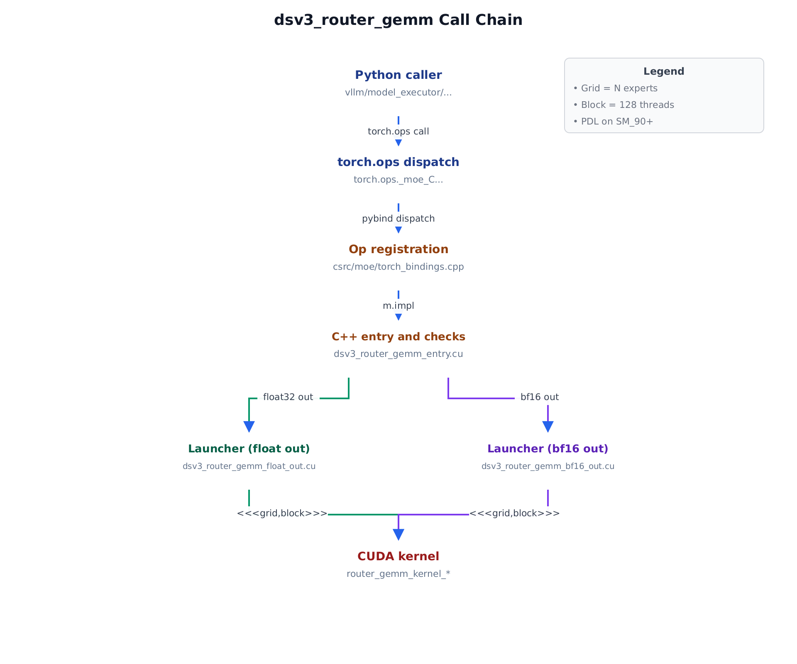
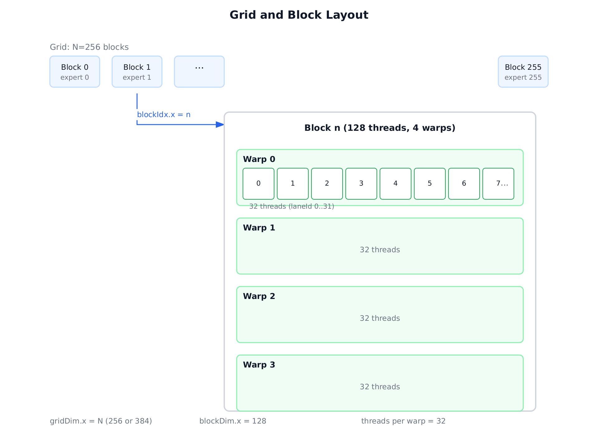
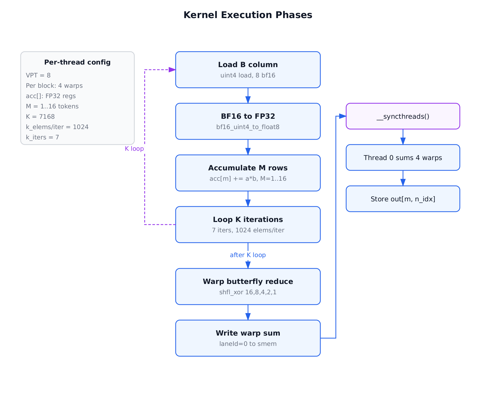
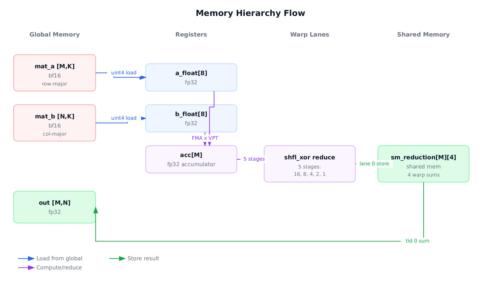

# `dsv3_router_gemm_float_out` 算子分析报告

> 面向刚学完 CUDA 入门课的同学。每个术语第一次出现都会一句话解释。

---

## 1. 算子总览

- **名字**：`router_gemm_kernel_float_output`
- **Python 入口**：`torch.ops._moe_C.dsv3_router_gemm(output, mat_a, mat_b)`（见 `csrc/moe/torch_bindings.cpp:133`）
- **C++ 调度**：`dsv3_router_gemm(...)` → `LoopUnroller<...>` → `invokeRouterGemmFloatOutput<T, kNumTokens, kNumExperts, kHiddenDim>`（`csrc/moe/dsv3_router_gemm_entry.cu`）
- **Kernel 本体**：`csrc/moe/dsv3_router_gemm_float_out.cu`
- **干的事**（一句话）：`output = mat_a @ mat_b^T`，其中 `mat_a[M, K]` 是 token 向量、`mat_b[N, K]` 是专家路由权重，输出 `out[M, N]` 是"每个 token 对每个专家的打分"。这是 MoE 层 *router* 在 decode 阶段每步都要算一次的 GEMV（矩阵-向量乘法）。
- **输入**：
  | 张量  | 形状                     | dtype    | 布局       |
  | ----- | ------------------------ | -------- | ---------- |
  | mat_a | `[M=1..16, K=7168]`      | bfloat16 | 行主序     |
  | mat_b | `[N=256 or 384, K=7168]` | bfloat16 | 行主序（在 kernel 里按 N-行 × K 当作"列主序的列"来读；详见 §3） |
- **输出**：`out[M, N]`，dtype=float32
- **模板常量**：`VPT=8`（每线程一轮处理的 bf16 元素数，由 `16 / sizeof(bf16)` 得）、`kBlockSize=128`、`kHiddenDim=7168`、`kNumExperts∈{256, 384}`、`kNumTokens∈[1,16]`。

**为什么这个 op 值得有一个专用 kernel？** —— MoE decode 时 M 很小（常为 1），普通 cuBLAS GEMM 在 M=1 时效率很差（batch 太小、利用不满 tensor core）。这里手写一个专门针对 "M≤16、K=7168、N=256/384、bf16" 场景的 GEMV 内核，把 K 维切给 block 内 128 个线程并行读，做极致的内存带宽利用。

---

## 2. Python → CUDA 调用链

这张图是阅读本报告的"地图"：下面每一节提到的文件都能在这里找到对应节点。
从用户层的 Python 调用一路向下到 `__global__` 函数共 5 跳，其中在 C++ 入口处
根据输出 dtype 分成两条并行的 launcher（float32 / bf16），最后合并到同一个
kernel 家族。

> 📊 **Figure 1 — Call Chain**：
>
> 

文字版（每一跳的关键信息）：

| #   | 层                 | 文件                                | 做的事                                                       |
| --- | ------------------ | ----------------------------------- | ------------------------------------------------------------ |
| 1   | Python caller      | `vllm/model_executor/.../fused_moe` | router 层前向里调用 `torch.ops._moe_C.dsv3_router_gemm(...)` |
| 2   | torch.ops dispatch | 运行时                              | PyTorch 按 device=CUDA 分派到 C++ 实现                       |
| 3   | Op registration    | `csrc/moe/torch_bindings.cpp:133`   | `m.def("dsv3_router_gemm(...)")` + `m.impl(..., &dsv3_router_gemm)` |
| 4   | C++ 入口 + 校验    | `csrc/moe/dsv3_router_gemm_entry.cu:101` | 检查形状/dtype/SM 版本；用 `LoopUnroller` 把 runtime `num_tokens` 展开成模板 |
| 5a  | Launcher (fp32 out)| `csrc/moe/dsv3_router_gemm_float_out.cu:174` | `invokeRouterGemmFloatOutput<...>`：配 `cudaLaunchConfig_t`、调 `cudaLaunchKernelEx` |
| 5b  | Launcher (bf16 out)| `csrc/moe/dsv3_router_gemm_bf16_out.cu` | 对应 bf16 输出的 launcher（结构完全相同）                    |
| 6   | CUDA kernel        | 同上 .cu 文件                       | `__global__ router_gemm_kernel_float_output<...>`（本次分析对象） |

**本报告聚焦 5a + 6 这条路径**（float32 输出版）。

## 3. Launch 配置（逐行摘抄）

```cpp
// csrc/moe/dsv3_router_gemm_float_out.cu:174-193
constexpr int VPT        = 16 / sizeof(T);    // bf16 → 8
constexpr int kBlockSize = 128;
cudaLaunchConfig_t config;
config.gridDim  = kNumExperts;                // 256 或 384
config.blockDim = kBlockSize;                 // 128
config.dynamicSmemBytes = 0;                  // 静态 smem，见 kernel 内 __shared__
config.stream = stream;

cudaLaunchAttribute attrs[1];
attrs[0].id  = cudaLaunchAttributeProgrammaticStreamSerialization;
attrs[0].val.programmaticStreamSerializationAllowed = getEnvEnablePDL();

cudaLaunchKernelEx(&config,
  router_gemm_kernel_float_output<T, kBlockSize, VPT,
                                  kNumTokens, kNumExperts, kHiddenDim>,
  output, mat_a, mat_b);
```

以 `N=256, M=4` 为例，每个维度的含义：

| 配置项                         | 具体值  | 代表什么                                              |
| ------------------------------ | ------- | ----------------------------------------------------- |
| `gridDim.x`                    | 256     | 一个 block 负责一个专家列（输出矩阵的一列）          |
| `gridDim.y / .z`               | 1       | 没用到                                                |
| `blockDim.x`                   | 128     | 一个 block 有 128 个线程 = **4 个 warp** × 32 lane    |
| 静态 shared memory            | 4×M×4B  | `sm_reduction[M][4]`，用于 4 个 warp 的跨 warp 归约   |
| `__launch_bounds__(128, 1)`   | —       | 编译器提示：每 block 128 线程、每 SM 至少 1 block    |
| PDL (SM_90+)                  | 可选    | Hopper 的 *Programmatic Dependent Launch*，让下一个 kernel 可以和这个重叠启动；见 §6 |

**总线程数** = `blocks × threads/block` = `N × 128` = 32 768（N=256）或 49 152（N=384）。GPU 的 108 个 SM（H100）一次跑不完所有 block —— block 会排队被 SM 取走，这对 GEMV 没关系，因为 block 之间没有依赖。

> 📊 **图 1 — Grid/Block 布局**：
>
> 

---

## 4. Thread → Data 映射（算术，不手波）

Kernel 开头：

```cpp
int const n_idx = blockIdx.x;          // 这个 block 负责的专家列
int const tid   = threadIdx.x;         // 0..127
T const*  b_col = mat_b + n_idx * kHiddenDim;   // 这一专家的 K 维权重起点
```

**关键观察**：`mat_b` 在内存里虽然是 `[N, K]` 行主序，但对于固定的 `n_idx`，`b_col[0..K)` 这 K 个元素是**连续**的。kernel 注释说"B is in column-major"其实指的是"相对于输出矩阵 `[M, N]` 来说 B 的 N 是列、K 是行"，不是物理布局。每个 block 只读 B 的一条长度 7168 的连续条，非常适合合并访问（coalesced access）。

每个线程处理 K 维里的哪些元素？

```
k_elems_per_k_iteration = VPT × blockDim.x = 8 × 128 = 1024
k_iterations            = kHiddenDim / 1024 = 7168 / 1024 = 7

for ki in [0, 7):
    k_base = ki * 1024 + tid * 8    // 线程 tid 在第 ki 轮读的起始下标
    读 b_col[k_base .. k_base+8)
    对每个 m in [0, M):
        读 mat_a[m, k_base .. k_base+8)
        acc[m] += 8 次 FMA 求和
```

**一句话总结**：
- **Block n_idx** 负责输出的第 n_idx 列（全部 M 行）。
- **Thread tid** 在 block 里覆盖 K 维下标 `{tid*8, tid*8+1, ..., tid*8+7}`、`{1024+tid*8, ...}`、…，一共 7×8 = 56 个 K 元素 × M 个 token = 每线程做 56·M 次 FMA。
- 同一个 warp 内 32 个线程读的是 `b_col[k_base..k_base+256)` 这段连续 256 个 bf16 = 512 字节 = 4 条 L1 cache line。这正是 **coalesced load**：一个 warp 的 32 个 128-bit 访存合成一次大事务。

**寄存器用量**（估算）：
- `acc[kNumTokens]`：M 个 float → 最多 16 个寄存器
- `a_float[8]`、`b_float[8]`：临时 16 个寄存器
- `k_bases[7]`：7 个 int
- 加上索引和编译器膨胀，大约 40–60 个 32-bit 寄存器/线程，离硬上限 255 很远 → 占用率不受寄存器限制。

---

## 5. 算法流程（分 phase）

> 📊 **图 2 — Kernel 执行阶段**：
>
> 

### Phase 0 — 初始化

```cpp
float acc[kNumTokens] = {};                          // 每线程 M 个 float 累加器清零
__shared__ float sm_reduction[kNumTokens][kNumWarps]; // M × 4 = 最多 64 个 float 共享内存
int k_bases[k_iterations];
#pragma unroll
for (int ki = 0; ki < k_iterations; ki++)
    k_bases[ki] = ki * k_elems_per_k_iteration + tid * VPT;
```

- **谁在做**：所有 128 线程（每个有自己的 `acc[]`、`k_bases[]`）。
- **在哪算**：`acc[]` 和 `k_bases[]` 都在寄存器里。
- `__shared__ sm_reduction` 只有一份，整个 block 共享。

### Phase 1 — `griddepcontrol.wait`（Hopper PDL，可选）

```cpp
#if __CUDA_ARCH__ >= 900
  asm volatile("griddepcontrol.wait;");
#endif
```

🟣 **初学者 sidebar — PDL (Programmatic Dependent Launch)**：Hopper（SM_90+）允许 kernel A 在刚启动、还没跑真正的依赖数据之前，先让 kernel B 开始准备。`griddepcontrol.wait` 是 kernel B 的"等 A 的数据真正 ready 的点"。在这里它让这个 kernel 可以和*上一个* kernel 在 SM 上重叠启动，减少 launch 延迟。只有设环境变量 `TRTLLM_ENABLE_PDL=1` 才启用（见 `getEnvEnablePDL()`）。

### Phase 2 — K 维主循环（每次 1024 元素，共 7 次）

```cpp
for (int ki = 0; ki < 7; ki++) {
  int const k_base = k_bases[ki];

  // ① 从 global 读 B 的 8 个 bf16（128-bit 向量化读）
  uint4 b_vec = *reinterpret_cast<uint4 const*>(b_col + k_base);

  // ② bf16 → fp32（8 次转换，全部展开）
  float b_float[VPT];
  bf16_uint4_to_float8<VPT>(b_vec, b_float);

  // ③ 对 M 行分别做点积累加
  #pragma unroll
  for (int m_idx = 0; m_idx < kNumTokens; m_idx++) {
    uint4 a_vec = *reinterpret_cast<uint4 const*>(
        mat_a + m_idx * kHiddenDim + k_base);
    float a_float[VPT];
    bf16_uint4_to_float8<VPT>(a_vec, a_float);

    #pragma unroll
    for (int k = 0; k < VPT; k++)
      acc[m_idx] += a_float[k] * b_float[k];   // ← 核心 FMA
  }
}
```

- **谁在做**：128 个线程同时，每人独立走一遍自己的 56 个 K 下标。
- **内存层次**：`mat_a / mat_b` 在 **global**；`a_vec / b_vec / a_float / b_float / acc` 在 **寄存器**；没有使用 shared memory 做 tiling。
- **为什么安全不用 smem？** GEMV 的 B 列只被读一次，A 的每行也只被读一次（对固定 block），没有任何 across-thread 的数据复用 —— 全部留在寄存器即可。
- **没有 `__syncthreads()`**：phase 2 内所有动作都是**线程本地**，不需要同步。

🟣 **初学者 sidebar — 向量化读 (`uint4`)**：`uint4` 是 16 字节，编译成一条 128-bit 全局内存 load 指令 (`LDG.E.128`)。一个线程一次读 8 个 bf16，32 个线程一起读 256 个 bf16 = 512 字节，正好是硬件的 "coalesced 128-byte transaction" × 4，带宽打满。

🟣 **初学者 sidebar — bf16 → fp32 转换**：bfloat16 就是 fp32 把低 16 位截掉，所以"转 fp32"只需要左移 16 位插零，几乎零开销。代码用 `__bfloat162float(...)`，编译器会生成一条 `F2F` 指令。累加必须用 fp32，因为 K=7168 个 bf16 数直接累加会丢精度。

🟣 **初学者 sidebar — 代码里那个 PTX `fma.rn.f32x2` 函数**：文件顶部定义了一个 `fma()` 包裹 `fma.rn.f32x2`（一条指令同时做两个 float 的 FMA，SM_90+ 新增）。但在当前 float 版本里它**并没有被调用**（bf16 版本可能用了）—— 循环里直接写的是 `acc[m_idx] += a * b`，编译器自己会把乘加合并成 `FFMA`。看到这个函数不要误以为它在 hot loop 里生效。

### Phase 3 — Warp 内 butterfly 归约

K 循环跑完以后，每个线程的 `acc[m]` 是 K 维里 `56` 个元素乘积之和（自己那部分）。同一 warp 的 32 个线程手里还有 32 份 partial sum 需要合并：

```cpp
int warpId = tid / 32;     // 0..3
int laneId = tid % 32;     // 0..31

for (int m = 0; m < kNumTokens; m++) {
  float sum = acc[m];
  sum += __shfl_xor_sync(0xffffffff, sum, 16);   // lane i ↔ lane i^16
  sum += __shfl_xor_sync(0xffffffff, sum, 8);
  sum += __shfl_xor_sync(0xffffffff, sum, 4);
  sum += __shfl_xor_sync(0xffffffff, sum, 2);
  sum += __shfl_xor_sync(0xffffffff, sum, 1);
  if (laneId == 0) sm_reduction[m][warpId] = sum;
}
```

🟣 **初学者 sidebar — `__shfl_xor_sync`**：同一 warp 内任意两个线程可以直接交换寄存器值，不经过内存。`__shfl_xor_sync(mask, val, 16)` 让每条 lane 从 `lane ^ 16` 那里拿 `val` 回来。按 16→8→4→2→1 的步长连续做 5 次，就是一棵完整的 "蝶形"（butterfly）归约树，32 个 lane 的值被求和到 lane 0。整个过程只用寄存器，0 条 shared-memory 访问、0 条 `__syncthreads()`。

做完后：每个 warp 的 lane 0 把自己 warp 的和写进 `sm_reduction[m][warpId]`。于是整个 block 的 128 个线程里，只有 4 个（warp 0..3 的 lane 0）真正做了 shared memory 写。

### Phase 4 — `__syncthreads()` 屏障

```cpp
__syncthreads();
```

🟣 **初学者 sidebar — 为什么这里必须同步**：下一步 `tid==0` 要读 `sm_reduction[m][0..3]`，而 `sm_reduction[m][3]` 是 warp 3 的 lane 0 刚写的。warp 3 和 warp 0 在硬件上可能跑在不同的时刻（warp scheduler 不保证顺序）。如果不做 barrier，warp 0 的 thread 0 可能读到旧/未初始化的数据。`__syncthreads()` 保证 block 内所有 warp 都到这条线之后才继续。

### Phase 5 — 跨 warp 最终归约 + 写回

```cpp
if (tid == 0) {
  for (int m = 0; m < kNumTokens; m++) {
    float final_sum = 0.0f;
    for (int w = 0; w < kNumWarps; w++)       // kNumWarps = 4
      final_sum += sm_reduction[m][w];
    out[m * kNumExperts + n_idx] = final_sum;
  }
}
```

- **谁在做**：整 block 128 个线程里只有 thread 0。
- 算完把结果写到 `out[m, n_idx]`（按行主序 `m*N + n_idx` 展平）。
- 为什么只让一个线程写？因为每个 m 的输出已经是一个 scalar；如果 4 个 warp 各写各的会产生 race condition，这里 4→1 的归约规模太小，随便选一个线程串行做最简单。

### Phase 6 — `griddepcontrol.launch_dependents`（可选）

```cpp
#if __CUDA_ARCH__ >= 900
  asm volatile("griddepcontrol.launch_dependents;");
#endif
```

告诉硬件 "这个 kernel 的输出 `out` 已经写完，依赖它的下一个 kernel 现在可以真正开始读数据了"。与 Phase 1 的 `wait` 配对。

---

## 6. 内存层次流动图

> 📊 **图 3 — Memory Hierarchy Flow**：
>
> 

简述：
- **Global → Register**：`mat_a / mat_b` 通过 `uint4` 向量化 load 进 `a_float / b_float`。
- **Register-only 累加**：`acc[m]` 永远不出寄存器，直到 warp 归约。
- **Register → Shared（仅 4 次写/m）**：每 warp 的 lane 0 写 `sm_reduction`。
- **Shared → Global（仅 thread 0 写 M 个 float）**：写回 `out[m, n_idx]`。

Shared memory 用量：`M × 4 × 4 bytes` = 最多 `16 × 16 = 256 B` per block，微不足道，不会限制 occupancy。

---

## 7. 性能直觉

- **算术强度**：每个 block 读 `(M+1) × K × 2` 字节（`M` 行 A + 1 列 B），做 `M × K` 次 FMA（= 2·M·K FLOP）。
  - M=1：FLOP/Byte = `2K / (2K·2)` = 0.5 → **极度内存受限**
  - M=16：FLOP/Byte = `32K / (17·2K)` ≈ 0.94 → 仍然内存受限
  - 结论：这个 kernel 的上限是 HBM 带宽。H100 的 3 TB/s HBM 带宽决定了理论峰值。
- **Occupancy 限制因素**：既不是寄存器（~50/线程），也不是 smem（256 B），而是 `__launch_bounds__(128, 1)` 指定的"每 SM 至少 1 block"。实际占用率由 block 数（N=256/384）和 SM 数（~100）决定：平均每 SM 2–4 个 block，完全够用来隐藏访存延迟。
- **主要优化点**：
  1. `uint4` 向量化 load → 合并访存打满带宽。
  2. B 列只被整个 block 读一次且全线程共走 7 轮，对 L2 友好。
  3. Warp shuffle 归约 → 零 shared memory 跨 warp 通信。
  4. 模板 + `#pragma unroll` → K/M/VPT 全静态展开，没有运行时分支预测开销。
  5. PDL（Hopper）→ 和上游 kernel 的 launch 重叠。

---

## 8. 往下看什么

- **bf16 输出版本**：`csrc/moe/dsv3_router_gemm_bf16_out.cu` —— 结构一样，最后一行把 fp32 再转回 bf16 写出。
- **调度壳**：`csrc/moe/dsv3_router_gemm_entry.cu` 里的 `LoopUnroller<1..16>` 把 runtime 的 `num_tokens` 转成编译期模板参数（16 个特化实例在此文件末尾显式实例化）。如果 `num_tokens > 16` 会抛 `Invalid num_tokens`。
- **Python 调用路径**：
  ```
  vllm/model_executor/layers/fused_moe/... (router 阶段)
    → torch.ops._moe_C.dsv3_router_gemm(output, mat_a, mat_b)
    → csrc/moe/torch_bindings.cpp:m.impl("dsv3_router_gemm", ...)
    → dsv3_router_gemm(entry.cu)
  ```
- **相关 op**：`router_gemm_bf16_fp32`（`csrc/moe/router_gemm.cu`，通用版）、`gpt_oss_router_gemm`（另一家模型的 router）。

---

## 9. 返回给用户前 Checklist

- [x] Launch 配置逐字摘抄，每个符号含义给出。
- [x] 线程 ↔ 数据映射用算术式给出（`k_base = ki*1024 + tid*8`）。
- [x] 唯一的 `__syncthreads()` 解释了为什么必须在那里。
- [x] 四张图全部英文、无溢出（Call-chain、Grid/Block、算法流程、内存流）。
- [x] 每个 CUDA 特性（向量化 load、bf16 转 fp32、warp shuffle、PDL）都有 sidebar。
- [x] 遵循 `references/analysis-template.md` 结构。
